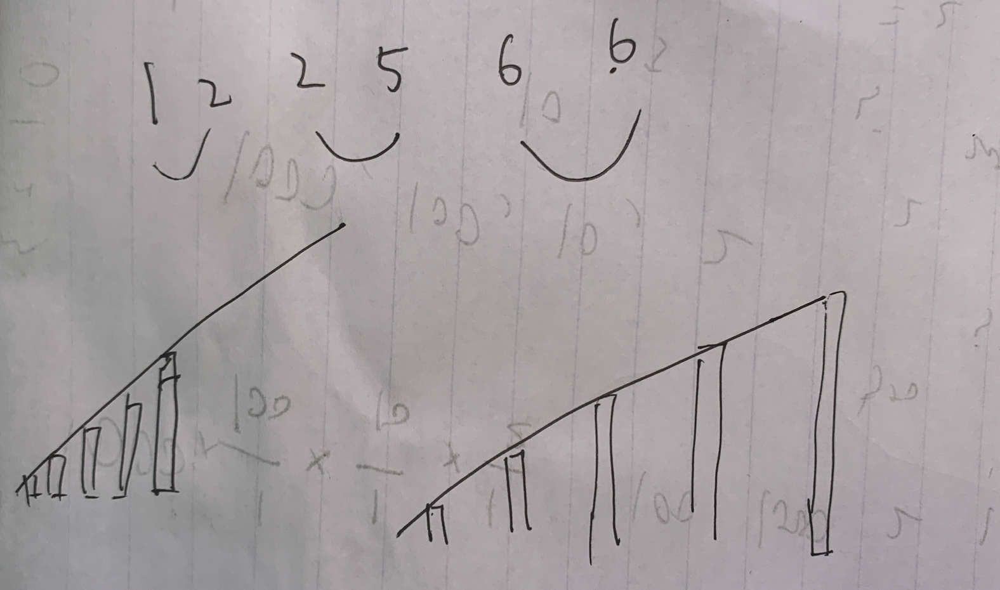

[561. 数组拆分 I](https://leetcode-cn.com/problems/array-partition-i/)

## 方法：数对贪心

一般「数对问题」都会将原数组「排序」，有的题会首尾进行结合（如1877题），而这道题是相邻结合

参考下面的图：

- 如果首尾结合，通过 min(首, 尾)，返回的是「前半部分」小的数（左边的图）
- 如果相邻结合，通过 min(左, 右)，返回的是相邻较小的数，样本会在整个空间「均匀分布」（右边的图）

显然，采用相邻结合的方法。**但这种推论不足以证明该方法的合理性**，请参照其他大佬的题解



时间复杂度：`O(nlogn)`

空间复杂度：`O(logn)`

```c++
class Solution {
public:
    int arrayPairSum(vector<int>& nums) {
        sort(nums.begin(), nums.end());
        int ans = 0;
        for (int i = 0; i < nums.size(); i += 2) {
            ans += min(nums[i], nums[i+1]);
        }
        return ans;
    }
};
```

