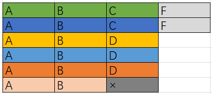

[621. 任务调度器](https://leetcode-cn.com/problems/task-scheduler/)

给你一个用字符数组 `tasks` 表示的 CPU 需要执行的任务列表。其中每个字母表示一种不同种类的任务。任务可以以任意顺序执行，并且每个任务都可以在 1 个单位时间内执行完。在任何一个单位时间，CPU 可以完成一个任务，或者处于待命状态。

然而，两个 **相同种类** 的任务之间必须有长度为整数 `n` 的冷却时间，因此至少有连续 `n` 个单位时间内 CPU 在执行不同的任务，或者在待命状态。

你需要计算完成所有任务所需要的 **最短时间** 。

```
示例 1：

输入：tasks = ["A","A","A","B","B","B"], n = 2
输出：8
解释：A -> B -> (待命) -> A -> B -> (待命) -> A -> B
     在本示例中，两个相同类型任务之间必须间隔长度为 n = 2 的冷却时间，而执行一个任务只需要一个单位时间，所以中间出现了（待命）状态。 

示例 2：

输入：tasks = ["A","A","A","B","B","B"], n = 0
输出：6
解释：在这种情况下，任何大小为 6 的排列都可以满足要求，因为 n = 0
["A","A","A","B","B","B"]
["A","B","A","B","A","B"]
["B","B","B","A","A","A"]
...
诸如此类

示例 3：

输入：tasks = ["A","A","A","A","A","A","B","C","D","E","F","G"], n = 2
输出：16
解释：一种可能的解决方案是：
     A -> B -> C -> A -> D -> E -> A -> F -> G -> A -> (待命) -> (待命) -> A -> (待命) -> (待命) -> A

```

**提示：**

- `1 <= task.length <= 104`
- `tasks[i]` 是大写英文字母
- `n` 的取值范围为 `[0, 100]`

---

题解来源：https://leetcode-cn.com/problems/task-scheduler/solution/tong-zi-by-popopop/



需要检查两个方案：

**方案一**：

- 记录最大任务数量 m（A的数量）
- 任务数量最多的任务的种类数量（如A、B），也就是最后一个桶子的任务数 x，
- 长方形的长为 n+1

```
方案一耗时：opt_1 = (m-1)*(n+1) + x
```

但是此方案，会有剩余的情况，如格子都填满后还有剩余的任务，这些任务会往第一行的后面继续加

**方案二**：

- 统计出所有的任务数量

```
方案二耗时：opt_2 = tasks.size()
```

方案二会将方案一中剩余的情况，修复

**总方案**：

- 当格子有没填满时，方案一耗时「大于」方案二耗时
- 当格子都填满，还有剩余的任务时，方案一耗时「小于」方案二耗时

```
max(opt_1, opt_2)
```

时间复杂度：`O(n)`，这里没有将种类数26作为常数去计算

空间复杂度：`O(n)`

```c++
class Solution {
public:
    int leastInterval(vector<char>& tasks, int n) {
        unordered_map<char, int> counter;
        for (char task : tasks) counter[task]++;
        int m = 0;  // 最大任务数量
        int x = 0;  // 任务数量最多的任务的种类数量
        for (auto& [k, v] : counter) {
            if (v > m) {
                m = v;
                x = 1;
            } else if (v == m) {
                x++;
            }
        }
        int opt_1 = (m - 1) * (n + 1) + x;
        int opt_2 = tasks.size();
        return max(opt_1, opt_2);
    }
};
```

