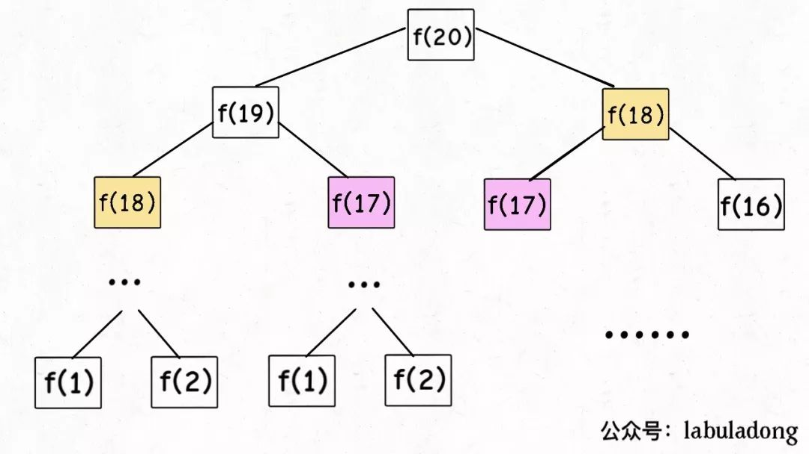

# 动态规划基础

来源 1：[动态规划基础](https://oi-wiki.org/dp/basic/)

来源 2：[动态规划详解（修订版）](https://mp.weixin.qq.com/s/Cw39C9MY9Wr2JlcvBQZMcA)

## 一、动态规划三要素

**动态规划问题的一般形式就是求最值**。动态规划其实是运筹学的一种最优化方法，只不过在计算机问题上应用比较多，比如说让你求「最长」递增子序列呀，「最小」编辑距离呀等等。

既然是要求最值，核心问题是什么呢？**求解动态规划的核心问题是穷举**。因为要求最值，肯定要把所有可行的答案穷举出来，然后在其中找最值呗。

动态规划就这么简单，就是穷举就完事了？我看到的动态规划问题都很难啊！

首先，动态规划的穷举有点特别，因为这类问题存在「**重叠子问题**」，通过把原问题分解为相对简单的子问题的方式求解复杂问题。如果暴力穷举的话效率会极其低下，所以需要「备忘录」或者「DP table」来优化穷举过程，避免不必要的计算。

而且，动态规划问题一定会具备「**最优子结构**」，才能通过子问题的最值得到原问题的最值。

另外，虽然动态规划的核心思想就是穷举求最值，但是问题可以千变万化，穷举所有可行解其实并不是一件容易的事，只有列出正确的「**状态转移方程**」才能正确地穷举。

**以上提到的重叠子问题、最优子结构、状态转移方程就是动态规划三要素**。

- 拥有「最优子结构」，可以写出普通的递归
- 拥有「最优子结构」+「重叠子问题」，可以写出记忆化搜索
- 拥有「最优子结构」+「重叠子问题」+「状态转移方程」，可以写出记忆化搜索

## 二、思维框架

- 明确「状态」
- 定义 dp 数组/函数的含义
- 明确「选择」
- 明确 base case，初始化 dp 数组

## 三、例子

### 1、斐波那契数列

#### 1）暴力递归（引出重叠子问题）

斐波那契数列的数学形式就是递归的，写成代码就是这样：

```c++
int fib(int N) {
    if (N == 1 || N == 2) return 1;
    return fib(N - 1) + fib(N - 2);
}
```

画出递归树

> 但凡遇到需要递归的问题，最好都画出递归树，这对你分析算法的复杂度，寻找算法低效的原因都有巨大帮助。



想要计算原问题`f(20)`，我就得先计算出子问题`f(19)`和`f(18)`，然后要计算`f(19)`，我就要先算出子问题`f(18)`和`f(17)`，以此类推。最后遇到`f(1)`或者`f(2)`的时候，结果已知，就能直接返回结果，递归树不再向下生长了。

**递归算法的时间复杂度怎么计算？子问题个数乘以解决一个子问题需要的时间**

子问题个数，即递归树中节点的总数。显然二叉树节点总数为指数级别，所以子问题个数为 O(2^n)

所以，这个算法的时间复杂度为 O(2^n)，指数级别，爆炸

观察递归树，很明显发现了算法低效的原因：**存在大量重复计算**，比如`f(18)`被计算了两次，而且你可以看到，以`f(18)`为根的这个递归树体量巨大，多算一遍，会耗费巨大的时间。更何况，还不止`f(18)`这一个节点被重复计算，所以这个算法及其低效。

这就是动态规划问题的第一个性质：**重叠子问题**。下面，我们想办法解决这个问题。

#### 2）带备忘录的递归解法（自顶向下解决重复子问题）

明确了问题，其实就已经把问题解决了一半。即然耗时的原因是重复计算，那么我们可以造一个「备忘录」，每次算出某个子问题的答案后别急着返回，先记到「备忘录」里再返回；每次遇到一个子问题先去「备忘录」里查一查，如果发现之前已经解决过这个问题了，直接把答案拿出来用，不要再耗时去计算了。

一般使用一个数组充当这个「备忘录」，当然也可以使用「哈希表」

```c++
int fib(int N) {
    if (N < 1) return 0;
    vector<int> memo(N + 1, 0); // 备忘录全初始化为 0
    
    return helper(memo, N);
}

int helper(vector<int>& memo, int n) {
    if (n == 1 || n == 2) return 1; // base case 
    if (memo[n] != 0) return memo[n]; // 已经计算过
    
    memo[n] = helper(memo, n - 1) + helper(memo, n - 2);
    return memo[n];
}
```


实际上，带「备忘录」的递归算法，把一棵存在巨量冗余的递归树通过「剪枝」，改造成了一幅不存在冗余的递归图，极大减少了子问题（即递归图中节点）的个数

**递归算法的时间复杂度怎么算？子问题个数乘以解决一个子问题需要的时间**

子问题个数，即图中节点的总数，由于本算法不存在冗余计算，子问题就是`f(1)`,`f(2)`,`f(3)`…`f(20)`，数量和输入规模 n = 20 成正比，所以子问题个数为 O(n)

所以，本算法的时间复杂度是 O(n)。比起暴力算法，是降维打击。

至此，带备忘录的递归解法的效率已经和迭代的动态规划一样了。实际上，这种解法和迭代的动态规划思想已经差不多，只不过这种方法叫做「自顶向下」，动态规划叫做「自底向上」

#### 3）dp 数组的迭代解法（自底向上解决重复子问题，引出状态转移方程）

有了上一步「备忘录」的启发，我们可以把这个「备忘录」独立出来成为一张表，就叫做 DP table 吧，在这张表上完成「自底向上」的推算岂不美哉！

```c++
int fib(int N) {
    vector<int> dp(N + 1, 0);
    dp[1] = dp[2] = 1;// base case
    
    for (int i = 3; i <= N; i++)
        dp[i] = dp[i - 1] + dp[i - 2];
    return dp[N];
}
```


引出「状态转移方程」这个名词，实际上就是描述问题结构的数学形式
$$
f(n) = 
\begin{cases}
1 & n=1,2 \\
f(n-1)+f(n-2) & n>2
\end{cases}
$$
为啥叫「状态转移方程」？把 f(n) 想做一个状态 n，这个状态 n 是由状态 n - 1 和状态 n - 2 相加转移而来，这就叫状态转移

#### 4）空间优化

根据斐波那契数列的状态转移方程，当前状态只和之前的两个状态有关，其实并不需要那么长的一个 DP table 来存储所有的状态，只要想办法存储之前的两个状态就行了。所以，可以进一步优化，把空间复杂度降为 O(1)

```c++
class Solution {
public:
    int fib(int n) {
        if (n == 0) return 0;
        if (n == 1) return 1;
        int pre = 0;
        int cur = 1;
        for (int i = 2; i <= n; i++) {
            int tmp = cur;
            cur = cur + pre;
            pre = tmp;

        }
        return cur;
    }
};
```

### 2、凑零钱问题

题目：给你`k`种面值的硬币，面值分别为`c1, c2 ... ck`，每种硬币的数量无限，再给一个总金额`amount`，问你**最少**需要几枚硬币凑出这个金额，如果不可能凑出，算法返回 -1 。算法的函数签名如下：

```c++
// coins 中是可选硬币面值，amount 是目标金额
int coinChange(int[] coins, int amount);
```

比如说`k = 3`，面值分别为 1，2，5，总金额`amount = 11`。那么最少需要 3 枚硬币凑出，即 11 = 5 + 5 + 1

#### 1）暴力递归（引出最优子结构）

首先，这个问题是动态规划问题，因为它具有「最优子结构」。**要符合「最优子结构」，子问题间必须互相独立**。啥叫相互独立？你肯定不想看数学证明，我用一个直观的例子来讲解

为什么说它符合最优子结构呢？比如你想求`amount = 11`时的最少硬币数（原问题），如果你知道凑出`amount = 10`的最少硬币数（子问题），你只需要把子问题的答案加一（再选一枚面值为 1 的硬币）就是原问题的答案，因为硬币的数量是没有限制的，子问题之间没有相互制约，是互相独立的

既然知道了这是个动态规划问题，就要思考**如何列出正确的状态转移方程**

**先确定「状态」**：也就是原问题和子问题中变化的变量。由于硬币数量无限，所以唯一的状态就是目标金额`amount`

**确定`dp`函数的定义**：函数 dp(n)表示，当前的目标金额是`n`，至少需要`dp(n)`个硬币凑出该金额

**确定「选择」并择优**：也就是对于每个状态，可以做出什么选择改变当前状态。具体到这个问题，无论当的目标金额是多少，选择就是从面额列表`coins`中选择一个硬币，然后目标金额就会减少：

**最后明确 base case**：显然目标金额为 0 时，所需硬币数量为 0；当目标金额小于 0 时，无解，返回 -1

```python
def coinChange(coins: List[int], amount: int):
    def dp(n):
        # base case
        if n == 0: return 0
        if n < 0: return -1
        # 求最小值，所以初始化为正无穷
        res = float('INF')
        for coin in coins:
            subproblem = dp(n - coin)
            # 子问题无解，跳过
            if subproblem == -1: continue
            res = min(res, 1 + subproblem)
        return res if res != float('INF') else -1
    return dp(amount)
```

至此，状态转移方程其实已经完成了，以上算法已经是暴力解法了，以上代码的数学形式就是状态转移方程：
$$
dp(n) = 
\begin{cases}
-1 & n<0 \\
0 & n=0 \\
min\{dp[n-coin]+1,...\} & i>0,coin\in coins
\end{cases}
$$
至此，这个问题其实就解决了，只不过需要消除一下重叠子问题，比如`amount = 11, coins = {1,2,5}`时画出递归树看看：


**时间复杂度分析：子问题总数 x 解决每个子问题的时间**

子问题总数为递归树节点个数，这个比较难看出来，是 O(n^k)，总之是指数级别的。每个子问题中含有一个 for 循环，复杂度为 O(k)。所以总时间复杂度为 O(k * n^k)，指数级别

#### 2）带备忘录的递归（自顶向下）

```python
def coinChange(coins: List[int], amount: int):
    # 备忘录
    memo = dict()
    def dp(n):
        # 查备忘录，避免重复计算
        if n in memo: return memo[n]

        if n == 0: return 0
        if n < 0: return -1
        res = float('INF')
        for coin in coins:
            subproblem = dp(n - coin)
            if subproblem == -1: continue
            res = min(res, 1 + subproblem)

        # 记入备忘录
        memo[n] = res if res != float('INF') else -1
        return memo[n]

    return dp(amount)
```

很显然「备忘录」大大减小了子问题数目，完全消除了子问题的冗余，所以子问题总数不会超过金额数 n，即子问题数目为 O(n)。处理一个子问题的时间不变，仍是 O(k)，所以总的时间复杂度是 O(kn)

#### 3）dp 数组的迭代解法（自底向上）

我们也可以自底向上使用 dp table 来消除重叠子问题，`dp`数组的定义和刚才`dp`函数类似，定义也是一样的：

**`dp[i] = x`表示，当目标金额为`i`时，至少需要`x`枚硬币**

```c++
int coinChange(vector<int>& coins, int amount) {
    // 数组大小为 amount + 1，初始值也为 amount + 1
    vector<int> dp(amount + 1, amount + 1);
    
    dp[0] = 0; // base case
    for (int i = 0; i < dp.size(); i++) {
        // 内层 for 在求所有子问题 + 1 的最小值
        for (int coin : coins) {
            if (i - coin < 0) continue; // 子问题无解，跳过
            dp[i] = min(dp[i], 1 + dp[i - coin]);
        }
    }
    return (dp[amount] == amount + 1) ? -1 : dp[amount];
}
```

> 为啥`dp`数组初始化为`amount + 1`呢，因为凑成`amount`金额的硬币数最多只可能等于`amount`（全用 1 元面值的硬币），所以初始化为`amount + 1`就相当于初始化为正无穷，便于后续取最小值


