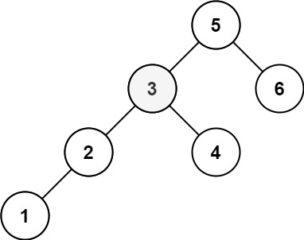

# 背包问题概述

来源：[宫水三叶 背包问题合集](https://mp.weixin.qq.com/mp/appmsgalbum?__biz=MzU4NDE3MTEyMA==&action=getalbum&album_id=1751702161341628417#wechat_redirect)

参考 1：[oi-wiki 背包dp](https://oi-wiki.org/dp/knapsack/)

参考 2：[【深度好文】详解背包问题：每五道动态规划就有一道是背包模型 ](https://mp.weixin.qq.com/s?__biz=MzU4NDE3MTEyMA==&mid=2247484403&idx=3&sn=5c0ed0793daee7a6d36e3557535a0630&chksm=fd9ca8eccaeb21fa769268082f08507e92ab63736aa829801253365676ee90ff8c2d41f32716&scene=178&cur_album_id=1748759632187047943#rd)

参考 3：[组合优化算法](https://baike.baidu.com/item/组合优化算法/20837241?fr=aladdin)

## 前置知识：组合优化算法

在有限个可行解的集合中找出最优解的一类优化问题称为组合[最优化问题](https://baike.baidu.com/item/最优化问题/9632567)，它是运筹学中的一个重要分支。所研究的问题涉及信息技术、经济管理、工业工程、交通运输、通讯网络等诸多领域。组合优化算法(optimal combination algorithm)是一类在离散状态下求极值的问题。

组合优化算法(optimal combination algorithm)一类**在离散状态下求极值的问题**。把某种离散对象按某个确定的约束条件进行安排，当已知合乎这种约束条件的特定安排存在时，寻求这种特定安排在某个优化准则下的极大解或极小解的间题。组合最优化的理论基础含线性规划、非线性规划、整数规划、动态规划、拟阵论和网络分析等。组合最优化技术提供了一个快速寻求极大解或极小解的方法 [1] 。

组合（最）优化问题是[最优化问题](https://baike.baidu.com/item/最优化问题/9632567)的一类。最优化问题似乎自然地分成两类：一类是[连续变量](https://baike.baidu.com/item/连续变量/10707410)的问题，另一类是[离散变量](https://baike.baidu.com/item/离散变量/8443404)的问题。具有离散变量的问题，我们称它为组合的。在连续变量的问题里，一般地是求一组实数，或者一个函数；在组合问题里，是从一个[无限集](https://baike.baidu.com/item/无限集/5017054)或者可数无限集里寻找一个对象——典型地是一个整数，一个集合，一个排列，或者一个图。一般地，这两类问题有相当不同的特色，并且求解它们的方法也是很不同的。对于具有离散变量的问题，从有限个解中寻找最优解的问题就是组合最优化问题。

### 应用

典型的组合优化问题有：

[旅行商问题](https://baike.baidu.com/item/旅行商问题/7737042)（Traveling Salesman Problem－TSP）；

加工调度问题（Scheduling Problem，如Flow-Shop，Job-Shop）；

0-1[背包问题](https://baike.baidu.com/item/背包问题/2416931)（Knapsack Problem）；

[装箱问题](https://baike.baidu.com/item/装箱问题/7749220)（Bin Packing Problem）；

[图着色问题](https://baike.baidu.com/item/图着色问题/8928655)（Graph Coloring Problem）；

[聚类](https://baike.baidu.com/item/聚类/593695)问题（Clustering Problem）等。

这些问题描述非常简单，并且有很强的工程代表性，但最优化求解很困难，其主要原因是求解这些问题的算法需要极长的运行时间与极大的存储空间，以致根本不可能在现有计算机上实现，即所谓的“组合爆炸”。正是这些问题的代表性和复杂性激起了人们对组合优化理论与算法的研究兴趣。

## 背包问题的本质

### 1、本质

**背包问题是「动态规划」中十分经典的一类问题，背包问题本质上属于组合优化的「 完全问题」**。

如果你不了解什么是「 完全问题」，没有关系，丝毫不影响你求解背包问题。

你可以将「 完全问题」简单理解为「无法直接求解」的问题。

例如「分解质因数」问题，我们无法像四则运算（加减乘除）那样，按照特定的逻辑进行求解。

只能通过「穷举」+「验证」的方式进行求解。

既然本质上是一个无法避免「穷举」的问题，自然会联想到「动态规划」，事实上背包问题也同时满足「无后效性」的要求。

**这就是为什么「背包问题」会使用「动态规划」来求解的根本原因**。

如果按照常见的「背包问题」的题型来抽象模型的话，「背包问题」大概是对应这样的一类问题：

**泛指一类「给定价值与成本」，同时「限定决策规则」，在这样的条件下，如何实现价值最大化的问题**。

### 2、背包问题具备的特征

**背包问题具备的特征**：是否可以根据一个 target（直接给出或间接求出，相当于背包），target 可以是数字也可以是字符串，再给定一个数组 arrs（相当于各类物品），问：能否使用 arrs 中的元素做各种排列组合得到 target。

**「01背包问题」与「完全背包问题」表面上的区别是物品是否可以重复选取**

两类背包问题（01 背包 & 完全背包）的原始状态定义都是两维：

- 第一维 i 代表物品编号
- 第二维 w 代表容量

其中第二维 又有「不超过容量 w」和「容量恰好为 w」两种定义。

> 容量恰好为 w 问题，需要定义容量不为 w 的无效值，无效值的选取是有说法的，题目要求最小值，无效值定义为INT_MAX
>
> 如 322 零钱兑换

### 3、如何联想到背包问题，并选择何种背包

从现在开始就要培养这样的习惯：

**当看到题目是给定一些「物品」，让我们从中进行选择，以达到「最大价值」或者「特定价值」时，我们应该联想到「背包问题」**。

**这本质上其实是一个组合问题：被选物品之间不需要满足特定关系，只需要选择物品，以达到「全局最优」或者「特定状态」即可**。

再根据物品的「选择次数限制」来判断是何种背包问题。

> 例如硬币找零问题，硬币相当于我们的物品，每种硬币可以选择「无限次」，我们应该很自然的想到「完全背包」。

## 一、01背包问题

「01背包」是指给定物品价值与体积（对应了「给定价值与成本」），在规定容量下（对应了「限定决策规则」）如何使得所选物品的总价值最大。由于每个物体只有两种可能的状态（取与不取），对应二进制中的 1 和 0，这类问题便被称为「0-1 背包问题」。有些题用体积有些用质量，其实都一样，都描述了这个背包的限制。

**下面三种方法都需要，完全掌握**

---

**裸题**：

有 N 件物品和一个容量是 C 的背包。**每件物品有且只有一件**。

第 i 件物品的体积是 volume[i]，价值是 worth[i]，

求解将哪些物品装入背包，可使这些物品的总体积不超过背包容量，且总价值最大。

```
输入: N = 3, C = 4, worth = [4,2,3], volume = [4,2,3]
输出: 4
解释: 只选第一件物品，可使价值最大。

输入: N = 3, C = 5, worth = [4,2,3], volume = [4,2,3]
输出: 5
解释: 不选第一件物品，选择第二件和第三件物品，可使价值最大。
```

### 1、常规 `dp[N][C+1]`  解法

**1. 定义状态**

`dp[i][c]`的定义如下：对于下标在 [0, i] 区间的物品，当前背包的容量为`c`，这种情况下可以装的最大价值是`dp[i][c]`

比如说，如果 `dp[3][5] = 6`，其含义为：对于给定的一系列物品中，对 [0, 3] 区间的4个物品进行选择，当背包容量为 5 时，最多可以装下的价值为 6。

需要将体积这一维度多申请一位，`dp[i][0]` 表示对于下标在 [0, i] 区间的物品，达到容量 0，可获得的最大价值（显然是 0）

**2. 状态转移方程**

「把物品`i`装进背包」和「不把物品`i`装进背包」分为两种情况，取两种情况的最大值

- **如果没有把这第 i 个物品装入背包，想要获得 w 的价值**，那么很显然，最大价值`dp[i][c]`应该等于`dp[i-1][c]`。不装嘛，那就继承之前的结果。
- **如果把这第`i`个物品装入了背包**，那么`dp[i][c]`应该等于 `dp[i-1][c-volume[i]] + worth[i]`

> `dp[i-1][c-volume[i]] + worth[i]` 理解：如果想装第`i`个物品，怎么计算这时候的最大价值？**换句话说，在装第`i`个物品的前提下，背包能装的最大价值是多少？**
>
> 显然，当前 `dp[i]` 的 `c` 需要从前一位的 `dp[i-1]` 的 `c-volume[i]` 转移过来，再加上第 `i` 个物品的价值`worth[i]`，这就是装第 `i` 个物品的前提下，背包可以装的最大价值。

同时要关注 `c-volume[i] >= 0`，一方面是防止数组越界，另一方面**体积是非负数**
$$
dp[i][c] = 
\begin{cases}
max(dp[i-1][c], \ dp[i-1][c-volume[i]] + worth[i]) & c-volume[i] >= 0 \\ \\
dp[i-1][c] & c-volume[i] < 0
\end{cases}
$$
**3. 初始化**

`dp[i][0]` 都为 0

初始化第一个物品，对于 [0, 0] 区间物品达到价值 c

- 如果第一个物品体积 volume[0] **小于等于** 需要达到的容量 c 时，可放入 `dp[0][c] = worth[0]`
- 如果第一个物品体积 volume[0] **大于** 需要达到的容量 c 时，不可放入 `dp[0][c] = 0`

**4. 输出**

`dp[N-1][C]`

**复杂度分析**

时间复杂度：`O(N*C)`

空间复杂度：`O(N*C)`

```cpp
int maxValue(int N, int C, vector<int>& worth, vector<int>& volume) {
    vector<vector<int>> dp(N, vector<int>(C + 1, 0));
    // 初始化第一个物品
    for (int c = 0; c <= C; c++) {
        if (volume[0] <= c) {
            dp[0][c] = worth[0];
        } else {
            dp[0][c] = 0;
        }
    }
    for (int i = 1; i < N; i++) {
        for (int c = 0; c <= C; c++) {
            int no = dp[i - 1][c];  // 不装
            int yes = 0;            // 装
            if (c - volume[i] >= 0) {
                yes = dp[i - 1][c - volume[i]] + worth[i];
            }
            dp[i][c] = max(no, yes);
        }
    }
    return dp[N - 1][C];
}
```

### 2、滚动数组 `dp[2][C+1]` 解法

根据「转移方程」，我们知道计算第 i 行格子只需要第 i 行中的某些值。

也就是计算「某一行」的时候只需要依赖「前一行」。

因此可以用一个只有两行的数组来存储中间结果，根据当前计算的行号是偶数还是奇数来交替使用第 0 行和第 1 行。

```
偶数 0 2 4

奇数 1 3 5
```

这样的空间优化方法称为「**滚动数组**」，**天然的将 cur 和 pre 的转移与奇偶变化相结合**

这种空间优化方法十分推荐，因为改动起来没有任何思维难度。

只需要将代表行的维度修改成 2，并将所有使用行维度的地方从 `i` 改成 `i%2` 或者 `i&1` 即可

```cpp
int maxValue(int N, int C, vector<int>& worth, vector<int>& volume) {
    vector<vector<int>> dp(2, vector<int>(C + 1, 0));
    // 初始化第一个物品
    for (int c = 0; c <= C; c++) {
        if (volume[0] <= c) {
            dp[0][c] = worth[0];
        } else {
            dp[0][c] = 0;
        }
    }
    for (int i = 1; i < N; i++) {
        for (int c = 0; c <= C; c++) {
            int no = dp[(i - 1) & 1][c];  // 不装
            int yes = 0;                  // 装
            if (c - volume[i] >= 0) {
                yes = dp[(i - 1) & 1][c - volume[i]] + worth[i];
            }
            dp[i & 1][c] = max(no, yes);
        }
    }
    return dp[(N - 1) & 1][C];
}
```

### 3、一维空间 `dp[C+1]` 解法

**这样做的空间复杂度和「滚动数组」优化的空间复杂度是一样的。但仍然具有意义，而且这样的「一维空间」优化，是求解其他背包问题的基础，需要重点掌握**。


不难发现当求解第 `i` 行格子的值时，不仅是只依赖第 `i-1` 行，还明确只依赖第 `i-1` 行的第 `c` 个格子和第 `c - volume[i]` 个格子

换句话说，只依赖于「上一个格子的位置」以及「上一个格子的左边位置」

因此，只要将求解第 i 行格子的顺序「从 0 到 c」改为「从 c 到 0」，就可以将原本 2 行的二维数组压缩到一行（转换为一维数组）。

「01 背包」的动态转移方程为：
$$
dp[i][c] = max(dp[i-1][c], \ dp[i-1][c-volume[i]] + val[i]) \quad c-volume[i] >= 0
$$

```cpp
int maxValue(int N, int C, vector<int>& worth, vector<int>& volume) {
    vector<int> dp(C + 1, 0);

    for (int i = 0; i < N; i++) {
        for (int c = C; c - volume[i] >= 0; c--) {
            int no = dp[c];                          // 不装
            int yes = dp[c - volume[i]] + worth[i];  // 装
            dp[c] = max(no, yes);
        }
    }
    return dp[C];
}
```

至于为什么不需要再遍历 `c - volume[i] < 0` 的情况：

「从后向前」 写的过程中，一旦 `c - volume[i]` 不满足，可以马上退出当前循环，因为后面的 `c` 的值肯定越来越小，没有必要继续做判断，直接进入外层循环的下一层。相当于也是一个剪枝，这一点是「从前向后」填表所不具备的。

### 例题

- 第 416 题：分割等和子集（中等）；
- 第 474 题：一和零（中等）；
- 第 494 题：目标和（中等）；
- 第 879 题：盈利计划（困难）；


## 二、完全背包问题

完全背包与 01 背包不同就是每种物品可以有无限多个：一共有 N 种物品，每种物品有无限多个，第 i（i 从 1 开始）种物品的体积为 volume[i]，价值为 worth[i]。在总重量不超过背包承载上限 C 的情况下，能够装入背包的最大价值是多少？

解法：

- 如果是完全背包，即数组中的元素可重复使用并且不考虑元素之间顺序，arrs 放在外循环（保证 arrs 按顺序），target在内循环。且内循环正序。

- 如果组合问题需考虑元素之间的顺序，需将 target 放在外循环，将 arrs 放在内循环，且内循环正序。

---

**裸题**：

有 N 件物品和一个容量是 C 的背包。**每种物品都有无限件**。

第 i 件物品的价值是 worth[i]，体积是 volume[i]

求解将哪些物品装入背包，可使这些物品的总体积不超过背包容量，且总价值最大。

> 其实就是在 0-1 背包问题的基础上，增加了每件物品可以选择多次的特点（在容量允许的情况下）。

```
输入: N = 2, C = 5, worth = [1,2], volume = [1,2]
输出: 5
解释: 选一件物品 1，再选两件物品 2，可使价值最大。
```

### 1、常规 `dp[N][C+1]`  解法

**1. 定义状态**

`dp[i][c]`的定义如下：对于下标在 [0, i] 区间的物品，当前背包的容量为`c`，这种情况下可以装的最大价值是`dp[i][c]`

> 需要将体积这一维度多申请一位，`dp[i][0]` 表示对于下标在 [0, i] 区间的物品，达到容量 0，可获得的最大价值（显然是 0）

**2. 状态转移方程**

由于每件物品可以被选择多次，因此对于某个 `dp[i][c]` 而言，其值应该为以下所有可能方案中的最大值：

- 选择 0 件物品 i，最大价值为 `dp[i-1][c]`
- 选择 1 件物品 i，最大价值为 `dp[i-1][c - volume[i]] + worth[i]`
- 选择 2 件物品 i，最大价值为 `dp[i-1][c - 2*volume[i]] + 2*worth[i]`
- ......
- 选择 k 件物品 i，最大价值为 `dp[i-1][c - k*volume[i]] + k*worth[i]`

由此得出「状态转移方程」为：
$$
dp[i][c] = 
max\{dp[i-1][c], \ dp[i-1][w-k*volume[i]] + k*worth[i]\}
\quad c-k*volume[i] >= 0
$$
**3. 初始化**

预处理第一件物品

当只有一件物品的时候，在容量允许的情况下，能选多少件就选多少件

`dp[0][c] = (c / volume[0]) * worth[0]`

**4. 输出**

`dp[N-1][C]`

**复杂度分析**

时间复杂度：`O(N*C*C)`

空间复杂度：`O(N*C)`

```cpp
int maxValue(int N, int C, vector<int>& worth, vector<int>& volume) {
    vector<vector<int>> dp(N, vector<int>(C + 1, 0));
    // 预处理第一件物品
    for (int c = 0; c < C; c++) {
        int maxK = c / volume[0];
        dp[0][c] = maxK * worth[0];
    }

    for (int i = 1; i < N; i++) {
        for (int c = 0; c <= C; c++) {
            int no = dp[i - 1][c];  // 不装
            int yes = 0;
            for (int k = 1; c - k * volume[i] >= 0; k++) {
                yes = max(yes, dp[i - 1][c - k * volume[i]] + worth[i]);
            }
            dp[i][c] = max(no, yes);
        }
    }

    return dp[N - 1][C];
}
```

### 2、滚动数组 `dp[2][C+1]` 解法

类似 01 背包中的解法

将 dp 数组中的 i、i-1 等，对下标加上 () & 1 运算

```cpp
int maxValue(int N, int C, vector<int>& worth, vector<int>& volume) {
    vector<vector<int>> dp(2, vector<int>(C + 1, 0));
    // 预处理第一件物品
    for (int c = 0; c < C; c++) {
        int maxK = c / volume[0];
        dp[0][c] = maxK * worth[0];
    }

    for (int i = 1; i < N; i++) {
        for (int c = 0; c <= C; c++) {
            int no = dp[(i - 1) & 1][c];  // 不装
            int yes = 0;
            for (int k = 1; c - k * volume[i] >= 0; k++) {
                yes = max(yes, dp[(i - 1) & 1][c - k * volume[i]] + worth[i]);
            }
            dp[i & 1][c] = max(no, yes);
        }
    }

    return dp[(N - 1) & 1][C];
}
```

### 3、一维空间 `dp[C+1]` 解法

之所以 01 背包能够使用「一维空间优化」解法，是因为当我们开始处理第 i 件物品的时候，数组中存储的是已经处理完的第 i-1 件物品的状态值。然后配合着我们容量维度「从大到小」的遍历顺序，可以确保我们在更新某个状态时，所需要用到的状态值不会被覆盖。

而「完全背包」区别于「01 背包」，在于每件物品可以被选择多次。**容量维度应「从小到大」的遍历顺序**。

从「数学」的角度证明：


```
1、当我们求完全背包的 dp[i][c]
dp[i][c] = max{dp[i-1][c], dp[i-1][c-volume[i]]+worth[i]}, dp[i-1][c-2*volume[i]]+2*worth[i]... dp[i-1][c-k*volume[i]]+k*worth[i]}

2、那我们看看 dp[i][c-volume[i]] 是什么，带入上述公式
dp[i][c-volume[i]] = max{dp[i-1][c-volume[i]], dp[i-1][c-2*volume[i]]+worth[i]}, dp[i-1][c-3*volume[i]]+2*worth[i], dp[i-1][c-k*volume[i]]+(k-1)*worth[i]}

3、观察上面两个公式，dp[i][c] 第一项后面的的最大值其实是 dp[i][c-volume[i]] 所有项的最大值，再加上 worth[i]

4、将 dp[i][c-volume[i]] 带入 dp[i][c]
dp[i][c] = max{dp[i-1][c], dp[i][c-volume[i]] + worth[i]}
```

「完全背包」的动态转移方程为：
$$
dp[i][c] = max(dp[i-1][c], \ dp[i][c-volume[i]] + worth[i]) \quad c-volume[i] >= 0
$$

时间复杂度：`O(N*C)`，最重要的是**时间复杂度也降了**

空间复杂度：`O(C)`

```cpp
int maxValue(int N, int C, vector<int>& worth, vector<int>& volume) {
    vector<int> dp(C + 1, 0);

    for (int i = 0; i < N; i++) {
        for (int c = 0; c <= C; c++) {
            int no = dp[c];  // 不装
            int yes = 0;
            if (c - volume[i] >= 0) {
                yes = dp[c - volume[i]] + worth[i];  // 装
            }
            dp[c] = max(no, yes);
        }
    }
    return dp[C];
}
```

根据数学证明：

- 01 背包的容量「从大到小」遍历的原因：**不可以让前一个位置上的值被提前刷新掉**
- 完全背包的容量「从小到大」遍历的原因：**需要让前一个位置上的最大值被提前计算出来**

本质原因：**两者进行状态转移时依赖了不同的格子**

- 01 背包依赖的是「**上一行正上方的格子**」和「**上一行左边的格子**」
- 完全背包依赖的是「**上一行正上方的格子**」和「**本行左边的格子**」

另一方面：

- 01 背包的容量：不计算 `c - volume[i] < 0` 的情况，因为随着 w 变小`c - volume[i]` 会更不可能，进行剪枝
- 完全背包的容量：其实也可不计算 `c - volume[i] < 0` 的情况，此时内涵了不装的情况，例如下面的写法

【推荐一维写法】

```cpp
int maxValue(int N, int C, vector<int>& worth, vector<int>& volume) {
    vector<int> dp(C + 1, 0);

    for (int i = 0; i < N; i++) {
        for (int c = 0; c <= C; c++) {
            // 这个位置内涵了不装的情况 dp[c] = dp[c]
            if (c - volume[i] >= 0) {                              // 这个判断写防止越界的条件
                dp[c] = max(dp[c], dp[c - volume[i]] + worth[i]);  // 装
            }
        }
    }
    return dp[C];
}
```

### 例题

- 第 139. 单词拆分（中等）；
- 第 322 题：零钱兑换（中等）；
- 第 518 题：零钱兑换 II（中等）；
- 第 1449 题：数位成本和为目标值的最大数字（困难）

这里要注意鉴别：「力扣」第 377 题 组合总和 Ⅳ，不是「完全背包」问题。

## 三、多重背包

有 N 种物品和一个容量为 C 的背包，每种物品「**数量有限**」

第 i 件物品的体积是 volume[i]，价值是 worth[i]，数量为 amount[i]

问选择哪些物品，每件物品选择多少件，可使得总价值最大。

其实就是在 0-1 背包问题的基础上，增加了每件物品可以选择「有限次数」的特点（在容量允许的情况下）。

```
输入: N = 2, C = 5, v = [1,2], w = [1,2], s = [2,1]   
输出: 4
解释: 选两件物品 1，再选一件物品 2，可使价值最大。
```

### 1、常规 `dp[N][C+1]` 解法

**在之前的章节我们说过，几乎所有的「背包问题」都是基于「01 背包」演变而来**。

因此，当我们确定一个问题是背包问题之后，可以根据其物品的「数量限制」来判别是何种背包问题，然后套用「01 背包」的思路来求解。

具体的，我们可以套用「01 背包」的「状态定义」来进行分析：

**1. 定义状态**

`dp[i][c]`  表示在 [0, i] 范围内的物品，当前背包的容量为`c`，这种情况下可以装的最大价值是`dp[i][c]`

**2. 状态转移方程**

由于每件物品可以被选择「有限次」，因此对于某个 `dp[i][c]` 而言，其值应该为以下所有可能方案中的最大值：

- 选择 0 件物品 i 的最大价值，即 `dp[i-1][c]`
- 选择 1 件物品 i 的最大价值，即 `dp[i-1][c - volume[i]] + worth[i]`
- 选择 2 件物品 i 的最大价值，即 `dp[i-1][c - 2*volume[i]] + 2 * worth[i]`
- ...
- 选择 k 件物品 i 的最大价值，即 `dp[i-1][c - k*volume[i]] + k * worth[i]`

可以发现其状态转移方程的过程与 「完全背包」 完全一致，**只是多了`k <= amount[i]` 的条件**。

也好理解，毕竟「完全背包」不限制物品数量，「多重背包」限制物品数量。

**3. 初始化**

先处理第一件物品

显然当只有一件物品的时候，在容量允许的情况下，能选多少件就选多少件（不超过限制数量）

**4. 输出**

`dp[N-1][C]`

**复杂度分析**

时间复杂度：`O(N*C*A)`

空间复杂度：`O(N*C)`

```cpp
int maxValue(int N, int C, vector<int>& worth, vector<int>& volume, vector<int>& amount) {
    vector<vector<int>> dp(N, vector<int>(C + 1, 0));

    // 预处理第一件物品
    for (int c = 0; c < C; c++) {
        int maxk = min(c / volume[0], amount[0]);
        dp[0][c] = maxk * worth[0];
    }

    for (int i = 1; i < N; i++) {
        for (int c = 0; c <= C; c++) {
            int no = dp[i - 1][c];  // 不选
            int yes = 0;            // 选
            for (int k = 1; c - k * volume[i] >= 0; k++) {
                if (k <= amount[i]) {
                    yes = max(yes, dp[i - 1][c - k * volume[i]] + k * worth[i]);
                }
            }
            dp[i][c] = max(no, yes);
        }
    }
    return dp[N - 1][C];
}
```

### 2、滚动数组 `dp[2][C+1]` 解法

时间复杂度：`O(N*C*A)`

空间复杂度：`O(C)`

```cpp
int maxValue(int N, int C, vector<int>& worth, vector<int>& volume, vector<int>& amount) {
    vector<vector<int>> dp(2, vector<int>(C + 1, 0));

    // 预处理第一件物品
    for (int c = 0; c < C; c++) {
        int maxk = min(c / volume[0], amount[0]);
        dp[0][c] = maxk * worth[0];
    }

    for (int i = 1; i < N; i++) {
        for (int c = 0; c <= C; c++) {
            int no = dp[(i - 1) & 1][c];  // 不选
            int yes = 0;                  // 选
            for (int k = 1; c - k * volume[i] >= 0; k++) {
                if (k <= amount[i]) {
                    yes = max(yes, dp[(i - 1) & 1][c - k * volume[i]] + k * worth[i]);
                }
            }
            dp[i & 1][c] = max(no, yes);
        }
    }
    return dp[(N - 1) & 1][C];
}
```

### 3、一维空间 `dp[C+1]` 解法

在之前的「01 背包」和「完全背包」都可以进行「一维空间优化」，其中「完全背包」的「一维空间优化」还能有效降低时间复杂度。

那么「多重背包」是否也能通过「一维空间优化」来降低时间复杂度呢？

**可以优化空间，但是不能降低时间复杂度**，因为当我们像「完全背包」那样只保留「容量维度」，并且「从小到大」遍历容量的话，我们在转移 `dp[c]` 时是**无法直接知道 `dp[c - volume[i]]` 所依赖的到底使用了多少件物品 i 的**。

这个问题在「完全背包」里面无须关心，因为每件物品可以被选择无限次，而在「多重背包」则是不能忽略，否则可能会违背物品件数有限的条件。

写法上和「01 背包」类似，容量维度「从大到小遍历」

时间复杂度：`O(N*C*A)`

空间复杂度：`O(C)`

```cpp
int maxValue(int N, int C, vector<int>& worth, vector<int>& volume, vector<int>& amount) {
    vector<int> dp(C + 1, 0);

    // 预处理第一件物品
    for (int c = 0; c < C; c++) {
        int maxk = min(c / volume[0], amount[0]);
        dp[c] = maxk * worth[0];
    }

    for (int i = 1; i < N; i++) {
        for (int c = C; c - volume[i] >= 0; c--) {  // 这里也可以写 c>=0
            for (int k = 0; k <= amount[i]; k++) {
                if (c - k * volume[i] >= 0) {
                    dp[c] = max(dp[c], dp[c - k * volume[i]] + k * worth[i]);
                }
            }
        }
    }
    return dp[C];
}
```

### 4、与其他背包的内在关系

我们发现，只有「完全背包」的「一维空间优化」是存在数学意义上的优化（能够有效降低算法时间复杂度）。

「01 背包」和「多重背包」的「一维空间优化」其实只是基于「朴素二维」解法做单纯的「滚动」操作而已（利用状态之间的依赖关系，配合遍历顺序，使得不再需要参与转移的空间能够被重新利用）。

因此，一定程度上，可以将「多重背包」看做是一种特殊的「01 背包」。

对「01 背包」中具有相同的价值 & 成本的物品进行计数，就成了对应物品的「限制件数」，「01 背包」也就转换成了「多重背包」。

同理，将「多重背包」的多件物品进行「**扁平化展开**」，就转换成了「01 背包」。

扁平化需要遍历所有物品，枚举每件物品的数量，将其添加到一个新的物品列表里。再套用「01 背包」的解决方案。

```cpp
int maxValue(int N, int C, vector<int>& worth, vector<int>& volume, vector<int>& amount) {
    // 将多件数量的同一物品进行「扁平化」展开，以 [volume[i], worth[i]] 形式存储
    vector<vector<int>> arr;
    for (int i = 0; i < N; i++) {
        int cnt = amount[i];
        while (cnt > 0) {
            arr.push_back({volume[i], worth[i]});
            cnt--;
        }
    }
    // 使用「01 背包」进行求解
    vector<int> dp(C + 1, 0);
    for (int i = 0; i < arr.size(); i++) {
        int vi = arr[i][0], wi = arr[i][1];
        for (int c = C; c - vi >= 0; c--) {
            dp[c] = max(dp[c], dp[c - vi] + wi);
        }
    }
    return dp[C];
}
```

可以发现，转换成「01 背包」之后，时间复杂度并没有发生变化。因此将「多重背包」简单的转换成「01 背包」并不能带来效率的提升

这意味着我们只能解决 10^2 数量级的「多重背包」问题

### 5、二进制优化

二进制优化可以使得我们能解决的多重背包问题数量级从 10^2 上升为 10^3

**所谓的「二进制优化」其实是指，我们如何将一个多重背包问题彻底转化为 0-1 背包问题，同时降低其复杂度**。

在上一节我们的扁平化方式是直接展开，一个数量为 10 的物品等效于 [1,1,1,1,1,1,1,1,1,1]。

**这样并没有减少运算量，但是如果我们能将 10 变成小于 10 个数，那么这样的「扁平化」就是有意义的**。

#### 如何进行有意义的压缩

学过 Linux 的都知道文件权限最高是 7，代表拥有读、写、执行的权限，但其实这个 7 是对应了 1、2、4 三个数字的，也就是 `r:1`、`w:2`、`x:4` ，三种权限的组合共有 8 种可能性。

```
___:0
r__:1
_w_:2
rw_:3
__x:4
r_x:5
_wx:6
rwx:7
```

这里就采用了 3 个数来对应 8 种情况的“压缩”方法。

我们也可以借鉴这样的思路：**将原本为 n 的物品用 ceil(log(n)) 个数来代替，从而降低算法复杂度**。

7 可以用 `1、2、4` 来代替，像刚刚提到的 10 ，我们可以使用 `1、2、4、3` 来代替，你可能会有疑问，为什么是 `1、2、4、3`，而不是 `1、2、4、6` 或者 `1、2、4、8` 呢？

其实把他们几个数加起来就知道了，`1、2、4、6` 可以表达的范围是 0~13，而 `1、2、4、8` 可以表达的范围是 0~15，而我们要求的是表达 10，大于 10 的范围是不能被选择的。

所以我们可以在 `1、2、4` （表达的范围是 0~7）的基础上，增加一个数 3（由 10 - 7 而来），这样就能满足我们需要表达的范围 0~10。

> 通过 r w x 可以组成 0-7 任意一个数，在状态转移的过程中，包含了这些可能的情况

进行扁平化：如果一件物品规定的使用次数为 7 次，我们将其扁平化为三件物品：1重量&1价值、2重量&2价值、4重量&4价值

三件物品都不选对应了我们使用该物品 0 次的情况、只选择第一件扁平物品对应使用该物品 1 次的情况、只选择第二件扁平物品对应使用该物品 2 次的情况，只选择第一件和第二件扁平物品对应了使用该物品 3 次的情况 ...

```cpp
int maxValue(int N, int C, vector<int>& worth, vector<int>& volume, vector<int>& amount) {
    // 1、扁平化
    vector<int> new_worth;
    vector<int> new_volume;
    // 我们希望每件物品都进行扁平化，所以首先遍历所有的物品
    for (int i = 0; i < N; i++) {
        int cnt = amount[i];
        for (int k = 1; k <= cnt; k *= 2) {
            new_worth.push_back(k * worth[i]);
            new_volume.push_back(k * volume[i]);
            cnt -= k;
        }
        if (cnt > 0) {
            new_worth.push_back(cnt * worth[i]);
            new_volume.push_back(cnt * volume[i]);
        }
    }

    // 2、使用「01 背包」进行求解
    int n = new_worth.size();
    vector<int> dp(C + 1, 0);
    for (int i = 0; i < n; i++) {
        for (int c = C; c - new_volume[i] >= 0; c--) {
            dp[c] = max(dp[c], dp[c - new_volume[i]] + new_worth[i]);
        }
    }
    return dp[C];
}
```

时间复杂度：$\sum^{n-1}_{i=0}log\ s[i]*C$

空间复杂度：$\sum^{n-1}_{i=0}log\ s[i]+C$

二进制优化可以「**将原本数量为 s[i] 的物品拆分成 log s[i] 件**」，使得我们转化为 01 背包后的物品数量下降了一个数量级。

### 6、单调队列优化

来源：[多重背包の单调队列优化](https://mp.weixin.qq.com/s?__biz=MzU4NDE3MTEyMA==&mid=2247486963&idx=1&sn=51d34f0f841122ed9be2335a402041e8&chksm=fd9ca6eccaeb2ffa1abe413177be376799b427b092bfb73c13e7b77e171b460f4c24b3b7d3bc&scene=178&cur_album_id=1751702161341628417#rd)

「看不懂」

**单调队列优化，某种程度上也是利用「分类」实现优化。只不过不再是针对「物品」做分类，而是针对「状态」做分类**

首先，我们还是使用一维空间优化的定义： **dp[c] 代表容量不超过 c 时的最大价值**

当遍历完所有的物品后，dp[C]  就是最优解。

在朴素的多重背包解决方案中，当我们在处理某一个物品从 `dp[0]` 到 `dp[C]` 的状态时，每次都是通过遍历当前容量 `c` 能够装多少件该物品，然后从所有遍历结果中取最优。

但事实上，**转移只会发生在「对当前物品体积取余相同」的状态之间**。

假设当前我们处理到的物品体积和价值均为 2，数量为 3，而我们背包容量为 10

那么我们转移 dp[0] 到 dp[10] 时，其实存在如下规律：

- dp[10] 只能由 dp[8]、dp[6]、dp[4] 转移而来
- dp[9] 只能由 dp[7]、dp[5]、dp[3] 转移而来
- ......
- dp[5] 只能由 dp[3]、dp[1] 转移而来
- dp[4] 只能由 dp[2]、dp[0] 转移而来
- dp[3] 只能由 dp[1] 转移而来
- dp[2] 只能由 dp[0] 转移而来

**即某个状态 `dp[c]` 只能由 `volume[i] mod c` 相同（volume[i] 为当前物品体积，c 为当前背包容量），并且比 c 小，数量不超过「物品个数」的状态值所更新**。

因此这其实是一个「滑动窗口求最值」问题。

**如果我们能够在转移 dp[c] 时，以 O(1) 或者均摊 O(1) 的复杂度从「能够参与转移的状态」中找到最大值，我们就能省掉「朴素多重背包」解决方案中最内层的“决策”循环，从而将整体复杂度降低到 O(N*C)** 

具体的，我们定义一个 数组 g，用来记录上一次物品的转移结果；定义一个 q 数组来充当队列，队列中存放本次转移的结果。

由于我们希望在 O(1) 复杂度内取得「能够参与转移的状态」中的最大值，自然期望能够在对队列头部或者尾部直接取得目标值来更新 dp[c]。

我们发现如果希望始终从队头取值更新的话，需要维持「队列元素单调」和「特定的窗口大小」

```java
class Solution {
    public int maxValue(int N, int C, int[] s, int[] v, int[] w) {
        int[] dp = new int[C + 1];
        int[] g = new int[C + 1]; // 辅助队列，记录的是上一次的结果
        int[] q = new int[C + 1]; // 主队列，记录的是本次的结果

        // 枚举物品
        for (int i = 0; i < N; i++) {
            int vi = v[i];
            int wi = w[i];
            int si = s[i];

            // 将上次算的结果存入辅助数组中
            g = dp.clone();

            // 枚举余数
            for (int j = 0; j < vi; j++) {
                // 初始化队列，head 和 tail 分别指向队列头部和尾部
                int head = 0, tail = -1;
                // 枚举同一余数情况下，有多少种方案。
                // 例如余数为 1 的情况下有：1、vi + 1、2 * vi + 1、3 * vi + 1 ...
                for (int k = j; k <= C; k+=vi) {
                    dp[k] = g[k];
                    // 将不在窗口范围内的值弹出
                    if (head <= tail && q[head] < k - si * vi) head++;
                    // 如果队列中存在元素，直接使用队头来更新
                    if (head <= tail) dp[k] = Math.max(dp[k], g[q[head]] + (k - q[head]) / vi * wi);
                    // 当前值比对尾值更优，队尾元素没有存在必要，队尾出队
                    while (head <= tail && g[q[tail]] - (q[tail] - j) / vi * wi <= g[k] - (k - j) / vi * wi) tail--;
                    // 将新下标入队 
                    q[++tail] = k;
                }
            }
        }
        return dp[C];
    }
}
```

- 时间复杂度：`O(N*C)`
- 空间复杂度：`O(C)`

## 四、混合背包

这里再回顾一下三种传统背包：

- [01 背包](https://mp.weixin.qq.com/s?__biz=MzU4NDE3MTEyMA==&mid=2247485638&idx=1&sn=d7468955c5b121664031fd5c1b5a6f10&scene=21#wechat_redirect)：强调每件物品**「只能选择一次」**。对其进行「一维空间优化」并不能降低时间复杂度，进行「一维空间优化」时要求**「容量维度“从大到小”进行遍历」**。
- [完全背包](https://mp.weixin.qq.com/s?__biz=MzU4NDE3MTEyMA==&mid=2247486107&idx=1&sn=e5fa523008fc5588737b7ed801caf4c3&chksm=fd9ca184caeb28926959c0987208a3932ed9c965267ed366b5b82a6fc16d42f1ff40c29db5f1&token=990510480&lang=zh_CN&scene=21#wechat_redirect)：强调每件物品**「可以选择无限次」**。对其进行「一维空间优化」具有数学意义，可以将时间复杂度从 `O(N*N*C)` 降低到 `O(N*C)`，进行「一维空间优化」时要求**「容量维度“从小到大”进行遍历」**。
- [多重背包](https://mp.weixin.qq.com/s?__biz=MzU4NDE3MTEyMA==&mid=2247486649&idx=1&sn=ba09ee2d78377c2ddbb9e43622880133&chksm=fd9ca7a6caeb2eb0db61b7604a4aaa8d3ca90d6bc05eb6f50aaab415c4bd7f0047c1ca591018&token=1008907671&lang=zh_CN&scene=21#wechat_redirect)：强调每件物品**「只能选择有限次」**。对其无论是进行「一维空间优化」还是「普通扁平化」都不能降低时间复杂度，要应用额外的优化手段：[二进制优化](https://mp.weixin.qq.com/s?__biz=MzU4NDE3MTEyMA==&mid=2247486796&idx=1&sn=a382b38f8aed295410550bb1767437bd&chksm=fd9ca653caeb2f456262bbf70ffe1eeda8758b426a901a6ac15be184e7017870020e456c6fa2&token=1821593597&lang=zh_CN&scene=21#wechat_redirect) 或 [单调队列优化](https://mp.weixin.qq.com/s?__biz=MzU4NDE3MTEyMA==&mid=2247486963&idx=1&sn=51d34f0f841122ed9be2335a402041e8&chksm=fd9ca6eccaeb2ffa1abe413177be376799b427b092bfb73c13e7b77e171b460f4c24b3b7d3bc&token=496118769&lang=zh_CN&scene=21#wechat_redirect) 。

三种背包问题的**「难易程度」**是**「递增」**，但**「重要程度」**则是**「递减」** 的。

虽然「多重背包」的 [二进制优化](https://mp.weixin.qq.com/s?__biz=MzU4NDE3MTEyMA==&mid=2247486796&idx=1&sn=a382b38f8aed295410550bb1767437bd&chksm=fd9ca653caeb2f456262bbf70ffe1eeda8758b426a901a6ac15be184e7017870020e456c6fa2&token=1821593597&lang=zh_CN&scene=21#wechat_redirect) 和 [单调队列优化](https://mp.weixin.qq.com/s?__biz=MzU4NDE3MTEyMA==&mid=2247486963&idx=1&sn=51d34f0f841122ed9be2335a402041e8&chksm=fd9ca6eccaeb2ffa1abe413177be376799b427b092bfb73c13e7b77e171b460f4c24b3b7d3bc&token=496118769&lang=zh_CN&scene=21#wechat_redirect) 都比较 trick。

但其实「多重背包」并没有这么常见，以至于在 LeetCode 上我都没找到与「多重背包」相关的题目。

同时三种背包问题都有「**不超过**」和「**恰好**」两种状态定义。**这两种状态定义只在「初始化」上有区别**

至于该如何初始化则要抓住 **什么样的状态是合法的** ：

- 对于「不超过」的状态定义： `dp[0][c]` 均为合法值 0。

  代表不考虑任何物品，背包容量「不超过 」的所取得的最大价值为 0。

- 对于「恰好」的状态定义：`dp[0][c]` 中只有 `dp[0][0]` 为合法值 0，其他值均为“无效值”。

  代表不考虑任何物品，只有背包容量「恰好为 0」时所取得的最大价值为 ；其他容量「恰好为非 0」是无法取得有效价值的（因为不考虑任何物品）。

总的来说，三种背包问题都很经典（本质上都是组合优化问题），以至于「背包问题」直接成为了一类的动态规划模型。

**我的建议是三种背包都需要掌握。但如果实在要分侧重点的话，我更愿意你将大多数时间花在「01 背包」和「完全背包」上**。

---

给定物品数量 N 和背包容量 C。第 i 件物品的体积是 volume[i]，价值是 worth[i]，可用数量为 amount[i]：

- 当 amount[i] 为 -1 代表是该物品只能用一次
- 当 amount[i] 为 0 代表该物品可以使用无限次
- 当 amount[i] 为任意正整数则代表可用 amount[i] 次

求解将哪些物品装入背包可使这些物品的费用总和不超过背包容量，且价值总和最大。

---

**基本分析**

混合背包其实就是综合了「01 背包」、「完全背包」和「多重背包」三种传统背包问题。

我们知道在一维空间优化方式中「01 背包」将当前容量 c 按照“从大到小”进行遍历，而「完全背包」则是将当前容量 c 按照“从小到大”进行遍历。

同时「多重背包」可以通过「二进制优化」彻底转移成「01 背包」。

所以我们只需要**根据第 i 个物品是「01 背包」物品还是「完全背包」物品，选择不同的遍历顺序即可**。

```cpp
int maxValue(int N, int C, vector<int>& worth, vector<int>& volume, vector<int>& amount) {
    // 构造出物品的「价值」和「体积」列表
    vector<int> new_worth;
    vector<int> new_volume;
    // 我们希望每件物品都进行扁平化，所以首先遍历所有的物品
    for (int i = 0; i < N; i++) {
        int cnt = amount[i];

        // 多重背包：应用「二进制优化」转换为 0-1 背包问题
        if (cnt > 0) {
            for (int k = 1; k <= cnt; k *= 2) {
                new_worth.push_back(k * worth[i]);
                new_volume.push_back(k * volume[i]);
                cnt -= k;
            }
            if (cnt > 0) {
                new_worth.push_back(cnt * worth[i]);
                new_volume.push_back(cnt * volume[i]);
            }
        } else if (cnt == -1) {  // 01 背包：直接添加
            new_worth.push_back(worth[i]);
            new_volume.push_back(volume[i]);
        } else if (cnt == 0) {  // 完全背包：对 worth 做翻转进行标记
            new_worth.push_back(-worth[i]);
            new_volume.push_back(volume[i]);
        }
    }

    // 使用「一维空间优化」方式求解三种背包问题
    int n = new_worth.size();
    vector<int> dp(C + 1, 0);
    for (int i = 0; i < n; i++) {
        int wor = new_worth[i];
        int vol = new_volume[i];
        // 完全背包：容量「从小到大」进行遍历
        if (wor < 0) {
            for (int c = vol; c <= C; c++) {
                dp[c] = max(dp[c], dp[c - vol] - wor);  // 同时记得将 worth 重新翻转为正整数
            }
        } else {
            // 01 背包：包括「原本的 01 背包」和「经过二进制优化的完全背包」
            // 容量「从大到小」进行遍历
            for (int c = C; c - vol >= 0; c--) {
                dp[c] = max(dp[c], dp[c - vol] + wor);
            }
        }
    }
    return dp[C];
}
```

## 五、分组背包

给定 **N 个物品组**，和容量为 C 的背包。

第 i 个物品组共有 amount[i] 件物品（每件各不相同），其中第 i 组的第 j 件物品的成本为 `volume[i][j]`，价值为 `worth[i][j]`。

每组有若干个物品，同一组内的物品最多只能选一个。

求解将哪些物品装入背包可使这些物品的费用总和不超过背包容量，且价值总和最大。

示例：

```
输入：N = 2, C = 9, amount = [2, 3], volume = [[1,2,-1],[1,2,3]], worth = [[2,4,-1],[1,3,6]]
输出：10
```

- 0 < N, C, amount[i] < 100

---

### 1、常规解法

**1. 定义状态**

`dp[i][c]` 为考虑前 i 个物品组，背包容量不超过 c 的最大价值

**2. 状态转移方程**

由于每组有若干个物品，且每组「最多」选择一件物品。即对于第 i 组而言，可决策的方案如下：

- 不选择该组的任何物品：`dp[i][c] = dp[i-1][c]`
- 选该组的第一件物品：`dp[i][c] = dp[i-1][c-volume[i][0]] + worth[i][0]`
- 选该组的第二件物品：`dp[i][c] = dp[i-1][c-volume[i][1]] + worth[i][1]`
- ...
- 选该组的最后一件物品：`dp[i][c] = dp[i-1][c-volume[i][amount[i-1]]] + worth[i][amount[i-1]]`

显然最终的 `dp[i][c]` 应该是从所有方案里取最大值

**复杂度分析**

时间复杂度：`O(N*C)`，N 为所有物品

空间复杂度：`O(N*C)`

```cpp
int maxValue(int N, int C, vector<vector<int>>& worth, vector<vector<int>>& volume, vector<int>& amount) {
    vector<vector<int>> dp(N + 1, vector<int>(C + 1, 0));
    for (int i = 1; i <= N; i++) {
        vector<int> vi = volume[i - 1];
        vector<int> wi = worth[i - 1];
        int kmax = amount[i - 1];
        for (int c = 0; c <= C; c++) {
            dp[i][c] = dp[i - 1][c];
            for (int k = 0; k < kmax; k++) {
                if (c - vi[k] >= 0) {
                    dp[i][c] = max(dp[i][c], dp[i - 1][c - vi[k]] + wi[k]);
                }
            }
        }
    }
    return dp[N][C];
}
```

### 2、滚动数组

```cpp
int maxValue(int N, int C, vector<vector<int>>& worth, vector<vector<int>>& volume, vector<int>& amount) {
    vector<vector<int>> dp(2, vector<int>(C + 1, 0));
    for (int i = 1; i <= N; i++) {
        vector<int> vi = volume[i - 1];
        vector<int> wi = worth[i - 1];
        int kmax = amount[i - 1];
        for (int c = 0; c <= C; c++) {
            dp[i & 1][c] = dp[(i - 1) & 1][c];
            for (int k = 0; k < kmax; k++) {
                if (c - vi[k] >= 0) {
                    dp[i & 1][c] = max(dp[i & 1][c], dp[(i - 1) & 1][c - vi[k]] + wi[k]);
                }
            }
        }
    }
    return dp[N & 1][C];
}
```

### 3、一维空间

进一步，我们可以用「01 背包」类似的思路，进行一维空间优化：

1. 取消物品维度；
2. 将容量维度的遍历顺序修改为「从大到小」（确保所依赖的值不会被覆盖）。

时间复杂度没降

```cpp
int maxValue(int N, int C, vector<vector<int>>& worth, vector<vector<int>>& volume, vector<int>& amount) {
    vector<int> dp(C + 1, 0);
    for (int i = 1; i <= N; i++) {
        vector<int> vi = volume[i - 1];
        vector<int> wi = worth[i - 1];
        int kmax = amount[i - 1];
        for (int c = C; c >= 0; c--) {
            // 此处内涵了不选的情况，dp[c]=dp[c]
            for (int k = 0; k < kmax; k++) {
                if (c - vi[k] >= 0) {
                    dp[c] = max(dp[c], dp[c - vi[k]] + wi[k]);
                }
            }
        }
    }
    return dp[C];
}
```

## 六、多维背包

这是 LeetCode 上的「474. 一和零」，难度为 Medium

给你一个二进制字符串数组 strs 和两个整数 m 和 n 。

请你找出并返回 strs 的最大子集的长度，该子集中 最多 有 m 个 0 和 n 个 1 。

如果 x 的所有元素也是 y 的元素，集合 x 是集合 y 的 子集 。

```
输入：strs = ["10", "0001", "111001", "1", "0"], m = 5, n = 3
输出：4
解释：最多有 5 个 0 和 3 个 1 的最大子集是 {"10","0001","1","0"} ，因此答案是 4 。
其他满足题意但较小的子集包括 {"0001","1"} 和 {"10","1","0"} 。{"111001"} 不满足题意，因为它含 4 个 1 ，大于 n 的值 3 。

输入：strs = ["10", "0", "1"], m = 1, n = 1
输出：2
解释：最大的子集是 {"0", "1"} ，所以答案是 2 。
```

- 1 <= strs.length <= 600
- 1 <= strs[i].length <= 100
- strs[i] 仅由 '0' 和 '1' 组成
- 1 <= m, n <= 100

---

### 基本分析

通常与「背包问题」相关的题考察的是**将原问题转换为「背包问题」的能力**。

要将原问题转换为「背包问题」，往往需要从题目中抽象出「价值」与「成本」的概念。

这道题如果抽象成「背包问题」的话，应该是：

**每个字符串的价值都是 1（对答案的贡献都是 1），选择的成本是该字符串中 1 的数量和 0 的数量**

问我们在 1 的数量不超过 m，0 的数量不超过 n 的条件下，最大价值是多少。

由于每个字符串只能被选一次，且每个字符串的选与否对应了「价值」和「成本」，求解的问题也是「最大价值」是多少。

### 1、（多维）01 背包

有了基本分析，我们可以直接套用 01 背包的「状态定义」来做：

**1. 定义状态**

`dp[i][c0][c1]` 表示 [0, i] 范围内的物品，数字 0 的容量不超过 c0，在数字 1 的容量不超过 c1，的条件下的「最大价值」

每个字符串的价值为 1

**2. 状态转移方程**
$$
dp[i][c0][c1] = max\{ dp[i-1][c0][c1], \ dp[i-1][c0-cnt[i][0]][c1-cnt[i][1]]+1\}
$$
其中 cnt 数组记录的是字符串中出现的 0、1 数量。

**3. 初始化**

预处理第一个物品的情况

**4. 输出**

`dp[k-1][m][n]`

**复杂度分析**

时间复杂度：$O(k*m*n + \sum^{k-1}_{i=0}len(strs[i]))$

空间复杂度：`O(k*m*n)`

```cpp
class Solution {
public:
    int findMaxForm(vector<string>& strs, int m, int n) {
        int sz = strs.size();
        vector<vector<vector<int>>> dp(sz, vector<vector<int>>(m + 1, vector<int>(n + 1, 0)));

        // 计算每一个字符包含 0 和 1 的数量
        vector<vector<int>> cnt;
        for (string str : strs) {
            int zero = 0, one = 0;
            for (char c : str) {
                if (c == '0') {
                    zero++;
                } else if (c == '1') {
                    one++;
                }
            }
            cnt.push_back({zero, one});
        }

        // 预处理第一物品
        for (int c0 = 0; c0 <= m; c0++) {
            for (int c1 = 0; c1 <= n; c1++) {
                if (cnt[0][0] <= c0 && cnt[0][1] <= c1) {
                    dp[0][c0][c1] = 1;
                } else {
                    dp[0][c0][c1] = 0;
                }
            }
        }

        for (int i = 1; i < sz; i++) {
            int zero = cnt[i][0];
            int one = cnt[i][1];
            for (int c0 = 0; c0 <= m; c0++) {
                for (int c1 = 0; c1 <= n; c1++) {
                    // 不选择第 i 件物品
                    int no = dp[i - 1][c0][c1];
                    // 选择第 i 件物品
                    int yes = 0;
                    if (c0 - zero >= 0 && c1 - one >= 0) {
                        yes = dp[i - 1][c0 - zero][c1 - one] + 1;
                    }
                    dp[i][c0][c1] = max(no, yes);
                }
            }
        }
        return dp[sz - 1][m][n];
    }
};
```

换下定义的方式，可简化下代码

`dp[i][c0][c1]` 表示前 i 件物品，数字 0 的容量不超过 c0，在数字 1 的容量不超过 c1，的条件下的「最大价值」

```cpp
class Solution {
public:
    int findMaxForm(vector<string>& strs, int m, int n) {
        int sz = strs.size();
        vector<vector<vector<int>>> dp(sz + 1, vector<vector<int>>(m + 1, vector<int>(n + 1, 0)));

        // 计算每一个字符包含 0 和 1 的数量
        vector<vector<int>> cnt;
        for (string str : strs) {
            int zero = 0, one = 0;
            for (char c : str) {
                if (c == '0') {
                    zero++;
                } else if (c == '1') {
                    one++;
                }
            }
            cnt.push_back({zero, one});
        }

        for (int i = 1; i <= sz; i++) {
            int zero = cnt[i - 1][0];
            int one = cnt[i - 1][1];
            for (int c0 = 0; c0 <= m; c0++) {
                for (int c1 = 0; c1 <= n; c1++) {
                    // 不选择第 i 件物品
                    int no = dp[i - 1][c0][c1];
                    // 选择第 i 件物品
                    int yes = 0;
                    if (c0 - zero >= 0 && c1 - one >= 0) {
                        yes = dp[i - 1][c0 - zero][c1 - one] + 1;
                    }
                    dp[i][c0][c1] = max(no, yes);
                }
            }
        }
        return dp[sz][m][n];
    }
};
```

### 2、滚动数组

`dp[i][c0][c1]` 表示前 i 件物品，数字 0 的容量不超过 c0，在数字 1 的容量不超过 c1，的条件下的「最大价值」

```cpp
class Solution {
public:
    int findMaxForm(vector<string>& strs, int m, int n) {
        int sz = strs.size();
        vector<vector<vector<int>>> dp(2, vector<vector<int>>(m + 1, vector<int>(n + 1, 0)));

        // 计算每一个字符包含 0 和 1 的数量
        vector<vector<int>> cnt;
        for (string str : strs) {
            int zero = 0, one = 0;
            for (char c : str) {
                if (c == '0') {
                    zero++;
                } else if (c == '1') {
                    one++;
                }
            }
            cnt.push_back({zero, one});
        }

        for (int i = 1; i <= sz; i++) {
            int zero = cnt[i - 1][0];
            int one = cnt[i - 1][1];
            for (int c0 = 0; c0 <= m; c0++) {
                for (int c1 = 0; c1 <= n; c1++) {
                    // 不选择第 i 件物品
                    int no = dp[(i - 1) & 1][c0][c1];
                    // 选择第 i 件物品
                    int yes = 0;
                    if (c0 - zero >= 0 && c1 - one >= 0) {
                        yes = dp[(i - 1) & 1][c0 - zero][c1 - one] + 1;
                    }
                    dp[i & 1][c0][c1] = max(no, yes);
                }
            }
        }
        return dp[sz & 1][m][n];
    }
};
```

### 3、一维空间

```cpp
class Solution {
public:
    int findMaxForm(vector<string>& strs, int m, int n) {
        int sz = strs.size();

        // 计算每一个字符包含 0 和 1 的数量
        vector<vector<int>> cnt;
        for (string str : strs) {
            int zero = 0, one = 0;
            for (char c : str) {
                if (c == '0') {
                    zero++;
                } else if (c == '1') {
                    one++;
                }
            }
            cnt.push_back({zero, one});
        }

        vector<vector<int>> dp(m + 1, vector<int>(n + 1, 0));

        for (int i = 0; i < sz; i++) {
            int zero = cnt[i][0];
            int one = cnt[i][1];
            for (int c0 = m; c0 >= 0; c0--) {
                for (int c1 = n; c1 >= 0; c1--) {
                    // 此时内涵了不选当前的情况 dp[i] = dp[i]
                    if (c0 - zero >= 0 && c1 - one >= 0) {
                        dp[c0][c1] = max(dp[c0][c1], dp[c0 - zero][c1 - one] + 1);
                    }
                }
            }
        }
        return dp[m][n];
    }
};
```

## 七、树形背包

有 N 个物品和一个容量为 C 的背包，物品编号为 0 - N-1。

物品之间具有依赖关系，且依赖关系组成一棵树的形状。

如下图所示：




如果选择一个物品，则必须选择它的父节点。

第 i 件物品的体积为 `volume[i]`，价值为 `worth[i]`，其父节点物品编号为 `parent[i]`，其中根节点 `parent[i]=-1`

求解将哪些物品装入背包，可使这些物品的总体积不超过背包容量，且总价值最大。

提示：0 < N, C < 100

---

树形背包又称为 **树上背包** 或是 **有依赖的背包问题**，其是「树形 DP」与「分组背包」的结合。

在常规的「分组背包」问题中，我们采用的状态定义为：

`f[i][j]` 为考虑前 i 个物品组，背包容量不超过 j 的最大价值

从状态定义我们发现，常规的分组背包问题对物品组的考虑是“线性“的（从前往后考虑每个物品组）。

然后在状态转移时，由于物品组之间没有依赖关系，限制只发生在”组内“（每组「最多」选择一件物品）。

所以常规分组背包问题只需要采取「**枚举物品组 - 枚举背包容量 - 枚举组内物品（决策）**」的方式进行求解即可。

**1. 定义状态**

而在树形背包问题中，每个物品的决策与其父节点存在依赖关系，因此我们将”线性“的状态定义调整为”树形“的：

`f[u][j]` 为考虑以 `u` 为根的子数，背包容量不超过 `j` 的最大价值

**2. 状态转移方程**

首先，根据树形背包的题目限制，对于以 `u` 为根的子树，无论选择哪个节点，都需要先把父节点选上。

在此前提下，我们不失一般性的考虑 `f[u][j]` 该如何转移：

如果从选择节点 `u` 的哪些子树入手的话，我们发现节点 `u` 最坏情况下会有 100 个子节点，而每个子节点都有选和不选两种决策，因此总的方案数为 `2^100`，这显然是不可枚举的。

**这时候可以从”已有维度“的层面上对方案进行划分，而不是单纯的处理每一个具体方案**。

我们知道最终这 `2^100` 个方案的最大价值会用于更新 。

我们可以根据「容量」这个维度对这 `2^100` 个方案进行划分：

- 消耗容量为 0 的方案数的最大价值；
- 消耗容量为 1 的方案数的最大价值；
- ...
- 消耗容量为 `j-volume[u]` 的方案数的最大价值；

消耗的容量的范围为 `[0, j-volume[u]]`，是因为需要预留 `volume[u]` 的容量选择当前的根节点 `u`。

综上，最终的状态转移方程为（`x` 为节点 `u` 的子节点）：
$$
f[u][j] = max\{f[u][j], \ f[u][j-k]+f[x][k] \} \quad 0 \leq k \leq j-volume[u]
$$
从状态转移方式发现，在计算 `f[x][j]` 时需要用到 `f[x][k]`，因此我们需要先递归处理节点 `u` 的子节点 `x` 的状态值。

**3. 初始化**

**4. 输出**

**空间优化**

**复杂度分析**

- 时间复杂度：建图的复杂度为 `O(n)`；共有 `n*c` 个状态需要被计算，每个状态的计算需要遍历分配多少容量给子节点，复杂度为 `O(c)`。整体复杂度为`O(n*c*c)`
- 空间复杂度：`O(n*c)`

```java
class Solution {
    int N = 110, M = N * 2;
    int[] he = new int[N], e = new int[M], ne = new int[M];
    int[] vi, wi;
    int n, c, idx;
    // 定义 f[u][j] 为考虑以 u 为根的子树，背包容量不超过 j 的最大价值
    int[][] f = new int[N][N];

    // 链式向前星存图
    void add(int a, int b) {
        e[idx] = b;
        ne[idx] = he[a];
        he[a] = idx;
        idx++;
    }

    void dfs(int u) {
        // 节点 u 的价值和体积
        int cw = wi[u], cv = vi[u];
        // 要选任一节点，必须先选 u，同时也限制了至少需要 cv 的容量
        for (int i = cv; i <= c; i++) f[u][i] += cw;

        // 遍历节点 u 的所有子节点 x（分组背包遍历物品组）
        for (int i = he[u]; i != -1; i = ne[i]) {
            int x = e[i];
            // 递归处理节点 x
            dfs(x); 
            // 从大到小遍历背包容量（分组背包遍历容量）
            for (int j = c; j >= 0; j--) {
                // 遍历给节点 x 分配多少背包容量（分组背包遍历决策）
                for (int k = 0; k <= j - cv; k++) {
                    f[u][j] = Math.max(f[u][j], f[u][j - k] + f[x][k]);        
                }
            }
        }
    }

    public int maxValue(int N, int C, int[] p, int[] v, int[] w) {
        n = N; c = C;
        vi = v; wi = w;
        Arrays.fill(he, -1);
        int root = -1;
        for (int i = 0; i < n; i++) {
            if (p[i] == -1) {
                root = i;
            } else {
                add(p[i], i);
            }
        }
        dfs(root);
        return f[root][c];
    }
}
```

### 例题

[【动态规划/背包问题】树形背包问题练习篇](https://mp.weixin.qq.com/s?__biz=MzU4NDE3MTEyMA==&mid=2247488337&idx=1&sn=016e65bdff75841c9041a14adeb24f64&chksm=fd9cb84ecaeb315881676b5a5f72e5fa29073a316157f9175473852557ef2eeac33510ca66b5&scene=178&cur_album_id=1751702161341628417#rd)

[【动态规划/背包问题】树形背包问题练习篇（二进制枚举）](https://mp.weixin.qq.com/s?__biz=MzU4NDE3MTEyMA==&mid=2247488400&idx=1&sn=7ec15fd8dbb8d85fb9a895a7073157ce&chksm=fd9cb88fcaeb3199af0f638e39829591a9aef2210bb2254852e91c4b2d1003c5161a68944fe5&scene=178&cur_album_id=1751702161341628417#rd)


| 题目                                                         | 题解                                                         | 难度 |       |
| ------------------------------------------------------------ | ------------------------------------------------------------ | ---- | ----- |
| [279. 完全平方数](https://leetcode-cn.com/problems/perfect-squares/) | [LeetCode 题解链接](https://leetcode-cn.com/problems/perfect-squares/solution/gong-shui-san-xie-xiang-jie-wan-quan-bei-nqes/) | 中等 | 🤩🤩🤩🤩  |
| [322. 零钱兑换](https://leetcode-cn.com/problems/coin-change/) | [LeetCode 题解链接](https://leetcode-cn.com/problems/coin-change/solution/dong-tai-gui-hua-bei-bao-wen-ti-zhan-zai-3265/) | 中等 | 🤩🤩🤩🤩  |
| [416. 分割等和子集](https://leetcode-cn.com/problems/partition-equal-subset-sum/) | [LeetCode 题解链接](https://leetcode-cn.com/problems/partition-equal-subset-sum/solution/gong-shui-san-xie-bei-bao-wen-ti-xia-con-mr8a/) | 中等 | 🤩🤩🤩🤩🤩 |
| [474. 一和零](https://leetcode-cn.com/problems/ones-and-zeroes/) | [LeetCode 题解链接](https://leetcode-cn.com/problems/ones-and-zeroes/solution/gong-shui-san-xie-xiang-jie-ru-he-zhuan-174wv/) | 中等 | 🤩🤩🤩🤩🤩 |
| [494. 目标和](https://leetcode-cn.com/problems/target-sum/)  | [LeetCode 题解链接](https://leetcode-cn.com/problems/target-sum/solution/gong-shui-san-xie-yi-ti-si-jie-dfs-ji-yi-et5b/) | 中等 | 🤩🤩🤩🤩  |
| [518. 零钱兑换 II](https://leetcode-cn.com/problems/coin-change-2/) | [LeetCode 题解链接](https://leetcode-cn.com/problems/coin-change-2/solution/gong-shui-san-xie-xiang-jie-wan-quan-bei-6hxv/) | 中等 | 🤩🤩🤩🤩  |
| [638. 大礼包](https://leetcode-cn.com/problems/shopping-offers/) | [LeetCode 题解链接](https://leetcode-cn.com/problems/shopping-offers/solution/gong-shui-san-xie-yi-ti-shuang-jie-zhuan-qgk1/) | 中等 | 🤩🤩🤩🤩  |
| [879. 盈利计划](https://leetcode-cn.com/problems/profitable-schemes/) | [LeetCode 题解链接](https://leetcode-cn.com/problems/profitable-schemes/solution/gong-shui-san-xie-te-shu-duo-wei-fei-yon-7su9/) | 困难 | 🤩🤩🤩🤩🤩 |
| [1049. 最后一块石头的重量 II](https://leetcode-cn.com/problems/last-stone-weight-ii/) | [LeetCode 题解链接](https://leetcode-cn.com/problems/last-stone-weight-ii/solution/gong-shui-san-xie-xiang-jie-wei-he-neng-jgxik/) | 中等 | 🤩🤩🤩🤩  |
| [1155. 掷骰子的N种方法](https://leetcode-cn.com/problems/number-of-dice-rolls-with-target-sum/) | [LeetCode 题解链接](https://leetcode-cn.com/problems/number-of-dice-rolls-with-target-sum/solution/dong-tai-gui-hua-bei-bao-wen-ti-yun-yong-axtf/) | 中等 | 🤩🤩🤩🤩  |
| [1449. 数位成本和为目标值的最大数字](https://leetcode-cn.com/problems/form-largest-integer-with-digits-that-add-up-to-target/) | [LeetCode 题解链接](https://leetcode-cn.com/problems/form-largest-integer-with-digits-that-add-up-to-target/solution/gong-shui-san-xie-fen-liang-bu-kao-lu-we-uy4y/) | 困难 | 🤩🤩🤩🤩  |
| [1995. 统计特殊四元组](https://leetcode-cn.com/problems/count-special-quadruplets/) | [LeetCode 题解链接](https://leetcode-cn.com/problems/count-special-quadruplets/solution/gong-shui-san-xie-yi-ti-si-jie-mei-ju-ha-gmhv/) | 简单 | 🤩🤩🤩🤩  |

