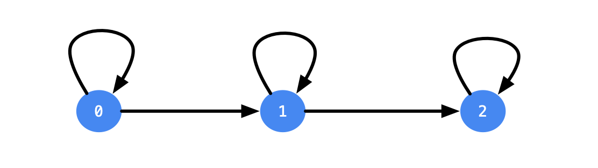

# 股票问题

参考：[Most consistent ways of dealing with the series of stock problems](https://leetcode.com/problems/best-time-to-buy-and-sell-stock-with-transaction-fee/discuss/108870/Most-consistent-ways-of-dealing-with-the-series-of-stock-problems)

参考翻译：[股票问题系列通解（转载翻译）](https://leetcode.cn/circle/article/qiAgHn/)

股票问题一共有六道题：

- [121. 买卖股票的最佳时机](https://leetcode-cn.com/problems/best-time-to-buy-and-sell-stock/)
- [122. 买卖股票的最佳时机 II](https://leetcode-cn.com/problems/best-time-to-buy-and-sell-stock-ii/)
- [123. 买卖股票的最佳时机 III](https://leetcode-cn.com/problems/best-time-to-buy-and-sell-stock-iii/)
- [188. 买卖股票的最佳时机 IV](https://leetcode-cn.com/problems/best-time-to-buy-and-sell-stock-iv/)
- [309. 最佳买卖股票时机含冷冻期](https://leetcode-cn.com/problems/best-time-to-buy-and-sell-stock-with-cooldown/)
- [714. 买卖股票的最佳时机含手续费](https://leetcode-cn.com/problems/best-time-to-buy-and-sell-stock-with-transaction-fee/)

## 一、通用情况

股票问题本质上是「**状态机DP**」

首先介绍一些符号：

- 用 `n` 表示股票价格数组的长度；
- 用 `i` 表示第 `i` 天（`i` 的取值范围是 `0` 到 `n - 1`）；
- 用 `maxK` 表示允许的最大交易次数；

### 初步分析

假设用 `dp[i][k]` 表示在第 `i` 天结束时，进行 `k` 笔交易的情况下可以获得的最大收益。记录了 `[0, i]` 范围的最优解。

基础情况为  `dp[i][0] = 0`，表示没有进行股票交易时没有收益

如何进行**状态转移**：第 `i` 天可能的操作有三个：**买入**、**卖出**、**休息**，通过计算得到选择每个操作可以得到的最大收益

> 这里和参考中的定义不同，参考中定义第二维度为「最多」进行 k 笔交易，个人感觉直接定义为进行 k 笔交易清楚些
>
> 第二维度定义的不同，会引起初始化和答案返回的不同，一定要理解和注意

### 通解

**但是题目或者现实世界是有限制条件的，要符合逻辑**

- 规定不能同时进行多次交易，因此如果决定在第 `i` 天买入，在买入之前必须持有 `0` 份股票，
- 如果决定在第 `i` 天卖出，在卖出之前必须恰好持有 `1` 份股票。

因此用「**第 i 天**」和「**当天结束后进行了 k 次交易**」两个维度描述一个状态是不完整的

「**当天结束后持有股票的数量**」是第三个关键维度，**该因素影响第 i 天可以进行的操作，进而影响最大收益**。

因此对状态 `dp` 用三个维度重新**状态定义**：

- `dp[i][k][0]` 表示在第 `i` 天结束时，进行 `k` 笔交易且在进行操作后持有 `0` 份股票的情况下可以获得的最大收益；
- `dp[i][k][1]` 表示在第 `i` 天结束时，进行 `k` 笔交易且在进行操作后持有 `1` 份股票的情况下可以获得的最大收益。

> 每次（笔）交易包含成对的操作：「买入」和「卖出」，仅当「买入」时会增加交易次数，一笔交易应该被理解为一次「交易周期」，买入会增加一次交易周期，而「卖出」只是将这次交易周期「闭环」，实际不会增加交易周期的次数

**状态转移方程**：

```cpp
dp[i][k][0] = max(dp[i - 1][k][0], dp[i - 1][k][1] + prices[i])
dp[i][k][1] = max(dp[i - 1][k][1], dp[i - 1][k - 1][0] - prices[i])
```

- `dp[i][k][0]`，当前结束后持有的股票为 `0` 个，因此当天仅可进行「休息」和「卖出」操作，取两种操作的最大值
  - 当天「休息」，`dp[i - 1][k][0]`
  - 当天「卖出」，`dp[i - 1][k][1] + prices[i]`，股票持有数从前一天的 `1` 减少到当前的 `0`，由于是卖出操作不会影响到交易周期的次数，因此 `k` 不变，最后收益增加 `prices[i]`

- `dp[i][k][1]`，当前结束后持有的股票为 `1` 个，因此当天仅可进行「休息」和「买入」操作，取两种操作的最大值
  - 当天「休息」，`dp[i - 1][k][1]`
  - 当天「买入」，`dp[i - 1][k - 1][0] - prices[i]`，股票持有数从前一天的 `0` 增加到当前的 `1`，由于是买入操作交易周期数从前一天的 `k-1` 次增加到当前的 `k` 笔，最后收益减少 `prices[i]`

**base case：初始化第 0 天的情况**

- `dp[0][0][0] = 0`，第 `0` 天没进行任何操作，收益为 `0`
- `dp[0][1][1] = -prices[0]`，第 `0` 天买了股票，收益为 `-prices[0]`
- `dp[0][k][j] = INT_MIN >> 1`，类似这种第 `0` 天买了 `k` 次股票，不可能发生的事，用 `INT_MIN >> 1` 标记

> `INT_MIN` 除以2，是因为在遍历的过程中，dp记录的值会变得更小

**获取答案**：

由于我们将 `dp[i][k][j]` 定义为在第 `i` 天结束时，进行 `k` 笔交易后，获得的最大收益；

- 首先，一定是持有的股票数清 `j = 0` 后的才能获得最大收益
- 其次，最后一天的最大收益，位于进行 `k` 笔交易状态中的最大一个

所以，`max{dp[n-1][k][0]...}`

- 最后，由于初始化的时候引入了无穷小，结果可能是「负的」，代表一顿操作不如不买，这种情况返回 `0`

## 二、实际情况分类

上述六个股票问题是根据 `maxK` 的值进行分类的，其中 `maxK` 是允许的最大交易次数。最后两个问题有附加限制，包括「冷冻期」和「手续费」。通解可以应用于每个股票问题。

### 1、最多进行一笔交易

题目：[121. 买卖股票的最佳时机](https://leetcode-cn.com/problems/best-time-to-buy-and-sell-stock/)

给定一个数组 `prices` ，它的第 `i` 个元素 `prices[i]` 表示一支给定股票第 `i` 天的价格。

你只能选择 **某一天** 买入这只股票，并选择在 **未来的某一个不同的日子** 卖出该股票。设计一个算法来计算你所能获取的最大利润。

返回你可以从这笔交易中获取的最大利润。如果你不能获取任何利润，返回 `0` 。

```
输入：[7,1,5,3,6,4]
输出：5
解释：在第 2 天（股票价格 = 1）的时候买入，在第 5 天（股票价格 = 6）的时候卖出，最大利润 = 6-1 = 5 。
     注意利润不能是 7-1 = 6, 因为卖出价格需要大于买入价格；同时，你不能在买入前卖出股票。

输入：prices = [7,6,4,3,1]
输出：0
解释：在这种情况下, 没有交易完成, 所以最大利润为 0。
```

**提示：**

- `1 <= prices.length <= 10^5`
- `0 <= prices[i] <= 10^4`

---

**0. 分析题目要求**：

- 限制了最多 1 笔交易，仅有 `dp[i][0][0]` 是有意义的，其他的 `dp[i][0][j]` 都无意义（仔细考虑下）
- 因此，去掉第二个维度，用 0 替代 `dp[i][0][0]`
- 不能同时参与多笔交易，手上可能存在 0 或 1 支股票

**1. 定义状态**

- `dp[i][0]` 第 i 天，当天结束后，持有股票数为 0 的最大利润（`[0, i]` 范围的最优解）
- `dp[i][1]` 第 i 天，当天结束后，持有股票数为 1 的最大利润（`[0, i]` 范围的最优解）

**2. 状态转移方程**

```cpp
dp[i][0] = max(dp[i - 1][0], dp[i - 1][1] + prices[i])
dp[i][1] = max(dp[i - 1][1], 0 - prices[i])
```

- `dp[i][0]`，当前结束后持有的股票为 `0` 个，因此当天仅可进行「休息」和「卖出」操作，取两种操作的最大值
  - 当天「休息」，`dp[i - 1][0]`
  - 当天「卖出」，`dp[i - 1][1] + prices[i]`，股票持有数从前一天的 `1` 减少到当前的 `0`，最后收益增加 `prices[i]`

- `dp[i][1]`，当前结束后持有的股票为 `1` 个，因此当天仅可进行「休息」和「买入」操作，取两种操作的最大值
  - 当天「休息」，`dp[i - 1][1]`
  - 当天「买入」，`0 - prices[i]`，收益减少 `prices[i]`

问：这里为什么是用 `0` 减而不是 `dp[i-1][0]` ?

答：本题目要求，只能进行一次交易周期

- 因此在当天买入前不能进行交易，前一天的最大收益必然为 `0`
- `dp[i-1][0]` 代表了第 `i - 1` 天结束后，持有股票数为 `0`，其中包含了前面的 `i-1` 天可能进行过交易，后来又卖出的情况
- 如果真要用状态来计算的话，应该使用 `dp[i-1][0][0]`，第 `i - 1` 天最大的交易次数为 `0` 次（不能交易）且持有股票数为 `0`
- 而交易次数这个维度已经被消除掉了，故直接用 0 表示前面那些天不能交易的最大收益

**3. 初始化**

第 0 天的时候休息：`dp[0][0] = 0`

第 0 天的时候买入：`dp[0][1] = -prices[i]`

**4. 输出**

`dp[n-1][0]` 第 n-1 天，当天结束后，持有股票数为 0 的最大利润（肯定比最后一天手上还有股票的情况好）

**空间优化**

仅和前一天有关，可优化

**复杂度分析**

时间复杂度：`O(n)`

空间复杂度：`O(n)` 或 `O(1)`

```cpp
class Solution {
public:
    int maxProfit(vector<int>& prices) {
        int n = prices.size();
        vector<vector<int>> dp(n, vector<int>(2, 0));

        dp[0][0] = 0;
        dp[0][1] = -prices[0];

        for (int i = 1; i < n; i++) {
            dp[i][0] = max(dp[i - 1][0], dp[i - 1][1] + prices[i]);  // 当天 休息 或 卖
            dp[i][1] = max(dp[i - 1][1], -prices[i]);                // 当天 休息 或 买
        }
        return dp[n - 1][0];
    }
};
```

滚动数组：

```cpp
class Solution {
public:
    int maxProfit(vector<int>& prices) {
        int n = prices.size();

        int pre_zero = 0;
        int pre_one = -prices[0];

        for (int i = 1; i < n; i++) {
            int cur_zero = max(pre_zero, pre_one + prices[i]);  // 当天 休息 或 卖
            int cur_one = max(pre_one, -prices[i]);             // 当天 休息 或 买
            pre_zero = cur_zero;
            pre_one = cur_one;
        }
        return pre_zero;
    }
};
```

还有个模拟的算法：

提前算出当天前面那些天的最低股票

去模拟，前面最低的时候买，当前卖，记录整个过程中的最大值

时间复杂度：`O(n)`

空间复杂度：`O(n)`

```cpp
class Solution {
public:
    int maxProfit(vector<int>& prices) {
        int n = prices.size();
        if (n == 1) return 0;
        // memo[i] 第i个元素前最低的股票价格，不包括prices[i]
        vector<int> memo(n, 0);
        memo[0] = INT_MAX;

        for (int i = 1; i < n; i++) {
            memo[i] = min(memo[i-1], prices[i-1]);
        }
        int ans = 0;
        for (int i = 1; i < n; i++) {
            if (prices[i] > memo[i]) {
                ans = max(ans, prices[i] - memo[i]);
            }
        }
        return ans;
    }
};
```

### 2、交易笔数不受限制

题目：[122. 买卖股票的最佳时机 II](https://leetcode.cn/problems/best-time-to-buy-and-sell-stock-ii/)

给你一个整数数组 `prices` ，其中 `prices[i]` 表示某支股票第 `i` 天的价格。

在每一天，你可以决定是否购买和/或出售股票。你在任何时候 **最多** 只能持有 **一股** 股票。你也可以先购买，然后在 **同一天** 出售。

返回 *你能获得的 **最大** 利润* 。

```
输入：prices = [7,1,5,3,6,4]
输出：7
解释：在第 2 天（股票价格 = 1）的时候买入，在第 3 天（股票价格 = 5）的时候卖出, 这笔交易所能获得利润 = 5 - 1 = 4 。
     随后，在第 4 天（股票价格 = 3）的时候买入，在第 5 天（股票价格 = 6）的时候卖出, 这笔交易所能获得利润 = 6 - 3 = 3 。
     总利润为 4 + 3 = 7 。

输入：prices = [1,2,3,4,5]
输出：4
解释：在第 1 天（股票价格 = 1）的时候买入，在第 5 天 （股票价格 = 5）的时候卖出, 这笔交易所能获得利润 = 5 - 1 = 4 。
     总利润为 4 。

输入：prices = [7,6,4,3,1]
输出：0
解释：在这种情况下, 交易无法获得正利润，所以不参与交易可以获得最大利润，最大利润为 0 。
```

**提示：**

- `1 <= prices.length <= 3 * 104`
- `0 <= prices[i] <= 104`

---

**0. 分析题目要求**：

- 题目没有限制当天的交易次数，每天可进行无限次交易，第二个维度（当天交易的次数）就没了意义，不用了
- 不能同时参与多笔交易，手上可能存在 0 或 1 支股票

**1. 定义状态**

- `dp[i][0]` 第 i 天，当天结束后，持有股票数为 0 的最大利润（`[0, i]` 范围的最优解）
- `dp[i][1]` 第 i 天，当天结束后，持有股票数为 1 的最大利润（`[0, i]` 范围的最优解）

**2. 状态转移方程**

```cpp
dp[i][0] = max(dp[i - 1][0], dp[i - 1][1] + prices[i])
dp[i][1] = max(dp[i - 1][1], dp[i - 1][0] - prices[i])
```

- `dp[i][0]`，当前结束后持有的股票为 `0` 个，因此当天仅可进行「休息」和「卖出」操作，取两种操作的最大值
  - 当天「休息」，`dp[i - 1][0]`
  - 当天「卖出」，`dp[i - 1][1] + prices[i]`，股票持有数从前一天的 `1` 减少到当前的 `0`，最后收益增加 `prices[i]`

- `dp[i][1]`，当前结束后持有的股票为 `1` 个，因此当天仅可进行「休息」和「买入」操作，取两种操作的最大值
  - 当天「休息」，`dp[i - 1][1]`
  - 当天「买入」，`dp[i - 1][0] - prices[i]`，收益减少 `prices[i]`

问：这里为什么又可以用 `dp[i-1][0]` ?

答：本题目整体上没有限制交易次数，只要确保手上最多只有一个股票就行

- `dp[i-1][0]` 代表了第 `i - 1` 天结束后，持有股票数为 `0`，且包含了前面的 `i-1` 天可能进行过交易，后来又卖出的情况
- 计算当天的最大收益，就得从前一天合理（股票清零）的最大收益转移过来

**3. 初始化**

第 0 天的时候休息：`dp[0][0] = 0`

第 0 天的时候买入：`dp[0][1] = -prices[i]`

**4. 输出**

`dp[n-1][0]` 第 n-1 天，当天结束后，持有股票数为 0 的最大利润（肯定比最后一天手上还有股票的情况好）

**空间优化**

仅和前一天有关，可优化

**复杂度分析**

时间复杂度：`O(n)`

空间复杂度：`O(n)` 或 `O(1)`

```cpp
class Solution {
public:
    int maxProfit(vector<int>& prices) {
        int n = prices.size();

        vector<vector<int>> dp(n, vector<int>(2, 0));
        dp[0][0] = 0;
        dp[0][1] = -prices[0];
        
        for (int i = 1; i < n; i++) {
            dp[i][0] = max(dp[i-1][0], dp[i-1][1] + prices[i]);
            dp[i][1] = max(dp[i-1][1], dp[i-1][0] - prices[i]);
        }
        return dp[n-1][0];
    }
};
```

滚动数组：

```cpp
class Solution {
public:
    int maxProfit(vector<int>& prices) {
        int n = prices.size();

        int pre_zero = 0;
        int pre_one = -prices[0];

        for (int i = 1; i < n; i++) {
            int cur_zero = max(pre_zero, pre_one + prices[i]);
            int cur_one = max(pre_one, pre_zero - prices[i]);
            pre_zero = cur_zero;
            pre_one = cur_one;
        }
        return pre_zero;
    }
};
```

还有个贪心的做法：

**贪心算法的直觉**：由于不限制交易次数，只要今天股价比昨天高，就交易

该算法仅可以用于计算，但 **计算的过程并不是真正交易的过程**

```cpp
class Solution {
public:
    int maxProfit(vector<int>& prices) {
        int res = 0;
        for (int i = 1; i < prices.size(); i++) {
            if (prices[i] > prices[i - 1]) {
                res += prices[i] - prices[i - 1];
            }
        }
        return res;
    }
};
```

### 3、最多进行两笔交易

题目：[123. 买卖股票的最佳时机 III](https://leetcode.cn/problems/best-time-to-buy-and-sell-stock-iii/)

给定一个数组，它的第 `i` 个元素是一支给定的股票在第 `i` 天的价格。

设计一个算法来计算你所能获取的最大利润。你最多可以完成 **两笔** 交易。

**注意：**你不能同时参与多笔交易（你必须在再次购买前出售掉之前的股票）。

```
输入：prices = [3,3,5,0,0,3,1,4]
输出：6
解释：在第 4 天（股票价格 = 0）的时候买入，在第 6 天（股票价格 = 3）的时候卖出，这笔交易所能获得利润 = 3-0 = 3 。
     随后，在第 7 天（股票价格 = 1）的时候买入，在第 8 天 （股票价格 = 4）的时候卖出，这笔交易所能获得利润 = 4-1 = 3 。

输入：prices = [1,2,3,4,5]
输出：4
解释：在第 1 天（股票价格 = 1）的时候买入，在第 5 天 （股票价格 = 5）的时候卖出, 这笔交易所能获得利润 = 5-1 = 4 。   
     注意你不能在第 1 天和第 2 天接连购买股票，之后再将它们卖出。   
     因为这样属于同时参与了多笔交易，你必须在再次购买前出售掉之前的股票。

输入：prices = [7,6,4,3,1] 
输出：0 
解释：在这个情况下, 没有交易完成, 所以最大利润为 0。

输入：prices = [1]
输出：0
```

**提示：**

- `1 <= prices.length <= 105`
- `0 <= prices[i] <= 105`

---

**0. 分析题目要求**：

- 限制了最多 2 笔交易
- 不能同时参与多笔交易，手上可能存在 0 或 1 支股票

**1. 状态定义**：

`dp[i][k][j]` 表示在 `[0, i]` 区间里（状态具有前缀性质），交易进行了 `k` 次，手上有 `j` 个股票时，拥有的最大收益。`k` 的含义如下：

- `k = 0` 表示没有交易发生；
- `k = 1` 表示此时已经发生了 1 次买入股票的行为；
- `k = 2` 表示此时已经发生了 2 次买入股票的行为。

注意：记录一次交易产生是在 **买入股票** 的时候。卖出时不变

**2. 初始化（重点）**

下标为 0 这一天，交易次数为 0、1、2 并且状态为 0 和 1 的初值应该如下设置：

- `dp[0][0][0] = 0`：这是显然的；
- `dp[0][0][1] = INT_MIN >> 1`：表示一次交易都没有发生，但是持股，这是不可能的；
- `dp[0][1][0] = INT_MIN >> 1`：表示发生了 1 次交易（买入），但是不持股，这是不可能的；
- `dp[0][1][1] = -prices[0]`：表示发生了一次交易，并且持股，消耗了 `-prices[0]`；
- `dp[0][2][0] = INT_MIN >> 1`：表示发生了 2 次交易，但是不持股，这是不可能的；
- `dp[0][2][1] = INT_MIN >> 1`：表示发生了 2 次交易，第一天不可能发生两次交易；

> 一定要用「无穷小」标记不可能发生的事，用 0 记录收益为0，大于 0 记录产生了收益
>
> 通过 max 将无穷小的不可能发生的状态过滤掉
>
> 为什么「无穷小」还要除以二，往下看

**3. 状态转移方程**：

```cpp
dp[i][1][0] = max(dp[i - 1][1][0], dp[i - 1][1][1] + prices[i]);  // 当天 不操作、卖出
dp[i][1][1] = max(dp[i - 1][1][1], dp[i - 1][0][0] - prices[i]);  // 当天 不操作、买入
dp[i][2][0] = max(dp[i - 1][2][0], dp[i - 1][2][1] + prices[i]);  // 当天 不操作、卖出
dp[i][2][1] = max(dp[i - 1][2][1], dp[i - 1][1][0] - prices[i]);  // 当天 不操作、买入
```

注意：

- 第 2 维的 0 没有意义，遍历中不要算它的状态
- 当 i = 1时，`dp[i - 1][1][0] - prices[i]` 会让 `INT_MIN` 减一个正数，会报错，因此在初始化的时候一律除以二 `INT_MIN >> 1`



**4、获取答案**：

到了最后一天 `n-1`，已完成的交易笔数可能进行了 1 次，也可能是 2 次，但是一定得手上的股票清空

返回 `max(dp[n-1][1][0], dp[n-1][2][0])`，但可能存在负值

表示如果交易的话一定会亏钱，不如不交易，返回 0

**空间优化**

滚动数组

**复杂度分析**

时间复杂度：`O(n)`

空间复杂度：`O(n)` 或 `O(1)`

```cpp
class Solution {
public:
    int maxProfit(vector<int>& prices) {
        int n = prices.size();
        vector<vector<vector<int>>> dp(n, vector<vector<int>>(3, vector<int>(2, 0)));
        // 第 2 维的 0 没有意义，1 表示交易进行了 1 次，2 表示交易进行了 2 次
        dp[0][0][0] = 0;
        dp[0][0][1] = INT_MIN >> 1;
        dp[0][1][0] = INT_MIN >> 1;
        dp[0][1][1] = -prices[0];
        dp[0][2][0] = INT_MIN >> 1;
        dp[0][2][1] = INT_MIN >> 1;

        for (int i = 1; i < n; i++) {
            dp[i][1][0] = max(dp[i - 1][1][0], dp[i - 1][1][1] + prices[i]);  // 当天不操作，卖出
            dp[i][1][1] = max(dp[i - 1][1][1], dp[i - 1][0][0] - prices[i]);  // 当天不操作，买入
            dp[i][2][0] = max(dp[i - 1][2][0], dp[i - 1][2][1] + prices[i]);  // 当天不操作，卖出
            dp[i][2][1] = max(dp[i - 1][2][1], dp[i - 1][1][0] - prices[i]);  // 当天不操作，买入
        }
        int ans = max(dp[n - 1][1][0], dp[n - 1][2][0]);
        return ans > 0 ? ans : 0;
    }
};
```

滚动数组：

```cpp
class Solution {
public:
    int maxProfit(vector<int>& prices) {
        int n = prices.size();
        vector<vector<vector<int>>> dp(2, vector<vector<int>>(3, vector<int>(2, 0)));

        dp[0][0][0] = 0;
        dp[0][0][1] = INT_MIN >> 1;
        dp[0][1][0] = INT_MIN >> 1;
        dp[0][1][1] = -prices[0];
        dp[0][2][0] = INT_MIN >> 1;
        dp[0][2][1] = INT_MIN >> 1;

        for (int i = 1; i < n; i++) {
            dp[i & 1][1][0] = max(dp[(i - 1) & 1][1][0], dp[(i - 1) & 1][1][1] + prices[i]);
            dp[i & 1][1][1] = max(dp[(i - 1) & 1][1][1], dp[(i - 1) & 1][0][0] - prices[i]);
            dp[i & 1][2][0] = max(dp[(i - 1) & 1][2][0], dp[(i - 1) & 1][2][1] + prices[i]);
            dp[i & 1][2][1] = max(dp[(i - 1) & 1][2][1], dp[(i - 1) & 1][1][0] - prices[i]);
        }
        int ans = max(dp[(n - 1) & 1][1][0], dp[(n - 1) & 1][2][0]);
        return ans > 0 ? ans : 0;
    }
};
```

### 4、指定交易笔数

题目：[188. 买卖股票的最佳时机 IV](https://leetcode.cn/problems/best-time-to-buy-and-sell-stock-iv/)

给定一个整数数组 `prices` ，它的第 `i` 个元素 `prices[i]` 是一支给定的股票在第 `i` 天的价格。

设计一个算法来计算你所能获取的最大利润。你最多可以完成 **k** 笔交易。

**注意：**你不能同时参与多笔交易（你必须在再次购买前出售掉之前的股票）。

```
输入：k = 2, prices = [2,4,1]
输出：2
解释：在第 1 天 (股票价格 = 2) 的时候买入，在第 2 天 (股票价格 = 4) 的时候卖出，这笔交易所能获得利润 = 4-2 = 2 。

输入：k = 2, prices = [3,2,6,5,0,3]
输出：7
解释：在第 2 天 (股票价格 = 2) 的时候买入，在第 3 天 (股票价格 = 6) 的时候卖出, 这笔交易所能获得利润 = 6-2 = 4 。
     随后，在第 5 天 (股票价格 = 0) 的时候买入，在第 6 天 (股票价格 = 3) 的时候卖出, 这笔交易所能获得利润 = 3-0 = 3 。
```

**提示：**

- `0 <= k <= 100`
- `0 <= prices.length <= 1000`
- `0 <= prices[i] <= 1000`

---

**0. 分析题目要求**：

- 指定了最多 k 次交易
- 不能同时参与多笔交易，手上可能存在 0 或 1 支股票

**1. 状态定义**：

`dp[i][k][j]` 表示在 `[0, i]` 区间里（状态具有前缀性质），交易进行了 `k` 次，手上有 `j` 个股票时，拥有的最大收益。

注意：记录一次交易产生是在 **买入股票** 的时候。卖出时不变

**2. 初始化（重点）**

下标为 0 这一天，交易次数为 0、1、2 并且状态为 0 和 1 的初值应该如下设置：

- `dp[0][0][0] = 0`：这是显然的；
- `dp[0][0][1] = INT_MIN >> 1`：表示一次交易都没有发生，但是持股，这是不可能的；
- `dp[0][1][0] = INT_MIN >> 1`：表示发生了 1 次交易（买入），但是不持股，这是不可能的；
- `dp[0][1][1] = -prices[0]`：表示发生了一次交易，并且持股，消耗了 `-prices[0]`；
- `dp[0][k][0] = INT_MIN >> 1, k>=2`：**第一天不可能发生两次以次上的交易**；
- `dp[0][k][1] = INT_MIN >> 1, k>=2`：**第一天不可能发生两次以次上的交易**；

> 一定要用「无穷小」标记不可能发生的事，用 0 记录收益为0，大于 0 记录产生了收益
>
> 通过 max 将无穷小的不可能发生的状态过滤掉
>

**3. 状态转移方程**：

```cpp
dp[i][k][0] = max(dp[i - 1][k][0], dp[i - 1][k][1] + prices[i]);      // 当天 不操作、卖出
dp[i][k][1] = max(dp[i - 1][k][1], dp[i - 1][k - 1][0] - prices[i]);  // 当天 不操作、买入
```

注意：

- 第 2 维的 0 没有意义，遍历中不要算它的状态
- 当 i = 1时，`dp[i - 1][1][0] - prices[i]` 会让 `INT_MIN` 减一个正数，会报错，因此在初始化的时候一律除以二 `INT_MIN >> 1`
- `n` 天的股票，最多进行 `n / 2` 次交易，当指定的最多交易次数 `maxK` 大于 `n / 2`，意味着交易次数不受限，应该转化为「交易笔数不受限制的做法」122 题，如果该按照本题的做法就会有错

**4、获取答案**：

到了最后一天 `n-1`，已完成的交易笔数可能进行了 `k` 次，但是一定得手上的股票清空

返回 `max{dp[n-1][k][0]..}`，但可能存在负值

表示如果交易的话一定会亏钱，不如不交易，返回 0

**空间优化**

滚动数组

**复杂度分析**

时间复杂度：`O(nk)`

空间复杂度：`O(nk)` 或 `O(k)`


```cpp
class Solution {
public:
    int MIN = INT_MIN >> 1;

    int specProfit(vector<int>& prices) {
        int res = 0;
        for (int i = 1; i < prices.size(); i++) {
            if (prices[i] > prices[i - 1]) {
                res += prices[i] - prices[i - 1];
            }
        }
        return res;
    }

    int maxProfit(int k, vector<int>& prices) {
        int maxK = k;
        int n = prices.size();
        if (maxK == 0) return 0;
        if (maxK >= (n >> 1)) return specProfit(prices);

        vector<vector<vector<int>>> dp(n, vector<vector<int>>(maxK + 1, vector<int>(2, 0)));

        dp[0][0][0] = 0;
        dp[0][0][1] = MIN;
        dp[0][1][0] = MIN;
        dp[0][1][1] = -prices[0];
        for (int k = 2; k <= maxK; k++) {
            dp[0][k][0] = MIN;
            dp[0][k][1] = MIN;
        }

        for (int i = 1; i < n; i++) {
            for (int k = 1; k <= maxK; k++) {
                dp[i][k][0] = max(dp[i - 1][k][0], dp[i - 1][k][1] + prices[i]);      // 当天不操作，卖出
                dp[i][k][1] = max(dp[i - 1][k][1], dp[i - 1][k - 1][0] - prices[i]);  // 当天不操作，买入
            }
        }

        int ans = 0;
        for (int k = 0; k <= maxK; k++) {
            ans = max(ans, dp[n - 1][k][0]);
        }
        return ans;
    }
};
```

滚动数组：

```cpp
class Solution {
public:
    int MIN = INT_MIN >> 1;

    int specProfit(vector<int>& prices) {
        int res = 0;
        for (int i = 1; i < prices.size(); i++) {
            if (prices[i] > prices[i - 1]) {
                res += prices[i] - prices[i - 1];
            }
        }
        return res;
    }

    int maxProfit(int k, vector<int>& prices) {
        int maxK = k;
        int n = prices.size();
        if (maxK == 0) return 0;
        if (maxK >= (n >> 1)) return specProfit(prices);

        vector<vector<vector<int>>> dp(2, vector<vector<int>>(maxK + 1, vector<int>(2, 0)));

        dp[0][0][0] = 0;
        dp[0][0][1] = MIN;
        dp[0][1][0] = MIN;
        dp[0][1][1] = -prices[0];
        for (int k = 2; k <= maxK; k++) {
            dp[0][k][0] = MIN;
            dp[0][k][1] = MIN;
        }

        for (int i = 1; i < n; i++) {
            for (int k = 1; k <= maxK; k++) {
                dp[i & 1][k][0] = max(dp[(i - 1) & 1][k][0], dp[(i - 1) & 1][k][1] + prices[i]);
                dp[i & 1][k][1] = max(dp[(i - 1) & 1][k][1], dp[(i - 1) & 1][k - 1][0] - prices[i]);
            }
        }

        int ans = 0;
        for (int k = 0; k <= maxK; k++) {
            ans = max(ans, dp[(n - 1) & 1][k][0]);
        }
        return ans;
    }
};
```

### 5、交易笔数不受限制，但是有交易CD

题目：[309. 最佳买卖股票时机含冷冻期](https://leetcode.cn/problems/best-time-to-buy-and-sell-stock-with-cooldown/)

给定一个整数数组`prices`，其中第 `prices[i]` 表示第 `*i*` 天的股票价格 。

设计一个算法计算出最大利润。在满足以下约束条件下，你可以尽可能地完成更多的交易（多次买卖一支股票）:

- 卖出股票后，你无法在第二天买入股票 (即冷冻期为 1 天)。

**注意：**你不能同时参与多笔交易（你必须在再次购买前出售掉之前的股票）。

```
输入: prices = [1,2,3,0,2]
输出: 3 
解释: 对应的交易状态为: [买入, 卖出, 冷冻期, 买入, 卖出]

输入: prices = [1]
输出: 0
```

**提示：**

- `1 <= prices.length <= 5000`
- `0 <= prices[i] <= 1000`

---

**0. 分析题目要求**：

- 交易次数不受限制，类似情况 2，不用交易次数维度
- 不能同时参与多笔交易，手上可能存在 0 或 1 支股票
- 卖出股票会有冷冻期，所以当天要买入的话，得从前一天没有卖出的状态转移过来

**1. 定义状态**

`dp[i][j]` 表示 `[0, i]` 区间内，在下标为 `i` 这一天状态为 `j` 时，我们手上拥有的金钱数。

这里 `j` 可以取 3 个值（**下面的定义非常重要**）：

- `0` 表示：今天 **不是** 卖出了股票的不持股状态；
- `1` 表示：持股；
- `2` 表示：今天由于卖出了股票的不持股状态；

**2. 状态转移**

根据题意，从昨天到今天可能的状态变化分析如下：

- 0 的转移

| 昨天 | 今天 | 分析是否可以转移，可以转移的情况下今天的操作 |
| ---- | ---- | -------------------------------------------- |
| 0    | 0    | 可以转移，今天什么都不做                     |
| 0    | 1    | 可以转移，今天买入股票                       |
| 0    | 2    | 不可以转移，不持股的情况下，不能卖出股票     |

- 1 的转移

| 昨天 | 今天 | 分析是否可以转移，可以转移的情况下今天的操作 |
| ---- | ---- | -------------------------------------------- |
| 1    | 0    | 不可以转移，根据题意，只能转移到 2           |
| 1    | 1    | 可以转移，今天什么都不操作                   |
| 1    | 2    | 可以转移，当天卖出后转为「卖出不持股状态」   |

- 2 的转移

| 昨天 | 今天 | 分析是否可以转移，可以转移的情况下今天的操作               |
| ---- | ---- | ---------------------------------------------------------- |
| 2    | 0    | 可以转移，昨天为「卖出不持股状态」，今天结束后冷却期过去了 |
| 2    | 1    | 不可以转移，昨天为「卖出不持股状态」，今天不能买入         |
| 2    | 2    | 不可以转移，不合逻辑                                       |

可以画出状态转移的图如下：


**3. 初始化**

第 0 天的时候休息：`dp[0][0] = 0`

第 0 天的时候买入：`dp[0][1] = -prices[i]`

第 0 天冷却期：`dp[0][2] = 0`，这里其实也可用 `INT_MIN >> 1` ，但最后得判断下正负

**4. 输出**

`max(dp[n-1][0], dp[n-1][2])`

第 n-1 天，当天结束后，持有股票数为 0 的最大利润，可能是早都卖了，也可能刚卖进入cd

**空间优化**

仅和前一天有关，可优化，滚动数组

**复杂度分析**

时间复杂度：`O(n)`

空间复杂度：`O(n)` 或 `O(1)`

```cpp
class Solution {
public:
    int maxProfit(vector<int>& prices) {
        int n = prices.size();
        vector<vector<int>> dp(n, vector<int>(3, 0));

        dp[0][0] = 0;
        dp[0][1] = -prices[0];
        dp[0][2] = 0;

        for (int i = 1; i < n; i++) {
            dp[i][0] = max(dp[i - 1][0], dp[i - 1][2]);
            dp[i][1] = max(dp[i - 1][1], dp[i - 1][0] - prices[i]);
            dp[i][2] = dp[i - 1][1] + prices[i];
        }
        return max(dp[n - 1][0], dp[n - 1][2]);
    }
};
```

滚动数组：

```cpp
class Solution {
public:
    int maxProfit(vector<int>& prices) {
        int n = prices.size();
        vector<vector<int>> dp(2, vector<int>(3, 0));

        dp[0][0] = 0;
        dp[0][1] = -prices[0];
        dp[0][2] = 0;

        for (int i = 1; i < n; i++) {
            dp[i & 1][0] = max(dp[(i - 1) & 1][0], dp[(i - 1) & 1][2]);
            dp[i & 1][1] = max(dp[(i - 1) & 1][1], dp[(i - 1) & 1][0] - prices[i]);
            dp[i & 1][2] = dp[(i - 1) & 1][1] + prices[i];
        }
        return max(dp[(n - 1) & 1][0], dp[(n - 1) & 1][2]);
    }
};
```

### 6、交易笔数不受限制，但是有交易手续费

题目：[714. 买卖股票的最佳时机含手续费](https://leetcode.cn/problems/best-time-to-buy-and-sell-stock-with-transaction-fee/)

给定一个整数数组 `prices`，其中 `prices[i]`表示第 `i` 天的股票价格 ；整数 `fee` 代表了交易股票的手续费用。

你可以无限次地完成交易，但是你每笔交易都需要付手续费。如果你已经购买了一个股票，在卖出它之前你就不能再继续购买股票了。

返回获得利润的最大值。

**注意：**这里的一笔交易指买入持有并卖出股票的整个过程，每笔交易你只需要为支付一次手续费。

```
输入：prices = [1, 3, 2, 8, 4, 9], fee = 2
输出：8
解释：能够达到的最大利润:  
在此处买入 prices[0] = 1
在此处卖出 prices[3] = 8
在此处买入 prices[4] = 4
在此处卖出 prices[5] = 9
总利润: ((8 - 1) - 2) + ((9 - 4) - 2) = 8

输入：prices = [1,3,7,5,10,3], fee = 3
输出：6
```

**提示：**

- `1 <= prices.length <= 5 * 10^4`
- `1 <= prices[i] < 5 * 10^4`
- `0 <= fee < 5 * 104`

---

**0. 分析题目要求**：

- 交易次数不受限制，类似情况 2，不用交易次数维度
- 不能同时参与多笔交易，手上可能存在 0 或 1 支股票
- 卖出股票会手续费

**1. 定义状态**

`dp[i][j]` 表示 `[0, i]` 区间内，在下标为 `i` 这一天状态为 `j` 时，我们手上拥有的金钱数。

**2. 状态转移**

与情况 2 不同的情况在于，卖出的时候叫上手续费

```cpp
dp[i][0] = max(dp[i - 1][0], dp[i - 1][1] + prices[i] - fee);
dp[i][1] = max(dp[i - 1][1], dp[i - 1][0] - prices[i]);
```

**3. 初始化**

第 0 天的时候休息：`dp[0][0] = 0`

第 0 天的时候买入：`dp[0][1] = -prices[i]`

**4. 输出**

`dp[n-1][0]` 第 n-1 天，当天结束后，持有股票数为 0 的最大利润（肯定比最后一天手上还有股票的情况好）

**空间优化**

仅和前一天有关，可优化

**复杂度分析**

时间复杂度：`O(n)`

空间复杂度：`O(n)` 或 `O(1)`

```cpp
class Solution {
public:
    int maxProfit(vector<int>& prices, int fee) {
        int n = prices.size();

        vector<vector<int>> dp(n, vector<int>(2, 0));
        dp[0][0] = 0;
        dp[0][1] = -prices[0];

        for (int i = 1; i < n; i++) {
            dp[i][0] = max(dp[i - 1][0], dp[i - 1][1] + prices[i] - fee);
            dp[i][1] = max(dp[i - 1][1], dp[i - 1][0] - prices[i]);
        }
        return dp[n - 1][0];
    }
};
```

滚动数组：

```cpp
class Solution {
public:
    int maxProfit(vector<int>& prices, int fee) {
        int n = prices.size();

        vector<vector<int>> dp(2, vector<int>(2, 0));
        dp[0][0] = 0;
        dp[0][1] = -prices[0];

        for (int i = 1; i < n; i++) {
            dp[i & 1][0] = max(dp[(i - 1) & 1][0], dp[(i - 1) & 1][1] + prices[i] - fee);
            dp[i & 1][1] = max(dp[(i - 1) & 1][1], dp[(i - 1) & 1][0] - prices[i]);
        }
        return dp[(n - 1) & 1][0];
    }
};
```

