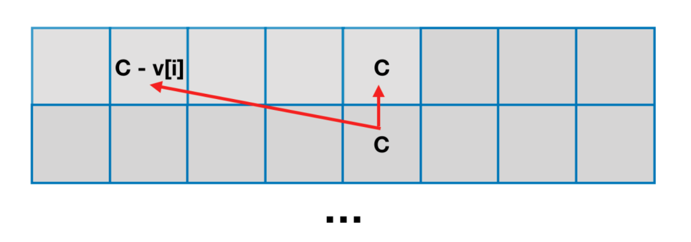

# 背包问题概述

参考 1：[宫水三叶 背包问题合集](https://mp.weixin.qq.com/mp/appmsgalbum?__biz=MzU4NDE3MTEyMA==&action=getalbum&album_id=1751702161341628417#wechat_redirect)

参考 2：[oi-wiki 背包dp](https://oi-wiki.org/dp/knapsack/)

参考 3：[【深度好文】详解背包问题：每五道动态规划就有一道是背包模型 ](https://mp.weixin.qq.com/s?__biz=MzU4NDE3MTEyMA==&mid=2247484403&idx=3&sn=5c0ed0793daee7a6d36e3557535a0630&chksm=fd9ca8eccaeb21fa769268082f08507e92ab63736aa829801253365676ee90ff8c2d41f32716&scene=178&cur_album_id=1748759632187047943#rd)

参考 4：[组合优化算法](https://baike.baidu.com/item/组合优化算法/20837241?fr=aladdin)

## 前置知识：组合优化算法

在有限个可行解的集合中找出最优解的一类优化问题称为组合[最优化问题](https://baike.baidu.com/item/最优化问题/9632567)，它是运筹学中的一个重要分支。所研究的问题涉及信息技术、经济管理、工业工程、交通运输、通讯网络等诸多领域。组合优化算法(optimal combination algorithm)是一类在离散状态下求极值的问题。

组合优化算法(optimal combination algorithm)一类**在离散状态下求极值的问题**。把某种离散对象按某个确定的约束条件进行安排，当已知合乎这种约束条件的特定安排存在时，寻求这种特定安排在某个优化准则下的极大解或极小解的间题。组合最优化的理论基础含线性规划、非线性规划、整数规划、动态规划、拟阵论和网络分析等。组合最优化技术提供了一个快速寻求极大解或极小解的方法 [1] 。

组合（最）优化问题是[最优化问题](https://baike.baidu.com/item/最优化问题/9632567)的一类。最优化问题似乎自然地分成两类：一类是[连续变量](https://baike.baidu.com/item/连续变量/10707410)的问题，另一类是[离散变量](https://baike.baidu.com/item/离散变量/8443404)的问题。具有离散变量的问题，我们称它为组合的。在连续变量的问题里，一般地是求一组实数，或者一个函数；在组合问题里，是从一个[无限集](https://baike.baidu.com/item/无限集/5017054)或者可数无限集里寻找一个对象——典型地是一个整数，一个集合，一个排列，或者一个图。一般地，这两类问题有相当不同的特色，并且求解它们的方法也是很不同的。对于具有离散变量的问题，从有限个解中寻找最优解的问题就是组合最优化问题。

### 应用

典型的组合优化问题有：

[旅行商问题](https://baike.baidu.com/item/旅行商问题/7737042)（Traveling Salesman Problem－TSP）；

加工调度问题（Scheduling Problem，如Flow-Shop，Job-Shop）；

0-1[背包问题](https://baike.baidu.com/item/背包问题/2416931)（Knapsack Problem）；

[装箱问题](https://baike.baidu.com/item/装箱问题/7749220)（Bin Packing Problem）；

[图着色问题](https://baike.baidu.com/item/图着色问题/8928655)（Graph Coloring Problem）；

[聚类](https://baike.baidu.com/item/聚类/593695)问题（Clustering Problem）等。

这些问题描述非常简单，并且有很强的工程代表性，但最优化求解很困难，其主要原因是求解这些问题的算法需要极长的运行时间与极大的存储空间，以致根本不可能在现有计算机上实现，即所谓的“组合爆炸”。正是这些问题的代表性和复杂性激起了人们对组合优化理论与算法的研究兴趣。

## 一、背包问题的本质

**背包问题是「动态规划」中十分经典的一类问题，背包问题本质上属于组合优化的「 完全问题」**。

如果你不了解什么是「 完全问题」，没有关系，丝毫不影响你求解背包问题。

你可以将「 完全问题」简单理解为「无法直接求解」的问题。

例如「分解质因数」问题，我们无法像四则运算（加减乘除）那样，按照特定的逻辑进行求解。

只能通过「穷举」+「验证」的方式进行求解。

既然本质上是一个无法避免「穷举」的问题，自然会联想到「动态规划」，事实上背包问题也同时满足「无后效性」的要求。

**这就是为什么「背包问题」会使用「动态规划」来求解的根本原因**。

如果按照常见的「背包问题」的题型来抽象模型的话，「背包问题」大概是对应这样的一类问题：

**泛指一类「给定价值与成本」，同时「限定决策规则」，在这样的条件下，如何实现价值最大化的问题**。

---

**背包问题具备的特征**：是否可以根据一个 target（直接给出或间接求出，相当于背包），target 可以是数字也可以是字符串，再给定一个数组 arrs（相当于各类物品），问：能否使用 arrs 中的元素做各种排列组合得到 target。

**「01背包问题」与「完全背包问题」主要区别就是物品是否可以重复选取**


## 一、01背包问题

「01背包」是指给定物品价值与体积（对应了「给定价值与成本」），在规定容量下（对应了「限定决策规则」）如何使得所选物品的总价值最大。由于每个物体只有两种可能的状态（取与不取），对应二进制中的 1 和 0，这类问题便被称为「0-1 背包问题」。有些题用体积有些用质量，其实都一样，都描述了这个背包的限制。

下面三种方法都需要，完全掌握

---

例如：

有 N 件物品和一个容量是 C 的背包。每件物品有且只有一件。

第 i 件物品的价值是 val[i]，体积是 wt[i]

求解将哪些物品装入背包，可使这些物品的总体积不超过背包容量，且总价值最大。

```
输入: N = 3, C = 4, val = [4,2,3], wt = [4,2,3]
输出: 4
解释: 只选第一件物品，可使价值最大。

输入: N = 3, C = 5, val = [4,2,3], wt = [4,2,3]
输出: 5
解释: 不选第一件物品，选择第二件和第三件物品，可使价值最大。
```

### `dp[N][C+1]`  解法

**1. 定义状态**

`dp[i][w]`的定义如下：对于下标在 [0, i] 区间的物品，当前背包的容量为`w`，这种情况下可以装的最大价值是`dp[i][w]`

比如说，如果 `dp[3][5] = 6`，其含义为：对于给定的一系列物品中，对 [0, 3] 区间的4个物品进行选择，当背包容量为 5 时，最多可以装下的价值为 6。

需要将体积这一维度多申请一位，`dp[i][0]` 表示对于下标在 [0, i] 区间的物品，达到容量 0，可获得的最大价值（显然是 0）

**2. 状态转移方程**

「把物品`i`装进背包」和「不把物品`i`装进背包」分为两种情况，取两种情况的最大值

- **如果没有把这第 i 个物品装入背包，想要获得 w 的价值**，那么很显然，最大价值`dp[i][w]`应该等于`dp[i-1][w]`。不装嘛，那就继承之前的结果。
- **如果把这第`i`个物品装入了背包**，那么`dp[i][w]`应该等于 `dp[i-1][w-wt[i]] + val[i]`

> `dp[i-1][w-wt[i]] + val[i]` 理解：如果想装第`i`个物品，怎么计算这时候的最大价值？**换句话说，在装第`i`个物品的前提下，背包能装的最大价值是多少？**
>
> 显然，当前 `dp[i]` 的 `w` 需要从前一位的 `dp[i-1]` 的 `w-wt[i]` 转移过来，再加上第 `i` 个物品的价值`val[i]`，这就是装第 `i` 个物品的前提下，背包可以装的最大价值。

同时要关注 `w-wt[i] >= 0`，一方面是防止数组越界，另一方面**价值是非负数**
$$
dp[i][w] = 
\begin{cases}
max(dp[i-1][w], \ dp[i-1][w-wt[i]] + val[i]) & w-wt[i] >= 0 \\ \\
dp[i-1][w] & w-wt[i] < 0
\end{cases}
$$
**3. 初始化**

`dp[i][0]` 都为 0

初始化第一个物品，对于 [0, 0] 区间物品达到价值 w

- 如果第一个物品体积 wt[0] **小于等于** 需要达到的容量 w 时，可放入 `dp[0][w] = val[0]`
- 如果第一个物品体积 wt[0] **大于** 需要达到的容量 w 时，不可放入 `dp[0][w] = 0`

**4. 输出**

`dp[N-1][V]`

**复杂度分析**

时间复杂度：`O(N*C)`

空间复杂度：`O(N*C)`

```c++
int maxValue(int N, int C, vector<int>& val, vector<int>& wt) {
    vector<vector<int>> dp(N, vector<int>(C + 1, 0));
    // 初始化第一个物品
    for (int w = 0; w <= C; w++) {
        if (wt[0] <= w) {
            dp[0][w] = val[0];
        } else {
            dp[0][w] = 0;
        }
    }
    for (int i = 1; i < N; i++) {
        for (int w = 0; w <= C; w++) {
            int no = dp[i - 1][w];  // 不装
            int yes = 0;            // 装
            if (w - wt[i] >= 0) {
                yes = dp[i - 1][w - wt[i]] + val[i];
            }
            dp[i][w] = max(no, yes);
        }
    }
    return dp[N - 1][C];
}
```

### `dp[2][C+1]` 解法

根据「转移方程」，我们知道计算第 i 行格子只需要第 i 行中的某些值。

也就是计算「某一行」的时候只需要依赖「前一行」。

因此可以用一个只有两行的数组来存储中间结果，根据当前计算的行号是偶数还是奇数来交替使用第 0 行和第 1 行。

```
偶数 0 2 4

奇数 1 3 5
```

这样的空间优化方法称为「**滚动数组**」，**天然的将 cur 和 pre 的转移与奇偶变化相结合**

这种空间优化方法十分推荐，因为改动起来没有任何思维难度。

只需要将代表行的维度修改成 2，并将所有使用行维度的地方从 `i` 改成 `i%2` 或者 `i&1` 即可

```c++
int maxValue(int N, int C, vector<int>& val, vector<int>& wt) {
    vector<vector<int>> dp(2, vector<int>(C + 1, 0));
    // 初始化第一个物品
    for (int w = 0; w <= C; w++) {
        if (wt[0] <= w) {
            dp[0][w] = val[0];
        } else {
            dp[0][w] = 0;
        }
    }
    for (int i = 1; i < N; i++) {
        for (int w = 0; w <= C; w++) {
            int no = dp[(i - 1) & 1][w];  // 不装
            int yes = 0;                  // 装
            if (w - wt[i] >= 0) {
                yes = dp[(i - 1) & 1][w - wt[i]] + val[i];
            }
            dp[i & 1][w] = max(no, yes);
        }
    }
    return dp[(N - 1) & 1][C];
}
```

### `dp[C+1]` 解法

**这样做的空间复杂度和「滚动数组」优化的空间复杂度是一样的。但仍然具有意义，而且这样的「一维空间」优化，是求解其他背包问题的基础，需要重点掌握**。



不难发现当求解第 `i` 行格子的值时，不仅是只依赖第 `i-1` 行，还明确只依赖第 `i-1` 行的第 `w` 个格子和第 `w - wt[i]` 个格子

换句话说，只依赖于「上一个格子的位置」以及「上一个格子的左边位置」

因此，只要将求解第 i 行格子的顺序「从 0 到 w」改为「从 w 到 0」，就可以将原本 2 行的二维数组压缩到一行（转换为一维数组）。

```c++
int maxValue(int N, int C, vector<int>& val, vector<int>& wt) {
    vector<int> dp(C + 1, 0);

    for (int i = 0; i < N; i++) {
        for (int w = C; w - wt[i] >= 0; w--) {
            int no = dp[w];                    // 不装
            int yes = dp[w - wt[i]] + val[i];  // 装
            dp[w] = max(no, yes);
        }
    }
    return dp[C];
}
```

至于为什么不需要再遍历 `w - wt[i]` 的情况，想不明白啊啊啊啊啊啊


例题：[416. 分割等和子集](https://leetcode-cn.com/problems/partition-equal-subset-sum/)、[494. 目标和](https://leetcode-cn.com/problems/target-sum/)


## 二、完全背包问题

完全背包与 01 背包不同就是每种物品可以有无限多个：一共有 N 种物品，每种物品有无限多个，第 i（i 从 1 开始）种物品的重量为 w[i]，价值为 v[i]。在总重量不超过背包承载上限 W 的情况下，能够装入背包的最大价值是多少？

解法：

- 如果是完全背包，即数组中的元素可重复使用并且不考虑元素之间顺序，arrs 放在外循环（保证 arrs 按顺序），target在内循环。且内循环正序。

- 如果组合问题需考虑元素之间的顺序，需将 target 放在外循环，将 arrs 放在内循环，且内循环正序。

例题：[139. 单词拆分](./139-[完全背包-记忆化dfs]-单词拆分.md)、[279. 完全平方数](https://leetcode-cn.com/problems/perfect-squares/)、[322. 零钱兑换](https://leetcode-cn.com/problems/coin-change/)、[377. 组合总和 Ⅳ](https://leetcode-cn.com/problems/combination-sum-iv/)、[518. 零钱兑换 II](https://leetcode-cn.com/problems/coin-change-2/)


## 三、动态规划五部曲

### 1、确定dp数组以及下标的含义

dp[i] : 字符串长度为i的话，dp[i]为true，表示可以拆分为一个或多个在字典中出现的单词。

### 2、确定递推公式

如果确定dp[j] 是true，且 [j, i] 这个区间的子串出现在字典里，那么dp[i]一定是true。（j < i ）。

所以递推公式是 if([j, i] 这个区间的子串出现在字典里 && dp[j]是true) 那么 dp[i] = true。

### 3、dp数组如何初始化

从递归公式中可以看出，dp[i] 的状态依靠 dp[j]是否为true，那么dp[0]就是递归的根基，dp[0]一定要为true，否则递归下去后面都都是false了。

那么dp[0]有没有意义呢？

dp[0]表示如果字符串为空的话，说明出现在字典里。

但题目中说了“给定一个非空字符串 s” 所以测试数据中不会出现i为0的情况，那么dp[0]初始为true完全就是为了推导公式。

下标非0的dp[i]初始化为false，只要没有被覆盖说明都是不可拆分为一个或多个在字典中出现的单词。

### 4、确定遍历顺序

题目中说是拆分为一个或多个在字典中出现的单词，所以这是完全背包。

还要讨论两层for循环的前后循序。

**如果求组合数就是外层for循环遍历物品，内层for遍历背包**

**如果求排列数就是外层for遍历背包，内层for循环遍历物品**

求组合数：518.零钱兑换II
求排列数：377. 组合总和 Ⅳ、70. 爬楼梯进阶版（完全背包）
求最小数：322. 零钱兑换、279.完全平方数

本题最终要求的是是否都出现过，所以对出现单词集合里的元素是组合还是排列，并不在意！

那么本题使用求排列的方式，还是求组合的方式都可以。

即：外层for循环遍历物品，内层for遍历背包 或者 外层for遍历背包，内层for循环遍历物品 都是可以的。

但本题还有特殊性，因为是要求子串，最好是遍历背包放在外循环，将遍历物品放在内循环。

如果要是外层for循环遍历物品，内层for遍历背包，就需要把所有的子串都预先放在一个容器里。（如果不理解的话，可以自己尝试这么写一写就理解了）

所以最终我选择的遍历顺序为：遍历背包放在外循环，将遍历物品放在内循环。内循环从前到后。

### 5、举例推导dp[i]

举例手动推导看看dp数组，dp[s.size()]就是最终结果。


| 题目                                                         | 题解                                                         | 难度 |       |
| ------------------------------------------------------------ | ------------------------------------------------------------ | ---- | ----- |
| [279. 完全平方数](https://leetcode-cn.com/problems/perfect-squares/) | [LeetCode 题解链接](https://leetcode-cn.com/problems/perfect-squares/solution/gong-shui-san-xie-xiang-jie-wan-quan-bei-nqes/) | 中等 | 🤩🤩🤩🤩  |
| [322. 零钱兑换](https://leetcode-cn.com/problems/coin-change/) | [LeetCode 题解链接](https://leetcode-cn.com/problems/coin-change/solution/dong-tai-gui-hua-bei-bao-wen-ti-zhan-zai-3265/) | 中等 | 🤩🤩🤩🤩  |
| [416. 分割等和子集](https://leetcode-cn.com/problems/partition-equal-subset-sum/) | [LeetCode 题解链接](https://leetcode-cn.com/problems/partition-equal-subset-sum/solution/gong-shui-san-xie-bei-bao-wen-ti-xia-con-mr8a/) | 中等 | 🤩🤩🤩🤩🤩 |
| [474. 一和零](https://leetcode-cn.com/problems/ones-and-zeroes/) | [LeetCode 题解链接](https://leetcode-cn.com/problems/ones-and-zeroes/solution/gong-shui-san-xie-xiang-jie-ru-he-zhuan-174wv/) | 中等 | 🤩🤩🤩🤩🤩 |
| [494. 目标和](https://leetcode-cn.com/problems/target-sum/)  | [LeetCode 题解链接](https://leetcode-cn.com/problems/target-sum/solution/gong-shui-san-xie-yi-ti-si-jie-dfs-ji-yi-et5b/) | 中等 | 🤩🤩🤩🤩  |
| [518. 零钱兑换 II](https://leetcode-cn.com/problems/coin-change-2/) | [LeetCode 题解链接](https://leetcode-cn.com/problems/coin-change-2/solution/gong-shui-san-xie-xiang-jie-wan-quan-bei-6hxv/) | 中等 | 🤩🤩🤩🤩  |
| [638. 大礼包](https://leetcode-cn.com/problems/shopping-offers/) | [LeetCode 题解链接](https://leetcode-cn.com/problems/shopping-offers/solution/gong-shui-san-xie-yi-ti-shuang-jie-zhuan-qgk1/) | 中等 | 🤩🤩🤩🤩  |
| [879. 盈利计划](https://leetcode-cn.com/problems/profitable-schemes/) | [LeetCode 题解链接](https://leetcode-cn.com/problems/profitable-schemes/solution/gong-shui-san-xie-te-shu-duo-wei-fei-yon-7su9/) | 困难 | 🤩🤩🤩🤩🤩 |
| [1049. 最后一块石头的重量 II](https://leetcode-cn.com/problems/last-stone-weight-ii/) | [LeetCode 题解链接](https://leetcode-cn.com/problems/last-stone-weight-ii/solution/gong-shui-san-xie-xiang-jie-wei-he-neng-jgxik/) | 中等 | 🤩🤩🤩🤩  |
| [1155. 掷骰子的N种方法](https://leetcode-cn.com/problems/number-of-dice-rolls-with-target-sum/) | [LeetCode 题解链接](https://leetcode-cn.com/problems/number-of-dice-rolls-with-target-sum/solution/dong-tai-gui-hua-bei-bao-wen-ti-yun-yong-axtf/) | 中等 | 🤩🤩🤩🤩  |
| [1449. 数位成本和为目标值的最大数字](https://leetcode-cn.com/problems/form-largest-integer-with-digits-that-add-up-to-target/) | [LeetCode 题解链接](https://leetcode-cn.com/problems/form-largest-integer-with-digits-that-add-up-to-target/solution/gong-shui-san-xie-fen-liang-bu-kao-lu-we-uy4y/) | 困难 | 🤩🤩🤩🤩  |
| [1995. 统计特殊四元组](https://leetcode-cn.com/problems/count-special-quadruplets/) | [LeetCode 题解链接](https://leetcode-cn.com/problems/count-special-quadruplets/solution/gong-shui-san-xie-yi-ti-si-jie-mei-ju-ha-gmhv/) | 简单 | 🤩🤩🤩🤩  |

## Reference


https://leetcode.cn/problems/partition-equal-subset-sum/solution/0-1-bei-bao-wen-ti-xiang-jie-zhen-dui-ben-ti-de-yo/


参考 2：[完全背包详解](https://leetcode-cn.com/problems/word-break/solution/139-dan-ci-chai-fen-hui-su-fa-wan-quan-b-0zwf/)


https://leetcode-cn.com/problems/shopping-offers/solution/gong-shui-san-xie-yi-ti-shuang-jie-zhuan-qgk1/

[经典动态规划：0-1 背包问题](https://mp.weixin.qq.com/s/RXfnhSpVBmVneQjDSUSAVQ)

[经典动态规划：完全背包问题](https://mp.weixin.qq.com/s/zGJZpsGVMlk-Vc2PEY4RPw)
