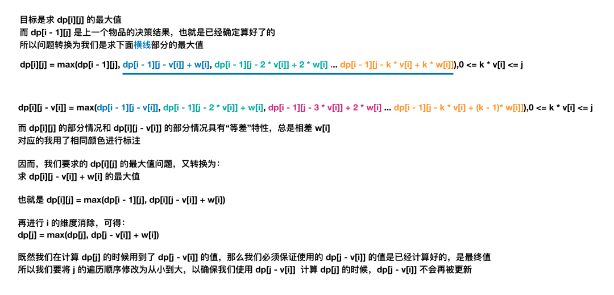

# 背包问题概述

参考 1：[宫水三叶 背包问题合集](https://mp.weixin.qq.com/mp/appmsgalbum?__biz=MzU4NDE3MTEyMA==&action=getalbum&album_id=1751702161341628417#wechat_redirect)

参考 2：[oi-wiki 背包dp](https://oi-wiki.org/dp/knapsack/)

参考 3：[【深度好文】详解背包问题：每五道动态规划就有一道是背包模型 ](https://mp.weixin.qq.com/s?__biz=MzU4NDE3MTEyMA==&mid=2247484403&idx=3&sn=5c0ed0793daee7a6d36e3557535a0630&chksm=fd9ca8eccaeb21fa769268082f08507e92ab63736aa829801253365676ee90ff8c2d41f32716&scene=178&cur_album_id=1748759632187047943#rd)

参考 4：[组合优化算法](https://baike.baidu.com/item/组合优化算法/20837241?fr=aladdin)

## 前置知识：组合优化算法

在有限个可行解的集合中找出最优解的一类优化问题称为组合[最优化问题](https://baike.baidu.com/item/最优化问题/9632567)，它是运筹学中的一个重要分支。所研究的问题涉及信息技术、经济管理、工业工程、交通运输、通讯网络等诸多领域。组合优化算法(optimal combination algorithm)是一类在离散状态下求极值的问题。

组合优化算法(optimal combination algorithm)一类**在离散状态下求极值的问题**。把某种离散对象按某个确定的约束条件进行安排，当已知合乎这种约束条件的特定安排存在时，寻求这种特定安排在某个优化准则下的极大解或极小解的间题。组合最优化的理论基础含线性规划、非线性规划、整数规划、动态规划、拟阵论和网络分析等。组合最优化技术提供了一个快速寻求极大解或极小解的方法 [1] 。

组合（最）优化问题是[最优化问题](https://baike.baidu.com/item/最优化问题/9632567)的一类。最优化问题似乎自然地分成两类：一类是[连续变量](https://baike.baidu.com/item/连续变量/10707410)的问题，另一类是[离散变量](https://baike.baidu.com/item/离散变量/8443404)的问题。具有离散变量的问题，我们称它为组合的。在连续变量的问题里，一般地是求一组实数，或者一个函数；在组合问题里，是从一个[无限集](https://baike.baidu.com/item/无限集/5017054)或者可数无限集里寻找一个对象——典型地是一个整数，一个集合，一个排列，或者一个图。一般地，这两类问题有相当不同的特色，并且求解它们的方法也是很不同的。对于具有离散变量的问题，从有限个解中寻找最优解的问题就是组合最优化问题。

### 应用

典型的组合优化问题有：

[旅行商问题](https://baike.baidu.com/item/旅行商问题/7737042)（Traveling Salesman Problem－TSP）；

加工调度问题（Scheduling Problem，如Flow-Shop，Job-Shop）；

0-1[背包问题](https://baike.baidu.com/item/背包问题/2416931)（Knapsack Problem）；

[装箱问题](https://baike.baidu.com/item/装箱问题/7749220)（Bin Packing Problem）；

[图着色问题](https://baike.baidu.com/item/图着色问题/8928655)（Graph Coloring Problem）；

[聚类](https://baike.baidu.com/item/聚类/593695)问题（Clustering Problem）等。

这些问题描述非常简单，并且有很强的工程代表性，但最优化求解很困难，其主要原因是求解这些问题的算法需要极长的运行时间与极大的存储空间，以致根本不可能在现有计算机上实现，即所谓的“组合爆炸”。正是这些问题的代表性和复杂性激起了人们对组合优化理论与算法的研究兴趣。

## 一、背包问题的本质

### 1、本质

**背包问题是「动态规划」中十分经典的一类问题，背包问题本质上属于组合优化的「 完全问题」**。

如果你不了解什么是「 完全问题」，没有关系，丝毫不影响你求解背包问题。

你可以将「 完全问题」简单理解为「无法直接求解」的问题。

例如「分解质因数」问题，我们无法像四则运算（加减乘除）那样，按照特定的逻辑进行求解。

只能通过「穷举」+「验证」的方式进行求解。

既然本质上是一个无法避免「穷举」的问题，自然会联想到「动态规划」，事实上背包问题也同时满足「无后效性」的要求。

**这就是为什么「背包问题」会使用「动态规划」来求解的根本原因**。

如果按照常见的「背包问题」的题型来抽象模型的话，「背包问题」大概是对应这样的一类问题：

**泛指一类「给定价值与成本」，同时「限定决策规则」，在这样的条件下，如何实现价值最大化的问题**。

### 2、背包问题具备的特征

**背包问题具备的特征**：是否可以根据一个 target（直接给出或间接求出，相当于背包），target 可以是数字也可以是字符串，再给定一个数组 arrs（相当于各类物品），问：能否使用 arrs 中的元素做各种排列组合得到 target。

**「01背包问题」与「完全背包问题」表面上的区别是物品是否可以重复选取**

两类背包问题（01 背包 & 完全背包）的原始状态定义都是两维：

- 第一维 i 代表物品编号
- 第二维 w 代表容量

其中第二维 又有「不超过容量 w」和「容量恰好为 w」两种定义。

> 容量恰好为 w 问题，需要定义容量不为 w 的无效值，无效值的选取是有说法的，题目要求最小值，无效值定义为INT_MAX
>
> 如 322 零钱兑换

### 3、如何联想到背包问题，并选择何种背包

从现在开始就要培养这样的习惯：

**当看到题目是给定一些「物品」，让我们从中进行选择，以达到「最大价值」或者「特定价值」时，我们应该联想到「背包问题」**。

**这本质上其实是一个组合问题：被选物品之间不需要满足特定关系，只需要选择物品，以达到「全局最优」或者「特定状态」即可**。

再根据物品的「选择次数限制」来判断是何种背包问题。

> 例如硬币找零问题，硬币相当于我们的物品，每种硬币可以选择「无限次」，我们应该很自然的想到「完全背包」。

## 一、01背包问题

「01背包」是指给定物品价值与体积（对应了「给定价值与成本」），在规定容量下（对应了「限定决策规则」）如何使得所选物品的总价值最大。由于每个物体只有两种可能的状态（取与不取），对应二进制中的 1 和 0，这类问题便被称为「0-1 背包问题」。有些题用体积有些用质量，其实都一样，都描述了这个背包的限制。

**下面三种方法都需要，完全掌握**

---

**裸题**：

有 N 件物品和一个容量是 C 的背包。**每件物品有且只有一件**。

第 i 件物品的价值是 val[i]，体积是 wt[i]

求解将哪些物品装入背包，可使这些物品的总体积不超过背包容量，且总价值最大。

```
输入: N = 3, C = 4, val = [4,2,3], wt = [4,2,3]
输出: 4
解释: 只选第一件物品，可使价值最大。

输入: N = 3, C = 5, val = [4,2,3], wt = [4,2,3]
输出: 5
解释: 不选第一件物品，选择第二件和第三件物品，可使价值最大。
```

### 1、常规 `dp[N][C+1]`  解法

**1. 定义状态**

`dp[i][w]`的定义如下：对于下标在 [0, i] 区间的物品，当前背包的容量为`w`，这种情况下可以装的最大价值是`dp[i][w]`

比如说，如果 `dp[3][5] = 6`，其含义为：对于给定的一系列物品中，对 [0, 3] 区间的4个物品进行选择，当背包容量为 5 时，最多可以装下的价值为 6。

需要将体积这一维度多申请一位，`dp[i][0]` 表示对于下标在 [0, i] 区间的物品，达到容量 0，可获得的最大价值（显然是 0）

**2. 状态转移方程**

「把物品`i`装进背包」和「不把物品`i`装进背包」分为两种情况，取两种情况的最大值

- **如果没有把这第 i 个物品装入背包，想要获得 w 的价值**，那么很显然，最大价值`dp[i][w]`应该等于`dp[i-1][w]`。不装嘛，那就继承之前的结果。
- **如果把这第`i`个物品装入了背包**，那么`dp[i][w]`应该等于 `dp[i-1][w-wt[i]] + val[i]`

> `dp[i-1][w-wt[i]] + val[i]` 理解：如果想装第`i`个物品，怎么计算这时候的最大价值？**换句话说，在装第`i`个物品的前提下，背包能装的最大价值是多少？**
>
> 显然，当前 `dp[i]` 的 `w` 需要从前一位的 `dp[i-1]` 的 `w-wt[i]` 转移过来，再加上第 `i` 个物品的价值`val[i]`，这就是装第 `i` 个物品的前提下，背包可以装的最大价值。

同时要关注 `w-wt[i] >= 0`，一方面是防止数组越界，另一方面**价值是非负数**
$$
dp[i][w] = 
\begin{cases}
max(dp[i-1][w], \ dp[i-1][w-wt[i]] + val[i]) & w-wt[i] >= 0 \\ \\
dp[i-1][w] & w-wt[i] < 0
\end{cases}
$$
**3. 初始化**

`dp[i][0]` 都为 0

初始化第一个物品，对于 [0, 0] 区间物品达到价值 w

- 如果第一个物品体积 wt[0] **小于等于** 需要达到的容量 w 时，可放入 `dp[0][w] = val[0]`
- 如果第一个物品体积 wt[0] **大于** 需要达到的容量 w 时，不可放入 `dp[0][w] = 0`

**4. 输出**

`dp[N-1][C]`

**复杂度分析**

时间复杂度：`O(N*C)`

空间复杂度：`O(N*C)`

```c++
int maxValue(int N, int C, vector<int>& val, vector<int>& wt) {
    vector<vector<int>> dp(N, vector<int>(C + 1, 0));
    // 初始化第一个物品
    for (int w = 0; w <= C; w++) {
        if (wt[0] <= w) {
            dp[0][w] = val[0];
        } else {
            dp[0][w] = 0;
        }
    }
    for (int i = 1; i < N; i++) {
        for (int w = 0; w <= C; w++) {
            int no = dp[i - 1][w];  // 不装
            int yes = 0;            // 装
            if (w - wt[i] >= 0) {
                yes = dp[i - 1][w - wt[i]] + val[i];
            }
            dp[i][w] = max(no, yes);
        }
    }
    return dp[N - 1][C];
}
```

### 2、滚动数组 `dp[2][C+1]` 解法

根据「转移方程」，我们知道计算第 i 行格子只需要第 i 行中的某些值。

也就是计算「某一行」的时候只需要依赖「前一行」。

因此可以用一个只有两行的数组来存储中间结果，根据当前计算的行号是偶数还是奇数来交替使用第 0 行和第 1 行。

```
偶数 0 2 4

奇数 1 3 5
```

这样的空间优化方法称为「**滚动数组**」，**天然的将 cur 和 pre 的转移与奇偶变化相结合**

这种空间优化方法十分推荐，因为改动起来没有任何思维难度。

只需要将代表行的维度修改成 2，并将所有使用行维度的地方从 `i` 改成 `i%2` 或者 `i&1` 即可

```c++
int maxValue(int N, int C, vector<int>& val, vector<int>& wt) {
    vector<vector<int>> dp(2, vector<int>(C + 1, 0));
    // 初始化第一个物品
    for (int w = 0; w <= C; w++) {
        if (wt[0] <= w) {
            dp[0][w] = val[0];
        } else {
            dp[0][w] = 0;
        }
    }
    for (int i = 1; i < N; i++) {
        for (int w = 0; w <= C; w++) {
            int no = dp[(i - 1) & 1][w];  // 不装
            int yes = 0;                  // 装
            if (w - wt[i] >= 0) {
                yes = dp[(i - 1) & 1][w - wt[i]] + val[i];
            }
            dp[i & 1][w] = max(no, yes);
        }
    }
    return dp[(N - 1) & 1][C];
}
```

### 3、一维空间 `dp[C+1]` 解法

**这样做的空间复杂度和「滚动数组」优化的空间复杂度是一样的。但仍然具有意义，而且这样的「一维空间」优化，是求解其他背包问题的基础，需要重点掌握**。


不难发现当求解第 `i` 行格子的值时，不仅是只依赖第 `i-1` 行，还明确只依赖第 `i-1` 行的第 `w` 个格子和第 `w - wt[i]` 个格子

换句话说，只依赖于「上一个格子的位置」以及「上一个格子的左边位置」

因此，只要将求解第 i 行格子的顺序「从 0 到 w」改为「从 w 到 0」，就可以将原本 2 行的二维数组压缩到一行（转换为一维数组）。

「01 背包」的动态转移方程为：
$$
dp[i][w] = max(dp[i-1][w], \ dp[i-1][w-wt[i]] + val[i]) \quad w-wt[i] >= 0
$$

```c++
int maxValue(int N, int C, vector<int>& val, vector<int>& wt) {
    vector<int> dp(C + 1, 0);

    for (int i = 0; i < N; i++) {
        for (int w = C; w - wt[i] >= 0; w--) {
            int no = dp[w];                    // 不装
            int yes = dp[w - wt[i]] + val[i];  // 装
            dp[w] = max(no, yes);
        }
    }
    return dp[C];
}
```

至于为什么不需要再遍历 `w - wt[i] < 0` 的情况：

「从后向前」 写的过程中，一旦 `w - wt[i]` 不满足，可以马上退出当前循环，因为后面的 w 的值肯定越来越小，没有必要继续做判断，直接进入外层循环的下一层。相当于也是一个剪枝，这一点是「从前向后」填表所不具备的。

### 例题

- 第 416 题：分割等和子集（中等）；
- 第 474 题：一和零（中等）；
- 第 494 题：目标和（中等）；
- 第 879 题：盈利计划（困难）；


## 二、完全背包问题

完全背包与 01 背包不同就是每种物品可以有无限多个：一共有 N 种物品，每种物品有无限多个，第 i（i 从 1 开始）种物品的重量为 w[i]，价值为 v[i]。在总重量不超过背包承载上限 W 的情况下，能够装入背包的最大价值是多少？

解法：

- 如果是完全背包，即数组中的元素可重复使用并且不考虑元素之间顺序，arrs 放在外循环（保证 arrs 按顺序），target在内循环。且内循环正序。

- 如果组合问题需考虑元素之间的顺序，需将 target 放在外循环，将 arrs 放在内循环，且内循环正序。

---

**裸题**：

有 N 件物品和一个容量是 C 的背包。**每种物品都有无限件**。

第 i 件物品的价值是 val[i]，体积是 wt[i]

求解将哪些物品装入背包，可使这些物品的总体积不超过背包容量，且总价值最大。

> 其实就是在 0-1 背包问题的基础上，增加了每件物品可以选择多次的特点（在容量允许的情况下）。

```
输入: N = 2, C = 5, val = [1,2], wt = [1,2]
输出: 5
解释: 选一件物品 1，再选两件物品 2，可使价值最大。
```

### 1、常规 `dp[N][C+1]`  解法

**1. 定义状态**

`dp[i][w]`的定义如下：对于下标在 [0, i] 区间的物品，当前背包的容量为`w`，这种情况下可以装的最大价值是`dp[i][w]`

> 需要将体积这一维度多申请一位，`dp[i][0]` 表示对于下标在 [0, i] 区间的物品，达到容量 0，可获得的最大价值（显然是 0）

**2. 状态转移方程**

由于每件物品可以被选择多次，因此对于某个 `dp[i][w]` 而言，其值应该为以下所有可能方案中的最大值：

- 选择 0 件物品 i，最大价值为 `dp[i-1][w]`
- 选择 1 件物品 i，最大价值为 `dp[i-1][w - wt[i]] + val[i]`
- 选择 2 件物品 i，最大价值为 `dp[i-1][w - 2*wt[i]] + 2*val[i]`
- ......
- 选择 k 件物品 i，最大价值为 `dp[i-1][w - k*wt[i]] + k*val[i]`

由此得出「状态转移方程」为：
$$
dp[i][w] = 
max\{dp[i-1][w], \ dp[i-1][w-k*wt[i]] + k*val[i]\}
\quad w-k*wt[i] >= 0
$$
**3. 初始化**

预处理第一件物品

当只有一件物品的时候，在容量允许的情况下，能选多少件就选多少件

`dp[0][w] = (w / wt[0]) * val[0]`

**4. 输出**

`dp[N-1][C]`

**复杂度分析**

时间复杂度：`O(N*C*C)`

空间复杂度：`O(N*C)`

```c++
int maxValue(int N, int C, vector<int>& val, vector<int>& wt) {
    vector<vector<int>> dp(N, vector<int>(C + 1, 0));
    // 预处理第一件物品
    for (int w = 0; w < C; w++) {
        int maxK = w / wt[0];
        dp[0][w] = maxK * val[0];
    }

    for (int i = 1; i < N; i++) {
        for (int w = 0; w <= C; w++) {
            int no = dp[i - 1][w];  // 不装
            int yes = 0;
            for (int k = 1; w - k * wt[i] >= 0; k++) {
                yes = max(yes, dp[i - 1][w - k * wt[i]] + val[i]);
            }
            dp[i][w] = max(no, yes);
        }
    }

    return dp[N - 1][C];
}
```

### 2、滚动数组 `dp[2][C+1]` 解法

类似 01 背包中的解法

将 dp 数组中的 i、i-1 等，对下标加上 () & 1 运算

```c++
int maxValue(int N, int C, vector<int>& val, vector<int>& wt) {
    vector<vector<int>> dp(2, vector<int>(C + 1, 0));
    // 预处理第一件物品
    for (int w = 0; w < C; w++) {
        int maxK = w / wt[0];
        dp[0][w] = maxK * val[0];
    }

    for (int i = 1; i < N; i++) {
        for (int w = 0; w <= C; w++) {
            int no = dp[(i - 1) & 1][w];  // 不装
            int yes = 0;
            for (int k = 1; w - k * wt[i] >= 0; k++) {
                yes = max(yes, dp[(i - 1) & 1][w - k * wt[i]] + val[i]);
            }
            dp[i & 1][w] = max(no, yes);
        }
    }

    return dp[(N - 1) & 1][C];
}
```

### 3、一维空间 `dp[C+1]` 解法，

之所以 01 背包能够使用「一维空间优化」解法，是因为当我们开始处理第 i 件物品的时候，数组中存储的是已经处理完的第 i-1 件物品的状态值。然后配合着我们容量维度「从大到小」的遍历顺序，可以确保我们在更新某个状态时，所需要用到的状态值不会被覆盖。

而「完全背包」区别于「01 背包」，在于每件物品可以被选择多次。**容量维度应「从小到大」的遍历顺序**。

从「数学」的角度证明（变量名与本文有不同）：



```
1、当我们求完全背包的 dp[i][w]
dp[i][w] = max{dp[i-1][w], dp[i-1][w-wt[i]]+val[i]}, dp[i-1][w-2*wt[i]]+2*val[i]... dp[i-1][w-k*wt[i]]+k*val[i]}

2、那我们看看 dp[i][w-wt[i]] 是什么，带入上述公式
dp[i][w-wt[i]] = max{dp[i-1][w-wt[i]], dp[i-1][w-2*wt[i]]+val[i]}, dp[i-1][w-3*wt[i]]+2*val[i], dp[i-1][w-k*wt[i]]+(k-1)*val[i]}

3、观察上面两个公式，dp[i][w] 第一项后面的的最大值其实是 dp[i][w-wt[i]] 所有项的最大值，再加上 val[i]

4、将 dp[i][w-wt[i]] 带入 dp[i][w]
dp[i][w] = max{dp[i-1][w], dp[i][w-wt[i]] + val[i]}
```

「完全背包」的动态转移方程为：
$$
dp[i][w] = max(dp[i-1][w], \ dp[i][w-wt[i]] + val[i]) \quad w-wt[i] >= 0
$$

时间复杂度：`O(N*C)`，最重要的是**时间复杂度也降了**

空间复杂度：`O(C)`

```c++
int maxValue(int N, int C, vector<int>& val, vector<int>& wt) {
    vector<int> dp(C + 1, 0);

    for (int i = 0; i < N; i++) {
        for (int w = 0; w <= C; w++) {
            int no = dp[w];  // 不装
            int yes = 0;
            if (w - wt[i] >= 0) {
                yes = dp[w - wt[i]] + val[i];  // 装
            }
            dp[w] = max(no, yes);
        }
    }
    return dp[C];
}
```

根据数学证明：

- 01 背包的容量「从大到小」遍历的原因：**不可以让前一个位置上的值被提前刷新掉**
- 完全背包的容量「从小到大」遍历的原因：**需要让前一个位置上的最大值被提前计算出来**

本质原因：**两者进行状态转移时依赖了不同的格子**

- 01 背包依赖的是「**上一行正上方的格子**」和「**上一行左边的格子**」
- 完全背包依赖的是「**上一行正上方的格子**」和「**本行左边的格子**」

另一方面：

- 01 背包的容量：不计算 `w - wt[i] < 0` 的情况，因为随着 w 变小`w - wt[i]` 会更不可能，进行剪枝
- 完全背包的容量：其实也可不计算 `w - wt[i] < 0` 的情况，此时内涵了不装的情况，例如下面的写法

```c++
int maxValue(int N, int C, vector<int>& val, vector<int>& wt) {
    vector<int> dp(C + 1, 0);

    for (int i = 0; i < N; i++) {
        for (int w = 0; w <= C; w++) {
            if (w - wt[i] >= 0) {
                // 此时内涵了不装的情况 dp[w] = dp[w]
                dp[w] = max(dp[w], dp[w - wt[i]] + val[i]);  // 装
            }
        }
    }
    return dp[C];
}
```


### 例题

- 第 139. 单词拆分（中等）；
- 第 322 题：零钱兑换（中等）；
- 第 518 题：零钱兑换 II（中等）；
- 第 1449 题：数位成本和为目标值的最大数字（困难）

这里要注意鉴别：「力扣」第 377 题 组合总和 Ⅳ，不是「完全背包」问题。


| 题目                                                         | 题解                                                         | 难度 |       |
| ------------------------------------------------------------ | ------------------------------------------------------------ | ---- | ----- |
| [279. 完全平方数](https://leetcode-cn.com/problems/perfect-squares/) | [LeetCode 题解链接](https://leetcode-cn.com/problems/perfect-squares/solution/gong-shui-san-xie-xiang-jie-wan-quan-bei-nqes/) | 中等 | 🤩🤩🤩🤩  |
| [322. 零钱兑换](https://leetcode-cn.com/problems/coin-change/) | [LeetCode 题解链接](https://leetcode-cn.com/problems/coin-change/solution/dong-tai-gui-hua-bei-bao-wen-ti-zhan-zai-3265/) | 中等 | 🤩🤩🤩🤩  |
| [416. 分割等和子集](https://leetcode-cn.com/problems/partition-equal-subset-sum/) | [LeetCode 题解链接](https://leetcode-cn.com/problems/partition-equal-subset-sum/solution/gong-shui-san-xie-bei-bao-wen-ti-xia-con-mr8a/) | 中等 | 🤩🤩🤩🤩🤩 |
| [474. 一和零](https://leetcode-cn.com/problems/ones-and-zeroes/) | [LeetCode 题解链接](https://leetcode-cn.com/problems/ones-and-zeroes/solution/gong-shui-san-xie-xiang-jie-ru-he-zhuan-174wv/) | 中等 | 🤩🤩🤩🤩🤩 |
| [494. 目标和](https://leetcode-cn.com/problems/target-sum/)  | [LeetCode 题解链接](https://leetcode-cn.com/problems/target-sum/solution/gong-shui-san-xie-yi-ti-si-jie-dfs-ji-yi-et5b/) | 中等 | 🤩🤩🤩🤩  |
| [518. 零钱兑换 II](https://leetcode-cn.com/problems/coin-change-2/) | [LeetCode 题解链接](https://leetcode-cn.com/problems/coin-change-2/solution/gong-shui-san-xie-xiang-jie-wan-quan-bei-6hxv/) | 中等 | 🤩🤩🤩🤩  |
| [638. 大礼包](https://leetcode-cn.com/problems/shopping-offers/) | [LeetCode 题解链接](https://leetcode-cn.com/problems/shopping-offers/solution/gong-shui-san-xie-yi-ti-shuang-jie-zhuan-qgk1/) | 中等 | 🤩🤩🤩🤩  |
| [879. 盈利计划](https://leetcode-cn.com/problems/profitable-schemes/) | [LeetCode 题解链接](https://leetcode-cn.com/problems/profitable-schemes/solution/gong-shui-san-xie-te-shu-duo-wei-fei-yon-7su9/) | 困难 | 🤩🤩🤩🤩🤩 |
| [1049. 最后一块石头的重量 II](https://leetcode-cn.com/problems/last-stone-weight-ii/) | [LeetCode 题解链接](https://leetcode-cn.com/problems/last-stone-weight-ii/solution/gong-shui-san-xie-xiang-jie-wei-he-neng-jgxik/) | 中等 | 🤩🤩🤩🤩  |
| [1155. 掷骰子的N种方法](https://leetcode-cn.com/problems/number-of-dice-rolls-with-target-sum/) | [LeetCode 题解链接](https://leetcode-cn.com/problems/number-of-dice-rolls-with-target-sum/solution/dong-tai-gui-hua-bei-bao-wen-ti-yun-yong-axtf/) | 中等 | 🤩🤩🤩🤩  |
| [1449. 数位成本和为目标值的最大数字](https://leetcode-cn.com/problems/form-largest-integer-with-digits-that-add-up-to-target/) | [LeetCode 题解链接](https://leetcode-cn.com/problems/form-largest-integer-with-digits-that-add-up-to-target/solution/gong-shui-san-xie-fen-liang-bu-kao-lu-we-uy4y/) | 困难 | 🤩🤩🤩🤩  |
| [1995. 统计特殊四元组](https://leetcode-cn.com/problems/count-special-quadruplets/) | [LeetCode 题解链接](https://leetcode-cn.com/problems/count-special-quadruplets/solution/gong-shui-san-xie-yi-ti-si-jie-mei-ju-ha-gmhv/) | 简单 | 🤩🤩🤩🤩  |

## Reference


参考 2：[完全背包详解](https://leetcode-cn.com/problems/word-break/solution/139-dan-ci-chai-fen-hui-su-fa-wan-quan-b-0zwf/)


https://leetcode-cn.com/problems/shopping-offers/solution/gong-shui-san-xie-yi-ti-shuang-jie-zhuan-qgk1/

[经典动态规划：0-1 背包问题](https://mp.weixin.qq.com/s/RXfnhSpVBmVneQjDSUSAVQ)

[经典动态规划：完全背包问题](https://mp.weixin.qq.com/s/zGJZpsGVMlk-Vc2PEY4RPw)
