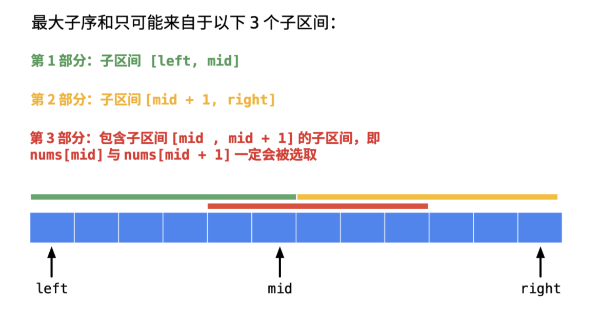

# 序列 DP

参考 1：[leetcode 300 题解（LIS）](https://leetcode-cn.com/problems/longest-increasing-subsequence/solution/dong-tai-gui-hua-er-fen-cha-zhao-tan-xin-suan-fa-p/)

参考 2：[leetcode 1143 题解（LCS）](https://leetcode-cn.com/problems/longest-common-subsequence/solution/fu-xue-ming-zhu-er-wei-dong-tai-gui-hua-r5ez6/)

参考 3：[leetcode 53 题解（最大子数组和）](https://leetcode-cn.com/problems/maximum-subarray/solution/dong-tai-gui-hua-fen-zhi-fa-python-dai-ma-java-dai/)

## 无后效性

**「无后效性」是「动态规划」中非常重要的概念，在我看来，理解这个概念无比重要**。很遗憾，《算法导论》上没有讲到「无后效性」。我找了一本在「豆瓣」目前豆瓣上评分为 9.2 的书 《算法竞赛进阶指南》，这本书和《算法导论》《算法 4》和 liuyubobobo 老师的算法课程一样，在我学习算法与数据结构的道路上，都发挥了巨大的作用。

李煜东著《算法竞赛进阶指南》，摘录如下：：

**为了保证计算子问题能够按照顺序、不重复地进行，动态规划要求已经求解的子问题不受后续阶段的影响**。这个条件也被叫做「无后效性」。换言之，动态规划对状态空间的遍历构成一张有向无环图，遍历就是该有向无环图的一个拓扑序。有向无环图中的节点对应问题中的「状态」，图中的边则对应状态之间的「转移」，转移的选取就是动态规划中的「决策」。

解释：

- 「有向无环图」「拓扑序」表示了每一个子问题只求解一次，以后求解问题的过程不会修改以前求解的子问题的结果；
- 换句话说：如果之前的阶段求解的子问题的结果包含了一些不确定的信息，导致了后面的阶段求解的子问题无法得到，或者很难得到，这叫「有后效性」，我们在当前这个问题第 1 次拆分的子问题就是「有后效性」的（大家可以再翻到上面再看看）；
- 解决「有后效性」的办法是固定住需要分类讨论的地方，记录下更多的结果。在代码层面上表现为：
  - 状态数组增加维度，例如：「力扣」的股票系列问题；
  - 把状态定义得更细致、准确，例如：前天推送的第 124 题：状态定义只解决路径来自左右子树的其中一个子树。

## 思考顺序

**1. 定义状态**

**2. 状态转移方程**

**3. 初始化**

**4. 输出**

**空间优化**

**复杂度分析**

## 一、最长上升子序列（LIS）

最长递增子序列（Longest Increasing Subsequence，简写 LIS）是非常经典的一个算法问题，比较容易想到的是动态规划解法，时间复杂度 O(N^2)，我们借这个问题来由浅入深讲解如何找状态转移方程，如何写出动态规划解法。比较难想到的是利用二分查找，时间复杂度是 O(NlogN)

题目：[300. 最长递增子序列](https://leetcode-cn.com/problems/longest-increasing-subsequence/)

给你一个整数数组 `nums` ，找到其中最长严格递增子序列的长度。

```
输入：nums = [10,9,2,5,3,7,101,18]
输出：4
解释：最长递增子序列是 [2,3,7,101]，因此长度为 4 。

输入：nums = [0,1,0,3,2,3]
输出：4

输入：nums = [7,7,7,7,7,7,7]
输出：1
```

> 「子序列」是由数组派生而来的序列，删除（或不删除）数组中的元素而不改变其余元素的顺序。「子串」一定是连续的。
>
> 例如，`[3,6,2,7]` 是数组 `[0,3,1,6,2,2,7]` 的子序列

### 1、暴力解法

使用「回溯搜索算法」或者「位运算」的技巧，可以得到输入数组的所有子序列，时间复杂度为 O(2^N)。再对这些子串再依次判定是否为「严格上升」，时间复杂度 为O(N)，所以总的时间复杂度为：O(N 2^N)

如果题目问所有解，应该使用回溯算法（暴力搜索）搜索所有具体解。若问最优解的长度，用动态规划

### 2、动态规划

基于「动态规划」的状态设计需要满足「无后效性」的设计思想，可以将状态定义为「以 `nums[i]` 结尾 的「上升子序列」的长度」。

> 「无后效性」的设计思想：让不确定的因素确定下来，以保证求解的过程形成一个逻辑上的有向无环图。这题不确定的因素是某个元素是否被选中，而我们设计状态的时候，让 nums[i] 必需被选中，这一点是「让不确定的因素确定下来」，也是我们这样设计状态的原因。

**1. 定义状态**：

`dp[i]` 表示：**以 `nums[i]` 结尾** 的「上升子序列」的长度。注意：这个定义中 **`nums[i]` 必须被选取，且必须是这个子序列的最后一个元素**；

**2. 状态转移方程**：

如果一个较大的数接在较小的数后面，就会形成一个更长的子序列。只要 nums[i] 严格大于在它位置之前的某个数，那么 nums[i] 就可以接在这个数后面形成一个更长的上升子序列。

$$
dp[i] = max(dp[i],\ dp[j]+1) \qquad j\in[0,i), \ nums[j] <nums[i]
$$
**3. 初始化**：

`dp[i] = 1`，11 个字符显然是长度为 11 的上升子序列。

**4. 输出**：

不能返回最后一个状态值，最后一个状态值只表示以 `nums[len - 1]` 结尾的「上升子序列」的长度，状态数组 `dp` 的最大值才是题目要求的结果。
$$
max(dp[i]) \qquad i\in[0,n-1]
$$
**5. 空间优化**：

遍历到一个新数的时候，之前所有的状态值都得保留，因此无法优化空间。

**复杂度分析**：

时间复杂度：`O(N^2)`

空间复杂度：`O(N)`

```c++
class Solution {
public:
    int lengthOfLIS(vector<int>& nums) {
        int n = nums.size();

        vector<int> dp(n, 1);
        for (int i = 1; i < n; i++) {
            for (int j = 0; j < i; j++) {
                if (nums[i] > nums[j]) {
                    dp[i] = max(dp[i], dp[j] + 1);
                }
            }
        }
        return *max_element(dp.begin(), dp.end());
    }
};
```

### 3、二分查找 + 贪心算法

**状态设计思想**：

依然着眼于某个上升子序列的「结尾的元素」，**如果已经得到的上升子序列的「结尾的数越小」，那么遍历的时候后面接上一个数，会有更大的可能构成一个长度更长的上升子序列**。既然结尾越小越好，我们可以记录 在长度固定的情况下，结尾最小的那个元素的数值，这样定义以后容易得到「状态转移方程」

为了与「方法二」的状态定义区分，将状态数组命名为 tail

**1 .定义新状态**：

`tail[i]` 表示：长度为 `i + 1` 的 **所有** 上升子序列的结尾的最小值

说明：

- 数组 tail 不是问题中的「最长上升子序列」（下文还会强调），不能命名为 LIS。数组 tail 只是用于求解 LIS 问题的状态数组；
- tail[0] 表示长度为 1 的所有上升子序列中，结尾最小的元素的数值。以题目中的示例为例 [10, 9, 2, 5, 3, 7, 101, 18] 中，容易发现长度为 2 的所有上升子序列中，结尾最小的是子序列 [2, 3] ，因此 tail[1] = 3；
- 下标和长度有数值为 1 的偏差；

状态定义其实也描述了状态转移方程

**2. 状态转移方程**：

从直觉上看，**数组 `tail` 是一个严格上升数组**。下面是证明

**证明**：即对于任意的下标 `0 <= i < j < len` ，都有 `tail[i] < tail[j]`

使用反证法：假设对于任意的下标 `i` < `j` ，存在某个 `tail[i] >= tail[j]`

对于此处的 tail[i] 而言，对应一个上升子序列 [a_0, a_1, ..., a_i]，依据定义 `tail[i] = a_i`

对于此处的 tail[j] 而言，对应一个上升子序列 [b_0, b_1, ..., b_i, ... , b_j]，依据定义 `tail[j] = b_j`

由于 `tail[i] >= tail[j]`，等价于 `a_i >= b_j`，而在上升子序列 [b_0, b_1, ..., b_i, ... , b_j] 中，`b_i` 严格小于 `b_j` ，故有 `a_i >= b_j > b_i`

则上升子序列 [b_0, b_1, ..., b_i] 是一个长度也为 `i + 1` 但是结尾更小的数组，与 `a_i` 的最小性矛盾

因此原命题成立（证闭）

---

**因此只需要维护状态数组 `tail` 的定义，它的长度就是最长上升子序列的长度**。下面说明在遍历中，如何维护状态数组 `tail` 的定义

1. 在遍历数组 nums 的过程中，看到一个新数 num，如果这个数「严格大于」有序数组 tail 的最后一个元素，就把 num 放在有序数组 tail 的后面，否则进入第 2 点；
2. 在有序数组 `tail` 中查找第 1 个等于大于 `num` 的那个数，试图让它变小；
   - 如果有序数组 `tail` 中存在 **等于** `num` 的元素，什么都不做，因为以 `num` 结尾的最短的「上升子序列」已经存在；
   - 如果有序数组 `tail` 中存在 **大于** `num` 的元素，找到第 1 个，让它变小，这样我们就找到了一个 **结尾更小**的**相同长度**的上升子序列。

说明：

- 我们再看一下数组 tail[i] 的定义：长度为 i + 1 的 **所有** 最长上升子序列的结尾的最小值。因此，在遍历的过程中，我们会不断的刷新 tail 数组，使其整体上变小，最后位置上的数也变小，**以便让新来的数扩充 tail 数组**
- 这一步可以认为是「贪心算法」，总是做出在当前看来最好的选择，当前「最好的选择」是：当前只让让第 1 个严格大于 nums[i] 的数变小，变成 nums[i]，这一步操作是「无后效性」的；
- 由于是在有序数组中的操作，因此可以使用「二分查找算法」。

**3. 初始化**：

遍历第 1 个数 `nums[0]`，直接放在有序数组 `tail` 的开头 `tail[0] = nums[0]`

**4. 输出**：

有序数组 `tail` 的长度，就是所求的「最长上升子序列」的长度

**5. 空间优化**：

无法优化空间

**复杂度分析**：

时间复杂度：`O(Nlog N)`

空间复杂度：`O(N)`

```c++
class Solution {
public:
    int lengthOfLIS(vector<int>& nums) {
        vector<int> tail;
        tail.push_back(nums[0]);
        for (int i = 1; i < nums.size(); i++) {
            int end = *tail.rbegin();
            if (nums[i] > end) {
                tail.push_back(nums[i]);
            } else if (nums[i] == end) {
                continue;
            } else if (nums[i] < end) {
                auto it = lower_bound(tail.begin(), tail.end(), nums[i]);
                *it = nums[i];
            }
        }
        return tail.size();
    }
};
```

## 二、最长公共子序列（LCS）

计算最长公共子序列（Longest Common Subsequence，简称 LCS）是一道经典的动态规划题目

题目：[1143. 最长公共子序列](https://leetcode-cn.com/problems/longest-common-subsequence/)

给定两个字符串 text1 和 text2，返回这两个字符串的最长 公共子序列 的长度。如果不存在 公共子序列 ，返回 0 。

一个字符串的 子序列 是指这样一个新的字符串：它是由原字符串在不改变字符的相对顺序的情况下删除某些字符（也可以不删除任何字符）后组成的新字符串。

```
输入：text1 = "abcde", text2 = "ace" 
输出：3  
解释：最长公共子序列是 "ace" ，它的长度为 3 。

输入：text1 = "abc", text2 = "abc"
输出：3
解释：最长公共子序列是 "abc" ，它的长度为 3 。

输入：text1 = "abc", text2 = "def"
输出：0
解释：两个字符串没有公共子序列，返回 0 。
```

### 动态规划

动态规划是有套路的：

- 单个数组或者字符串要用动态规划时，可以把动态规划 `dp[i]` 定义为 `nums[0:i]` 中想要求的结果；
- 当两个数组或者字符串要用动态规划时，可以把动态规划定义成两维的 `dp[i][j]` ，其含义是在 `A[0:i]` 与 `B[0:j]` 之间匹配得到的想要的结果。

**1. 状态定义**

对于本题，定义 `dp[i][j]` 表示 `text1[0:i-1]` 和 `text2[0:j-1]` 的最长公共子序列的长度

> 注：`text1[0:i-1]` 表示的是 text1 的 第 0 个元素到第 i - 1 个元素，两端都包含

之所以 `dp[i][j]` 的定义不是 `text1[0:i]` 和 `text2[0:j]` ，是为了方便当 i = 0 或者 j = 0 的时候，`dp[i][j]` 表示的为空字符串和另外一个字符串的匹配，这样 `dp[i][j]` 可以初始化为 0

**2. 状态转移方程**

- 当 `text1[i - 1] == text2[j - 1]` 时，说明两个子字符串的最后一位相等，所以最长公共子序列又增加了 1，所以 `dp[i][j] = dp[i - 1][j - 1] + 1`；举个例子，比如对于 ac 和 bc 而言，他们的最长公共子序列的长度等于 a 和 b 的最长公共子序列长度 0 + 1 = 1

- 当 `text1[i - 1] != text2[j - 1]` 时，说明两个子字符串的最后一位不相等，那么此时的状态 `dp[i][j]` 应该是 `dp[i - 1][j]` 和 `dp[i][j - 1]` 的最大值。举个例子，比如对于 ace 和 bc 而言，他们的最长公共子序列的长度等于 ① ace 和 b 的最长公共子序列长度0 与 ② ac 和 bc 的最长公共子序列长度1 的最大值，即 1

> 选择 `dp[i - 1][j]` 和 `dp[i][j - 1]` 中最大值的合理性在于：我们需要在 `d[i][j]`  这个位置上选择一个字母（来自于 `text1[i-1]`、`text2[j-1]`）作为结尾，必然希望这个字母代表的子字符串最长，那么后面的计算才能基于最优的子问题

$$
dp[i][j] = 
\begin{cases}
dp[i-1][j-1]+1 & text1[i-1]=text2[j-1] \\ \\
max(dp[i-1][j], \ dp[i][j-1]) & text1[i-1]\neq text2[j-1]
\end{cases}
$$

**3. 状态的初始化**

初始化就是要看当 i = 0 与 j = 0 时，`dp[i][j]` 应该取值为多少。

当 i = 0 时，`dp[0][j]` 表示的是 text1 中取空字符串 跟 text2 的最长公共子序列，结果肯定为 0.

当 j = 0 时，`dp[i][0]` 表示的是 text2 中取空字符串 跟 text1 的最长公共子序列，结果肯定为 0.

综上，当 i = 0 或者 j = 0 时，`dp[i][j]` 初始化为 0.

**4. 遍历方向与范围**

由于 `dp[i][j]` 依赖与 `dp[i - 1][j - 1]` , `dp[i - 1][j]`, `dp[i][j - 1]`，所以 i 和 j 的遍历顺序肯定是从小到大的。

另外，由于当 i 或 j 取值为 0 的时候，`dp[i][j] = 0`，而 dp 数组本身初始化就是为 0，所以，直接让 i 和 j 从 1 开始遍历。遍历的结束应该是字符串的长度为 len(text1) 和 len(text2)

**5. 最终返回结果**

由于 `dp[i][j]` 的含义是 `text1[0:i-1]` 和 `text2[0:j-1]` 的最长公共子序列。我们最终希望求的是 text1 和 text2 的最长公共子序列。所以需要返回的结果是 i = len(text1) 并且 j = len(text2) 时的 `dp[len(text1)][len(text2)]`

**复杂度分析**：

时间复杂度：`O(MN)`

空间复杂度：`O(MN`

```c++
class Solution {
public:
    int longestCommonSubsequence(string text1, string text2) {
        int n = text1.size();
        int m = text2.size();
        vector<vector<int>> dp(n + 1, vector<int>(m + 1, 0));
        for (int i = 1; i < n + 1; i++) {
            for (int j = 1; j < m + 1; j++) {
                if (text1[i - 1] == text2[j - 1]) {
                    dp[i][j] = dp[i - 1][j - 1] + 1;
                } else {
                    dp[i][j] = max(dp[i][j - 1], dp[i - 1][j]);
                }
            }
        }
        return dp[n][m];
    }
};
```

## 三、LCS 问题转化为 LIS 问题（时间复杂度优化）

题目：[1713. 得到子序列的最少操作次数](https://leetcode-cn.com/problems/minimum-operations-to-make-a-subsequence/)

给你一个数组 target ，包含若干 互不相同 的整数，以及另一个整数数组 arr ，arr 可能 包含重复元素。

每一次操作中，你可以在 arr 的任意位置插入任一整数。比方说，如果 arr = [1,4,1,2] ，那么你可以在中间添加 3 得到 [1,4,3,1,2] 。你可以在数组最开始或最后面添加整数。

请你返回 最少 操作次数，使得 target 成为 arr 的一个子序列。

- 1 <= target.length, arr.length <= 10^5
- 1 <= target[i], arr[i] <= 10^9
- target 不包含任何重复元素。

```
输入：target = [5,1,3], arr = [9,4,2,3,4]
输出：2
解释：你可以添加 5 和 1 ，使得 arr 变为 [5,9,4,1,2,3,4] ，target 为 arr 的子序列。

输入：target = [6,4,8,1,3,2], arr = [4,7,6,2,3,8,6,1]
输出：3
```

### 思路历程

看完题目，答案显然是，先求出两个数组的最大公共子序列的长度 len，最后 target.size() - len

但是两个数组的最长都为 10^5，上述方法的时间复杂度为 O(nm)，显然会超时

那么，看到另一个条件： `target` 包含若干 **互不相同** 的整数

引导我们要将 **LCS 问题转化为 LIS 问题**，把时间复杂度 O(nm) 降至 O(nlogn)

声明：**LCS 转化为 LIS 问题的先决条件是，其中一个数组内的元素「不重复」**，例如 target 数组

还有个事实要明确：**「下标上升」意味着「顺序排布」，「顺序排布」意味着「下标上升」**，这是可以进行转化的理论基础

### 如何转化

**1. 预处理**：找出 arr 中且「同时存在」于 target 中的元素，将这些「同时存在」元素在「target 中的下标」，按照「arr 的顺序」缓存下来

例如：

```
target = [6,4,8,1,3,2]
arr = [4,7,6,2,3,8,6,1]
index_list = [1,0,5,4,2,0,3]
```

```c++
unordered_map<int, int> valIdx_map;
for (int i = 0; i < n; i++) {
    valIdx_map[target[i]] = i;
}
vector<int> index_list;
for (int num : arr) {
    if (valIdx_map.count(num)) {
        // cout << num << " " << "idx in target:" << valIdx_map[num] << endl;
        index_list.push_back(valIdx_map[num]);
    }
}
```

**2. 将 LCS 转化为 LIS 问题**

首先看下 index_list 内的这些元素具备什么性质：

- 里面存储的元素是 target 的下标
- 是按照在 arr 中的顺序构成的
- 根据 target 的下标，检索出的数，是属于 target 和 arr 公共的

在这样一个 index_list 中求出「最长上升子序列」，这个 LIS 具备什么性质：

- 「同时」满足了在 target 和 arr 中按照「顺序」排布，**「下标上升」意味着「顺序排布」，「顺序排布」意味着「下标上升」**
- 其中的元素，「同时」存在于 target 和 arr 中，也就是公共的

这样的一个序列，对于 index_list 是「最长上升子序列」，对于 target 和 arr 就是「最长公共子序列」

求解的过程，就是将 LCS 问题转化为 LIS 问题

> 问：为什么其中一个数组内的元素「不重复」，这样的转换方式才能生效呢？
>
> - 如果 target 数组中某个元素重复出现，应该选择其中的哪个下标来构成最终的那个最长上升子序列」，那么就又得一个个判断这些重复值O(n)，整体的时间复杂度退化为 O(nm)，这样的转换方式又有什么意义
>
> - 如果 target 数组中所有元素都是「不重复」，直接就可选中在target唯一的公共元素 O(1)，嵌入到LCS的O(nlogn)的求解过程中，整体的时间复杂度优化为O(nlogn)

时间复杂度：`O(nlogn)`

空间复杂度：`O(n)`

```c++
class Solution {
public:
    int minOperations(vector<int>& target, vector<int>& arr) {
        int n = target.size();
        int m = arr.size();

        unordered_map<int, int> valIdx_map;
        for (int i = 0; i < n; i++) {
            valIdx_map[target[i]] = i;
        }
        vector<int> index_list;
        for (int num : arr) {
            if (valIdx_map.count(num)) {
                index_list.push_back(valIdx_map[num]);
            }
        }
        if (index_list.empty()) {  // 没有公共子序列
            return n;
        }

        vector<int> tail;
        tail.push_back(index_list[0]);
        for (int i = 1; i < index_list.size(); i++) {
            int cur = index_list[i];
            int end = *tail.rbegin();
            if (cur > end) {
                tail.push_back(cur);
            } else {
                auto it = lower_bound(tail.begin(), tail.end(), cur);
                *it = cur;
            }
        }
        return n - tail.size();
    }
};
```

## 四、最长上升子数组

题目：[674. 最长连续递增序列](https://leetcode-cn.com/problems/longest-continuous-increasing-subsequence/)

给定一个未经排序的整数数组，找到最长且 **连续递增的子序列**，并返回该序列的长度。

- `1 <= nums.length <= 104`
- `-109 <= nums[i] <= 109`

```
输入：nums = [1,3,5,4,7]
输出：3
解释：最长连续递增序列是 [1,3,5], 长度为3。
尽管 [1,3,5,7] 也是升序的子序列, 但它不是连续的，因为 5 和 7 在原数组里被 4 隔开。 

输入：nums = [2,2,2,2,2]
输出：1
解释：最长连续递增序列是 [2], 长度为1。
```

### 动态规划

**1. 定义状态**

dp[i] 为以 nums[i] 结尾的最长递增子数组的长度

**2. 状态转移方程**
$$
dp[i] =
\begin{cases}
dp[i-1] + 1 & nums[i] > nums[i-1] \\ \\
1 & nums[i] \leq nums[i-1]
\end{cases}
$$
**3. 初始化**

 dp 默认都为 1，自身

**4. 输出**

dp 中的最大值

**5. 空间优化**

状态转移过程中，仅需知道前一个的最长递增子数组的长度 dp[i-1]，可以用一个变量 pre 记录

**复杂度分析**：

时间复杂度：`O(n)`

空间复杂度：`O(n)`，`O(1)`

```c++
class Solution {
public:
    int findLengthOfLCIS(vector<int>& nums) {
        int n = nums.size();
        // dp[i] 为以 nums[i] 结尾的最长递增子数组的长度，默认为 1，自身
        vector<int> dp(n, 1);
        int ans = 1;
        for (int i = 1; i < n; i++) {
            if (nums[i] > nums[i - 1]) {
                dp[i] = dp[i - 1] + 1;
            } else if (nums[i] <= nums[i - 1]) {
                dp[i] = 1;  // 也可以不做处理
            }
            ans = max(ans, dp[i]);
        }
        return ans;
    }
};
```

```c++
class Solution {
public:
    int findLengthOfLCIS(vector<int>& nums) {
        int n = nums.size();
        int pre = 1;
        int ans = 1;
        for (int i = 1; i < n; i++) {
            if (nums[i] > nums[i - 1]) {
                pre++;
            } else if (nums[i] <= nums[i - 1]) {
                pre = 1;
            }
            ans = max(ans, pre);
        }
        return ans;
    }
};
```

## 五、最长公共子数组

题目：[718. 最长重复子数组](https://leetcode-cn.com/problems/maximum-length-of-repeated-subarray/)

给两个整数数组 `nums1` 和 `nums2` ，返回 *两个数组中 **公共的** 、长度最长的子数组的长度* 。

- `1 <= nums1.length, nums2.length <= 1000`
- `0 <= nums1[i], nums2[i] <= 100`

```
输入：nums1 = [1,2,3,2,1], nums2 = [3,2,1,4,7]
输出：3
解释：长度最长的公共子数组是 [3,2,1] 

输入：nums1 = [0,0,0,0,0], nums2 = [0,0,0,0,0]
输出：5
```

### 动态规划

**1. 定义状态**

`dp[i][j]` 代表以 `nums1[i-1]` 结尾和 `nums2[j-1]` 结尾构成的最长公共子数组的「长度」

> 与定义 LCS 相同的是都需要将 dp 多申请一位，`dp[0][j]` 和 `dp[i][0]` 中的 0 代表不使用这个数组的数
>
> 不同的是，需要记录的是「结尾」构成公共数组的长度，LCS 需要的是 nums1[0,i-1] 和 nums2[0,j-1] 「区间内」公共数组的长度

**2. 状态转移方程**

能够连续推导是否为「公共子数组」的两个条件是：当前两个元素是否相同；这两个元素前的子数组，是否是公共的

因此，可以写出状态转移的过程

- 当前两元素「相等」，`nums1[i-1] == nums2[j-1]`
  - 前面是公共子数组，`dp[i][j]` = 前面子数组的长度 + 当前两个相同的元素
  - 前面不是公共子数组，当前位置的 `dp[i][j]` 只有当前两个相同元素构成公共子数组，也就是 1
- 当前两元素「不相等」，以这两个元素结尾构不成公共子数组，`dp[i][j]` 直接置为0

**3. 初始化**

`dp[i][0]`  `dp[0][j]` 任意一个数组为空时，最长公共子数组长度为0

**4. 输出**

遍历的过程中，统计 `dp[i][j]` 的最大值

**复杂度分析**

时间复杂度：`O(n^2)`

空间复杂度：`O(n^2)`

```c++
class Solution {
public:
    int findLength(vector<int>& nums1, vector<int>& nums2) {
        int n = nums1.size();
        int m = nums2.size();
        vector<vector<int>> dp(n + 1, vector<int>(m + 1, 0));

        int maxLen = 0;  // 最长长度默认为 0，即不存在
        for (int i = 1; i < n + 1; i++) {
            for (int j = 1; j < m + 1; j++) {
                if (nums1[i - 1] == nums2[j - 1]) {  // 当前元素相等
                    if (dp[i - 1][j - 1] != 0) {     // 且前面也是公共子数组
                        dp[i][j] = dp[i - 1][j - 1] + 1;
                    } else {  // 前面不是公共子数组
                        dp[i][j] = 1;
                    }
                } else {
                    dp[i][j] = 0;
                }
                maxLen = max(maxLen, dp[i][j]);
            }
        }
        return maxLen;
    }
};
```

## 六、最大子数组和

题目：[53. 最大子数组和](https://leetcode-cn.com/problems/maximum-subarray/)

给你一个整数数组 `nums` ，请你找出一个具有最大和的连续子数组（子数组最少包含一个元素），返回其最大和。

**子数组** 是数组中的一个连续部分。

```
输入：nums = [-2,1,-3,4,-1,2,1,-5,4]
输出：6
解释：连续子数组 [4,-1,2,1] 的和最大，为 6 。

输入：nums = [1]
输出：1

输入：nums = [5,4,-1,7,8]
输出：23
```

题目要我们找出和最大的连续子数组的值是多少，「连续」是关键字，连续很重要，不是子序列。

题目只要求返回结果，不要求得到最大的连续子数组是哪一个。这样的问题通常可以使用「动态规划」解决。

### 1、动态规划

掌握动态规划问题设计状态的技巧「**无后效性**」

**1. 定义状态**

设计状态思路：把不确定的因素确定下来，进而把子问题定义清楚，把子问题定义得简单。动态规划的思想通过解决了一个一个简单的问题，进而把简单的问题的解组成了复杂的问题的解。

`dp[i]`：表示以 `nums[i]` **结尾** 的 **连续** 子数组的最大和

**说明**：「结尾」和「连续」是关键字

**2. 状态转移方程**

根据状态的定义，由于 nums[i] 一定会被选取，并且以 nums[i] 结尾的连续子数组与以 nums[i - 1] 结尾的连续子数组只相差一个元素 nums[i] 。

假设数组 `nums` 的值全都严格大于 0，那么一定有 `dp[i] = dp[i - 1] + nums[i]`。

可是 `dp[i - 1]` 有可能是负数，于是分类讨论：

- 如果 dp[i - 1] > 0，那么可以把 nums[i] 直接接在 dp[i - 1] 表示的那个数组的后面，得到和更大的连续子数组；
- 如果 dp[i - 1] <= 0，那么 nums[i] 加上前面的数 dp[i - 1] 以后值不会变大。于是 dp[i] 「另起炉灶」，此时单独的一个 nums[i] 的值，就是 dp[i]。

$$
dp[i] = 
\begin{cases}
dp[i-1]+nums[i] & dp[i-1] > 0 \\ \\
nums[i] & dp[i-1] \leq 0
\end{cases}
$$

**3. 初始化**

`dp[0]` 根据定义，只有 1 个数，一定以 `nums[0]` 结尾，因此 `dp[0] = nums[0]`

**4. 输出**

这里状态的定义不是题目中的问题的定义，**不能直接将最后一个状态返回回去**；

这个问题的输出是把所有的 `dp[0]`、`dp[1]`、……、`dp[n - 1]` 都看一遍，取最大值

**5. 优化空间**

根据「状态转移方程」，`dp[i]` 的值只和 `dp[i - 1]` 有关，因此可以使用「滚动变量」的方式将代码进行优化。

**复杂度分析**

时间复杂度：`O(n)`

空间复杂度：`O(n)` 或 `O(1)`

```c++
class Solution {
public:
    int maxSubArray(vector<int>& nums) {
        int n = nums.size();
        vector<int> dp(n, 0);
        dp[0] = nums[0];
        for (int i = 1; i < n; i++) {
            if (dp[i - 1] > 0) {
                dp[i] = dp[i - 1] + nums[i];
            } else if (dp[i - 1] <= 0) {
                dp[i] = nums[i];
            }
        }
        return *max_element(dp.begin(), dp.end());
    }
};
```

```c++
class Solution {
public:
    int maxSubArray(vector<int>& nums) {
        int n = nums.size();
        int pre = nums[0];
        int ans = nums[0];
        for (int i = 1; i < n; i++) {
            if (pre > 0) {
                pre = pre + nums[i];
            } else if (pre <= 0) {
                pre = nums[i];
            }
            ans = max(ans, pre);
        }
        return ans;
    }
};
```

### 2、分治

分治法的思路是这样的，其实也是分类讨论。

连续子序列的最大和主要由这三部分子区间里元素的最大和得到：

- 第 1 部分：子区间 [left, mid]；
- 第 2 部分：子区间 [mid + 1, right]；
-  第 3 部分：包含子区间 [mid , mid + 1] 的子区间，即 nums[mid] 与 nums[mid + 1] 一定会被选取。



考虑第 3 部分跨越两个区间的连续子数组的时候，由于 nums[mid] 与 nums[mid + 1] 一定会被选取，可以从中间向两边扩散，扩散到底 选出最大值

**复杂度分析**

时间复杂度：`O(nlogn)`，这里递归的深度是对数级别的，每一层需要遍历一遍数组（或者数组的一半、四分之一）

空间复杂度：`O(logn)`

```c++
class Solution {
public:
    int getCross(int left, int right, int mid, vector<int>& nums) {
        // 一定会包含 nums[mid]，因为mid是向下取整得到的
        int leftMax = INT_MIN;
        int sum = 0;
        for (int l = mid; l >= left; l--) {
            sum += nums[l];
            if (sum > leftMax) leftMax = sum;
        }

        int rightMax = INT_MIN;
        sum = 0;
        for (int r = mid + 1; r <= right; r++) {
            sum += nums[r];
            if (sum > rightMax) rightMax = sum;
        }

        return leftMax + rightMax;
    }

    int dfs(int left, int right, vector<int>& nums) {
        if (left == right) return nums[left];
        int mid = left + (right - left) / 2;

        int leftSub = dfs(left, mid, nums);               // [left, mid]
        int rightSub = dfs(mid + 1, right, nums);         // [mid+1, right]
        int crossSub = getCross(left, right, mid, nums);  // [left, right] 两端不确定

        return max(leftSub, max(rightSub, crossSub));
    }

    int maxSubArray(vector<int>& nums) {
        return dfs(0, nums.size() - 1, nums);
    }
};
```


| 题目                                                         | 题解                                                         | 难度 | 推荐指数 |
| ------------------------------------------------------------ | ------------------------------------------------------------ | ---- | -------- |
| [446. 等差数列划分 II - 子序列](https://leetcode-cn.com/problems/arithmetic-slices-ii-subsequence/) | [LeetCode 题解链接](https://leetcode-cn.com/problems/arithmetic-slices-ii-subsequence/solution/gong-shui-san-xie-xiang-jie-ru-he-fen-xi-ykvk/) | 困难 | 🤩🤩🤩🤩🤩    |
| [472. 连接词](https://leetcode-cn.com/problems/concatenated-words/) | [LeetCode 题解链接](https://leetcode-cn.com/problems/concatenated-words/solution/gong-shui-san-xie-xu-lie-dpzi-fu-chuan-h-p7no/) | 困难 | 🤩🤩🤩🤩     |
| [629. K个逆序对数组](https://leetcode-cn.com/problems/k-inverse-pairs-array/) | [LeetCode 题解链接](https://leetcode-cn.com/problems/k-inverse-pairs-array/solution/gong-shui-san-xie-yi-dao-xu-lie-dp-zhuan-tm01/) | 中等 | 🤩🤩🤩🤩🤩    |
| [689. 三个无重叠子数组的最大和](https://leetcode-cn.com/problems/maximum-sum-of-3-non-overlapping-subarrays/) | [LeetCode 题解链接](https://leetcode-cn.com/problems/maximum-sum-of-3-non-overlapping-subarrays/solution/gong-shui-san-xie-jie-he-qian-zhui-he-de-ancx/) | 困难 | 🤩🤩🤩🤩     |
| [1473. 粉刷房子 III](https://leetcode-cn.com/problems/paint-house-iii/) | [LeetCode 题解链接](https://leetcode-cn.com/problems/paint-house-iii/solution/gong-shui-san-xie-san-wei-dong-tai-gui-h-ud7m/) | 困难 | 🤩🤩🤩🤩     |

