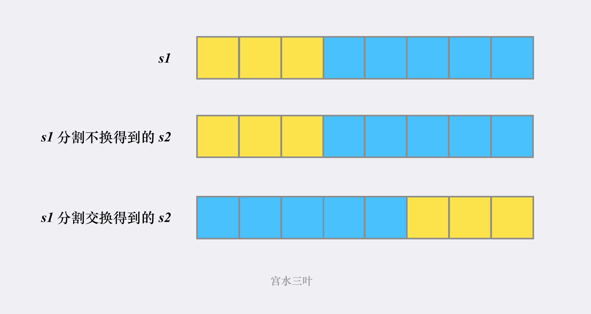

[87. 扰乱字符串](https://leetcode-cn.com/problems/scramble-string/)

使用下面描述的算法可以扰乱字符串 `s` 得到字符串 `t` ：

1. 如果字符串的长度为 1 ，算法停止
2. 如果字符串的长度 > 1 ，执行下述步骤：
   1. 在一个随机下标处将字符串分割成两个非空的子字符串。即，如果已知字符串 `s` ，则可以将其分成两个子字符串 `x` 和 `y` ，且满足 `s = x + y` 。
   2. **随机** 决定是要「交换两个子字符串」还是要「保持这两个子字符串的顺序不变」。即，在执行这一步骤之后，`s` 可能是 `s = x + y` 或者 `s = y + x` 。
   3. 在 `x` 和 `y` 这两个子字符串上继续从步骤 1 开始递归执行此算法。

给你两个 **长度相等** 的字符串 `s1` 和 `s2`，判断 `s2` 是否是 `s1` 的扰乱字符串。如果是，返回 `true` ；否则，返回 `false` 。

```
示例 1：

输入：s1 = "great", s2 = "rgeat"
输出：true
解释：s1 上可能发生的一种情形是：
"great" --> "gr/eat" // 在一个随机下标处分割得到两个子字符串
"gr/eat" --> "gr/eat" // 随机决定：「保持这两个子字符串的顺序不变」
"gr/eat" --> "g/r / e/at" // 在子字符串上递归执行此算法。两个子字符串分别在随机下标处进行一轮分割
"g/r / e/at" --> "r/g / e/at" // 随机决定：第一组「交换两个子字符串」，第二组「保持这两个子字符串的顺序不变」
"r/g / e/at" --> "r/g / e/ a/t" // 继续递归执行此算法，将 "at" 分割得到 "a/t"
"r/g / e/ a/t" --> "r/g / e/ a/t" // 随机决定：「保持这两个子字符串的顺序不变」
算法终止，结果字符串和 s2 相同，都是 "rgeat"
这是一种能够扰乱 s1 得到 s2 的情形，可以认为 s2 是 s1 的扰乱字符串，返回 true

示例 2：

输入：s1 = "abcde", s2 = "caebd"
输出：false

示例 3：

输入：s1 = "a", s2 = "a"
输出：true
```

**提示：**

- `s1.length == s2.length`
- `1 <= s1.length <= 30`
- `s1` 和 `s2` 由小写英文字母组成

[题解来源](https://leetcode-cn.com/problems/scramble-string/solution/gong-shui-san-xie-yi-ti-san-jie-di-gui-j-hybk/)

## 方法一：dfs-剪枝（超时）

一个朴素的做法根据「扰乱字符串」的生成规则进行判断。

由于题目说了整个生成「扰乱字符串」的过程是通过「递归」来进行。

我们要实现 dfs 函数的作用是判断：当前的 s1 是否可由 s2 分割+交换得到

这样判断的过程，同样我们可以使用「递归」来做：

假设 s1 的长度为 n， 的第一次分割的分割点为 i，那么 s1 会被分成 [0, i) 和 [i, n) 两部分。

同时由于生成「扰乱字符串」时，可以选交换也可以选不交换。因此我们的 s2 会有两种可能性：



- 对于某个确定的分割点 i，s1 固定分为两部分，分别为 [0,i) & [i, n)

- 而 s2 可能会有两种分割方式，分别 [0,i) & [i,n) 和 [0, n-i) & [n-i,n)

- 我们只需要递归调用 dfs 检查 s1 的 [0,i) & [i, n) 部分能否与 「s2 的 [0,i) & [i,n)」 或者 「s2 的 [0, n-i) & [n-i,n)」 匹配即可

- 同时，我们将「s1 和 s2 相等」和「s1 和 s2 词频不同」作为「递归」出口。

理解这套做法十分重要，后续的解法都是基于此解法演变过来。

问：为什么需要做词频检查？

为了「剪枝」。base case 为 `if (s1 == s2) return true;` 当 s1 == s2 时，必然返回true，但是当 s1 != s2 时，无法判断 s1 是否可由 s2 分割+交换得到。因此，可以通过比较词频，如果两个字符串词频不一样，s1 必然不能由 s2 得出。不剪枝也可运行

不进行剪枝：**195 / 288** 个通过测试用例

进行剪枝：**286 / 288** 个通过测试用例，卡在了这个用例上

```
"eebaacbcbcadaaedceaaacadccd"
"eadcaacabaddaceacbceaabeccd"
```

时间复杂度：O(5^n)，讲真不会分析

```cpp
class Solution {
public:
    int cnter1[26];
    int cnter2[26];

    // 当前的 s1 是否可由 s2 分割+交换得到
    bool dfs(string &s1, string &s2) {
        if (s1 == s2) return true;         // base case
        if (!check(s1, s2)) return false;  // 词频不同（剪枝），去掉后也可以运行

        int n = s1.size();
        for (int i = 1; i < n; i++) {        // i 分割点
            string a = s1.substr(0, i);      // s1[0,i)
            string b = s1.substr(i);         // s1[i,n-1]
            string c = s2.substr(0, i);      // s2[0,i)
            string d = s2.substr(i);         // s2[i,n-1]
            string e = s2.substr(0, n - i);  // [0,n-i)
            string f = s2.substr(n - i);     // s2[n-i,n-1]
            if (dfs(a, c) && dfs(b, d)) return true;
            if (dfs(a, f) && dfs(b, e)) return true;  // 注意是a和f，b和e比较
        }
        return false;
    }

    // 词频检查
    bool check(string &s1, string &s2) {
        if (s1.size() != s2.size()) return false;
        for (int i = 0; i < 26; i++) {
            cnter1[i] = 0;
            cnter2[i] = 0;
        }
        for (char c1 : s1) cnter1[c1 - 97]++;
        for (char c2 : s2) cnter2[c2 - 97]++;
        for (int i = 0; i < 26; i++) {
            if (cnter1[i] != cnter2[i]) return false;
        }
        return true;
    }

    bool isScramble(string s1, string s2) {
        return dfs(s1, s2);
    }
};
```

## 方法二：记忆化搜索

记忆化搜索是一种通过记录已经遍历过的状态的信息，从而避免对同一状态重复遍历的搜索实现方式

分析上述dfs的实现，会出现「重复子问题」

例如 s1=abcd s2=cdab 就满足题意，而这个子问题可能会在递归树中「重复」出现

为了方便对「子问题」或「状态」进行记录，将锁定 s1 和 s2 的方式改成下标，并对可能的长度进行枚举

这样描述一个「子问题」或「状态」使用了「三个维度」：s1中下标 i，s2中下标 j，当前检查的长度 len


做剪枝：执行用时：4 ms, 在所有 C++ 提交中击败了98.97%的用户，内存消耗：15.5 MB, 在所有 C++ 提交中击败了39.18%的用户

不做剪枝：执行用时：16 ms, 在所有 C++ 提交中击败了74.84%的用户，内存消耗：17.1 MB, 在所有 C++ 提交中击败了29.15%的用户

- 时间复杂度：O(n^4)，讲真不会分析
- 空间复杂度：O(n^3)

```cpp
class Solution {
public:
    int n;
    int _s1;
    int _s2;
    int cnter1[26];
    int cnter2[26];
    vector<vector<vector<int>>> memo;  // -1为空，0为false，1为true

    // s1下标i，s2下标j，截取长度len
    int dfs(int i, int j, int len) {
        if (memo[i][j][len] != -1) return memo[i][j][len];

        string a = _s1.substr(i, len);
        string b = _s2.substr(j, len);
        if (a == b) {
            memo[i][j][len] = 1;
            return true;
        }
        if (!check(a, b)) {  // 剪枝
            memo[i][j][len] = 0;
            return false;
        }
        for (int k = 1; k < len; k++) {
            // s1 前后两端起点：i,i+k，长度分别为：k,len-k
            // s2 前后两段起点（不交换）：j,j+k，长度分别为：k,len-k
            // s2 前后两端起点（交换）：j+len-k,j，长度分别为：k,len-k
            if (dfs(i, j, k) && dfs(i + k, j + k, len - k)) {
                memo[i][j][len] = 1;
                return true;
            }
            if (dfs(i, j + len - k, k) && dfs(i + k, j, len - k)) {
                memo[i][j][len] = 1;
                return true;
            }
        }
        memo[i][j][len] = 0;
        return false;
    }

    // 词频检查
    bool check(string &s1, string &s2) {
        if (s1.size() != s2.size()) return false;
        for (int i = 0; i < 26; i++) {
            cnter1[i] = 0;
            cnter2[i] = 0;
        }
        for (char c1 : s1) cnter1[c1 - 97]++;
        for (char c2 : s2) cnter2[c2 - 97]++;
        for (int i = 0; i < 26; i++) {
            if (cnter1[i] != cnter2[i]) return false;
        }
        return true;
    }

    bool isScramble(string s1, string s2) {
        n = s1.size();
        _s1 = s1;
        _s2 = s2;
        memo.resize(n, vector<vector<int>>(n, vector<int>(n + 1, -1)));
        return dfs(0, 0, n);
    }
};
```

## 方法三：区间DP

其实有了上述「记忆化搜索」方案之后，我们就已经可以直接忽略原问题，将其改成「动态规划」了。

根据「dfs 方法的几个可变入参」作为「状态定义的几个维度」，根据「dfs 方法的返回值」作为「具体的状态值」。

我们可以得到状态定义 `dp[i][j][len]`

`dp[i][j][len]` 代表 s1 从 i 开始，s2 从 j 开始，后面长度为 len 的字符是否能形成「扰乱字符串」（互为翻转）。

从状态定义上，我们就不难发现**这是一个「区间 DP」问题，区间长度大的状态值可以由区间长度小的状态值递推而来**。

而且由于本身我们在「记忆化搜索」里面就是**从小到大枚举 len，因此这里需要先将 len 这层循环提前，确保我们转移 `dp[i][j][len]` 时所需要的状态都已经被计算好**。

初始化：需要将长度为 1 也就是字母，字母相同的置为 1，不相同的置为 0

```cpp
class Solution {
public:
    bool isScramble(string s1, string s2) {
        int n = s1.size();
        vector<vector<vector<int>>> dp(n, vector<vector<int>>(n, vector<int>(n + 1, 0)));
        for (int i = 0; i < n; i++) {
            for (int j = 0; j < n; j++) {
                if (s1[i] == s2[j]) {
                    dp[i][j][1] = 1;
                }
            }
        }

        for (int len = 2; len <= n; len++) {
            for (int i = 0; i + len - 1 < n; i++) {
                for (int j = 0; j + len - 1 < n; j++) {
                    for (int k = 1; k < len; k++) {
                        bool res1 = dp[i][j][k] && dp[i + k][j + k][len - k];
                        bool res2 = dp[i][j + len - k][k] && dp[i + k][j][len - k];
                        if (res1 || res2) {
                            dp[i][j][len] = true;
                            break;
                        }
                    }
                }
            }
        }
        return dp[0][0][n];
    }
};
```

执行用时：32 ms, 在所有 C++ 提交中击败了45.70%的用户

内存消耗：13.5 MB, 在所有 C++ 提交中击败了46.74%的用户

区间dp比记忆化搜索慢的原因可能是：没有进行剪枝
