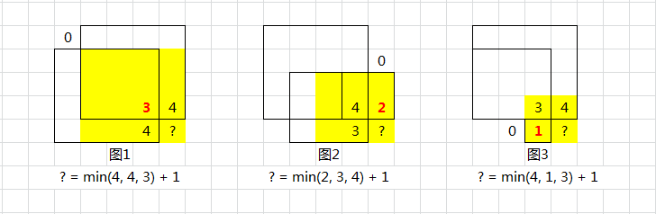

题目：[221. 最大正方形](https://leetcode.cn/problems/maximal-square/)

在一个由 `'0'` 和 `'1'` 组成的二维矩阵内，找到只包含 `'1'` 的最大正方形，并返回其面积。

**示例 1：**


```
输入：matrix = [["1","0","1","0","0"],["1","0","1","1","1"],["1","1","1","1","1"],["1","0","0","1","0"]]
输出：4
```

**示例 2：**


```
输入：matrix = [["0","1"],["1","0"]]
输出：1
```

**示例 3：**

```
输入：matrix = [["0"]]
输出：0
```

提示：

m == matrix.length
n == matrix[i].length
1 <= m, n <= 300
`matrix[i][j]` 为 '0' 或 '1'

---

`dp(i, j)` 是以 `matrix(i, j)` 为 **右下角** 的正方形的最大边长

先来阐述简单共识

- 若形成正方形（非单 `1`），以当前为右下角的视角看，则需要：当前格、上、左、左上都是 `1`
- 可以换个角度：当前格、上、左、左上都不能受 `0` 的限制，才能成为正方形



- 时间复杂度 O(height * width)
- 空间复杂度 O(height * width)

```cpp
class Solution {
public:
    int maximalSquare(vector<vector<char>>& matrix) {
        
        int rows = matrix.size();
        int cols = matrix[0].size();
        // dp[i][j] 为以 matrix[i][j] 为右下角的最大正方形的边长
        vector<vector<int>> dp(rows, vector<int>(cols, 0));
        int maxEdge = 0;

        // 初始化
        for (int r = 0; r < rows; r++) {
            if (matrix[r][0] == '1') {
                dp[r][0] = 1;
                maxEdge = 1;
            }
        }
        for (int c = 0; c < cols; c++) {
            if (matrix[0][c] == '1') {
                dp[0][c] = 1;
                maxEdge = 1;
            }
        }

        for (int r = 1; r < rows; r++) {
            for (int c = 1; c < cols; c++) {
                if (matrix[r][c] == '0') continue;
                dp[r][c] = min(dp[r-1][c], min(dp[r-1][c-1], dp[r][c-1])) + 1;
                maxEdge = max(maxEdge, dp[r][c]);
            }
        }
        return maxEdge * maxEdge;
    }
};
```

