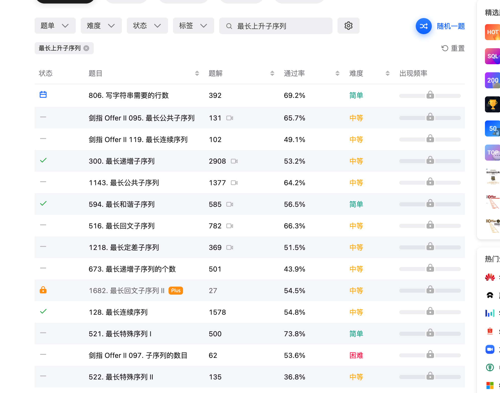

## 最长上升子序列

题目：https://leetcode-cn.com/problemset/all/?search=%E6%9C%80%E9%95%BF%E5%BA%8F%E5%88%97&page=1

https://leetcode-cn.com/problems/longest-increasing-subsequence/solution/dong-tai-gui-hua-er-fen-cha-zhao-tan-xin-suan-fa-p/

https://leetcode-cn.com/problems/increasing-triplet-subsequence/solution/gong-shui-san-xie-zui-chang-shang-sheng-xa08h/

https://mp.weixin.qq.com/s?__biz=MzU4NDE3MTEyMA==&mid=2247487814&idx=1&sn=e33023c2d474ff75af83eda1c4d01892&chksm=fd9cba59caeb334f1fbfa1aefd3d9b2ab6abfccfcab8cb1dbff93191ae9b787e1b4681bbbde3&token=252055586&lang=zh_CN#rd

https://leetcode-cn.com/problems/increasing-triplet-subsequence/

