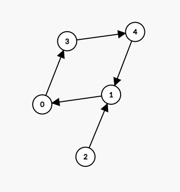

# 内向基环树

来源1：[内向基环树：拓扑排序 + 分类讨论（Python/Java/C++/Go） - 参加会议的最多员工数 - 力扣（LeetCode）](https://leetcode.cn/problems/maximum-employees-to-be-invited-to-a-meeting/solution/nei-xiang-ji-huan-shu-tuo-bu-pai-xu-fen-c1i1b/)

来源2：[计算到每个点的距离（Python/Java/C++/Go） - 找到离给定两个节点最近的节点 - 力扣（LeetCode）](https://leetcode.cn/problems/find-closest-node-to-given-two-nodes/solution/ji-suan-dao-mei-ge-dian-de-ju-chi-python-gr2u/)

来源3：[内向基环树找环 + 利用时间戳简单实现（Python/Java/C++/Go） - 图中的最长环 - 力扣（LeetCode）](https://leetcode.cn/problems/longest-cycle-in-a-graph/solution/nei-xiang-ji-huan-shu-zhao-huan-li-yong-pmqmr/)

## 概述

从 `i` 向 `arr[i]` 连边，我们可以得到一张有向图。由于每个大小为 `k` 的连通块都有 `k` 个点和 `k` 条边，所以每个连通块必定有且仅有一个环，且由于每个点的出度均为 `1`，这样的有向图又叫做内向**基环树 (pseudotree)**，由基环树组成的森林叫**基环树森林 (pseudoforest)**。

每一个内向基环树（连通块）都由一个**基环**和其余指向基环的**树枝**组成。

**基环树/森林特点**：

- 每个大小为 `k` 的连通块都有 `k` 个点和 `k` 条边
- 每个连通块必定有且仅有一个环
- 每个点的出度均为 `1`
- 注意：数组 edges 是个基环森林

**经典描述**

给你一个 n 个节点的 有向图 ，节点编号为 0 到 n - 1 ，每个节点 至多 有一条出边。如 `edges = [3,3,4,2,3]`

有向图用大小为 n 下标从 0 开始的数组 edges 表示，表示节点 i 有一条有向边指向 edges[i] 。如果节点 i 没有出边，那么 edges[i] == -1 。

注意 `edges` 可能包含环。

### 通用处理方法

下面介绍基环树问题的通用处理方法。

1. 生成入度表
2. 我们可以通过一次拓扑排序「剪掉」所有树枝，**因为拓扑排序后，树枝节点的入度均为 0，基环节点的入度均为 1**。这样就可以将基环和树枝分开，从而简化后续处理流程：
3. 遍历内向基环树
   - 如果要遍历基环，可以**从拓扑排序后入度为 1 的节点出发**，在图上搜索；
   - 如果要遍历树枝，可以**以基环与树枝的连接处为起点，顺着反图来搜索树枝**（搜索入度为 0 的节点），从而将问题转化成一个树形问题。

## 例题1：图中的最长环（求基环的大小）

题目：[2360. 图中的最长环](https://leetcode.cn/problems/longest-cycle-in-a-graph/)

给你一个 n 个节点的 **有向图** ，节点编号为 0 到 n - 1 ，其中每个节点 **至多** 有一条出边。

图用一个大小为 n 下标从 0 开始的数组 edges 表示，节点 i 到节点 edges[i] 之间有一条有向边。如果节点 i 没有出边，那么 edges[i] == -1 。

请你返回图中的 **最长** 环，如果没有任何环，请返回 -1 。

一个环指的是起点和终点是 同一个 节点的路径。

示例 1：


```
输入：edges = [3,3,4,2,3]
输出去：3
解释：图中的最长环是：2 -> 4 -> 3 -> 2 。
这个环的长度为 3 ，所以返回 3 。
```

示例 2：


```
输入：edges = [2,-1,3,1]
输出：-1
解释：图中没有任何环。
```

---

### 1、拓扑排序法

时间复杂度：O(n)

空间复杂度：O(n)

```cpp
class Solution {
public:
    int longestCycle(vector<int>& edges) {
        int n = edges.size();
        vector<int> indegree(n, 0);

        // 1. 生成入度表
        for (int i = 0; i < n; i++) {
            int next = edges[i];
            if (next != -1) indegree[next]++;
        }

        // 2. 拓扑排序（为了重新计算入度表）
        queue<int> q;
        for (int i = 0; i < n; i++) {
            if (indegree[i] == 0) q.push(i);
        }
        while (!q.empty()) {
            int cur = q.front();
            q.pop();

            int next = edges[cur];  // cur 只有一条出边
            if (next == -1) continue;
            indegree[next]--;
            if (indegree[next] == 0) q.push(next);
        }

        // 3. 遍历所有的点，拓扑排序后入度大于 0 的点为基环上的点
        // 注意：可能是个森林存在多个连通分量
        int max_ring_size = -1;
        for (int cur = 0; cur < n; cur++) {
            if (indegree[cur] <= 0) continue;

            indegree[cur] = -1;  // 取基环上的一个点，作为起点，标记用过；
            int ring_size = 1;   // 基环的大小
            int next = edges[cur];
            while (next != cur) {
                indegree[next] = -1;  // 将基环上的点的入度标记为 -1，避免重复访问
                ring_size++;
                next = edges[next];
            }
            max_ring_size = max(max_ring_size, ring_size);
        }
        return max_ring_size;
    }
};
```

### 2、时间戳法

除了使用那篇题解中的通用做法（拓扑排序）外，我们还可以利用时间戳来实现找环的逻辑。

具体来说，初始时间戳 clock=1，首次访问一个点 x 时，记录访问这个点的时间 time[x]=clock，然后将 clock 加一。

如果首次访问一个点，则记录当前时间 startTime=clock，并尝试从这个点出发，看能否找到环。如果找到了一个之前访问过的点 x，且之前访问 x 的时间不早于 startTime，则说明我们找到了一个新的环，此时的环长就是前后两次访问 x 的时间差，即 clock−time[x]。

取所有环长的最大值作为答案。若没有找到环，则返回 −1。

复杂度分析

- 时间复杂度：O(n)，其中 n 为 edges 的长度。
- 空间复杂度：O(n)。

```python
class Solution:
    def longestCycle(self, edges: List[int]) -> int:
        time = [0] * len(edges)
        clock, ans = 1, -1
        for x, t in enumerate(time):
            if t: continue
            start_time = clock
            while x >= 0:
                if time[x]:  # 重复访问
                    if time[x] >= start_time:  # 找到了一个新的环
                        ans = max(ans, clock - time[x])
                    break
                time[x] = clock
                clock += 1
                x = edges[x]
        return ans
```

### 3、返回最长环上的所有节点

```cpp
            vector<int> path = {cur};
			while (next != cur) {
                indegree[next] = -1;
                path.push_back(next); // 记录
                ring_size++;
                next = edges[next];
            }
```


## 例题2：求基环的大小变形题

题目：[2127. 参加会议的最多员工数](https://leetcode.cn/problems/maximum-employees-to-be-invited-to-a-meeting/)

一个公司准备组织一场会议，邀请名单上有 n 位员工。公司准备了一张 **圆形** 的桌子，可以坐下 **任意数目** 的员工。

员工编号为 0 到 n - 1 。每位员工都有一位 **喜欢** 的员工，每位员工 **当且仅当** 他被安排在喜欢员工的旁边，他才会参加会议。每位员工喜欢的员工 **不会** 是他自己。

给你一个下标从 **0** 开始的整数数组 favorite ，其中 favorite[i] 表示第 i 位员工喜欢的员工。请你返回参加会议的 **最多员工数目** 。

```
示例 1:
输入：favorite = [2,2,1,2]
输出：3
解释：
上图展示了公司邀请员工 0，1 和 2 参加会议以及他们在圆桌上的座位。
没办法邀请所有员工参与会议，因为员工 2 没办法同时坐在 0，1 和 3 员工的旁边。
注意，公司也可以邀请员工 1，2 和 3 参加会议。
所以最多参加会议的员工数目为 3 。

示例 2：
输入：favorite = [1,2,0]
输出：3
解释：
每个员工都至少是另一个员工喜欢的员工。所以公司邀请他们所有人参加会议的前提是所有人都参加了会议。
座位安排同图 1 所示：
- 员工 0 坐在员工 2 和 1 之间。
- 员工 1 坐在员工 0 和 2 之间。
- 员工 2 坐在员工 1 和 0 之间。
参与会议的最多员工数目为 3 。

示例 3：
输入：favorite = [3,0,1,4,1]
输出：4
解释：
上图展示了公司可以邀请员工 0，1，3 和 4 参加会议以及他们在圆桌上的座位。
员工 2 无法参加，因为他喜欢的员工 0 旁边的座位已经被占领了。
所以公司只能不邀请员工 2 。
参加会议的最多员工数目为 4 。
```

**分析**：

例如示例 [3,0,1,4,1] 可以得到如下内向基环树，其基环由节点 0、1、3 和 4 组成，节点 2 为其树枝：



特别地，我们得到的基环可能只包含两个节点。例如示例 [2,2,1,2] 可以得到如下内向基环树，其基环只包含节点 1 和 2，而节点 0 和 3 组成其树枝：


对于本题来说，**这两类基环树在组成圆桌时会有明显区别**，下文会说明这一点。

**基环大小大于 2**

先来看看基环大小大于 2 的情况，显然基环上的节点组成了一个环，因而可以组成一个圆桌；而树枝上的点，若插入圆桌上 v→w 这两人中间，会导致节点 v 无法和其喜欢的员工坐在一起，因此**树枝上的点是无法插入圆桌的**；

此外，**树枝上的点也不能单独组成圆桌**，因为这样会存在一个出度为 0 的节点，其无法和其喜欢的员工坐在一起。对于其余内向基环树（连通块）上的节点，和树枝同理，也无法插入该基环组成的圆桌。

因此，对于基环大小大于 2 的情况，圆桌的最大员工数目即为最大的基环大小，记作 `maxRingSize`

**基环大小等于 2**

下面来分析基环大小等于 2 的情况。

以如下基环树为例，0 和 1 组成基环，其余节点组成树枝：


- 我们可以先让 0 和 1 坐在圆桌旁（假设 0 坐在 1 左侧），那么 0 这一侧的树枝只能坐在 0 的左侧，而 1 这一侧的树枝只能坐在 1 的右侧。
- 2 可以紧靠着坐在 0 的左侧，而 3 和 4 只能选一个坐在 2 的左侧（如果 4 紧靠着坐在 2 的左侧，那么 3 是无法紧靠着坐在 4 的左侧的，反之亦然）。

这意味着从 0 出发倒着找树枝上的点（即**沿着反图上的边**），每个点只能在其反图上选择其中一个子节点，因此 0 这一侧的节点必须组成一条链，那么我们可以**找最长的那条链**，即上图加粗的节点。

对于 1 这一侧也同理，沿着反图上的边招最长的路径。将这两条最长链拼起来即为该基环树能组成的圆桌的最大员工数。

对于多个基环大小等于 2 的基环树，**每个基环树所对应的链，都可以拼在其余链的末尾**，因此我们可以将这些链全部拼成一个圆桌，其大小记作 `sumChainSize`。

答案即为 `max(maxRingSize, sumChainSize)`


对于本题，我们可以遍历所有基环，并按基环大小分类计算：

- 对于大小大于 2 的基环，我们取基环大小的最大值；
- 对于大小等于 2 的基环，我们可以从基环上的点出发，在反图上找到最大的树枝节点深度。

复杂度分析

- 时间复杂度：O(n)
- 空间复杂度：O(n)

```cpp
class Solution {
public:
    int maximumInvitations(vector<int>& g) {
        int n = g.size();
        vector<vector<int>> rg(n);     // g 的反图
        vector<int> indegree(n);       // g 上每个节点的入读
        
        // 1. 生成入度表
        for (int v = 0; v < n; v++) {  // v 喜欢 w, v->w
            int w = g[v];
            rg[w].push_back(v);
            indegree[w]++;
        }

        // 2. 拓扑排序，剪掉 g 上的所有树枝
        queue<int> q;
        for (int i = 0; i < n; i++) {
            if (indegree[i] == 0) q.push(i);
        }
        while (!q.empty()) {
            int cur = q.front();
            q.pop();

            int next = g[cur];  // cur 只有一条出边
            indegree[next]--;
            if (indegree[next] == 0) q.push(next);
        }

        // 通过反图 rg 寻找树枝上最深的链
        function<int(int)> rdfs = [&](int v) -> int {
            int depth = 1;
            for (int w : rg[v]) {
                if (indegree[w] == 0) {  // 树枝上的点在拓扑排序后，入度均为 0
                    depth = max(depth, rdfs(w) + 1);
                }
            }
            return depth;
        };

        // 3. 遍历所有的点，拓扑排序后入度大于 0 的点为基环上的点
        // 注意：可能是个森林存在多个连通分量
        int max_ring_size = 0;
        int sum_chain_size = 0;
        for (int i = 0; i < n; i++) {
            // 【重点算法】求基环的大小
            if (indegree[i] <= 0) continue;
            
            indegree[i] = -1;   // 取基环上的一个点，作为起点，标记用过；
            int ring_size = 1;  // 基环的大小
            int v = g[i];
            while (v != i) {
                indegree[v] = -1;  // 将基环上的点的入度标记为 -1，避免重复访问
                ring_size++;
                v = g[v];
            }

            if (ring_size == 2) {  // 基环的大小为2，累加两条最长链的长度
                sum_chain_size += rdfs(i) + rdfs(g[i]);
            } else {                                            // 基环的大小大于2，取所有基环的最大值
                max_ring_size = max(max_ring_size, ring_size);  // 取所有基环的最大值
            }
        }

        return max(max_ring_size, sum_chain_size);
    }
};
```

可以在拓扑排序的同时计算出最长链的长度，这样就不需要建反图和在反图上找最长链了，从而节省不少时间、空间和代码量：

```cpp
class Solution {
public:
    int maximumInvitations(vector<int> &g) {  // favorite 就是内向基环森林 g
        int n = g.size();
        int deg[n];
        memset(deg, 0, sizeof(deg));  // g 上每个节点的入度
        for (int w : g) ++deg[w];

        int max_depth[n];
        memset(max_depth, 0, sizeof(max_depth));
        queue<int> q;
        for (int i = 0; i < n; ++i)
            if (deg[i] == 0) q.emplace(i);
        while (!q.empty()) {  // 拓扑排序，剪掉 g 上的所有树枝
            int v = q.front();
            q.pop();
            ++max_depth[v];
            int w = g[v];  // v 只有一条出边
            max_depth[w] = max(max_depth[w], max_depth[v]);
            if (--deg[w] == 0) q.emplace(w);
        }

        int max_ring_size = 0, sum_chain_size = 0;
        for (int i = 0; i < n; ++i) {
            if (deg[i] == 0) continue;
            // 遍历基环上的点（拓扑排序后入度大于 0）
            deg[i] = 0;
            int ring_size = 1;
            for (int v = g[i]; v != i; v = g[v]) {
                deg[v] = 0;  // 将基环上的点的入度标记为 0，避免重复访问
                ++ring_size;
            }
            if (ring_size == 2)
                sum_chain_size += max_depth[i] + max_depth[g[i]] + 2;  // 基环大小为 2，累加两条最长链的长度
            else
                max_ring_size = max(max_ring_size, ring_size);  // 取所有基环的最大值
        }
        return max(max_ring_size, sum_chain_size);
    }
};
```

## 例题3：求一个点到基环树上任意点的距离

题目：[2359. 找到离给定两个节点最近的节点](https://leetcode.cn/problems/find-closest-node-to-given-two-nodes/)

给你一个 n 个节点的 **有向图** ，节点编号为 0 到 n - 1 ，每个节点 **至多** 有一条出边。

有向图用大小为 n 下标从 **0** 开始的数组 edges 表示，表示节点 i 有一条有向边指向 edges[i] 。如果节点 i 没有出边，那么 edges[i] == -1 。

同时给你两个节点 node1 和 node2 。

请你返回一个从 node1 和 node2 都能到达节点的编号，使节点 node1 和节点 node2 到这个节点的距离 **较大值最小化**。如果有多个答案，请返回 **最小** 的节点编号。如果答案不存在，返回 -1 。

注意 edges 可能包含环。

示例 1：


> 输入：edges = [2,2,3,-1], node1 = 0, node2 = 1
> 输出：2
> 解释：从节点 0 到节点 2 的距离为 1 ，从节点 1 到节点 2 的距离为 1 。
> 两个距离的较大值为 1 。我们无法得到一个比 1 更小的较大值，所以我们返回节点 2 。

示例 2：


> 输入：edges = [1,2,-1], node1 = 0, node2 = 2
> 输出：2
> 解释：节点 0 到节点 2 的距离为 2 ，节点 2 到它自己的距离为 0 。
> 两个距离的较大值为 2 。我们无法得到一个比 2 更小的较大值，所以我们返回节点 2 。

提示：

- n == edges.length
- 2 <= n <= 105
- -1 <= edges[i] < n
- edges[i] != i
- 0 <= node1, node2 < n

---

复杂度分析

- 时间复杂度：O(n)
- 空间复杂度：O(n)

```cpp
class Solution {
public:
    // 【重点】求一个点到基环树上任意点的距离
    vector<int> calc_dis(int cur, vector<int>& edges) {
        int n = edges.size();
        vector<int> dis(n, INT_MAX);
        int d = 0;  // 距离

        while (cur >= 0 && dis[cur] == INT_MAX) {  // 当前点可到达，且没来过（因为有环）
            dis[cur] = d;
            d++;
            cur = edges[cur];
        }
        return dis;
    }

    int closestMeetingNode(vector<int>& edges, int node1, int node2) {
        int n = edges.size();
        int ans = -1;
        int min_dis = INT_MAX;

        vector<int> dis1 = calc_dis(node1, edges);
        vector<int> dis2 = calc_dis(node2, edges);

        for (int i = 0; i < n; i++) {
            int d = max(dis1[i], dis2[i]);
            if (d < min_dis) {
                min_dis = d;
                ans = i;
            }
        }
        return ans;
    }
};
```

