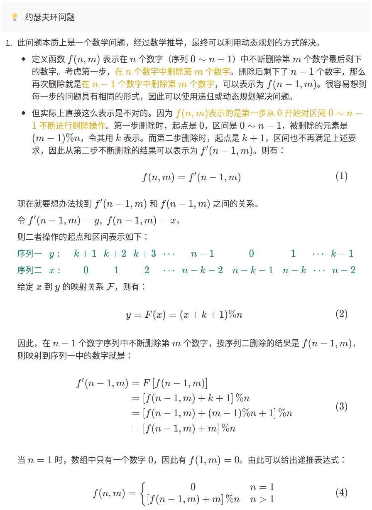

# 约瑟夫环

题目：[剑指 Offer 62. 圆圈中最后剩下的数字](https://leetcode.cn/problems/yuan-quan-zhong-zui-hou-sheng-xia-de-shu-zi-lcof/)

0,1,···,n-1这n个数字排成一个圆圈，从数字0开始，每次从这个圆圈里删除第m个数字（删除后从下一个数字开始计数）。求出这个圆圈里剩下的最后一个数字。

例如，0、1、2、3、4这5个数字组成一个圆圈，从数字0开始每次删除第3个数字，则删除的前4个数字依次是2、0、4、1，因此最后剩下的数字是3。

```
输入: n = 5, m = 3
输出: 3

输入: n = 10, m = 17
输出: 2
```

**限制：**

- `1 <= n <= 10^5`
- `1 <= m <= 10^6`

## 解法一：模拟链表，O(n^2)

如果单纯用链表模拟的话，时间复杂度是 O(nm)，肯定是不能这么做的。尝试下用数组模拟链表

分析下纯暴力的做法，每次找到删除的那个数字，需要 O(m) 的时间复杂度，然后删除了 n-1 次。**但实际上我们可以直接找到下一个要删除的位置的**！

- 假设当前删除的位置是 idx，下一个删除的数字的位置是 `idx + m`
- 但是，由于把当前位置的数字删除了，后面的数字会前移一位，所以实际的下一个位置是 `idx + m - 1`
- 由于数到末尾会从头继续数，所以最后取模一下，就是 `(idx + m - 1) % n`

时间复杂度：`O(n^2)`

```cpp
class Solution {
public:
    int lastRemaining(int n, int m) {
        vector<int> circle(n);
        for (int i = 0; i < n; i++) {
            circle[i] = i;
        }
        int idx = 0;
        while (n > 1) {
            idx = (idx + m - 1) % n;
            circle.erase(circle.begin() + idx);
            n--;
        }
        return circle[0];
    }
};
```

## 解法二：数学解法，O(n)

**1、重点：只关心最终活着那个人的序号变化**

例子是`N=8 m=3`的例子

定义`f(n,m)`表示最后剩下那个人的`索引号`，因此我们只关系最后剩下来这个人的索引号的变化情况即可


从8个人开始，每次杀掉一个人，去掉被杀的人，然后把杀掉那个人之后的第一个人作为开头重新编号

- 第一次C被杀掉，人数变成7，D作为开头，（最终活下来的G的编号从6变成3）
- 第二次F被杀掉，人数变成6，G作为开头，（最终活下来的G的编号从3变成0）
- 第三次A被杀掉，人数变成5，B作为开头，（最终活下来的G的编号从0变成3）
- 以此类推，当只剩一个人时，他的编号必定为0！（重点！）

**2、最终活着的人编号的反推**

现在我们知道了G的索引号的变化过程，那么我们反推一下从N = 7 到N = 8 的过程

如何才能将N = 7 的排列变回到N = 8 呢？

我们先把被杀掉的C补充回来，然后右移m个人，发现溢出了，再把溢出的补充在最前面

神奇了 经过这个操作就恢复了N = 8 的排列了！


因此我们可以推出递推公式 `f(8,3) = (f(7, 3) + 3) % 8`
进行推广泛化，即 `f(n,m) = (f(n-1, m) + m) % n`

**3、递推公式的导出**

再把`n=1`这个最初的情况加上，就得到递推公式
$$
f(n,m) = 
\begin{cases}
0 & n=1 \\
(f(n-1, m) + m) \% n & n>1
\end{cases}
$$
时间复杂度：`O(n)`

递归写法，自顶向下，空间复杂度为 `O(n)`

```cpp
class Solution {
public:
    int f(int n, int m) {
        if (n == 1) return 0;
        return (f(n - 1, m) + m) % n;
    }

    int lastRemaining(int n, int m) {
        return f(n, m);
    }
};
```

迭代写法，自底向上，空间复杂度为 `O(1)`

```cpp
class Solution {
public:
    int lastRemaining(int n, int m) {
        int ans = 0;  //最后剩下一个人的情况时胜利者的下标是0
        //开始逆推
        for (int i = 2; i != n + 1; ++i) {
            ans = (ans + m) % i;  //循环右移m位
        }
        return ans;
    }
};
```

## 数学证明



## Reference

[这或许是你能找到的最详细约瑟夫环数学推导！ - 知乎 (zhihu.com)](https://zhuanlan.zhihu.com/p/121159246)

[Java解决约瑟夫环问题，告诉你为什么模拟会超时！ - 圆圈中最后剩下的数字 - 力扣（LeetCode）](https://leetcode.cn/problems/yuan-quan-zhong-zui-hou-sheng-xia-de-shu-zi-lcof/solution/javajie-jue-yue-se-fu-huan-wen-ti-gao-su-ni-wei-sh/)

[换个角度举例解决约瑟夫环 - 圆圈中最后剩下的数字 - 力扣（LeetCode）](https://leetcode.cn/problems/yuan-quan-zhong-zui-hou-sheng-xia-de-shu-zi-lcof/solution/huan-ge-jiao-du-ju-li-jie-jue-yue-se-fu-huan-by-as/)


## 例题二

题目：[390. 消除游戏](https://leetcode.cn/problems/elimination-game/)