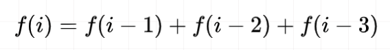
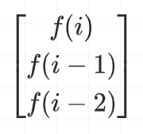
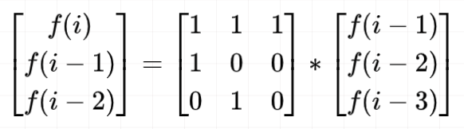
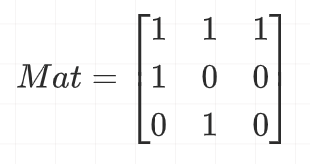

# 矩阵快速幂

## 一、矩阵快速幂

泰波那契序列 Tn 定义如下： 

T0 = 0, T1 = 1, T2 = 1, 且在 n >= 0 的条件下 Tn+3 = Tn + Tn+1 + Tn+2

给你整数 n，请返回第 n 个泰波那契数 Tn 的值。

```
输入：n = 4
输出：4
解释：
T_3 = 0 + 1 + 1 = 2
T_4 = 1 + 1 + 2 = 4

输入：n = 25
输出：1389537
```

矩阵快速幂用于求解一般性问题：给定大小为 `n*n` 的矩阵 `M`，求答案矩阵 `M^k`，并对答案矩阵中的每位元素对 `P` 取模。

在上述两种解法中，当我们要求解 `f[i]` 时，需要将 `f[0]` 到 `f[n-1]` 都算一遍，因此需要线性的复杂度。

对于此类的「数列递推」问题，我们可以使用「矩阵快速幂」来进行加速（比如要递归一个长度为 `1e9` 的数列，线性复杂度会被卡）

使用矩阵快速幂，我们只需要 `O(logn)` 的复杂度。

根据题目的递推关系（`i>=3`）：



我们发现要求解 `f(i)`，其依赖的是 `f(i-1)`、`f(i-2)` 和 `f(i-3)`。

我们可以将其存成一个列向量：


当我们整理出依赖的列向量之后，不难发现，我们想求的 `f(i)` 所在的列向量是这样的：



**1、利用题目给定的依赖关系，对目标矩阵元素进行展开**：


因为有 `3` 项，所以矩阵的形状是 `3*3`

**2、求 Mat 矩阵**

那么根据矩阵乘法，即有：



我们令



**3、然后发现，利用 `Mat` 我们也能实现数列递推**（公式太难敲了，随便列两项吧）：


再根据矩阵运算的结合律，最终有：


从而将问题转化为求解 `Mat^(n-2)`，这时候可以套用「**矩阵快速幂**」解决方案。

---

实际去写代码的时候，是无法将 `3*3` 与 `3*1` 做矩阵运算的，因此需要通过「单位矩阵」记录 `n-2` 个 `3*3` 的 `Mat` 相乘的结果

结尾为 `3*3` 的 `res` 矩阵

```
	  1 0 0
res = 0 1 0 * Mat^(n-2)
	  0 0 1
```

最后为了得到 `f(n)`，`3*3` 的 `res` 矩阵再乘 `3*1` 的 `f(2) f(1) f(0)` 的矩阵

```
f(n)		   f(2)
f(n-1) = res * f(1)
f(n-2)		   f(0)

f(n)     a b c	 f(2)
f(n-1) = d e f * f(1)
f(n-2)   g h i   f(0)

f(n) = a*f(2) + b*f(1) + c*f(0)
f(n) = res[0][0]*f(2) + res[0][1]*f(1) + res[0][2]*f(0)
f(n) = res[0][0]*1 + res[0][1]*1 + res[0][2]*0
f(n) = res[0][0] + res[0][1]
```


```cpp
#define N 3

class Solution {
public:
    // 矩阵运算 c = a * b
    vector<vector<long>> multiply(vector<vector<long>>& a, vector<vector<long>>& b) {
        vector<vector<long>> c(N, vector<long>(N, 0));
        for (int i = 0; i < N; i++) {
            for (int j = 0; j < N; j++) {
                // c[i][j] = a[i][0] * b[0][j] + a[i][1] * b[1][j] + a[i][2] * b[2][j];
                for (int k = 0; k < N; k++) {
                    c[i][j] += a[i][k] * b[k][j];
                }
            }
        }
        return c;
    }
    int tribonacci(int n) {
        if (n == 0) return 0;
        if (n == 1 || n == 2) return 1;

        vector<vector<long>> res = {
            {1, 0, 0},
            {0, 1, 0},
            {0, 0, 1}};

        vector<vector<long>> mat = {
            {1, 1, 1},
            {1, 0, 0},
            {0, 1, 0}};

        // 快速幂
        int k = n - 2;
        while (k > 0) {
            if ((k & 1) != 0) res = multiply(mat, res); // 奇数时才能乘
            mat = multiply(mat, mat);
            k >>= 1; // 除2，向下取整
        }

        return res[0][0] + res[0][1];
    }
};

```

### 快速幂

当 k 为奇数 5 时

```
	 第一轮          第二轮   第三轮
res: mat^1 * res	-----  	mat^(1+4) * res
mat: mat^2        	mat^4  	mat^8
k:   2            	1 		0

结束时：res = mat^5 * res
```

当 k 为偶数 4 时

```
	 第一轮	第二轮   第三轮
res: -----	  -----   mat^4 * res
mat: mat^2    mat^4   mat^8
k:   2        1 	  0

结束时：res = mat^4 * res
```

上述的实现是模版，背

### 矩阵运算

`n*n` 矩阵 `a` x `n*n` 矩阵 `b` = `n*n` 矩阵 `c`

```cpp
    vector<vector<long>> multiply(vector<vector<long>>& a, vector<vector<long>>& b) {
        vector<vector<long>> c(N, vector<long>(N, 0));
        for (int i = 0; i < N; i++) {
            for (int j = 0; j < N; j++) {
                for (int k = 0; k < N; k++) {
                    c[i][j] += a[i][k] * b[k][j];
                }
            }
        }
        return c;
    }
```

### 做题步骤

**一般来说，形如 `f(n) = f(n - 1) + f(n - 2)` 都可用 矩阵快速幂**

状态转移方程 `f(n) = f(n - 1) + f(n - 2)`，由前面两项推导当前项，那么

- 矩阵的构成就是 `2*2` ，与后面的项数一样
- `Mat` 矩阵的相乘次数是 `n-1` 次

状态转移方程 `f(n) = f(n - 1) + f(n - 2) + f(n - 3)`，由前面两项推导当前项

- 矩阵的构成就是 `3*3` 
- `Mat` 矩阵的相乘次数是 `n-2` 次

**1、利用题目给定的依赖关系，对目标矩阵元素进行展开**：

形如 `f(n) = f(n - 1) + f(n - 2)` 展开 `2*1` 矩阵，注意只能使用 `f(n) f(n-1) f(n-2)` 三个元素

```
#define N 2

f(n)      1*f(n-1) + 1*f(n-2)
       =
f(n-1)    1*f(n-1) + 0*f(n-2)
```

**2、求 Mat 矩阵**

那么根据矩阵乘法，即有：

```
f(n)      1 1   f(n-1)
       =      *
f(n-1)    1 0   f(n-2)
```

即 Mat 矩阵为

```
1 1
1 0
```

**3、利用 `Mat` 实现数列递推**

```
f(n)         		 f(1)
       = Mat^(n-1) *
f(n-1)       		 f(0)
```

**4、计算**

通过「矩阵快速幂」计算出 `Mat^(n-1)` 为 `res` 矩阵

答案就是

```
	   f(1)
res * 
	   f(0)
	   
return res[0][0]*f(1) + res[0][1]*f(0);
```


