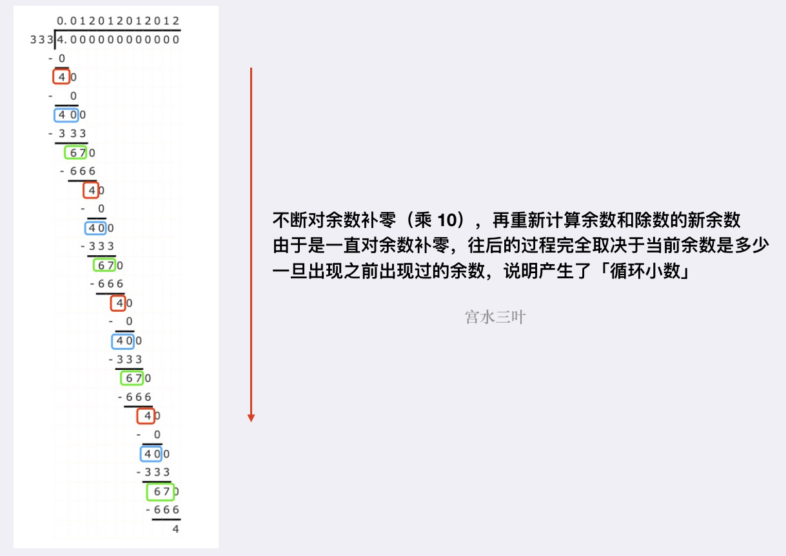

题目：[166. 分数到小数](https://leetcode.cn/problems/fraction-to-recurring-decimal/)

给定两个整数，分别表示分数的分子 `numerator` 和分母 `denominator`，以 **字符串形式返回小数** 。

如果小数部分为循环小数，则将循环的部分括在括号内。

如果存在多个答案，只需返回 **任意一个** 。

对于所有给定的输入，**保证** 答案字符串的长度小于 `10^4` 。

**示例 1：**

```
输入：numerator = 1, denominator = 2
输出："0.5"
```

**示例 2：**

```
输入：numerator = 2, denominator = 1
输出："2"
```

**示例 3：**

```
输入：numerator = 4, denominator = 333
输出："0.(012)"
```

**提示：**

- `-231 <= numerator, denominator <= 231 - 1`
- `denominator != 0`

---

https://leetcode.cn/problems/fraction-to-recurring-decimal/solution/gong-shui-san-xie-mo-ni-shu-shi-ji-suan-kq8c4/

## 模拟

这是一道模拟 [竖式计算（除法）](https://leetcode.cn/link/?target=https://baike.baidu.com/item/竖式计算)的题目。

首先可以明确，两个数相除要么是「有限位小数」，要么是「无限循环小数」，而不可能是「无限不循环小数」。

然后考虑人工计算两数相除是如何进行：



这引导我们可以在模拟竖式计算（除法）过程中，使用「哈希表」记录某个余数最早在什么位置出现过，一旦出现相同余数，则将「出现位置」到「当前结尾」之间的字符串抠出来，即是「循环小数」部分。

> PS. 到这里，从人工模拟除法运算的过程，我们就可以知道「为什么不会出现“无限不循环小数”」，因为始终是对余数进行补零操作，再往下进行运算，而余数个数具有明确的上限（有限集）。所以根据抽屉原理，一直接着往下计算，最终结果要么是「出现相同余数」，要么是「余数为 0，运算结束」。
>

一些细节：

- 一个显然的条件是，如果本身两数能够整除，直接返回即可；
- 如果两个数有一个为“负数”，则最终答案为“负数”，因此可以起始先判断两数相乘是否小于 00，如果是，先往答案头部追加一个负号 `-`；
- 两者范围为 int，但计算结果可以会超过 int 范围，考虑 numerator = -2^{31} 和 denominator=−1 的情况，其结果为 2^{31} ，超出 int 的范围 [-2^{31}, 2^{31} - 1]。因此起始需要先使用 long 对两个入参类型转换一下。

```java
class Solution {
    public String fractionToDecimal(int numerator, int denominator) {
        // 转 long 计算，防止溢出
        long a = numerator, b = denominator;
        // 如果本身能够整除，直接返回计算结果
        if (a % b == 0) return String.valueOf(a / b);
        StringBuilder sb = new StringBuilder();
        // 如果其一为负数，先追加负号
        if (a * b < 0) sb.append('-');
        a = Math.abs(a); b = Math.abs(b);
        // 计算小数点前的部分，并将余数赋值给 a
        sb.append(String.valueOf(a / b) + ".");
        a %= b;
        Map<Long, Integer> map = new HashMap<>();
        while (a != 0) {
            // 记录当前余数所在答案的位置，并继续模拟除法运算
            map.put(a, sb.length());
            a *= 10;
            sb.append(a / b);
            a %= b;
            // 如果当前余数之前出现过，则将 [出现位置 到 当前位置] 的部分抠出来（循环小数部分）
            if (map.containsKey(a)) {
                int u = map.get(a);
                return String.format("%s(%s)", sb.substring(0, u), sb.substring(u));
            }
        }
        return sb.toString();
    }
}
```

时间复杂度：复杂度取决于最终答案的长度，题目规定了最大长度不会超过 10^4 ，整体复杂度为 O(M)

空间复杂度：复杂度取决于最终答案的长度，题目规定了最大长度不会超过 10^4 ，整体复杂度为 O(M)

