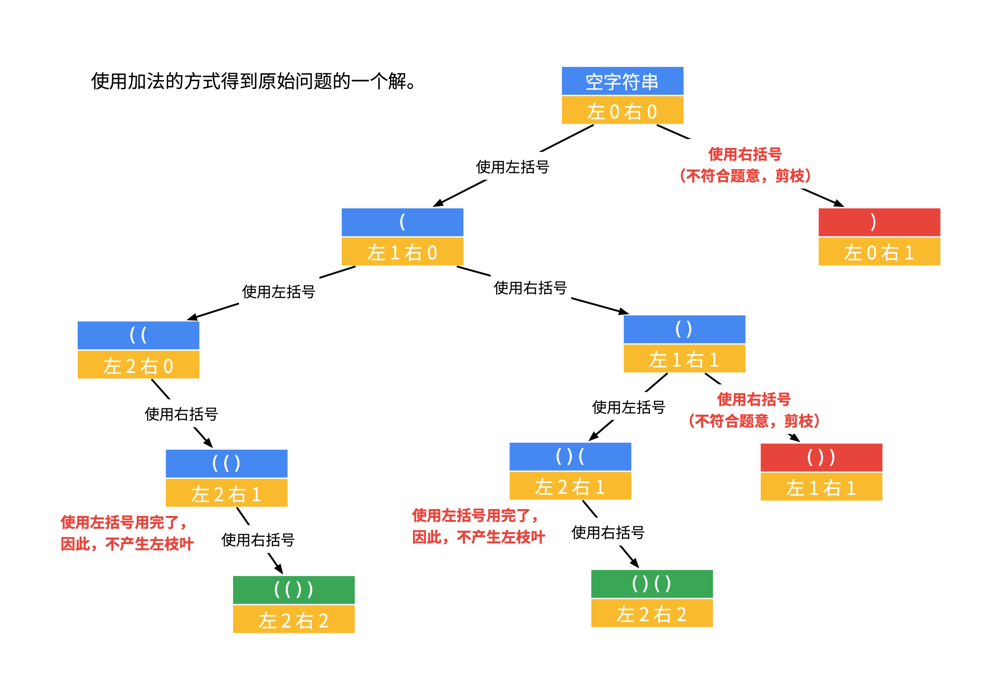

题目：[22. 括号生成](https://leetcode-cn.com/problems/generate-parentheses/)

数字 `n` 代表生成括号的对数，请你设计一个函数，用于能够生成所有可能的并且 **有效的** 括号组合。

```
示例 1：

输入：n = 3
输出：["((()))","(()())","(())()","()(())","()()()"]

示例 2：

输入：n = 1
输出：["()"]
```

**提示：**

- `1 <= n <= 8`

## 方法：剪枝



参考递归树，生出左、右枝叶的条件为：

- 可生出左枝叶的条件：已使用的左括号数量 严格小于 所有左括号数量
- 可生出右枝叶的条件：已使用的右括号数量 严格小于 已使用的左括号数量

```cpp
class Solution {
public:
    int _n;
    vector<string> ans;

    // cur为已拼凑括号，left为已使用左括号数量，right为已使用右括号数量
    void dfs(string cur, int left, int right) {
        if (left == _n && right == _n) {
            ans.push_back(cur);
            return;
        }
        if (left < _n) {
            dfs(cur+"(", left+1, right);
        }
        if (right < left) {
            dfs(cur+")",left,right+1);
        }
    }
    vector<string> generateParenthesis(int n) {
        _n = n;
        dfs("", 0, 0);
        return ans;
    }
};
```

自己的写法

```c++
class Solution {
public:
    int n_;
    int l;
    vector<string> ans;
    vector<char> select = {'(', ')'};
    void dfs(int cnt, int sum_, string path) {
        if (cnt==l) {
            if (sum_==0) {
                ans.push_back(path);
            }
            return;
        }
        for (char c : select) {
            int val;
            if (c=='(') {
                val = 1;
            } else {
                val = -1;
            }
            if (sum_+val<0) continue;
            if (sum_+val>n_) continue;
            path.push_back(c);
            dfs(cnt+1, sum_+val, path);
            path.pop_back();
        }
    }
    vector<string> generateParenthesis(int n) {
        n_ = n;
        l = n*2;
        string path;
        dfs(0, 0, path);
        return ans;
    }
};
```

