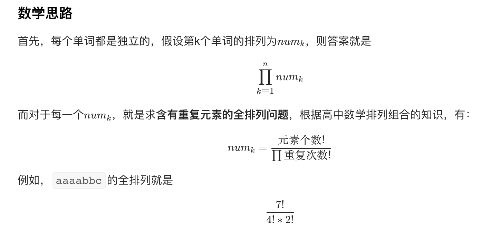

题目：[2514. 统计同位异构字符串数目](https://leetcode.cn/problems/count-anagrams/)

给你一个字符串 `s` ，它包含一个或者多个单词。单词之间用单个空格 `' '` 隔开。

如果字符串 `t` 中第 `i` 个单词是 `s` 中第 `i` 个单词的一个 **排列** ，那么我们称字符串 `t` 是字符串 `s` 的同位异构字符串。

- 比方说，`"acb dfe"` 是 `"abc def"` 的同位异构字符串，但是 `"def cab"` 和 `"adc bef"` 不是。

请你返回 `s` 的同位异构字符串的数目，由于答案可能很大，请你将它对 `109 + 7` **取余** 后返回。

**示例 1：**

```
输入：s = "too hot"
输出：18
解释：输入字符串的一些同位异构字符串为 "too hot" ，"oot hot" ，"oto toh" ，"too toh" 以及 "too oht" 。
```

**示例 2：**

```
输入：s = "aa"
输出：1
解释：输入字符串只有一个同位异构字符串。
```

**提示：**

- `1 <= s.length <= 105`
- `s` 只包含小写英文字母和空格 `' '` 。
- 相邻单词之间由单个空格隔开。



## 代码实现

很自然地，我们只需要**根据空格分词**，对每一个单词**统计字母重复次数**，然后按照上面的公式计算即可，关键在于**单词长度和重复次数都可能很大**，要解决大数阶乘的计算问题。

首先要明确，`(a/b)%c=(a%c)/(b%c)`是**不成立**的，除法取模并不像加减乘那样可以直接分离，而要通过**逆元**计算，不过我不会逆元😭😭😭。所以采用**质因数分解法**进行计算。

显然，num_k 是一个正整数，这意味着 `元素个数!` 可以整除 `∏重复次数!`。那么，如果我们把分子分母同时进行**质因数分解**，可以想见，每一个质因数出现的次数，**分子>=分母**，所以可以对分母的所有质因数**进行约分**，剩下全是分子的了，接下来就可以用乘法根据`(a*b)%c=(a%c)*(b%c)`计算了。

```cpp
class Solution {
public:
    long mod=1e9+7;
    long calculate(string &s)//计算一个单词的全排列
    {
        unordered_map<int,int> memo;//用来存放质因数出现的次数
        vector<int> cnt(26);//存放每个字母出现的次数
        for(char &c:s)
            ++cnt[c-'a'];
        for(int num=2;num<=s.size();++num)//对分子——元素个数的阶乘作质因数分解
        {
            int n=num;
            for(int i = 2; i <= sqrt(n); i ++)
                if(n % i == 0)
                    while(n % i == 0)
                    {
                        ++memo[i];
                        n /= i;
                    }
            if(n != 1) 
                ++memo[n];
        }
        for(int k:cnt)
            for(int num=2;num<=k;++num)//对每个重复次数的阶乘作质因数分解，并从memo中减掉
            {
                int n=num;
                for(int i = 2; i <= sqrt(n); i ++)
                    if(n % i == 0)
                        while(n % i == 0)
                        {
                            --memo[i];
                            n /= i;
                        }
                if(n != 1) 
                    --memo[n];
            }
        long ans=1;
        for(auto &p:memo)//对分子剩下的质因数作乘法
            while(p.second)
                ans=(ans*p.first)%mod,--p.second;
        return ans;
    }
    int countAnagrams(string s) {
        long ans=1;
        stringstream ss(s);//利用string流根据空格分词
        string str;
        while(ss>>str)
            ans=(ans*calculate(str))%mod;//每个单词的结果相乘
        return ans;
    }
};
```

