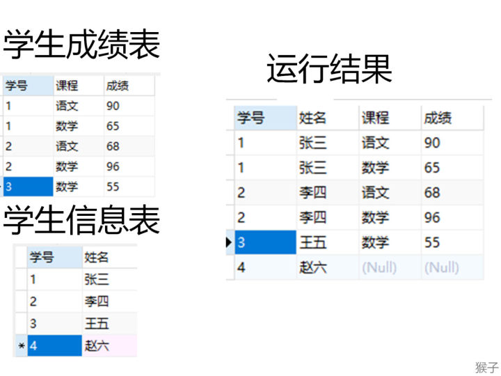
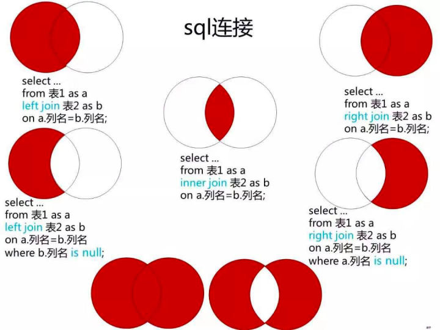

题目：[175. 组合两个表](https://leetcode.cn/problems/combine-two-tables/)

表: `Person`

```
+-------------+---------+
| 列名         | 类型     |
+-------------+---------+
| PersonId    | int     |
| FirstName   | varchar |
| LastName    | varchar |
+-------------+---------+
personId 是该表的主键列。
该表包含一些人的 ID 和他们的姓和名的信息。
```

表: `Address`

```
+-------------+---------+
| 列名         | 类型    |
+-------------+---------+
| AddressId   | int     |
| PersonId    | int     |
| City        | varchar |
| State       | varchar |
+-------------+---------+
addressId 是该表的主键列。
该表的每一行都包含一个 ID = PersonId 的人的城市和州的信息。
```

编写一个SQL查询来报告 `Person` 表中每个人的姓、名、城市和州。如果 `personId` 的地址不在 `Address` 表中，则报告为空  `null` 。

以 **任意顺序** 返回结果表。

查询结果格式如下所示。

**示例 1:**

```
输入: 
Person表:
+----------+----------+-----------+
| personId | lastName | firstName |
+----------+----------+-----------+
| 1        | Wang     | Allen     |
| 2        | Alice    | Bob       |
+----------+----------+-----------+
Address表:
+-----------+----------+---------------+------------+
| addressId | personId | city          | state      |
+-----------+----------+---------------+------------+
| 1         | 2        | New York City | New York   |
| 2         | 3        | Leetcode      | California |
+-----------+----------+---------------+------------+
输出: 
+-----------+----------+---------------+----------+
| firstName | lastName | city          | state    |
+-----------+----------+---------------+----------+
| Allen     | Wang     | Null          | Null     |
| Bob       | Alice    | New York City | New York |
+-----------+----------+---------------+----------+
解释: 
地址表中没有 personId = 1 的地址，所以它们的城市和州返回 null。
addressId = 1 包含了 personId = 2 的地址信息。
```

---

题解：https://leetcode.cn/problems/combine-two-tables/solution/tu-jie-sqlmian-shi-ti-duo-biao-ru-he-cha-xun-by-ho/

### 【题目】

现在有两个表，“学生表”记录了学生的基本信息，有“学号”、“姓名”。

“成绩”表记录了学生选修的课程，以及对应课程的成绩。

这两个表通过“学号”进行关联。

现在要查找出所有学生的学号，姓名，课程和成绩。



### 【解题思路】

**1.确定查询结果**

题目要求查询所有学生的姓名，学号，课程和成绩信息

select 学号,姓名,课程,成绩

查询结果的列名“学号”、“姓名”，在“学生”表里，列名“课程”、“成绩”在“成绩”表里，所以需要进行多表查询。

**2.哪种联结呢？**

涉及到多表查询，在之前的课程《从零学会sql：多表查询》里讲过需要用到联结。

多表的联结又分为以下几种类型：

1）左联结（left join），联结结果保留左表的全部数据

2）右联结（right join），联结结果保留右表的全部数据

3）内联结（inner join），取两表的公共数据

这个题目里要求“所有学生”，而“所有学生”在“学生”表里。为什么不在“成绩”表里呢？

如果有的学生没有选修课程，那么他就不会出现在“成绩”表里，所以“成绩”表没有包含“所有学生”。

所以要以“学生”表进行左联结，保留左边表（学生表）里的全部数据。

from 学生信息表 as a left join 成绩表 as b

**3.两个表联结条件是什么？**

两个表都有“学号”，所以联结条件为学号。

on a.学号=b.学号

4.最终sql

```sql
select a.学号,a.姓名,b.课程,b.成绩
from 学生 as a
left join 成绩 as b
on a.学号=b.学号;
```

### 【本题考点】

考察多表联结，以及如何选择联结的类型。记住课程里讲过的下面这张图，遇到多表联结的时候从这张图选择对于的sql。



编写一个 SQL 查询，满足条件：无论 person 是否有地址信息，都需要基于上述两表提供 person 的以下信息：

FirstName, LastName, City, State

【思路】

从表的结构可以看出，表1（Person）是人的姓名信息，表2（Address）是人的地址信息。

1）查询结果是两个表里的列名，所以需要多表查询

2）考虑到有的人可能没有地址信息，要是查询结构要查所有人，需要保留表1（Person）里的全部数据，所以用左联结（left join）

3）两个表联结条件：两个表通过personId产生联结。

```sql
select FirstName, LastName, City, State
from Person left join Address
on Person.PersonId = Address.PersonId;
```

