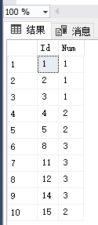
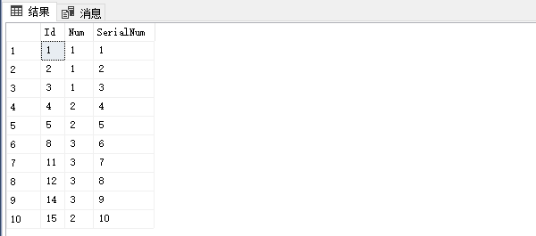
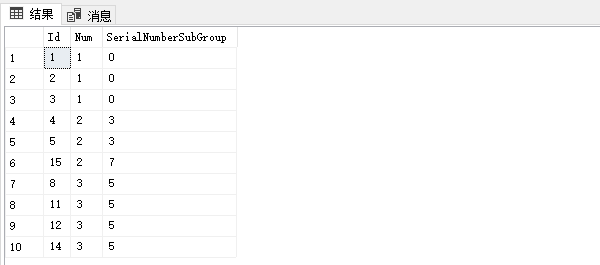
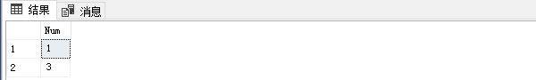

题目：[180. 连续出现的数字](https://leetcode.cn/problems/consecutive-numbers/)

表：`Logs`

```
+-------------+---------+
| Column Name | Type    |
+-------------+---------+
| id          | int     |
| num         | varchar |
+-------------+---------+
id 是这个表的主键。
```

编写一个 SQL 查询，查找所有至少连续出现三次的数字。

返回的结果表中的数据可以按 **任意顺序** 排列。

查询结果格式如下面的例子所示：

**示例 1:**

```
输入：
Logs 表：
+----+-----+
| Id | Num |
+----+-----+
| 1  | 1   |
| 2  | 1   |
| 3  | 1   |
| 4  | 2   |
| 5  | 1   |
| 6  | 2   |
| 7  | 2   |
+----+-----+
输出：
Result 表：
+-----------------+
| ConsecutiveNums |
+-----------------+
| 1               |
+-----------------+
解释：1 是唯一连续出现至少三次的数字。
```

方法 ：

`row_number() over([partition by value_expression,...n] order by columnName)`

1. 要获取至少连续三次出现的数字，不能强力破解，如果是至少连续出现四次？(一百次？)，连接四个？(连接一百个?),这种方法指定是不可取的，但不知道这种方法在少数情况下效率如何。
2. 找解题答案，连续的相同**Num**的数字，但是Id有可能不是连续的，我们就需要通过对结果集再次编号，让其变成连续的。

**原始数据**:



### 解题过程

1）对**原始数据**编号，从1开始使用 **row_number() over(表达式)** 函数，使用Id来排序既`row_number() over(order by Id)`

```sql
SELECT Id,Num,
row_number() over(order by id) as SerialNum
FROM ContinueNumber
```

运行结果为:   



2）使用**原始数据**另一维度排序，这些**num**值一样的分组排序，然后对其编号同样使用**row_number() over(表达式)**，参数：（**num**分组，**id**排序）`row_number() over(partition by num order by id)`

```sql
SELECT Id,Num,
ROW_NUMBER() over(partition by Num order by Id) as SerialGroup
FROM ContinueNumber
```

运行结果为:   


3）通过**上述1**和**上述2** 看一下有什么规律吗？两个列（**SerialNum**，**SerialGroup**）对应相减，只要连续，相减得到的值是一样的。不连续相减得到的值也不同。

```sql
SELECT Id,Num,
      row_number() over(order by id) -
      row_number() over(partition by Num order by Id) as SerialNumberSubGroup
      FROM ContinueNumber
```

运行结果为:   



4）通过**上述3**，通过列**Num**和列**SerialNumberSubGroup**分组，最后拿到**Num**,就是求得的数据,去重（distinct）指：有可能同一个数字在多处出现三次以上。

```sql
# Write your MySQL query statement below
SELECT DISTINCT Num as ConsecutiveNums FROM (
SELECT Num,COUNT(1) as SerialCount FROM 
(SELECT Id,Num,
row_number() over(order by id) -
ROW_NUMBER() over(partition by Num order by Id) as SerialNumberSubGroup
FROM Logs) as Sub
GROUP BY Num,SerialNumberSubGroup HAVING COUNT(1) >= 3) as Result
```

运行结果为:   

