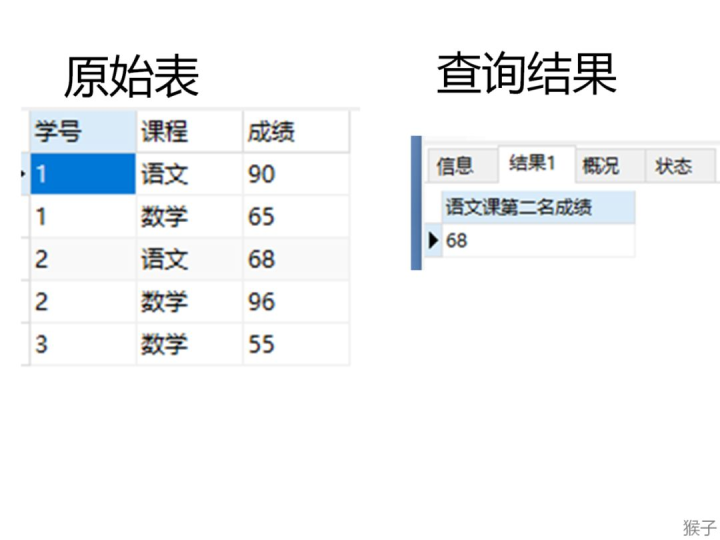

题目：[176. 第二高的薪水](https://leetcode.cn/problems/second-highest-salary/)

`Employee` 表：

```
+-------------+------+
| Column Name | Type |
+-------------+------+
| id          | int  |
| salary      | int  |
+-------------+------+
id 是这个表的主键。
表的每一行包含员工的工资信息。
```

编写一个 SQL 查询，获取并返回 `Employee` 表中第二高的薪水 。如果不存在第二高的薪水，查询应该返回 `null` 。

查询结果如下例所示。

**示例 1：**

```
输入：
Employee 表：
+----+--------+
| id | salary |
+----+--------+
| 1  | 100    |
| 2  | 200    |
| 3  | 300    |
+----+--------+
输出：
+---------------------+
| SecondHighestSalary |
+---------------------+
| 200                 |
+---------------------+
```

**示例 2：**

```
输入：
Employee 表：
+----+--------+
| id | salary |
+----+--------+
| 1  | 100    |
+----+--------+
输出：
+---------------------+
| SecondHighestSalary |
+---------------------+
| null                |
+---------------------+
```

---

题解：https://leetcode.cn/problems/second-highest-salary/solution/tu-jie-sqlmian-shi-ti-ru-he-cha-zhao-di-ngao-de-sh/

### 【题目】

现在有“课程表”，记录了学生选修课程的名称以及成绩。

现在需要找出语文课中成绩第二高的学生成绩。如果不存在第二高成绩的学生，那么查询应返回 null。



### 【解题思路】

**1.找出所有选修了“语文”课的学生成绩**

```
select * 
from 成绩表
where 课程='语文';
```

**2.查找语文课程成绩的第二名**

考虑到成绩可能有一样的值，所以使用distinct 成绩进行成绩去重。

思路1：

使用子查询找出语文成绩查询最大的成绩记为a，然后再找出小于a的最大值就是课程成绩的第二高值。

max(列名) 可以返回该列的最大值

可以用下面的sql语句得到语文课的最大值

```sql
select max(distinct 成绩) 
from 成绩表
where 课程='语文';
```

然后再找出小于a的最大值就是课程成绩的第二高值。

```sql
select max(distinct 成绩) 
from 成绩表
where 课程='语文' and
      成绩 < (select max(distinct 成绩) 
              from 成绩表 
              where 课程='语文');
```

思路2：使用 limit 和 offset

在《猴子 从零学会sql》中讲过：

limit n子句表示查询结果返回前n条数据

offset n表示跳过x条语句

limit y offset x 分句表示查询结果跳过 x 条数据，读取前 y 条数据

使用limit和offset，降序排列再返回第二条记录可以得到第二大的值。

```sql
select distinct 成绩  
from 成绩表
where 课程='语文'
order by 课程,成绩 desc
limit 1,1;
```

3.考虑特殊情况

题目要求，如果没有第二高的成绩，返回空值，所以这里用判断空值的函数（ifnull）函数来处理特殊情况。

ifnull(a,b)函数解释：

如果value1不是空，结果返回a

如果value1是空，结果返回b

对于本题的sql就是：

```sql
select ifnull(第2步的sql,null) as '语文课第二名成绩';
```

我们把第2步的sql语句套入上面的sql语句，本题最终sql如下：

```sql
select ifnull(
(select max(distinct 成绩) from 成绩表
where 成绩<(select max(成绩) from 成绩表 where 课程='语文')
and 课程='语文')
,null) as '语文课第二名成绩';
```

### 【本题考点】

1）第二高的查询思路，利用本题的解决办法可以解决这类问题：查询第N高的数据

2） limit字句的用法

3） ifnull的用法

### 【举一反三】

查找 Employee 表中第二高的薪水（Salary）。查询结果返回 200 作为第二高的薪水。如果不存在第二高的薪水，那么查询应返回 null。

```sql
select ifNull(
(select distinct salary
from Employee 
order by Salary Desc
limit 1,1),null
) as SecondHighestSalary;
```

