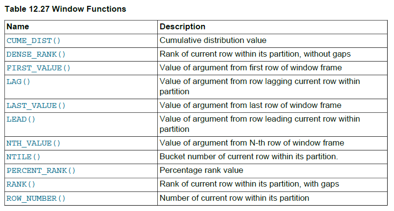

题目：[177. 第N高的薪水](https://leetcode.cn/problems/nth-highest-salary/)

表: `Employee`

```
+-------------+------+
| Column Name | Type |
+-------------+------+
| id          | int  |
| salary      | int  |
+-------------+------+
Id是该表的主键列。
该表的每一行都包含有关员工工资的信息。
```

编写一个SQL查询来报告 `Employee` 表中第 `n` 高的工资。如果没有第 `n` 个最高工资，查询应该报告为 `null` 。

查询结果格式如下所示。

**示例 1:**

```
输入: 
Employee table:
+----+--------+
| id | salary |
+----+--------+
| 1  | 100    |
| 2  | 200    |
| 3  | 300    |
+----+--------+
n = 2
输出: 
+------------------------+
| getNthHighestSalary(2) |
+------------------------+
| 200                    |
+------------------------+
```

**示例 2:**

```
输入: 
Employee 表:
+----+--------+
| id | salary |
+----+--------+
| 1  | 100    |
+----+--------+
n = 2
输出: 
+------------------------+
| getNthHighestSalary(2) |
+------------------------+
| null                   |
+------------------------+
```

题解：https://leetcode.cn/problems/nth-highest-salary/solution/mysql-zi-ding-yi-bian-liang-by-luanz/

排名是数据库中的一个经典题目，实际上又根据排名的具体细节可分为3种场景：

- 连续排名，例如薪水3000、2000、2000、1000排名结果为1-2-3-4，体现同薪不同名，排名类似于编号
- 同薪同名但总排名不连续，例如同样的薪水分布，排名结果为1-2-2-4
- 同薪同名且总排名连续，同样的薪水排名结果为1-2-2-3

不同的应用场景可能需要不同的排名结果，也意味着不同的查询策略。本题的目标是实现第三种排名方式下的第N个结果，且是全局排名，不存在分组的问题，实际上还要相对简单一些。

值得一提的是：在Oracle等数据库中有窗口函数，可非常容易实现这些需求，而MySQL直到8.0版本也引入相关函数。最新OJ环境已更新至8.0版本，可直接使用窗口函数。

为此，本文提出以下几种解决思路，仅供参考。

如果有意可关注文末个人公众号，查看一篇更为详尽的分组排名问题。

### 思路1：单表查询

由于本题不存在分组排序，只需返回全局第N高的一个，所以自然想到的想法是用order by排序加limit限制得到。需要注意两个细节：

1. 同薪同名且不跳级的问题，解决办法是用group by按薪水分组后再order by
2. 排名第N高意味着要跳过N-1个薪水，由于无法直接用limit N-1，所以需先在函数开头处理N为N=N-1。

注：这里不能直接用limit N-1是因为limit和offset字段后面只接受正整数（意味着0、负数、小数都不行）或者单一变量（意味着不能用表达式），也就是说想取一条，limit 2-1、limit 1.1这类的写法都是报错的。

注：这种解法形式最为简洁直观，但仅适用于查询全局排名问题，如果要求各分组的每个第N名，则该方法不适用；而且也不能处理存在重复值的情况。

```sql
CREATE FUNCTION getNthHighestSalary(N INT) RETURNS INT
BEGIN
    SET N := N-1;
  RETURN (
      # Write your MySQL query statement below.
      SELECT 
            salary
      FROM 
            employee
      GROUP BY 
            salary
      ORDER BY 
            salary DESC
      LIMIT N, 1
  );
END
```

### 思路2：子查询

1. 排名第N的薪水意味着该表中存在N-1个比其更高的薪水
2. 注意这里的N-1个更高的薪水是指去重后的N-1个，实际对应人数可能不止N-1个
3. 最后返回的薪水也应该去重，因为可能不止一个薪水排名第N
4. 由于对于每个薪水的where条件都要执行一遍子查询，注定其效率低下

```sql
CREATE FUNCTION getNthHighestSalary(N INT) RETURNS INT
BEGIN
  RETURN (
      # Write your MySQL query statement below.
      SELECT 
          DISTINCT e.salary
      FROM 
          employee e
      WHERE 
          (SELECT count(DISTINCT salary) FROM employee WHERE salary>e.salary) = N-1
  );
END
```

### 思路3：自连接

一般来说，能用子查询解决的问题也能用连接解决。具体到本题：

1. 两表自连接，连接条件设定为表1的salary小于表2的salary
2. 以表1的salary分组，统计表1中每个salary分组后对应表2中salary唯一值个数，即去重
3. 限定步骤2中having 计数个数为N-1，即实现了该分组中表1salary排名为第N个
4. 考虑N=1的特殊情形(特殊是因为N-1=0，计数要求为0)，此时不存在满足条件的记录数，但仍需返回结果，所以连接用left join
5. 如果仅查询薪水这一项值，那么不用left join当然也是可以的，只需把连接条件放宽至小于等于、同时查询个数设置为N即可。因为连接条件含等号，所以一定不为空，用join即可。

注：个人认为无需考虑N<=0的情形，毕竟无实际意义。

```sql
CREATE FUNCTION getNthHighestSalary(N INT) RETURNS INT
BEGIN
  RETURN (
      # Write your MySQL query statement below.
      SELECT 
          e1.salary
      FROM 
          employee e1 JOIN employee e2 ON e1.salary <= e2.salary
      GROUP BY 
          e1.salary
      HAVING 
          count(DISTINCT e2.salary) = N
  );
END

CREATE FUNCTION getNthHighestSalary(N INT) RETURNS INT
BEGIN
  RETURN (
      # Write your MySQL query statement below.
      SELECT 
          DISTINCT e1.salary
      FROM 
          employee e1 LEFT JOIN employee e2 ON e1.salary < e2.salary
      GROUP BY 
          e1.salary
      HAVING 
          count(DISTINCT e2.salary) = N-1
  );
END
```

### 思路4：笛卡尔积

当然，可以很容易将思路2中的代码改为笛卡尔积连接形式，其执行过程实际上一致的，甚至MySQL执行时可能会优化成相同的查询语句。

```sql
CREATE FUNCTION getNthHighestSalary(N INT) RETURNS INT
BEGIN
  RETURN (
      # Write your MySQL query statement below.
      SELECT 
          e1.salary
      FROM 
          employee e1, employee e2 
      WHERE 
          e1.salary <= e2.salary
      GROUP BY 
          e1.salary
      HAVING 
          count(DISTINCT e2.salary) = N
  );
END
```

### 思路5：自定义变量

以上方法2-4中均存在两表关联的问题，表中记录数少时尚可接受，当记录数量较大且无法建立合适索引时，实测速度会比较慢，用算法复杂度来形容大概是O(n^2)量级（实际还与索引有关）。那么，用下面的自定义变量的方法可实现O(2*n)量级，速度会快得多，且与索引无关。

1. 自定义变量实现按薪水降序后的数据排名，同薪同名不跳级，即3000、2000、2000、1000排名后为1、2、2、3；
2. 对带有排名信息的临时表二次筛选，得到排名为N的薪水；
3. 因为薪水排名为N的记录可能不止1个，用distinct去重

```sql
CREATE FUNCTION getNthHighestSalary(N INT) RETURNS INT
BEGIN
  RETURN (
      # Write your MySQL query statement below.
      SELECT 
          DISTINCT salary 
      FROM 
          (SELECT 
                salary, @r:=IF(@p=salary, @r, @r+1) AS rnk,  @p:= salary 
            FROM  
                employee, (SELECT @r:=0, @p:=NULL)init 
            ORDER BY 
                salary DESC) tmp
      WHERE rnk = N
  );
END
```

### 思路6：窗口函数

实际上，在mysql8.0中有相关的内置函数，而且考虑了各种排名问题：

- `row_number()`: 同薪不同名，相当于行号，例如3000、2000、2000、1000排名后为1、2、3、4
- `rank()`: 同薪同名，有跳级，例如3000、2000、2000、1000排名后为1、2、2、4
- `dense_rank()`: 同薪同名，无跳级，例如3000、2000、2000、1000排名后为1、2、2、3
- `ntile()`: 分桶排名，即首先按桶的个数分出第一二三桶，然后各桶内从1排名，实际不是很常用

显然，本题是要用第三个函数。

另外这三个函数必须要要与其搭档`over()`配套使用，`over()`中的参数常见的有两个，分别是

- `partition by`，按某字段切分
- `order by`，与常规order by用法一致，也区分ASC(默认)和DESC，因为排名总得有个依据

注：下面代码仅在mysql8.0以上版本可用，最新OJ已支持。

```sql
CREATE FUNCTION getNthHighestSalary(N INT) RETURNS INT
BEGIN
  RETURN (
      # Write your MySQL query statement below.
        SELECT 
            DISTINCT salary
        FROM 
            (SELECT 
                salary, dense_rank() over(ORDER BY salary DESC) AS rnk
             FROM 
                employee) tmp
        WHERE rnk = N
  );
END
```

至此，可以总结MySQL查询的一般性思路是：

- 能用单表优先用单表，即便是需要用group by、order by、limit等，效率一般也比多表高
- 不能用单表时优先用连接，连接是SQL中非常强大的用法，小表驱动大表+建立合适索引+合理运用连接条件，基本上连接可以解决绝大部分问题。但join级数不宜过多，毕竟是一个接近指数级增长的关联效果
- 能不用子查询、笛卡尔积尽量不用，虽然很多情况下MySQL优化器会将其优化成连接方式的执行过程，但效率仍然难以保证
- 自定义变量在复杂SQL实现中会很有用，例如LeetCode中困难级别的数据库题目很多都需要借助自定义变量实现
- 如果MySQL版本允许，某些带聚合功能的查询需求应用窗口函数是一个最优选择。除了经典的获取3种排名信息，还有聚合函数、向前向后取值、百分位等，具体可参考官方指南。以下是官方给出的几个窗口函数的介绍：



最后的最后再补充一点，本题将查询语句封装成一个自定义函数并给出了模板，实际上是降低了对函数语法的书写要求和难度，而且提供的函数写法也较为精简。然而，自定义函数更一般化和常用的写法应该是分三步：

- 定义变量接收返回值
- 执行查询条件，并赋值给相应变量
- 返回结果

例如以解法5为例，如下写法可能更适合函数初学者理解和掌握：

```sql
CREATE FUNCTION getNthHighestSalary(N INT) RETURNS INT
BEGIN
    # i 定义变量接收返回值
    DECLARE ans INT DEFAULT NULL;  
    # ii 执行查询语句，并赋值给相应变量
    SELECT 
        DISTINCT salary INTO ans
    FROM 
        (SELECT 
            salary, @r:=IF(@p=salary, @r, @r+1) AS rnk,  @p:= salary 
        FROM  
            employee, (SELECT @r:=0, @p:=NULL)init 
        ORDER BY 
            salary DESC) tmp
    WHERE rnk = N;
    # iii 返回查询结果，注意函数名中是 returns，而函数体中是 return
    RETURN ans;
END
```

