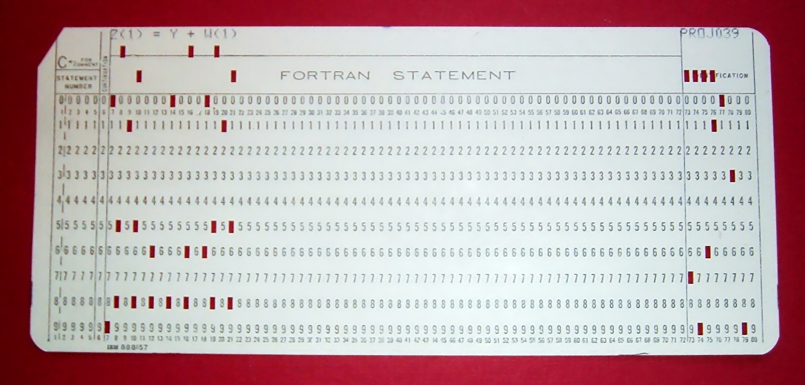
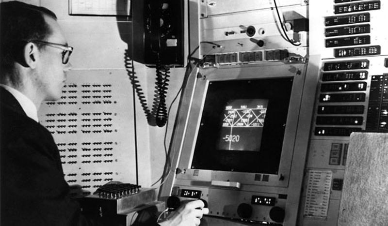

# 操作系统概述

## Q1: 为什么要学操作系统？

### 1、为什么要学操作系统呢？

- 为什么要学微积分/离散数学/XXXX/……？
- 长辈/学长：~~擦干泪不要问为什么~~

微积分 “被混起来” 的几件事

- Newton 时代的微积分 (启蒙与应用)（什么都没有）
    - 现代方法：Mathematica, [sympy](https://docs.sympy.org/latest/tutorial/index.html), [sage](http://sagemath.org/)
        - 这也是为什么我主张第一门语言学 Python
- Cauchy 时代的微积分 (严格化与公理化)
    - 以及之后各种卡出的 bug (Weierstrass 函数、Peano 曲线……)
- 微积分的现代应用
    - 优化、有限元、PID……

**为什么要去学微积分，因为身体里的编程力量没有觉醒**

### 2、学习操作系统的目的

**你体内的 “编程力量” 尚未完全觉醒**

- 每天都在用的东西，你还没搞明白
    - 窗口是怎么创建的？[为什么 Ctrl-C 有时不能退出程序](https://stackoverflow.blog/2017/05/23/stack-overflow-helping-one-million-developers-exit-vim/)？
- 组里的服务器有 128 个处理器，但你的程序却只能用一个 😂
- 你每天都在用的东西，你却实现不出来
    - 浏览器、编译器、IDE、游戏/外挂、任务管理器、杀毒软件、病毒……

------

**《操作系统》给你有关 “编程” 的全部**

- 悟性好：学完课程就在系统方向 “毕业”
    - 具有编写一切 “能写出来” 程序的能力 (具备阅读论文的能力)
-  悟性差：内力大增
    - 可能工作中的某一天想起上课提及的内容

> 充满热情而且相当聪明的学生...早就听说过物理学如何有趣...相对论、量子力学……但是，当他们学完两年以前那种课程后，许多人就泄气了……学的还是斜面、静电这样的内容
>
> ——《The Feynman Lectures on Physics, 1963》

我学《操作系统》的时候 (2009)，大家都说操作系统很难教

- 使用豆瓣评分高达 5.7/10 的 “全国优秀教材”
    - 没有正经的实验 (写一些 16-bit code)
    - 完全错误的 toolchain，调试全靠蛮力和猜
    - 为了一点微不足道的分数内卷、沾沾自喜、失去 integrity
- 这么玩，脖子都要被美国人掐断了
    - 这门课的另一个意义：**告诉你可以去变得更强、真正的强**

## Q2: 到底什么是操作系统？

### 1、什么是操作系统？

Operating System: A body of software, in fact, that is responsible for *making it easy to run programs* (even allowing you to seemingly run many at the same time), allowing programs to share memory, enabling programs to interact with devices, and other fun stuff like that. (OSTEP)

很多疑点

- “programs” 就完了？那么多复杂的程序呢！
- “shared memory, interact with devices, ...”？

“管理软/硬件资源、为程序提供服务” 的程序？


### 2、理解操作系统

“精准” 的定义毫无意义

- 问出正确的问题：操作系统如何从一开始变成现在这样的？
- 三个重要的线索
    - 计算机 (硬件)
    - 程序 (软件)
    - 操作系统 (管理软件的软件)

------

本课程讨论狭义的操作系统

- 对单一计算机硬件系统作出抽象、支撑程序执行的软件系统
- **学术界谈论 “操作系统” 是更广义**的 “System” (例子：OSDI/SOSP)

### 3、1940s 的计算机

跨时代、非凡的天才设计，但很简单 (还不如我们数电实验课做的 CPU 复杂呢)：

- **计算机系统 = 状态机** (ICS 课s程的 takeaway message)
- 标准的 Mealy 型数字电路
    - ENIAC (1946.2.14；请在这个特殊的节日多陪陪你的电脑)

电子计算机的实现

- 逻辑门：[真空电子管](https://www.bilibili.com/video/av59005720)
- 存储器：延迟线 (delay lines)
- 输入/输出：打孔纸带/指示灯


### 4、1940s 的程序

ENIAC 程序是用物理线路 “hard-wire” 的

- 重编程需要重新接线
    - [ENIAC Simulator](https://www.cs.drexel.edu/~bls96/eniac/); [sieve.e](http://jyywiki.cn/pages/OS/2022/demos/sieve.e)

------

最早成功运行的一系列程序：打印平方数、素数表、计算弹道……

- 大家还在和真正的 “bugs” 战斗


### 5、1940s 的操作系统

> 没有操作系统。

能把程序放上去就很了不起了

- 程序直接用指令操作硬件
- 不需要画蛇添足的程序来管理它

### 6、1950s 的计算机

更快更小的逻辑门 (晶体管)、更大的内存 (磁芯)、丰富的 I/O 设备

- I/O 设备的速度已经严重低于处理器的速度，中断机制出现 (1953)


### 7、1950s 的程序

可以执行更复杂的任务，包括通用的计算任务

- 希望使用计算机的人越来越多；希望调用 API 而不是直接访问设备
- Fortran 诞生 (1957)

```
C---- THIS PROGRAM READS INPUT FROM THE CARD READER,
C---- 3 INTEGERS IN EACH CARD, CALCULATE AND OUTPUT
C---- THE SUM OF THEM.
  100 READ(5,10) I1, I2, I3
   10 FORMAT(3I5)
      IF (I1.EQ.0 .AND. I2.EQ.0 .AND. I3.EQ.0) GOTO 200
      ISUM = I1 + I2 + I3
      WRITE(6,20) I1, I2, I3, ISUM
   20 FORMAT(7HSUM OF , I5, 2H, , I5, 5H AND , I5,
     *   4H IS , I6)
      GOTO 100
  200 STOP
      END
```

一行代码，一张卡片

- 看到上面 1, 2, ... 80 的标号了吧！
- 7-72 列才是真正的语句 (这就是为什么谭浩强要教你要画流程图) 



### 8、1950s 的操作系统

> 管理多个程序依次排队运行的库函数和调度器。

写程序、跑程序都是非常费事的 (比如你写了个死循环……)

- 计算机非常贵 ($ 50,000-1,000,000)，一个学校只有一台
- 产生了集中管理计算机的需求：**多用户排队共享计算机**

------

操作系统的概念开始形成

- 操作 (operate) 任务 (jobs) 的系统 (system)
    - “批处理系统” = 程序的自动切换 (换卡) + 库函数 API
    - Disk Operating Systems (DOS)
        - 操作系统中开始出现 “设备”、“文件”、“任务” 等对象和 API

### 9、1960s 的计算机

集成电路、总线出现

- 更快的处理器
- 更快、更大的内存；虚拟存储出现
    - **可以同时载入多个程序而不用 “换卡” 了**
- 更丰富的 I/O 设备；**完善的中断/异常机制**



### 10、1960s 的程序

更多的高级语言和编译器出现

- COBOL (1960), APL (1962), BASIC (1965)
    - Bill Gates 和 Paul Allen 在 1975 年实现了 Altair 8800 上的 BASIC 解释器

### 11、1960s 的操作系统

> 能载入多个程序到内存且灵活调度它们的管理程序，包括程序可以调用的 API。

同时将多个程序载入内存是一项巨大的能力

- 有了进程 (process) 的概念
- 进程在执行 I/O 时，可以将 CPU 让给另一个进程
    - 在多个地址空间隔离的程序之间切换
    - 虚拟存储使一个程序出 bug 不会 crash 整个系统

操作系统中自然地增加进程管理 API

> 既然操作系统已经可以在程序之间切换，为什么不让它们定时切换呢？

基于中断 (例如时钟) 机制

- 时钟中断：使程序在执行时，异步地插入函数调用
- 由操作系统 (调度策略) 决定是否要切换到另一个程序执行
- Multics (MIT, 1965)
    - 现代操作系统诞生

### 12、1970s+ 的计算机

集成电路空前发展，个人电脑兴起，“计算机” 已与今日无大异

- CISC 指令集；中断、I/O、异常、MMU、网络
- 个人计算机 (PC 机)、超级计算机……

### 13、1970s+ 的程序

PASCAL (1970), C (1972), …

- 今天能办到的，那个时代已经都能办到了——上天入地、图像声音视频、人工智能……
- 个人开发者 (Geek Network) 走上舞台

### 14、1970s+ 的操作系统

> 分时系统走向成熟，UNIX 诞生并走向完善，奠定了现代操作系统的形态。

- 1973: 信号 API、管道 (对象)、grep (应用程序)
- 1983: BSD socket (对象)
- 1984: procfs (对象)…… 
- UNIX 衍生出的大家族
    - 1BSD (1977), GNU (1983), MacOS (1984), AIX (1986), Minix (1987), Windows (1985), Linux 0.01 (1991), Windows NT (1993), Debian (1996), Windows XP (2002), Ubuntu (2004), iOS (2007), Android (2008), Windows 10 (2015), ……

### 15、今天的操作系统

> 通过 “虚拟化” 硬件资源为程序运行提供服务的软件。

空前复杂的系统之一

- 更复杂的处理器和内存
    - 非对称多处理器 (ARM big.LITTLE; Intel P/E-cores)
    - Non-uniform Memory Access (NUMA)
    - 更多的硬件机制 Intel-VT/AMD-V, TrustZone/~~SGX~~, TSX, ...
- 更多的设备和资源
    - 网卡、SSD、GPU、FPGA...
- 复杂的应用需求和应用环境
    - 服务器、个人电脑、智能手机、手表、手环、IoT/微控制器......

### 16、理解操作系统：三个根本问题

操作系统服务谁？

- **程序 = 状态机**
- 课程涉及：多线程 Linux 应用程序

------

(设计/应用视角) 操作系统为程序提供什么服务？

- **操作系统 = 对象 + API**
- 课程涉及：POSIX + 部分 Linux 特性

------

(实现/硬件视角) 如何实现操作系统提供的服务？

- **操作系统 = C 程序**
    - 完成初始化后就成为 interrupt/trap/fault handler
- 课程涉及：xv6, 自制迷你操作系统

## Q3: 怎么学操作系统？

### Prerequisites

**计算机专业学生必须具备的核心素质**

是一个合格的操作系统用户

- 会 STFW/RTFM 自己动手解决问题
- 不怕使用任何命令行工具
    - vim, tmux, grep, gcc, binutils, ...

不惧怕写代码

- 能管理一定规模 (数千行) 的代码
- 能在出 bug 时默念 “机器永远是对的、我肯定能调出来的”
    - 然后开始用正确的工具/方法调试

给 “学渣” 们的贴心提示：补基础、补基础、补基础

### 1、成为 Power User

感到 Linux/PowerShell/... 很难用？

1. 没有建立信心、没有理解基本逻辑
2. 没有找对材料 (Baidu v.s. Google/Bing/Github/StackOverflow)
3. 没有用对工具 (man v.s. tldr; 该用 IDE 就别 Vim)

### 2、学会写代码

写代码 = 创造有趣的东西

- 命令行 + 浏览器就是世界
    - 我们还有 sympy, sage, z3, rich, ... 呢

- 不需要讲语言特性、设计模式、……
    - 编就对了；你自然而然会需要它们的

### 3、课程：教科书

Remzi's [Operating Systems: Three Easy Pieces](https://pages.cs.wisc.edu/~remzi/OSTEP/)

- 按照并发 → 虚拟化 → 持久化的顺序上课 (我自己的理解)

### Talk is Cheap. Show Me the Code!

应用视角/操作系统设计：操作系统 = 对象 + API

- demo 小程序 (x86-64 为主)
- 各类系统工具的实现 (strace, gdb, ...)

------

硬件视角/操作系统实现：操作系统 = C 程序

- xv6
    - 2006 年 Russ Cox, Frans Kaashoek, Robert Morris 在 MIT 重写的 UNIX 系统
    - 大家熟悉的 RISC-V 版本
- AbstractMachine
    - 2017 年为 Project-N 设计的抽象层
    - 在《计算机系统基础》中已经使用过

### 最重要的：Get Your Hands Dirty

> 听课看书都不重要。独立完成编程作业即可理解操作系统。

应用视角 (设计)：Mini Labs x 6

- 使用 OS API 实现 “黑科技” 代码

------

硬件视角 (实现)：OS Labs x 5

- 自己动手实现一个真正的操作系统

------

全部 Online Judge

- 代码不规范 → `-Wall -Werror` 编译出错
- 代码不可移植 → 编译/运行时出错：`int x = (int)&y;`
- 硬编码路径/文件名 → 运行时出错：`open("/home/a/b", ...`

## 总结

本次课回答的问题

- **Q1** (Why): 为什么要学操作系统？
- **Q2** (What): 到底什么是操作系统？
- **Q3** (How): 怎么学操作系统？

------

Take-away message

- 操作系统没有传说中那么复杂
    - 程序视角：对象 + API
    - 硬件视角：一个 C 程序
- ~~这门课没有传说中那么可怕~~