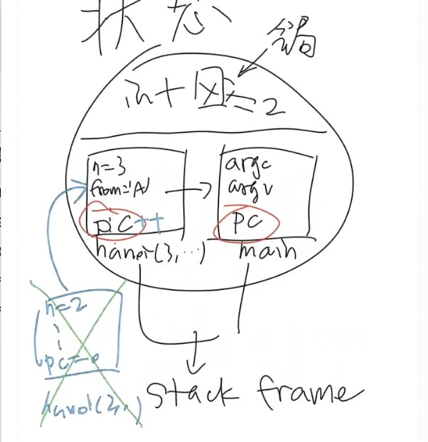
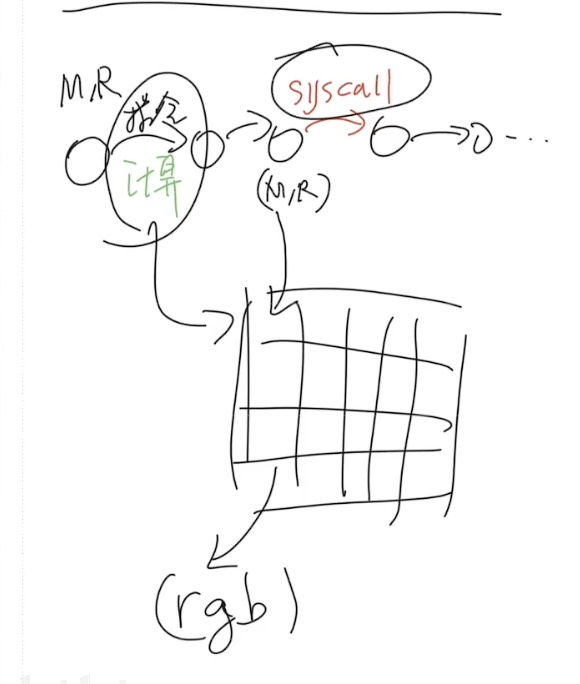

# 操作系统上的程序

## Overview

复习：操作系统

- 应用视角 (设计): 一组对象 (进程/文件/...) + API
- 硬件视角 (实现): 一个 C 程序

------

本次课回答的问题

- **Q**: 到底什么是 “程序”？

------

本次课主要内容

- 程序的状态机模型 (和编译器)
- 操作系统上的 {最小/一般/图形} 程序

## 收获

### 1、程序执行的第一条指令在哪里

等价问法：

- 一个普通的、人畜无害的 Hello World C 程序执行的第一条指令在哪里？
- 二进制程序状态机的初始状态是什么？

`main` 的第一条指令 ❌，`libc` 的 `_start` ❌

---

打开 `gdb a.out`，执行 `starti`，第一条指令位于 `/lib64/ld-linux-x86-64.so.2`（是linux下面的动态链接库）

再输入 `info proc mappings`（显示正在运行的进程中映射的内存区域的列表），地址空间里面的就是 `info proc mappings` 这些东西

---

`main()` 之前发生了什么？

`ld-linux-x86-64.so` （叫做加载器）加载了 libc

之后 libc 完成了自己的初始化，**为程序状态机赋予了初始状态**

---

main 执行之前、执行中、执行后，发生了哪些操作系统 API 调用？

strace ./hello-goodbye

### 2、本质上，所有的程序和 Hello World 类似

**程序 = 状态机 = 计算 → syscall → 计算 →**

- 被操作系统加载
  - 通过另一个进程执行 execve 设置为初始状态
- 状态机执行
  - 进程管理：fork, execve, exit, ...
  - 文件/设备管理：open, close, read, write, ...
  - 存储管理：mmap, brk, ...
- 直到 _exit (exit_group) 退出

### 3、到底什么是“程序”

- 程序 = 状态机
  - 源代码 S 视角: 状态迁移 = 执行语句
  - 二进制代码 C 视角: 状态迁移 = 执行指令
  - 源代码和二进制之间通过编译器 C=compile(S)
- 应用视角的操作系统
  - **就是一条 syscall 指令**
- 计算机系统不存在玄学；一切都建立在确定的机制上
  - 理解操作系统的重要工具：gcc, binutils, gdb, strace

## 一、数字电路与状态机

### 1、数字电路与状态机

数字逻辑电路

- 状态 = 寄存器保存的值 (flip-flop)
- 初始状态 = RESET (implementation dependent)
- 迁移 = 组合逻辑电路计算寄存器下一周期的值

### 2、数字逻辑电路：模拟器

```c
#include <stdio.h>
#include <unistd.h>

#define REGS_FOREACH(_)  _(X) _(Y)
#define RUN_LOGIC        X1 = !X && Y; \
                         Y1 = !X && !Y;
#define DEFINE(X)        static int X, X##1;
#define UPDATE(X)        X = X##1;
#define PRINT(X)         printf(#X " = %d; ", X);

int main() {
  REGS_FOREACH(DEFINE);
  while (1) { // clock
    RUN_LOGIC;
    REGS_FOREACH(PRINT);
    REGS_FOREACH(UPDATE);
    putchar('\n'); sleep(1);
  }
}
```

预编译的宏展开：`gcc -E a.c`

```c
int main() {
  static int X, X1; static int Y, Y1;;
  while (1) {
    X1 = !X && Y; Y1 = !X && !Y;;
    printf("X" " = %d; ", X); printf("Y" " = %d; ", Y);;
    X = X1; Y = Y1;;
    putchar('\n'); sleep(1);
  }
}
```

### 3、更完整的实现：数码管显示

输出数码管的配置信号

- [logisim.c](http://jyywiki.cn/pages/OS/2022/demos/logisim.c)
- 会编程，你就拥有全世界！
    - [seven-seg.py](http://jyywiki.cn/pages/OS/2022/demos/seven-seg.py)
    - 同样的方式可以模拟任何数字系统
        - 当然，也包括计算机系统

后端：logisim.c

```c
#include <stdio.h>
#include <unistd.h>

#define REGS_FOREACH(_)  _(X) _(Y)
#define OUTS_FOREACH(_)  _(A) _(B) _(C) _(D) _(E) _(F) _(G)
#define RUN_LOGIC        X1 = !X && Y; \
                         Y1 = !X && !Y; \
                         A  = (!X && !Y) || (X && !Y); \
                         B  = 1; \
                         C  = (!X && !Y) || (!X && Y); \
                         D  = (!X && !Y) || (X && !Y); \
                         E  = (!X && !Y) || (X && !Y); \
                         F  = (!X && !Y); \
                         G  = (X && !Y); 

#define DEFINE(X)   static int X, X##1;
#define UPDATE(X)   X = X##1;
#define PRINT(X)    printf(#X " = %d; ", X);

int main() {
  REGS_FOREACH(DEFINE);
  OUTS_FOREACH(DEFINE);
  while (1) { // clock
    RUN_LOGIC;
    OUTS_FOREACH(PRINT);
    REGS_FOREACH(UPDATE);
    putchar('\n');
    fflush(stdout);
    sleep(1);
  }
}
```

前端：seven-seg.py

```python
import fileinput
 
TEMPLATE = '''
\033[2J\033[1;1f
     AAAAAAAAA
    FF       BB
    FF       BB
    FF       BB
    FF       BB
    GGGGGGGGGG
   EE       CC
   EE       CC
   EE       CC
   EE       CC
    DDDDDDDDD
''' 
BLOCK = {
    0: '\033[37m░\033[0m', # STFW: ANSI Escape Code
    1: '\033[31m█\033[0m',
}
VARS = 'ABCDEFG'

for v in VARS:
    globals()[v] = 0
stdin = fileinput.input()

while True:
    exec(stdin.readline())
    pic = TEMPLATE
    for v in VARS:
        pic = pic.replace(v, BLOCK[globals()[v]]) # 'A' -> BLOCK[A], ...
    print(pic)

```

执行下：`./a.out | python seven-seg.py`

------

你还体验了 UNIX 哲学

- Make each program do one thing well
- Expect the output of every program to become the input to another

## 二、什么是程序 (源代码视角)

### 1、什么是程序？

你需要《[程序设计语言的形式语义](https://cs.nju.edu.cn/hongjin/teaching/semantics/index.htm)》

- by 梁红瑾 🎩
- λ-calculus, operational semantics, Hoare logic, separation logic
- 入围 “你在南京大学上过最牛的课是什么？” 知乎高票答案
    - ~~当然，我也厚颜无耻地入围了~~

### 2、程序就是状态机

程序就是状态机 (你在 gdb 里看到的)

- 试试程序吧 [hanoi-r.c](http://jyywiki.cn/pages/OS/2022/demos/hanoi-r.c)

汉诺塔程序，哈哈，虐人啦

hanoi-r.c

```c
void hanoi(int n, char from, char to, char via) {
  if (n == 1) printf("%c -> %c\n", from, to);
  else {
    hanoi(n - 1, from, via, to);
    hanoi(1,     from, to,  via);
    hanoi(n - 1, via,  to,  from);
  }
  return;
}
```

main.c

```c
#include <stdio.h>

#include "hanoi-r.c"

int main() {
    hanoi(3, 'A', 'B', 'c');
}
```

`#include` 的形式语义就是复制粘贴

```shell
gcc main.c
./a.out 
A -> B
A -> c
B -> c
A -> B
c -> A
c -> B
A -> B
```

------

**C 程序的状态机模型** (语义，semantics)

- 状态 = 堆 + 栈
- 初始状态 = `main` 的第一条语句
- 迁移 = 执行一条简单语句
    - 任何 C 程序都可以改写成 “非复合语句” 的 C 代码
    - [真的有这种工具](https://cil-project.github.io/cil/) (C Intermediate Language) 和[解释器](https://gitlab.com/zsaleeba/picoc)

**c语言程序是什么**？

对于c语言的程序而言，c语言的程序由很多的栈帧（stack frame）组成，每次函数调用都会产生一个新的栈帧

main 有自己的参数 argc、argv，局部变量，最重要的是程序计数器 pc，

pc 直观的看就是 gdb 中显示的条子

**函数调用是什么**？

创建一个新的状态，call 另一个函数，创建一个新的栈帧

发起调用的函数的栈帧中的 pc++；被调用的函数的栈帧中的 pc=0

**函数调用的返回是什么**？

把顶上的栈帧删掉，发起调用的函数的栈帧中的 pc--



------

(这还只是 “粗浅” 的理解)

- Talk is cheap. Show me the code. (Linus Torvalds): 任何真正的理解都应该落到可以执行的代码

### 3、C 程序的语义

C 程序的状态机模型 (语义，semantics)

- 状态 = stack frame 的列表 (每个 frame 有 PC) + 全局变量
- 初始状态 = main(argc, argv), 全局变量初始化
- 迁移 = 执行 top stack frame PC 的语句; PC++
    - 函数调用 = push frame (frame.PC = 入口)
    - 函数返回 = pop frame

------

应用：将任何递归程序就地转为非递归

- 汉诺塔难不倒你 [hanoi-nr.c](http://jyywiki.cn/pages/OS/2022/demos/hanoi-nr.c)
- A → B, B → A 的也难不倒你
    - 还是一样的 `call()`，但放入不同的 `Frame`

```c
typedef struct {
  int pc, n;
  char from, to, via;
} Frame;

#define call(...) ({ *(++top) = (Frame) { .pc = 0, __VA_ARGS__ }; })
#define ret()     ({ top--; })
#define goto(loc) ({ f->pc = (loc) - 1; })

void hanoi(int n, char from, char to, char via) {
  Frame stk[64], *top = stk - 1;
  call(n, from, to, via);
  for (Frame *f; (f = top) >= stk; f->pc++) {
    switch (f->pc) {
      case 0: if (f->n == 1) { printf("%c -> %c\n", f->from, f->to); goto(4); } break;
      case 1: call(f->n - 1, f->from, f->via, f->to);   break;
      case 2: call(       1, f->from, f->to,  f->via);  break;
      case 3: call(f->n - 1, f->via,  f->to,  f->from); break;
      case 4: ret();                                    break;
      default: assert(0);
    }
  }
}
```

```c
#include <stdio.h>
#include <assert.h>

#include "hanoi-nr.c"

int main() {
    hanoi(3, 'A', 'B', 'c');
}
```

## 三、什么是程序 (二进制代码视角)

### 1、什么是 (二进制) 程序？

还是状态机

- 状态 = 内存 M + 寄存器 R
- 初始状态 = (稍后回答)
- 迁移 = 执行一条指令
    - 我们花了一整个《计算机系统基础》解释这件事
    - gdb 同样可以观察状态和执行

------

操作系统上的程序

- 所有的指令都只能计算
    - deterministic: mov, add, sub, call, ...
    - non-deterministic: rdrand, ...
    - 但这些指令甚至都无法使程序停下来 (NEMU: 加条 `trap` 指令)

### 2、一条特殊的指令 syscall

**调用操作系统 syscall**

- 把 (M,R) 完全交给操作系统，任其修改
    - 一个有趣的问题：如果程序不打算完全信任操作系统？
- 实现与操作系统中的其他对象交互
    - 读写文件/操作系统状态 (例如把文件内容写入 M)
    - 改变进程 (运行中状态机) 的状态，例如创建进程/销毁自己



------

程序 = 计算 + syscall

- 问题：怎么构造一个最小的 Hello, World？

### 3、构造最小的 Hello, World

```c
#include <stdio.h>
#include <unistd.h>

int main() {
  printf("Hello, World\n");
}
```

gcc 编译出来的文件不满足 “最小”

- `gcc --verbose main.c` 可以查看所有编译选项 (真不少)
    - printf 变成了 puts@plt
- `gcc -static a.c` 会复制 libc，编译出来的二进制很大
    - `objdump -d a.out | less`

### 4、直接硬来？

强行编译 + 链接：`gcc -c` + `ld`

- 直接用 ld 链接失败
    - ld 不知道怎么链接库函数……

执行：

- `gcc -c a.c` （compile only）
- `objdump -d a.o` （汇编目标文件的特定机器码段）

```
a.o:	file format mach-o 64-bit x86-64

Disassembly of section __TEXT,__text:

0000000000000000 <_main>:
       0: 55                           	pushq	%rbp
       1: 48 89 e5                     	movq	%rsp, %rbp
       4: 48 8d 3d 0b 00 00 00         	leaq	11(%rip), %rdi          ## 0x16 <_main+0x16>
       b: b0 00                        	movb	$0, %al
       d: e8 00 00 00 00               	callq	0x12 <_main+0x12>
      12: 31 c0                        	xorl	%eax, %eax
      14: 5d                           	popq	%rbp
      15: c3                           	retq
```

`gcc -c a.c && objdump -d a.o && ld a.o` 不行

---

```c
#include <stdio.h>
#include <unistd.h>

void _start() {
}
```

`gcc -c a.c && objdump -d a.o && ld a.o`

- 空的 main 函数倒是可以
    - 链接时得到奇怪的警告 (可以定义成 `_start` 避免警告)
    - 但 Segmentation Fault 了……（即段错误，一般都是出现了非法的地址写法操作导致的）

---

问题：为什么会 Segmentation Fault？

- 当然是**观察程序 (状态机) 的执行**了
    - 初学者必须克服的恐惧：STFW/RTFM ([M 非常有用](http://sourceware.org/gdb/documentation/))
    - `starti`可以帮助我们从第一条指令开始执行程序
        - gdb 可以在两种状态机视角之间切换 (`layout`)

答案是：程序状态机的初始状态不可返回 `void _start`

### 5、解决异常退出

有办法让状态机 “停下来” 吗？

- 纯 “计算” 的状态机：不行
- 要么死循环，要么 undefined behavior

解决办法：syscall

```c
#include <stdio.h>
#include <unistd.h>
#include <sys/syscall.h>

int main() {
  syscall(SYS_exit, 42);
}
```

`gcc a.c && ./a.out; echo $status` 输出 42

- 调试代码：syscall 的实现在哪里？
    - 坏消息：在 libc 里，不方便直接链接
    - 好消息：代码很短，而且似乎看懂了

### 6、Hello, World 的汇编实现

[minimal.S](http://jyywiki.cn/pages/OS/2022/demos/minimal.S)

```assembly
#include <sys/syscall.h>

.globl _start
_start:
  movq $SYS_write, %rax   # write(
  movq $1,         %rdi   #   fd=1,
  movq $st,        %rsi   #   buf=st,
  movq $(ed - st), %rdx   #   count=ed-st
  syscall                 # );

  movq $SYS_exit,  %rax   # exit(
  movq $1,         %rdi   #   status=1
  syscall                 # );

st:
  .ascii "\033[01;31mHello, OS World\033[0m\n"
ed:
```

Note: gcc 支持对汇编代码的预编译 (还会定义 `__ASSEMBLER__` 宏)

```shell
gcc minimal.S -c && ld minimal.o
./a.out
# Hello, OS World
```


------

~~我是从哪里获得这些黑科技代码的？？？~~

- syscall (2), syscalls (2)
    - The Friendly Manual 才是最靠谱的信息来源 `man syscall`

------

回顾：状态机视角的程序

- 程序 = 计算 → syscall → 计算 → ...

### 7、彩蛋：ANSI Escape Code

> 为什么 Hello World 有颜色？？

特殊编码的字符实现终端控制

- [vi.c](https://git.busybox.net/busybox/tree/editors/vi.c) from busybox
- `telnet towel.blinkenlights.nl` (电影；Ctrl-] and q 退出)
- `dialog --msgbox 'Hello, OS World!' 8 32`
- `ssh sshtron.zachlatta.com`(网络游戏)
    - 所以编程可以从一开始就不那么枯燥
    - 看似复杂，实际简单明了

## 四、如何在程序的两个视角之间切换？

### 1、如何在程序的两个视角之间切换？

”状态机” 顺便解决了一个非常重要的基本问题：

> 什么是编译器？？？

编译器：源代码 S (状态机) → 二进制代码 C (状态机) `C=compile(S)`

`gcc -O2 -c a.c && objdump -d a.o`

---

**什么叫正确的编译**？

在 c 代码状态机里面所有不可优化都被正确的翻译到汇编上

除此之外，所有的优化编译器都可以做

---

编译 (优化) 的正确性 (Soundness): 

- **S 与 C 的可观测行为严格一致**
    - system calls; volatile variable loads/stores; termination
- Trivially 正确 (但低效) 的实现
    - 解释执行/直接翻译 S 的语义

### 2、现代 (与未来的) 编译优化

在保证观测一致性 (sound) 的前提下改写代码 (rewriting)

- Inline assembly 也可以参与优化
    - 其他优化可能会跨过不带 barrier 的 `asm volatile`
- Eventual memory consistency（最终的内存一致性），不能跨过 barrier
    - `asm volatile ("nop" : : "r"(x) : "memory");`
    - `__sync_synchronize()` 内存 barrier，非常强
- Call to external CU = write back visible memory
    - talk is cheap, show me the code!

---

```c
extern int g;

void foo() {
  g++;
  g++;
}
```

```shell
$ gcc -O2 -c a.c && objdump -d a.o

a.o:     file format elf64-x86-64


Disassembly of section .text:

0000000000000000 <foo>:
   0:	f3 0f 1e fa          	endbr64 
   4:	83 05 00 00 00 00 02 	addl   $0x2,0x0(%rip)        # b <foo+0xb>
   b:	c3                   	retq  
```

会出现个现象

```c
extern int g;

void foo(int x) {
  g++;
  // asm volatile ("nop" : : "r"(x)); // 这一行不可优化，但编译器优化穿透了它
  asm volatile ("nop" : : "r"(x) : "memory"); // compiler barrier
  // __sync_synchronize();
  g++;
}
```

```shell
$ gcc -O2 -c a.c && objdump -d a.o

a.o:     file format elf64-x86-64


Disassembly of section .text:

0000000000000000 <foo>:
   0:	f3 0f 1e fa          	endbr64 
   4:	90                   	nop
   5:	83 05 00 00 00 00 02 	addl   $0x2,0x0(%rip)        # c <foo+0xc>
   c:	c3                   	retq   
```

Eventual memory consistency:

```assembly
Disassembly of section .text:

0000000000000000 <foo>:
   0:	f3 0f 1e fa          	endbr64 
   4:	83 05 00 00 00 00 01 	addl   $0x1,0x0(%rip)        # b <foo+0xb>
   b:	90                   	nop
   c:	83 05 00 00 00 00 01 	addl   $0x1,0x0(%rip)        # 13 <foo+0x13>
  13:	c3                   	retq   
```

---

这给了我们很多想象的空间

- Semantic-based compilation (synthesis)，基于语义的编译（综合）
- AI-based rewriting，基于人工智能的重写
- Fine-grained semantics & system call fusion，细粒度语义和系统调用融合

### 3、进入 PL(program language) 的领域

PL 领域 (的很多人) 有一种倾向：用数学化的语言定义和理解一切 (all about semantics)

- ~~所以你看一眼 paper 就觉得自己瞎了~~
- 但背后的直觉依然是 system/software 的
    - (我们是人，不是无情的数学机器 😂)
    - 溜了溜了，回到 system 的世界

---

Further readings

- [An executable formal semantics of C with applications](https://dl.acm.org/doi/10.1145/2103621.2103719) (POPL'12)
- [CompCert C verified compiler](https://compcert.org/motivations.html) and a [paper](https://xavierleroy.org/publi/compcert-backend.pdf) (POPL'06, Most Influential Paper Award 🏅)
- [Copy-and-patch compilation](https://dl.acm.org/doi/10.1145/3485513) (OOPSLA'21, Distinguished Paper 🏅)

## 五、操作系统中的一般程序

### 1、操作系统中的一般程序

> 和 [minimal.S](http://jyywiki.cn/pages/OS/2022/demos/minimal.S) 没有本质区别：程序 = 计算 → syscall → ...
>
> 汇编和 c 没有界限，同一个世界的不同维度

操作系统收编了所有的硬件/软件资源

- 只能用操作系统允许的方式访问操作系统中的对象
    - 从而实现操作系统的 “霸主” 地位
    - 例子：[tryopen.c](http://jyywiki.cn/pages/OS/2022/demos/tryopen.c)
- 这是为 “管理多个状态机” 所必须的
    - 不能打架，谁有权限就给他

```c
#include <stdio.h>
#include <fcntl.h>
#include <unistd.h>

void try_open(const char *fname) {
  int fd = open(fname, O_RDWR);
  printf("open(\"%s\") returns %d\n", fname, fd);
  if (fd < 0) {
    perror("  FAIL");
  } else {
    printf("  SUCCESS!\n");
    close(fd);
  }
}

int main() {
  try_open("/something/not/exist");
  try_open("/dev/sda"); // hard drive
}
```

### 2、(二进制) 程序也是操作系统中的对象

可执行文件

- 与大家日常使用的文件 (a.c, README.txt) 没有本质区别
- 操作系统提供 API 打开、读取、改写 (都需要相应的权限)

------

查看可执行文件

- `vim`, `cat`, `xxd` 都可以直接查看可执行文件
    - `vim` 中二进制的部分无法 “阅读”，但可以看到字符串常量
    - 使用 `xxd` 可以看到文件以 `"\x7f" "ELF"` 开头
    - vscode 有 binary editor 插件

### 3、系统中常见的应用程序

Core Utilities (coreutils)，系统中核心的程序 wc、cat、echo 等

- *standard* programs for text and file manipulation
- 系统中安装的是 [GNU Coreutils](https://www.gnu.org/software/coreutils/) 有较小的替代品 [busybox](https://www.busybox.net/)

------

系统/工具程序

- bash, [binutils](https://www.gnu.org/software/binutils/), apt, ip, ssh, vim, tmux, jdk, python, ...
    - 这些工具的原理都不复杂 (例如 apt 其实只是 dpkg 的壳)
    - [Ubuntu Packages](https://packages.ubuntu.com/) (和 apt-file 工具) 支持文件名检索
        - 例子：找不到 `SDL2/SDL.h` 时...

------

其他各种应用程序

- 浏览器、音乐播放器……

### 4、操作系统中的程序：Dark Side

#### 1）程序执行的第一条指令在哪里

> 杀人的面试题 (1)：一个普通的、人畜无害的 Hello World C 程序执行的第一条指令在哪里？

```c
#include <stdio.h>

int main() {
  printf("Hello World");
}
```

等价问法

- “二进制程序状态机的初始状态是什么？”
    - `main` 的第一条指令 ❌
    - `libc` 的 `_start` ❌

------

问 gdb 吧

- `info proc {mappings,...}` - 打印进程内存

```bash
$ gdb a.out

(gdb) starti
Starting program: /root/demo/a.out 

Program stopped.
0x00007ffff7fd0100 in ?? () from /lib64/ld-linux-x86-64.so.2

(gdb) info proc mappings
process 617677
Mapped address spaces:

          Start Addr           End Addr       Size     Offset objfile
      0x555555554000     0x555555555000     0x1000        0x0 /root/demo/a.out
      0x555555555000     0x555555556000     0x1000     0x1000 /root/demo/a.out
      0x555555556000     0x555555557000     0x1000     0x2000 /root/demo/a.out
      0x555555557000     0x555555559000     0x2000     0x2000 /root/demo/a.out
      0x7ffff7fcb000     0x7ffff7fce000     0x3000        0x0 [vvar]
      0x7ffff7fce000     0x7ffff7fcf000     0x1000        0x0 [vdso]
      0x7ffff7fcf000     0x7ffff7fd0000     0x1000        0x0 /usr/lib/x86_64-linux-gnu/ld-2.31.so
      0x7ffff7fd0000     0x7ffff7ff3000    0x23000     0x1000 /usr/lib/x86_64-linux-gnu/ld-2.31.so
      0x7ffff7ff3000     0x7ffff7ffb000     0x8000    0x24000 /usr/lib/x86_64-linux-gnu/ld-2.31.so
      0x7ffff7ffc000     0x7ffff7ffe000     0x2000    0x2c000 /usr/lib/x86_64-linux-gnu/ld-2.31.so
      0x7ffff7ffe000     0x7ffff7fff000     0x1000        0x0 
      0x7ffffffde000     0x7ffffffff000    0x21000        0x0 [stack]
  0xffffffffff600000 0xffffffffff601000     0x1000        0x0 [vsyscall]
```

答案是：

第一条指令位于 `/lib64/ld-linux-x86-64.so.2`，地址空间里面的就是 `info proc mappings` 这些东西

#### 2）`main()` 之前发生了什么？

`ld-linux-x86-64.so` （叫做加载器）加载了 libc

- 之后 libc 完成了自己的初始化，**为程序状态机赋予了初始状态**
    - RTFM: [libc startup](https://www.gnu.org/software/hurd/glibc/startup.html) on Hurd
    - `main()` 的开始/结束并不是整个程序的开始/结束
    - 例子：[hello-goodbye.c](http://jyywiki.cn/pages/OS/2022/demos/hello-goodbye.c)

```c
#include <stdio.h>

__attribute__((constructor)) void hello() {
  printf("Hello, World\n"); // main函数之前打印
}

// See also: atexit(3)
__attribute__((destructor)) void goodbye() {
  printf("Goodbye, Cruel OS World!\n"); // main函数之后打印
}

int main() {
}
```

```bash
Hello, World
Goodbye, Cruel OS World!
```

------

谁规定是 `ld-linux-x86-64.so`，而不是 `rtfm.so`？

- readelf 告诉你答案
- (计算机系统不存在玄学；一切都建立在确定的机制上)
    - 回顾 `gcc --verbose`

**老师在这里 hack 了二进制，把 `ld-linux-x86-64.so` 改掉成 `rtfm.so`**

然后他翻车了，第二次才改对，执行了下成功，`starti` 显示为 `/lib64/rtfm.so`

#### 3）main 执行之前、执行中、执行后，发生了哪些操作系统 API 调用？

呃……

- (计算机系统不存在玄学；一切都建立在确定的机制上)
- 所以你应该有一个强烈的信念：这个问题是可以回答的

往下看

### 5、打开程序的执行：Trace (踪迹)

> In general, trace refers to the process of following *anything*from the beginning to the end. For example, the `traceroute`command follows each of the network hops as your computer connects to another computer.

这门课中很重要的工具：strace，可以看到程序执行的所有系统调用

- system call trace
- 理解程序运行时使用的系统调用
    - demo: `strace ./hello-goodbye`
    - 在这门课中，你能理解 strace 的输出并在你自己的操作系统里实现相当一部分系统调用 (mmap, execve, ...)

```bash
$ strace ./a.out

execve("./a.out", ["./a.out"], 0x7ffc47ef90f0 /* 22 vars */) = 0
brk(NULL)                               = 0x55aefc40d000
arch_prctl(0x3001 /* ARCH_??? */, 0x7ffe32e03e00) = -1 EINVAL (Invalid argument)
access("/etc/ld.so.preload", R_OK)      = -1 ENOENT (No such file or directory)
openat(AT_FDCWD, "/etc/ld.so.cache", O_RDONLY|O_CLOEXEC) = 3
fstat(3, {st_mode=S_IFREG|0644, st_size=28848, ...}) = 0
mmap(NULL, 28848, PROT_READ, MAP_PRIVATE, 3, 0) = 0x7f5dea37b000
close(3)                                = 0
openat(AT_FDCWD, "/lib/x86_64-linux-gnu/libc.so.6", O_RDONLY|O_CLOEXEC) = 3
read(3, "\177ELF\2\1\1\3\0\0\0\0\0\0\0\0\3\0>\0\1\0\0\0\360A\2\0\0\0\0\0"..., 832) = 832
pread64(3, "\6\0\0\0\4\0\0\0@\0\0\0\0\0\0\0@\0\0\0\0\0\0\0@\0\0\0\0\0\0\0"..., 784, 64) = 784
pread64(3, "\4\0\0\0\20\0\0\0\5\0\0\0GNU\0\2\0\0\300\4\0\0\0\3\0\0\0\0\0\0\0", 32, 848) = 32
pread64(3, "\4\0\0\0\24\0\0\0\3\0\0\0GNU\0\237\333t\347\262\27\320l\223\27*\202C\370T\177"..., 68, 880) = 68
fstat(3, {st_mode=S_IFREG|0755, st_size=2029560, ...}) = 0
mmap(NULL, 8192, PROT_READ|PROT_WRITE, MAP_PRIVATE|MAP_ANONYMOUS, -1, 0) = 0x7f5dea379000
pread64(3, "\6\0\0\0\4\0\0\0@\0\0\0\0\0\0\0@\0\0\0\0\0\0\0@\0\0\0\0\0\0\0"..., 784, 64) = 784
pread64(3, "\4\0\0\0\20\0\0\0\5\0\0\0GNU\0\2\0\0\300\4\0\0\0\3\0\0\0\0\0\0\0", 32, 848) = 32
pread64(3, "\4\0\0\0\24\0\0\0\3\0\0\0GNU\0\237\333t\347\262\27\320l\223\27*\202C\370T\177"..., 68, 880) = 68
mmap(NULL, 2037344, PROT_READ, MAP_PRIVATE|MAP_DENYWRITE, 3, 0) = 0x7f5dea187000
mmap(0x7f5dea1a9000, 1540096, PROT_READ|PROT_EXEC, MAP_PRIVATE|MAP_FIXED|MAP_DENYWRITE, 3, 0x22000) = 0x7f5dea1a9000
mmap(0x7f5dea321000, 319488, PROT_READ, MAP_PRIVATE|MAP_FIXED|MAP_DENYWRITE, 3, 0x19a000) = 0x7f5dea321000
mmap(0x7f5dea36f000, 24576, PROT_READ|PROT_WRITE, MAP_PRIVATE|MAP_FIXED|MAP_DENYWRITE, 3, 0x1e7000) = 0x7f5dea36f000
mmap(0x7f5dea375000, 13920, PROT_READ|PROT_WRITE, MAP_PRIVATE|MAP_FIXED|MAP_ANONYMOUS, -1, 0) = 0x7f5dea375000
close(3)                                = 0
arch_prctl(ARCH_SET_FS, 0x7f5dea37a540) = 0
mprotect(0x7f5dea36f000, 16384, PROT_READ) = 0
mprotect(0x55aefa580000, 4096, PROT_READ) = 0
mprotect(0x7f5dea3b0000, 4096, PROT_READ) = 0
munmap(0x7f5dea37b000, 28848)           = 0
fstat(1, {st_mode=S_IFCHR|0600, st_rdev=makedev(0x88, 0), ...}) = 0
brk(NULL)                               = 0x55aefc40d000
brk(0x55aefc42e000)                     = 0x55aefc42e000
write(1, "Hello, World\n", 13Hello, World
)          = 13
write(1, "Goodbye, Cruel OS World!\n", 25Goodbye, Cruel OS World!
) = 25
exit_group(0)                           = ?
+++ exited with 0 +++
```

### 6、本质上，所有的程序和 Hello World 类似

**程序 = 状态机 = 计算 → syscall → 计算 →**

- 被操作系统加载
    - 通过另一个进程执行 execve 设置为初始状态
- 状态机执行
    - 进程管理：fork, execve, exit, ...
    - 文件/设备管理：open, close, read, write, ...
    - 存储管理：mmap, brk, ...
- 直到 _exit (exit_group) 退出

------

(初学者对这一点会感到有一点惊讶)

- 说好的浏览器、游戏、杀毒软件、病毒呢？都是这些 API 吗？

### 7、Yes! - 这些 API 就是操作系统的全部

编译器 (gcc)，代表其他工具程序

- 主要的系统调用：execve, read, write
- `strace -f gcc a.c` (gcc 会启动其他进程)
    - 可以管道给编辑器 `vim -`，如  `strace -f gcc a.c |& vim -`
    - 编辑器里还可以 `%!grep` (细节/技巧)，如 `:%! grep execve` 对 vim 的 buffer 执行命令行，然后替换 buffer
    - `:set nowrap`，设置不自动换行，只看到几个 `execve`
    - `:%! grep -v ENOENT `，将不想看到的行删掉
    - `:%s/, /\r /g`，把逗号+空格，换成换行符

```bash
execve("/usr/bin/gcc"
 ["gcc"
 "a.c"]
 0x7ffc96091cf0 /* 22 vars */) = 0
[pid 617802] execve("/usr/lib/gcc/x86_64-linux-gnu/9/cc1"
 ["/usr/lib/gcc/x86_64-linux-gnu/9/"...
 "-quiet"
 "-imultiarch"
 "x86_64-linux-gnu"
 "a.c"
 "-quiet"
 "-dumpbase"
 "a.c"
 "-mtune=generic"
...
[pid 617803] execve("/usr/bin/as" # 调用汇编器输出汇编代码
 ["as"
 "--64"
 "-o"
 "/tmp/ccdciNxn.o"
 "/tmp/cck3Gxuq.s"]
 0x948610 /* 27 vars */ <unfinished ...>
```

此时此刻，操作系统没有任何神秘的地方

------

图形界面程序 (xedit)，代表其他图形界面程序 (例如 vscode)

- 主要的系统调用：poll, recvmsg, writev

- ```
    strace xedit
    ```

    - 图形界面程序和 X-Window 服务器按照 X11 协议通信
    - 虚拟机中的 xedit 将 X11 命令通过 ssh (X11 forwarding) 转发到 Host

### 8、各式各样的应用程序

都在**操作系统 API** (syscall) 和**操作系统中的对象**上构建

- 窗口管理器
    - 管理设备和屏幕 (read/write/mmap)
    - 进程间通信 (send, recv)

------

- 任务管理器
    - 访问操作系统提供的进程对象 (readdir/read)
    - 参考 gdb 里的 `info proc *`

------

- 杀毒软件
    - 文件静态扫描 (read)
    - 主动防御 (ptrace)
    - 其他更复杂的安全机制……

## 总结

本次课回答的问题

- **Q**: 到底什么是 “程序”？

------

Take-away message

- 程序 = 状态机
    - 源代码 S: 状态迁移 = 执行语句
    - 二进制代码 C: 状态迁移 = 执行指令
    - 编译器 C=compile(S)
- 应用视角的操作系统
    - **就是一条 syscall 指令**
- 计算机系统不存在玄学；一切都建立在确定的机制上
    - 理解操作系统的重要工具：gcc, binutils, gdb, strace