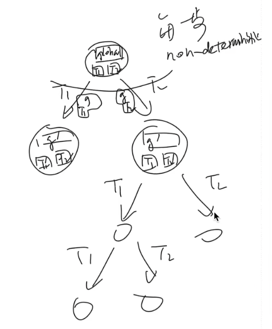
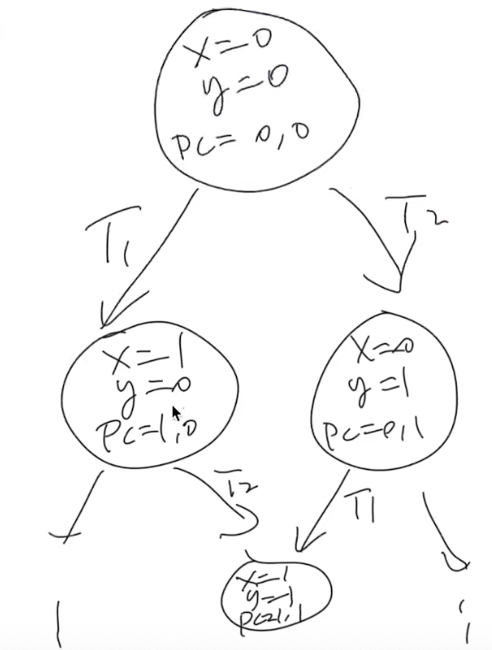
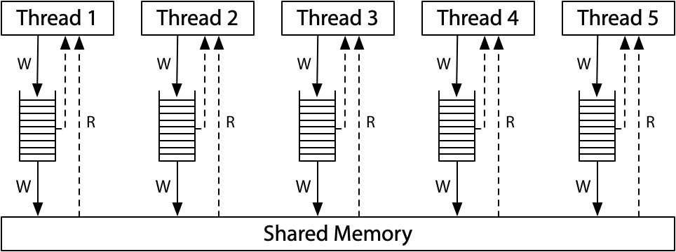
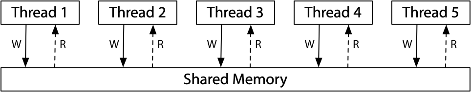

# 多处理器编程：从入门到放弃

一定要看老师视频课 https://www.bilibili.com/video/BV13u411X72Q 1:14:13 之后的内容，全是重点

## Overview

复习

- 程序 (源代码S、二进制代码C) = 状态机
  - 编译器 C=compile(S)
- 应用视角的操作系统 = syscall 指令

------

本次课回答的问题

- **Q**: 在多处理器时代，上面的理解应该作出怎样的变化？

------

本次课主要内容

- 并发程序的状态机模型
- 线程库 `thread.h`
- 多线程带来的麻烦

## 一、入门

### 1、Three Easy Pieces: 并发

> Concurrent: existing, happening, or done *at the same time*.
>
> In computer science, concurrency refers to the ability of different parts or units of a program, algorithm, or problem to be executed out-of-order or in partial order, without affecting the final outcome. (Wikipedia)

为什么在这门课 (先) 讲并发？

- 讲并发
  - 操作系统是最早的并发程序之一
  - 今天遍地都是多处理器系统 (为什么？)
- 先讲并发
  - 实验是 bottom-up 的 (L1: 多处理器上的 `malloc`/`free`)

系统调用的代码是世界上最早的并发程序

### 2、并发的基本单位：线程

共享内存的多个执行流

- 执行流拥有独立的堆栈/寄存器
- 共享全部的内存 (指针可以互相引用)

------

用状态机的视角就很容易理解了！



### 3、入门：`thread.h` 简化的线程 API

我们为大家封装了超级好用的线程 API ([`thread.h`](http://jyywiki.cn/pages/OS/2022/demos/thread.h))

- `create(fn)`
  - 创建一个入口函数是 `fn`  的线程，并立即开始执行
    - `void fn(int tid) { ... }`
    - 参数 `tid` 从 1 开始编号
  - 语义：在状态中新增 stack frame 列表并初始化为 `fn(tid)`
- `join()`
  - 等待所有运行线程的 `fn` 返回
  - 在 `main` 返回时会自动等待所有线程结束
  - 语义：在有其他线程未执行完时死循环，否则返回
- 编译时需要增加 `-lpthread`

---

thread.h

```c
#include <stdlib.h>
#include <stdio.h>
#include <string.h>
#include <stdatomic.h>
#include <assert.h>
#include <unistd.h>
#include <pthread.h>

#define NTHREAD 64
enum { T_FREE = 0, T_LIVE, T_DEAD, };
struct thread {
  int id, status;
  pthread_t thread;
  void (*entry)(int);
};

struct thread tpool[NTHREAD], *tptr = tpool;

void *wrapper(void *arg) {
  struct thread *thread = (struct thread *)arg;
  thread->entry(thread->id);
  return NULL;
}

void create(void *fn) {
  assert(tptr - tpool < NTHREAD);
  *tptr = (struct thread) {
    .id = tptr - tpool + 1,
    .status = T_LIVE,
    .entry = fn,
  };
  pthread_create(&(tptr->thread), NULL, wrapper, tptr);
  ++tptr;
}

void join() {
  for (int i = 0; i < NTHREAD; i++) {
    struct thread *t = &tpool[i];
    if (t->status == T_LIVE) {
      pthread_join(t->thread, NULL);
      t->status = T_DEAD;
    }
  }
}

__attribute__((destructor)) void cleanup() {
  join();
}
```

Hello, Multi-threaded World!

a.c

```c
#include "thread.h"

void Ta() { while (1) { printf("a"); } }
void Tb() { while (1) { printf("b"); } }

int main() {
  create(Ta);
  create(Tb);
}
```

利用 `thread.h` 就可以写出利用多处理器的程序！

- 操作系统会自动把线程放置在不同的处理器上
- 在后台运行，可以看到 CPU 使用率超过了 100%

```bash
$ gcc a.c -lpthread && ./a.out
```

---

如何证明线程确实共享内存？

- [shm-test.c](http://jyywiki.cn/pages/OS/2022/demos/shm-test.c)

```c
#include "thread.h"

int x = 0;

void Thello(int id) {
  // int x = 0;
  usleep(id * 100000);
  printf("Hello from thread #%c\n", "123456789ABCDEF"[x++]);
}

int main() {
  for (int i = 0; i < 10; i++) {
    create(Thello);
  }
}
```

---

如何证明线程具有独立堆栈 (以及确定它们的范围)？

- [stack-probe.c](http://jyywiki.cn/pages/OS/2022/demos/stack-probe.c) (输出有点乱？我们还有 `sort`!)

```c
#include "thread.h"

__thread char *base, *cur; // thread-local variables
__thread int id;

// objdump to see how thread-local variables are implemented
__attribute__((noinline)) void set_cur(void *ptr) { cur = ptr; }
__attribute__((noinline)) char *get_cur()         { return cur; }

void stackoverflow(int n) {
  set_cur(&n);
  if (n % 1024 == 0) {
    int sz = base - get_cur();
    printf("Stack size of T%d >= %d KB\n", id, sz / 1024);
  }
  stackoverflow(n + 1);
}

void Tprobe(int tid) {
  id = tid;
  base = (void *)&tid;
  stackoverflow(0);
}

int main() {
  setbuf(stdout, NULL);
  for (int i = 0; i < 4; i++) {
    create(Tprobe);
  }
}
```

```bash
$ gcc a.c -lpthread && ./a.out
# 命令行所有的输出排序
$ gcc a.c -lpthread && ./a.out | sort -nk 6

...
Stack size of T4 >= 8000 KB
Stack size of T2 >= 8064 KB
Stack size of T4 >= 8064 KB
Stack size of T2 >= 8128 KB
Stack size of T4 >= 8128 KB
```

可以联想到，每个栈的大小是 8128 KB

```c
// a.c
#include "thread.h"

void Ta() { while (1) { ; } }

int main() {
  create(Ta);
}

$ gcc a.c -lpthread
```

如何观察是哪个系统调用创建了线程？

```bash
$ strace ./a.out

execve("./a.out", ["./a.out"], 0x7fff877ef750 /* 28 vars */) = 0
brk(NULL)                               = 0x56179c316000
access("/etc/ld.so.nohwcap", F_OK)      = -1 ENOENT (No such file or directory)
access("/etc/ld.so.preload", R_OK)      = -1 ENOENT (No such file or directory)
openat(AT_FDCWD, "/etc/ld.so.cache", O_RDONLY|O_CLOEXEC) = 3
fstat(3, {st_mode=S_IFREG|0644, st_size=87483, ...}) = 0
mmap(NULL, 87483, PROT_READ, MAP_PRIVATE, 3, 0) = 0x7fe447e1c000
close(3)                                = 0
access("/etc/ld.so.nohwcap", F_OK)      = -1 ENOENT (No such file or directory)
openat(AT_FDCWD, "/lib/x86_64-linux-gnu/libpthread.so.0", O_RDONLY|O_CLOEXEC) = 3
read(3, "\177ELF\2\1\1\0\0\0\0\0\0\0\0\0\3\0>\0\1\0\0\0000b\0\0\0\0\0\0"..., 832) = 832
fstat(3, {st_mode=S_IFREG|0755, st_size=144976, ...}) = 0
mmap(NULL, 8192, PROT_READ|PROT_WRITE, MAP_PRIVATE|MAP_ANONYMOUS, -1, 0) = 0x7fe447e1a000
mmap(NULL, 2221184, PROT_READ|PROT_EXEC, MAP_PRIVATE|MAP_DENYWRITE, 3, 0) = 0x7fe4479ea000
mprotect(0x7fe447a04000, 2093056, PROT_NONE) = 0
mmap(0x7fe447c03000, 8192, PROT_READ|PROT_WRITE, MAP_PRIVATE|MAP_FIXED|MAP_DENYWRITE, 3, 0x19000) = 0x7fe447c03000
mmap(0x7fe447c05000, 13440, PROT_READ|PROT_WRITE, MAP_PRIVATE|MAP_FIXED|MAP_ANONYMOUS, -1, 0) = 0x7fe447c05000
close(3)                                = 0
access("/etc/ld.so.nohwcap", F_OK)      = -1 ENOENT (No such file or directory)
openat(AT_FDCWD, "/lib/x86_64-linux-gnu/libc.so.6", O_RDONLY|O_CLOEXEC) = 3
read(3, "\177ELF\2\1\1\3\0\0\0\0\0\0\0\0\3\0>\0\1\0\0\0\20\35\2\0\0\0\0\0"..., 832) = 832
fstat(3, {st_mode=S_IFREG|0755, st_size=2030928, ...}) = 0
mmap(NULL, 4131552, PROT_READ|PROT_EXEC, MAP_PRIVATE|MAP_DENYWRITE, 3, 0) = 0x7fe4475f9000
mprotect(0x7fe4477e0000, 2097152, PROT_NONE) = 0
mmap(0x7fe4479e0000, 24576, PROT_READ|PROT_WRITE, MAP_PRIVATE|MAP_FIXED|MAP_DENYWRITE, 3, 0x1e7000) = 0x7fe4479e0000
mmap(0x7fe4479e6000, 15072, PROT_READ|PROT_WRITE, MAP_PRIVATE|MAP_FIXED|MAP_ANONYMOUS, -1, 0) = 0x7fe4479e6000
close(3)                                = 0
mmap(NULL, 12288, PROT_READ|PROT_WRITE, MAP_PRIVATE|MAP_ANONYMOUS, -1, 0) = 0x7fe447e17000
arch_prctl(ARCH_SET_FS, 0x7fe447e17740) = 0
mprotect(0x7fe4479e0000, 16384, PROT_READ) = 0
mprotect(0x7fe447c03000, 4096, PROT_READ) = 0
mprotect(0x56179a63f000, 4096, PROT_READ) = 0
mprotect(0x7fe447e32000, 4096, PROT_READ) = 0
munmap(0x7fe447e1c000, 87483)           = 0
set_tid_address(0x7fe447e17a10)         = 29506
set_robust_list(0x7fe447e17a20, 24)     = 0
rt_sigaction(SIGRTMIN, {sa_handler=0x7fe4479efcb0, sa_mask=[], sa_flags=SA_RESTORER|SA_SIGINFO, sa_restorer=0x7fe4479fc980}, NULL, 8) = 0
rt_sigaction(SIGRT_1, {sa_handler=0x7fe4479efd50, sa_mask=[], sa_flags=SA_RESTORER|SA_RESTART|SA_SIGINFO, sa_restorer=0x7fe4479fc980}, NULL, 8) = 0
rt_sigprocmask(SIG_UNBLOCK, [RTMIN RT_1], NULL, 8) = 0
prlimit64(0, RLIMIT_STACK, NULL, {rlim_cur=8192*1024, rlim_max=RLIM64_INFINITY}) = 0
mmap(NULL, 8392704, PROT_NONE, MAP_PRIVATE|MAP_ANONYMOUS|MAP_STACK, -1, 0) = 0x7fe446df8000
mprotect(0x7fe446df9000, 8388608, PROT_READ|PROT_WRITE) = 0
brk(NULL)                               = 0x56179c316000
brk(0x56179c337000)                     = 0x56179c337000
clone(child_stack=0x7fe4475f7fb0, flags=CLONE_VM|CLONE_FS|CLONE_FILES|CLONE_SIGHAND|CLONE_THREAD|CLONE_SYSVSEM|CLONE_SETTLS|CLONE_PARENT_SETTID|CLONE_CHILD_CLEARTID, parent_tidptr=0x7fe4475f89d0, tls=0x7fe4475f8700, child_tidptr=0x7fe4475f89d0) = 29507
futex(0x7fe4475f89d0, FUTEX_WAIT, 29507, NULL
```

可以猜到是最后的 `clone` 系统调用，创建了线程

---

更多的习题

- 创建线程使用的是哪个系统调用？
- 能不能用 gdb 调试？
- 基本原则：有需求，就能做到 ([RTFM](https://sourceware.org/gdb/onlinedocs/gdb/Threads.html))

### 4、`thread.h` 背后：POSIX Threads

想进一步配置线程？

- 设置更大的线程栈
- 设置 detach 运行 (不在进程结束后被杀死，也不能 join)
- ……

------

POSIX 为我们提供了线程库 (pthreads)

- `man 7 pthreads`
- 练习：改写 thread.h，使得线程拥有更大的栈
  - 可以用 [stack-probe.c](http://jyywiki.cn/pages/OS/2022/demos/stack-probe.c) 验证

------

然而，可怕的事情正在悄悄逼近……

- 多处理器系统中线程的代码可能同时执行
  - 两个线程同时执行 `x++`，结果会是什么呢？

## 二、放弃 (1)：原子性

### 1、例子：山寨多线程支付宝

```c
unsigned int balance = 100;
int Alipay_withdraw(int amt) {
  if (balance >= amt) {
    balance -= amt;
    return SUCCESS;
  } else {
    return FAIL;
  }
}
```

两个线程并发支付 ¥100 会发生什么？[alipay.c](http://jyywiki.cn/pages/OS/2022/demos/alipay.c)

- 账户里会多出用不完的钱！
- Bug/漏洞不跟你开玩笑：Mt. Gox Hack 损失 650,000
  - 今天价值 $28,000,000,000

### 2、例子：求和

分两个线程，计算 1+1+1+…+1 (共计 2n 个 1)

```c
#define N 100000000
long sum = 0;

void Tsum() { for (int i = 0; i < N; i++) sum++; }

int main() {
  create(Tsum);
  create(Tsum); 
  join();
  printf("sum = %ld\n", sum);
}
```

[sum.c](http://jyywiki.cn/pages/OS/2022/demos/sum.c) 运行结果

- 119790390, 99872322 (结果可以比 `N` 还要小), ...
- Inline assembly 也不行

---

加上 `lock`，但程序速度明显下降

```c
#define N 100000000
long sum = 0;

void Tsum() {
  for (int i = 0; i < n; i++) {
      asm volatile("lock add $1, %0": "+m"(sum));
  }
}

int main() {
  create(Tsum);
  create(Tsum); 
  join();
  printf("sum = %ld\n", sum);
}
```

### 3、原子性的丧失

> “程序 (甚至是一条指令) 独占处理器执行” 的基本假设在现代多处理器系统上不再成立。

原子性：一段代码执行 (例如 `pay()`) 独占整个计算机系统

- 单处理器多线程
  - 线程在运行时可能被中断，切换到另一个线程执行
- 多处理器多线程
  - 线程根本就是并行执行的

------

(历史) 1960s，大家争先在共享内存上实现原子性 (互斥)

- 但几乎所有的实现都是错的，直到 [Dekker's Algorithm](https://en.wikipedia.org/wiki/Dekker's_algorithm)，还只能保证两个线程的互斥

### 4、原子性的丧失：有没有感到后怕？

`printf` 还能在多线程程序里调用吗？

```
void thread1() { while (1) { printf("a"); } }
void thread2() { while (1) { printf("b"); } }
```

我们都知道 printf 是有缓冲区的 (为什么？)

- 如果执行 `buf[pos++] = ch` (`pos` 共享) 不就 💥 了吗？

------

RTFM!

### 5、实现原子性

互斥和原子性是本学期的重要主题

- `lock(&lk)`
- `unlock(&lk)`
  - 实现临界区 (critical section) 之间的绝对串行化
  - 程序的其他部分依然可以并行执行

------

**99% 的并发问题都可以用一个队列解决**

- 把大任务切分成可以并行的小任务
- worker thread 去锁保护的队列里取任务
- 除去不可并行的部分，剩下的部分可以获得线性的加速
  - Thm. Tn<T∞+T1/n ([PDC](https://web.mit.edu/dimitrib/www/pdc.html), Chap. 1)

## 三、放弃 (2)：顺序

### 1、例子：求和 (再次出现)

分两个线程，计算 1+1+1+…+1 (共计 2n 个 1)

```c
#define N 100000000
long sum = 0;

void Tsum() { for (int i = 0; i < N; i++) sum++; }

int main() {
  create(Tsum);
  create(Tsum);
  join();
  printf("sum = %ld\n", sum);
}
```

我们好像忘记给 [sum.c](http://jyywiki.cn/pages/OS/2022/demos/sum.c) 添加编译优化了？

- `-O1`: `gcc -O1 sum.c -lpthread && ./a.out`  100000000 😱😱
- `-O2`:  `gcc -O2 sum.c -lpthread && ./a.out` 200000000 😱😱😱
- 循环看下结果：`while true; ./a.out; end`

### 2、顺序的丧失

> 编译器对内存访问 “eventually consistent” 的处理导致共享内存作为线程同步工具的失效。

刚才的例子

- `-O1`: `R[eax] = sum; R[eax] += N; sum = R[eax]`
- `-O2`: `sum += N;`
- (你的编译器也许是不同的结果)

另一个例子

```c
while (!done);
// would be optimized to
if (!done) while (1);
```

### 3、实现源代码的按顺序翻译

在 while 代码中插入 “优化不能穿越” 的 barrier

- `asm volatile ("" ::: "memory");`
  - Barrier 的含义是 “可以读写任何内存”
- 使用 `volatile` 变量
  - 保持 C 语义和汇编语义一致

```c
extern int volatile done;

while (!done) ;
```

## 四、放弃 (3)：可见性

### 1、例子

```c
int x = 0, y = 0;

void T1() {
  x = 1;
  asm volatile("" : : "memory"); // compiler barrier
  printf("y = %d\n", y);
}

void T2() {
  y = 1;
  asm volatile("" : : "memory"); // compiler barrier
  printf("x = %d\n",  x);
}
```

问题：我们最终能看到哪些结果？

**一定要画出状态机，才能理解并发程序执行的行为**

可以是01、10、11，无论如何不可能是 00



---

- [mem-ordering.c](http://jyywiki.cn/pages/OS/2022/demos/mem-ordering.c)
  - 输出不好读？pipe to `head -n 1000000 | sort | uniq -c`

```bash
$ ./a.out | head -n 1000000 | sort | uniq -c
```


```c
#include "thread.h"

int x = 0, y = 0;

atomic_int flag;
#define FLAG atomic_load(&flag)
#define FLAG_XOR(val) atomic_fetch_xor(&flag, val)
#define WAIT_FOR(cond) while (!(cond)) ;

 __attribute__((noinline))
void write_x_read_y() {
  int y_val;
  asm volatile(
    "movl $1, %0;" // x = 1
    "movl %2, %1;" // y_val = y
    : "=m"(x), "=r"(y_val) : "m"(y)
  );
  printf("%d ", y_val);
}

 __attribute__((noinline))
void write_y_read_x() {
  int x_val;
  asm volatile(
    "movl $1, %0;" // y = 1
    "movl %2, %1;" // x_val = x
    : "=m"(y), "=r"(x_val) : "m"(x)
  );
  printf("%d ", x_val);
}

void T1(int id) {
  while (1) {
    WAIT_FOR((FLAG & 1));
    write_x_read_y();
    FLAG_XOR(1);
  }
}

void T2() {
  while (1) {
    WAIT_FOR((FLAG & 2));
    write_y_read_x();
    FLAG_XOR(2);
  }
}

void Tsync() {
  while (1) {
    x = y = 0;
    __sync_synchronize(); // full barrier
    usleep(1);            // + delay
    assert(FLAG == 0);
    FLAG_XOR(3);
    // T1 and T2 clear 0/1-bit, respectively
    WAIT_FOR(FLAG == 0);
    printf("\n"); fflush(stdout);
  }
}

int main() {
  create(T1);
  create(T2);
  create(Tsync);
}
```

### 2、现代处理器：处理器也是 (动态) 编译器！

单个处理器把汇编代码 (用电路) “编译” 成更小的 μops

- RF[9] = load(RF[7] + 400)
- store(RF[12], RF[13])
- RF[3] = RF[4] + RF[5]
    - 每个 μop 都有 Fetch, Issue, Execute, Commit 四个阶段

---

在任何时刻，处理器都维护一个 μop 的 “池子”

- 每一周期向池子补充尽可能多的 μop
    - “多发射”
- 每一周期 (在不违反编译正确性的前提下) 执行尽可能多的μop
    - “乱序执行”、“按序提交”
- 这就是《计算机体系结构》 (剩下就是木桶效应，哪里短板补哪里）

### 3、多处理器间即时可见性的丧失

> 满足单处理器 eventual memory consistency 的执行，在多处理器上可能无法序列化！

当 x≠y 时，对 x, y 的内存读写可以交换顺序 

- 它们甚至可以在同一个周期里完成 (只要 load/store unit 支持)
- 如果写 x 发生 cache miss，可以让读 y 先执行
    - 满足 “尽可能执行 μop” 的原则，最大化处理器性能

```
     # <-----------+
movl $1, (x)   #   |
movl (y), %eax # --+
```

- 在多处理器上的表现
    - 两个处理器分别看到 y=0 和 x=0

### 4、宽松内存模型 (Relaxed/Weak Memory Model)

> 宽松内存模型的目的是使单处理器的执行更高效。

x86 已经是市面上能买到的 “最强” 的内存模型了 😂

- 这也是 Intel 自己给自己加的包袱
- 看看 [ARM/RISC-V](https://research.swtch.com/mem-weak@2x.png) 吧，根本就是个分布式系统

ARM/RISC-V：


(x86-TSO in [Hardware memory models](https://research.swtch.com/hwmm) by Russ Cox)



### 5、实现顺序一致性



软件做不到，硬件来帮忙

- Memory barrier:__sync_synchronize() RTFM:https://gcc.gnu.org/onlinedocs/gcc/_005f_005fsync-Builtins.html
    - Compiler barrier + fence 指令
    - 插入 fence 指令后，将阻止 x=y=0
- 原子指令 (lock prefix, lr/sc, ...)
    - `stdatomic.h`

## 总结

本次课回答的问题

- **Q**: 如何理解多处理器系统？

------

Take-away message

- 多处理器编程：入门
    - 多处理器程序 = 状态机 (共享内存；非确定选择线程执行)
    - thread.h = create + join
- 多处理器编程：放弃你对 “程序” 的旧理解
    - 不原子、能乱序、不立即可见
        - 来自于编译优化 (处理器也是编译器)
        - [Ad hoc synchronization considered harmful](https://www.usenix.org/events/osdi10/tech/full_papers/Xiong.pdf) (OSDI'10)