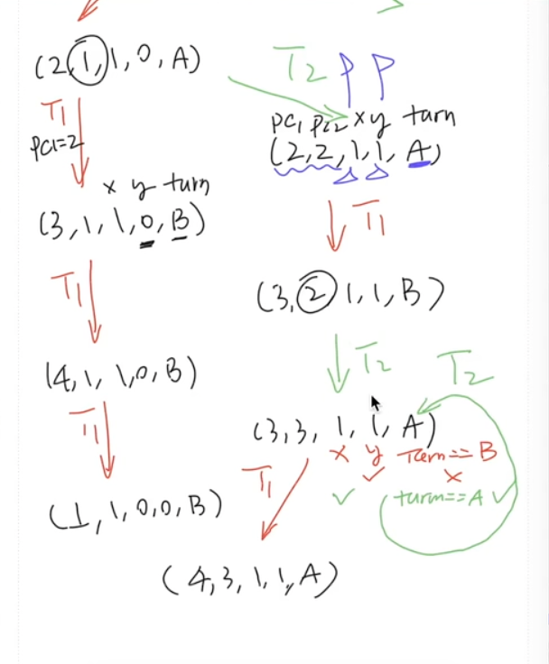

# 理解并发程序执行

## Overview

复习

- 并发程序 = 多个执行流、共享内存的状态机

------

本次课回答的问题

- **Q**: 如何阅读理解教科书/互联网/期末试卷上的各种并发程序？

------

本次课主要内容

- (自动) 画状态机理解并发程序

## 收获

### 1、如何理解并发程序？画状态机

- 并发程序 = 多个执行流、共享内存的状态机
  - 线程共享内存
  - 每一步非确定选择线程执行
- 画状态机就对了，当然，用工具帮你画 (model checker)

原则上可以用纸和笔将程序执行的任何状态都画出来

在画状态机的过程中，对程序语言的形式语义、并发算法的执行有第一手的认识

但并发编程比大家想象得困难

### 2、(自动) 画状态机理解并发程序

并发算法的设计困境

- 不敢不画：谁知道有什么奇怪情况会发生？
- 不敢乱画：画错了就都完了

就是 **Model Checker** 和 可视化

> Model checking is a method for formally verifying finite-state systems——只要能为系统建立模型，就能用 prove by brute-force 证明正确/找到错误。

Model checker 的一切就是状态机！

- Safety: 没有红色节点，红色的状态不可到达，是bug
  - G(V,E) 上的可达性问题
- (Strong) Liveness: 从任意状态出发，都能到达绿/蓝色状态
  - G(V,E) 上的什么问题？从黑色节点出发，通过一个环，返回自己（强连通分量解决）

### 3、工具的力量

> 没有人能阻止程序员写 bug，但工具可以。

至今为止我们用过的自动化工具 (他们拯救了你无数次)

- Type safety check
- `-Wall -Werror`
- Differential testing
- Model checker
- ……

------

这门课的另一个 take-away

- 操作系统是一个巨大的工程
- 没有工具 (编程、测试、调试……)，不做系统

## 一、画状态机理解并发程序

### 1、一个互斥算法

> 互斥：保证两个线程不能同时执行一段代码。
插入 “神秘代码”，使得 [sum.c](http://jyywiki.cn/pages/OS/2022/demos/sum.c) (或者任意其他代码) 能够正常工作

```c
void Tsum() {
  // 神秘代码
  sum++;
  // 神秘代码
}
```

- 假设一个内存的读/写可以保证顺序、原子完成

```c
__sync_synchronize();
x = 1; // 或 int t = x;
__sync_synchronize();
```

---

```c
#include "thread.h"
#define N 100000000
long sum = 0;
void Tsum() {
    for (int i = 0; i < N; i++) {
        sum++;
    }
}
int main() {
    create(Tsum);
    create(Tsum);
    join();
    printf("sum = %ld\n", sum);
}
```

```bash
$ gcc -O0 a.c && ./a.out 
sum = 101852382
$ gcc -O1 a.c && ./a.out 
sum = 200000000
$ gcc -O2 a.c && ./a.out 
sum = 200000000
```

通过：objdump 命令去看

```bash
$ gcc -O0 -c a.c && objdump -d a.o
$ gcc -O1 -c a.c && objdump -d a.o
```

### 2、失败的尝试

```c
int locked = UNLOCK;

void critical_section() {
retry:
  if (locked != UNLOCK) {
    goto retry;
  }
  locked = LOCK;

  // critical section

  locked = UNLOCK;
}
```

和山寨 [alipay.c](http://jyywiki.cn/pages/OS/2022/demos/alipay.c) 完全一样的错误

- 处理器默认不保证 load + store 的原子性

问题的原因在于下面的语句，不是原子性的

```c
  if (locked != UNLOCK) {
    goto retry;
  }
  locked = LOCK;
```

### 3、正确性不明的奇怪尝试 (Peterson 算法)

A 和 B 争用厕所的包厢

- 想进入包厢之前，A/B 都要先举起自己的旗子
  - A 确认旗子举好以后，往厕所门上贴上 “B ” 的标签
  - B 确认旗子举好以后，往厕所门上贴上 “A ” 的标签
- 然后，**如果对方的旗子举起来，且门上的名字不是自己**，等待
  - 否则可以进入包厢
- 出包厢后，放下自己的旗子

---

Peterson 算法提出了一种互斥的协议，参考[Peterson算法 - 维基百科，自由的百科全书 (wikipedia.org)](https://zh.m.wikipedia.org/zh-hans/Peterson算法)

该算法满足解决临界区问题的三个必须标准：互斥访问, 进入（即不死锁）, 有限等待（即不饿死）

```c
// flag[] is boolean array; and turn is an integer
flag[0]   = false;
flag[1]   = false;
int turn;

// P0: 
flag[0] = true;
turn = 1;
while (flag[1] == true && turn == 1)
{
    // busy wait
}
// critical section
...
// end of critical section
flag[0] = false;

// P1: 
flag[1] = true;
turn = 0;
while (flag[0] == true && turn == 0)
{
    // busy wait
}
// critical section
...
// end of critical section
flag[1] = false;
```

### 4、习题：证明 Peterson 算法正确，或给出反例

进入临界区的情况

- 如果只有一个人举旗，他就可以直接进入
- 如果两个人同时举旗，由厕所门上的标签决定谁进
  - 手快 🈶️ (被另一个人的标签覆盖)、手慢 🈚

------

一些具体的细节情况

- A 看到 B 没有举旗
  - B 一定不在临界区
  - 或者 B 想进但还没来得及把 “A” 贴在门上
    - memory ordering
- A 看到 B 举旗子
  - A 一定已经把旗子举起来了 (*!@^#*&!%^(&^!@%#

### 5、Prove by Brute-force!

枚举状态机的全部状态 (假设没有乱序、每步执行一行)

- (PC1,PC2,x,y,turn); [peterson-simple.c](http://jyywiki.cn/pages/OS/2022/demos/peterson-simple.c)

```c
int x = 0, y = 0, turn = A;
void TA() {
    while (1) {
/* PC=1 */  x = 1;
/* PC=2 */  turn = B;
/* PC=3 */  while (y && turn == B) ;
            critical_section();
/* PC=4 */  x = 0; } }
void TB() {
  while (1) {
/* PC=1 */  y = 1;
/* PC=2 */  turn = A;
/* PC=3 */  while (x && turn == A) ;
            critical_section();
/* PC=4 */  y = 0; } }
```

原则上可以用纸和笔将程序执行的任何状态都画出来

在画状态机的过程中，对程序语言的形式语义、并发算法的执行有第一手的认识



```c
#include "thread.h"

#define A 1
#define B 2

atomic_int nested;
atomic_long count;

// 这个函数判断，是不是任何时候只有一个线程在临界区
// 看到计数器为2的话，说明有两个人在临界区里
void critical_section() {
  long cnt = atomic_fetch_add(&count, 1);
  assert(atomic_fetch_add(&nested, 1) == 0);
  atomic_fetch_add(&nested, -1);
}

int volatile x = 0, y = 0, turn = A;

void TA() {
    while (1) {
/* PC=1 */  x = 1;
/* PC=2 */  turn = B;
/* PC=3 */  while (y && turn == B) ;
            critical_section();
/* PC=4 */  x = 0;
    }
}

void TB() {
  while (1) {
/* PC=1 */  y = 1;
/* PC=2 */  turn = A;
/* PC=3 */  while (x && turn == A) ;
            critical_section();
/* PC=4 */  y = 0;
  }
}

int main() {
  create(TA);
  create(TB);
}
```

### 6、Peterson's Protocol Verified 🎖

> 我们 (在完全不理解算法的前提下) 证明了 Sequential 内存模型下 Peterson's Protocol 的 Safety。它能够实现互斥。

并发编程比大家想象得困难

- 感受一下 [dekker.py](http://jyywiki.cn/pages/OS/2022/demos/dekker.py)
- “[Myths about the mutual exclusion problem](https://zoo.cs.yale.edu/classes/cs323/doc/Peterson.pdf)” (IPL, 1981)

和一些现状

- 今天有非常坚 (内) 实 (卷) 的理论体系
- 小心编译器和多处理器硬件
  - 更好的 peterson 算法：[peterson-barrier.c](http://jyywiki.cn/pages/OS/2022/demos/peterson-barrier.c) (哪些 barrier 是多余的吗？)

---

```bash
$ gcc peterson-barrier.c -lpthread && ./a.out
```

把每一步内存访问都拆开了

在每个一内存访问的边界上都增加了 `BARRIER`

- 既是 compiler barrier，不允许编译器随意 re-order 内存访问
- 还是 memory barrier，运行很长时间的话，也不会出问题

```c
#include "thread.h"

#define A 1
#define B 2

#define BARRIER __sync_synchronize()

atomic_int nested;
atomic_long count;

void critical_section() {
  long cnt = atomic_fetch_add(&count, 1);
  int i = atomic_fetch_add(&nested, 1) + 1;
  if (i != 1) {
    printf("%d threads in the critical section @ count=%ld\n", i, cnt);
    assert(0);
  }
  atomic_fetch_add(&nested, -1);
}

int volatile x = 0, y = 0, turn;

void TA() {
  while (1) {
    x = 1;                   BARRIER;
    turn = B;                BARRIER; // <- this is critcal for x86
    while (1) {
      if (!y) break;         BARRIER;
      if (turn != B) break;  BARRIER;
    }
    critical_section();
    x = 0;                   BARRIER;
  }
}

void TB() {
  while (1) {
    y = 1;                   BARRIER;
    turn = A;                BARRIER;
    while (1) {
      if (!x) break;         BARRIER;
      if (turn != A) break;  BARRIER;
    }
    critical_section();
    y = 0;                   BARRIER;
  }
}

int main() {
  create(TA);
  create(TB);
}
```

## 二、(自动) 画状态机理解并发程序

### 1、画状态机实在太累了

并发算法的设计困境

- 不敢不画：谁知道有什么奇怪情况会发生？
- 不敢乱画：画错了就都完了

------

解决困境 💡

- 能不能让电脑帮我们画？
- 我们有程序的形式语义 (数学定义)，就能写解释器模拟执行（nemu）
  - 说起来容易，但需要写多少代码呢……？

### 2、年轻人的第一个 Model Checker

选择正确的语言

- 当然是 Python 啦
- 容易 hack 的动态语言
- 丰富的库函数

选正确的语言机制，用 c 或者 c++ 实现就是给自己挖坑

- 模式检查器：[model-checker.py](http://jyywiki.cn/pages/OS/2022/demos/model-checker.py)，会遍历模型上所有可能的状态
  - ~~代码量达到了惊人的 150 行~~！
  - UNIX Philosophy: 写能合作的程序
    - Model checker 只负责输出 “状态图”
- 可视化：[visualize.py](http://jyywiki.cn/pages/OS/2022/demos/visualize.py)

````bash
python3.7 -m pip install astor
python3.7 model-checker.py mutex-bad.py
...
````

```
brew install graphviz
pip3 install graphviz
pip3 install jinja2
pip3 install markdown
```


model-checker.py:

一定要用 3.7 以上的版本才行，3.6.9 亲测不行

```python
import inspect, ast, astor, copy, sys
from pathlib import Path

threads, marker_fn = [], []

def thread(fn):
    '''Decorate a member function as a thread'''
    global threads
    threads.append(fn.__name__)
    return fn

def marker(fn):
    '''Decorate a member function as a state marker'''
    global marker_fn
    marker_fn.append(fn)

def localvar(s, t, varname):
    '''Return local variable value of thread t in state s'''
    return s.get(t, (0, {}))[1].get(varname, None)

def checkpoint():
    '''Instrumented `yield checkpoint()` goes here'''
    f = inspect.stack()[1].frame # stack[1] is the caller of checkpoint()
    return (f.f_lineno, { k: v for k, v in f.f_locals.items() if k != 'self' })

def hack(Class):
    '''Hack Class to instrument @mc.thread functions'''
    class Instrument(ast.NodeTransformer):
        def generic_visit(self, node, in_fn=False):
            if isinstance(node, ast.FunctionDef):
                if node.name in threads:
                    # a @mc.thread function -> instrument it
                    in_fn, node.decorator_list = True, []
                elif node.decorator_list:
                    # a decorated function like @mc.mark -> remove it
                    return None

            body = []
            for line in getattr(node, 'body', []):
                # prepend each line with `yield checkpoint()`
                if in_fn: body.append(
                    ast.Expr(ast.Yield(
                        ast.Call(func=ast.Name(checkpoint.__name__, ctx=ast.Load()),
                            args=[], keywords=[]))) )
                body.append(self.generic_visit(line, in_fn))
            node.body = body
            return node

    if not hasattr(Class, 'hacked'):
        hacked_ast = Instrument().visit(ast.parse(Class.source))
        hacked_src, vars = astor.to_source(hacked_ast), {}
        # set a breakpoint() here to see **magic happens**!
        exec(hacked_src, globals(), vars)
        Class.hacked, Class.hacked_src = vars[Class.__name__], hacked_src
    return Class

def execute(Class, trace):
    '''Execute trace (like [0,0,0,2,2,1,1,1]) on Class'''
    def attrs(obj):
        for attr in dir(obj):
            val = getattr(obj, attr)
            if not attr.startswith('__') and type(val) in [bool, int, str, list, tuple, dict]:
                yield attr, val

    obj = hack(Class).hacked()
    for attr, val in attrs(obj):
        setattr(obj, attr, copy.deepcopy(val))
 
    T = []
    for t in threads:
        fn = getattr(obj, t)
        T.append(fn()) # a generator for a thread
    S = { t: T[i].__next__() for i, t in enumerate(threads) }

    while trace:
        chosen, tname, trace = trace[0], threads[trace[0]], trace[1:]
        try:
            if T[chosen]:
                S[tname] = T[chosen].__next__()
        except StopIteration:
            S.pop(tname)
            T[chosen] = None

    for attr, val in attrs(obj):
        S[attr] = val
    return obj, S

class State:
    def __init__(self, Class, trace):
        self.trace = trace
        self.obj, self.state = execute(Class, trace)
        self.name = f's{abs(State.freeze(self.state).__hash__())}'

    @staticmethod
    def freeze(obj):
        '''Create an object's hashable frozen (immutable) counterpart'''
        if obj is None or type(obj) in [str, int, bool]:
            return obj
        elif type(obj) in [list, tuple]:
            return tuple(State.freeze(x) for x in obj)
        elif type(obj) in [dict]:
            return tuple(sorted(
                zip(obj.keys(), (State.freeze(v) for v in obj.values()))
            ))
        raise ValueError('Cannot freeze')

def serialize(Class, s0, vertices, edges):
    '''Serialize all model checking results'''
    print(f'CLASS({repr(Class.hacked_src)})')

    sid = { s0.name: 0 }
    def name(s):
        if s.name not in sid: 
            sid[s.name] = len(sid)
        return repr(f's{sid[s.name]}')

    for u in vertices.values():
        mk = [f(u.obj, u.state) for f in marker_fn if f(u.obj, u.state)]
        print(f'STATE({name(u)}, {repr(u.state)}, {repr(mk)})')

    for u, v, chosen in edges:
        print(f'TRANS({name(u)}, {name(v)}, {repr(threads[chosen])})')

def check_bfs(Class):
    '''Enumerate all possible thread interleavings of @mc.thread functions'''
    s0 = State(Class, trace=[])

    # breadth-first search to find all possible thread interleavings
    queue, vertices, edges = [s0], {s0.name: s0}, []
    while queue:
        u, queue = queue[0], queue[1:]
        for chosen, _ in enumerate(threads):
            v = State(Class, u.trace + [chosen])
            if v.name not in vertices:
                queue.append(v)
                vertices[v.name] = v
            edges.append((u, v, chosen))

    serialize(Class, s0, vertices, edges)

src, vars = Path(sys.argv[1]).read_text(), {}
exec(src, globals(), vars)
Class = [C for C in vars.values() if type(C) == type].pop()
setattr(Class, 'source', src)
check_bfs(Class)

```

visualize.py:

```python
import sys, re, graphviz, jinja2, json, markdown, argparse
from pathlib import Path
from collections import namedtuple

EMPTY = '␡'
COLORS = { None: '#f1f5f9',
    'red': '#fecaca',
    'yellow': '#fef08a',
    'green': '#bbf7d0',
    'blue': '#bfdbfe',
    'purple': '#e9d5ff'
} 

Vertex = namedtuple('Vertex', 'name state marks')
Edge = namedtuple('Edge', 'name u v t')
State = namedtuple('State', 'pcs lvars gvars')

vertices, edges, threads = {}, [], []
code_lines, pcmap, gvar, lvar = [], {}, [], []

def parse_input():
    def CLASS(cl):
        global hacked_src
        hacked_src = cl
    
    def STATE(u, state, marks):
        vertices[u] = Vertex(name=u, state=state, marks=marks)
    
    def TRANS(u, v, t):
        edges.append(Edge(name=f'{u}-{v}', u=vertices[u], v=vertices[v], t=t))
        if t not in threads:
            threads.append(t)
    
    for line in sys.stdin.readlines():
        eval(line)

def parse_src():
    md_lines = ['    :::python']
    for line in hacked_src.splitlines():
        if 'yield' not in line:
            md_lines.append(f'    {line.replace("    ", "  ")}')
    html = markdown.markdown('\n'.join(md_lines), extensions=['codehilite'])
    code_lines.extend(re.search(r'<code.*?>(.*)</code>', html, re.DOTALL).group(1).rstrip().splitlines())

    new_pc = 0
    for pc, line in enumerate(hacked_src.splitlines()):
        if 'yield' not in line:
            pcmap[pc + 1] = (new_pc := new_pc + 1)

def parse_vars():
    gv, lv = set(), set()
    for v in vertices.values():
        for t, val in v.state.items():
            if t not in threads: gv.add(t)
            else: lv |= set((t, var) for var in val[1])
    gvar.extend(sorted(list(gv)))
    lvar.extend(sorted(list(lv)))

def parse_state(s):
    gvars = [s[g] for g in gvar]
    lvars = ['⊥' for _ in enumerate(lvar)]
    pcs = [-1 for _ in enumerate(threads)]

    for t in [t for t in threads if t in s]:
        tpc, tstate = s[t]
        pcs[threads.index(t)] = pcmap[tpc + 1]
        for vname, val in tstate.items():
            lvars[lvar.index((t, vname))] = val

    return State(pcs, lvars, gvars)

def reduce(tree_only=False):
    tree, depth, leaf = [], {'s0' : 0}, {'s0': True}
    updated, rnd = 0, 0
    while updated + len(threads) > rnd:
        rnd += 1
        def expand():
            found = False
            for e in edges:
                _, u, v, t = e
                if u.name in depth and v.name not in depth and t == threads[-rnd % len(threads)]:
                    depth[v.name] = depth[u.name] + 1
                    leaf[v.name] = True
                    leaf[u.name] = False
                    tree.append(e)
                    found = True
            return found
        while expand():
            updated = rnd

    others = []
    if not tree_only:
        tnames = set(e.name for e in tree)
        for e in edges:
            name, u, v, t = e
            if name not in tnames:
                w = filter(lambda e1: e1.v.name == u.name, edges).__next__()
                if (leaf[e.u.name] and w.t == e.t) or (depth[u.name] >= depth[v.name]):
                    others.append(e)
    return tree, others

parse_input()
parse_src()
parse_vars()

parser = argparse.ArgumentParser(description='Visualize modeler checker outputs')
parser.add_argument('--tree', '-t', help='Draw tree', action='store_true')
parser.add_argument('--reduce', '-r', help='Draw reduced graph', action='store_true')
args = parser.parse_args()

if args.reduce or args.tree:
    edges, others = reduce(args.tree)
else:
    edges, others = edges, []

COLORS |= dict(zip(threads, ['#be123c', '#1d4ed8', '#eab308', '#4d7c0f']))

g = graphviz.Digraph('G', filename='/tmp/a.gv',
    graph_attr={ 'fontsize': '12', 'layout': 'dot', 'nodesep': '0.75' })
metadata = { 's0': vertices['s0'].name }

with g.subgraph(name='legend') as c:
    c.node_attr = { 'style': 'filled', 'fontname': 'Courier New', 'shape': 'Mrecord' }

    # draw vertices and code blocks
    for v in vertices.values():
        ps = parse_state(v.state)
        color = ([None] + [col for col in v.marks if col])[-1]

        gvals, lvals = '| '.join([f'{g}={v.state[g]}' for g in gvar]), ''
        for i, t in enumerate(threads):
            if i != 0: lvals += '|'
            lvals += '{' + '| '.join([f'{t}.{l}={v.state.get(t, (0, {}))[1].get(l, EMPTY)}' for t1, l in lvar if t1 == t]) + '}'
        label = '{' + '{' + gvals + '}' + '|' + '{' + lvals + '}' + '}'
        label = label.replace('True', 'T').replace('False', 'F')
        c.node(v.name, id=v.name, label=label, fillcolor=COLORS.get(color, color))

        lines = [ '<div class="codehilite">']
        for i, line in enumerate(code_lines):
            cl = 'new' if i + 1 in ps.pcs else ''
            lines.append(f'<pre class="{cl}"><code>{line if line else " "}</pre></code>')
        lines.append('<div class="vars">')
        for i, nm in enumerate(gvar):
            lines.append(f'<pre><code>{nm} = {ps.gvars[i]}</code></pre>')
        for i, (t, nm) in enumerate(lvar):
            lines.append(f'<pre><code>{t}.{nm} = {ps.lvars[i]}</code></pre>')
        lines.append('</div></div>')
        metadata[v.name] = '\n'.join(lines)

    # draw edges
    for idx, (name, u, v, t) in enumerate(edges + others):
        ps_old, ps_new = parse_state(u.state), parse_state(v.state)
        c.edge(u.name, v.name, id=name, fontcolor=COLORS[t], color=COLORS[t], label=t, fontname='Helvetica')

        diff = lambda x, y: f'<span class="new">{y}</span> <span class="old">({x})</span>' if x != y else x
        lines = [ '<div class="codehilite">']
        for i, line in enumerate(code_lines):
            if i + 1 in ps_new.pcs: cl = 'new'
            elif i + 1 in ps_old.pcs: cl = 'old'
            else: cl = ''
            lines.append(f'<pre class="{cl}"><code>{line if line else " "}</pre></code>')
        lines.append('<div class="vars">')
        for i, nm in enumerate(gvar):
            lines.append(f'<pre><code>{nm} = {diff(ps_old.gvars[i], ps_new.gvars[i])}</code></pre>')
        for i, (tname, nm) in enumerate(lvar):
            lines.append(f'<pre><code>{tname}.{nm} = {diff(ps_old.lvars[i], ps_new.lvars[i])}</code></pre>')
        lines.append('</div></div>')
        metadata[name] = '\n'.join(lines)

TEMPLATE = '''
<!DOCTYPE html>
<html>
  <head>
    <meta charset="utf-8">
    <meta name="viewport" content="width=device-width, initial-scale=1.0">
    <style>
      body {
        margin: 0; padding: 8px 16px; box-sizing: border-box;
        overflow: hidden;
      }
      #container {
        overflow: auto;
        width: 100%;
        height: 100%;
        position: absolute;
      }
      .codehilite {
        padding: 10px;
      }
      .old {
        background-color: #d4d4d4;
        opacity: 0.5;
      }
      .new {
        background-color: #f0abfc;
      }
      #code {
        font-size: 135%;
        border: 1px solid;
        top: 0;
        right: 0;
        width: 500px;
        position: absolute;
        float: right;
        background: white;
      }
      .vars {
        position: absolute;
        float: right;
        top: 5px; right: 505px;
        text-align: right;
        background-color: white;
        padding: 5px;
      }
      #mouse-circle {
        position: absolute;
        width: 32px;
        height: 32px;
        margin: -16px 0 0 -16px;
        border: 1px solid green;
        background-color: rgba(0, 255, 0, 0.5);
        border-radius: 50%;
        pointer-events: none;
        box-shadow: rgba(0, 255, 0, 0.35) 0px 5px 15px;
      }

      pre { line-height: 125%; margin: 0; }
      td.linenos .normal { color: inherit; background-color: transparent; padding-left: 5px; padding-right: 5px; }
      span.linenos { color: inherit; background-color: transparent; padding-left: 5px; padding-right: 5px; }
      td.linenos .special { color: #000000; background-color: #ffffc0; padding-left: 5px; padding-right: 5px; }
      span.linenos.special { color: #000000; background-color: #ffffc0; padding-left: 5px; padding-right: 5px; }
      .codehilite .hll { background-color: #ffffcc }
      .codehilite .c { color: #177500 } /* Comment */
      .codehilite .err { color: #000000 } /* Error */
      .codehilite .k { color: #A90D91 } /* Keyword */
      .codehilite .l { color: #1C01CE } /* Literal */
      .codehilite .n { color: #000000 } /* Name */
      .codehilite .o { color: #000000 } /* Operator */
      .codehilite .ch { color: #177500 } /* Comment.Hashbang */
      .codehilite .cm { color: #177500 } /* Comment.Multiline */
      .codehilite .cp { color: #633820 } /* Comment.Preproc */
      .codehilite .cpf { color: #177500 } /* Comment.PreprocFile */
      .codehilite .c1 { display: none; color: #177500 } /* Comment.Single */
      .codehilite .cs { color: #177500 } /* Comment.Special */
      .codehilite .kc { color: #A90D91 } /* Keyword.Constant */
      .codehilite .kd { color: #A90D91 } /* Keyword.Declaration */
      .codehilite .kn { color: #A90D91 } /* Keyword.Namespace */
      .codehilite .kp { color: #A90D91 } /* Keyword.Pseudo */
      .codehilite .kr { color: #A90D91 } /* Keyword.Reserved */
      .codehilite .kt { color: #A90D91 } /* Keyword.Type */
      .codehilite .ld { color: #1C01CE } /* Literal.Date */
      .codehilite .m { color: #1C01CE } /* Literal.Number */
      .codehilite .s { color: #C41A16 } /* Literal.String */
      .codehilite .na { color: #836C28 } /* Name.Attribute */
      .codehilite .nb { color: #A90D91 } /* Name.Builtin */
      .codehilite .nc { color: #3F6E75 } /* Name.Class */
      .codehilite .no { color: #000000 } /* Name.Constant */
      .codehilite .nd { color: #000000 } /* Name.Decorator */
      .codehilite .ni { color: #000000 } /* Name.Entity */
      .codehilite .ne { color: #000000 } /* Name.Exception */
      .codehilite .nf { color: #000000 } /* Name.Function */
      .codehilite .nl { color: #000000 } /* Name.Label */
      .codehilite .nn { color: #000000 } /* Name.Namespace */
      .codehilite .nx { color: #000000 } /* Name.Other */
      .codehilite .py { color: #000000 } /* Name.Property */
      .codehilite .nt { color: #000000 } /* Name.Tag */
      .codehilite .nv { color: #000000 } /* Name.Variable */
      .codehilite .ow { color: #000000 } /* Operator.Word */
      .codehilite .mb { color: #1C01CE } /* Literal.Number.Bin */
      .codehilite .mf { color: #1C01CE } /* Literal.Number.Float */
      .codehilite .mh { color: #1C01CE } /* Literal.Number.Hex */
      .codehilite .mi { color: #1C01CE } /* Literal.Number.Integer */
      .codehilite .mo { color: #1C01CE } /* Literal.Number.Oct */
      .codehilite .sa { color: #C41A16 } /* Literal.String.Affix */
      .codehilite .sb { color: #C41A16 } /* Literal.String.Backtick */
      .codehilite .sc { color: #2300CE } /* Literal.String.Char */
      .codehilite .dl { color: #C41A16 } /* Literal.String.Delimiter */
      .codehilite .sd { color: #C41A16 } /* Literal.String.Doc */
      .codehilite .s2 { color: #C41A16 } /* Literal.String.Double */
      .codehilite .se { color: #C41A16 } /* Literal.String.Escape */
      .codehilite .sh { color: #C41A16 } /* Literal.String.Heredoc */
      .codehilite .si { color: #C41A16 } /* Literal.String.Interpol */
      .codehilite .sx { color: #C41A16 } /* Literal.String.Other */
      .codehilite .sr { color: #C41A16 } /* Literal.String.Regex */
      .codehilite .s1 { color: #C41A16 } /* Literal.String.Single */
      .codehilite .ss { color: #C41A16 } /* Literal.String.Symbol */
      .codehilite .bp { color: #5B269A } /* Name.Builtin.Pseudo */
      .codehilite .fm { color: #000000 } /* Name.Function.Magic */
      .codehilite .vc { color: #000000 } /* Name.Variable.Class */
      .codehilite .vg { color: #000000 } /* Name.Variable.Global */
      .codehilite .vi { color: #000000 } /* Name.Variable.Instance */
      .codehilite .vm { color: #000000 } /* Name.Variable.Magic */
      .codehilite .il { color: #1C01CE } /* Literal.Number.Integer.Long */
    </style>
  </head>
  
  <body>
    <div id="container" data-pan-on-drag data-zoom-on-wheel="min-scale: 0.3; max-scale: 16;">{{ svg }}</div>
    <div id="code"></div>
    <div id="mouse-circle"> </div>

    <script src="https://cdn.jsdelivr.net/npm/svg-pan-zoom-container@0.5.1"></script>
    <script type="text/javascript" src="https://cdnjs.cloudflare.com/ajax/libs/jquery/3.5.1/jquery.min.js"></script>
    <script> data = {{ data }}; </script> 
  
    <script>
      $(document).ready(function() {
        $("title").remove();
        $("#code").html(data[data["s0"]]);
        var disp = function() {
          var id = $(this).attr("id");
          var code = data[id];
          $("#code").html(code);
        };
        $(".node").mouseover(disp);
        $(".edge").mouseover(disp);
        $(".edge").css('cursor', 'none');
        $(".node").css('cursor', 'none');
      });
  
      document.addEventListener('DOMContentLoaded', () => {
        let mousePosX = 0, mousePosY = 0, mouseCircle = document.getElementById('mouse-circle');
        document.onmousemove = (e) => { mousePosX = e.pageX; mousePosY = e.pageY; }
        let delay = 6, revisedMousePosX = 0, revisedMousePosY = 0;
    
        function delayMouseFollow() {
          requestAnimationFrame(delayMouseFollow);
          revisedMousePosX += (mousePosX - revisedMousePosX) / delay;
          revisedMousePosY += (mousePosY - revisedMousePosY) / delay; 
          mouseCircle.style.top = revisedMousePosY + 'px';
          mouseCircle.style.left = revisedMousePosX + 'px';
        }
        delayMouseFollow();
      });
    </script>
  </body>
</html>
'''

svg_file = Path(g.render(format='svg'))
html = jinja2.Template(TEMPLATE).render(svg=svg_file.read_text(), data=json.dumps(metadata))
print(html)

```

### 3、model-checker 和 visualize 的威力

- 试试威力：[mutex-bad.py](http://jyywiki.cn/pages/OS/2022/demos/mutex-bad.py), [peterson-flag.py](http://jyywiki.cn/pages/OS/2022/demos/peterson-flag.py), [dekker.py](http://jyywiki.cn/pages/OS/2022/demos/dekker.py)
  - 我们的输出格式有什么特别的用意吗？

```bash
STATE('s0', {'t1': (5, {}), 't2': (21, {}), 'locked': ''}, [])
STATE('s1', {'t1': (7, {}), 't2': (21, {}), 'locked': ''}, [])
STATE('s2', {'t1': (5, {}), 't2': (23, {}), 'locked': ''}, [])
STATE('s3', {'t1': (11, {}), 't2': (21, {}), 'locked': ''}, [])
STATE('s4', {'t1': (7, {}), 't2': (23, {}), 'locked': ''}, [])
STATE('s5', {'t1': (5, {}), 't2': (27, {}), 'locked': ''}, [])
STATE('s6', {'t1': (13, {}), 't2': (21, {}), 'locked': '🔒'}, [])
```

因为，`model-checker` 的输出是给程序读的

【1:06:19 往后看】

```
>>> s = "STATE('s0', {'t1': (5, {}), 't2': (21, {}), 'locked': ''}, [])"
>>> STATE = lambda x,y,z:print(x,y,z)
>>> eval(s)
s0 {'t1': (5, {}), 't2': (21, {}), 'locked': ''} []
```

`eval()` 函数执行字符串

```bash
$ python model-checker.py mutex-bad.py | python visualize.py > a.html
$ python model-checker.py mutex-bad.py | python visualize.py -t > a.html
```

红色的节点是有bug的


---

mutex-bad.py

```python
class Mutex:
    locked = '' # release状态

    @thread # 用装饰器标记这是个线程
    def t1(self):
        while True:
            while self.locked == '🔒':
                pass
            self.locked = '🔒' # lock状态
            cs = True
            del cs
            self.locked = ''

    @thread
    def t2(self):
        while True:
            while self.locked == '🔒':
                pass
            self.locked = '🔒'
            cs = True
            del cs
            self.locked = ''
    
    # 下面是标记状态用的
    @marker
    def mark_t1(self, state):
        if localvar(state, 't1', 'cs'): return 'blue'

    @marker
    def mark_t2(self, state):
        if localvar(state, 't2', 'cs'): return 'green'

    @marker
    def mark_both(self, state):
        if localvar(state, 't1', 'cs') and localvar(state, 't2', 'cs'):
            return 'red'

```

peterson-flag.py：

```python
class Peterson:
    flag = '  '
    turn = ' '

    @thread
    def t1(self):
        while True:
            self.flag = '🏴' + self.flag[1]
            self.turn = '🏳'
            while self.flag[1] != ' ' and self.turn == '🏳':
                pass
            cs = True
            del cs
            self.flag = ' ' + self.flag[1]

    @thread
    def t2(self):
        while True:
            self.flag = self.flag[0] + '🏳'
            self.turn = '🏴'
            while self.flag[0] != ' ' and self.turn == '🏴':
                pass
            cs = True
            del cs
            self.flag = self.flag[0] + ' '

    @marker
    def mark_t1(self, state):
        if localvar(state, 't1', 'cs'): return 'blue'

    @marker
    def mark_t2(self, state):
        if localvar(state, 't2', 'cs'): return 'green'

    @marker
    def mark_both(self, state):
        if localvar(state, 't1', 'cs') and localvar(state, 't2', 'cs'):
            return 'red'

```

dekker.py：

```python
class Dekker:
    flag = [False, False]
    turn = 0

    @thread
    def t1(self):
        this, another = 0, 1
        while True:
            self.flag[this] = True
            while self.flag[another]:
                if self.turn == another:
                    self.flag[this] = False
                    while self.turn == another:
                        pass
                    self.flag[this] = True
            cs = True
            del cs
            self.turn = another
            self.flag[this] = False
  

    @thread
    def t2(self):
        this, another = 1, 0
        while True:
            self.flag[this] = True
            while self.flag[another]:
                if self.turn == another:
                    self.flag[this] = False
                    while self.turn == another:
                        pass
                    self.flag[this] = True
            cs = True
            del cs
            self.turn = another
            self.flag[this] = False

    @marker
    def mark_t1(self, state):
        if localvar(state, 't1', 'cs'): return 'blue'

    @marker
    def mark_t2(self, state):
        if localvar(state, 't2', 'cs'): return 'green'

    @marker
    def mark_both(self, state):
        if localvar(state, 't1', 'cs') and localvar(state, 't2', 'cs'):
            return 'red'

```

### 4、代码导读：Python Generator

```python
def numbers(init=0, step=1):
    n = init
    while True:
        n += step
        yield n
```

```
>>> g = numbers()
>>> g
<generator object numbers at 0x107f873c0>
>>> g.__next__()
1
>>> g.__next__()
2
```

### 5、Generator: 也是状态机

`g = numbers()` 是一个状态机 (类似是线程，但不并发执行)

- `g.__next__()` 会切换到状态机执行，直到 `yield`
- 状态机返回会触发 `StopIteration` 异常


C 中，函数调用了，必须等到函数返回，才能出来

python中

- 函数调用了，函数返回，状态还在，还可以再进来再出去
- 可在程序中创建任意多的状态机，可模拟程序的并发执行
- 还是共享内存的

```
>>> t1 = numbers()
>>> t2 = numbers()
>>> t1.__next__()
>>> t2.__next__()
```

------

在 C 语言里同样可以实现 (MiniLab 2)

- 只要为状态机分配栈空间和寄存器即可
- `yield()` 切换到另外的状态机/线程执行

### 6、Model Checker: 实现

```python
class Mutex:
    locked = ''

    def T1(self):
        yield checkpoint() # 把当前整个程序的状态保存下来
        while True:
            yield checkpoint()
            while self.locked == '🔒':
                yield checkpoint()
                pass
            yield checkpoint()
            self.locked = '🔒'
            ...
# 用一个顺序的程序模拟了，T1 执行两步 T2 执行一部         
def runner():
    obj = Mutex()
    T1 = obj.t1()
    T1 = obj.t1()
    T2 = obj.t1()
    ...
```

```python
thread_state = mutex_obj().T1()
thread_state.__next__() # 单步执行一行; see: execute()
```

什么是状态空间？

- 所有可能的状态机执行序列
- BFS 生成，合并重复状态

```
[0]      T1
[1]      T2
[0,0]    T1 -> T1
[0,1]    T1 -> T2
[0,0,0]  T1 -> T1 -> T1
[0,0,1]  T1 -> T1 -> T2
[0,1,0]  T1 -> T2 -> T1
...      ...
```

## 三、Model Checking 和工具的故事

### 1、Model Checker

> Model checking is a method for formally verifying finite-state systems——只要能为系统建立模型，就能用 prove by brute-force 证明正确/找到错误。

Model checker 的一切就是状态机！

- Safety: 没有红色节点，红色的状态不可到达，是bug
    - G(V,E) 上的可达性问题
- (Strong) Liveness: 从任意状态出发，都能到达绿/蓝色状态
    - G(V,E) 上的什么问题？从黑色节点出发，通过一个环，返回自己（强连通分量解决）
- 如何展示这个状态机？
- 如何能避免无效的探索？

### 2、更多的 Model Checker

真实程序的状态空间太大？

- [Model checking for programming languages using VeriSoft](https://dl.acm.org/doi/abs/10.1145/263699.263717)(POPL'97, 第一个 “software model checker”)
- [Finding and reproducing Heisenbugs in concurrent programs](https://dl.acm.org/doi/10.5555/1855741.1855760)(OSDI'08, Small Scope Hypothesis 🪳🪳🪳)
- [Using model checking to find serious file system errors](https://dl.acm.org/doi/10.1145/1189256.1189259) (OSDI'04, Best Paper 🏅，可以用在不并发的系统上)

------

不满足于简单的内存模型？

- [VSync: Push-button verification and optimization for synchronization primitives on weak memory models](https://dl.acm.org/doi/abs/10.1145/3445814.3446748) (ASPLOS'21, Distinguished Paper 🏅)

### 3、工具的故事

> 没有人能阻止程序员写 bug，但工具可以。

至今为止我们用过的自动化工具 (他们拯救了你无数次)

- Type safety check
- `-Wall -Werror`
- Differential testing
- Model checker
- ……

------

这门课的另一个 take-away

- 操作系统是一个巨大的工程
- 没有工具 (编程、测试、调试……)，不做系统

## 总结

本次课回答的问题

- **Q**: 如何理解各种并发程序？

------

Take-away message

- 并发程序 = 状态机
    - 线程共享内存
    - 每一步非确定选择线程执行
- 画状态机就对了
    - 当然，用工具帮你画 (model checker)
