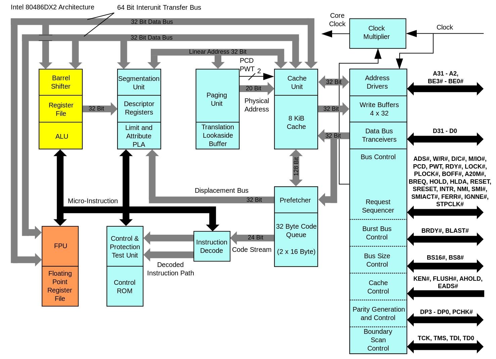
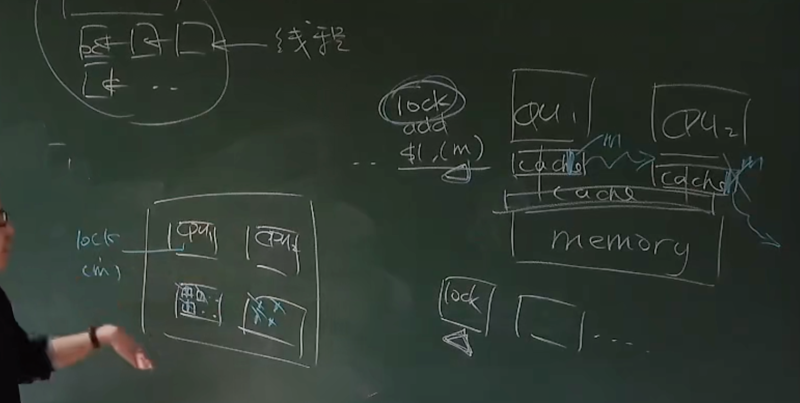
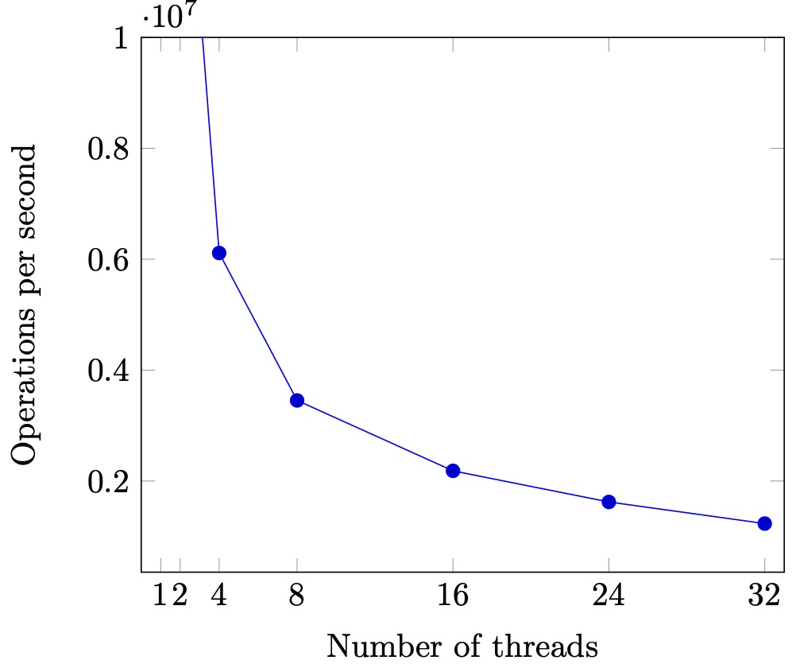

# 并发控制：互斥

## Overview

复习

- 状态机、状态机、状态机

------

本次课回答的问题

- **Q**: 如何在多处理器上实现线程互斥？

------

本次课主要内容

- 自旋锁的实现
- 互斥锁的实现

## 收获

### 1、如何在多处理器上实现线程互斥？

互斥 (mutual exclusion)，“互相排斥”

一把 “排他性” 的锁——对于锁对象 `lk`

- 如果某个线程持有锁，则其他线程的 `lock` 不能返回

实现互斥的根本困难：**不能同时读/写共享内存**

- 软件不够，硬件来凑 (自旋锁)
- 用户不够，内核来凑 (互斥锁)
  - **找到你依赖的假设，并大胆地打破它**
- Fast/slow paths: 性能优化的重要途径

### 2、自旋锁的实现

【这里看 6.s081 的课更好】

自旋锁的协议：有一把钥匙，放在桌子上，用一个东西和它交换，只有得到钥匙的人才可以进入临界区

借助一个指令 `lock xchg`，Atomic exchange (load + store) 实现互斥

这个原子指令的模型

- 保证之前的 store 都写入内存
- 保证 load/store 不与原子指令乱序

Lock 指令的现代实现，在 L1 cache 层保持一致性 (因为不同的核的L1 cache 是共享的)

- 相当于每个 cache line 有分别的锁
- store(x) 进入 L1 缓存即保证对其他处理器可见

**自旋锁缺点：性能问题**

- 自旋 (共享变量) 会触发处理器间的缓存同步，延迟增加
- 除了进入临界区的线程，其他处理器上的线程都在**空转**，争抢锁的处理器越多，利用率越低
- 获得自旋锁的线程**可能被操作系统切换出去**，操作系统不 “感知” 线程在做什么，100% 的资源浪费

**自旋锁的使用场景**

1. 临界区几乎不 “拥堵”（只有一个线程进入临界区）
2. 持有自旋锁时禁止执行流切换

但是应用程序做不到，只有操作系统可以

使用场景：**操作系统内核的并发数据结构 (短临界区)**，操作系统可以关闭中断和抢占，保证锁的持有者在很短的时间内可以释放锁


### 3、互斥锁的实现

自旋锁 (线程直接共享 locked)，更快的 fast path，xchg 成功 → 立即进入临界区，开销很小

睡眠锁 (通过系统调用访问 locked)，更快的 slow path，上锁失败线程不再占用 CPU

Futex 简易的实现（自旋锁和睡眠锁 结合），先在用户空间自旋

- 如果获得锁，直接进入
- 未能获得锁，系统调用
- 解锁以后也需要系统调用

Fast/slow paths: 性能优化的重要途径

## 一、共享内存上的互斥

### 1、回顾：并发编程

理解并发的工具

- 线程 = 人 (大脑能完成局部存储和计算)
- 共享内存 = 物理世界 (物理世界天生并行)
- 一切都是状态机

### 2、回顾：互斥算法

互斥 (mutual exclusion)，“互相排斥”

- 实现 `lock_t` 数据结构和 `lock/unlock` API:

```c
typedef struct {
  ...
} lock_t;
void lock(lock_t *lk);
void unlock(lock_t *lk);
```

------

一把 “排他性” 的锁——对于锁对象 `lk`

- 如果某个线程持有锁，则其他线程的 `lock` 不能返回

### 3、在共享内存上实现互斥

失败的尝试

- [mutex-bad.py](http://jyywiki.cn/pages/OS/2022/demos/mutex-bad.py)

------

(部分) 成功的尝试

- [peterson-barrier.c](http://jyywiki.cn/pages/OS/2022/demos/peterson-barrier.c)

------

实现互斥的根本困难：**不能同时读/写共享内存**

- load (环顾四周) 的时候不能写，只能 “看一眼就把眼睛闭上”
    - 看到的东西马上就过时了
- store (改变物理世界状态) 的时候不能读，只能 “闭着眼睛动手”
    - 也不知道把什么改成了什么
- 这是~~简单、粗暴 (稳定)、有效~~的《操作系统》课

## 二、自旋锁 (Spin Lock)

自旋锁：有一把钥匙，放在桌子上，用一个东西和它交换，只有得到钥匙的人才可以进入临界区

### 1、解决问题的两种方法

> 提出算法、解决问题 (Dekker/Peterson/...'s Protocols)

或者……

> 改变假设 (软件不够，硬件来凑)

------

**假设硬件能为我们提供一条 “瞬间完成” 的读 + 写指令**

- 请所有人闭上眼睛，看一眼 (load)，然后贴上标签 (store)
    - 如果多人同时请求，硬件选出一个 “胜者”
    - “败者” 要等 “胜者” 完成后才能继续执行

### 2、x86 原子操作：`LOCK` 指令前缀

例子：[`sum-atomic.c`](http://jyywiki.cn/pages/OS/2022/demos/sum-atomic.c)

- `sum = 200000000`

```c
#include "thread.h"

#define N 100000000

long sum = 0;

void Tsum() {
  for (int i = 0; i < N; i++) {
    asm volatile("lock addq $1, %0": "+m"(sum));
  }
}

int main() {
  create(Tsum);
  create(Tsum);
  join();
  printf("sum = %ld\n", sum);
}
```


```bash
# 有 lock 前缀
$ gcc sum-atomic.c -O2 -lpthread && ./a.out
sum = 200000000

# 去掉汇编中的 lock 前缀
$ gcc sum-atomic.c -O2 -lpthread && ./a.out
sum = 100916012
```


------

Atomic exchange (load + store)

xchg：两个数值交换

```c
int xchg(volatile int *addr, int newval) {
  int result;
  asm volatile ("lock xchg %0, %1"
    : "+m"(*addr), "=a"(result) : "1"(newval));
  return result;
}
```

更多的原子指令：[stdatomic.h](https://en.cppreference.com/w/cpp/header/stdatomic.h) (C11)

### 3、用 `xchg` 实现互斥

如何协调宿舍若干位同学上厕所问题？

- 在厕所门口放一个桌子 (共享变量)
    - 初始时，桌上是 🔑

------

实现互斥的协议

- 想上厕所的同学 (一条 xchg 指令)
    - 天黑请闭眼
    - 看一眼桌子上有什么 (🔑 或 🔞)
    - 把 🔞 放到桌上 (覆盖之前有的任何东西)
    - 天亮请睁眼；看到 🔑 才可以进厕所哦
- 出厕所的同学
    - 把 🔑 放到桌上

### 4、实现互斥：自旋锁

```c
int table = YES;

void lock() {
retry:
  int got = xchg(&table, NOPE);
  if (got == NOPE)
    goto retry;
  assert(got == YES);
}

void unlock() {
  xchg(&table, YES)
}
```

```c
int locked = 0;
void lock() { while (xchg(&locked, 1)) ; }
void unlock() { xchg(&locked, 0); }
```

并发编程：千万小心

- 做详尽的测试 (在此省略，你们做 Labs 就知道了)
- 尽可能地证明 ([model-checker.py](http://jyywiki.cn/pages/OS/2022/demos/model-checker.py) 和 [spinlock.py](http://jyywiki.cn/pages/OS/2022/demos/spinlock.py))

```python
class Spinlock:
    locked = ''

    @thread
    def t1(self):
        while True:
            while True:
                self.locked, seen = '🔒', self.locked
                if seen != '🔒': break
            cs = True
            del cs
            self.locked = ''

    @thread
    def t2(self):
        while True:
            while True:
                self.locked, seen = '🔒', self.locked
                if seen != '🔒': break
            cs = True
            del cs
            self.locked = ''

    @marker
    def mark_t1(self, state):
        if localvar(state, 't1', 'cs'): return 'blue'

    @marker
    def mark_t2(self, state):
        if localvar(state, 't2', 'cs'): return 'green'

    @marker
    def mark_both(self, state):
        if localvar(state, 't1', 'cs') and localvar(state, 't2', 'cs'):
            return 'red'

```

------

原子指令的模型

- 保证之前的 store 都写入内存
- 保证 load/store 不与原子指令乱序

### 5、原子指令的诞生：Bus Lock (80486)

486 (20-50MHz) 就支持 dual-socket 了



一个主板上有两个 CPU，都连着同一个 memory，有访问共享内存的场景

硬件上实现的锁

x86 体系结构中，缓存的一致性是个很大的包袱

所有 CPU 的 L1 cache 都是连起来的

一个 CPU 想要执行 lock，想要访问 M 的话，要把其他所有 CPU 的 M 踢出缓存



### 6、Lock 指令的现代实现

在 L1 cache 层保持一致性 (ring/mesh bus)

- 相当于每个 cache line 有分别的锁
- store(x) 进入 L1 缓存即保证对其他处理器可见
    - 但要小心 store buffer 和乱序执行

------

L1 cache line 根据状态进行协调

- M (Modified), 脏值
- E (Exclusive), 独占访问
- S (Shared), 只读共享
- I (Invalid), 不拥有 cache line

### 7、RISC-V: 另一种原子操作的设计

考虑常见的原子操作：

- atomic test-and-set
    - `reg = load(x); if (reg == XX) { store(x, YY); }`
- lock xchg
    - `reg = load(x); store(x, XX);`
- lock add
    - `t = load(x); t++; store(x, t);`

------

它们的本质都是：

1. load
2. exec (处理器本地寄存器的运算)
3. store

### 8、Load-Reserved/Store-Conditional (LR/SC)

【0:50:38】开始讲解 RISC-V 的指令

LR: 在内存上标记 reserved (盯上你了)，中断、其他处理器写入都会导致标记消除

```assembly
lr.w rd, (rs1)
  rd = M[rs1]
  reserve M[rs1]
```

------

SC: 如果 “盯上” 未被解除，则写入

```assembly
sc.w rd, rs2, (rs1)
  if still reserved:
    M[rs1] = rs2
    rd = 0
  else:
    rd = nonzero
```

### 9、Compare-and-Swap 的 LR/SC 实现

```c
int cas(int *addr, int cmp_val, int new_val) {
  int old_val = *addr;
  if (old_val == cmp_val) {
    *addr = new_val; return 0;
  } else { return 1; }
}
```

```assembly
cas:
  lr.w  t0, (a0)       # Load original value.
  bne   t0, a1, fail   # Doesn’t match, so fail.
  sc.w  t0, a2, (a0)   # Try to update.
  bnez  t0, cas        # Retry if store-conditional failed.
  li a0, 0             # Set return to success.
  jr ra                # Return.
fail:
  li a0, 1             # Set return to failure.
  jr ra                # Return
```

lr 和 sc 可以检查有没有人和我并发的在做这件事，fail 失败了，表示锁的拥堵

### 10、LR/SC 的硬件实现

BOOM (Berkeley Out-of-Order Processor)

- [riscv-boom](https://github.com/riscv-boom/riscv-boom)
    - [`lsu/dcache.scala`](https://github.com/riscv-boom/riscv-boom/blob/master/src/main/scala/lsu/dcache.scala#L655)
    - 留意 `s2_sc_fail` 的条件
        - s2 是流水线 Stage 2
    - (yzh 扒出的代码)


## 三、互斥锁 (Mutex Lock)

### 1、自旋锁的缺陷

性能问题 (0)

- 自旋 (共享变量) 会触发处理器间的缓存同步，延迟增加

------

性能问题 (1)

- 除了进入临界区的线程，其他处理器上的线程都在**空转**
- 争抢锁的处理器越多，利用率越低

------

性能问题 (2)

- 获得自旋锁的线程**可能被操作系统切换出去**
    - 操作系统不 “感知” 线程在做什么
    - (但为什么不能呢？)
- 实现 100% 的资源浪费

### 2、Scalability（伸缩性）: 性能的新维度

> 同一份计算任务，时间 (CPU cycles) 和空间 (mapped memory) 会随处理器数量的增长而变化。

- [sum-scalability.c](http://jyywiki.cn/pages/OS/2022/demos/sum-scalability.c)
- [thread-sync.h](http://jyywiki.cn/pages/OS/2022/demos/thread-sync.h)
    - 严谨的统计很难
        - CPU 动态功耗
        - 系统中的其他进程
        - ……
- [Benchmarking crimes](https://www.cse.unsw.edu.au/~gernot/benchmarking-crimes.html)

---

sum-scalability.c

```c
#include "thread.h"
#include "thread-sync.h"

#define N 10000000
spinlock_t lock = SPIN_INIT();

long n, sum = 0;

void Tsum() {
  for (int i = 0; i < n; i++) {
    spin_lock(&lock);
    sum++;
    spin_unlock(&lock);
  }
}

int main(int argc, char *argv[]) {
  assert(argc == 2);
  int nthread = atoi(argv[1]);
  n = N / nthread;
  for (int i = 0; i < nthread; i++) {
    create(Tsum);
  }
  join();
  assert(sum == n * nthread);
}

```

thread-sync.h

```c
#include <semaphore.h>

// Spinlock
typedef int spinlock_t;
#define SPIN_INIT() 0

static inline int atomic_xchg(volatile int *addr, int newval) {
  int result;
  asm volatile ("lock xchg %0, %1":
    "+m"(*addr), "=a"(result) : "1"(newval) : "memory");
  return result;
}

void spin_lock(spinlock_t *lk) {
  while (1) {
    intptr_t value = atomic_xchg(lk, 1);
    if (value == 0) {
      break;
    }
  }
}
void spin_unlock(spinlock_t *lk) {
  atomic_xchg(lk, 0);
}

// Mutex
typedef pthread_mutex_t mutex_t;
#define MUTEX_INIT() PTHREAD_MUTEX_INITIALIZER
void mutex_lock(mutex_t *lk)   { pthread_mutex_lock(lk); }
void mutex_unlock(mutex_t *lk) { pthread_mutex_unlock(lk); }

// Conditional Variable
typedef pthread_cond_t cond_t;
#define COND_INIT() PTHREAD_COND_INITIALIZER
#define cond_wait pthread_cond_wait
#define cond_broadcast pthread_cond_broadcast
#define cond_signal pthread_cond_signal

// Semaphore
#define P sem_wait
#define V sem_post
#define SEM_INIT(sem, val) sem_init(sem, 0, val)

```

测试一下

```bash
$ gcc sum-scalability.c -O2 -lpthread

$ time ./a.out 1
real	0m0.130s
user	0m0.123s
sys	0m0.003s

$ time ./a.out 2
real	0m0.760s
user	0m1.497s
sys	0m0.007s

$ time ./a.out 3
real	0m1.169s
user	0m3.462s
sys	0m0.015s

$ time ./a.out 32
real	0m9.258s
user	1m7.500s
sys	0m0.242s
```

同样的工作量，线程越多，效率越慢，为什么？

因为上面的三种性能问题



### 3、自旋锁的使用场景

1. 临界区几乎不 “拥堵”（只有一个线程进入临界区）
2. 持有自旋锁时禁止执行流切换

但是应用程序做不到

------

使用场景：**操作系统内核的并发数据结构 (短临界区)**

- 操作系统可以关闭中断和抢占
    - 保证锁的持有者在很短的时间内可以释放锁
- (如果是虚拟机呢...😂)
    - PAUSE 指令会触发 VM Exit
- 但依旧很难做好
    - [An analysis of Linux scalability to many cores](https://www.usenix.org/conference/osdi10/analysis-linux-scalability-many-cores) (OSDI'10)

### 4、实现线程 + 长临界区的互斥

> 作业那么多，与其干等 Online Judge 发布，不如把自己 (CPU) 让给其他作业 (线程) 执行？

“让” 不是 C 语言代码可以做到的 (C 代码只能计算)

- 把锁的实现放到操作系统里就好啦！

    - ```c
        syscall(SYSCALL_lock, &lk);
        ```

        - 试图获得 `lk`，但如果失败，就切换到其他线程

    - ```c
        syscall(SYSCALL_unlock, &lk);
        ```

        - 释放 `lk`，如果有等待锁的线程就唤醒

---

操作系统 = 更衣室管理员

- 先到的人 (线程)
    - 成功获得手环，进入游泳馆 
    - `*lk = 🔒`，系统调用直接返回
- 后到的人 (线程)
    - 不能进入游泳馆，排队等待
    - 线程放入等待队列，执行线程切换 (yield)
- 洗完澡出来的人 (线程)
    - 交还手环给管理员；管理员把手环再交给排队的人
    - 如果等待队列不空，从等待队列中取出一个线程允许执行
    - 如果等待队列为空，`*lk = ✅`
- **管理员 (OS) 使用自旋锁确保自己处理手环的过程是原子的**

## 四、Futex = Spin + Mutex

### 1、关于互斥的一些分析

自旋锁 (线程直接共享 locked)

- 更快的 fast path
    - xchg 成功 → 立即进入临界区，开销很小
- 更慢的 slow path
    - xchg 失败 → 浪费 CPU 自旋等待

------

睡眠锁 (通过系统调用访问 locked)

- 更快的 slow path
    - 上锁失败线程不再占用 CPU
- 更慢的 fast path
    - 即便上锁成功也需要进出内核 (syscall)

### 2、Futex: Fast Userspace muTexes

> 小孩子才做选择。我当然是全都要啦！

- Fast path: 一条原子指令，上锁成功立即返回
- Slow path: 上锁失败，执行系统调用睡眠
    - **性能优化的最常见技巧**
        - 看 average (frequent) case 而不是 worst case

------

POSIX 线程库中的互斥锁 (`pthread_mutex`)

- [sum-scalability.c](http://jyywiki.cn/pages/OS/2022/demos/sum-scalability.c)，换成 mutex
    - 观察系统调用 (strace)
    - gdb 调试
        - set scheduler-locking on, info threads, thread X

线程库中的锁，绝大多数情况下不会触发系统调用，原子指令就解决了

只有在有争抢的情况下，触发系统调用

---

```c
#include "thread.h"
#include "thread-sync.h"

#define N 10000000
mutex_t lock = MUTEX_INIT();

long n, sum = 0;

void Tsum() {
  for (int i = 0; i < n; i++) {
    mutex_lock(&lock);
    sum++;
    mutex_unlock(&lock);
  }
}

int main(int argc, char *argv[]) {
  assert(argc == 2);
  int nthread = atoi(argv[1]);
  n = N / nthread;
  for (int i = 0; i < nthread; i++) {
    create(Tsum);
  }
  join();
  assert(sum == n * nthread);
}

```

测试一下

```bash
$ time ./a.out 1
real	0m0.203s
user	0m0.196s
sys	0m0.004s

$ time ./a.out 2
real	0m0.432s
user	0m0.331s
sys	0m0.374s

$ time ./a.out 3
real	0m0.552s
user	0m0.472s
sys	0m0.895s

$ time ./a.out 32
real	0m0.609s
user	0m0.706s
sys	0m3.881s

# -f 看到子进程的系统调用
$ strace -f ./a.out 32

```

### 3、Futex 简易的实现

先在用户空间自旋

- 如果获得锁，直接进入
- 未能获得锁，系统调用
- 解锁以后也需要系统调用
    - [futex.py](http://jyywiki.cn/pages/OS/2022/demos/futex.py)
    - 更好的设计可以在 fast-path 不进行系统调用

```python
class Futex:
    locked, waits = '', ''

    def tryacquire(self):
        if not self.locked:
            # Test-and-set (cmpxchg, x86)
            # Same effect, but more efficient than xchg
            self.locked = '🔒'
            return ''
        else:
            return '🔒'

    def release(self):
        if self.waits:
            self.waits = self.waits[1:]
        else:
            self.locked = ''

    @thread
    def t1(self):
        while True:
            if self.tryacquire() == '🔒':     # User, 不能获得锁的话，进内核
                self.waits = self.waits + '1' # Kernel
                while '1' in self.waits:      # Kernel
                    pass
            cs = True                         # User
            del cs                            # User
            self.release()                    # Kernel

    @thread
    def t2(self):
        while True:
            if self.tryacquire() == '🔒':
                self.waits = self.waits + '2'
                while '2' in self.waits:
                    pass
            cs = True
            del cs
            self.release()

    @thread
    def t3(self):
        while True:
            if self.tryacquire() == '🔒':
                self.waits = self.waits + '3'
                while '3' in self.waits:
                    pass
            cs = True
            del cs
            self.release()

    @marker
    def mark_t1(self, state):
        if localvar(state, 't1', 'cs'): return 'blue'

    @marker
    def mark_t2(self, state):
        if localvar(state, 't2', 'cs'): return 'green'

    @marker
    def mark_t3(self, state):
        if localvar(state, 't3', 'cs'): return 'yellow'

    @marker
    def mark_both(self, state):
        count = 0
        for t in ['t1', 't2', 't3']:
            if localvar(state, t, 'cs'):
                count += 1
        if count > 1:
            return 'red'

```


------

RTFM (劝退)

- futex (7), futex (2)
- [A futex overview and update](https://lwn.net/Articles/360699/) (LWN)
- [Futexes are tricky](http://jyywiki.cn/pages/OS/manuals/futexes-are-tricky.pdf) (论 model checker 的重要性)
- (我们不讲并发算法)

### 4、如何解决状态空间里的bug

如果状态空间里面有bug（红色的节点）,如何解决？

找一条从根节点到到红色节点的路径，上下文切换最少的路径（红红白白最少的路径），这就是最易理解的路径

这也找到一个最易理解的反例

## 总结

本次课回答的问题

- **Q**: 如何在多处理器系统上实现互斥？

------

Take-away message

- 软件不够，硬件来凑 (自旋锁)
- 用户不够，内核来凑 (互斥锁)
    - **找到你依赖的假设，并大胆地打破它**
- Fast/slow paths: 性能优化的重要途径