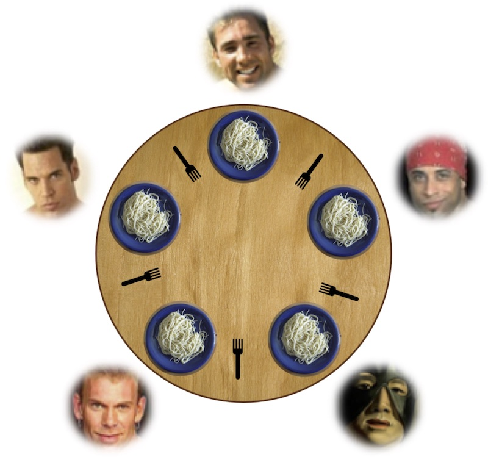

# 并发控制：同步

## Overview

复习

- 互斥：自旋锁、互斥锁、futex
- ~~是时候面对真正的并发编程了~~

------

本次课回答的问题

- **Q**: 如何在多处理器上协同多个线程完成任务？

------

本次课主要内容

- 典型的同步问题：生产者-消费者；哲学家吃饭（99%的问题）
- 同步的实现方法：信号量、条件变量

## 收获

### 1、同步

两个或两个以上随时间变化的量在变化过程中保持一定的相对关系

同步就是两个人约定好，先到的人等，等另一个人也结束，就在那个时刻，达到相互知道的状态

### 2、如何在多处理器上协同多个线程完成任务？

使用万能的条件变量，可以解决生产者和消费者，把一个大任务通过计算图的方式拆成小任务，就可以并行任何算法

**实现同步的方法**

- 条件变量、信号量；生产者-消费者问题
- Job queue 可以实现几乎任何并行算法

不要 “自作聪明” 设计算法，小心求证

### 3、典型的同步问题：生产者-消费者；哲学家吃饭（99%的问题）

哲学家 (线程) 有时思考，有时吃饭

- 吃饭需要同时得到左手和右手的叉子
- 当叉子被其他人占有时，必须等待，如何完成同步？

万能的方法，条件变量

```c
mutex_lock(&mutex);                    // 先上一把互斥锁，你们都别动
while (!(avail[lhs] && avail[rhs])) {  // 左右手边的叉子都在的话退出循环
    wait(&cv, &mutex);                 // 有不在的话，等待，把锁释放掉
}
avail[lhs] = avail[rhs] = false;  // 在锁的保护下，把两个叉子都拿起来
mutex_unlock(&mutex);             // 就可以把锁释放掉，就可以开始吃饭了

mutex_lock(&mutex);              // 花了足够长的时间吃完饭后，把锁再上上
avail[lhs] = avail[rhs] = true;  // 把叉子还回去
broadcast(&cv);                  // 把其他可能还在等叉子的人唤醒
mutex_unlock(&mutex);            // 锁释放掉
```

### 4、同步的实现方法：条件变量

听课，一知半解

算法核心：需要**等待条件满足时**，再往下执行，负责就等待（而且把锁释放掉）

### 5、同步的实现方法：信号量

听了，但也没听

信号量设计的重点，考虑 “手环” (每一单位的 “**资源**”) 是什么，谁创造？谁获取？

### 6、忘了信号量，让一个人集中管理叉子吧！

“Leader/follower” - 生产者/消费者

- 分布式系统中非常常见的解决思路 (HDFS, ...)

自主的同步算法，分布式的同步，每个人都要试一试，大家遵守同一个协议，难

集中式的算法（master-slave），远比分布式的算法容易理解，容易弄对，更灵活的调度，有优先级

## 一、线程同步

### 1、同步 (Synchronization)

两个或两个以上随时间变化的量在变化过程中保持一定的相对关系

- iPhone/iCloud 同步 (手机 vs 电脑 vs 云端)
- 变速箱同步器 (合并快慢速齿轮)
- 同步电机 (转子与磁场速度一致)
- 同步电路 (所有触发器在边沿同时触发)

------

异步 (Asynchronous) = 不同步

- 上述很多例子都有异步版本 (异步电机、异步电路、异步线程)

### 2、并发程序中的同步

并发程序的步调很难保持 “完全一致”

- 线程同步：**在某个时间点共同达到互相已知的状态**

再次把线程想象成我们自己

- NPY：等我洗个头就出门/等我打完这局游戏就来
- 舍友：等我修好这个 bug 就吃饭
- 导师：等我出差回来就讨论这个课题
- jyy：~~等我成为卷王就躺平~~
    - “先到先等”

同步就是两个人约定好，先到的人等，等另一个人也结束，就在那个时刻，达到相互知道的状态

### 3、生产者-消费者问题：学废你就赢了

**99% 的实际并发问题都可以用生产者-消费者解决**。

```c
void Tproduce() { while (1) printf("("); }
void Tconsume() { while (1) printf(")"); }
```

在 `printf` 前后增加代码，使得打印的括号序列满足

- 一定是某个合法括号序列的前缀
- 括号嵌套的深度不超过n
    - n=3, `((())())(((...` 合法
    - n=3, `(((())))`, `(()))` 不合法
- 同步
    - 等到有空位再打印左括号
    - 等到能配对时再打印右括号

### 4、生产者-消费者问题：分析

为什么叫 “生产者-消费者” 而不是 “括号问题”？

- 左括号：生产资源 (任务)、放入「队列」
- 右括号：从「队列」取出资源 (任务) 执行

------

能否用互斥锁实现括号问题？

- 左括号：嵌套深度 (队列) 不足 n 时才能打印
- 右括号：嵌套深度 (队列) >1 时才能打印
    - **当然是等到满足条件时再打印了**：[pc.c](http://jyywiki.cn/pages/OS/2022/demos/pc.c)
        - **用互斥锁保持条件成立**
    - 压力测试的检查当然不能少：[pc-check.py](http://jyywiki.cn/pages/OS/2022/demos/pc-check.py)
    - Model checker 当然也不能少 (留作习题)

---

pc.c

```c
#include "thread.h"
#include "thread-sync.h"

int n, count = 0;
mutex_t lk = MUTEX_INIT();

void Tproduce() {
  while (1) {
retry:
    mutex_lock(&lk);
    if (count == n) { // 包已经满了
      mutex_unlock(&lk);
      goto retry;
    }
    count++;
    printf("(");
    mutex_unlock(&lk);
  }
}

void Tconsume() {
  while (1) {
retry:
    mutex_lock(&lk);
    if (count == 0) { // 包是空的
      mutex_unlock(&lk);
      goto retry;
    }
    count--;
    printf(")");
    mutex_unlock(&lk);
  }
}

int main(int argc, char *argv[]) {
  assert(argc == 2);
  n = atoi(argv[1]);
  setbuf(stdout, NULL);
  for (int i = 0; i < 8; i++) {
    create(Tproduce);
    create(Tconsume);
  }
}

```

pc-check.py

```python
import sys

limit = int(sys.argv[1])
count, n = 0, 100000
while True:
    for ch in sys.stdin.read(n):
        if ch == '(': count += 1
        if ch == ')': count -= 1
        assert 0 <= count <= limit
    print(f'{n} Ok.')

```

做测试：

```bash
$ gcc pc.c -O2 -lpthread
$ ./a.out 1 | python3 pc-check.py 1
100000 Ok.
100000 Ok.
100000 Ok.
100000 Ok.
```

但是有可能几分钟后才出现错误，不过就很难调了

## 二、条件变量：万能同步方法

### 1、同步问题：分析

任何同步问题都有**先来先等待的条件**。

线程 join ([thread.h](http://jyywiki.cn/pages/OS/2022/demos/thread.h), [sum.c](http://jyywiki.cn/pages/OS/2022/demos/sum.c))

- 等所有线程结束后继续执行，否则等待

------

NPY 的例子

- 打完游戏且洗完头后继续执行 `date()`，否则等待

------

生产者/消费者问题

- 左括号：深度 k<n 时 `printf`，否则等待
- 右括号：k>0时`printf`，否则等待
    - 再看一眼 [pc.c](http://jyywiki.cn/pages/OS/2022/demos/pc.c)

### 2、Conditional Variables (条件变量, CV)

把 [pc.c](http://jyywiki.cn/pages/OS/2022/demos/pc.c) 中的自旋变成睡眠

- 在完成操作时唤醒

------

条件变量 API

- wait(cv, mutex) 💤
    - 调用时必须保证已经获得 mutex
    - 释放 mutex、进入睡眠状态
- signal/notify(cv) 💬 私信：走起
    - 如果有线程正在等待 cv，则唤醒其中一个线程
- broadcast/notifyAll(cv) 📣 所有人：走起
    - 唤醒全部正在等待 cv 的线程

### 3、条件变量：实现生产者-消费者

```c
void Tproduce() {
  mutex_lock(&lk);
  if (count == n) cond_wait(&cv, &lk);
  printf("("); count++; cond_signal(&cv);
  mutex_unlock(&lk);
}

void Tconsume() {
  mutex_lock(&lk);
  if (count == 0) cond_wait(&cv, &lk);
  printf(")"); count--; cond_signal(&cv);
  mutex_unlock(&lk);
}
```

压力测试：[pc-cv.c](http://jyywiki.cn/pages/OS/2022/demos/pc-cv.c)；模型检验：[pc-cv.py](http://jyywiki.cn/pages/OS/2022/demos/pc-cv.py)

- (Small scope hypothesis)

---

pc-cv.c

```c
#include "thread.h"
#include "thread-sync.h"

int n, count = 0;
mutex_t lk = MUTEX_INIT();
cond_t cv = COND_INIT();

void Tproduce() {
  while (1) {
    mutex_lock(&lk);
    if (count == n) {
      cond_wait(&cv, &lk);
    }
    printf("("); count++;
    cond_signal(&cv);
    mutex_unlock(&lk);
  }
}

void Tconsume() {
  while (1) {
    mutex_lock(&lk);
    if (count == 0) {
      pthread_cond_wait(&cv, &lk);
    }
    printf(")"); count--;
    cond_signal(&cv);
    mutex_unlock(&lk);
  }
}

int main(int argc, char *argv[]) {
  assert(argc == 2);
  n = atoi(argv[1]);
  setbuf(stdout, NULL);
  for (int i = 0; i < 8; i++) {
    create(Tproduce);
    create(Tconsume);
  }
}

```

```bash
gcc pc-cv.c -lpthread && ./a.out 1 | head -c 512
# 输出显示上面的 pc-cv.c 算法是有问题的
# 在有一个生产者、消费者的时候没问题，多个的时候出现问题
```

pc-cv.py

```python
class ProducerConsumer:
    locked, count, log, waits = '', 0, '', ''

    def tryacquire(self):
        self.locked, seen = '🔒', self.locked
        return seen == ''

    def release(self):
        self.locked = ''

    @thread
    def tp(self):
        for _ in range(2):
            while not self.tryacquire(): pass # mutex_lock()

            if self.count == 1:
                # cond_wait
                _, self.waits = self.release(), self.waits + '1'
                while '1' in self.waits: pass
                while not self.tryacquire(): pass

            self.log, self.count = self.log + '(', self.count + 1
            self.waits = self.waits[1:] # cond_signal
            self.release() # mutex_unlock()

    @thread
    def tc1(self):
        while not self.tryacquire(): pass

        if self.count == 0:
            _, self.waits = self.release(), self.waits + '2'
            while '2' in self.waits: pass
            while not self.tryacquire(): pass

        self.log, self.count = self.log + ')', self.count - 1

        self.waits = self.waits[1:]
        self.release()

    @thread
    def tc2(self):
        while not self.tryacquire(): pass

        if self.count == 0:
            _, self.waits = self.release(), self.waits + '3'
            while '3' in self.waits: pass
            while not self.tryacquire(): pass

        self.log, self.count = self.log + ')', self.count - 1

        self.waits = self.waits[1:]
        self.release()

    @marker
    def mark_negative(self, state):
        count = 0
        for ch in self.log:
            if ch == '(': count += 1
            if ch == ')': count -= 1
            if count < 0: return 'red'

```

model checker 测试

```bash
$ python3 model-checker.py pc-cv.py > a.txt
```

### 4、条件变量：正确的打开方式

需要**等待条件满足时**

```c
mutex_lock(&mutex);
while (!cond) {
  wait(&cv, &mutex);
}
assert(cond);
// ...
// 互斥锁保证了在此期间条件 cond 总是成立
// ...
mutex_unlock(&mutex);
```

**其他线程条件可能被满足时**

```c
broadcast(&cv);
```

- 修改 [pc-cv.c](http://jyywiki.cn/pages/OS/2022/demos/pc-cv.c) 和 [pc-cv.py](http://jyywiki.cn/pages/OS/2022/demos/pc-cv.py)

### 5、条件变量：实现并行计算

```c
struct job {
  void (*run)(void *arg);
  void *arg;
}

while (1) {
  struct job *job;

  mutex_lock(&mutex);
  while (! (job = get_job()) ) {
    wait(&cv, &mutex);
  }
  mutex_unlock(&mutex);

  job->run(job->arg); // 不需要持有锁
                      // 可以生成新的 job
                      // 注意回收分配的资源
}
```

### 6、条件变量：更古怪的习题/面试题

有三种线程，分别打印 `<`, `>`, 和 `_`

- 对这些线程进行同步，使得打印出的序列总是 `<><_` 和 `><>_` 组合

------

使用条件变量，只要回答三个问题：

- 打印 “`<`” 的条件？
- 打印 “`>`” 的条件？
- 打印 “_” 的条件？
    - [fish.c](http://jyywiki.cn/pages/OS/2022/demos/fish.c)

## 三、信号量

### 1、复习：互斥锁和更衣室管理

操作系统 = 更衣室管理员

- 先到的人 (线程)
    - 成功获得手环，进入游泳馆 
    - `*lk = 🔒`，系统调用直接返回
- 后到的人 (线程)
    - 不能进入游泳馆，排队等待
    - 线程放入等待队列，执行线程切换 (yield)
- 洗完澡出来的人 (线程)
    - 交还手环给管理员；管理员把手环再交给排队的人
    - 如果等待队列不空，从等待队列中取出一个线程允许执行
    - 如果等待队列为空，`*lk = ✅`
- **管理员 (OS) 使用自旋锁确保自己处理手环的过程是原子的**

### 2、更衣室管理

完全没有必要限制手环的数量——让更多同学可以进入更衣室

- 管理员可以持有任意数量的手环 (更衣室容量上限)
    - 先进入更衣室的同学先得到
    - 手环用完后才需要等同学出来

### 3、更衣室管理 (by E.W. Dijkstra)

做一点扩展——线程可以任意 “变出” 一个手环

- 把手环看成是令牌
- 得到令牌的可以进入执行
- 可以随时创建令牌

------

“手环” = “令牌” = “一个资源” = “信号量” (semaphore)

- P(&sem) - prolaag = try + decrease; wait; down; in
    - 等待一个手环后返回
    - 如果此时管理员手上有空闲的手环，立即返回
- V(&sem) - verhoog = increase; post; up; out
    - 变出一个手环，送给管理员
- 信号量的行为建模: [sem.py](http://jyywiki.cn/pages/OS/2022/demos/sem.py)

```python
class Semaphore:
    token, waits = 1, ''

    # 拓展了互斥锁（只有一个钥匙），这里 token 是个计数器
    # P 试图去获取一把钥匙，剩下的钥匙（token）大于0，就可以减一，
    # 否则放入等待的队列里，等待别人唤醒自己
    def P(self, tid):
        if self.token > 0:
            self.token -= 1
            return True
        else:
            self.waits = self.waits + tid
            return False
	
    # V 变出一把钥匙，如果有人在等这个钥匙，会唤醒一个正在等待的线程
    # 如果没有人在等的话，把钥匙交给管理员
    def V(self):
        if self.waits:
            self.waits = self.waits[1:]
        else:
            self.token += 1

    @thread
    def t1(self):
        self.P('1')
        while '1' in self.waits: pass
        cs = True
        del cs
        self.V()

    @thread
    def t2(self):
        self.P('2')
        while '2' in self.waits: pass
        cs = True
        del cs
        self.V()

    @marker
    def mark_t1(self, state):
        if localvar(state, 't1', 'cs'): return 'blue'

    @marker
    def mark_t2(self, state):
        if localvar(state, 't2', 'cs'): return 'green'

    @marker
    def mark_both(self, state):
        if localvar(state, 't1', 'cs') and localvar(state, 't2', 'cs'):
            return 'red'

```

### 4、信号量：实现生产者-消费者

信号量设计的重点

- 考虑 “手环” (每一单位的 “**资源**”) 是什么，谁创造？谁获取？
    - [`pc-sem.c`](http://jyywiki.cn/pages/OS/2022/demos/pc-sem.c)

```c
void producer() {
  P(&empty);   // P()返回 -> 得到手环
  printf("("); // 假设线程安全
  V(&fill);
}
void consumer() {
  P(&fill);
  printf(")");
  V(&empty);
}
```

- 在 “一单位资源” 明确的问题上更好用

```c
#include "thread.h"
#include "thread-sync.h"

sem_t fill, empty;

void producer() {
  while (1) {
    P(&empty);
    printf("(");
    V(&fill);
  }
}

void consumer() {
  while (1) {
    P(&fill);
    printf(")");
    V(&empty);
  }
}

int main(int argc, char *argv[]) {
  assert(argc == 2);
  SEM_INIT(&fill, 0);
  SEM_INIT(&empty, atoi(argv[1]));
  for (int i = 0; i < 8; i++) {
    create(producer);
    create(consumer);
  }
}

```

## 四、哲学家吃饭问题

### 1、哲学家吃饭问题 (E. W. Dijkstra, 1960)

哲学家 (线程) 有时思考，有时吃饭

- 吃饭需要同时得到左手和右手的叉子
- 当叉子被其他人占有时，必须等待，如何完成同步？
    - 如何用互斥锁/信号量实现？



### 2、失败与成功的尝试

失败的尝试，死锁

- [philosopher.c](http://jyywiki.cn/pages/OS/2022/demos/philosopher.c) (如何解决？)

```c
#include "thread.h"
#include "thread-sync.h"

#define N 3
sem_t locks[N];

// 所有人都先拿左手的叉子
void Tphilosopher(int id) {
  int lhs = (N + id - 1) % N;
  int rhs = id % N;
  while (1) {
    P(&locks[lhs]);
    printf("T%d Got %d\n", id, lhs + 1);
    P(&locks[rhs]);
    printf("T%d Got %d\n", id, rhs + 1);
    V(&locks[lhs]);
    V(&locks[rhs]);
  }
}

int main(int argc, char *argv[]) {
  for (int i = 0; i < N; i++) {
      SEM_INIT(&locks[i], 1);
  }
  for (int i = 0; i < N; i++) {
    create(Tphilosopher);
  }
}

```

成功的尝试 (万能的方法，条件变量)

```c
mutex_lock(&mutex);                    // 先上一把互斥锁，你们都别动
while (!(avail[lhs] && avail[rhs])) {  // 左右手边的叉子都在的话退出循环
    wait(&cv, &mutex);                 // 有不在的话，等待，把锁释放掉
}
avail[lhs] = avail[rhs] = false;  // 在锁的保护下，把两个叉子都拿起来
mutex_unlock(&mutex);             // 就可以把锁释放掉，就可以开始吃饭了

mutex_lock(&mutex);              // 花了足够长的时间吃完饭后，把锁再上上
avail[lhs] = avail[rhs] = true;  // 把叉子还回去
broadcast(&cv);                  // 把其他可能还在等叉子的人唤醒
mutex_unlock(&mutex);            // 锁释放掉
```

### 3、忘了信号量，让一个人集中管理叉子吧！

“Leader/follower” - 生产者/消费者

- 分布式系统中非常常见的解决思路 (HDFS, ...)

```c
void Tphilosopher(int id) {
  send_request(id, EAT);
  P(allowed[id]); // waiter 会把叉子递给哲学家
  philosopher_eat();
  send_request(id, DONE);
}

void Twaiter() {
  while (1) {
    (id, status) = receive_request();
    if (status == EAT) { ... }
    if (status == DONE) { ... }
  }
}
```

---

第 2 节：自主的同步算法，分布式的同步，每个人都要试一试，大家遵守同一个协议

第 3 节：集中式的算法（master-slave），远比分布式的算法容易理解，容易弄对，更灵活的调度，有优先级

### 4、忘了那些复杂的同步算法吧！

你可能会觉得，管叉子的人是性能瓶颈

- 一大桌人吃饭，每个人都叫服务员的感觉
- Premature optimization is the root of all evil (D. E. Knuth)

------

在你对这个系统，到底这个瓶颈在哪里了解之前，不要做任何的优化

**抛开 workload 谈优化就是耍流氓**

- 吃饭的时间通常远远大于请求服务员的时间
- 如果一个 manager 搞不定，可以分多个 (fast/slow path)
    - 把系统设计好，使集中管理不成为瓶颈
        - [Millions of tiny databases](https://www.usenix.org/conference/nsdi20/presentation/brooker) (NSDI'20)

## 总结

本次课回答的问题

- **Q**: 如何在多处理器上协同多个线程完成任务？

使用万能的条件变量，可以解决生产者和消费者，把一个大任务通过计算图的方式拆成小任务

就可以并行任何算法

------

Take-away message

- 实现同步的方法
    - 条件变量、信号量；生产者-消费者问题
    - Job queue 可以实现几乎任何并行算法
- 不要 “自作聪明” 设计算法，小心求证