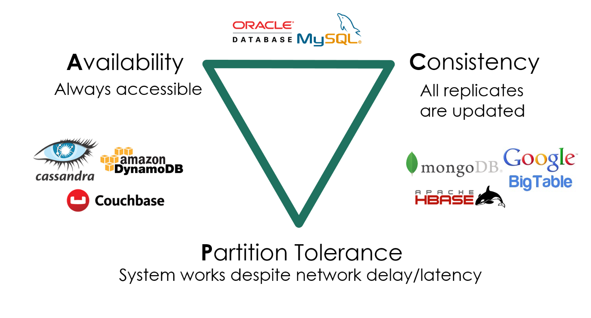

# 真实世界的并发编程

## Overview

复习

- 并发编程的基本工具：线程库、互斥和同步

------

本次课回答的问题

- **Q**: 什么样的任务是需要并行/并发的？它们应该如何实现？

------

本次课主要内容

- 高性能计算中的并发编程
- 数据中心里的并发编程
- 我们身边的并发编程

## 收获

### 1、什么样的任务是需要并行/并发的？它们应该如何实现？

讲了三种真正的并发程序是怎么写的，高性能计算注重的是任务的分解，本质上还是生产者和消费者；数据中心，注重的存储，意味着系统调用，通过协程线程解决；写人机交互的前端，注重的是代码的维护性。

都可以用线程来实现

- 并发编程的真实应用场景
    - 高性能计算 (注重任务分解): 生产者-消费者 (MPI/OpenMP)
    - 数据中心 (注重系统调用): 线程-协程 (Goroutine)
    - 人机交互 (注重易用性): 事件-流图 (Promise)
- 编程工具的发展突飞猛进
    - 自 Web 2.0 以来，开源社区改变了计算机科学的学习方式

### 2、线程、协程、Goroutine

一个线程是c语言编译成汇编的状态机，然后状态机每走一部需要执行一条指令

从一个状态机切换到另一个状态机，那么就需要保存所有的寄存器，x86的话 abcd sidi pbst r8 r9 十六的寄存器，还有系统寄存器 pc，就很大的开销了；然后还要到内核里兜一圈，然后选择下个要执行的线程，把这个线程里的信息恢复到寄存器里，还要涉及地址空间的变化

因此，线程切换的开销很大

---

协程，很少的切换，但是会造成线程的阻塞

在数据中心里面，创建一个线程，许多协程的话，面临的问题：如果有一个协程 block 了（等磁盘或者等网络，向另一个服务器情况，可能100ms 才能回来），其他协程的cpu就被浪费掉了

---

> Go: 小孩子才做选择，多处理器并行和轻量级并发我全都要！

Goroutine: 概念上是线程，实际是线程和协程的混合体

- 每个 CPU 上有一个 Go Worker，自由调度 goroutines
- 执行到 blocking API 时 (例如 sleep, read)
    - Go Worker 偷偷改成 non-blocking 的版本
        - 成功 → 立即继续执行
        - 失败 → 立即 yield 到另一个需要 CPU 的 goroutine
            - 太巧妙了！CPU 和操作系统全部用到 100%

每个CPU上都绑定一个线程，每个线程又有多个协程，有个很巧妙的设计（上课笔记）：

- 如果一个协程 read() 的时候，线程会阻塞的嘛，
- 然后他就把阻塞的 read() 系统调用替换成不阻塞的系统调用（scanf printf 都是阻塞的，linux 中都有相对应不阻塞的）
- 其实就是 read() 替换成 read_non_block()
- 如果这个 read_non_block() 没有返回的话，会立即切换到线程下的另一个协程执行
- 直到有一天数据回来了，read_non_block的协程会被标记为可执行的

相当于，当协程想做一件耗时的事情的时候，告诉操作系统，我要做这件事了，你等等，然后马上切换到另一个协程运行

## 一、高性能计算中的并发编程

### 1、高性能计算程序：特点

> “A technology that harnesses the power of supercomputers or computer clusters to solve complex problems requiring massive computation.” (IBM)

以计算为中心

- 系统模拟：天气预报、能源、分子生物学
- 人工智能：神经网络训练
- 矿厂：纯粹的 hash 计算
- [HPC-China 100](http://www.hpc100.cn/top100/20/)

### 2、高性能计算：主要挑战

计算任务如何分解

- 计算图需要容易并行化
    - 机器-线程两级任务分解
- 生产者-消费者解决一切
    - [MPI](https://hpc-tutorials.llnl.gov/mpi/) - “a specification for the developers and users of message passing libraries”, [OpenMP](https://www.openmp.org/) - “multi-platform shared-memory parallel programming in C/C++ and Fortran”
- [Parallel and Distributed Computation: Numerical Methods](https://web.mit.edu/dimitrib/www/pdc.html)

真正想学高性能计算的话，看完上面👆这本书就可以了

- 告诉了我们怎么去求线性方程组，线性规划这类重要的数学问题
- 模拟宏观世界就是有限元，模拟微观世界就是量子
- 在超级计算机里解决这些问题的方法就这些

------

线程间如何通信

- 通信不仅发生在节点/线程之间，还发生在任何共享内存访问
- 还记得被 [mem-ordering.c](http://jyywiki.cn/pages/OS/2022/demos/mem-ordering.c) 支配的恐惧吗？

---

高性能计算主要靠「并行化」，能够并行化的前提是这个总任务可以「分解」，子任务各自独立的跑在线程中，不过子任务可能也要进行一些交互，会涉及线程间通信

### 3、例子：Mandelbrot Set


- [mandelbrot.c](http://jyywiki.cn/pages/OS/2022/demos/mandelbrot.c) (embarrassingly parallel)

```c
#include "thread.h"
#include <math.h>

int NT;
#define W 6400
#define H 6400
#define IMG_FILE "mandelbrot.ppm"

static inline int belongs(int x, int y, int t) {
  return x / (W / NT) == t;
}

int x[W][H];
int volatile done = 0;

// 生成图片的算法 ppm
void display(FILE *fp, int step) { 
  static int rnd = 1;
  int w = W / step, h = H / step;
  // STFW: Portable Pixel Map
  fprintf(fp, "P6\n%d %d 255\n", w, h);
  for (int j = 0; j < H; j += step) {
    for (int i = 0; i < W; i += step) {
      int n = x[i][j];
      int r = 255 * pow((n - 80) / 800.0, 3);
      int g = 255 * pow((n - 80) / 800.0, 0.7);
      int b = 255 * pow((n - 80) / 800.0, 0.5);
      fputc(r, fp); fputc(g, fp); fputc(b, fp);
    }
  }
}

void Tworker(int tid) {
  for (int i = 0; i < W; i++)
    for (int j = 0; j < H; j++)
      if (belongs(i, j, tid - 1)) {
        double a = 0, b = 0, c, d;
        while ((c = a * a) + (d = b * b) < 4 && x[i][j]++ < 880) {
          b = 2 * a * b + j * 1024.0 / H * 8e-9 - 0.645411;
          a = c - d + i * 1024.0 / W * 8e-9 + 0.356888;
        }
      }
  done++;
}

void Tdisplay() {
  float ms = 0;
  while (1) {
    // FILE *fp = popen("viu -", "w"); assert(fp); // 没装viu的话可以注掉
    // display(fp, W / 256);
    // pclose(fp);
    if (done == NT) break;
    usleep(1000000 / 5);
    ms += 1000.0 / 5;
  }
  printf("Approximate render time: %.1lfs\n", ms / 1000);

  FILE *fp = fopen(IMG_FILE, "w"); assert(fp);
  display(fp, 2);
  fclose(fp);
}

int main(int argc, char *argv[]) {
  assert(argc == 2);
  NT = atoi(argv[1]);
  for (int i = 0; i < NT; i++) {
    create(Tworker);
  }
  create(Tdisplay);
  join();
  return 0;
}

```

```bash
$ gcc mandelbrot.c -lpthread -lm -O2

# 得安装 viu，不装的话注释掉那三行
$ ./a.out 4
Approximate render time: 8.2s

# 可以转格式打开，也可以直接打开ppm
$ convert mandelbrot.ppm a.jpg
$ open mandelbrot.ppm
```


## 二、数据中心里的并发编程

### 1、数据中心程序：特点

> “A network of compu ting and storage resources that enable the delivery of shared applications and data.” (CISCO)

以数据 (存储) 为中心

- 从互联网搜索 (Google)、社交网络 (Facebook/Twitter) 起家
- 支撑各类互联网应用：微信/QQ/支付宝/游戏/网盘/……

------

算法/系统对 HPC 和数据中心的意义

- 你有 1,000,000 台服务器
- 如果一个算法/实现能快 1%，就能省 10,000 台服务器
  - 参考：对面一套房 ≈ 50 台服务器 (不计运维成本)

### 2、数据中心：主要挑战

**多副本情况下的高可靠、低延迟数据访问**

- 在服务海量地理分布请求的前提下
  - 数据要保持一致 (Consistency)
  - 服务时刻保持可用 (Availability)
  - 容忍机器离线 (Partition tolerance)



### 3、这门课的问题：如何用好一台计算机？

如何用一台 (可靠的) 计算机尽可能多地服务并行的请求

- 关键指标：QPS, tail latency, ...

------

我们有的工具

- 线程 (threads)

```
thread(start = true) {
  println("${Thread.currentThread()} has run.")
}
```

**线程切换是有代价的**，切换的时候做了什么

一个线程是c语言编译成汇编的状态机，然后状态机每走一部需要执行一条指令

从一个状态机切换到另一个状态机，那么就需要保存所有的寄存器，x86的话 abcd sidi pbst r8 r9 十六的寄存器，还有系统寄存器 pc，就很大的开销了；然后还要到内核里兜一圈，然后选择下个要执行的线程，把这个线程里的信息恢复到寄存器里，还要涉及地址空间的变化

---

【00:53:00】讲协程，得做实验，在 c 代码中实现协程，代价比线程切换小的多

- 协程 (coroutines)
  - 多个可以保存/恢复的执行流 ([M2 - libco](http://jyywiki.cn/OS/2022/labs/M2))
  - 比线程更轻量 (完全没有系统调用，也就没有操作系统状态)

co_yield() 会被翻译成 call co_yield 指令，在函数调用的时候，不是所有的东西都一定要保存

听老师讲：1、不用进入操作系统内核兜一圈；2、保存的寄存器少的多

### 4、数据中心：协程和线程

数据中心

- 同一时间有数千/数万个请求到达服务器
- 计算部分
  - 需要利用好多处理器
    - 线程 → 这就是我擅长的 (Mandelbrot Set)
    - 协程 → 一人出力，他人摸鱼
- I/O 部分
  - 会在系统调用上 block (例如请求另一个服务或读磁盘)
    - 协程 → 一人干等，他人围观。如果协程遇到 read()，线程整个阻塞了，又变成线程了
    - 线程 → 每个线程都占用可观的操作系统资源
- (这个问题比你想象的复杂，例如虚拟机)

在数据中心里面，创建一个线程，许多协程的话，面临的问题：如果有一个协程 block 了（等磁盘或者等网络，向另一个服务器情况，可能100ms 才能回来），其他协程的cpu就被浪费掉了

### 5、Go 和 Goroutine

> Go: 小孩子才做选择，多处理器并行和轻量级并发我全都要！

Goroutine: 概念上是线程，实际是线程和协程的混合体

- 每个 CPU 上有一个 Go Worker，自由调度 goroutines
- 执行到 blocking API 时 (例如 sleep, read)
  - Go Worker 偷偷改成 non-blocking 的版本
    - 成功 → 立即继续执行
    - 失败 → 立即 yield 到另一个需要 CPU 的 goroutine
      - 太巧妙了！CPU 和操作系统全部用到 100%

每个CPU上都绑定一个线程，每个线程又有多个协程，有个很巧妙的设计（上课笔记）：

- 如果一个协程 read() 的时候，线程会阻塞的嘛，
- 然后他就把阻塞的 read() 系统调用替换成不阻塞的系统调用（scanf printf 都是阻塞的，linux 中都有相对应不阻塞的）
- 其实就是 read() 替换成 read_non_block()
- 如果这个 read_non_block() 没有返回的话，会立即切换到线程下的另一个协程执行
- 直到有一天数据回来了，read_non_block的协程会被标记为可执行的

相当于，当协程想做一件耗时的事情的时候，告诉操作系统，我要做这件事了，你等等，然后马上切换到另一个协程运行

------

例子

- [fib.go](http://jyywiki.cn/pages/OS/2022/demos/fib.go); [*The Go Programming Language* (ch 9.8)](https://books.studygolang.com/gopl-zh/ch9/ch9-08.html)

```go
// Example from "The Go Programming Language"

package main

import (
  "fmt"
  "time"
)

func main() {
  go spinner(100 * time.Millisecond)
  const n = 45
  fibN := fib(n) // slow
  fmt.Printf("\rFibonacci(%d) = %d\n", n, fibN)
}

func spinner(delay time.Duration) {
  for {
    for _, r := range `-\|/` {
      fmt.Printf("\r%c", r)
      time.Sleep(delay)
    }
  }
}

func fib(x int) int {
  if x < 2 { return x }
  return fib(x - 1) + fib(x - 2)
}

```

### 6、现代编程语言上的系统编程

> Do not communicate by sharing memory; instead, share memory by communicating. ——*Effective Go*

共享内存 = 万恶之源，太灵活了（任何人都可以改共享），不要用共享内存做进程间通信，go里面也有共享内存的

- 在奇怪调度下发生的各种并发 bugs
  - 条件变量：broadcast 性能低，不 broadcast 容易错
  - 信号量：在管理多种资源时就没那么好用了

------

既然生产者-消费者能解决绝大部分问题，提供一个 API 不就好了？

- [producer-consumer.go](http://jyywiki.cn/pages/OS/2022/demos/producer-consumer.go)
  - 缓存为 0 的 channel 可以用来同步 (先到者等待)

```go
package main

import "fmt"

var stream = make(chan int, 10)
const n = 4

func produce() {
  for i := 0; ; i++ {
    fmt.Println("produce", i)
    stream <- i
  }
}

func consume() {
  for {
    x := <- stream
    fmt.Println("consume", x)
  }
}

func main() {
  for i := 0; i < n; i++ {
    go produce()
  }
  consume()
}

```

## 三、我们身边的并发编程

### 1、Web 2.0 时代 (1999)

人与人之间联系更加紧密的互联网

- “Users were encouraged to provide content, rather than just viewing it.”
- 你甚至可以找到一些 “Web 3.0”/Metaverse 的线索

------

是什么成就了今天的 Web 2.0?

- 浏览器中的并发编程：Ajax (Asynchronous JavaScript + XML)
- HTML (DOM Tree) + CSS 代表了你能看见的一切
  - 通过 JavaScript 可以改变它
  - 通过 JavaScript 可以建立连接本地和服务器
  - 你就拥有了全世界！

### 2、人机交互程序：特点和主要挑战

特点：不太复杂

- 既没有太多计算
  - DOM Tree 也不至于太大 (大了人也看不过来)
  - DOM Tree 怎么画浏览器全帮我们搞定了
- 也没有太多 I/O
  - 就是一些网络请求

------

挑战：程序员多

- 零基础的人你让他整共享内存上的多线程
- 恐怕我们现在用的到处都是 bug 吧？？？

### 3、单线程 + 事件模型

尽可能少但又足够的并发

- 一个线程、全局的事件队列、按序执行 (run-to-complete)
- 耗时的 API (Timer, Ajax, ...) 调用会立即返回
  - 条件满足时向队列里增加一个事件

```
$.ajax( { url: 'https://xxx.yyy.zzz/login',
  success: function(resp) {
    $.ajax( { url: 'https://xxx.yyy.zzz/cart',
      success: function(resp) {
        // do something
      },
      error: function(req, status, err) { ... }
    }
  },
  error: function(req, status, err) { ... }
);
```

### 4、异步事件模型

好处

- 并发模型简单了很多
  - 函数的执行是原子的 (不能并行，减少了并发 bug 的可能性)
- API 依然可以并行
  - 适合网页这种 “大部分时间花在渲染和网络请求” 的场景
    - JavaScript 代码只负责 “描述” DOM Tree

------

坏处

- Callback hell (祖传屎山)
  - 刚才的代码嵌套 5 层，可维护性已经接近于零了

### 5、异步编程：Promise

> 导致 callback hell 的本质：人类脑袋里想的是 “流程图”，看到的是 “回调”。

The Promise object represents the *eventual completion* (or failure) of an asynchronous operation and its resulting value.


Promise: 流程图的构造方法 (Mozilla-MDN Docs)

### 6、Promise: 描述 Workflow 的 “嵌入式语言”

Chaining

```
loadScript("/article/promise-chaining/one.js")
  .then( script => loadScript("/article/promise-chaining/two.js") )
  .then( script => loadScript("/article/promise-chaining/three.js") )
  .then( script => {
    // scripts are loaded, we can use functions declared there
  })
  .catch(err => { ... } );
```

------

Fork-join

```
a = new Promise( (resolve, reject) => { resolve('A') } )
b = new Promise( (resolve, reject) => { resolve('B') } )
c = new Promise( (resolve, reject) => { resolve('C') } )
Promise.all([a, b, c]).then( res => { console.log(res) } )
```

### 7、Async-Await: Even Better

async function

- 总是返回一个 `Promise` object
- `async_func()` - fork

------

await promise

- `await promise` - join

------

```
A = async () => await $.ajax('/hello/a')
B = async () => await $.ajax('/hello/b')
C = async () => await $.ajax('/hello/c')
hello = async () => await Promise.all([A(), B(), C()])
hello()
  .then(window.alert)
  .catch(res => { console.log('fetch failed!') } )
```

## 总结

本次课回答的问题

- **Q**: 什么样的任务是需要并行/并发的？它们应该如何实现？

讲了三种真正的并发程序是怎么写的，高性能计算注重的是任务的分解，本质上还是生产者和消费者；数据中心，注重的存储，意味着系统调用，通过协程线程解决；写人机交互的前端，注重的是代码的维护性。

都可以用线程来实现

------

Take-away message

- 并发编程的真实应用场景
  - 高性能计算 (注重任务分解): 生产者-消费者 (MPI/OpenMP)
  - 数据中心 (注重系统调用): 线程-协程 (Goroutine)
  - 人机交互 (注重易用性): 事件-流图 (Promise)
- 编程工具的发展突飞猛进
  - 自 Web 2.0 以来，开源社区改变了计算机科学的学习方式
  - 希望每个同学都有一个 “主力现代编程语言”
    - Modern C++, Rust, Javascript, ...