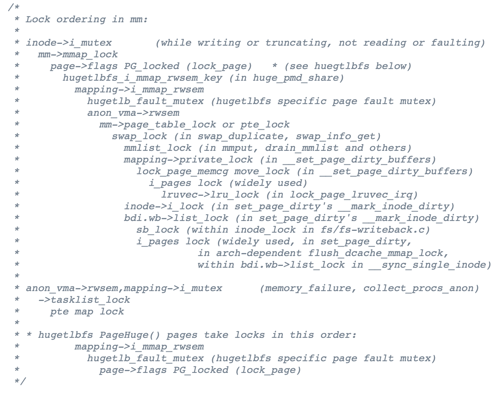
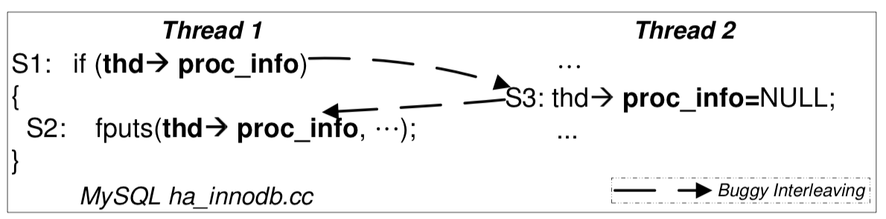
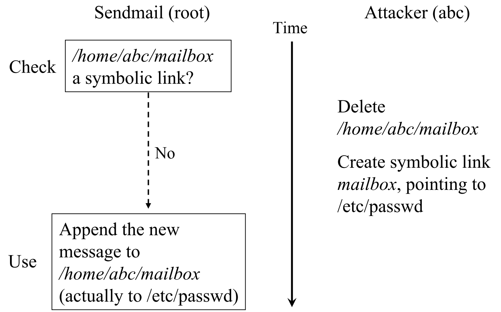
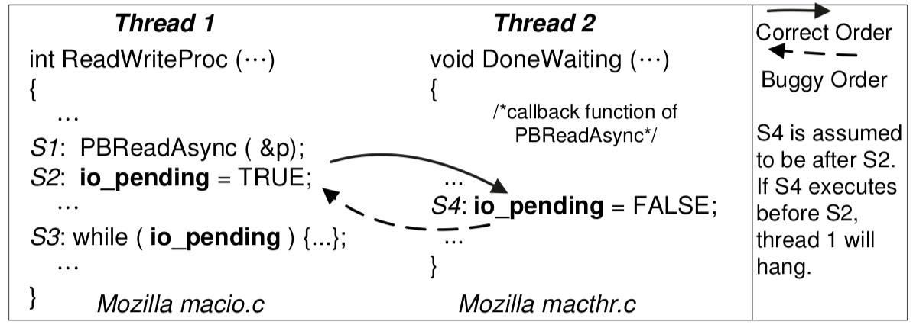
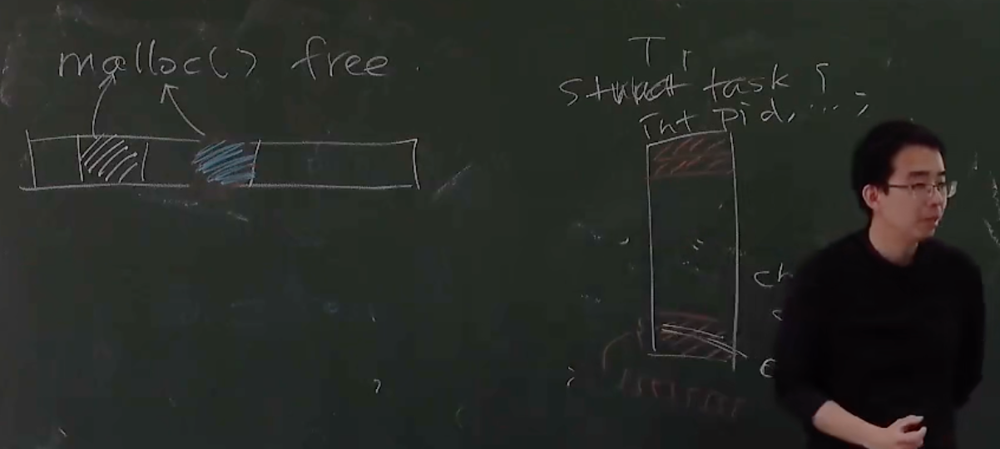

# 并发 Bug 和应对

## Overview

复习

- 并发编程的基本工具：线程库、互斥和同步
- 并发编程的应用场景：高性能计算、数据中心、网页/移动应用

------

本次课回答的问题

- **Q**: 并发编程那么难，我写出 bug 怎么办？

------

本次课主要内容

- 应对 bug (和并发 bug) 的方法
- 死锁和数据竞争

## 收获

这节课很重要，但是听的一知半解，一定得做实验做实验，才能理解这节课的内容。

## 一、应对 Bug 的方法

### 1、基本思路：否定你自己

> 虽然不太愿意承认，但始终假设自己的代码是错的。

------

然后呢？

- 做好测试
- 检查哪里错了
- 再检查哪里错了
- 再再检查哪里错了
  - (把任何你认为 “不对” 的情况都检查一遍)

### 2、Bug 多的根本原因：编程语言的缺陷

> 软件是需求 (规约) 在计算机数字世界的投影。

只管 “翻译” 代码，不管和实际需求 (规约) 是否匹配

- [alipay.c](http://jyywiki.cn/pages/OS/2022/demos/alipay.c) 的例子
  - 变量 `balance` 代表 “余额”
  - 怎么看 withdraw 以后 0 → 18446744073709551516 都不对

编程语言在表达现实社会的需求时候，是有损失的

------

三十年后的编程语言和编程方法？

- Annotation verifier ([Dafny](https://dafny-lang.github.io/dafny/))
- Specification mining ([Daikon](http://plse.cs.washington.edu/daikon/))
- [Refinement types](https://dl.acm.org/doi/10.1145/113446.113468)
- [Program sketching](https://link.springer.com/article/10.1007/s10009-012-0249-7)……

### 3、更实在的方法：防御性编程

> 把程序需要满足的条件用 assert 表达出来。

一个很有用的技巧，面试手写代码的时候，同时写assert raise，给面试官的感受完全不一样，印象分大大增加，太有用了

例子：[peterson-barrier.c](http://jyywiki.cn/pages/OS/2022/demos/peterson-barrier.c)、二叉树的旋转


### 4、防御性编程和规约给我们的启发

你知道很多变量的**含义**

```c
#define CHECK_INT(x, cond) \
  ({ panic_on(!((x) cond), "int check fail: " #x " " #cond); })
#define CHECK_HEAP(ptr) \
  ({ panic_on(!IN_RANGE((ptr), heap)); })
```

变量有 “typed annotation”

- `CHECK_INT(waitlist->count, >= 0);`
- `CHECK_INT(pid, < MAX_PROCS);`
- `CHECK_HEAP(ctx->rip); CHECK_HEAP(ctx->cr3);`
- 变量含义改变 → 发生奇怪问题 (overflow, memory error, ...)
  - **不要小看这些检查**，它们在底层编程 (M2, L1, ...) 时非常常见
  - 在虚拟机神秘重启/卡住/...前发出警报

---

防御性编程，在写操作系统内核的时候，非常有用

因为用 c 语言这种底层语言写的话，完全无保护的裸奔状态

## 二、并发 Bug：死锁 (Deadlock)

### 1、死锁 (Deadlock)

> A deadlock is a state in whic h each member of a group is waiting for another member, including itself, to take action.

出现线程 “互相等待” 的情况


### 2、AA-Deadlock

假设你的 spinlock 不小心发生了中断

- 在不该打开中断的时候开了中断
- 在不该切换的时候执行了 `yield()`

------

```c
void os_run() {
  spin_lock(&list_lock);
  spin_lock(&xxx);
  spin_unlock(&xxx); // ---------+
}                          //    |
                           //    |
void on_interrupt() {      //    |
  spin_lock(&list_lock);   // <--+
  spin_unlock(&list_lock);
}
```

### 3、ABBA-Deadlock

```c
void swap(int i, int j) {
  spin_lock(&lock[i]);
  spin_lock(&lock[j]);
  arr[i] = NULL;
  arr[j] = arr[i];
  spin_unlock(&lock[j]);
  spin_unlock(&lock[i]);
}
```

------

上锁的顺序很重要……

- `swap` 本身看起来没有问题
  - `swap(1, 2)`; `swap(2, 3)`, `swap(3, 1)` → 死锁
  - [philosopher.c](http://jyywiki.cn/pages/OS/2022/demos/philosopher.c)

### 4、避免死锁

死锁产生的四个必要条件 ([Edward G. Coffman](https://en.wikipedia.org/wiki/Edward_G._Coffman,_Jr.), 1971):

- 互斥：一个资源每次只能被一个进程使用
- 请求与保持：一个进程请求资阻塞时，不释放已获得的资源
- 不剥夺：进程已获得的资源不能强行剥夺
- 循环等待：若干进程之间形成头尾相接的循环等待资源关系

------

> “理解了死锁的原因，尤其是产生死锁的四个必要条件，就可以最大可能地避免、预防和解除死锁。所以，在系统设计、进程调度等方面注意如何不让这四个必要条件成立，如何确定资源的合理分配算法，避免进程永久占据系统资源。此外，也要防止进程在处于等待状态的情况下占用资源。因此，对资源的分配要给予合理的规划。” ——Bullshit.

---

AA-Deadlock

- AA 型的死锁容易检测，及早报告，及早修复
- [spinlock-xv6.c](http://jyywiki.cn/pages/OS/2022/demos/spinlock-xv6.c) 中的各种防御性编程
  - `if (holding(lk)) panic();`

------

ABBA-Deadlock

- 任意时刻系统中的锁都是有限的
- **严格按照固定的顺序获得所有锁** (lock ordering; 消除 “循环等待”)
  - 遇事不决可视化：[lock-ordering.py](http://jyywiki.cn/pages/OS/2022/demos/lock-ordering.py)
  - 进而证明 T1:A→B→C;T2:B→C 是安全的
    - “在任意时刻总是有获得 “最靠后” 锁的可以继续执行”

```python
class LockOrdering:
    locks = [ '', '', '' ]

    def tryacquire(self, lk):
        self.locks[lk], seen = '🔒', self.locks[lk]
        return seen == ''

    def release(self, lk):
        self.locks[lk] = ''

    @thread
    def t1(self):
        while True:
            while not self.tryacquire(0): pass
            while not self.tryacquire(1): pass
            while not self.tryacquire(2): pass
            self.release(0), self.release(1), self.release(2)

    @thread
    def t2(self):
        while True:
            while not self.tryacquire(1): pass
            while not self.tryacquire(2): pass
            self.release(1), self.release(2)

    @marker
    def mark_negative(self, state):
        pass

```

### 5、Lock Ordering: 应用 (Linux Kernel: rmap.c)



### 6、但是……你又 Naive 了……

Textbooks will tell you that if you always lock in the same order, you will never get this kind of deadlock. ***Practice will tell you that this approach doesn't scale***: when I create a new lock, I don't understand enough of the kernel to figure out where in the 5000 lock hierarchy it will fit.

The best locks are encapsulated: they *never get exposed in headers*, and are *never held around calls to non-trivial functions outside the same file*. You can read through this code and see that it will never deadlock, because it never tries to grab another lock while it has that one. People using your code don't even need to know you are using a lock.

—— *[Unreliable Guide to Locking](https://www.kernel.org/doc/html/latest/kernel-hacking/locking.html)* by Rusty Russell

- 我们稍后回到这个问题，继续看更多的 bugs

## 三、并发 Bug：数据竞争 (Data Race)

不上锁不就没有死锁了吗？

### 1、数据竞争

**不同的线程**同时访问**同一段内存**，且**至少有一个是写**。

- 两个内存访问在 “赛跑”，“跑赢” 的操作先执行
  - [peterson-barrier.c](http://jyywiki.cn/pages/OS/2022/demos/peterson-barrier.c): 内存访问都在赛跑
    - [MFENCE](https://www.felixcloutier.com/x86/mfence)：~~如何留下最少的 fence，依然保证算法正确？~~


Peterson 算法告诉大家：

- **你们写不对无锁的并发程序**
- 所以事情反而简单了

**用互斥锁保护好共享数据**

**消灭一切数据竞争**

### 2、数据竞争：例子

以下代码概括了你们遇到数据竞争的大部分情况

- 不要笑，你们的 bug 几乎都是这两种情况的变种

------

```c
// Case #1: 上错了锁
void thread1() { spin_lock(&lk1); sum++; spin_unlock(&lk1); }
void thread2() { spin_lock(&lk2); sum++; spin_unlock(&lk2); }
```

------

```c
// Case #2: 忘记上锁
void thread1() { spin_lock(&lk1); sum++; spin_unlock(&lk1); }
void thread2() { sum++; }
```

## 四、更多类型的并发 Bug

### 1、程序员：花式犯错

回顾我们实现并发控制的工具

- 互斥锁 (lock/unlock) - 原子性
- 条件变量 (wait/signal) - 同步

------

忘记上锁——原子性违反 (Atomicity Violation, AV)

忘记同步——顺序违反 (Order Violation, OV)

------

Empirical study: 在 105 个并发 bug 中 (non-deadlock/deadlock)

- MySQL (14/9), Apache (13/4), Mozilla (41/16), OpenOffice (6/2)
- **97% 的非死锁并发 bug 都是 AV 或 OV**。

### 2、原子性违反 (AV)

“ABA”

- 我以为一段代码没啥事呢，但被人强势插入了



---

有时候上锁也不解决问题

- “TOCTTOU” - time of check to time of use



- [TOCTTOU vulnerabilities in UNIX-style file systems: An anatomical study](https://www.usenix.org/legacy/events/fast05/tech/full_papers/wei/wei.pdf) (FAST'05)

### 3、顺序违反 (OV)

“BA”

- 怎么就没按我预想的顺序来呢？
  - 例子：concurrent use after free



## 五、应对并发 Bug 的方法

### 1、完全一样的基本思路：否定你自己

> 还是得**始终假设自己的代码是错的**。

------

然后呢？

- 做好测试
- 检查哪里错了
- 再检查哪里错了
- 再再检查哪里错了
  - (把任何你认为 “不对” 的情况都检查一遍)

------

例如：用 lock ordering 彻底避免死锁？

- 你想多了：并发那么复杂，程序员哪能充分测试啊

### 2、Lockdep: 运行时的死锁检查

Lockdep 规约 (Specification)

- 为每一个锁确定唯一的 “allocation site”
  - [lock-site.c](http://jyywiki.cn/pages/OS/2022/demos/lock-site.c)
  - assert: 同一个 allocation site 的锁存在全局唯一的上锁顺序

检查方法：printf

- 记录所有观察到的上锁顺序，例如[x,y,z]⇒x→y,x→z,y→z
- 检查是否存在 x⇝y∧y⇝x

------

[Lockdep 的实现](http://jyywiki.cn/OS/OS_Lockdep)

- Since Linux Kernel 2.6.17, also in [OpenHarmony](https://gitee.com/openharmony)!

### 3、ThreadSanitizer: 运行时的数据竞争检查

为所有事件建立 happens-before 关系图

- Program-order + release-acquire
- 对于发生在不同线程且至少有一个是写的 x,y 检查 x≺y∨y≺x
  - [Time, clocks, and the ordering of events in a distributed system](https://dl.acm.org/doi/10.1145/359545.359563)

### 4、更多的检查：动态程序分析

在事件发生时记录

- Lockdep: lock/unlock
- ThreadSanitizer: 内存访问 + lock/unlock

------

解析记录检查问题

- Lockdep: x⇝y∧y⇝x
- ThreadSanitizer: x⊀y∧y⊀x

------

付出的代价和权衡

- 程序执行变慢
- 但更容易找到 bug (因此在测试环境中常用)

### 5、动态分析工具：Sanitizers

没用过 lint/sanitizers？

- [AddressSanitizer](https://clang.llvm.org/docs/AddressSanitizer.html) (asan); [(paper)](https://www.usenix.org/conference/atc12/technical-sessions/presentation/serebryany): 非法内存访问
  - Buffer (heap/stack/global) overflow, use-after-free, use-after-return, double-free, ...
  - Demo: [uaf.c](http://jyywiki.cn/pages/OS/2022/demos/uaf.c); [kasan](https://www.kernel.org/doc/html/latest/dev-tools/kasan.html)
- [ThreadSanitizer](https://clang.llvm.org/docs/UndefinedBehaviorSanitizer.html) (tsan): 数据竞争
  - Demo: [fish.c](http://jyywiki.cn/pages/OS/2022/demos/fish.c), [sum.c](http://jyywiki.cn/pages/OS/2022/demos/sum.c), [peterson-barrier.c](http://jyywiki.cn/pages/OS/2022/demos/peterson-barrier.c); [ktsan](https://github.com/google/ktsan)
- [MemorySanitizer](https://clang.llvm.org/docs/MemorySanitizer.html) (msan): 未初始化的读取
- [UBSanitizer](https://clang.llvm.org/docs/UndefinedBehaviorSanitizer.html) (ubsan): undefined behavior
  - Misaligned pointer, signed integer overflow, ...
  - Kernel 会带着 `-fwrapv` 编译

---

use after free: uaf.c

```c
#include <stdlib.h>
#include <string.h>

int main() {
  int *ptr = malloc(sizeof(int));
  *ptr = 1;
  free(ptr);
  *ptr = 1;
}
```

地址消毒器 -fsanitize=address

```bash
$ gcc -g uaf.c -fsanitize=address
$ ./a.out

==66405==ERROR: AddressSanitizer: heap-use-after-free on address 0x602000000070 at pc 0x00010eb77f27 bp 0x7ff7b138b670 sp 0x7ff7b138b668
WRITE of size 4 at 0x602000000070 thread T0
    #0 0x10eb77f26 in main a.c:8
    #1 0x11a8c751d in start+0x1cd (dyld:x86_64+0x551d)

0x602000000070 is located 0 bytes inside of 4-byte region [0x602000000070,0x602000000074)
...
```

---

数据竞争：sum.c

```c
#include "thread.h"

#define N 100000000

long sum = 0;

void Tsum() {
  for (int i = 0; i < N; i++) {
    sum++;
  }
}

int main() {
  create(Tsum);
  create(Tsum);
  join();
  printf("sum = %ld\n", sum);
}
```

-fsanitize=thread

```bash
$ gcc a.c -lpthread -fsanitize=thread
$ ./a.out

a.out(66772,0x1092e9600) malloc: nano zone abandoned due to inability to preallocate reserved vm space.
==================
WARNING: ThreadSanitizer: data race (pid=66772)
  Write of size 8 at 0x0001080df080 by thread T2:
    #0 Tsum <null>:2 (a.out:x86_64+0x100003dcf)
    #1 wrapper <null>:2 (a.out:x86_64+0x100003b2a)
...
SUMMARY: ThreadSanitizer: data race (a.out:x86_64+0x100003dcf) in Tsum+0x3f
==================
sum = 145020873
ThreadSanitizer: reported 1 warnings
Abort trap: 6
```


## 六、这不就是防御性编程吗？

只不过不需要我亲自动手把代码改得乱七八糟了……

### 1、我们也可以！Buffer Overrun 检查

Canary (金丝雀) 对一氧化碳非常敏感

- 用生命预警矿井下的瓦斯泄露 (since 1911)


计算机系统中的 canary

- “牺牲” 一些内存单元，来预警 memory error 的发生
  - (程序运行时没有动物受到实质的伤害)

### 2、Canary 的例子：保护栈空间 (M2/L2)

把这个栈做的可检查，可检测栈溢出。就不要把所有的空间都用作栈空间


```c
#define MAGIC 0x55555555
#define BOTTOM (STK_SZ / sizeof(u32) - 1)
struct stack { char data[STK_SZ]; };

// 栈的前后加一些缓冲，写入一个数字
void canary_init(struct stack *s) {
  u32 *ptr = (u32 *)s;
  for (int i = 0; i < CANARY_SZ; i++)
    ptr[BOTTOM - i] = ptr[i] = MAGIC;
}

// 每隔一段时间，检查下缓冲区里面的有没有被改动
// 如果里面出现了其他数字，说明出现了栈溢出
void canary_check(struct stack *s) {
  u32 *ptr = (u32 *)s;
  for (int i = 0; i < CANARY_SZ; i++) {
    panic_on(ptr[BOTTOM - i] != MAGIC, "underflow");
    panic_on(ptr[i] != MAGIC, "overflow");
  }
}
```

### 3、烫烫烫、屯屯屯和葺葺葺

msvc 中 debug mode 的 guard/fence/canary

- 未初始化栈: `0xcccccccc`
- 未初始化堆: `0xcdcdcdcd`
- 对象头尾: `0xfdfdfdfd`
- 已回收内存: `0xdddddddd`

```
(b'\xcc' * 80).decode('gb2312')
```

手持两把锟斤拷，口中疾呼烫烫烫

脚踏千朵屯屯屯，笑看万物锘锘锘

(它们一直在无形中保护你)

### 4、防御性编程：低配版 Lockdep

不必大费周章记录什么上锁顺序

- 统计当前的 spin count
  - 如果超过某个明显不正常的数值 (1,000,000,000) 就报告

```c
int spin_cnt = 0;
while (xchg(&locked, 1)) {
  if (spin_cnt++ > SPIN_LIMIT) {
    printf("Too many spin @ %s:%d\n", __FILE__, __LINE__);
  }
}
```

- 配合调试器和线程 backtrace 一秒诊断死锁

### 5、防御性编程：低配版 Sanitizer (L1)

内存分配要求：已分配内存 S=[ℓ0,r0)∪[ℓ1,r1)∪…

- kalloc(s) 返回的[ℓ,r)必须满足[ℓ,r)∩S=∅
  - thread-local allocation + 并发的 free 还蛮容易弄错的

```c
// allocation
for (int i = 0; (i + 1) * sizeof(u32) <= size; i++) {
  panic_on(((u32 *)ptr)[i] == MAGIC, "double-allocation");
  arr[i] = MAGIC;
}

// free
for (int i = 0; (i + 1) * sizeof(u32) <= alloc_size(ptr); i++) {
  panic_on(((u32 *)ptr)[i] == 0, "double-free");
  arr[i] = 0;
}
```



## 总结

本次课回答的问题

- **Q**: 如何拯救人类不擅长的并发编程？

------

Take-away message

- 常见的并发 bug
  - 死锁、数据竞争、原子性/顺序违反
- 不要盲目相信自己：检查、检查、检查
  - 防御性编程：检查
  - 动态分析：打印 + 检查

老师的一句话：不用每时每刻都去做检查，可以每隔一段时间做下检查，收益仍然很高
