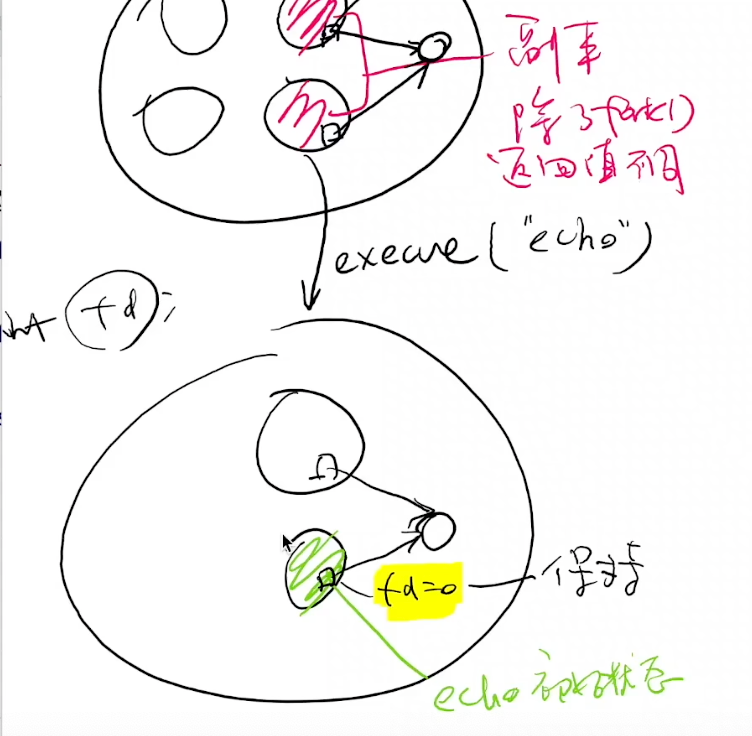
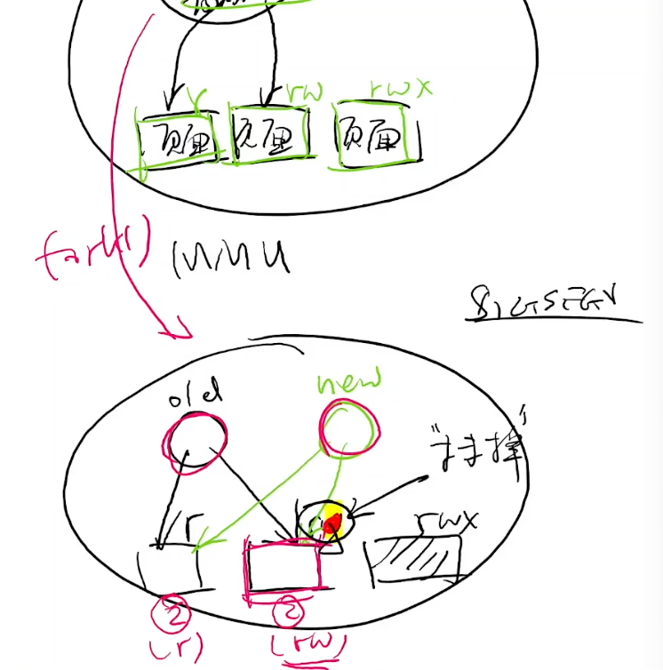
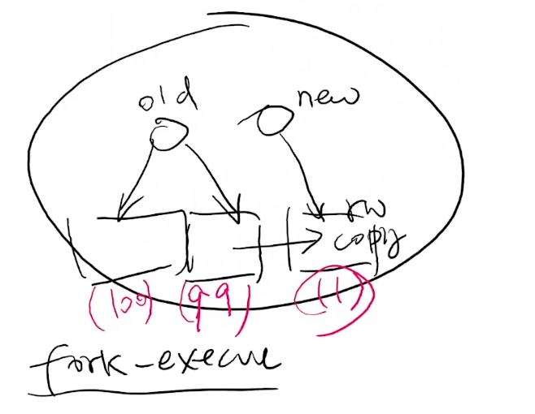
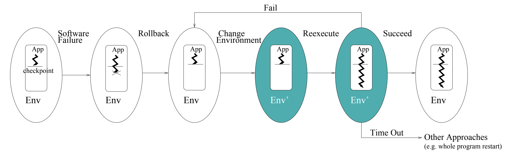
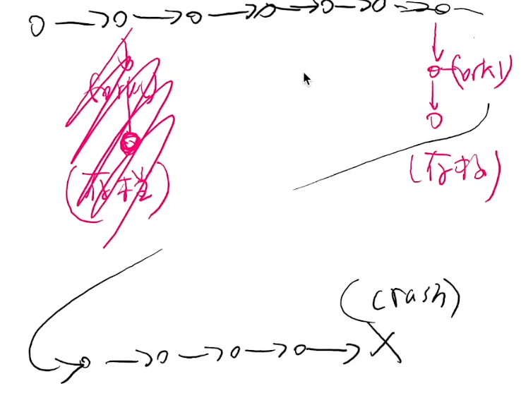
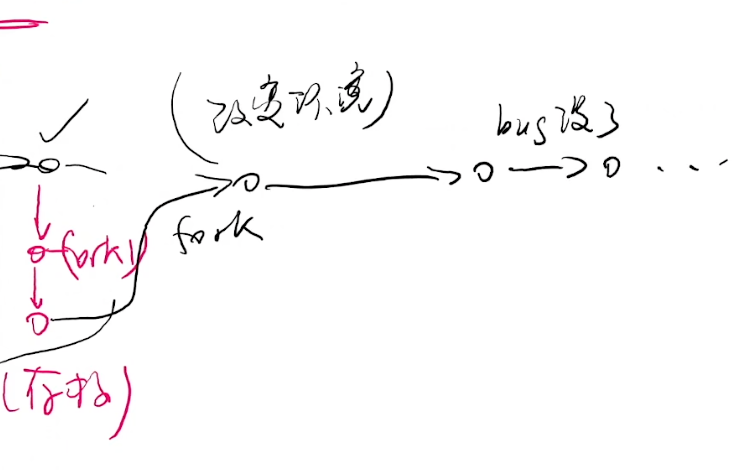
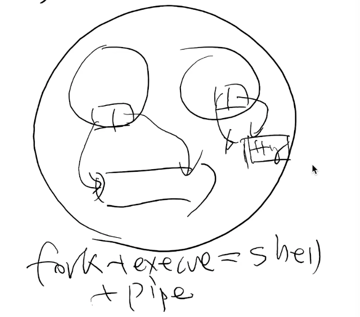
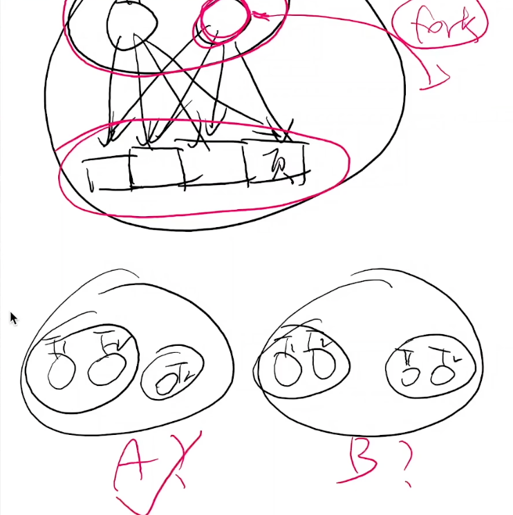

# A fork() in the Road

## Overview

复习

- 我们理解了从系统调用 → libc → shell → 应用的 “软件栈”

------

本次课回答的问题

- 能不能用系统调用实现比普通业务逻辑代码更有趣的东西？

------

本次课主要内容

- 期中测验讲评
- 状态机复制 (fork) 的应用
- 有关 fork 的一些讨论

## 期中测验讲评

### 1、简答题：并发求和

如果假设 [sum.c](http://jyywiki.cn/pages/OS/2022/demos/sum.c) 中的 `sum++` 是如下构成：

- `t = atomic_fetch(sum)`
- `t++`
- `atomic_store(sum, t)`

那么 k 个线程，输出的最小 `sum` 是多少？

```c
#include "thread.h"

#define N 100000000

long sum = 0;

void Tsum() {
  for (int i = 0; i < N; i++) {
    sum++;
  }
}

int main() {
  create(Tsum);
  create(Tsum);
  join();
  printf("sum = %ld\n", sum);
}

```


------

结论有些反直觉：

- 对于所有 n,k≥2，`sum` 的最小值都是 2
- 只要有一个线程在最后一轮循环 “持有” 2，再保持到最后写入
    - Online Judge 就送分了

### 2、水面下的冰山：“反直觉” 的来源

Verifying Sequential Consistency (VSC) is NP-Complete

- 给出若干线程的共享内存 load/store 序列，判定是否存在一个 “全局” 的读写顺序，使得线程总是读到最近写入的数值

------

课后习题难度 (3-SAT)

- 阶段 1: 赋值
    - 对每个变量 x 构造 write(x, 0) 和 write(x, 1) 的线程
- 阶段 2: 判定 Ci=x∨¬y
    - (T1) read(x) = 1, write(Si, 1) (T2) read(y) = 0, write(Si, 1)
- 阶段 3: 收结果
    - read(S1) = 1, read(S2) = 1, ...
- 阶段 4: 收尾 (使所有线程都能顺利结束)
    - write(x, 0), write(x, 1)

### 3、更多的技术处理

“加强豪华版课后习题” 😂

- [Testing shared memories](https://epubs.siam.org/doi/epdf/10.1137/S0097539794279614) (SIAM Journal on Computing'97)
- 使用的同步机制比刚才的 “课后习题版本” 稍巧妙一些

------

| VSC 的变种               | 复杂度      |
| :----------------------- | :---------- |
| 刚才的证明 (一般情况)    | NP-Complete |
| 每个线程只执行 2 个操作  | NP-Complete |
| 只有 2 个变量            | NP-Complete |
| 只有 3 个线程            | NP-Complete |
| 每个读知道写者           | NP-Complete |
| 每个变量只被一个线程写入 | NP-Complete |

### 4、编程题：生产者-消费者

投机取巧的方法：**C 标准库是线程安全的**！

```c
void Tworker() {
  while (!feof(stdin) && scanf("%d", &x) == 1) {
    long res = f(x);
    lock(&lk);
    sum += res;
    unlock(&lk);
  }
}
```

如果限制只有一个线程可以读，那就需要生产者-消费者了

### 5、统计结果

正确率 (OJ 实时统计通过似乎只统计了编程题……)

- 简答题 56/74 (75.7%)
- 编程题 28/74 (37.8%)

------

87.5% (56/64) 的问卷表示 “没有出卖灵魂”

- 希望大家保持！


## 一、fork() 行为的补充解释

### 1、复习：fork()

**状态机的复制**

- [fork-demo.c](http://jyywiki.cn/pages/OS/2022/demos/fork-demo.c)
    - 操作系统：状态机的管理者
- [fork-printf.c](http://jyywiki.cn/pages/OS/2022/demos/fork-printf.c)
    - 一切状态都会被复制
- [sh-xv6.c](http://jyywiki.cn/pages/OS/2022/demos/sh-xv6.c)
    - fork + execve + pipe: UNIX Shell 的经典设计
    - **fork 状态机复制包括持有的所有操作系统对象**
    - **execve “重置” 状态机，但继承持有的所有操作系统对象**



### 2、文件描述符

熟悉又陌生

```c
int open(const char *pathname, int flags);
```

- RTFM: `O_CLOEXEC`, `O_APPEND`

------

文件描述符：一个指向操作系统内对象的 “指针”

- **对象只能通过操作系统允许的方式访问**
- 从 0 开始编号 (0, 1, 2 分别是 stdin, stdout, stderr)
- 可以通过 open 取得；close 释放；dup “复制”
- 对于数据文件，文件描述符会 “记住” 上次访问文件的位置
    - `write(3, "a", 1); write(3, "b", 1);`

### 3、文件描述符的 “复制”

```c
fd = open("a.txt", O_WRONLY | O_CREAT); assert(fd > 0);
pid_t pid = fork(); assert(pid >= 0);
if (pid == 0) {
  write(fd, "Hello");
} else {
  write(fd, "World");
}
```


```c
#include <fcntl.h>
#include <unistd.h>

int main() {
  int fd = open("a.txt", O_WRONLY | O_CREAT);
  int pid = fork();
  if (pid == 0) {
    write(fd, "Hello", 5);
  } else {
    write(fd, "World", 5);
  }
}
```

```bash
$ gcc a.c && ./a.out && cat a.txt
WorldHello
```


------

文件抽象的代价

- 操作系统必须正确管理好偏移量 (如果是日志文件)
    - 原子性 (RTFM: write(2), BUGS section)
- dup() 的两个文件描述符是共享 offset，还是独立 offset？
    - RTFM again!

### 4、复制，但又没有完全复制

概念上状态机被复制，但实际上复制后**内存都被共享**

- “Copy-on-write” 只有被写入的页面才会复制一份
    - 被复制后，整个地址空间都被标记为 “只读”
    - 操作系统捕获 Page Fault 后酌情复制页面
    - fork-execve 效率得到提升
- 操作系统会维护每个页面的引用计数





想证明这一点？

- [cow-test.c](http://jyywiki.cn/pages/OS/2022/demos/cow-test.c): 128MB 代码 + 128MB 数据
- 创建 1000 个进程 (2GB 内存的虚拟能抗住吗)？
    - 所以，整个操作系统里 libc 代码和只读数据只有一个副本！
    - 推论：**统计进程占用的内存是个伪命题**

可以通过 pmap 看使用的虚内存，也可以通过 top 看实际使用的

```c
#include <stdio.h>
#include <stdlib.h>
#include <unistd.h>
#include <fcntl.h>
#include <assert.h>
#include <string.h>

#define NPROC 1000
#define MB 128
#define SIZE (MB * (1 << 20))

#define xstr(s) str(s)
#define str(s) #s

int main() {
  char *data = malloc(SIZE); // 128MB shared memory
  memset(data, '_', SIZE);

  for (int i = 0; i < NPROC - 1; i++) {
    if (fork() == 0) break;
  }

  // NPROC processes go here

  asm volatile(".fill 1048576 * " xstr(MB) ", 1, 0x90"); // 128MB shared code

  unsigned int idx = 0;
  int fd = open("/dev/urandom", O_RDONLY); assert(fd > 0);
  read(fd, &idx, sizeof(idx));
  close(fd);
  idx %= 1048576 * MB;

  data[idx] = '.';
  printf("pid = %d, write data[%u]\n", getpid(), idx);

  while (1) {
    sleep(1); // not terminate
  }
}

```

调试一下

```bash
$ gcc a.c

$ ll -h a.out 
-rwxr-xr-x 1 root root 129M Jul 24 22:49 a.out*

$ objdump -d a.out | less
...
    1306:       90                      nop
    1307:       90                      nop
    1308:       90                      nop
    1309:       90                      nop
    130a:       90                      nop
    130b:       90                      nop
    130c:       90                      nop
...
# 有好多 nop

$ free -m
              total        used        free      shared  buff/cache   available
Mem:           1987         489         379           2        1118        1311
Swap:             0           0           0
# 有 2G 的内存

$ ./a.out
pid = 657993, write data[133884068]
pid = 657991, write data[96120499]
pid = 657990, write data[49768012]
pid = 657994, write data[106725305]
...
# 系统没有丝毫的卡顿和崩溃

# 等待执行完毕，在另一个窗口看
$ ps ax | grep "a.out" | wc -l
1001
$ free -m
              total        used        free      shared  buff/cache   available
Mem:           1987        1240          76           2         670         568
Swap:             0           0           0
# 实际上用了不到 1G 内存

# 在之前的窗口 control + c，再看下内存
$ free -m
              total        used        free      shared  buff/cache   available
Mem:           1987         495         911           2         580        1321
Swap:             0           0           0
# 
```

1000 个进程，一共使用了1240 - 495=745M 内存，这就是 copy on write 的实现

## 二、状态机、fork() 和魔法

### 1、状态机的视角

帮助我们

- 理解物理世界 (Cellular Automata)
- 理解处理器、操作系统
- 调试 (record-replay)、profiler
- Model checker 和 program verifier

------

fork() 可以复制状态机？

- 感觉是一个非常 “强大” 的操作
- 比如**创造平行宇宙**！

### 2、创造平行宇宙：搜索并行化

那我们不就可以加速状态空间搜索了吗？


这个 dfs 程序是走迷宫的，从左上角出发，找到到 + 号的所有可能的路径

- 常用的实现是用 回溯法+记录已经走过的点
- 每次探索都 fork 一个新进程，[dfs-fork.c](http://jyywiki.cn/pages/OS/2022/demos/dfs-fork.c): 连回溯都可以不要了


```c
#include <stdio.h>
#include <unistd.h>
#include <stdint.h>
#include <assert.h>
#include <stdlib.h>
#include <string.h>
#include <errno.h>
#include <sys/wait.h>

#define DEST  '+'
#define EMPTY '.'

struct move {
  int x, y, ch;
} moves[] = {
  { 0, 1, '>' },
  { 1, 0, 'v' },
  { 0, -1, '<' },
  { -1, 0, '^' },
};

char map[][512] = {
  "#######",
  "#.#.#+#",
  "#.....#",
  "#.....#",
  "#...#.#",
  "#######",
  "",
};

void display();

void dfs(int x, int y) {
  if (map[x][y] == DEST) {
    display();
  } else {
    int nfork = 0;

    for (struct move *m = moves; m < moves + 4; m++) {
      int x1 = x + m->x, y1 = y + m->y;
      if (map[x1][y1] == DEST || map[x1][y1] == EMPTY) {
        // 如果下一个格子是可以走的，不用回溯，直接 fork()
        int pid = fork(); assert(pid >= 0);
        if (pid == 0) { // map[][] copied
          // 如果是子进程，把这个格子占上，然后dfs，最后直接结束，因为父进程还持有原来的状态
          map[x][y] = m->ch;
          dfs(x1, y1);
          exit(0); // clobbered map[][] discarded
        } else {
          // 父进程的话，会等左边的平行宇宙探索完了，再继续下一个
          nfork++;
          waitpid(pid, NULL, 0); // wait here to serialize the search
        }
      }
    }

    while (nfork--) wait(NULL);
  }
}

int main() {
  dfs(1, 1);
}

void display() {
  for (int i = 0; ; i++) {
    for (const char *s = map[i]; *s; s++) {
      switch (*s) {
        case EMPTY: printf("   "); break;
        case DEST : printf(" ○ "); break;
        case '>'  : printf(" → "); break;
        case '<'  : printf(" ← "); break;
        case '^'  : printf(" ↑ "); break;
        case 'v'  : printf(" ↓ "); break;
        default   : printf("▇▇▇"); break;
      }
    }
    printf("\n");
    if (strlen(map[i]) == 0) break;
  }
  fflush(stdout);
  sleep(1); // to see the effect of parallel search
}

```

调试下

```bash
$ gcc a.c && ./a.out
▇▇▇▇▇▇▇▇▇▇▇▇▇▇▇▇▇▇▇▇▇
▇▇▇ ↓ ▇▇▇   ▇▇▇ ○ ▇▇▇
▇▇▇ →  →  →  →  ↑ ▇▇▇
▇▇▇               ▇▇▇
▇▇▇         ▇▇▇   ▇▇▇
▇▇▇▇▇▇▇▇▇▇▇▇▇▇▇▇▇▇▇▇▇

▇▇▇▇▇▇▇▇▇▇▇▇▇▇▇▇▇▇▇▇▇
▇▇▇ ↓ ▇▇▇   ▇▇▇ ○ ▇▇▇
▇▇▇ →  →  →  ↓  ↑ ▇▇▇
▇▇▇          →  ↑ ▇▇▇
▇▇▇         ▇▇▇   ▇▇▇
▇▇▇▇▇▇▇▇▇▇▇▇▇▇▇▇▇▇▇▇▇

...
```

神奇的是：`waitpid(pid, NULL, 0); // wait here to serialize the search` 注释掉

程序一瞬间执行完，结束了，这就是并行 dfs

### 3、创造平行宇宙：跳过初始化

假设你实现的 NEMU 需要启动很多份

- `./nemu dummy.elf`
- `./nemu add.elf`
- `./nemu add-longlong.elf`...
- 而你的 NEMU 实现初始化又需要很长的时间？

------

```c
int main() {
  nemu_init(); // only once
  while (1) {
    file = get_start_request();
    if ((pid = fork()) == 0) {
      // bad practice: no error checking
      load_file();
    }
    ...
```

---

在实际中的应用

- Zygote Process (Android)
    - Java Virtual Machine 初始化涉及大量的类加载
    - 一次加载，全员使用
        - App 使用的系统资源
        - 基础类库
        - libc
        - ...
- Chrome site isolation (Chrome)
- Fork server (AFL)

### 4、创造平行宇宙：备份和容错

要是我们总是能 “试一试”，试错了还能回到过去就好了

- **有 bug 的程序：我也想这样**

------

那就用 fork() 做个快照吧

- 主进程 crash 了，启动快照重新执行
    - 有些 bug 可能调整一下环境就消失了 (比如并发)
    - [Rx: Treating bugs as allergies--A safe method to survive software failures](https://dl.acm.org/citation.cfm?id=1095833). (SOSP'05, Best Paper Award 🏅)







### 5、突如其来的广告

> 计算机系统里没有魔法。处理器/操作系统/程序就是状态机。

但这就是魔法啊！

- ~~[签订契约，成为魔法少女](https://cs.nju.edu.cn/ics/recruit/index.html)~~ ([这是什么梗](https://zh.moegirl.org/QB娘))


キュウべえ和大学教授有某种程度的相似

~~总是在骗你，但从不说假话~~

## 三、状态机复制：我们做对了吗？

[A `fork()` in the road](https://www.microsoft.com/en-us/research/uploads/prod/2019/04/fork-hotos19.pdf) (HotOS'19)

批评 unix fork()

### 1、`fork()`: UNIX 时代的遗产



fork + execve + pipe

- 如果只有内存和文件描述符，这是十分优雅的方案
- 但贪婪的人类怎么可能满足？

------

在操作系统的演化过程中，为进程增加了更多的东西

- 信号 (信号处理程序，操作系统负责维护)
- 线程 (Linux 为线程提供了 clone 系统调用)
- 进程间通信对象
- ptrace (追踪/调试)
- ……



一个进程中有两个线程，其中一个线程 T2 中执行了 fork()，那么 fork 的进程是仅复制了线程 T2，还是复制了 T1 和 T2

正确答案是：仅复制了线程 T2

因为现在的 linux 没有办法执行可靠的每个线程的复制

### 2、创建进程：POSIX Spawn

```c
int posix_spawn(pid_t *pid, char *path,
  posix_spawn_file_actions_t *file_actions,
  posix_spawnattr_t *attrp,
  char * argv[], char * envp[]);
```

参数

- `pid`: 返回的进程号
- `path`: 程序 (重置的状态机)
- `file_actions`: open, close, dup
- `attrp`: 信号、进程组等信息
- `argv`,`envp`: 同`execve`
    - 很明显：这是一个 “后设计” 的 API

### 3、A `fork()` in the Road

fork() 的七宗罪

- Fork is no longer simple
- Fork doesn’t compose - [fork-printf.c](http://jyywiki.cn/pages/OS/2022/demos/fork-printf.c)
- Fork isn’t thread-safe
- Fork is insecure - 打破了 Address Space Layout Randomization
- Fork is slow - 的确……
- Fork doesn’t scale - 也是……
- Fork encourages memory overcommit - 呃……

------

但 fork() 是魔法啊：这引起了更多的思考

- 应用程序到底需要什么？
- 操作系统到底应该提供什么？

## 总结

本次课回答的问题

- **Q**: 如何巧妙地使用 fork() “创建平行世界” 的功能？

------

Take-away messages

- 复制就是**创建平行世界**
    - 搜索的加速
    - 状态的复用 (Zygote)
    - “时间旅行”——穿越到过去，让自己变得更强
- 从操作系统的角度，fork 可能不是 API 的最佳选择
    - 可能可以在这个基础上做出非常基础性的工作！