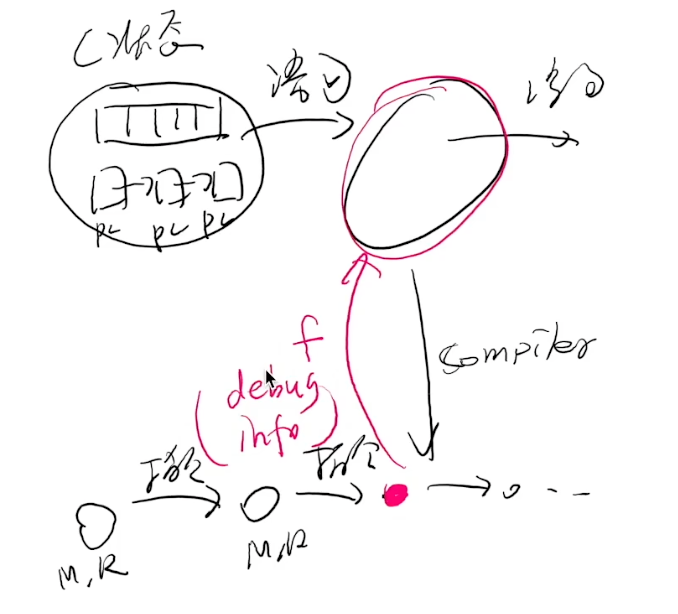
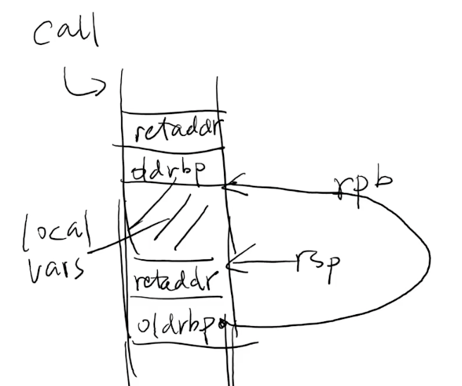
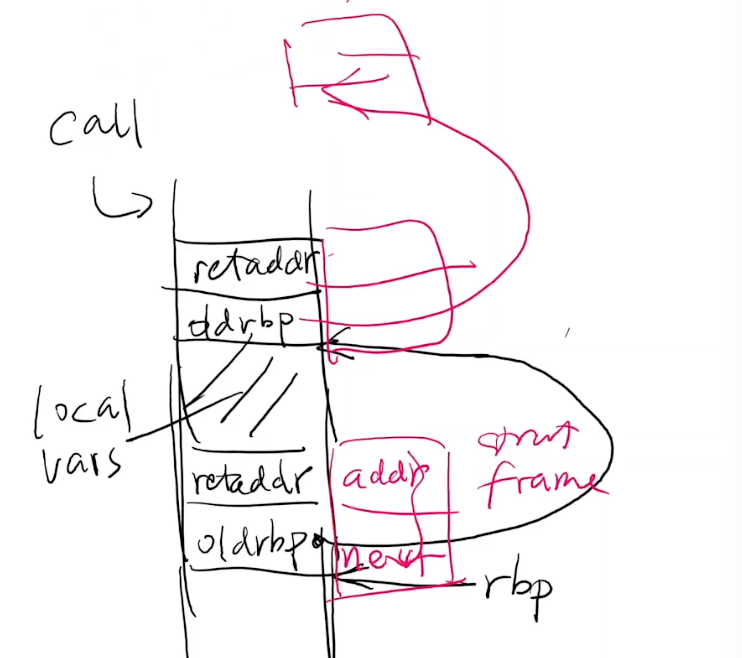
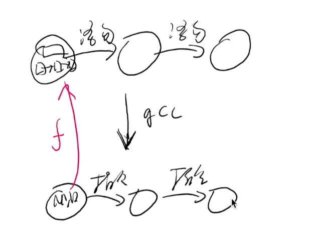
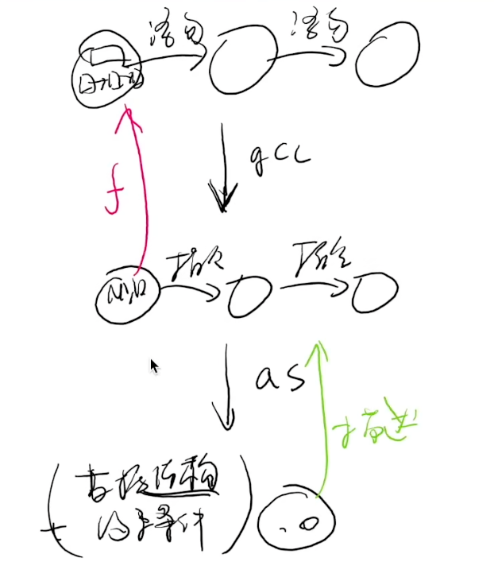
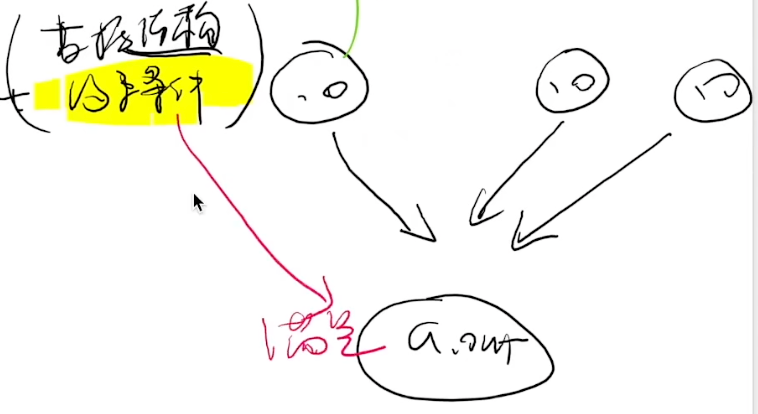

# 可执行文件

## Overview

复习

- A `fork()` in the road: 创造平行宇宙

------

本次课回答的问题

- **Q1**: 可执行文件到底是什么？
- **Q2**: 可执行文件是如何在操作系统上被执行的？

------

本次课主要内容

- 可执行文件
- 解析可执行文件
- 链接和加载
  - **今天假设只有静态链接**

## 一、可执行文件

### 1、RTFM

本次课涉及的手册

- System V ABI: [System V Application Binary Interface (AMD64 Architecture Processor Supplement)](http://jyywiki.cn/pages/OS/manuals/sysv-abi.pdf) ([repo](https://gitlab.com/x86-psABIs/x86-64-ABI))
- [和更多 refspecs](https://refspecs.linuxbase.org/)

------

(不用听了，可以下课了)

- 课堂要回答的问题
  - 为什么 fucking manual 是 fucking 的？因为缺少很多前置概念
  - 应该怎么读手册？现在简单的模型上，把一些基本概念搞清楚（能够写一些代码），再一点一点从外往内看

### 2、可执行文件：状态机的描述

**可执行文件是在 execve([...], ...) 系统调用时使用的**

execve 是把当前进程的状态机做重置，reset 成这个程序可执行的初始状态

操作系统 “为程序 (状态机) 提供执行环境”

- 可执行文件 (状态机的描述) 是最重要的操作系统对象！

------

二进制文件是一个描述了状态机的初始状态 + 迁移的**数据结构**

- 寄存器
  - 大部分由 ABI 规定，操作系统负责设置
  - 例如初始的 PC
- 地址空间
  - 二进制文件 + ABI 共同决定
  - 例如 argv 和 envp (和其他信息) 的存储
- 其他有用的信息 (例如便于调试和 core dump 的信息)

### 3、例子：操作系统上的可执行文件

需要满足若干条件

- 具有执行 (x) 权限
- 加载器能识别的可执行文件

```bash
$ ./a.c
bash: ./a.c: Permission denied
$ chmod -x a.out && ./a.out
fish: The file “./a.out” is not executable by this user
$ chmod +x a.c && ./a.c
Failed to execute process './a.c'. Reason:
exec: Exec format error
The file './a.c' is marked as an executable but could not be run by the operating system.
```

### 4、是谁决定了一个文件能不能执行？

> 操作系统代码 (execve) 决定的。

动手试一试

- strace ./a.c
- 你可以看到失败的 execve!
  - 没有执行权限的 a.c: execve = -1, EACCESS
  - 有执行权限的 a.c: execve = -1, ENOEXEC
- 再读一遍 execve (2) 的手册
  - 读手册的方法：先理解主干行为、再查漏补缺
  - “ERRORS” 规定了什么时候不能执行

```bash
$ strace ./a.c
execve("./a.c", ["./a.c"], 0x7ffdbebe32e0 /* 28 vars */) = -1 EACCES (Permission denied)
fstat(2, {st_mode=S_IFCHR|0600, st_rdev=makedev(136, 0), ...}) = 0
write(2, "strace: exec: Permission denied\n", 32strace: exec: Permission denied
) = 32
getpid()                                = 16227
exit_group(1)                           = ?
+++ exited with 1 +++

$ chmod +x a.c
$ strace ./a.c
execve("./a.c", ["./a.c"], 0x7ffc8bde7430 /* 28 vars */) = -1 ENOEXEC (Exec format error)
fstat(2, {st_mode=S_IFCHR|0600, st_rdev=makedev(136, 0), ...}) = 0
write(2, "strace: exec: Exec format error\n", 32strace: exec: Exec format error
) = 32
getpid()                                = 16236
exit_group(1)                           = ?
+++ exited with 1 +++
```

### 5、常见的可执行文件

**就是操作系统里的一个普通对象**

- 绿导师原谅你了.avi
- Windows 95/NT+, UEFI
  - PE (Portable Executable), since Windows 95/NT+
- UNIX/Linux
  - a.out (deprecated)
  - ELF (Executable Linkable Format)
  - She-bang
    - 我们可以试着 She-bang 一个自己的可执行文件！
    - She-bang 其实是一个 “偷换参数” 的 execve

```bash
$ cat a.c
#!/usr/bin/python3

print("Hello")

$ chmod +x a.c
$ file a.c
a.c: Python script, ASCII text executable

$ ./a.c
Hello
```

另一个例子

```bash
$ cat a.c
#include <stdio.h>

int main(int argc, char *argv[]) {
  for (int i = 0; i < argc; i++) {
    printf("argv[%d] = %s\n", i, argv[i]);
  }
}

$ gcc a.c
$ ./a.out 1 2 3 4
argv[0] = ./a.out
argv[1] = 1
argv[2] = 2
argv[3] = 3
argv[4] = 4

$ cat ./demo
#!./a.out
$ ./demo
argv[0] = ./a.out
argv[1] = ./demo
```

argv[0] 就是 execve 的第一个参数，是 #! 后面的路径

加载器 #! 在执行execve 的时候，偷换了一下，#!后面的路径放在execve 的第一个参数，整个文件作为第二个参数

再测试下

```bash
$ cat demo
#!././././a.out Hello World

$ ./demo
argv[0] = ././././a.out
argv[1] = Hello World
argv[2] = ./demo
```

所以，执行下面的 demo 时，execve 的第一个参数时 /usr/bin/python3，后面的参数就是 ./demo，相当于 /usr/bin/python3 ./demo

```bash
$ cat demo
#!/usr/bin/python3
print("Hello")

$ ./demo
Hello
```

execve 的设计真nb

可以看手册了，man execve

## 二、解析可执行文件

### 1、Binutils - Binary Utilities

[GNU binutils](https://www.gnu.org/software/binutils/)

- 生成可执行文件
  - ld (linker), as (assembler)
  - ar, ranlib
- 分析可执行文件
  - objcopy/objdump/readelf (计算机系统基础)
  - addr2line, size, nm

### 2、可执行文件的运行时状态

[segfault.c](http://jyywiki.cn/pages/OS/2022/demos/segfault.c) - 为什么 gdb 知道出错的位置？

- gcc (-static -g)

```c
#include <stddef.h>

void bar() {
  *(int *)NULL = 1;
}

void foo() {
  bar();
}

int main() {
  foo();
}

```

```bash
$ ./a.out
Segmentation fault (core dumped)
```

```
(gdb) r
Starting program: /tmp/demo/a.out 

Program received signal SIGSEGV, Segmentation fault.
bar () at segfault.c:4
4         *(int *)NULL = 1;
(gdb) bt
#0  bar () at segfault.c:4
#1  0x0000000000401d0d in foo () at segfault.c:8
#2  0x0000000000401d22 in main () at segfault.c:12
```

为什么 gdb 可以根据内存中的信息，打印程序的 backtrace

是因为程序的二进制文件中有额外的信息，可以实现 addr2line

```bash
$ objdump -d ./a.out | less
...
0000000000401cfb <foo>:
  401cfb:       f3 0f 1e fa             endbr64 
  401cff:       55                      push   %rbp
...

$ addr2line 401cfb
/root/demo/a.c:7

$ gcc -g -static -S a.c # 顺便在汇编里面添加了调试信息
$ vim a.s
```

### 3、调试信息



将一个 assembly (机器) 状态映射到 “C 世界” 状态的函数

- [The DWARF Debugging Standard](https://dwarfstd.org/)
    - 定义了一个 Turing Complete 的指令集 `DW_OP_XXX`
    - 可以执行 “任意计算” 将当前机器状态映射回 C
    - [RTFM](http://jyywiki.cn/pages/OS/manuals/DWARF5.pdf)
- 但非常不完美
    - 对现代语言支持有限 (C++ templates)
        - 还是因为编程语言太复杂了
    - 编译器也没法保证就做得对
        - 各种令人生气的 `<optimized out>`
        - 各种不正确的调试信息

因此，将汇编映射为 C 语言很难

### 4、例子：寄存器分配

[popcount.c](http://jyywiki.cn/pages/OS/2022/demos/popcount.c)

- 优化的编译器 (-O2)
- 使用工具查看
    - -g -S 查看嵌入汇编的 debug info
    - readelf -w 查看调试信息
- gdb 调试
    - `s=<optimized out>`
    - 呃……

```c
#include <stdio.h>

__attribute__((noinline))
int popcount(int x) {
  int s = 0;
  int b0 = (x >> 0) & 1;
  s += b0;
  int b1 = (x >> 1) & 1;
  s += b1;
  int b2 = (x >> 2) & 1;
  s += b2;
  int b3 = (x >> 3) & 1;
  s += b3;
  return s;
}

int main() {
  printf("%d\n", popcount(0b1101));
}

```

```bash
$ gcc -O2 -g -static a.c
$ ./a.out 
3
$ gdb a.out
(gdb) b popcount
Breakpoint 1 at 0x401d20: file a.c, line 4.
(gdb) r
Starting program: /root/demo/a.out 

Breakpoint 1, popcount (x=x@entry=13) at a.c:4
4	int popcount(int x) {
(gdb) p x
$1 = 13
(gdb) p b0
$3 = 1
(gdb) p b1
$4 = 0
(gdb) p b2
$5 = <optimized out>
(gdb) p b3
$6 = <optimized out>
(gdb) p s
$7 = 1
```

### 5、例子：Stack Unwinding

[unwind.c](http://jyywiki.cn/pages/OS/2022/demos/unwind.c)

- 需要的编译选项
    - -g (生成调试信息)
    - -static (静态链接)
    - -fno-omit-frame-pointer (总是生成 frame pointer)
    - 可以尝试不同的 optimization level
        - 再试试 gdb

```c
#include <stdio.h>
#include <stdlib.h>

const char *binary;

struct frame {
  struct frame *next; // push %rbp
  void *addr;         // call f (pushed retaddr)
};

void backtrace() {
  struct frame *f;
  char cmd[1024];
  extern char end;

  // 通过遍历链表的方式，把每个返回地址找出来，再调用addr2line把对应的源代码找出来
  asm volatile ("movq %%rbp, %0" : "=g"(f));
  for (; f->addr < (void *)&end; f = f->next) {
    printf("%016lx  ", (long)f->addr); fflush(stdout);
    sprintf(cmd, "addr2line -e %s %p", binary, f->addr);
    system(cmd);
  }
}

void bar() {
  backtrace();
}

void foo() {
  bar();
}

int main(int argc, char *argv[]) {
  binary = argv[0];
  foo();
}

```

```bash
$ gcc -fno-omit-frame-pointer -O0 -g -static a.c
$ ./a.out 
0000000000401dce  /root/demo/a.c:26
0000000000401de3  /root/demo/a.c:30
0000000000401e11  /root/demo/a.c:34
0000000000402630  ??:?

```

这样就可以在进程里面，把 backtrace 打印出来，如何做到的呢？看下函数调用的栈

```bash
$ objdump -d ./a.out
...
0000000000401dd1 <foo>:
  401dd1:       f3 0f 1e fa             endbr64 
  401dd5:       55                      push   %rbp
  401dd6:       48 89 e5                mov    %rsp,%rbp
  401dd9:       b8 00 00 00 00          mov    $0x0,%eax
  401dde:       e8 d9 ff ff ff          callq  401dbc <bar>
  401de3:       90                      nop
  401de4:       5d                      pop    %rbp
  401de5:       c3                      retq   
...
```

call 会在栈上留下 retaddr，调任何函数都会做下 push %rbp

把当前的 rbp 指向当前 rsp，rsp可以继续移动，rsp和rpb之间就是local vars

如果再次函数调用，会做完全相同的内容

所以栈帧就是靠 frame pointer 连起来的



通过 rbp 寄存器，在进程里面形成一个链表



O2 只打印了一行，为什么？

```bash
$ gcc -fno-omit-frame-pointer -O2 -g -static a.c
a.c: In function ‘backtrace’:
a.c:20:5: warning: ignoring return value of ‘system’, declared with attribute warn_unused_result [-Wunused-result]
   20 |     system(cmd);
      |     ^~~~~~~~~~~
$ ./a.out 
0000000000401749  /root/demo/a.c:35
0000000000402610  ??:?

$ gdb a.out
(gdb) b backtrace
Breakpoint 1 at 0x401d10: file a.c, line 11.
(gdb) r
Starting program: /root/demo/a.out 

Breakpoint 1, backtrace () at a.c:11
11	void backtrace() {
(gdb) bt
#0  backtrace () at a.c:11
#1  0x0000000000401749 in bar () at a.c:34
#2  foo () at a.c:29
#3  main (argc=<optimized out>, argv=<optimized out>) at a.c:34
```

因为 gcc 把函数内联了，下面只有 0x0000000000401749 in bar 有地址，其他的是 gdb 虚构出来的

------

没有 frame pointer 的时候呢？

- [Linus 锐评 Kernel backtrace unwind support](https://lkml.org/lkml/2012/2/10/356)
    - [Reliable and fast DWARF-based stack unwinding](https://dl.acm.org/doi/pdf/10.1145/3360572) (OOPSLA'19)
- 一般问题：Still open (有很多工作可以做)

编译器的优化性能不断的提高，但又得维护debug信息，其实是很难的 例如 lvm

### 6、逆向工程 (Reverse Engineering)

得到 “不希望” 你看到的商业软件代码 (然后就可以分析漏洞啥了)

- 调试信息 (代码) 是绝对不可能了
- 连符号表都没有 (stripped)
- 看起来就是一串指令序列 (可以执行)


## 三、编译和链接

### 1、从 C 代码到二进制文件

被《计算机系统基础》支配的恐惧？

// main.c

```c
void hello();

int main() {
  hello();
}
```

// hello.c

```c
#include <stdio.h>

void hello() {
  printf("Hello World\n");
}
```

编译一下

```bash
$ gcc -c main.c
$ gcc -c hello.c
$ gcc -static main.o hello.o
$ ./a.out 
Hello World
$ file a.out 
a.out: ELF 64-bit LSB executable, x86-64, version 1 (GNU/Linux), statically linked, BuildID[sha1]=0266794bd76c34c9cd708bd0f276497217a9e89e, for GNU/Linux 3.2.0, not stripped
$ tree .
.
├── a.out
├── hello.c
├── hello.o
├── main.c
└── main.o

0 directories, 5 files

$ nm main.o
                 U _GLOBAL_OFFSET_TABLE_
                 U hello
0000000000000000 T main
```

main 函数里面调用了一个自己不知道的 hello，只是声明了 hello

U hello 还没有解析，之后在链接的时候决定

但是编译可以完成，这样就可以在一个文件不知道其他部分的情况下完成编译

这样就可以就可以把大的项目拆小，这是最原始的动机

### 2、其实不难

编译器生成文本汇编代码 → 汇编器生成二进制指令序列

汇编代码经过汇编器，变成 .o 的 elf 二进制文件，这个二进制文件不能执行，因为是个目标文件，得经过链接才能变成一个可执行文件

这个目标文件里面最重要的部分就是代码，绝大部分代码已经生成

唯一不能确定是 callq 指令，但是还得告诉后面的链接器，这里以后该填什么

```bash
$ gcc -O2 -c main.c && objdump -d main.o 

main.o:     file format elf64-x86-64


Disassembly of section .text:

0000000000000000 <main>:
   0:	f3 0f 1e fa          	endbr64 
   4:	48 83 ec 08          	sub    $0x8,%rsp
   8:	31 c0                	xor    %eax,%eax
   a:	e8 00 00 00 00       	callq  f <main+0xf>
   f:	31 c0                	xor    %eax,%eax
  11:	48 83 c4 08          	add    $0x8,%rsp
  15:	c3                   	retq 
```

------

但有些地址编译的时候不知道啊 (比如 hello)

- 就先填个 0 吧

main.o 是一个二进制文件，是一个数据结构，最重要的就是代码，其中 callq 指令摆烂填入了0

### 3、重定位 (Relocation)

但这 4-bytes 最终是需要被填上的，使得 assertion 被满足：

// hello.c

```c
#include <stdio.h>
#include <stdint.h>
#include <assert.h>

int main();

void hello() {
  char *p = (char *)main + 0xa + 1;
  int32_t offset = *(int32_t *)p; // 在这里 + 1 就会失败
  assert( (char *)main + 0xf + offset == (char *)hello );
    
  printf("Hello World\n");
}
```

```c
assert(
  (char *)hello ==
    (char *)main + 0xf + // call hello 的 next PC
    *(int32_t *)((uintptr_t)main + 0xb) // call 指令中的 offset
);
```

这个要求也要被写在文件里

- ELF 文件：部分状态机的 “容器”

    ```bash
    $ readelf -a main.o
    Offset            Type      Sym. Name + Addend
    00000000000b  R_X86_64_PLT32  hello - 4
    ```

    - 重填 32-bit value 为 “S + A - P” (P = main + 0xb)
    - 如何理解？考虑 call “S + A - P” 的行为，也就是上面的 assert

```
hello - 4 - (main + 0xb) + main + 0xf = hello
hello - 4 - main - 0xb + main + 0xf = hello
hello + (-4 - 0xb + 0xf) = hello
hello = hello
```

看下链接后的二进制文件，发现 callq  1190 <hello> 已经填好了，就是 S + A - P

```bash
$ objdump -d ./a.out
0000000000001080 <main>:
    1080:       f3 0f 1e fa             endbr64 
    1084:       48 83 ec 08             sub    $0x8,%rsp
    1088:       31 c0                   xor    %eax,%eax
    108a:       e8 01 01 00 00          callq  1190 <hello>
```

### 4、重新理解编译、链接流程

编译器 (gcc)

- High-level semantics (C 状态机) → low-level semantics (汇编)



汇编器 (as)

- Low-level semantics → Binary semantics (状态机容器)
    - “一一对应” 地翻译成二进制代码
        - sections, symbols, debug info
    - 不能决定的要留下 “之后怎么办” 的信息
        - relocations



链接器 (ld)

- 合并所有容器，得到 “一个完整的状态机”
    - ldscript (`-Wl,--verbose`); 和 C Runtime Objects (CRT) 链接，
    - missing/duplicate symbol 会出错，二进制里面的所有 assert 都满足后才会结束

如 `gcc main.c hello.c -O2 -Wl,--verbose`，可以看到除了链接了咱们的那几个文件，还链接了其他的一些东西，如 c runtime、__libc_start




### 5、奇怪，我们完全没有讲 ELF 的细节？

ELF 就是一个 “容器数据结构”，包含了必要的信息，像看手册一样去看

- 你完全可以试着自己定义二进制文件格式 (dump it to disk)！

```c
struct executable {
  uint32_t entry;
  struct segment *segments;
  struct reloc *relocs;
  struct symbol *symbols;
};
struct segment { uint32_t flags, size; char data[0]; }
struct reloc   { uint32_t S, A, P; char name[32]; };
struct symbol  { uint32_t off; char name[32]; };
```

- 当然，这有很多缺陷
    - “名字” 其实应该集中存储 (`const char *` 而不是 `char[]`)，vim a.out 好多名字都放在文件的后面
    - 慢慢理解了 ELF 里的各种设计 (例如 memsz 和 filesz 不一样大）

## 总结

本次课回答的问题

- **Q**: 可执行文件到底是什么？

------

Take-away messages

- 可执行文件：**一个描述了状态机的数据结构**
    - 用好工具：binutils, gdb
