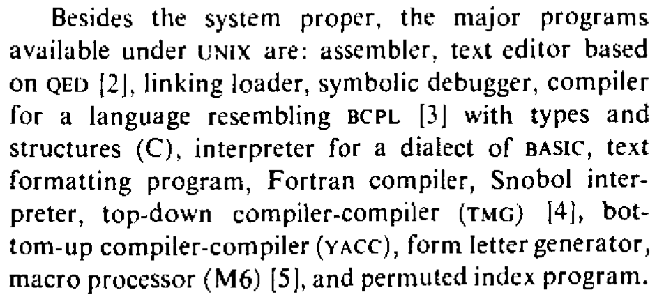
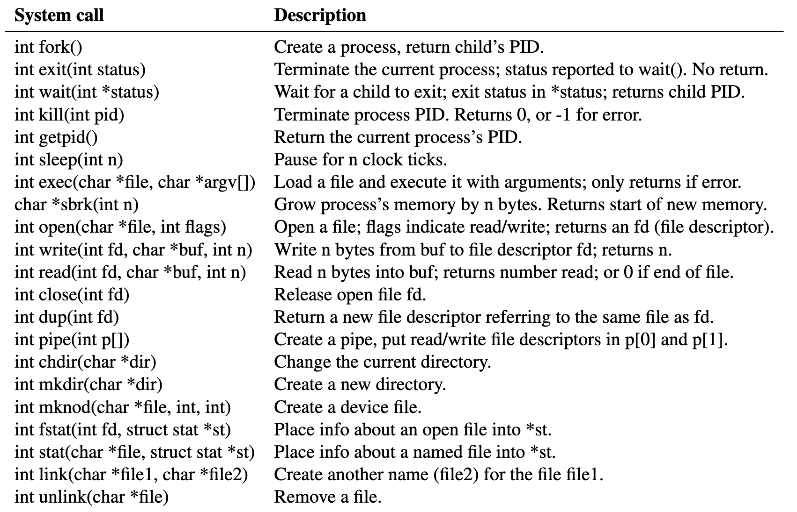
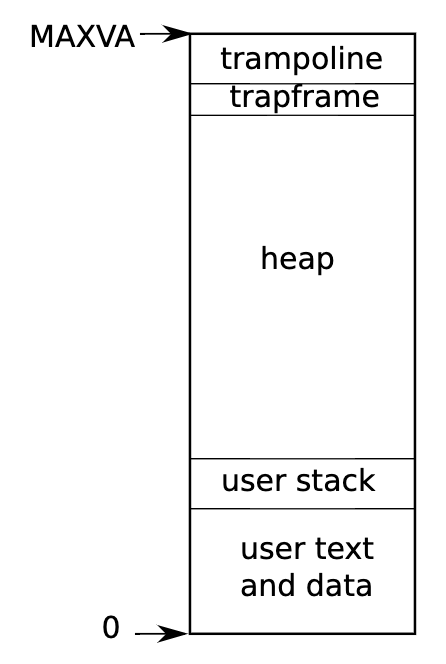

# xv6 代码导读

## Overview

复习

- 应用视角的操作系统：对象 + API
    - 把操作系统当提供服务的 “黑盒子” 

------

本次课回答的问题

- **Q**: 如何理解 “操作系统就是 C 程序”？

------

本次课主要内容

- xv6 简介
- xv6 代码导读

## 一、xv6 简介

### 1、UNIX 传奇

一万行代码得到一个真正的、好用的操作系统

- [The UNIX time sharing system](https://dl.acm.org/doi/10.1145/357980.358014) (SOSP'73 and CACM'74)
- 免费授权给高校使用，它实在太适合教学了！
    - [UNIX v6 book](http://jyywiki.cn/pages/OS/manuals/unix-v6-book.pdf)



### 2、xv6 系统调用 API

21 个系统调用 (参考 [sh-xv6.c](http://jyywiki.cn/pages/OS/2022/demos/sh-xv6.c) 使用的系统调用)



### 3、xv6: UNIX v6 的现代 “克隆”

接近完整的 UNIX Shell 体验

- 基本工具集 (wc, echo, cat, ...)
- 命令执行、管道、重定向
    - 支持多处理器
    - Now in RISC-V!

它真的是一个 “可用” 的操作系统！

- 时间回到 1970s
- 这些系统调用就足够支撑刚才提到的应用
    - cc, as, ld, vi, sed, awk, troff, lp, ...

### 4、xv6 系统实现

这是一份包含了很多 Good Practice 的代码

- 对初学者来说更像是一个 “艺术品”
- 从代码里吸取智慧
- 注释的方式，命名的方式等等

------

RTFM

- [xv6: A simple, Unix-like teaching operating system](http://jyywiki.cn/pages/OS/manuals/xv6-riscv-rev2.pdf)
- 宝藏手册，包含了所有细节和 “为什么要这么做”，推荐阅读

------

RTFSC

- [xv6-riscv](https://github.com/mit-pdos/xv6-riscv)
- 会分几次课讲解

**jyy 大佬在学习 linux 代码的时候也会看不懂，但是他会联想 linux 下的代码对应到 xv6 上是哪里，他就明白了**

### 5、项目构建与运行

RTFSC: Makefile

- 相比 AbstractMachine (跨平台/体系结构) 容易很多
- 先找到构建目标
    - 然后老规矩: `make -nB`
    - 你可以根据需要修改一些配置
        - 优化等级、CPU 数、编译指令等

------

复习：“程序的执行 (状态变化序列) 有时比代码 (状态机) 更容易理解”

- 可以用于配制 vscode
    - Quick quiz: 如何自动生成 `compile_commands.json`?

```bash
$ bear make qemu
```

所有的 vscode 中编译错误（所有的红线）就消失了

**正确的工具太重要了，好的工具会促使人愿意去读代码，帮助人克服惰性**

## 二、xv6 中的进程

### 1、xv6 进程的地址空间

回顾：进程 = 运行的状态机 (user/)

- gcc/ld 创建：代码、数据
    - 参考 ldscript
- 运行时分配：堆栈
    - 包含 exec 的参数
- 例子：`init.c` 和 `sh.c` ([sh-xv6.c](http://jyywiki.cn/pages/OS/2022/demos/sh-xv6.c) 的真身)

------

MAXVA 处有两个神奇的页面

- Trampoline 和 trapframe
    - 由操作系统分配，用户进程无权访问

