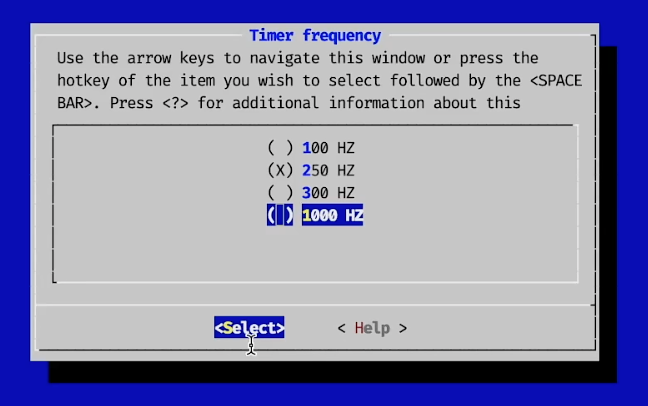
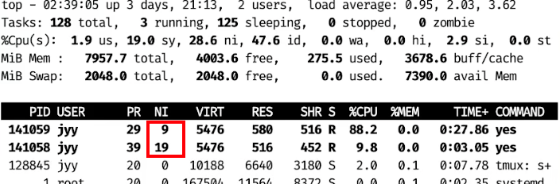
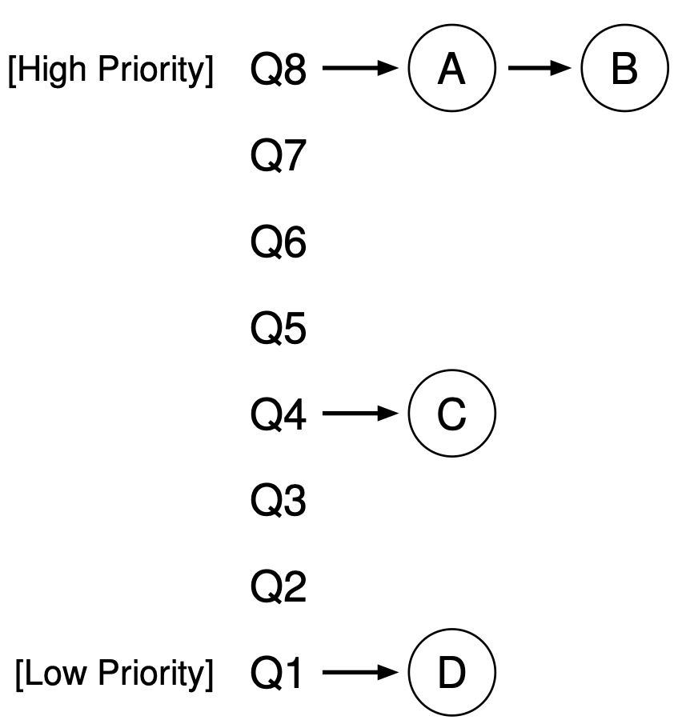
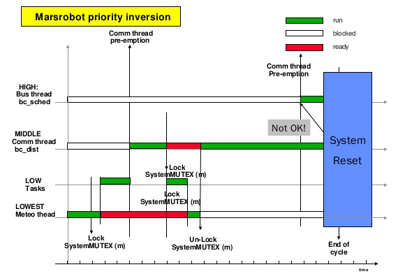
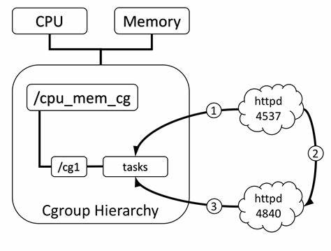
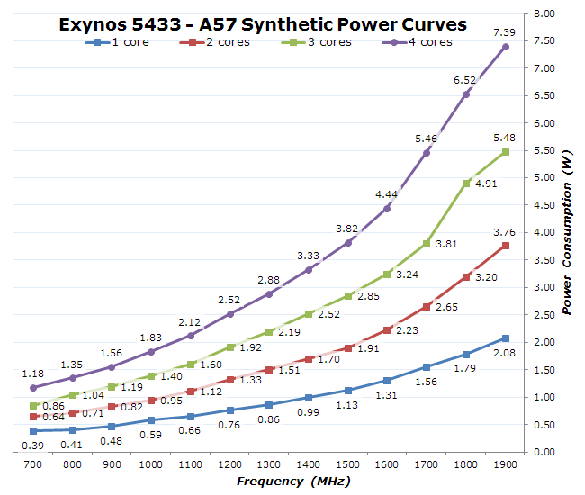
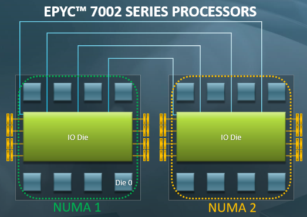

# 处理器调度

复习

- 机制 (mechanism)：上下文切换
    - 在中断/系统调用时执行操作系统代码
    - 操作系统实现所有状态机 (进程) 一视同仁的 “封存”
    - 从而可以恢复任意一个状态机 (进程) 执行

------

本次课回答的问题

- **Q**: 策略 (policy)：那我们到底选哪个进程执行呢？

------

本次课主要内容

- 常见调度算法：Round-Robin, 优先级, MLFQ, CFS
- 告诉大家为什么我们这门课不讲 “调度算法”

## 一、处理器调度 (1)

### 1、简化的处理器调度问题

中断机制

- 处理器以固定的频率被中断
    - Linux Kernel 可以配置：100/250/300/1000Hz
- 中断/系统调用返回时可以自由选择进程/线程执行



------

处理器调度问题的简化假设

- 系统中有一个处理器 (1970s)
- 系统中有多个进程/线程共享 CPU
    - 包括系统调用 (进程/线程的一部分代码在 syscall 中执行)
    - 偶尔会等待 I/O 返回，不使用 CPU (通常时间较长)

### 2、策略: Round-Robin

假设当前 Ti 运行

- 中断后试图切换到下一个线程 T(i+1)modn
- 如果下一个线程正在等待 I/O 返回，继续尝试下一个
    - 如果系统所有的线程都不需要 CPU，就调度 idle 线程执行

------

我们的 [thread-os.c](http://jyywiki.cn/pages/OS/2022/demos/thread-os.c) 实际上实现了 Round-Robin 的调度器

- 中断之间的线程执行称为 “时间片” (time-slicing)


### 3、策略：引入优先级

UNIX niceness

- -20 .. 19 的整数，越 nice 越让别人得到 CPU

    - -20: 极坏; most favorable to the process
    - 19: 极好; least favorable to the process

- 基于优先级的调度策略

    - RTOS: 坏人躺下好人才能上，先满足坏人的需求，好人等着
        - ~~好人流下了悔恨的泪水~~
    - Linux: nice 相差 10, CPU 资源获得率相差 10 倍

- 不妨试一试: nice/renice
    - 将一个进程只派到一个 cpu 上，`-c 0` 限制到 cpu0 上
    - `-n 19` 设置优先级


    taskset -c 0 nice -n 19 yes > /dev/null &
    taskset -c 0 nice -n  9 yes > /dev/null &



## 二、真实的处理器调度(1)

### 1、Round-Robin 的问题

系统里有两个进程

- 交互式的 Vim，单线程
- 纯粹计算的 [mandelbrot.c](http://jyywiki.cn/pages/OS/2022/demos/mandelbrot.c), 32 个线程

------

Round-Robin

- Vim 花 0.1ms 处理完输入就又等输入了
    - 主动让出 CPU
- Mandelbrot 使 Vim 在有输入可以处理的时候被延迟
    - 必须等当前的 Mandelbrot 转完一圈
    - 数百 ms 的延迟就会使人感到明显卡顿
- 你们会在 L2 里遇到这样的问题
    - 表现形式：tty 卡顿

### 2、策略：动态优先级 (MLFQ)

不会设置优先级？让系统自动设定！



- 设置若干个 Round-Robin 队列
    - 每个队列对应一个优先级
- 动态优先级调整策略
    - 优先调度高优先级队列
    - 用完时间片 → 坏人
        - Mandelbrot: 请你变得更好
    - 让出 CPU I/O → 好人
        - Vim: 你可以变得更坏
- 阅读教科书

### 3、策略：Complete Fair Scheduling (CFS)

试图去模拟一个 “Ideal Multi-Tasking CPU”: 

- “Ideal multi-tasking CPU” is a (non-existent :-)) CPU that has 100% physical power and which can run each task at precise equal speed, in parallel, each at . For example: if there are 2 tasks running, then it runs each at 50% physical power — i.e., actually in parallel.

------

“让系统里的所有进程尽可能公平地共享处理器”

- 为每个进程记录精确的运行时间
- 中断/异常发生后，切换到运行时间最少的进程执行
    - 下次中断/异常后，当前进程的可能就不是最小的了

### 4、CFS: 实现优先级

操作系统具有对物理时钟的 “绝对控制”，**把物理的时间变成虚拟的时间**

- 每人执行 1ms，但好人的钟快一些，坏人的钟慢一些
    - vruntime (virtual runtime)
    - vrt[i] / vrt[j] 的增加比例 = wt[j] / wt[i]

```c
const int sched_prio_to_weight[40] = {
  /* -20 */ 88761, 71755, 56483, 46273, 36291,
  /* -15 */ 29154, 23254, 18705, 14949, 11916,
  /* -10 */  9548,  7620,  6100,  4904,  3906,
  /*  -5 */  3121,  2501,  1991,  1586,  1277,
  /*   0 */  1024,   820,   655,   526,   423,
  /*   5 */   335,   272,   215,   172,   137,
  /*  10 */   110,    87,    70,    56,    45,
  /*  15 */    36,    29,    23,    18,    15,
};
```

### 5、CFS 的复杂性 (1): 新进程/线程

子进程继承父进程的 vruntime

- 并且从 2.6.32 开始，[parent run first](https://lkml.org/lkml/2009/9/11/411)

```c
static void task_fork_fair(struct task_struct *p) {
  struct sched_entity *se = &p->se, *curr;
  ...
  rq_lock(rq, &rf);
  update_rq_clock(rq);
  cfs_rq = task_cfs_rq(current);
  curr = cfs_rq->curr;
  if (curr) {
    update_curr(cfs_rq);
    se->vruntime = curr->vruntime; // 继承父进程的 vruntime
  }
  place_entity(cfs_rq, se, 1);
  ...
```

### 6、CFS 的复杂性 (2): I/O

I/O (例如 1 分钟) 以后回来 vruntime 严重落后

- 为了赶上，CPU 会全部归它所有

------

Linux 的实现

- 被唤醒的进程获得 “最小” 的 vruntime (可以立即被执行)
    - 曾经会给唤醒的进程一些额外的 vruntime
    - 现在没有了

```c
if (renorm && curr)
  se->vruntime += cfs_rq->min_vruntime;
```

### 7、CFS 的复杂性 (3): 整数溢出

vruntime 有优先级的 “倍数”

- 如果溢出了 64-bit 整数怎么办……？
    - `a < b` 不再代表 “小于”！

------

假设：系统中最近、最远的时刻差不超过数轴的一半

- 我们可以比较它们的相对大小

```c
bool less(u64 a, u64 b) {
  return (i64)(a - b) < 0;
}
```

### 8、实现 CFS 的数据结构

用什么数据结构维护所有进程的 vruntime?

- 任何有序集合 (例如 binary search tree) 维护线程 t 的 vrt(t)
    - 更新 vrt(t)←vrt(t)+Δt/w
    - 取最小的 vrt
    - 进程创建/退出/睡眠/唤醒时插入/删除 t

------

道理还挺简单的

- 代码实现有困难
- 还不能有并发 bug……

### 9、小结：是否解决了问题？

考虑三种情况：Producer, Consumer, `while (1)`

- Round-Robin (L2)
    - Producer/Consumer 获得非常少比例的 CPU
- MLFQ
    - Producer/Consumer 获得最高优先级 Round-Robin
    - `while (1)` 完全饥饿 → 需要定期把所有人优先级 “拉平”
- CFS
    - 线程有精确的 accounting 信息
    - 这些信息可以指导 Round-Robin
        - 适当使用 uptime (不必太精确) 可以大幅缓解 L2

## 三、真实的处理器调度 (2)

### 1、不要高兴得太早（优先级反转）

```c
void xiao_zhang() { // 高优先级
  sleep(1); // 休息一下先
  mutex_lock(&wc);
  ...
}

void xi_zhu_ren() { // 中优先级
  while (1) ;
}

void jyy() { // 最低优先级
  mutex_lock(&wc);
  ...
}
```

jyy 在持有互斥锁的时候被赶下了处理器……

### 2、这个故事在火星上发生过一次

Sojourner “探路者” (PathFinder)，1997 年 7 月 4 日登陆火星

### 3、[The First Bug on Mars](https://news.ycombinator.com/item?id=13210478)

Sojourner “探路者” (PathFinder)

- Lander (登陆舱)
    - IBM Rad6000 SC (20 MIPS), 128 MiB RAM, 6 MiB EEPROM
    - VxWorks “实时” 任务操作系统
        - ASI/MET task: 大气成分监测 (低)
        - `bc_dist` task: 分发任务 (中)
        - `bc_sched` task: 总线调度 (高)
- Rover (火星车)
    - Intel 80C85 (0.1 MIPS), 512K RAM, 176K Flash SSD
- 着陆后开始出现系统重启



- (低优先级) `select -> pipeIoctl -> selNodeAdd -> mutex_lock`
- (高优先级) `pipeWrite -> mutex_lock`

### 4、解决优先级反转问题

Linux: CFS 凑合用吧

- 实时系统：火星车在 CPU Reset 啊喂？？
    - 优先级继承 (Priority Inheritance)/优先级提升 (Priority Ceiling)
        - 持有 mutex 的线程/进程会继承 block 在该 mutex 上进程的最高优先级
        - 但也不是万能的 (例如条件变量唤醒)
    - 在系统中动态维护资源依赖关系
        - 优先级继承是它的特例
        - 似乎更困难了……
    - 避免高/低优先级的任务争抢资源
        - 对潜在的优先级反转进行预警 (lockdep)
        - TX-based: 冲突的 TX 发生时，总是低优先级的 abort

## 四、真实的处理器调度 (3)

### 1、多处理器调度

还没完：我们的计算机系统可是多核心、多线程的！

- 我们的老服务器：2 Socket x 24 Cores x 2 Threads = 96T


### 2、多处理器调度：被低估的复杂性

> “And you have to realize that there are not very many things that have aged as well as the scheduler. Which is just another proof that scheduling is easy.” ——Linus Torvalds, 2001

------

Linus 以为调度是个挺简单的问题？

- As a central part of resource management, the OS thread scheduler must maintain the following, simple, invariant:make sure that ready threads are scheduled on available cores... this invariant is often broken in Linux. Cores may stay idle for seconds while ready threads are waiting in runqueues.
    - [The Linux scheduler: A decade of wasted cores](https://dl.acm.org/doi/10.1145/2901318.2901326).  (EuroSys'16)
        - 作者在狂黑 Linus 😂

### 3、多处理器调度的困难所在

既不能简单地 “分配线程到处理器”

- 线程退出，瞬间处理器开始围观

------

也不能简单地 “谁空丢给谁”

- 在处理器之间迁移会导致 cache/TLB 全都白给

------

多处理器调度的两难境地

- 迁移？可能过一会儿还得移回来
- 不迁移？造成处理器的浪费

### 4、实际情况 (1): 多用户、多任务

还是刚才服务器的例子

- 马上要到 paper deadline 了，A 和 B 要在服务器上跑实验
    - A 要跑一个任务，因为要调用一个库，只能单线程跑
    - B 跑并行的任务，创建 1000 个线程跑
        - B 获得几乎 100% 的 CPU

------

更糟糕的是，优先级解决不了这个问题……

- B 不能随便提高自己进程的优先级
    - “An unprivileged user can only increase the nice value and such changes are irreversible...”

### 5、Linux Namespaces Control Groups (cgroups)

namespaces (7), cgroups (7)

- 轻量级虚拟化，创造 “操作系统中的操作系统”
    - Mount, pid, network, IPC, user, cgroup namespace, time
    - cgroup 允许以进程组为单位管理资源
        - Docker 就变得很容易实现了



### 6、实际情况 (2): Big.LITTLE/能效比

Snapdragon 888

- 1X Prime Cortex-X1 (2.84GHz)
- 3X Performance Cortex-A78 (2.4GHz)
- 4X Efficiency Cortex-A55 (1.8GHz)

------

“Dark silicon” 时代的困境

- 功率无法支撑所有电路同时工作
- 总得有一部分是停下的
- Linux Kernel [EAS](https://www.kernel.org/doc/html/latest/scheduler/sched-energy.html) (Energy Aware Scheduler)


软件可以配置 CPU 的工作模式

- 开/关/工作频率 (频率越低，能效越好)
- 如何在给定功率下平衡延迟 v.s. 吞吐量？



### 7、实际情况 (3): Non-Uniform Memory Access

共享内存只是假象

- L1 Cache 花了巨大的代价才让你感到内存是共享的
- Producer/Consumer 位于同一个/不同 module 性能差距可能很大



### 8、程序执行比你想象得复杂

基本的假设可能不再成立

- 例子: more CPU time, more progress
    - 我们课堂上的例子就可以 challenge 这一点
    - [sum-atomic.c](http://jyywiki.cn/pages/OS/2022/demos/sum-atomic.c)

```
$ time taskset -c 0   ./a.out
$ time taskset -c 0,1 ./a.out
```

------

分配了 1/2 的处理器资源，反而速度更快了

- 系统里进程的行为和交互是非常复杂的……
    - NUMA 里尤其重要 (当然上面的例子是个 performance bug）

### 9、实际情况 (4): CPU Hot-plug

😂😂😂 我讲不下去了

- 实在是太复杂了
- 我不是代码的维护者，并不清楚这些细节
    - 把上面都加起来
        - 这得考虑多少情况，写多少代码……

------

复杂的系统无人可以掌控

- [The battle of the schedulers: FreeBSD ULE vs. Linux CFS](https://www.usenix.org/system/files/conference/atc18/atc18-bouron.pdf).(ATC'18)
    - 结论：在现实面前，没有绝对的赢家和输家
    - 如果你追求极致的性能，就不能全指望一个调度算法

### 10、回到处理器调度

调度是复杂、有着深远考虑的困难问题

- 下个时间片有 10,000,000 个时钟周期，分配给哪个线程？
- 学校预算 10,000,000 经费，怎么分给院系？
- 发改委下拨 1000,000,000,000 经费，怎么分给大家？

------

巨大的设计空间

- 建模 (理解和总结 “过去发生了什么”)
    - profiling 和 trace; PMU
- 预测 (试图预知未来可能发生什么)
- 决策 (应该如何调整系统行为)

### 11、谁来完成建模-预测-决策？

操作系统不 (完全) 背这个锅

- 让程序提供 scheduling hints
- [ghOSt: Fast & flexible user-space delegation of Linux scheduling](https://dl.acm.org/doi/10.1145/3477132.3483542)(SOSP'21)


## 总结

本次课回答的问题

- **Q**: 中断后到底应该把哪个进程/线程调度到处理器上？

------

Take-away messages

- 机制 (做出来) 和策略 (做得好)
    - 构建复杂系统的常用方法
- 真实世界的处理器调度
    - 异构处理器 + Non-Uniform Memory Access
    - 优先级翻转
    - 教科书上的内容随时可能会被改写