# 存储设备原理

## Overview

复习

- 操作系统
  - 状态机的管理者
  - 对象 + API

------

本次课回答的问题

- **Q1**: 状态机的状态是如何存储的？
- **Q2**: 更多的持久状态是如何存储的？

------

本次课主要内容

- 1-bit 的存储方式
- Volatile/non-volatile storage

## 一、状态机状态的存储

### 1、计算机需要存储 “当前状态”

机器指令模型 (Instruction Set Architecture) 只有 “两种” 状态

- 寄存器: rax, rbx, ..., cr3, ...
- 物理内存

------

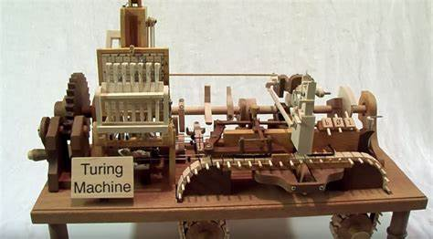

存储 “当前状态” 的需求

- 可以寻址
  - 根据编号读写数据
- 访问速度尽可能快
  - 甚至不惜规定 **状态在掉电后丢失**
    - 机械玩具就没有这个烦恼
  - 也因此有了 memory hierarchy

### 2、“当前状态” 的存储

Delay line: 绳子

- 因为信号衰减，需要持续放大

------

Magnetic core: [磁铁](https://corememoryshield.com/index.html)

- [segfault.c](http://jyywiki.cn/pages/OS/2022/demos/segfault.c): “Segmentation fault (core dumped)”
  - ulimit -c 可以修改 core file size (默认为 0)
  - `/proc/sys/kernel/core_pattern` 指定了 core dump 文件格式
- Non-volatile memory!

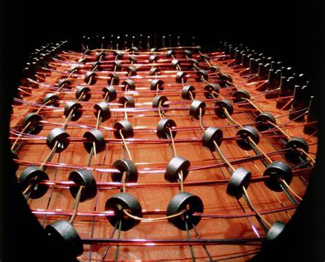

------

SRAM/DRAM: Flip-Flop 和电容

- 今天的实现方案

### 3、开始持久化之旅

> Persistence: “*A firm or obstinate continuance in a course of action in spite of difficulty or opposition*.”
>
> 除了 “当前状态”，我们希望更大、更多的数据能 “留下来” (并且被操作系统有效地管理起来)

持久化的第一课：持久存储介质

- 构成一切文件的基础
  - 逻辑上是一个 bit/byte array
  - 根据局部性原理，允许我们按 “大块” 读写
- 评价方法：价格、容量、速度、可靠性
  - 再次见证人类文明的高光时刻！

## 二、存储介质：磁

### 1、“持久化” 可能没有想象的那么困难

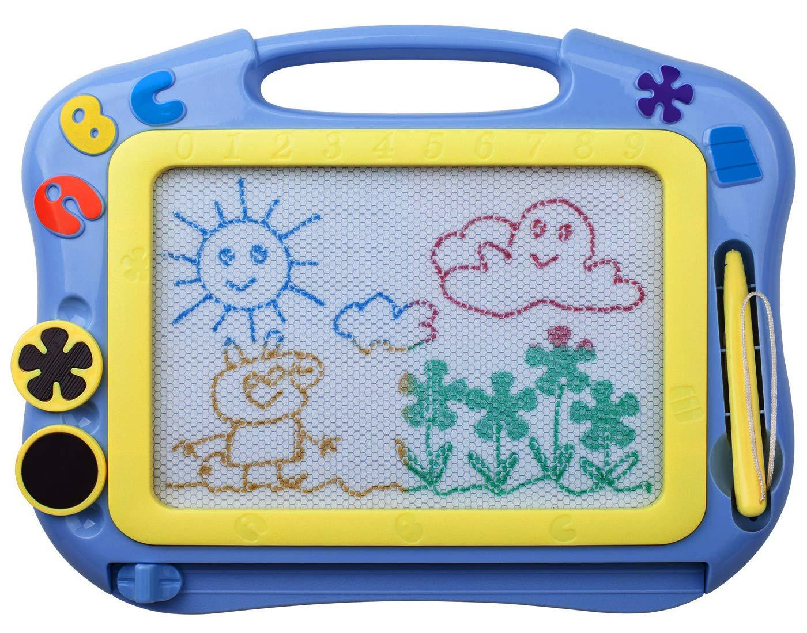

更进一步：用铁磁体的 “磁化方向” 表示 1-Bit 信息

- 读取：放大感应电流
- 写入：电磁铁磁化磁针

### 2、磁带 (Magnetic Tape, 1928)

1D 存储设备

- 把 Bits “卷起来”
  - 纸带上均匀粘上铁磁性颗粒
- 只需要一个机械部件 (转动) 定位

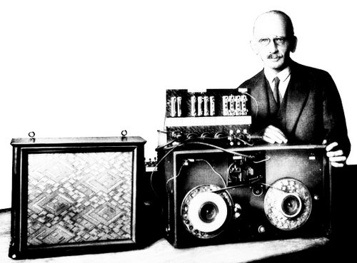

### 3、磁带：作为存储设备的分析

分析

- 价格
  - **非常低** - 都是廉价的材料
- 容量
  - **非常高**
- 读写速度
  - 顺序读取：**勉强** - 需要等待定位
  - 随机读取：**几乎完全不行**
- 可靠性
  - **存在机械部件、需要保存的环境苛刻**

今天的应用场景

- 冷数据的存档和备份

### 4、磁鼓 (Magnetic Drum, 1932)

1D → 1.5D (1D x n)

- 用旋转的二维平面存储数据
  - 无法内卷，容量变小
- 读写延迟不会超过旋转周期
  - 随机读写速度大幅提升

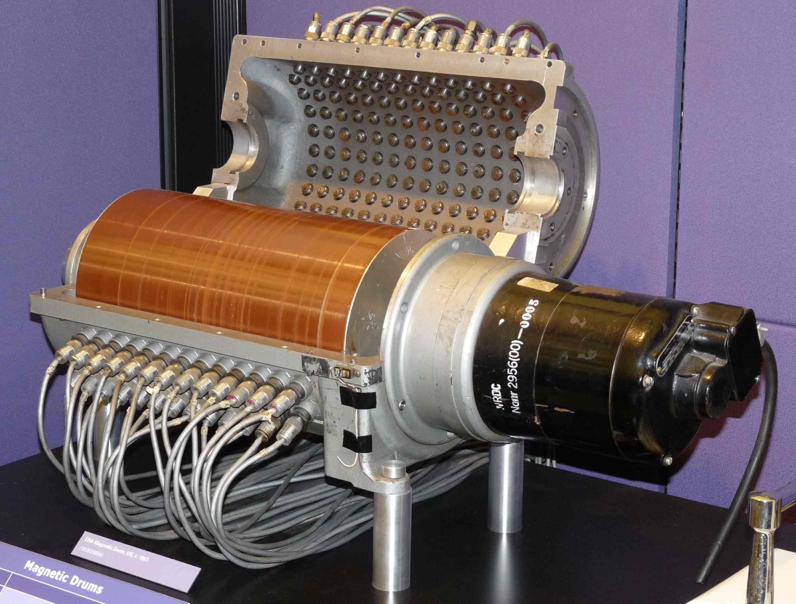

### 5、磁盘 (Hard Disk, 1956)

1D → 2.5D (2D x n)

- 在二维平面上放置许多磁带

克服许多工程挑战

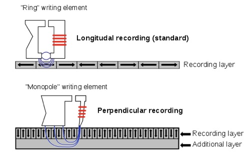

### 6、磁盘：作为存储设备的分析

分析

- 价格
  - **低** - 密度越高，成本越低
- 容量
  - **高** (2.5D) - 平面上可以有数万个磁道
- 读写速度
  - 顺序读取：**较高**
  - 随机读取：**勉强**
- 可靠性
  - **存在机械部件，磁头划伤盘片导致数据损坏**

今天的应用场景

- 计算机系统的主力数据存储 (~~海量数据：便宜才是王道~~)

### 7、磁盘：性能调优

为了读/写一个扇区

1. 读写头需要到对应的磁道
   - 7200rpm → 120rps → “寻道” 时间 8.3ms
2. 转轴将盘片旋转到读写头的位置
   - 读写头移动时间通常也需要几个 ms

------

通过缓存/调度等缓解

- 例如著名的 “电梯” 调度算法
- 现代 HDD 都有很好的 firmware 管理磁盘 I/O 调度
  - `/sys/block/[dev]/queue`
  - `[mq-deadline] none` (读优先；但写也不至于饿死)

### 8、软盘 (Floppy Disk, 1971)

把读写头和盘片分开——实现数据移动

- 计算机上的软盘驱动器 ([drive](https://www.bilibili.com/video/BV1BS4y1X76n)) + 可移动的盘片
  - 8" (1971), 5.25" (1975), 3.5" (1981)
    - 最初的软盘成本很低，就是个纸壳子
    - 3.5 英寸软盘为了提高可靠性，已经是 “硬” 的了

### 9、软盘：作为存储设备的分析

分析

- 价格
  - **低** - 塑料、盘片和一些小材料
- 容量
  - **低** (暴露的存储介质，密度受限)
- 读写速度
  - 顺序/随机读取：**低**
- 可靠性
  - **低** (暴露的存储介质)

今天的应用场景

- 躺在博物馆供人参观
- 彻底被 USB Flash Disk 杀死

## 三、存储介质：坑

### 1、坑：天然容易 “阅读” 的数据存储

### 2、Compact Disk (CD, 1980)

在反射平面 (1) 上挖上粗糙的坑 (0)

- 激光扫过表面，就能读出坑的信息来
  - 飞利浦 (碟片) 和索尼 (数字音频) 发明
  - ~700 MiB，在当时是非常巨大的容量

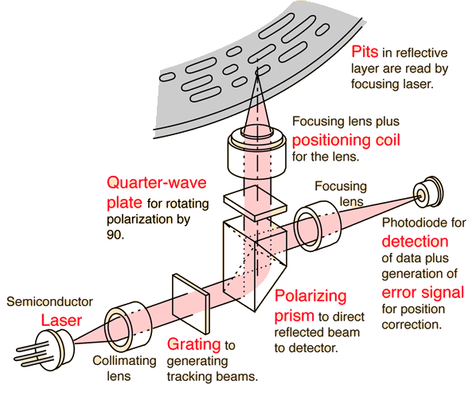

### 3、CD-RW

能否克服只读的限制？

- 方法 1
  - 用激光器烧出一个坑来 (“刻盘”)
  - 使用持久化数据结构 (append-only)

------

- 方法 2：改变材料的反光特性
  - PCM (Phase-change Material)
  - [How do rewriteable CDs work?](https://www.scientificamerican.com/article/how-do-rewriteable-cds-wo/)

### 4、挖坑的技术进展

CD (740 MB)

- 780nm 红外激光

------

DVD (4.7 GB)

- 635nm 红色激光

------

Blue Ray (100 GB)

- 405nm 蓝紫色激光

### 5、光盘：作为存储设备的分析

分析

- 价格
  - **很低** (而且很容易通过 “压盘” 复制)
- 容量
  - **高**
- 读写速度
  - **顺序读取速度高；随机读取勉强**
  - **写入速度低** (挖坑容易填坑难)
- 可靠性
  - **高**

今天的应用场景

- 数字媒体的分发 (即将被互联网 “按需分发” 淘汰)

### 6、“挖坑”：不止是数据存储

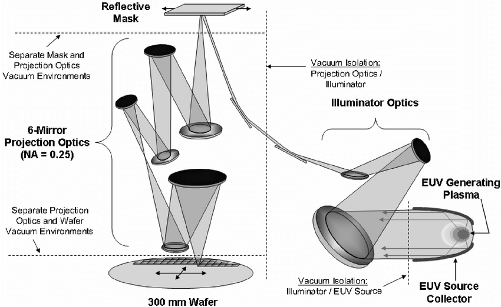

## 四、Finally, 电

### 1、Solid State Drive (1991)

之前的持久存储介质都有致命的缺陷

- 磁：机械部件导致 ms 级 延迟
- 坑 (光): 一旦挖坑，填坑很困难 (CD 是只读的)

最后还得靠**电** (电路) 解决问题

- Flash Memory “闪存”
  - Floating gate 的充电/放电实现 1-bit 信息的存储

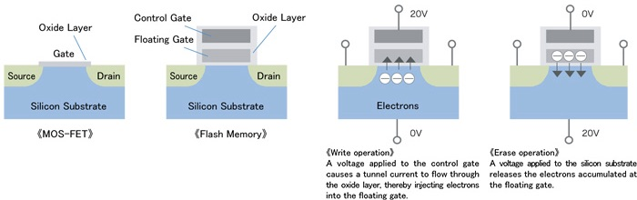

 

### 2、Flash Memory: 几乎全是优点

分析

- 价格
  - **低** (大规模集成电路，便宜)
- 容量
  - **高** (3D 空间里每个 (x,y,z) 都是一个 bit)
- 读写速度
  - **高**(直接通过电路读写)
    - 不讲道理的特性：容量越大，速度越快 (电路级并行)
    - 快到淘汰了旧的 SATA 接口标准 (NVMe)
- 可靠性
  - **高** (没有机械部件，随便摔)

------

但有一个意想不到的**缺点** (大家知道是什么吗？)

### 3、USB Flash Disk (1999)

优盘容量大、速度快、相当便宜

- 很快就取代了软盘，成为了人手n个的存储介质
  - Compact Flash (CF, 1994)
  - USB Flash Disk (1999, “朗科”)

------

放电 (erase) 做不到 100% 放干净

- 放电**数千/数万次**以后，就好像是 “充电” 状态了
- dead cell; “wear out”
  - 必须解决这个问题 SSD 才能实用

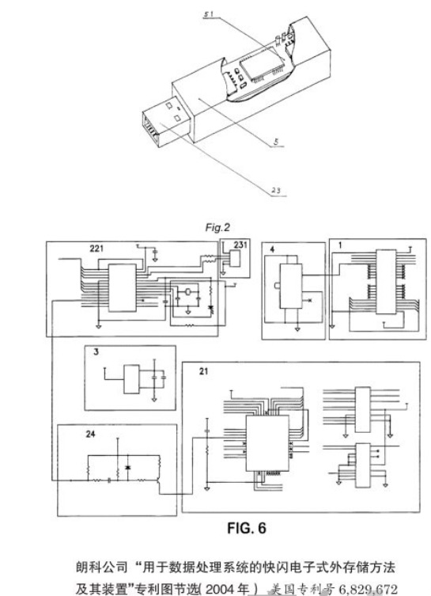

### 4、NAND Wear-Out 的解决：软件定义磁盘

每一个 SSD 里都藏了一个完整的计算机系统

- FTL: Flash Translation Layer
  - “Wear Leveling”: 软件管理那些可能出问题的 blocks
  - 像是 managed runtime (with garbage collection)
    - 请阅读教科书

### 5、优盘和 SSD 的区别

优盘, SD 卡, SSD 都是 NAND Flash

- 但软件/硬件系统的复杂程度不同，效率/寿命也不同
  - 典型的 SSD
    - CPU, on-chip RAM, 缓存, store buffer, 操作系统 ...
    - 寿命: ~1 PiB 数据写入 (~1,000 年寿命)
  - SD 卡
    - SDHC 标准未规定
      - 黑心商家一定会偷工减料 (毕竟接口完全一样)
    - 但良心厂家依然有 [ARM 芯片](https://www.bunniestudios.com/blog/?p=898)

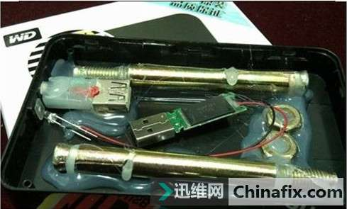

------

**一定不要用便宜的优盘保存重要数据**

- × 宝 9.9 包邮的优盘，芯片一毛钱都能省……

### 6、FTL: 性能、可靠性、安全性的难题

大家可记得修电脑引发的血案？

- 首先，(快速) 格式化是没用的
  - (M5 会告诉你这一点)
- 在你理解了 FTL 之后
  - 即便格式化后写入数据 (不写满)
    - 同一个 logic block 被覆盖，physical block 依然存储了数据 (copy-on-write)
    - 需要文件系统加密

------

另一个 memory system 相关的安全问题

- [Row Hammer](https://ieeexplore.ieee.org/document/8708249)(TCAD'19)
  - 更重的负载可能会 “干扰” 临近的 DRAM Cells

### 7、SSD 的可靠性：另一个故事

什么？硬件里的软件？

- 其实非常复杂：算法, cache; store buffer; ...

谁写出来的？那可得有 bug 啊！

- 让我们好好构造疯狂的 workloads，把它弄挂吧！
  - [Understanding the robustness of SSDs under power fault](https://dl.acm.org/doi/10.5555/2591272.2591300) (FAST'13)

### 8、有趣的故事：结果

这篇 paper 促进了硬件厂商对 FTL 的大幅改进

- 在 2015 年之后出产的产品，已经几乎无法找到这样的问题了 (cool!)

------

| Device                | Model | Year                     | Bug? |
| :-------------------- | :---- | :----------------------- | :--- |
| SSD#1, 10, 8, 9, 6, 2 | A     | 2011 x 3, 2012 x 2, 2010 | Y    |
| SSD#2                 | B     | 2010                     | Y    |
| SSD#3, 11, 12         | C     | 2011                     | Y    |
| SSD#4, 13             | D     | 2011                     | -    |
| SSD#5, 14, 7, 15      | E     | 2009, 2011 x 2, 2012     | Y    |

## 总结

本次课回答的问题

- **Q**: 状态机的状态和持久的状态是如何存储的？

------

Take-away messages

- 1-Bit 信息的存储
  - 磁 (磁带、磁盘)、坑 (光盘)、电 (Flash SSD)
  - 构成性格各异的**存储设备**
- 重新思考 “状态的存储”
  - NVM 来了：主存的机器状态不会断电丢失
    - 但寄存器/缓存依然是 volatile 的
  - 计算机系统是否会经历彻底的 “重新设计”？
    - [Operating system implications of fast, cheap, non-volatile memory](https://dl.acm.org/doi/10.5555/1991596.1991599) (HotOS'13)