# 输入输出设备

## Overview

复习

- 1-Bit 的存储
  - Volatile: Delay line, SRAM/DRAM
  - Non-volatile: 磁 (磁芯/磁带/磁鼓/软盘/硬盘)、坑 (光盘)、电 (NAND Flash; SSD)

------

本次课回答的问题

- **Q**: 器件之上的 “设备” 到底是什么？

------

本次课主要内容

- 计算机与外设的接口
- 总线、中断控制器和 DMA
- GPU 和异构计算

## 一、计算机与世界的接口

### 1、孤独的 CPU

CPU 只是 “无情的指令执行机器”

- 取指令、译码、执行

------

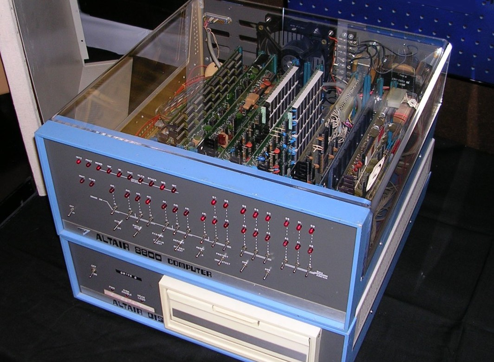


Altair-8800 (1975), with [Intel 8080A](http://jyywiki.cn/pages/OS/manuals/i8080.pdf); 256B 板卡 RAM

(你需要在面板上手工输入执行指令的起始地址)

### 2、从一个需求说起

如何用计算机实现核弹发射箱？

- 关键问题：如何使计算机能**感知外部状态、对外实施动作**？
  - 我们使用的并不是计算设备，而是 I/O 设备！

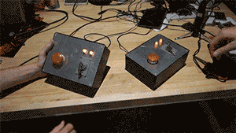

 

### 3、I/O 设备：“计算” 和 “物理世界” 之间的桥梁

I/O 设备 (CPU 视角)：“**一个能与 CPU 交换数据的接口/控制器**”

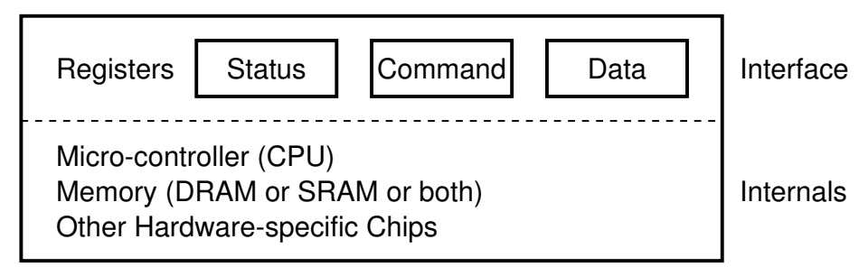

说人话

- 就是 “几组约定好功能的线” (RTFM)
  - 通过握手信号从线上读出/写入数据
- 每一组线有自己的地址
  - CPU 可以直接使用指令 (in/out/MMIO) 和设备交换数据
  - (CPU 完全不管设备具体是如何实现的)

### 4、例子 (1): 串口 (UART)

“COM1”; `putch()` 的实现

```c
#define COM1 0x3f8

static int uart_init() {
  outb(COM1 + 2, 0);   // 控制器相关细节
  outb(COM1 + 3, 0x80);
  outb(COM1 + 0, 115200 / 9600);
  ...
}

static void uart_tx(AM_UART_TX_T *send) {
  outb(COM1, send->data);
}

static void uart_rx(AM_UART_RX_T *recv) {
  recv->data = (inb(COM1 + 5) & 0x1) ? inb(COM1) : -1;
}
```

### 5、例子 (2): 键盘控制器

IBM PC/AT 8042 PS/2 (Keyboard) Controller

- “硬编码” 到两个 I/O port: `0x60` (data), `0x64` (status/command)

| Command Byte | Use          | 说明                            |
| :----------- | :----------- | :------------------------------ |
| 0xED         | LED 灯控     | ScrollLock/NumLock/CapsLock     |
| 0xF3         | 设置重复速度 | 30Hz - 2Hz; Delay: 250 - 1000ms |
| 0xF4/0xF5    | 打开/关闭    | N/A                             |
| 0xFE         | 重新发送     | N/A                             |
| 0xFF         | RESET        | N/A                             |

参考 AbstractMachine 的键盘部分实现

### 6、例子 (3): 磁盘控制器

ATA (Advanced Technology Attachment)

- IDE (Integrated Drive Electronics) 接口磁盘
  - primary: `0x1f0 - 0x1f7`; secondary: `0x170 - 0x177`

```c
void readsect(void *dst, int sect) {
  waitdisk();
  out_byte(0x1f2, 1);          // sector count (1)
  out_byte(0x1f3, sect);       // sector
  out_byte(0x1f4, sect >> 8);  // cylinder (low)
  out_byte(0x1f5, sect >> 16); // cylinder (high)
  out_byte(0x1f6, (sect >> 24) | 0xe0); // drive
  out_byte(0x1f7, 0x20);       // command (write)
  waitdisk();
  for (int i = 0; i < SECTSIZE / 4; i ++)
    ((uint32_t *)dst)[i] = in_long(0x1f0); // data
}
```

### 7、例子 (4): 打印机

[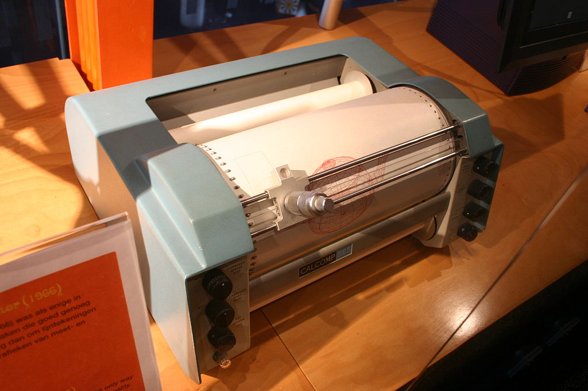](http://jyywiki.cn/pages/OS/manuals/CalComp-Software-Reference.pdf)

打印机：将字节流描述的文字/图形打印到纸张上

- 可简单 (打字机)
- 可复杂 (编程语言描述的图形)
  - 高清全页图片的传输是很大的挑战

------

例子：PostScript (1984)

- 一种描述页面布局的 domain-specific language
  - 类似于汇编语言
  - 可以用 “编译器” (例如 latex) 创建高质量的文稿
- PDF 是它的 superset ([page.ps](http://jyywiki.cn/pages/OS/2022/demos/page.ps))
  - 打印机是另一个带 CPU 的设备

## 二、总线、中断控制器和 DMA

### 1、越来越多的 I/O 设备

如果你只造 “一台计算机”

- 随便给每个设备定一个端口/地址，用 mux 连接到 CPU 就行
  - 你们的实验 (AbstractMachine) 和自制 CPU 就是这么做的

------

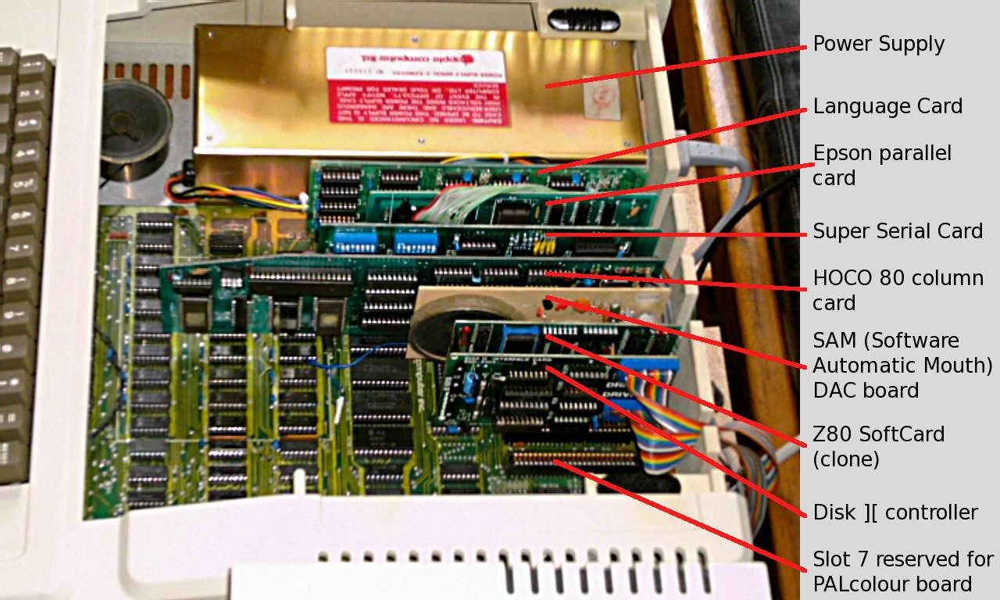但如果你希望给未来留点空间？

- 想卖大价钱的 “大型机”
  - IBM, DEC, ...
- 车库里造出来的 “微型机”
  - 名垂青史的梦想家
- 都希望接入更多 I/O 设备
  - **甚至是未知的设备，但不希望改变 CPU**？

### 2、总线：一个特殊的 I/O 设备

提供**设备的注册**和**地址到设备的转发**

- 把收到的地址 (总线地址) 和数据转发到相应的设备上
- 例子: port I/O 的端口就是总线上的地址
  - IBM PC 的 CPU 其实只看到这一个 I/O 设备

------

**这样 CPU 只需要直连一个总线** 就行了！

- 今天 PCI 总线肩负了这个任务
  - 总线可以桥接其他总线 (例如 PCI → USB)
- `lspci -tv`和 `lsusb -tv`: 查看系统中总线上的设备
  - 概念简单，实际非常复杂……
    - 电气特性、burst 传输、中断、[Plug and Play](http://jyywiki.cn/OS/2022/slides/Windows 蓝屏)……

### 3、例子：PCI Device Probe

[pci-probe.c](http://jyywiki.cn/pages/OS/2022/demos/pci-probe.c) (AbstractMachine, x86-64/i386)

- 试着给 QEMU 增加 `-soundhw ac97` 的运行选项

```c
for (int bus = 0; bus < 256; bus++)
  for (int slot = 0; slot < 32; slot++) {
    uint32_t info = pciconf_read(bus, slot, 0, 0);
    uint16_t id   = info >> 16, vendor = info & 0xffff;
    if (vendor != 0xffff) {
      printf("%02d:%02d device %x by vendor %x", bus, slot, id, vendor);
      if (id == 0x100e && vendor == 0x8086) {
        printf(" <-- This is an Intel e1000 NIC card!");
      }
      printf("\n");
    }
  }
```

### 4、中断控制器

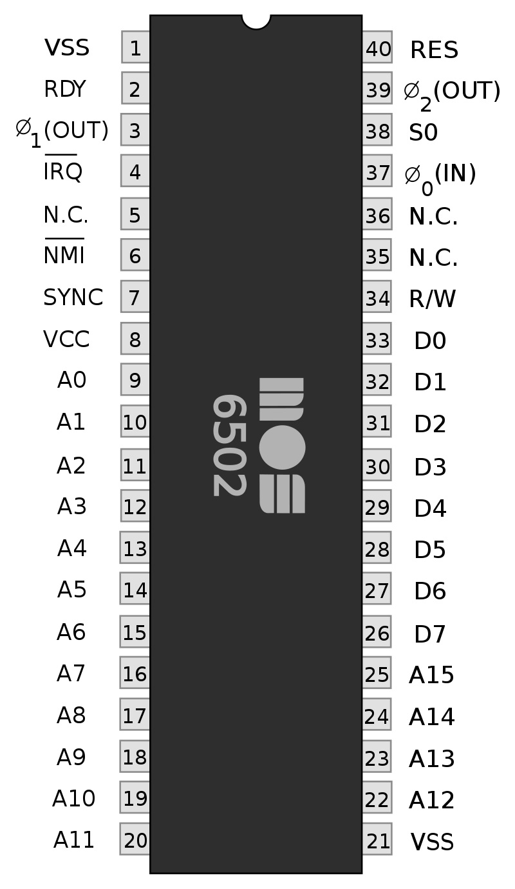

CPU 有一个中断引脚

- 收到某个特定的电信号会触发中断
  - 保存 5 个寄存器 (cs, rip, rflags, ss, rsp)
  - 跳转到中断向量表对应项执行

------

系统中的其他设备可以向中断控制器连线

- Intel 8259 PIC
  - programmable interrupt controller
  - 可以设置中断屏蔽、中断触发等……
- APIC (Advanced PIC)
  - local APIC: 中断向量表, IPI, 时钟, ……
  - I/O APIC: 其他 I/O 设备

### 5、中断没能解的问题

假设程序希望写入 1 GB 的数据到磁盘

- 即便磁盘已经准备好，依然需要非常浪费缓慢的循环
- out 指令写入的是设备缓冲区，需要去总线上绕一圈
  - cache disable; store 其实很慢的

```c
for (int i = 0; i < 1 GB / 4; i++) {
  outl(PORT, ((u32 *)buf)[i]);
}
```

------

能否把 CPU 从执行循环中解放出来？

- 比如，在系统里征用一个小 CPU，专门复制数据?
- 好像 `memcpy_to_port(ATA0, buf, length);`

### 6、Direct Memory Access (DMA)

DMA: **一个专门执行 “`memcpy`” 程序的 CPU**

- 加一个通用处理器太浪费，不如加一个简单的

------

支持的几种 `memcpy`

- memory → memory
- memory → device (register)
- device (register) → memory
  - 实际实现：直接把 DMA 控制器连接在总线和内存上
  - [Intel 8237A](http://jyywiki.cn/pages/OS/manuals/i8237a.pdf)

------

PCI 总线支持 DMA

- 干了非常多的脏事

## 三、GPU 和异构计算

### 1、I/O 设备和计算机之间的边界逐渐模糊

DMA 不就是一个 “做一件特别事情” 的 CPU 吗

- 那么我们还可以有做各种事情的 “CPU” 啊

------

例如，显示图形

```c
for (int i = 1; i <= H; i++) {
  for (int j = 1; j <= W; j++)
    putchar(j <= i ? '*' : ' ');
  putchar('\n');
}
```

难办的是性能：NES: 6502 @ 1.79Mhz; IPC = 0.43

- 屏幕共有 256 x 240 = 61K 像素 (256 色)
- 60FPS → 每一帧必须在 ~10K 条指令内完成
  - 如何在有限的 CPU 运算力下实现 60Hz？

### 2、NES Picture Processing Unit (PPU)

 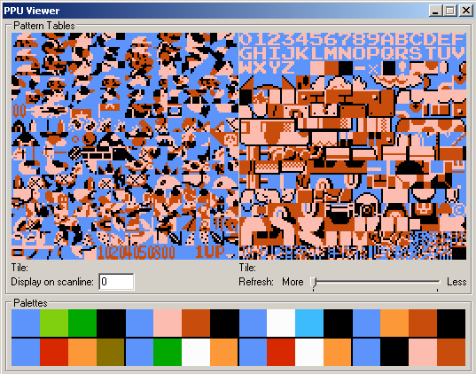

CPU 只**描述** 8x8 “贴块” 的摆放方法

- 背景是 “大图” 的一部分
  - 每行的前景块不超过 8 个
- PPU 完成图形的**绘制**
  - 一个更简单的 “CPU”

```
76543210
||||||||
||||||++- Palette
|||+++--- Unimplemented        
||+------ Priority
|+------- Flip horizontally
+-------- Flip vertically
```

### 3、在受限的机能下提供丰富的图形

前景：[《魂斗罗》（Contra）中角色为什么要「萝莉式屈腿俯卧」？](https://www.zhihu.com/question/38528261)

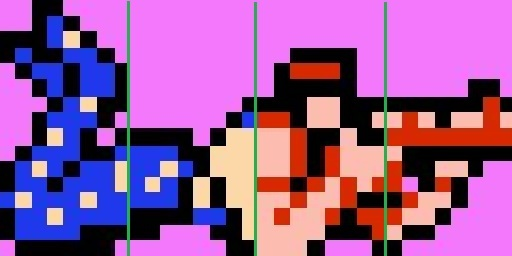

背景：“卷轴” 操作

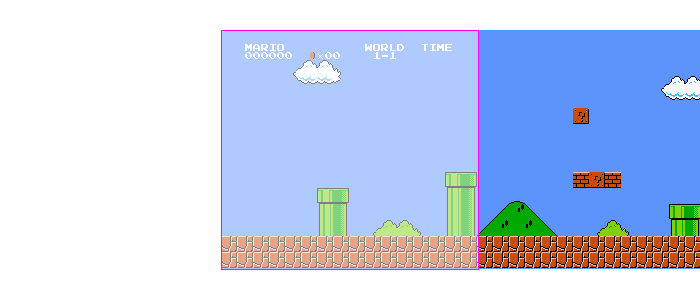

### 4、更好的 2D 游戏引擎

如果我们有更多的晶体管？

- NES PPU 的本质是和坐标轴平行的 “贴块块”
  - 实现上只需要加法和位运算
- 更强大的计算能力 = 更复杂的图形绘制

------

2D 图形加速硬件：图片的 “裁剪” + “拼贴”

- 支持旋转、材质映射 (缩放)、后处理、……

------

实现 3D

- 三维空间中的多边形，在视平面上也是多边形
  - Thm. 任何 n 边形都可以分解成 n−2 个三角形

### 5、以假乱真的剪贴 3D

GameBoy Advance

- 4 层背景; 128 个剪贴 objects; 32 个 affine objects
  - CPU 给出描述；GPU 绘制 (执行 “一个程序” 的 CPU)

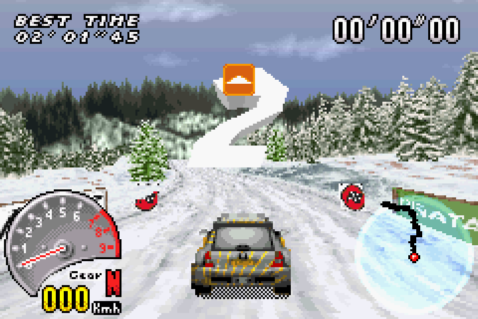

([V-Rally](https://www.bilibili.com/video/BV1bT4y1g75x); Game Boy Advance, 2002)

### 6、但我们还是需要真正的 3D

三维空间中的三角形需要正确渲染

- 这时候建模的东西就多了
  - 几何、材质、贴图、光源、……
  - Rendering pipeline 里大部分操作都是 massive parallel 的

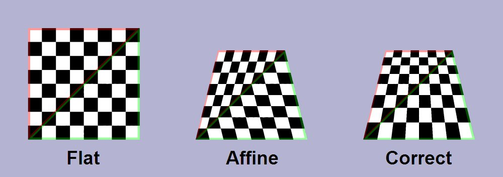

“Perspective correct” texture mapping (Wikipedia)

### 7、题外话：如此丰富的图形是怎么来的？


### 8、答案：全靠 PS (后处理)

例子：GLSL (Shading Language)

- 使 “shader program” 可以在 GPU 上执行
  - 可以作用在各个渲染级别上：vertex, fragment, pixel shader
  - 相当于一个 “PS” 程序，算出每个部分的光照变化
    - 全局光照、反射、阴影、环境光遮罩……


### 9、现代 GPU: 一个通用计算设备

一个完整的众核多处理器系统

- 注重大量并行相似的任务
  - 程序使用例如 OpenGL, CUDA, OpenCL, ... 书写
- 程序保存在内存 (显存) 中
  - nvcc (LLVM) 分两个部分
    - main 编译/链接成本地可执行的 ELF
    - kernel 编译成 GPU 指令 (送给驱动)
- 数据也保存在内存 (显存) 中
  - 可以输出到视频接口 (DP, HDMI, ...)
  - 也可以通过 DMA 传回系统内存

### 10、例子：PyTorch 和炼丹炉

什么是 “深度神经网络”？

- [inference.cc](http://jyywiki.cn/pages/OS/2022/demos/inference.cc)

如何 “训练”？

- 大量计算密集型的任务

```python
class NeuralNetwork(nn.Module):
    def __init__(self):
        super(NeuralNetwork, self).__init__()
        self.flatten = nn.Flatten()
        self.linear_relu_stack = nn.Sequential(
            nn.Linear(28*28, 512),  nn.ReLU(),
            nn.Linear(512, 512),    nn.ReLU(),
            nn.Linear(512, 10),     nn.ReLU(), )
    ...
model = NeuralNetwork().to('cuda')
```

### 11、Dark Silicon Age 和异构计算

能完成 “同一件事” 的部件可能有很多

- 要选择功耗/性能/时间最合适的那个！

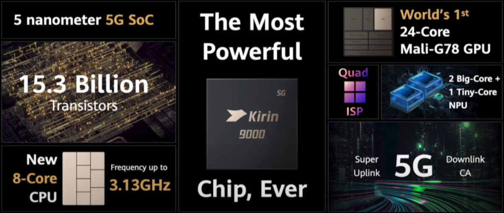

- CPU, GPU, NPU, DSP, DSM/RDMA
  - 甚至可以丢到另一台计算机上执行：[COMET: Code offload by migrating execution transparently](https://www.usenix.org/system/files/conference/osdi12/osdi12-final-11.pdf) (OSDI'12)

## 总结

本次课回答的问题

- **Q**: 到底什么是输入输出设备？

------

[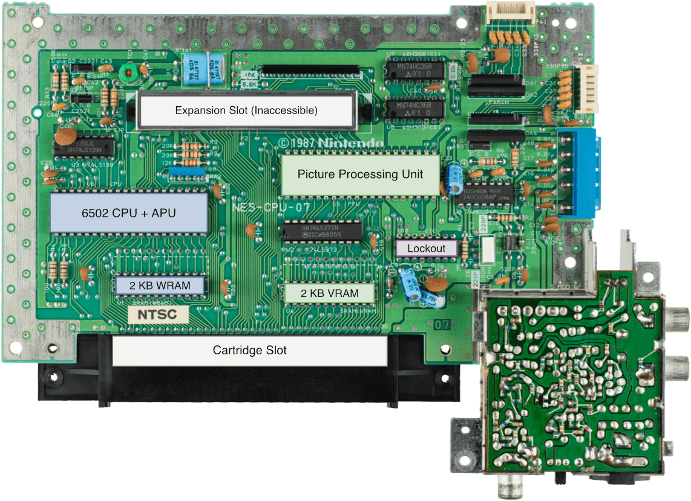](http://jyywiki.cn/pages/OS/img/Famicom.jpg)

Take-away messages

- I/O 设备 (控制器)：一组交换数据的接口和协议
  - Simply, RTFM & RTFSC
- 如果你 “自己造一台计算机”，你会发现这一切都是自然的
  - “不容易理解” 的部分是随时间积累的复杂性