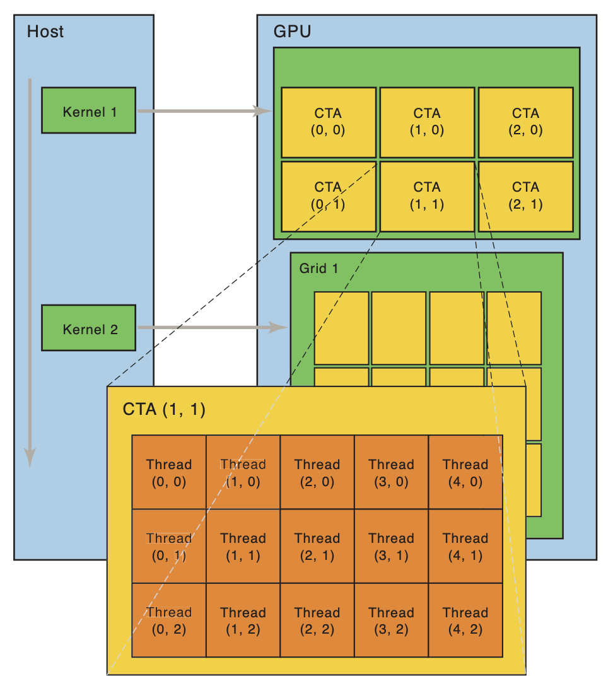

# 设备驱动程序

## Overview


复习

- I/O 设备：一组寄存器和协议
  - 串口/键盘/磁盘/打印机/总线/中断控制器/DMA/GPU

------

本次课回答的问题

- **Q**: 操作系统如何使应用程序能访问这些设备？

------

本次课主要内容

- 什么是设备驱动程序
- Linux 设备抽象

## 一、设备驱动程序原理

### 1、I/O 设备的抽象

I/O 设备的主要功能：**输入和输出**

- “能够读 (read) 写 (write) 的**字节序列 (流或数组)**”
- 常见的设备都满足这个模型
  - 终端/串口 - 字节流
  - 打印机 - 字节流 (例如 [PostScript 文件](http://jyywiki.cn/pages/OS/2022/demos/page.ps))
  - 硬盘 - 字节数组 (按块访问)
  - GPU - 字节流 (控制) + 字节数组 (显存)

------

操作系统：设备 = 支持各类操作的对象 (文件)

- read - 从设备某个指定的位置读出数据
- write - 向设备某个指定位置写入数据
- ioctl - 读取/设置设备的状态

### 2、设备驱动程序

把系统调用 (read/write/ioctl/...) “翻译” 成与设备寄存器的交互

- 就是一段普通的内核代码
- 但可能会睡眠 (例如 P 信号量，等待中断中的 V 操作唤醒)

------

例子：`/dev/` 中的对象

- `/dev/pts/[x]` - pseudo terminal
- `/dev/zero` - “零” 设备
- `/dev/null` - “null” 设备
- `/dev/random`,`/dev/urandom`- 随机数生成器
  - 试一试：`head -c 512 [device] | xxd`
  - 以及观察它们的 strace
    - 能看到访问设备的系统调用

### 3、例子: Lab 2 设备驱动

设备模型

- 简化的假设
  - 设备从系统启动时就存在且不会消失
- 支持读/写两种操作
  - 在无数据或数据未就绪时会等待 (P 操作)

```c
typedef struct devops {
  int (*init)(device_t *dev);
  int (*read) (device_t *dev, int offset, void *buf, int count);
  int (*write)(device_t *dev, int offset, void *buf, int count);
} devops_t;
```

I/O 设备看起来是个 “黑盒子”

- 写错任何代码就 simply “not work”
- 设备驱动：Linux 内核中最多也是质量最低的代码

### 4、字节流/字节序列抽象的缺点

设备不仅仅是数据，还有**控制**

- 尤其是设备的附加功能和配置
- 所有额外功能全部依赖 ioctl
  - “Arguments, returns, and semantics of ioctl() vary according to the device driver in question”
  - 无比复杂的 “hidden specifications”

------

例子

- 打印机的打印质量/进纸/双面控制、卡纸、清洁、自动装订……
  - 一台几十万的打印机可不是那么简单 😂
- 键盘的跑马灯、重复速度、宏编程……
- 磁盘的健康状况、缓存控制……

### 5、例子：终端

“字节流” 以内的功能

- ANSI Escape Code
- [logisim.c](http://jyywiki.cn/pages/OS/2022/demos/logisim.c) 和 [seven-seg.py](http://jyywiki.cn/pages/OS/2022/demos/seven-seg.py)

------

“字节流” 以外的功能

- stty -a
  - 终端大小怎么知道？
  - 终端大小变化又怎么知道？
- isatty (3), termios (3)
  - 大部分都是 ioctl 实现的
  - 这才是水面下的冰山的一角

## 二、Linux 设备驱动

### 1、Nuclear Launcher

我们希望实现一个最简单的 “软件定义核弹”

```c
#include <fcntl.h>

#define SECRET "\x01\x14\x05\x14"

int main() {
  int fd = open("/dev/nuke", O_WRONLY);
  if (fd > 0) {
    write(fd, SECRET, sizeof(SECRET) - 1);
    close(fd);
  } else {
    perror("launcher");
  }
}
```

### 2、实现 Nuclear Launcher

内核模块：一段可以被内核动态加载执行的代码

- [M4 - crepl](http://jyywiki.cn/OS/2022/labs/M4)
  - 也就是把文件内容搬运到内存
  - 然后 export 一些符号 (地址)

------

[launcher.c](http://jyywiki.cn/pages/OS/2022/demos/launcher.c): 驱动程序模块

- Everything is a file
  - 设备驱动就是实现了`struct file_operations`的对象
    - 把文件操作翻译成设备控制协议
- 在内核中初始化、注册设备
  - **系统调用直接以函数调用的方式执行驱动代码**

### 3、更多的 File Operations

```c
struct file_operations {
  struct module *owner;
  loff_t (*llseek) (struct file *, loff_t, int);
  ssize_t (*read) (struct file *, char __user *, size_t, loff_t *);
  ssize_t (*write) (struct file *, const char __user *, size_t, loff_t *);
  int (*mmap) (struct file *, struct vm_area_struct *);
  unsigned long mmap_supported_flags;
  int (*open) (struct inode *, struct file *);
  int (*release) (struct inode *, struct file *);
  int (*flush) (struct file *, fl_owner_t id);
  int (*fsync) (struct file *, loff_t, loff_t, int datasync);
  int (*lock) (struct file *, int, struct file_lock *);
  ssize_t (*sendpage) (struct file *, struct page *, int, size_t, loff_t *, int);
  long (*unlocked_ioctl) (struct file *, unsigned int, unsigned long);
  long (*compat_ioctl) (struct file *, unsigned int, unsigned long);
  int (*flock) (struct file *, int, struct file_lock *);
  ...
```

### 4、为什么有两个 ioctl?

```
long (*unlocked_ioctl) (struct file *, unsigned int, unsigned long);
long (*compat_ioctl) (struct file *, unsigned int, unsigned long);
```

- `unlocked_ioctl`: BKL (Big Kernel Lock) 时代的遗产
  - 单处理器时代只有 `ioctl`
  - 之后引入了 BKL, `ioctl` 执行时默认持有 BKL
  - (2.6.11) 高性能的驱动可以通过 `unlocked_ioctl` 避免锁
  - (2.6.36) `ioctl` 从 `struct file_operations` 中移除
- `compact_ioctl`: 机器字长的兼容性
  - 32-bit 程序在 64-bit 系统上可以 ioctl
  - 此时应用程序和操作系统对 ioctl 数据结构的解读可能不同 (tty)
  - (调用此兼容模式)

## 三、为 GPU 编程

### 1、为 GPU 编程



Single Instruction, Multiple Thread

- 许多线程都执行相同指令
- 但每一个线程又有一些 thread-local data (例如编号)
  - 非常精巧的设计
    - 一个 PC，一堆数据
    - VLIW 和 SIMD 的继任者
  - 按照 “Warp, 线程束” 执行
    - 分支怎么办？

### 2、Mandelbrot, Again

[mandelbrot.cu](http://jyywiki.cn/pages/OS/2022/demos/mandelbrot.cu) 和 GPU 惊人的计算力

- 16 亿像素、每像素迭代 100 次
  - 分到 512x512 = 262,144 线程计算
- 每个线程计算 mandelbrot 的一小部分
  - [mandelbrot-12800.webp](http://jyywiki.cn/pages/OS/img/mandelbrot-12800.webp)
  - (感谢 doowzs 借用的机器)

------

nvprof 结果

```
==2994086== Profiling result:
Time(%)      Time   Name
 95.75%  1.76911s   mandelbrot_kernel
  4.25%  78.506ms   [CUDA memcpy DtoH] (12800 x 12800 data)
  0.00%  1.5360us   [CUDA memcpy HtoD]
```

RTFM: [Parallel Thread Execution ISA Application Guide](http://jyywiki.cn/pages/OS/manuals/ptx-isa-7.7.pdf)

- 就是个指令集
- 再编译成 SASS (机器码)
  - cuobjdump --dump-ptx / --dump-sass

------

该有的工具都有

- gcc → nvcc
- binutils → cuobjdump
- gdb → cuda-gdb
  - 可以直接调试 GPU 上的代码！
- perf → nvprof
- ...

### 3、GPU 驱动程序

GPU 驱动非常复杂

- 全套的工具链
  - Just-in-time 程序编译
  - Profiler
  - ...
- API 的实现
  - cudaMemcpy, cudaMalloc, ...
  - Kernel 的执行
  - 大部分通过 ioctl 实现
- 设备的适配

------

NVIDIA 在 2022 年开源了驱动！([名场面](https://www.bilibili.com/video/BV1YF41177V6))

## 四、存储设备的抽象

### 1、存储设备的抽象

磁盘 (存储设备) 的访问特性

1. 以数据块 (block) 为单位访问
    - 传输有 “最小单元”，不支持任意随机访问
    - 最佳的传输模式与设备相关 (HDD v.s. SSD)
2. 大吞吐量
    - 使用 DMA 传送数据
3. **应用程序不直接访问**
    - 访问者通常是文件系统 (维护磁盘上的数据结构)
    - 大量并发的访问 (操作系统中的进程都要访问文件系统)

------

对比一下终端和 GPU，的确是很不一样的设备

- 终端：小数据量、直接流式传输
- GPU：大数据量、DMA 传输

### 2、Linux Block I/O Layer

文件系统和磁盘设备之间的接口

- 包含 “I/O 调度器”
    - 曾经的 “电梯” 调度器


### 3、块设备：持久数据的可靠性

Many storage devices, ... come with *volatile write back caches*

- the devices signal I/O completion to the operating system before data actually has hit the non-volatile storage
- this behavior obviously *speeds up* various workloads, but ... *data integrity*...

------

我们当然可以提供一个 ioctl

- 但 block layer 提供了更方便的机制
    - 在 block I/O 提交时
        - `| REQ_PREFLUSH` 之前的数据落盘后才开始
        - `| REQ_FUA` (force unit access)，数据落盘后才返回
    - 设备驱动程序会把这些 flags 翻译成磁盘 (SSD) 的控制指令

### 4、Block I/O: 持久化的起点

文件系统

- **在 Block I/O API 上构建的持久数据结构**

------

实现文件系统

- bread
- bwrite
- bflush
- 支持文件/目录操作
    - 你可能已经想到应该怎么做了！

## 总结

本次课回答的问题

- **Q**: 操作系统如何使应用程序能访问 I/O 设备？

------

Takeaway messages

- 设备驱动
    - 把 read/write/ioctl 翻译成设备听得懂的协议
    - 字符设备 (串口、GPU) + DMA
    - 块设备 (磁盘)