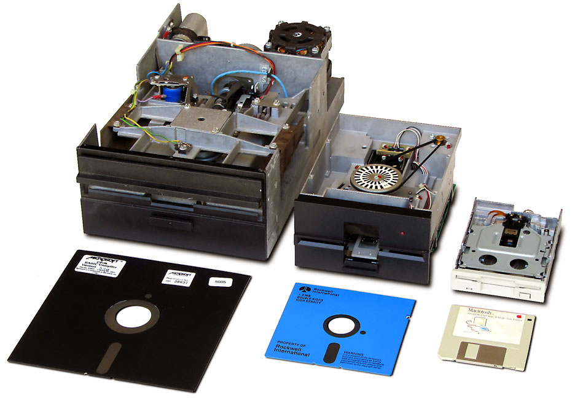
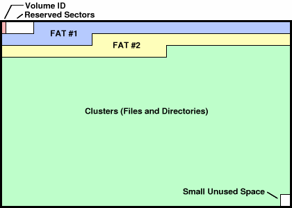
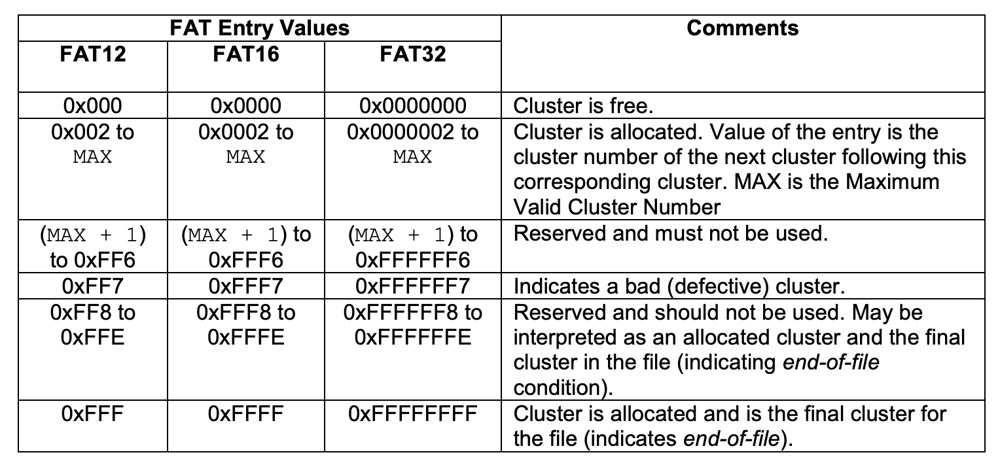
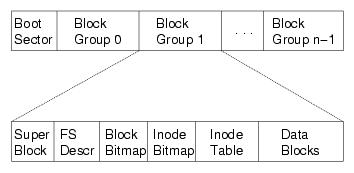
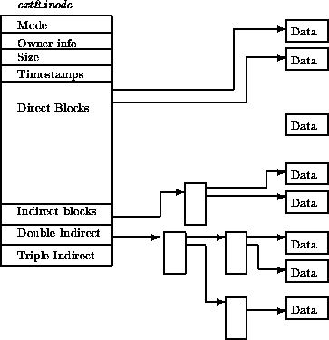
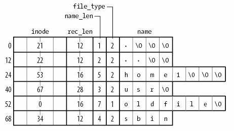

# FAT 和 UNIX 文件系统

## Overview

复习：文件系统 API

- 目录 (索引)
  - “图书馆” - mkdir, rmdir, link, unlink, open, ...
- 文件 (虚拟磁盘)
  - “图书” - read, write, mmap, ...
- 文件描述符 (偏移量)
  - “书签” - lseek

------

本次课回答的问题

- **Q**: 如何实现这些 API？

------

本次课主要内容

- FAT 和 ext2/UNIX 文件系统

## 一、回到数据结构课

### 1、什么是文件系统实现？

在一个 I/O 设备 (block device) 上实现所有文件系统 API

- `bread(int id, char *buf);`
- `bwrite(int id, const char *buf);`
  - 假设所有操作排队同步完成
  - (可以在 block I/O 层用队列实现)

------

目录/文件 API

- `mkdir`, `rmdir`, `link`, `unlink`
- `open`, `read`, `write`, `stat`

### 2、回到数据结构课……

文件系统就是一个数据结构 (抽象数据类型；ADT)

- 只是和数据结构课上的假设稍有不同

------

数据结构课程的假设

- 冯诺依曼计算机
- Random Access Memory (RAM)
  - Word Addressing (例如 32/64-bit load/store)
  - 每条指令执行的代价是`O(1)`
    - Memory Hierarchy 在苦苦支撑这个假设 (cache-unfriendly 代码也会引起性能问题)

------

文件系统的假设

- 按块 (例如 4KB) 访问，在磁盘上构建 RAM 模型完全不切实际

### 3、数据结构的实现

Block device 提供的设备抽象

```c
struct block blocks[NBLK]; // 磁盘
void bread(int id, struct block *buf) {
  memcpy(buf, &blocks[id], sizeof(struct block));
}
void bwrite(int id, const struct block *buf) {
  memcpy(&blocks[id], buf, sizeof(struct block));
}
```

------

在 bread/bwrite 上实现块的分配与回收 (与 pmm 类似)

```c
int balloc(); // 返回一个空闲可用的数据块
void bfree(int id); // 释放一个数据块
```

---

在 balloc/bfree 上实现磁盘的虚拟化

- 文件 = `vector<char>`
  - 用链表/索引/任何数据结构维护
  - 支持任意位置修改和 resize 两种操作

------

在文件基础上实现目录

- “目录文件”
  - 把 `vector<char>` 解读成 `vector<dir_entry>`
  - 连续的字节存储一个目录项 (directory entry)

## 二、File Allocation Table (FAT)

### 1、让时间回到 1980 年

5.25" 软盘：单面 180 KiB

- 360 个 512B 扇区 (sectors)
- 在这样的设备上实现文件系统，应该选用怎样的数据结构？



### 2、FAT 文件系统中的文件

```c
int balloc(); // 返回一个空闲可用的数据块
void bfree(int id); // 释放一个数据块
vector<struct block *> file; // 文件
// 文件的名称、大小等保存在目录中
```

注意到这是相当小的文件系统

- 树状的目录结构
- 系统中以小文件为主 (几个 block 以内)

------

文件的实现方式

- `struct block *`的链表
  - 任何复杂的高级数据结构都显得浪费

### 3、用链表存储数据：两种设计

1. 在每个数据块后放置指针
   - 优点：实现简单、无须单独开辟存储空间
   - 缺点：数据的大小不是 2k; 单纯的 lseek 需要读整块数据
2. 将指针集中存放在文件系统的某个区域
   - 优点：局部性好；lseek 更快
   - 缺点：集中存放的数据损坏将导致数据丢失

------

哪种方式的缺陷是致命、难以解决的？

方法一需要将整个磁盘都读取一遍，才能将空闲的block找到

方法二集中存放指针的话，集中存放区域容易损坏

### 4、集中保存所有指针

集中存储的指针容易损坏？存 n 份就行！

- FAT-12/16/32 (FAT entry，即 “next 指针” 的大小)



### 5、“File Allocation Table” 文件系统


[RTFM](http://jyywiki.cn/pages/OS/manuals/MSFAT-spec.pdf) 得到必要的细节

- 诸如 tutorial、博客都不可靠
- 还会丢失很多重要的细节

```c
if (CountofClusters < 4085) {
  // Volume is FAT12 (2 MiB for 512B cluster)
} else if (CountofCluster < 65525) {
  // Volume is FAT16 (32 MiB for 512B cluster)
} else {
  // Volume is FAT32
}
```

### 6、FAT: 链接存储的文件

“FAT” 的 “next” 数组

- `0`: free; `2...MAX`: allocated;
- `ffffff7`: bad cluster; `ffffff8-ffffffe`, `-1`: end-of-file



### 7、目录树实现：目录文件

以普通文件的方式存储 “目录” 这个数据结构

- FAT: 目录 = 32-byte 定长目录项的集合
- 操作系统在解析时把标记为目录的目录项 “当做” 目录即可
  - 可以用连续的若干个目录项存储 “长文件名”
- 思考题：为什么不把元数据 (大小、文件名、……) 保存在 `vector<struct block *> file` 的头部？

------


### 8、Talk is Cheap, Show Me the Code!

首先，观察 “快速格式化” (`mkfs.fat`) 是如何工作的

- 老朋友：strace

------

然后，把整个磁盘镜像 mmap 进内存

- 照抄手册，遍历目录树：[fatree.c](http://jyywiki.cn/pages/OS/2022/demos/fatree.c)

------

另一个有趣的问题 ([M5 - frecov](http://jyywiki.cn/OS/2022/labs/M5))

- 快速格式化 = FAT 表丢失
  - 所有的文件内容 (包括目录文件) 都还在
  - 只是在数据结构眼里看起来都是 “free block”
- 首先需要猜出文件系统的参数 (`SecPerClus`, `BytsPerSec`, `FATSz32`, `BPB_RootClus`, ...)
- 本质上是 cluster 的分类和建立 “可能后继关系”

### 9、FAT: 性能与可靠性

性能

- ＋ 小文件简直太合适了
- －但大文件的随机访问就不行了
  - 4 GB 的文件跳到末尾 (4 KB cluster) 有 220 次链表 next 操作
  - 缓存能部分解决这个问题
- 在 FAT 时代，磁盘连续访问性能更佳
  - 使用时间久的磁盘会产生碎片 (fragmentation)
    - malloc 也会产生碎片，不过对性能影响不太大

------

可靠性

- 维护若干个 FAT 的副本防止元数据损坏
  - 额外的同步开销
- 损坏的 cluster 在 FAT 中标记

## 三、ext2/UNIX 文件系统

### 1、更好的文件系统：需要做到什么？

不能 “尽善尽美”，但可以在 “实际 workload” 下尽可能好

| **Summary**                          | **Findings**                                      |
| :----------------------------------- | :------------------------------------------------ |
| Most files are small                 | Roughly 2K is the most common size                |
| Average file size is growing         | Almost 200K is the average                        |
| Most bytes are stored in large files | A few big files use most of the space             |
| File systems contains lots of files  | Almost 100K on average                            |
| File systems are roughly half full   | Even as disks grow, file systems remain ~50% full |
| Directories are typically small      | Many have few entries; most have 20 or fewer      |

### 2、ext2/UNIX 文件系统

按对象方式集中存储文件/目录元数据

- 增强局部性 (更易于缓存)
- 支持链接

------

为大小文件区分 fast/slow path

- 小的时候应该用数组
  - 连链表遍历都省了
- 大的时候应该用树 (B-Tree; Radix-Tree; ...)
  - 快速的随机访问

### 3、ext2: 磁盘镜像格式

对磁盘进行分组



“superblock”：文件系统元数据

- 文件 (inode) 数量
- block group 信息
  - [ext2.h](http://jyywiki.cn/pages/OS/2022/demos/ext2.h) 里有你需要知道的一切

### 4、ext2 inode



### 5、ext2 目录文件

与 FAT 本质相同：在文件上建立目录的数据结构

- 注意到 inode 统一存储
  - 目录文件中存储文件名到 inode 编号的 key-value mapping



### 6、ext2: 性能与可靠性

大文件的随机读写性能提升明显 (O(1))

- 支持链接 (一定程度减少空间浪费)
- inode 在磁盘上连续存储，便于缓存/预取
- 依然有碎片的问题

------

但可靠性依然是个很大的问题

- 存储 inode 的数据块损坏是很严重的

## 总结

本次课回答的问题

- Q: 如何在磁盘上实现文件系统 API？
  - “图书馆” - mkdir, rmdir, link, unlink, open, ...
  - “图书/书签” - read, write, mmap, lseek, ...

------

Takeaway messages

- 文件系统实现 = 自底向上设计实现数据结构
  - balloc/bfree
  - FAT/inode/...
  - 文件和目录文件