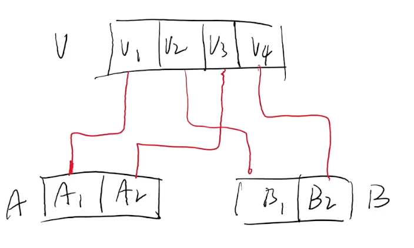
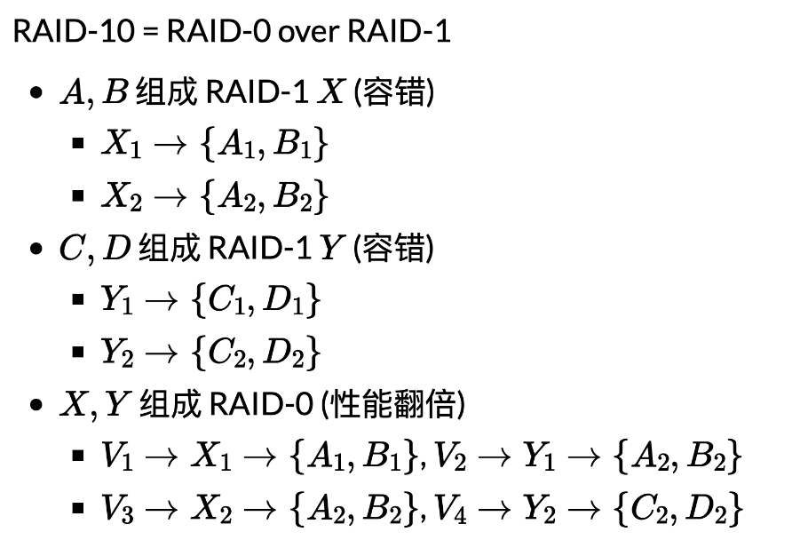
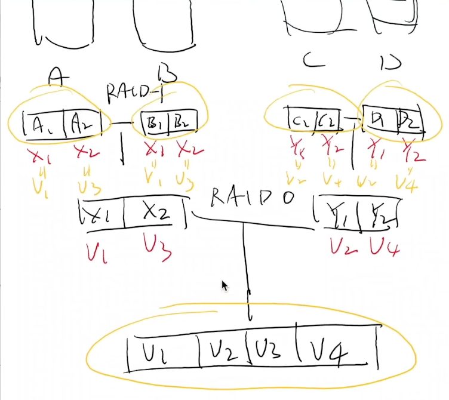
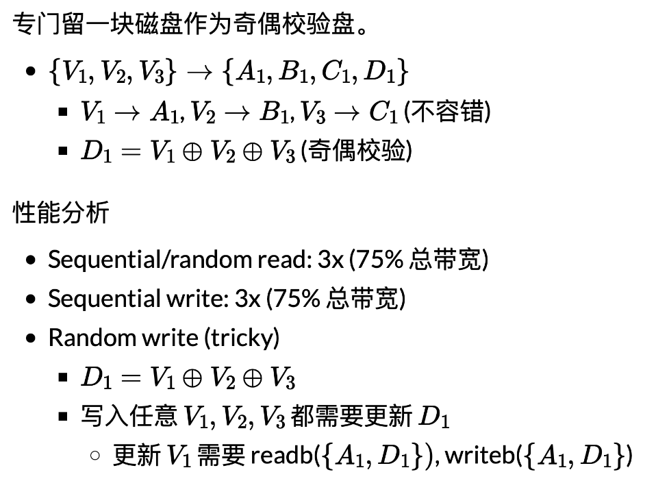
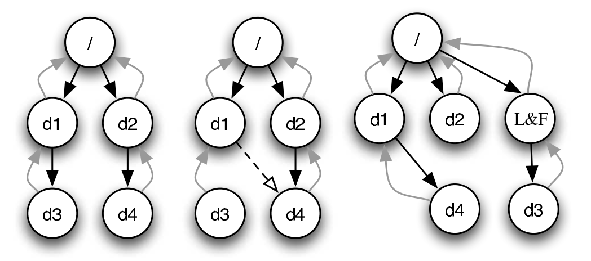
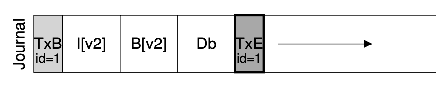

# 持久数据的可靠性

## Overview

复习

- 文件系统实现：bread/bwrite 上的数据结构
    - balloc/bfree
    - 文件：FAT (链表)/UNIX 文件系统 (索引)
    - 目录文件

------

本次课回答的问题

- 数据结构的另一个假设：**内存可靠且可以接受断电数据丢失**
- **Q**: 持久数据是不能接受丢失的，如何保证持久数据的可靠性？

------

本次课主要内容

- RAID (Redundant Array of Inexpensive Disks)
- 崩溃一致性

## 一、Redundant Array of Inexpensive Disks (RAID)

### 1、日渐增长的持久存储需求 (1)——性能

存储：只要 CPU (DMA) 能处理得过来，我就能提供足够的带宽！

- Computer System 的 “industry” 传统——做真实有用的系统

### 2、日渐增长的持久存储需求 (2)——可靠性

任何物理存储介质都有失效的可能

- 你依然希望在存储设备失效的时候能保持数据的完整
    - 极小概率事件：战争爆发/三体人进攻地球/世界毁灭 😂
    - 小概率事件：硬盘损坏
        - 大量重复 = 必然发生 (但我们还是希望系统能照常运转)

### 3、RAID: 存储设备的虚拟化

> 那么，性能和可靠性，我们能不能全都要呢？

Redundant Array of Inexpensive (*Independent*) Disks (RAID)

- 把多个 (不可靠的) 磁盘虚拟成一块**非常可靠且性能极高**的虚拟磁盘
    - [A case for redundant arrays of inexpensive disks (RAID)](https://dl.acm.org/doi/10.1145/971701.50214)(SIGMOD'88)

------

RAID 是一个 “反向” 的虚拟化

- 进程：把一个 CPU 分时虚拟成多个虚拟 CPU
- 虚存：把一份内存通过 MMU 虚拟成多个地址空间
- 文件：把一个存储设备虚拟成多个虚拟磁盘

### 4、RAID 的 Fault Model: Fail-Stop

磁盘可能在某个时刻忽然彻底无法访问

- 机械故障、芯片故障……
    - 磁盘好像就 “忽然消失” 了 (数据完全丢失)
    - 假设磁盘能报告这个问题 (如何报告？)
- [An analysis of data corruption in the storage stack](https://www.usenix.org/conference/fast-08/analysis-data-corruption-storage-stack) (FAST'08)

------

在那个遍地是黄金的年代

- 1988: 凑几块盘，掀翻整个产业链！
    - “Single Large Expensive Disks” (IBM 3380), v.s.
    - “Redundant Array of Inexpensive Disks”

### 5、一个最简单的想法

在系统里多接入一块硬盘用于 Fault Tolerance (RAID-1)

- 假设有两块盘A, B
    - 同样规格，共有 n 块
- “镜像” 虚拟磁盘V
    - Vi→{Ai,Bi} (1≤i≤n)

------

块读写

- bread(i)
    - 可以从 A 或 B 中的任意一个读取
- bwrite(i)
    - 同时将同样的数据写入 A, B 的同一位置 
- 容错，且读速度翻倍 (假设内存远快于磁盘)

### 6、RAID: Design Space

> RAID (虚拟化) = 虚拟磁盘块到物理磁盘块的 “映射”。

两块磁盘的其他拼接方法

- 顺序拼接
    - V1→A1, V2→A2, …, Vn→An
    - Vn+1→B1, Vn+2→B2, …, V2n→Bn
- 交错排列 (RAID-0)
    - V1→A1, V2→B1
    - V3→A2, V4→B2
    - V2i−1→Ai, V2i→Bi
- 虽然不能容错，但可以利用好磁盘的带宽

RAID: 允许 “多对多” 的映射 (一组映射称为 “条带”, stripe)

> RAID-10：有时能容忍两块盘坏，有时候却不能。如果我们有很多块盘，能否减少浪费？

换一个问法

### 7、RAID-4: Parity Disk

### 8、RAID-5: Rotating Parity

“交错排列” parity block!

### 9、AID-5: 性能分析

让每一块盘都有均等的机会存储 parity

- Sequential read/write: 3x (75% 总带宽)
- Random read (tricky)
    - (read 足够大，所有磁盘都可以提供数据) 4x (100% 总带宽)
- Random write (tricky)
    - D1=V1⊕V2⊕V3; 写入任意 V1,V2,V3 都需要更新 D1
    - 奇偶校验依然严重拖慢了随机写入
        - 但至少 n 块盘可以获得 n/4 的随机写性能
        - 有一定的 scalability

### 10、RAID: 讨论

更快、更可靠、近乎免费的大容量磁盘

- 革了 “高可靠性磁盘” 的命
    - 成为今天服务器的标准配置
- 类似的里程碑
    - [The Google file system](https://dl.acm.org/doi/10.1145/1165389.945450) (SOSP'03) 和 [MapReduce: Simplified data processing on large clusters](https://dl.acm.org/doi/10.5555/1251254.1251264) (OSDI'04) 开启 “大数据” 时代

------

RAID 的可靠性

- RAID 系统发生断电？
    - 例子：RAID-1 镜像盘出现不一致的数据
- 检测到磁盘坏？
    - 自动重组

## 二、崩溃一致性与崩溃恢复

### 1、另一种 Fault Model

磁盘并没有故障

- 但操作系统内核可能 crash，系统可能断电

文件系统：设备上的树结构

- 即便只是 append 一个字节，也涉及多处磁盘的修改
    - FAT、目录文件 (文件大小) 和数据
    - 磁盘本身不提供 “all or nothing” 的支持

### 2、崩溃一致性 (Crash Consistency)

> **Crash Consistency**: Move the file system from one consistent state (e.g., before the file got appended to) to another atomically (e.g., after the inode, bitmap, and new data block have been written to disk).

(你们平时编程时假设不会发生的事，操作系统都要给你兜底)

------

磁盘不提供多块读写 “all or nothing” 的支持

- 甚至为了性能，没有顺序保证
    - bwrite 可能被乱序
    - 所以磁盘还提供了 bflush 等待已写入的数据落盘
    - 回到被并发编程支配的恐惧？[peterson-barrier.c](http://jyywiki.cn/pages/OS/2022/demos/peterson-barrier.c)
- ~~那我们也可以考虑提供啊：[Transactional flash](https://dl.acm.org/doi/10.5555/1855741.1855752) (OSDI'08)~~

### 3、磁盘乱序的后果

为 FAT 文件追加写入一个 cluster (4KB) 需要更新

- 目录项中的文件大小 (100 → 4196)
- FAT 表中维护的链表 (EOF → cluster-id, FREE → EOF)
- 实际数据

------

这麻烦了……

- 任何一个子集的写入丢失都可能出现
- 文件系统就进入了 “不一致” 的状态
    - 可能违反 FAT 的基本假设
        - 链表无环且长度和文件大小一致
        - FREE 的 cluster 不能有入边
        - ……

### 4、File System Checking (FSCK)

根据磁盘上已有的信息，恢复出 “最可能” 的数据结构

- [SQCK: A declarative file system checker](https://dl.acm.org/doi/10.5555/1855741.1855751) (OSDI'08)
- [Towards robust file system checkers](https://dl.acm.org/doi/10.1145/3281031) (FAST'18)
    - “widely used file systems (EXT4, XFS, BtrFS, and F2FS) may leave the file system in an uncorrectable state if the repair procedure is interrupted unexpectedly” 😂

## 三、日志 (Journaling)

### 1、重新思考数据结构的存储

两个 “视角”

1. 存储实际**数据结构**
    - 文件系统的 “直观” 表示
    - crash unsafe
2. Append-only 记录所有**历史操作**
    - “重做” 所有操作得到数据结构的当前状态
    - 容易实现崩溃一致性

------

二者的融合

- 数据结构操作发生时，用 (2) append-only 记录日志
- 日志落盘后，用 (1) 更新数据结构
- 崩溃后，重放日志并清除 (称为 redo log；相应也可以 undo log)

### 2、实现 Atomic Append

用 bread, bwrite 和 bflush 实现 append()

1. 定位到 journal 的末尾 (bread)
2. bwrite TXBegin 和所有数据结构操作
3. bflush 等待数据落盘
4. bwrite TXEnd
5. bflush 等待数据落盘
6. 将数据结构操作写入实际数据结构区域
7. 等待数据落盘后，删除 (标记) 日志

### 3、Journaling: 优化

现在磁盘需要写入双份的数据

- 批处理 (xv6; jbd)
    - 多次系统调用的 Tx 合并成一个，减少 log 的大小
    - jbd: 定期 write back
- Checksum (ext4)
    - 不再标记 TxBegin/TxEnd
    - 直接标记 Tx 的长度和 checksum
- Metadata journaling (ext4 default)
    - 数据占磁盘写入的绝大部分
        - 只对 inode 和 bitmap 做 journaling 可以提高性能
    - 保证文件系统的目录结构是一致的；但数据可能丢失

### 4、Metadata Journaling

从应用视角来看，文件系统的行为可能很怪异

- 各类系统软件 (git, sqlite, gdbm, ...) 不幸中招
    - [All file systems are not created equal: On the complexity of crafting crash-consistent applications](https://cn.bing.com/search?q=All+file+systems+are+not+created+equal%3A+On+the+complexity+of+crafting+crash-consistent+applications&form=APMCS1&PC=APMC) (OSDI'14)
    - (os-workbench 里的小秘密)
- 更多的应用程序可能发生 data loss
    - 我们的工作: GNU coreutils, gmake, gzip, ... 也有问题
    - [Crash consistency validation made easy](https://dl.acm.org/doi/10.1145/2950290.2950327) (FSE'16)

------

更为一劳永逸的方案：TxOS

- xbegin/xend/xabort 系统调用实现跨 syscall 的 “all-or-nothing”
    - 应用场景：数据更新、软件更新、check-use……
    - [Operating systems transactions](https://dl.acm.org/doi/10.1145/1629575.1629591) (SOSP'09)

## 总结

本次课回答的问题

- Q

    : 如何保证持久数据的可靠性？

    - 硬件冗余：RAID
    - 软件容错：fsck 和 journaling

------

Takeaway messages

- 多个 bwrite 不保证顺序和原子性
- Journaling: 数据结构的两个视角
    - 真实的数据结构
    - 执行的历史操作