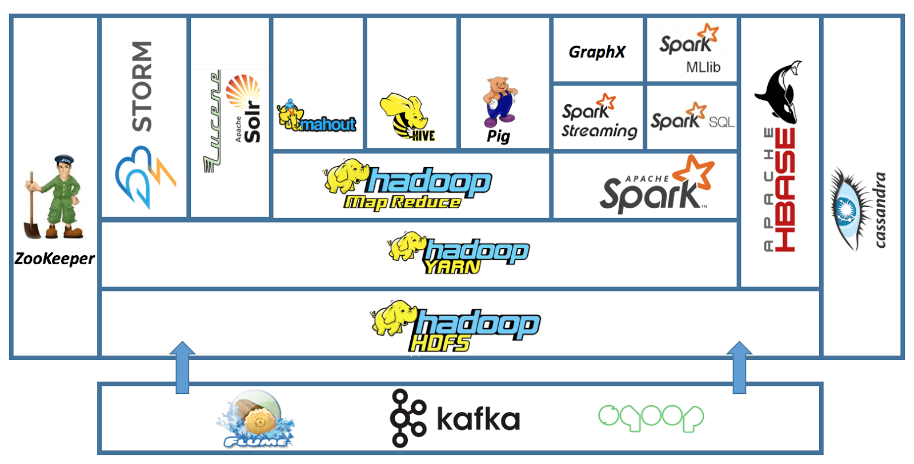
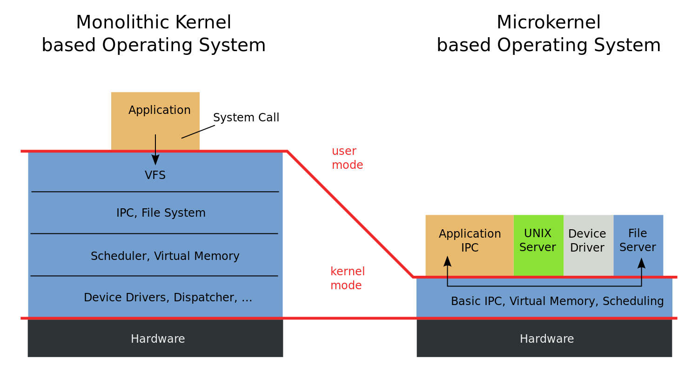
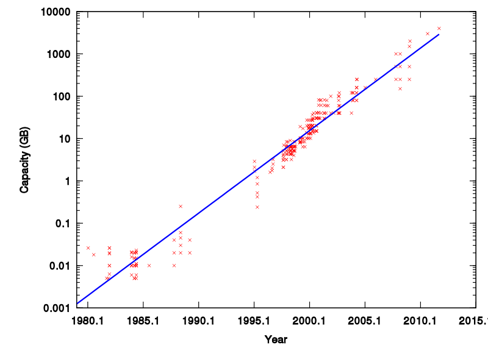
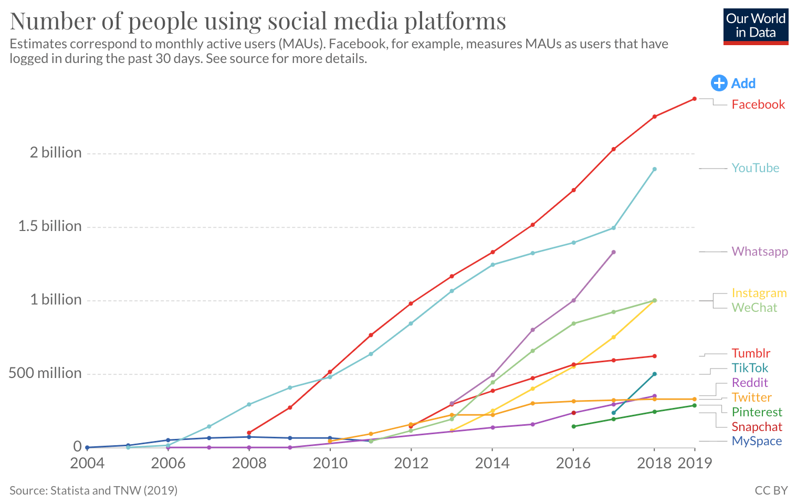
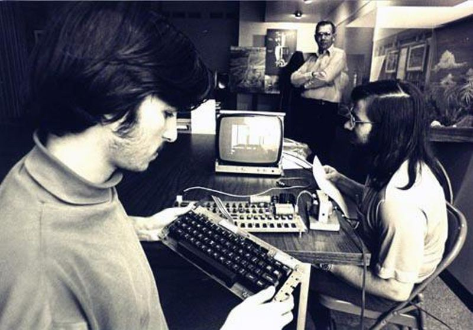

# 课程总结 从逻辑门到计算机系统

## 一、从逻辑门到计算机系统

### 1、数字系统：计算机系统的 “公理系统”

数字系统 = 状态机

- 状态：触发器
- 迁移：组合逻辑
  - [logisim.c](http://jyywiki.cn/pages/OS/2022/demos/logisim.c) 和 [seven-seg.py](http://jyywiki.cn/pages/OS/2022/demos/seven-seg.py)
  - NEMU Full System Emulator

数字系统的设计 = 描述状态机

- HDL (Verilog)
- HCL (Chisel)
  - 编译生成 Verilog
- HLS (High Level Synthesis)
  - “从需求到代码”

### 2、编程语言和算法

C/Java/Python 程序 = 状态机

- 状态：栈、堆、全局变量
- 迁移：语句 (或语句一部分) 的执行
  - “程序设计语言的形式语义”
  - [hanoi-nr.c](http://jyywiki.cn/pages/OS/2022/demos/hanoi-nr.c)

编程 = 描述状态机

- 将人类世界的需求映射到计算机世界中的数据和计算
  - DFS 走迷宫 [dfs-fork.c](http://jyywiki.cn/pages/OS/2022/demos/dfs-fork.c)
  - Dijkstra 算法求最短路径……
- 允许使用操作系统提供的 API
  - 例子：`write(fd, buf, size)` 持久化数据

### 3、如何使程序在数字系统上运行？

指令集体系结构

- 在逻辑门之上建立的 “指令系统” (状态机)
  - [The RISC-V Instruction Set Manual](http://jyywiki.cn/pages/OS/manuals/riscv-spec.pdf)
  - 既容易用电路实现，又足够支撑程序执行

------

编译器 (也是个程序)

- 将 “高级” 状态机 (程序) 翻译成的 “低级” 状态机 (指令序列)
  - 翻译准则：external visible 的行为 (操作系统 API 调用) 等价

------

操作系统 (也是个程序)

- 状态机 (运行中程序) 的管理者
  - 使程序可以共享一个硬件系统上的资源 (例如 I/O 设备)

### 4、操作系统上的程序

状态机 + 一条特殊的 “操作系统调用” 指令

- syscall (2)
- [minimal.S](http://jyywiki.cn/pages/OS/2022/demos/minimal.S)

------

程序的编译、链接和加载

- [dl.h](http://jyywiki.cn/pages/OS/2022/demos/dl/dl.h), [dlbox.c](http://jyywiki.cn/pages/OS/2022/demos/dl/dlbox.c)
- [libc.S](http://jyywiki.cn/pages/OS/2022/demos/dl/libc.S) - 提供 putchar 和 exit
- [libhello.S](http://jyywiki.cn/pages/OS/2022/demos/dl/libhello.S) - 调用 putchar, 提供 hello
- [main.S](http://jyywiki.cn/pages/OS/2022/demos/dl/main.S) - 调用 hello, 提供 main

### 5、操作系统对象和 API

- Concurrency - [thread.h](http://jyywiki.cn/pages/OS/2022/demos/thread.h) 和 [mem-ordering.c](http://jyywiki.cn/pages/OS/2022/demos/mem-ordering.c) 打开潘多拉的盒子
- Virtualization - [sh-xv6.c](http://jyywiki.cn/pages/OS/2022/demos/sh-xv6.c); [fork-printf.c](http://jyywiki.cn/pages/OS/2022/demos/fork-printf.c); [dosbox-hack.c](http://jyywiki.cn/pages/OS/2022/demos/dosbox-hack.c)
- Persistence - [fatree.c](http://jyywiki.cn/pages/OS/2022/demos/fatree.c); [fish-dir.sh](http://jyywiki.cn/pages/OS/2022/demos/fish-dir.sh)

### 6、你们获得了 “实现一切” 的能力！

M1 - pstree

- 打印进程树 (文件系统 API; procfs)

M2 - libco

- 进程内的状态机管理 (setjmp/longjmp)

M3 - sperf

- strace (pipe; fork; execve)

M4 - crepl

- 动态链接和加载 (fork; execve; dlopen)

M5 - freov

- 文件系统解析 (mmap)

### 7、你们也获得了 “理解一切” 的能力！

“操作系统” 课给了你程序的 “最底层” 的状态机视角

- 也给了很多之前很难回答问题的答案
  - 如何创造一个 “最小” 的可执行文件？
    - [minimal.S](http://jyywiki.cn/pages/OS/2022/demos/minimal.S)
  - `a.out` 是什么？
  - `a.out` 执行的第一条指令在哪里？
  - `printf` 是如何被调用的？
  - `a.out` 执行了哪些系统调用？
  - `a.out` 执行了多少条指令？
    - [inst-count.py](http://jyywiki.cn/pages/OS/2022/demos/inst-count.py)
    - `perf stat -e instructions:u`

### 8、你们还理解了操作系统是如何实现的

操作系统实现选讲

- 从 Firmware 到第一个用户程序 [bootmain.c](http://jyywiki.cn/pages/OS/2022/demos/bootmain.c)
- 迷你 “操作系统” [thread-os.c](http://jyywiki.cn/pages/OS/2022/demos/thread-os.c)
- Xv6
  - 真正的 “教科书” 代码
  - [spinlock-xv6.c](http://jyywiki.cn/pages/OS/2022/demos/spinlock-xv6.c)
  - 系统调用；文件系统；……
- [linux-minimal.zip](https://box.nju.edu.cn/f/3f67e092e1ba441187d9/?dl=1)
  - “核弹发射器” 驱动
- OSLabs

### 9、从逻辑门到计算机系统

刷一下手机，你的计算机系统经历了非常复杂的过程

- 应用程序 (app) → 库函数 (Android Framework) → 系统调用 → 操作系统中的对象 → 操作系统实现 (C 程序) → 设备驱动程序 → 硬件抽象层 → 指令集 → CPU, RAM, I/O设备 → 门电路

------

操作系统课给这个稍显复杂的过程一个清晰的轮廓

- “这一切是可以掌控的”
- RTFM! RTFSC!

## 二、走得更远

### 1、所以你到底学到了什么？

Operating systems (最重要的那个 piece): you're *delighted*

你不再惧怕任何 “system”

- 嵌入式系统
- 通用操作系统
- 分布式系统
- ……

也不再惧怕任何 “需求” 的实现

- 找到合适的系统调用实现
- 做不到？可以自己加个系统调用
- 软件上实现不了？可以改 CPU 来支持！

### 2、Hacker's Delights: 新的“理解”

“一切皆状态机”

- 状态的副本 (fork) 可以用来做什么？
  - Model checking, failure recovery, ...

------

“死锁检测: lockdep 在每次 lock/unlock 的时候插入一条 printf”

- 这就是 dynamic analysis 的本质
  - 如何减少 printf 的数量、怎么巧妙地记录、怎样分析日志……
  - 如何调控程序的执行？找到 bug 还是绕开 bug？

------

“文件系统是磁盘上的一个数据结构”

- 通过 append-only 实现 journaling
- LSM Tree 和分布式 key-value store
  - Block chain 也是一个数据结构！

### 3、并发：走向分布式系统

如何为网络上的多台计算机提供统一的应用程序接口？

- 把多个分布的、随时可能离线的计算机组成一个存储系统
- 在存储的基础上完成计算

### 4、虚拟化：重新理解操作系统设计

Microkernel, Exokernel, Unikernel

- 没有人规定操作系统里一定要有 “文件”、“进程” 这些对象

### 5、持久化：重新理解持久存储设计

文件系统没能解决的需求

- 大量的数据 (订单、用户、网络……) + 非简单目录遍历性质的查询

------

“数据库”：虚拟磁盘上的数据结构

- 就像我们在内存 (random access memory) 上构建各种数据结构
  - Binary heap, binary search tree, hash table, ...
- 典型的数据库
  - 关系数据库 (二维表、关系代数)
  - key-value store (持久化的 `std::map`)
  - VCS (目录树的快照集合)
- SSD 和 NVM 带来的新浪潮

### 5、和操作系统相关的 Topics

- Computer Architecture
  - 计算机硬件的设计、实现与评估
- Computer Systems
  - 系统软件 (软件) 的设计、实现与评估
- Network Systems
  - 网络与分布式系统的设计、实现与评估
- Programming Languages
  - 状态机 (计算过程) 的描述方法、分析和运行时支持
- Software Engineering
  - 程序/系统的构造、理解和经验
- System/Software Security
  - 系统软件的安 (safety) 全 (integrity)

## 三、五周目总结

### 1、上操作系统课的乐趣

在课堂上时，你可以思考一些已经很清楚的基本东西。这些知识是很有趣、令人愉快的，重温一遍又何妨？另一方面，有没有更好的介绍方式？有什么相关的新问题？你能不能赋予这些旧知识新生命？……但如果你真的有什么新想法，能从新角度看事物，你会觉得很愉快。

学生问的问题，有时也能提供新的研究方向。他们经常提出一些我曾经思考过、但暂时放弃、却都是些意义很深远的问题，重新想想这些问题，看看能否有所突破，也很有意思。

学生未必理解我想回答的方向，或者是我想思考的层次；但他们问我这个问题，却往往提醒了我相关的问题。单单靠自己，是不容易获得这种启示的。 —— Richard Feynman

### 2、五周目的主要改进

课程主线

- 实现了 “一切皆状态机” 的教学思路 (四周目整改项目)
  - 改进了 model checker
  - 增加了一些以往很难讲的主题
    - “编译器可以做什么样的优化”、“形式化验证”……
- 更明确地问题驱动 (四周目整改项目)
  - 在一定程度上实现了，但感觉还不满意

代码

- 增加了更多的示例代码 (四周目整改项目)
  - [dosbox-hack.c](http://jyywiki.cn/pages/OS/2022/demos/dosbox-hack.c), [dlbox.c](http://jyywiki.cn/pages/OS/2022/demos/dl/dlbox.c), [fatree.c](http://jyywiki.cn/pages/OS/2022/demos/fatree.c)
  - 以及一系列的代码改进
- 动态链接似乎讲得更清楚了

### 3、自我批评与六周目

课程主线

- 还欠一些代码
  - RAID 模拟器 (OSTEP 上的模拟器不太适合课堂教学)
  - Xv6 文件系统 block trace 和崩溃恢复
  - ...
- Model checker: Once and for all
  - 并发 + 进程 + crash consistency
- 重写课程网站/Online Judge
  - 整改项目，再再次未能如愿

------

其他

- 欢迎大家提建议/意见 (例如 “增加 XXX 代码就好了”)

## 三、我们置身的时代

### 1、Google 不是偶然的

### 2、Apple 和 Facebook 也不是偶然的

### 3、伟大的发明都不是完全偶然的

Bill Gates 在 1975 年开发 Altair BASIC 时在 Harvard 的大型机上实现了全系统模拟器 (Intel 8080A)

- 南京大学《计算机系统基础》课程花了 40 年才追上

### 4、创新的基因和工匠的精神

任何颠覆性的技术，在诞生的那一刻都是 “简单” 的

- 但我们做好产业化的准备了吗？
  - 10,000 行代码 ← Linux 0.11
  - 100,000 行代码
    - 初步的技术壁垒
  - 1,000,000 行代码
    - “三体人的封锁”
    - 反制三体人的必经之路
  - 10,000,000 行代码
    - 工业级技术的成熟

### 5、创新的基因和工匠的精神 (cont'd)

大型项目持久的竞争力和生命力

- Apple
  - Apple Silicon; Rosetta-2; ...
- Google
  - Android, ChromeOS, Fuchsia, ...
- Microsoft
  - .NET, Windows NT, Windows Subsystem for Linux, Windows on ARM, ...
- 开源社区项目
  - GNU, Mozilla, Apache, Linux Kernel, MySQL, QEMU, Wine, ffmpeg, ...

### 6、脖子被卡也不是偶然的

高考：为大众提供了阶级跃升的途径

代价：过度强化的训练和 (部分) 扭曲的价值观

- 进入大学以后的 “去高考化” 反而没有做好
  - 陈腐乏味的课程
  - 局限的视野
  - 稳固的舒适区
  - 畏惧哪怕一点点的风险

------

“我也想去改变世界，但拿什么去改变呢？”

- [CS 自学指南](https://csdiy.wiki/)

### 7、在座各位的使命

重新定义 “专家”。

- 那些愿意站出来颠覆一个行业的人
- 那些能管理好工程项目的人
- 那些能驾驭的了大规模代码的人
  - 去共同完成一些旁人看来 “惊为天人” 的东西，
  - 去推动这个世界的进步

我们的征途是星辰和大海。

# 对自己要求高一点

(没什么前途的老学长对你们的期待)