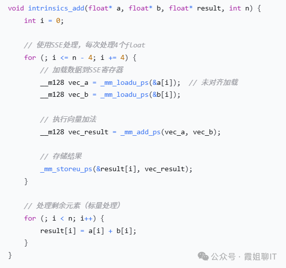
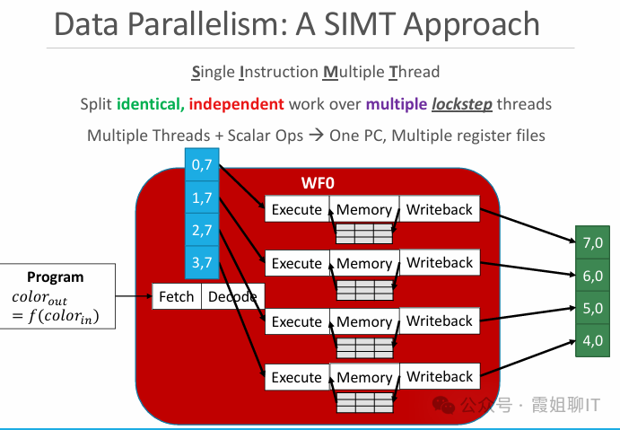

# 并行计算模型、编程模型及优缺点详解

## 一、并行计算模型的基础分类：Flynn 分类法

Flynn 分类法（1966 年）是并行计算模型的经典分类标准，以**指令流**和**数据流**的并行维度为核心，分为 4 类，是理解所有并行模型的基础：

1. **SISD（单指令单数据）**：传统单核 CPU，单控制单元发射单指令，单 ALU 处理单数据，无并行性，仅作基准参考。
2. **MISD（单指令多数据）**：单指令控制多个 ALU 处理多数据流，无实用商业场景，仅理论存在。
3. **SIMD（单指令多数据）**：本文核心，指令级并行的核心模型。
4. **MIMD（多指令多数据）**：最通用的并行模型，现代多核 CPU、分布式集群的核心架构。

## 二、核心并行模型详解：SIMD、SIMT

### 2.1 SIMD（单指令多数据，Single Instruction Multiple Data）

#### 核心原理

同一时钟周期内，**单个控制单元发射同一条指令**，驱动多个独立的向量 ALU（处理单元 PE），对多个数据元素同步执行完全相同的操作，属于**指令级并行（ILP）**，也叫向量并行。

核心特征：一条指令完成多数据的同构运算，无多线程上下文切换开销，并行性由硬件向量单元直接实现。

#### 硬件实现

- x86 架构：MMX、SSE、AVX2、AVX-512（主流消费级 CPU 标配）
- ARM 架构：NEON、SVE/SVE2（手机、服务器 ARM 芯片标配）
- RISC-V 架构：RVV 向量扩展

#### 并行编程模型

1. **编译器自动向量化**：GCC/Clang/ICC 的 - O3 优化，OpenMP 的`#pragma omp simd`指令，无需修改核心代码，编译器自动将循环转换为 SIMD 指令，门槛最低。
2. **显式 Intrinsic 函数**：硬件厂商提供的向量内置函数，直接映射到硬件 SIMD 指令，例如 AVX2 的`_mm256_add_ps`（256bit 单精度浮点加法），性能可控，灵活性高。
3. **专用向量编程语言**：Intel ISPC（SPMD Program Compiler），类 C 语法，自动将代码编译为多平台 SIMD 指令，兼顾开发效率和性能。

#### 典型适配算法

规则计算、访存连续、无分支 / 少分支的场景：

- 基础向量运算、矩阵乘法向量化、FFT 快速傅里叶变换
- 图像卷积 / 滤波、视频编解码、实时信号处理
- Bitonic 双调排序、字符串匹配、AES 加密等密码学算法
- 游戏物理引擎、实时渲染的顶点处理

#### 核心优点

1. **算力密度极高**：单指令可完成多数据运算，例如 AVX-512 单周期可执行 16 个单精度浮点运算，IPC（每周期指令数）呈数量级提升，峰值算力远超同规模串行 ALU。
2. **硬件开销 & 功耗极低**：单控制单元驱动多 PE，无需多线程的上下文切换、缓存一致性开销，功耗效率远高于多核并行，适合嵌入式、移动端场景。
3. **执行延迟极低**：运算完全在片内向量寄存器中完成，无跨核 / 跨设备通信开销，适合低延迟的实时计算任务。
4. **开发门槛低**：自动向量化可快速适配现有串行代码，无需重构业务逻辑，改造成本低。

#### 核心缺点

1. **灵活性极差，分支处理能力弱**：仅支持同指令同步执行，分支逻辑必须通过掩码（Mask）屏蔽不执行的 PE 通道，分支会导致算力浪费，完全不适合分支密集的不规则计算。
2. **对数据对齐 & 连续性要求严苛**：非对齐内存访问会带来 2~10 倍的性能惩罚，非连续、随机访存无法有效向量化，性能急剧下降。
3. **硬件绑定，可移植性差**：向量长度由硬件固定（如 AVX2=256bit、AVX-512=512bit），不同架构的 SIMD 指令集不兼容，代码跨平台移植成本极高。
4. **不规则场景算力利用率极低**：稀疏矩阵、图计算、树遍历等访存随机、计算量不均衡的场景，SIMD 的算力利用率通常低于 10%。
5. **功耗副作用**：AVX-512 等宽向量指令会导致 CPU 核心降频，反而可能拖累整体多线程性能。

------

### 2.2 SIMT（单指令多线程，Single Instruction Multiple Threads）

#### 核心原理

NVIDIA 于 2006 年 G80 架构首次提出，**介于 SIMD 和 MIMD 之间的混合并行模型**，是现代 GPU 的核心架构。

核心逻辑：单个控制单元调度一个**Warp（线程束，NVIDIA 固定 32 个线程）**，同一 Warp 内的所有线程在同一时钟周期执行同一条指令，但**每个线程拥有独立的寄存器文件、程序计数器（PC）、栈空间**，属于**线程级并行（TLP）**。

不同 Warp 之间可执行完全不同的指令，实现 MIMD 的灵活性；同一 Warp 内保持 SIMD 的高算力密度，兼顾算力和灵活性。

#### 硬件实现

- NVIDIA GPU：SM（流式多处理器）为核心单元，每个 SM 包含 Warp 调度器、CUDA 核心、寄存器文件、共享内存，Warp 是最小调度单元。
- AMD GPU：类似架构，调度单元为 Wavefront（固定 64 个线程）。

#### 并行编程模型

1. **CUDA C/C++**：主流 SIMT 编程模型，核心是**核函数（\**global\**）**，采用「Grid（线程网格）-Block（线程块）-Thread（线程）」三级层次结构。程序员仅需编写单个线程的串行执行逻辑，硬件自动将线程打包为 Warp 调度执行，无需关心底层向量长度。
2. **跨平台兼容模型**：AMD HIP（兼容 CUDA）、OpenCL、SYCL、oneAPI，支持多厂商 GPU / 加速器。

#### 典型适配算法

大规模、高并行度、同构计算场景：

- 深度学习训练 / 推理、大语言模型分布式训练
- 光线追踪、3D 渲染、影视特效制作
- 计算流体力学、分子动力学、量子化学等科学计算
- 蒙特卡洛模拟、密码破解、基因组测序
- 大规模矩阵运算、图像处理批量处理

#### 核心优点

1. **并行规模极致**：单个 GPU 可支持数万甚至数百万个线程并行，远超 CPU 多核的并行规模，峰值算力是同价位 CPU 的 10~100 倍，适合超大规模数据并行。
2. **灵活性优于 SIMD**：每个线程拥有独立的 PC 和寄存器，不同 Warp 可执行完全不同的指令，仅同一 Warp 内的分支会产生开销，可应对一定的不规则计算，分支处理能力远强于 SIMD。
3. **硬件级访存优化**：支持 Warp 内内存合并访问，只要线程访问连续的内存地址，即可合并为 1 个内存事务，大幅降低访存开销，对非连续访存的容忍度远高于 SIMD。
4. **编程范式友好**：单线程编程模型，程序员仅需完成「线程 - 数据」的映射，无需手写向量指令，开发效率远高于手写 SIMD Intrinsic。
5. **算力性价比极高**：GPU 的单位算力成本远低于 CPU，是目前 AI、科学计算的主流算力载体。

#### 核心缺点

1. **Warp 分支分化开销巨大**：同一 Warp 内的线程若执行不同分支（分支分化），硬件会串行执行每个分支路径，严重时性能下降 30 倍以上，是 SIMT 编程的核心优化难点。
2. **控制流 & 串行性能极差**：GPU 的控制单元极简，无复杂的分支预测、乱序执行能力，串行代码、分支密集代码的性能仅为同代 CPU 的 1/100~1/10，完全不适合通用控制任务。
3. **内存墙瓶颈突出**：GPU 核心数极多，但显存带宽有限，80% 以上的场景性能瓶颈在访存而非计算，需要程序员手动优化共享内存、访存模式，优化门槛高。
4. **编程 & 调试门槛高**：需要管理主机 - 设备间的数据拷贝、设备内存分配、核函数优化、线程同步、共享内存使用，异构调试难度远大于 CPU 多线程编程。
5. **可移植性差**：CUDA 仅支持 NVIDIA GPU，跨平台模型（HIP/SYCL）的性能和兼容性仍有差距，硬件绑定严重。
6. **调度延迟高**：GPU 的核函数启动、数据拷贝、线程调度延迟在微秒级，远高于 CPU 的纳秒级延迟，不适合低延迟实时任务。

------

### 2.3 SIMD vs SIMT 核心区别对比

| 对比维度     | SIMD                                 | SIMT                                           |
| ------------ | ------------------------------------ | ---------------------------------------------- |
| 并行粒度     | 指令级（向量级）并行                 | 线程级并行                                     |
| 核心执行单元 | 向量 ALU，共享 PC                    | 独立线程，每个线程有独立 PC、寄存器            |
| 调度单元     | 单指令驱动固定长度的向量通道         | Warp/Wavefront 为最小调度单元，固定线程数      |
| 分支处理     | 掩码屏蔽无效通道，全向量分支开销极大 | 仅同一 Warp 内分支分化有开销，不同 Warp 无影响 |
| 内存要求     | 严格对齐、连续访存，否则性能暴跌     | 支持合并访问，非连续访存容忍度更高             |
| 编程模型     | 显式向量操作，需关心向量长度、对齐   | 单线程编程，仅需关心线程 - 数据映射            |
| 硬件载体     | CPU 向量单元、DSP                    | GPU、通用加速器                                |
| 核心优势     | 低延迟、低功耗、高 IPC               | 超大规模并行、高算力、灵活性优于 SIMD          |

------

## 三、其他主流并行计算模型

### 3.1 MIMD（多指令多数据，Multiple Instruction Multiple Data）

#### 核心原理

多个独立的控制单元，多个独立的处理单元，**同一时钟周期内，不同处理单元可执行不同的指令，处理不同的数据**，是最通用的并行计算模型，覆盖从多核 CPU 到超算的全场景。

分为两大子类：

- **共享内存 MIMD**：多核 CPU、多路服务器，所有核心共享同一物理地址空间，通过共享内存通信。
- **分布式内存 MIMD**：分布式集群、超算，每个节点有独立的地址空间，通过消息传递通信。

#### 核心子模型

1. **SPMD（单程序多数据，Single Program Multiple Data）**：MIMD 最主流的子集，所有处理单元执行**同一个程序**，但每个单元处理不同的数据块，是超算、分布式计算的标准模型。
   - 代表：MPI、OpenMP、Ray
   - 优点：编程简单、负载均衡易实现、可扩展性极强，适配 90% 以上的并行计算场景。
   - 缺点：不适合任务差异极大的异构场景，灵活性弱于 MPMD。
2. **MPMD（多程序多数据，Multiple Program Multiple Data）**：MIMD 的全功能子集，不同处理单元执行**不同的程序**，处理不同的数据，适合异构任务场景。
   - 代表：MPI 多程序模式、微服务架构
   - 优点：灵活性极致，可适配任务类型差异极大的场景（如计算 + IO + 可视化协同）。
   - 缺点：编程复杂、同步调度难度大、负载均衡难实现。

#### 并行编程模型

- 共享内存：OpenMP、pthread、C++ std::thread、Intel TBB
- 分布式内存：MPI、MapReduce、Spark、Ray、Hadoop

#### 典型适配算法

- 通用计算、控制流密集、不规则计算：操作系统、数据库、事务处理
- 分布式大数据处理、图计算（PageRank、GNN）、稀疏矩阵运算
- 超算科学计算、大模型分布式训练、分布式存储

#### 核心优点

1. **通用性 & 灵活性无出其右**：可执行完全异构的指令和数据，适配所有计算场景，是唯一能运行操作系统、通用软件的并行模型。
2. **可扩展性极强**：分布式 MIMD 可扩展到数万个节点的超算，共享内存 MIMD 可扩展到上百核的 CPU。
3. **控制流性能极强**：CPU 的 MIMD 架构有成熟的分支预测、乱序执行、缓存优化，串行、分支密集代码的性能远超 GPU/SIMD。
4. **生态成熟**：编程模型、工具链、调试手段经过数十年发展，极其完善。

#### 核心缺点

1. **硬件开销 & 功耗极高**：每个核心都有独立的控制单元、寄存器、缓存，硬件复杂度高，算力密度远低于 SIMD/SIMT，单位算力功耗高。
2. **同步开销巨大**：多线程 / 进程间的锁、原子操作、消息传递会带来极大的开销，核数 / 节点数越多，同步开销占比越高，是并行性能的核心瓶颈。
3. **缓存一致性瓶颈**：多核 CPU 的 MESI 缓存一致性协议会占用大量片上带宽，核数超过 64 核后，一致性开销会导致性能增长严重非线性。
4. **编程 & 调试难度大**：多线程编程极易出现竞态条件、死锁、伪共享等问题；分布式编程需要处理数据划分、容错、节点通信，调试难度极高。
5. **负载均衡难**：不规则计算的任务量不均衡，极易出现部分核心过载、部分核心空闲的情况，算力利用率低。

------

### 3.2 流水线并行（Pipeline Parallelism）

#### 核心原理

将一个完整的计算任务拆分为多个串行的**阶段（Stage）**，每个阶段由独立的处理单元执行，数据像流水线一样依次经过各个阶段；一个阶段完成当前数据的处理后，立即处理下一个数据，实现不同阶段的执行时间重叠，提升整体吞吐量。

分为硬件流水线（CPU 指令流水线）和软件流水线（编译器优化、深度学习流水线）。

#### 并行编程模型

- 硬件流水线：CPU 硬件自动实现，程序员无需干预
- 软件流水线：编译器循环展开优化、CUDA 软件流水线、深度学习框架（PyTorch/TensorFlow）流水线并行

#### 典型适配算法

- CPU 指令执行、视频编解码、网络数据包处理、流式计算
- 大语言模型的层间流水线并行、信号处理、工业检测流水线

#### 核心优点

1. **吞吐量最大化**：可完全重叠不同阶段的执行时间，理论上吞吐量可提升 N 倍（N 为流水线阶段数），适合流式处理场景。
2. **硬件利用率高**：每个处理单元持续工作，无长时间空闲，算力利用率高。
3. **延迟可控**：可通过阶段拆分平衡单条数据的延迟和整体吞吐量。

#### 核心缺点

1. **流水线气泡开销**：分支跳转、数据依赖会导致流水线清空，产生气泡，严重影响性能（如 CPU 分支预测失败的惩罚）。
2. **阶段均衡要求高**：整体吞吐量由最慢的阶段决定，阶段间计算量不均衡会导致算力浪费。
3. **单数据延迟升高**：单条数据的处理延迟等于所有阶段延迟之和，高于单阶段串行处理的延迟。

------

### 3.3 模型并行（Model Parallelism）

#### 核心原理

针对单设备无法容纳的超大计算模型（如大语言模型），将模型的不同部分拆分到多个处理单元上执行，是大模型训练 / 推理的核心并行模型，分为两大子类：

- **张量并行**：将单个算子（如矩阵乘法）的参数 / 输入拆分到多个设备，同步执行，属于算子内并行。
- **流水线并行**：将模型的不同层 / 模块拆分到不同设备，按流水线方式执行，属于算子间并行。

#### 并行编程模型

- 代表：Megatron-LM、DeepSpeed、PyTorch FSDP、TensorFlow Mesh

#### 典型适配算法

- 千亿 / 万亿参数大语言模型的训练 / 推理、超大视觉模型、多模态模型

#### 核心优点

1. **突破单设备内存限制**：可运行单设备完全无法容纳的超大模型，是大模型技术的核心基础。
2. **充分利用多设备算力**：可将计算负载均匀分配到多设备，提升整体训练 / 推理吞吐量。

#### 核心缺点

1. **通信开销极大**：设备间需要频繁传输中间结果，对网络带宽 / 延迟要求极高，通信开销通常占比 30% 以上。
2. **编程 & 优化门槛极高**：需要处理模型拆分、通信调度、负载均衡、梯度同步，优化难度极大。
3. **可扩展性受限**：张量并行的可扩展性受限于算子大小，流水线并行受限于模型层数，无法无限扩展。

------

### 3.4 数据流模型（Dataflow Model）

#### 核心原理

与传统控制流模型（指令驱动）完全不同，**计算由数据的可用性驱动**：当一个算子的所有输入数据都准备完成后，该算子立即执行，无需程序计数器（PC）和指令流调度，可自动挖掘最大并行度。

典型硬件实现是**脉动阵列（Systolic Array）**，也是 Google TPU 的核心架构。

#### 并行编程模型

- 静态计算图：TensorFlow、ONNX
- 硬件描述语言：Verilog/VHDL（FPGA）、Chisel

#### 典型适配算法

- 矩阵乘法、卷积运算、神经网络推理、信号处理、密码学运算

#### 核心优点

1. **算力利用率极致**：无控制流开销，可完全压榨硬件算力，TPU 的算力利用率通常是 GPU 的 2~3 倍。
2. **功耗效率极高**：无需复杂的控制单元、分支预测、乱序执行，单位算力功耗远低于 CPU/GPU。
3. **并行性自动挖掘**：硬件自动执行所有可用的算子，无需程序员手动调度并行任务。

#### 核心缺点

1. **灵活性极差**：完全不适合分支密集、控制流复杂的场景，仅能加速固定模式的规则计算。
2. **编程门槛极高**：需要基于计算图编程，硬件实现需要硬件描述语言，开发成本极高。
3. **可重构性差**：脉动阵列等硬件一旦流片，无法修改计算模式，仅能适配特定类型的算子。

------

### 3.5 VLIW（超长指令字，Very Long Instruction Word）

#### 核心原理

编译器在编译阶段，将多个可并行执行的独立指令打包成一个**超长指令字**，硬件直接执行该超长指令，无需乱序执行、分支预测、动态调度等复杂控制电路，并行性完全由编译器在编译时决定。

#### 硬件实现

- DSP、嵌入式处理器、安腾处理器、手机基带芯片

#### 并行编程模型

- 编译器自动指令调度、手写汇编、专用 DSP 编译器

#### 典型适配算法

- 音视频编解码、基带信号处理、嵌入式实时计算、工业控制

#### 核心优点

1. **硬件开销极小**：无复杂的动态调度电路，芯片面积小、功耗极低，适合嵌入式场景。
2. **算力密度高**：单周期可执行多个独立指令，IPC 高，适合固定模式的信号处理。

#### 核心缺点

1. **极度依赖编译器**：并行性完全由编译器决定，编译器开发难度极高，通用场景的并行挖掘能力差。
2. **可移植性极差**：超长指令字的长度、格式由硬件固定，不同架构的代码完全不兼容。
3. **分支处理能力弱**：无动态分支预测，分支密集场景的性能急剧下降，不适合通用计算。

------

## 四、并行编程模型的分类与核心对比

并行编程模型是程序员与硬件并行架构之间的抽象层，核心分为三大类，对应不同的硬件模型：

| 编程模型类型       | 核心代表                     | 硬件适配                      | 核心优点                                         | 核心缺点                                                    |
| ------------------ | ---------------------------- | ----------------------------- | ------------------------------------------------ | ----------------------------------------------------------- |
| 共享内存编程模型   | OpenMP、pthread、std::thread | 多核 CPU、共享内存服务器      | 编程简单、数据共享方便、无需显式数据传输         | 可扩展性差、缓存一致性开销大、易出现竞态条件 / 死锁         |
| 分布式内存编程模型 | MPI、MapReduce、Spark、Ray   | 分布式集群、超算              | 可扩展性极强、无缓存一致性问题、支持超大规模节点 | 编程复杂、需显式处理消息传递、调试难度大、通信开销高        |
| 异构并行编程模型   | CUDA、HIP、SYCL、OpenCL      | CPU+GPU/NPU/TPU/FPGA 异构架构 | 可充分发挥异构硬件算力、性能上限极高             | 编程门槛高、需管理设备内存 / 数据传输、硬件绑定、可移植性差 |

------

## 五、并行算法的核心设计原则与阿姆达尔定律

### 5.1 阿姆达尔定律：并行计算的天花板

并行加速比的核心公式：

\(S = \frac{1}{(1-P) + \frac{P}{N}}\)

其中：

- S：并行加速比
- P：可并行化的代码比例
- N：处理器数量

核心结论：**无论并行度多高，串行代码的比例永远是加速比的天花板**。例如，若串行代码占比 5%，即使处理器数量无限多，最大加速比也仅为 20 倍。

### 5.2 并行算法的核心设计原则

1. **最大化数据局部性**：减少访存开销，尤其是 SIMD/SIMT 架构，访存是核心瓶颈，需优先使用片内寄存器 / 共享内存。
2. **极致负载均衡**：将计算任务均匀分配到所有处理单元，避免部分单元空闲、部分单元过载。
3. **最小化同步开销**：全局同步是并行性能的核心杀手，尽量用局部同步代替全局同步，减少同步次数。
4. **避免分支分化**：SIMD/SIMT 架构需尽量消除分支，用掩码、查表、向量化逻辑代替分支，避免算力浪费。
5. **优化内存访问模式**：SIMD 保证数据对齐，SIMT 保证 Warp 内合并访问，分布式模型减少跨节点数据传输。
6. **保证可扩展性**：算法性能需随处理器数量的增加呈线性增长，避免串行部分、全局同步成为瓶颈。

------

## 六、并行模型的适用场景总结与发展趋势

### 6.1 核心场景适配

| 并行模型          | 最优适用场景                                                 | 不适用场景                                     |
| ----------------- | ------------------------------------------------------------ | ---------------------------------------------- |
| SIMD              | 低延迟、小批量的规则计算：实时信号处理、游戏物理引擎、图像滤波、嵌入式计算 | 分支密集、随机访存、不规则计算                 |
| SIMT              | 大规模、大批量的规则数据并行：深度学习、光线追踪、科学计算、蒙特卡洛模拟 | 低延迟实时任务、串行控制流、分支密集的通用计算 |
| MIMD              | 通用计算、控制流密集、不规则计算：操作系统、数据库、图计算、分布式大数据处理 | 极致算力密度要求的大规模同构计算               |
| 数据流 / 脉动阵列 | 固定模式的 AI 推理、边缘计算、矩阵乘法、卷积运算             | 通用计算、分支密集、动态计算场景               |
| VLIW              | 嵌入式低功耗信号处理、音视频编解码、基带处理                 | 通用计算、分支密集场景                         |

### 6.2 发展趋势：混合并行架构

现代并行计算已进入**异构混合并行**时代，单一并行模型无法满足复杂场景的需求，主流架构均采用多模型融合：

1. **CPU 架构**：多核 MIMD + 每个核心集成 SIMD 向量单元，兼顾通用计算和向量加速。
2. **GPU 架构**：SIMT 核心 + MIMD 调度能力（不同 Warp 执行不同指令） + 张量核心（专用 SIMD 矩阵运算单元），兼顾大规模并行和通用计算。
3. **AI 加速器**：脉动阵列（数据流） + SIMD 向量单元 + RISC-V 控制核（MIMD），兼顾 AI 推理性能和可编程性。
4. **大模型训练**：数据并行 + 张量并行 + 流水线并行 + 序列并行的混合并行模式，突破内存和算力的双重限制。
5. **超算架构**：CPU+GPU 异构集群，融合 MIMD 分布式并行 + SIMT 大规模并行 + SIMD 指令级并行，实现 E 级算力。

# 详解并行技术SIMD、SIMT、SPMD

https://mp.weixin.qq.com/s/PdmZ7p9ubdlgxq2891W6Lw

在今天，几乎所有从事性能敏感领域开发的程序员，都会直接或间接地接触到SIMD和SIMT、SPMD等技术。理解这些概念，已经成为区分普通程序员和高级工程师的一个重要标志。今天就让霞姐带大家一起来学习一下吧！

## 一、SIMD

### 1．SIMD起源

SIMD术语来自Flynn分类法。

Flynn是个1934年出生的老爷爷，他的职业生涯聚焦在电气工程和计算机科学领域，尤其在计算机体系结构领域有着广为人知的成就。

Flynn曾参与 IBM 7090 计算机的研发，还担任过 IBM 360 系列中央处理器（CPU）的设计经理。

Flynn于1966年，在他离开IBM后加入西北大学时，提出了Flynn分类法。

当时Flynn在为《IEEE 会刊》（Proceedings of the IEEE）的一个计算机专题写文章，需要梳理整个领域的发展现状。他发现当时有很多并行计算相关的研究，但缺乏统一的分类方式，很难清晰地讨论这些技术，于是他提出了Flynn分类法。

***\*Flynn分类法抓住了计算机工作流程中的两个本质维度：指令流和数据流，并且提供了清晰易记的标准术语，很快就为业界所接受。\****

### 2．Flynn分类法

Flynn根据计算机架构可以同时处理的指令流（进程）和数据流数量对计算机架构进行分类，将其分为四类：SISD、SIMD、MISD 和 MIMD。

***\*SISD（单指令单数据）\****：一个指令流处理一个数据。就是最常见的冯诺依曼模型。

这种架构下，处理元件的速度依赖计算机内部信息传输速率，如主频、IPC、内存层次结构和缓存等。

***\*SIMD（单指令多数据）：\****能够在所有CPU 上执行相同的指令，但在不同的数据流上运行。基于SIMD 模型的机器非常适合科学计算，因为它们涉及大量矢量和矩阵运算。主要代表性的系统有Cray的矢量处理机。

***\*MISD（多指令单数据）：\****能够在不同的PE上执行不同的指令，但它们都在同一数据集上运行。使用 MISD 模型的机器在大多数应用中都没有用处，有少量机器使用此模型，但他们都没有商用。

***\*MIMD（多指令多数据）\****：一种多处理器机器，能够在多个数据集上执行多个指令。MIMD 模型中的每个 PE 都有单独的指令和数据流;因此，使用该模型制造的机器能够用于任何类型的应用。绝大多数现代并行系统都属于此类型。

MIMD按照内存组织方式不同，又可划分为共享内存（NUMA、SMP）和分布式内存模型（MPP、集群）。

### 3．现代计算机和SIMD

我们现在说的SIMD，和Flynn分类中的SIMD系统还有些区别。

现在的计算机一般核心是MIMD或者SISD系统，而SIMD是其中一个功能单元。

从下面AMD的cpu图中可以看出来，simd是cpu硅片的一部分。

现在，x86和arm的cpu都支持simd指令。

Intel在1997年就推出了针对多媒体应用的MMX，后续又陆续推出了SSE系列、AVX系列，以及近些年针对AI矩阵计算设计的AMX指令集等。

ARM则从2000年开始逐渐引入NEON、SVE系列，以及针对矩阵计算的SME。

4．理解SIMD

SIMD单指令多数据，是在寄存器级别，一条指令同时处理多个数据元素；与之对应的是SISD，SISD一条指令只能处理一个数据元素。

另外，SIMD的并行是寄存器级别，意味着它是在单线程内并行处理多个数据。

我们可以类比一下这样的现实场景：

多线程，相当于多个厨师。

SISD，相当于给厨师切菜的刀是普通水果刀，因此只能切一根萝卜。

SIMD，相当于把厨师切菜的刀换成了西瓜刀，西瓜刀同时能切四根萝卜。

SISD一次能处理一个数得到一个结果，而SIMD能一次处理多个数得到多个结果。

### 5．SIMD并行编程

SIMD是寄存器级别并行，那么是否意味着，我们是否一定要进行汇编语言编程才能使用它呢？

答案是否定的。程序员(我指C语言哈，其它语言我没有深入使用过)可以通过四种方式享受到SIMD的高性能。

(1)编译器自动优化

对于简单循环等简单情况，编译器可以自动识别并向量化。此时代码不需要任何特殊处理，只需要在编译时使用类似下面的命令生成可执行文件即可。

启动自动向量化：gcc -O3 -march=native -ftree-vectorize -fopt-info-vec-missed demo.c -o demo

或者显式启用sse/avx：gcc -O3 -msse -msse2 -mavx demo.c -o demo

(2)OpenMP导语

可以使用编译导语显式指导向量化，再用类似gcc -O3 -march=native -fopenmp demo.c -o demo命令编译即可。

(3)Intrinsics 函数

Intrinsics函数是编译器提供的一种高级的编程方式，它允许程序员使用类似于函数调用的语法来直接操作SIMD指令。这些函数在编译时会被转换为对应的SIMD指令，从而实现对数据的并行处理。

下面的例子中使用了_mm_*这些Intrinsics函数来执行了加法的批量处理。

(4)内联汇编

  也可以内联汇编直接用指令进行操作达成目的：

在实际项目中，可以先尝试编译器自动优化，如果不满意，可使用OpenMP SIMD导语显式提示编译器优化。对于性能关键部分，可使用 Intrinsics函数手动控制，极端情况下，可以研究研究内联汇编。

## 二、SIMT

### 1．SIMT起源

SIMT（单指令多线程）是NVIDIA（06年有硬件基础，07年随CUDA平台发布）为其GPU架构提出来的并行计算模型。这个名字听起来怪怪的，如果按照“单个指令处理多个线程”来理解的话，甚至会感觉很不通顺。

SIMT指的是多个线程同时执行相同的指令，但可以处理不同的数据。这里的线程可以成千上万个。

**其实SIMT的底层还是SIMD。**

在GPU 上执行过程中，透明的硬件机制会将线程分组为 “线程束（warp）”，并在 SIMD 单元上以锁步（lockstep）方式执行这些线程的指令.

具体举个例子，在NVIDIA GPU中，32个线程被组织成一个warp，当执行一条加法指令时，底层硬件会调用32宽的加法单元，同时对32个线程的输入数据执行加法。

### 2．Why SIMT

既然SIMT底层是SIMD，那为什么NVIDIA不说自己的GPU是SIMD，而是生造了一个SIMT呢？霞姐认为，原因有三个：

(1)SIMT在 SIMD 基础上允许以 “线程” 形式编程，无需像传统 SIMD 那样手动处理数据打包，降低 GPGPU 开发门槛。

(2)SIMT的硬件设计上，相比于传统SIMD，进行了优化。SIMT的每个线程有独立的寄存器文件和程序计数器（逻辑上），硬件可通过 “线程切换” 隐藏内存延迟（当一个线程等待内存访问时，快速切换到另一个就绪线程）；

(3)SIMT强调GPU的多线程，能区别于CPU上的SIMD技术，在市场上更具记忆点。

### 3．SIMT编程

以对两个大型浮点数组进行元素级相加为例，程序员只用写标量代码，硬件自动实现并行：

而在第一节SIMD编程中，程序员则需要了解更多的硬件细节，比如具体的向量宽度，处理长度不是硬件整数倍的情况等。

另外在带条件分支的运算等复杂场景下，SIMT会处理的更加简单直观。

## 三、SPMD

### 1.SPMD起源

SPMD（单程序多数据）概念雏形于上世纪70年代末出现。当时研究人员开始构建第一批并行计算机，发现科学计算中的许多问题（气候模型、物理模拟、矩阵计算）天生就具有数据并行性，而最直观的解决方案就是：编写一份处理单个数据单元的程序，然后在多个处理器上同时运行这个程序的副本，每个副本处理不同的数据单元。 这就是 SPMD 的核心思想。

1988 年，在由 IEEE 组织的一次关于“可伸缩并行计算机”的重要研讨会上，Darema 等人的论文明确地描述并定义了 SPMD 模式。SPMD被确立成一个术语：它是 MIMD 计算机的一种主要且实用的编程模式，而不是一个全新的硬件架构类别。

  SPMD 模式在1990年代初期，随着消息传递接口（MPI） 标准的诞生    而普及。

MPI提供了一个标准化的库，允许运行在分布式内存系统上的多个进程通过发送和接收消息进行通信。MPI 程序几乎总是以 SPMD 风格编写，它的成功使得 SPMD 成为了高性能计算领域事实上的标准编程模型。

### 2.SPMD vs SIMT

从程序员和编译器的角度看，SIMT也是一种SPMD。因为在SIMT编程中，程序员编写一个单独的程序或内核（kernel），随后大量的内核实例（或线程）会并行运行。

当然SIMT是软硬件优势结合形成的一个概念，SIMT可以理解成：SPMD 的编程抽象 + 硬件的 SIMD 执行 + 自动的线程管理。

### 3.SPMD编程

下面是mpi程序的一个示例：

综上所述，从Flynn分类法的理论奠基，到实践中应运而生的SPMD编程模型，再到NVIDIA为释放GPU算力而创造的SIMT架构，从这三个术语可以隐约窥探到并行计算技术的发展历程。

它们并非相互替代，而是在不同层级和场景下协同作战，共同构成了现代计算的并行基石。SIMD 专注于数据级的细粒度并行，SPMD统领着从单机到集群的宏观并行，而SIMT 则通过通过精妙的软硬件抽象，让成千上万的线程能够高效协同，开启AI与图形计算的崭新时代。