# HI36A0 分析

来源：https://kurnal.xlog.app/HI36A0

这应该是能找到最详细的麒麟 9000 解读了（第三方）
虽然说 Techinsights 好像也有该芯片的解析

这是预估的

但是私以为价格过于昂贵，以及对 Dieshot 迷恋
遂写之
以下是正文

2022 年 12 月初
购买了几片 Hi36A0 的工程样品
带 SMIC 自 封装闪存
以及展示用基板
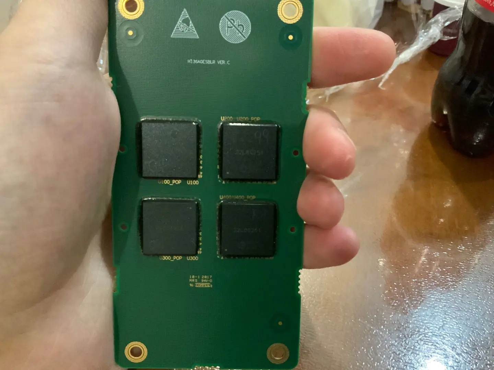
还有一片**HimFOP***（Hi Mechanical sample Fan Out Package）*，

开出来后是纯粹的硅
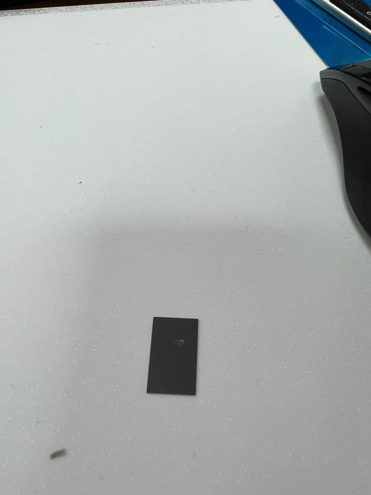

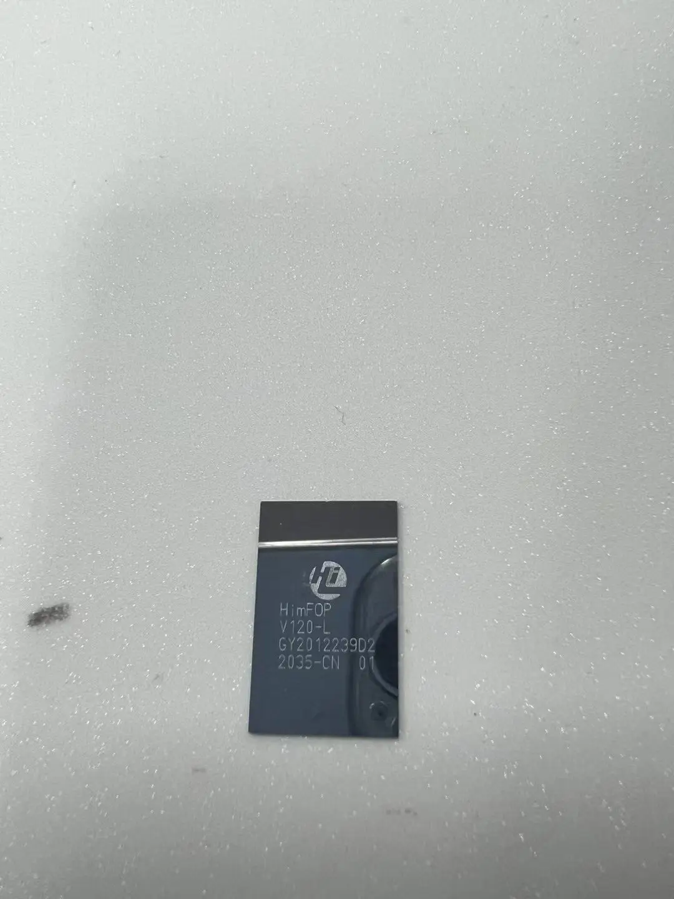
这就是后话了

**## 正文**
Hi36A0 就是麒麟 9000，Kirin9000
正式发布时间为 2020 年 10 月 22 号
20 年 42 周发布。
**根据目前已知的自己查询到的资料来说，**
*CS-ES-HVM 总时间为 1938TW-2038TW，
2021 年后由 **?** 封装，HVM 时间则不明*
其中，1938TW 是咸鱼看到的，存在，啊，及证明了其生产周期，奈何钱财不够
没有进行一个购买
**图片鸽子**
手头的存在的只有 1952TW 以及 2037TW

## **芯片解析**[#](https://kurnal.xlog.app/HI36A0#芯片解析)

12 月初，购买了几片 Hi36A0 的工程样品，带自封装闪存

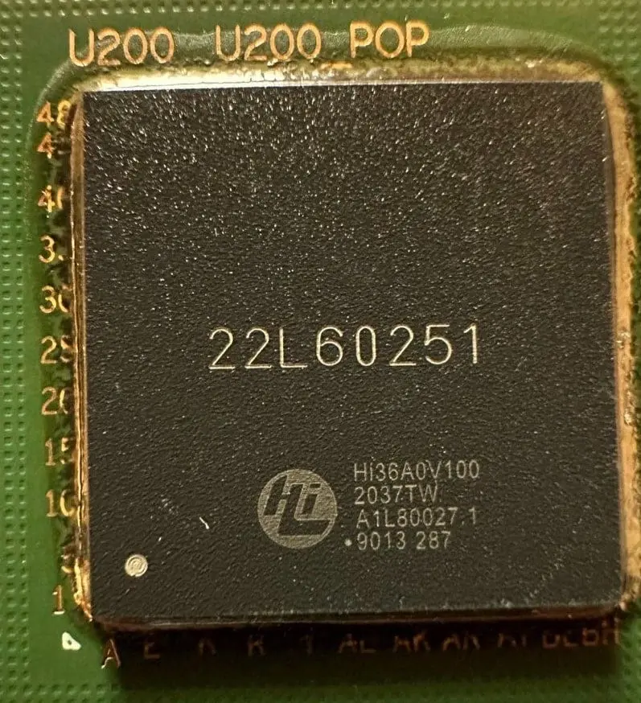

为 pop 封装，遂上风枪吹下 bga
得到 hi36a0 的 die

**## 丝印编号解析**
丝印编号为
***HISILICON-HI36A0-GFCV010-HR1381952-1952TW 01 01\***

该丝印解读则为
***海思麒麟 - 芯片代号 - 版本号 - 生产厂商 / 设备产线 / 时间 - 封装时间***

**HISILICON**：海思麒麟
**Hi36A0**：上代 990 则为 HI3690，为代数编码
**GF CV010**: CV010 则是芯片步进说明该芯片为研发样片（***Engineering Sample***）中的预生产片， 正式版的 GDS 版本（正常上机）一般为 GF CV100，更改 GDS 版本则说明该芯片设计版图更改，例如**HI3690V100/HI3690V200**，则为**990 4G/990 5G**，内部丝印与外部版本丝印相同

***HR1381952\*** 拆分则为
**HR**: Fab，推测为 TSMC Fab18
（H 为 Fab 代号， R 应该是产线代号
以下为估测命名
(H,Y,G,C,D)(D,P,R)
H FAB18
Y FAB15
G FAB14
CD(SMIC/SN1)
**138**: 产线 / 机台 / 批次 / 芯片方位图？
**1952**:19 年 52 周曝光

**1952TW**：19 年 52 周台湾生产，

## **Decap 数据**[#](https://kurnal.xlog.app/HI36A0#decap-数据)

这是你在表面上能看到的数据，需要更深的研究，那么就只能 Decap
刚好我有认识的开盖公司联络，遂开之
那么得到了几张图

*金属层 电子显微镜摄影*

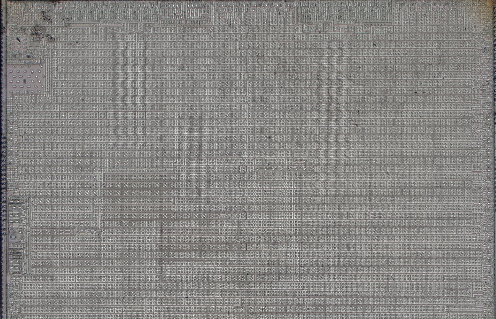
*金属层 金相显微镜摄影*

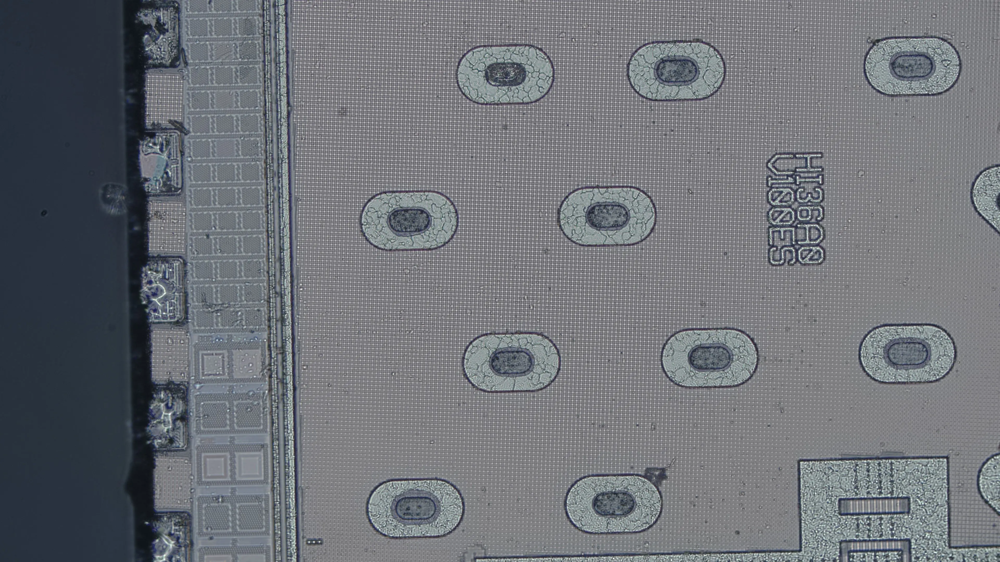

Decap 后用电子显微镜拍摄
可以很明显的看到 Diemark
****HI36A0 GFCV010\****则是****HI36A0 V100\**** **ES**版本，

**Diemark 解析**
华为内部芯片设计的时候一般是双版本进行 CS 迭代，CS1,CS2，例如 HI3690V100 则为 CS1,Hi3690V200 则为 cs2，

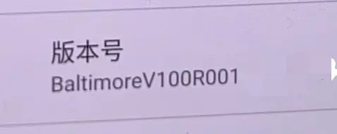

麒麟 9000 研发代号叫**巴尔的摩**（*Baltimore*），
版本号 V100 则说明为 CS1 方案
说明 该芯片的 *Top Mark* ：_GFCV010_则为**Baltimore CS1 V100ES**
遂开其他 Die
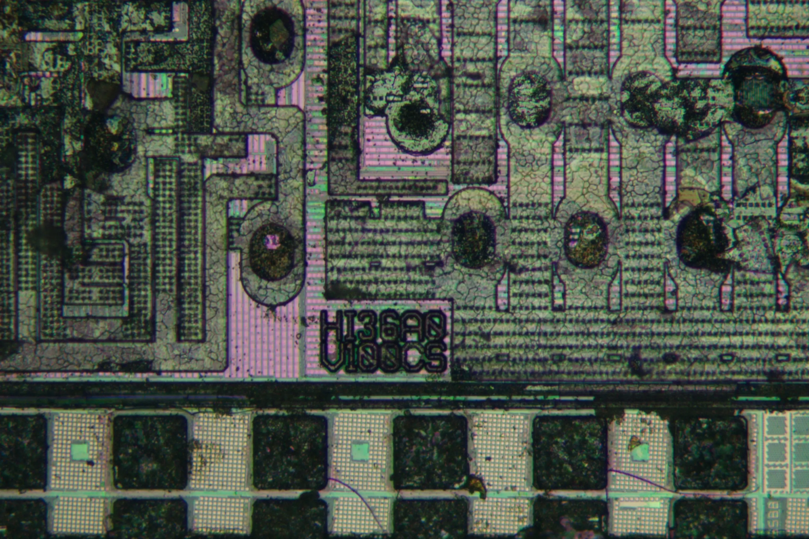
该产品则为**Baltimore CS1 V100CS**

如图所示，该机型为华为工程机，工程机边框刻蚀的为**AN00E-V4-B2**
为原定的***Mate40Epro\***

**解析**
***AN00\*** : 手机版本
***E\*** : 阉割 (有**Q**,**T/M**,**E**： Q T/M (忘了是哪儿个版本) 是 MTK，E 阉割
***V4\*** : V 版本 mark4，后面版本则为是 VN

## **对准系统分析**[#](https://kurnal.xlog.app/HI36A0#对准系统分析)

该图则为（不确定厂商）机台的**自对准标识**（TTL?TSA?TIS?）也许是**Athena**（*advanced technology using high order enhancement of alignment*）

规律裂纹白色圆圈则为**Bump** 点，则为预留焊点引出**Fan Out**

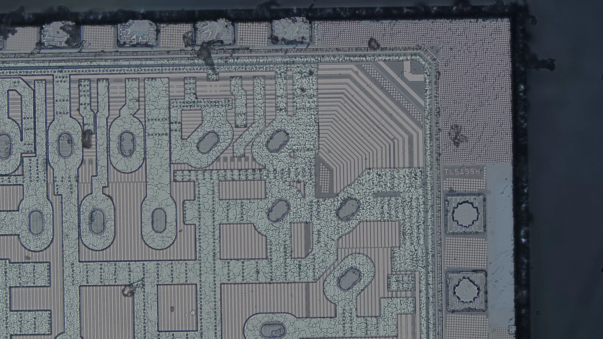

**重要的是这一张图**，这张图***TL5115H(TLS1SSH?)\***右边，有一些规律条纹，由旋转 45 度的等间距线条组成
那么很显然，这很清楚的告诉了我们，这就**ASML**的**Smash**（*Smart Alignmnet Sensor Hybrid*）技术，该对准标识宽度为 38um（可拓展），长度则为 160um）该技术的优点是仅需扫描一次就可获得该 Wafer-Mask 的 X/Y 轴向位置偏差分辨率，
该设备显著的提升了机台对准速度 / 效率，虽说先进工艺好像要用 orion 罢了。
这就能判断出该 tsmc 使用的对准昔系统为 smash，该产品在 euv 上使用

## **SEM 报告**[#](https://kurnal.xlog.app/HI36A0#sem-报告)

这些是初步的 Decap 所观察到的，我们业余爱好者仅限于如此。
那么下一步就是 SEM 了？
SEM 鸽

## **Dieshot 解析**[#](https://kurnal.xlog.app/HI36A0#dieshot-解析)

那么既然进行酸洗了
那么完全可以进行一个 Dieshot 的绘画
虽说市面上已经拥有了 Kirin 9000 的 Dieshot 以及初步的 Layout
但是既然干了就得干好，我们粗略的绘画加以精细辅助

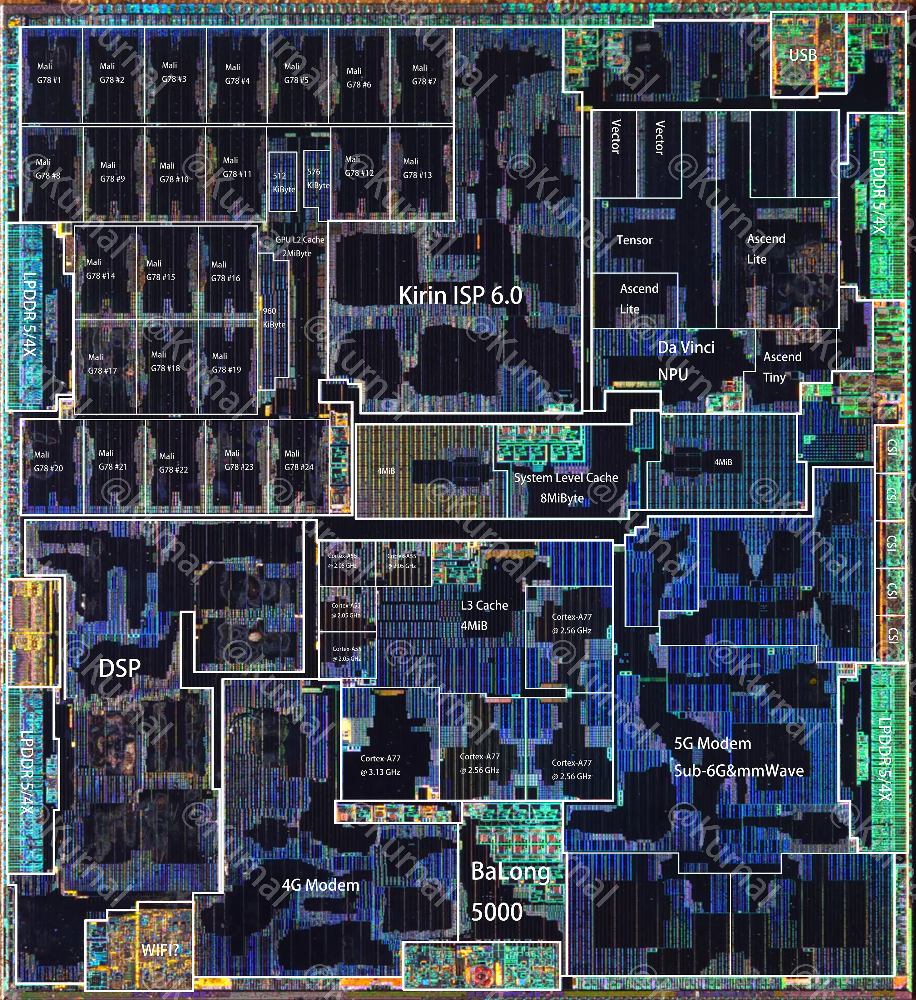

也没什么好说的，就这样吧

## **产能计算**[#](https://kurnal.xlog.app/HI36A0#产能计算)

根据 TSMC**公开的情报**
进行一个**产线估算**

单台 3400B 机台最高曝光 *155 次*/*h*
一天就是 3720 次曝光

**已知 N5 EUV 在 Kirin9000 中大概在 90 Mask wafer 中需要 12-15 片 EUV Wafer**，~~*（虽说 N5 是 81Mask（一般来说为（69 193i mask+11-13）EUV Mask 转化成 EUV 也就是本来 DUV5 片 Mask 的情况下，EUV 一次即可，但是问题在于这只是最佳情况下，实际使用并不会如此）*~~

公式为 *（3720/(12~15）*
得出**单台 3400Bi 满载运行 日产大约 310~248Wafer**

又：
刚开始 4 月 月产 30K
后面 6-8 月份提升到 50K
~~（更新：问了问内鬼，大概是 20k（2 月）-25k (3 月)-30k（4 月）-35k（5 月）40k（6 月）45k（7 月）50k（8 月），反正估算而已~~

公式为 ***产能 /（台 x 天）=100% 稼动率情况，x 实际稼动率\*。**

在**月产 30kWafer 的情况下：**

***稼动率 50%***
3 0000/（248x30）=4.0322580 台
50% 稼动率 = 8.064516 条 3400B 可以使用
3 0000/(310x30)=3.22580 台
50% 稼动率 = 6.45161290 条 3400B 可以使用

在**月产 50kWafer 的情况下**

***稼动率 50%***
5 0000/（248x30）=6.720
50% 稼动率 =**13.440860 台**
5 0000/(310x30)=5.3763440
50% 稼动率 =**10.7526881 台**

***稼动率 60%\***
5 0000/（248x30）=6.720
60% 稼动率 =**11.200 台**
5 0000/(310x30)=5.3763440
60% 稼动率 =**8.960 台**
后面月产提升到 50K，也就是**新增了 3-5 台 3400B**

那么这**5k wafer**的差额呢？
也就是
5000/(248X30)=0.6720
50%=**1.3440860 台**
5000/(310X30)=0. 53763440
50%=**1.07526881 台**
**也就是每月产新增 5k 产能即该月新增 1-1.5 台 HVM 的 3400B 产线**

也就是能说明，
在 2020 年，4 月（左右） 大概有 6~8 台 3400B HVM 产线（30k）。
在 2020 年，6-8 月份（左右）新增了 3~5 台 3400B HVM 产线（45k）
在 2020 年，2-9 月每个月平均增加 1-2 台 3400B HVM 产线（5k-7.5k）

~~这些消息国内互联网上没有消息，因为这是数据机密，我是按照自己的数据推算出来的。~~
**TIPS**：
为什么只算了 euv：因为一片 Wafer 生产流程中不一定所有的 Mask 都是先进工艺，**一般只有 Resistors，Metal/Via 的 0-3 层使用先进工艺**，其余的一般都为 ArF 193（甚至部分的 KrF 248 或 Hg i Line 365）

为什么没有计算 LELE：因为 LE 一次一片 Mask 算在 EUV Mask 里面了，15 片

## **良率计算**[#](https://kurnal.xlog.app/HI36A0#良率计算)

以下算法皆为
划道宽度为 0.08mm
边缘去除 0mm
Poisson 模型

目前在 TSMC 的工程研发阶段，有两种**TEST Die**
A:**256Mib SRAM+Logic+IO 块（17.92,mm2）***按照 4x4.48 计算*
B: **512Mib SRAM(9.891mm2)** *按照 3x3.297 计算*

已知**平均良率** **80%**，**峰值良率** **90%**（忘了哪儿看的了）

计算公式

求 TSET D0

A 的 D0 为
**1.25（80.27%）** 立为 A1 80% Yield
**0.6（89.89%）** 立为 A2 90% Yield

B 的 D0 为
**2.3（80.00%）** 立为 B1 80% Yield
**1.1（89.78%）** 立为 B2 90% Yield

那么按照 Kir9000 Diesize 10x10.6 计算
能切 596 个 die
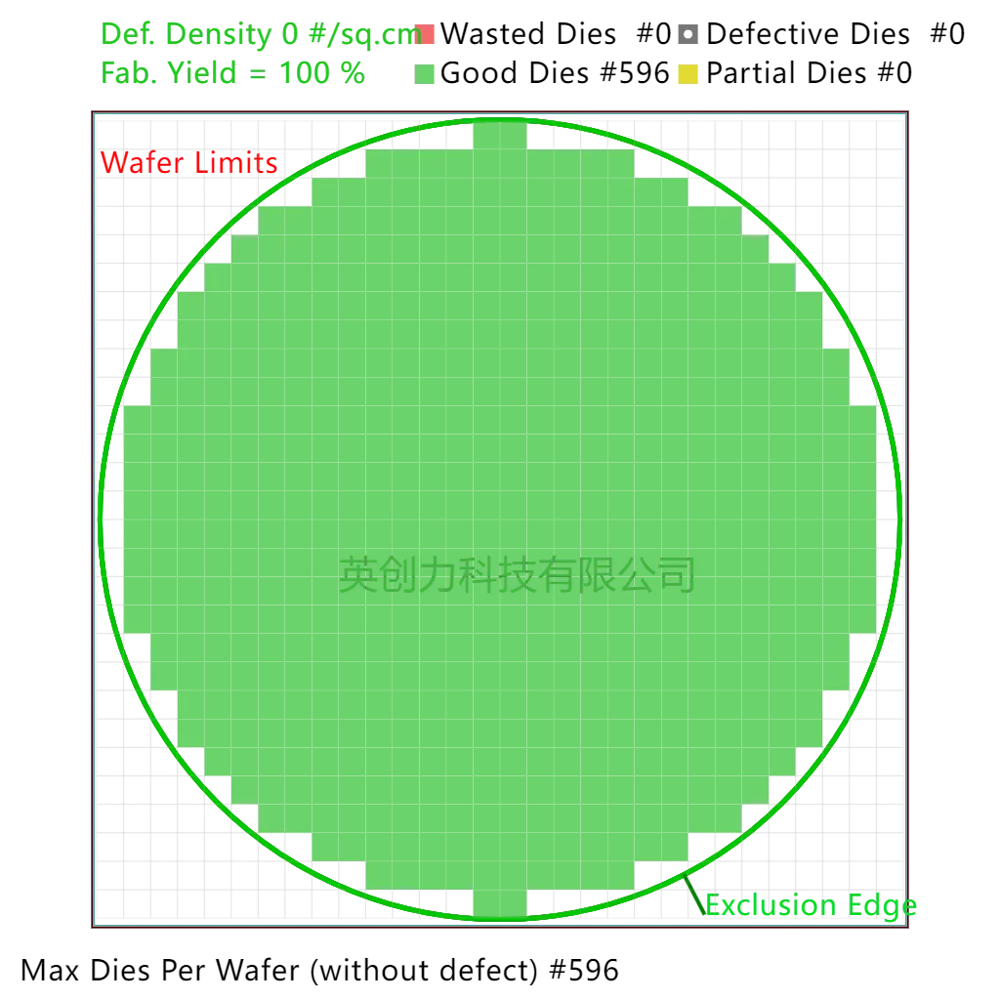

带入 D0

A1:
D0=1.25
Yield=30.7% 183/596

A2:
D0=0.6
Yield=54.75% 326/596

B1:
D0=2.3
Yield=14.01% 84/596
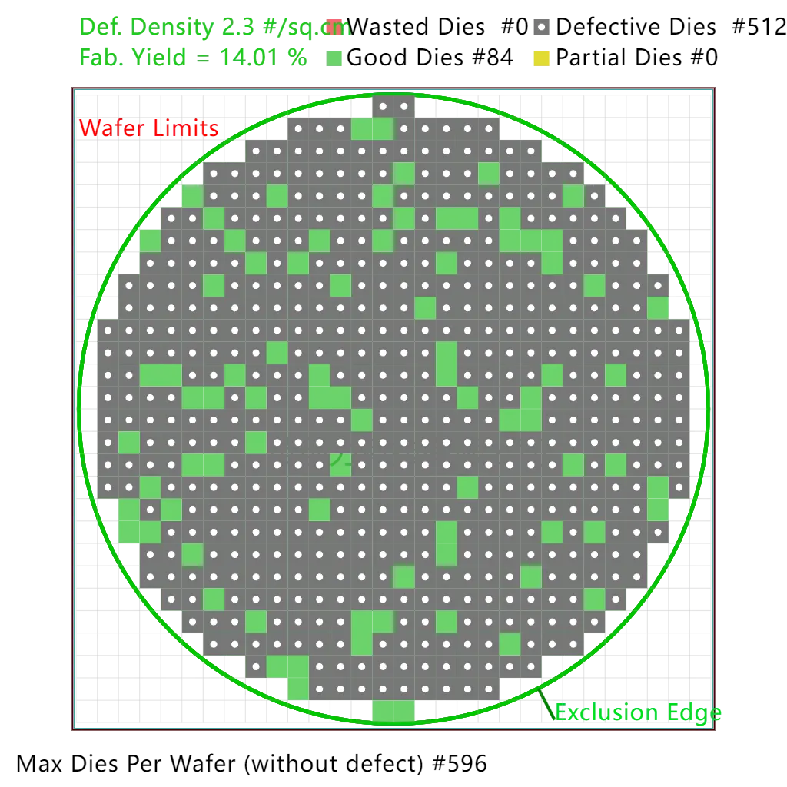

B2:
D0=1.1
Yield=34.86% 208/596
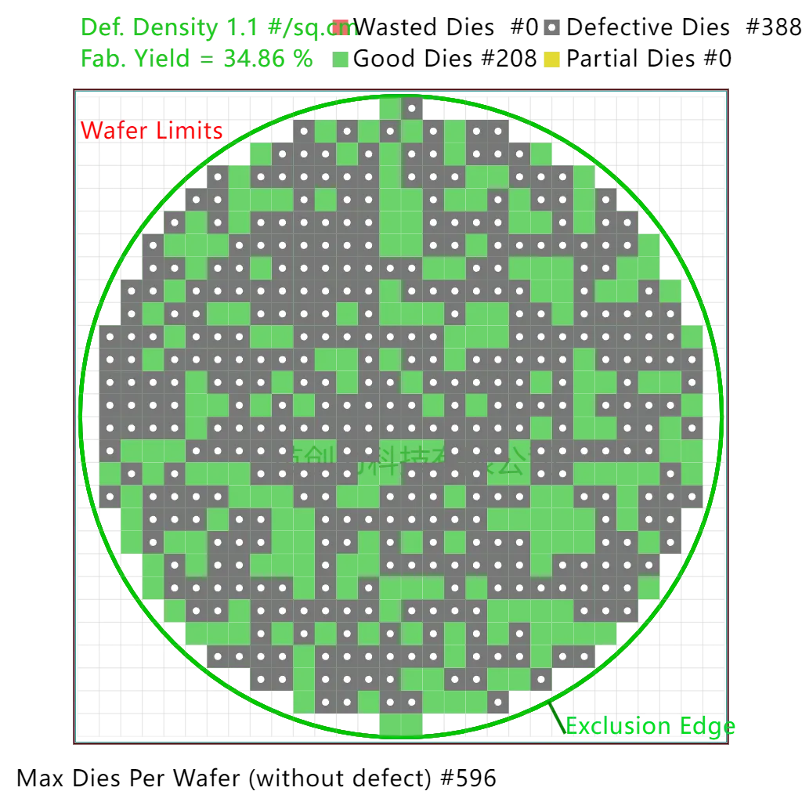

用理论最高 Yield 数字
峰值为 D0=1.1
Yield=34.86% 208/596
平均为=1.25
Yield=30.7% 183/596
***是不是很高，那是因为没有谈论 DTCO.... 如果带入 dtco 计算复杂度很高，就不带入了，提示一下\***

那么 数据也就是在 2020 年 05 月 大概的良率是 40% 上下，2020 年 9 月 15 停的时候大概是 45% 左右

2020 05：D0=0.95 Yield=39.72% 237/596

2020 0915：
D0=0.81 Yield=45% 268/596

很显然得出，D0=1.25-1.1 在 2019 11 月

也就是在 20 年 5 月进行了一个猛烈的良率爬坡，或者提升了稼动率

那么带上产能分析

该产品产能 Die=
Wafer 可切割 die 数量 x Yield x（机台曝光次数 / Wafer 所需 mask）x 稼动率 x 设备数量 x 生产时间小时 x 生产份额比例

总产能 = 设备数量 X 生产时间 / Wafer 所需 Mask x 稼动率 x K1 (例如液滴发射器)

也就是
该产品产能 Die 数量 =
总产能 / 分配产能 x MPW x Yield

总产能 = DPW* Yield * （曝光每小时 / 曝光次数） * 稼动率 * 机台数量 * 生产时间 * 分配产能 * K1 工艺因子：(DTCOx 液滴发射器长时间工作效率)
结果如下
2020 02:596x35%x(155/15)x50%x4x696x40%x85%x80%=816136.6528
2020 03:596x37%x(155/15)x50%x6x744x40%x85%x80%=1383411.93216
2020 04:596x38%x(155/15)x50%x7x720x40%x85%x80%=1604130.6624
2020 05:596x39.72%x(155/15)x50%x8x744x40%x85%x80%=1980148.53657
2020 06:596x45%x(155/15)x50%x9x720x40%x85%x80%=2442379.392
2020 07:596x45%x(155/15)x60%x11x744x40%x85%x80%=3701561.65632
2020 08:596x45%x(155/15)x60%x13x744x40%x85%x80%=4374572.86656
2020 09:596x45%x(155/15)x60%x13x360x40%x85%x80%=2116728.8064
HI36A0 总产能为：18419070.51 片，也就是 1841.9070 万片 Hi36A0 包含了其变种 Hi36a0L/E

以上全部数据皆为猜测，若与实际相同为运气好，作者为 Kurnal，转载请说明