# 麒麟9000s 芯片级解析

来源：https://kurnal.xlog.app/Hi36A0V120fenxi

## 总起

Hi36A0V120，内部代号则为夏洛特（Charlotte）

CPU: TSV120+TSV120+A510
SUB: 自研总线
GPU: 马良 910
NPU: 迭代的，应该还是 Da Vinci NPU，1b+1l 设计
Modem: 没有叫法， 但是能从 Dieshot 看到其没有 pcie，说明其基带为集成
制造工艺则是 Smic7

## Decap 分析

首先我们这次开的是 Gugugu 给的 Die，拆机来自于刚买的 Mate60Pro

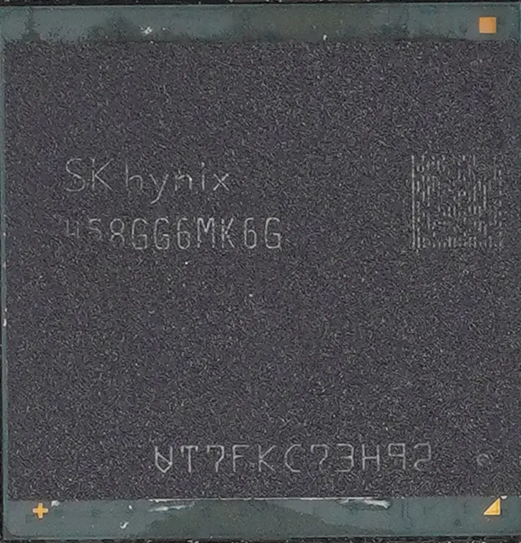

很显然为 pop 封装

Top Package 为海力士颗粒

吹下得到

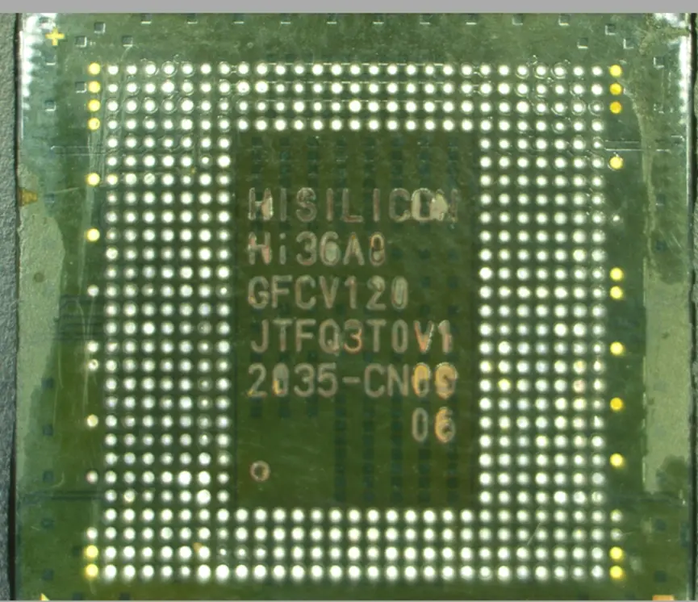

Topmark 为
Hi36A0
GFCV120
JTFQ3T0V1
2035-CN09
06

## DataCode（TOP Marking）解析

HiSilicon 为：海思半导体

Hi36A0 说明为 Hi36 产品线，A0 说明产品为第十代产品（123-9ABCD…）

V120 中的 1 在其他芯片上则是产品代数（例如电视机的，第一代 v100 第二代 v200）在 Hi36 系列只有 Hi3690 有 V100/V200，则是双方案，不确定含义

2 则是设计 gds 版本更改，一般是量产后慢慢优化啊，hi6260v131 啊这种

0 则是小优化，其余看不出来规律

2035CN 理论上来说是封装日期，09 代号 厂封装的

X 光出来的图表示其为 FanOut Package 封装

那么就是打 X 光了

## X Ray

X 光打出来就很明显为 FanOutPackage

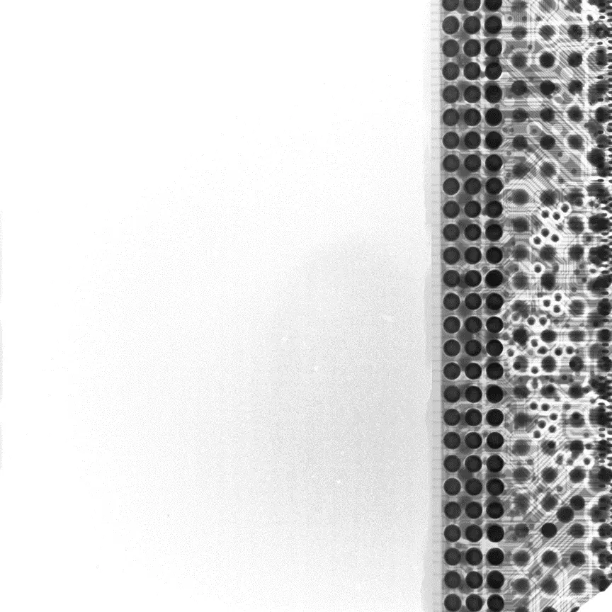

边缘 3 条黑色点是 Top Package 与 Bottom Package 互联的 bump 点，但是很奇怪的是并没有在实物图中看到，不处于同一层封装 package，可能存在后期使用其他厂商的闪存芯片，（节省了重新封装的时间？）
也有可能是 Bottom Die 内走线

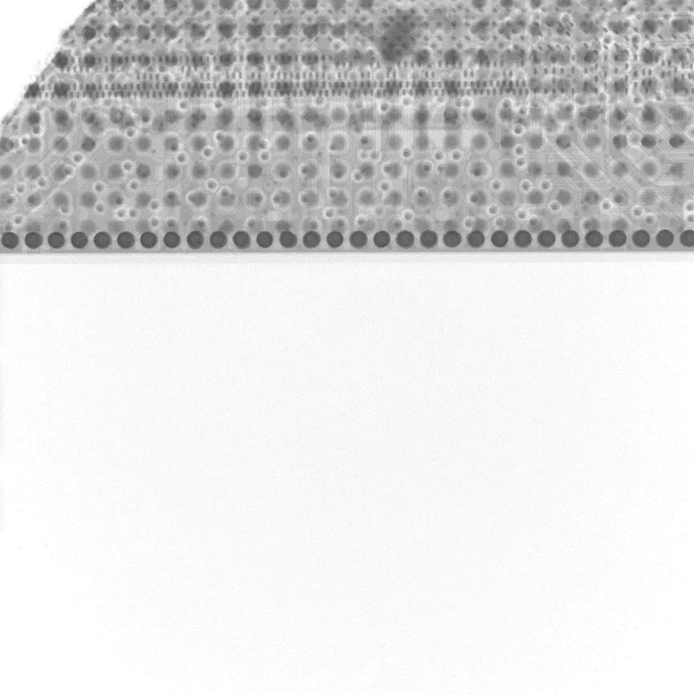

其边缘可以很明显看到 Die 与边缘 io Phy 引出层的连接邦定点，可以预估的判断出其 DieSize，大概是 10x10 左右

这些就是 x 光图可以看出来的数据，该 decap 了

## Decap

Decaping

Decap 后拍摄可以看出

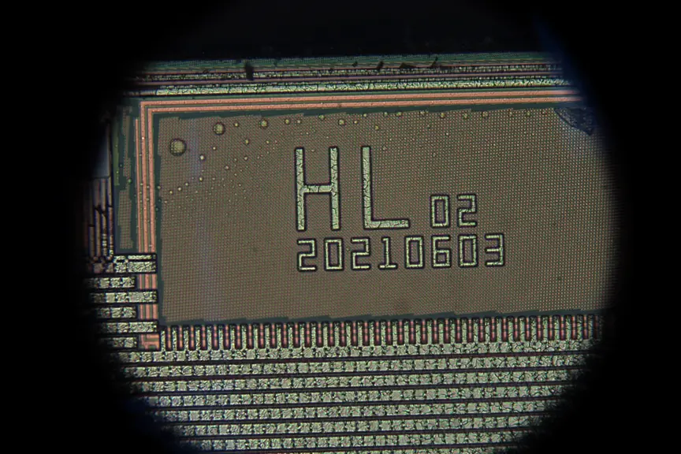

其 Diemark 疑似为 HL 02 20210603，也就是 2021 年 6 月 3 日生产
这是一个很奇怪的数字
因为外封装为 2035cn
其内部真实生产日期为 20210603，我认为 topmark 的 2035CN 就是伪装的，甚至是固定的

其余在任何地方都没有找到疑似 Diemark
这次不像之前的 Kirin 采用的是 Hixxxx Vxxx 的版本号
直接看不到了
无法判断其产品具体代号 / 版本阶段（例如实际是 Hi36A0/Hi36B0？）
本人认为该产品属于全新一代产品，而不是简单的 V120，版本步进迭代，而是全新的产物，当然没有足够的证据以支撑本人的观点

## 对准系统分析

其边缘对准系统看到了 3 处
证明其部分产线设备为 asml 的步进式光刻机
其记号为通过套刻测量设备的自动化识别套刻记号

线条套线条记号（Bar in Bar mark）

线条套线条记号（Bar in Bar mark）

AIM 套刻记号

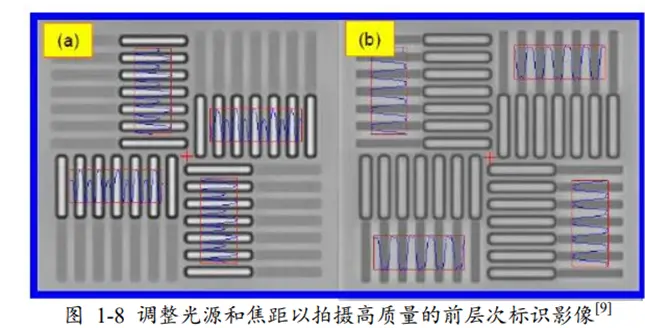

AIM 套刻记号

疑似佳能对准系统（i-line 和 KrF）

最重要的是这个对准系统
在这张图中

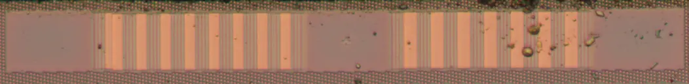

可以看到规律竖条条纹，一组为 9 条，一组为 8 条，每条内有 4 根均匀的竖状条纹

这就是很清楚的告诉了我们，该芯片使用的最先进的机台的对准系统为
ASML 的雅典娜对准系统 Athena
其中该条纹属于 Versatile Scribeline Primary Mark（VSPM） AH74

该对准系统只有在 ASML 设备中使用
AH74 则更少，1960-2000i 都有

既然知道了制造设备
就可以计算出其产能与良率了

## 产能分析

那么按照
已知 smic 有大概两台 NXT1980di
但是给华为分配了分配 60% 产能 80% 稼动率 +40 duv mask 计算
公式为：550wph x 24h x 60% x80%/40=158.4Wafer
我这个 Die 则是 2021 年 6 月生产
生产到现在也就是 23 年 9.1 号
不确定会不会有更早的 Die，但是我们这可是目前最早的 Die，遂计算之

总生产时间大约为 822Day，抛开可能的休息日，800day 生产，
800x158.4
也就是 126,720Wafer

## 良率分析

那么就是计算良率了，
内鬼查询丝印查询可得，本 wafer 大概切割出了 300 片 Die
已知 Diesize 是 10.7x10.4，求 Yield
Dpw 即可

D0 大概是 0.6 左右，0.6-0.55，yield 53.22%
那么到今年截止，良率爬坡呢，也就是差不多 0.3 左右

按照直线图计算找中点，假设均匀爬升

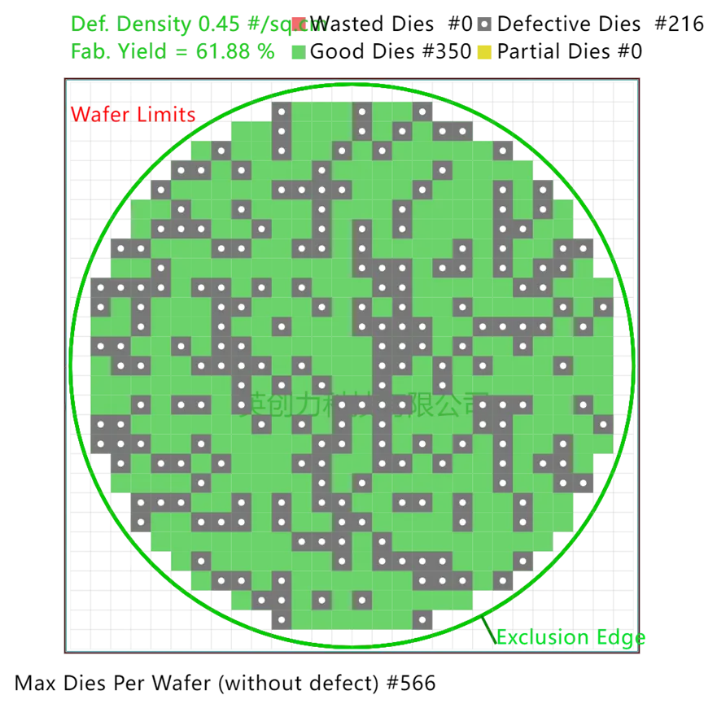

400day 的时候，d0=0.45 也就是 350 Good Die 也就是 61.88% Yield

D0=0.3 时

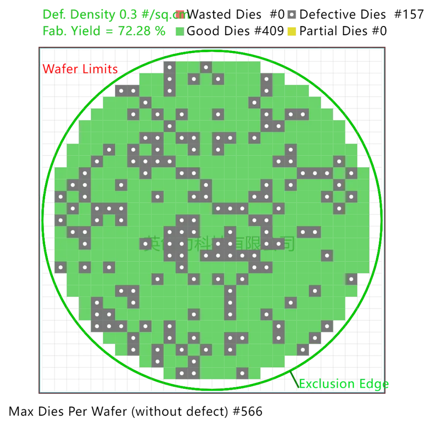

800day 的时候，d0=0.3 也就是 409 Good Die 也就是 72.28% Yield

方便计算为
中位数为 d0=0.45

126720x566x61.88%=44,382,514.176
那么估算的数字也就是华为生产了 4000-4500w 片 Hi36a0V120，粗略计算。

## Die 标识

在 Die 中寻找，还有几处点
例如 F 状条纹

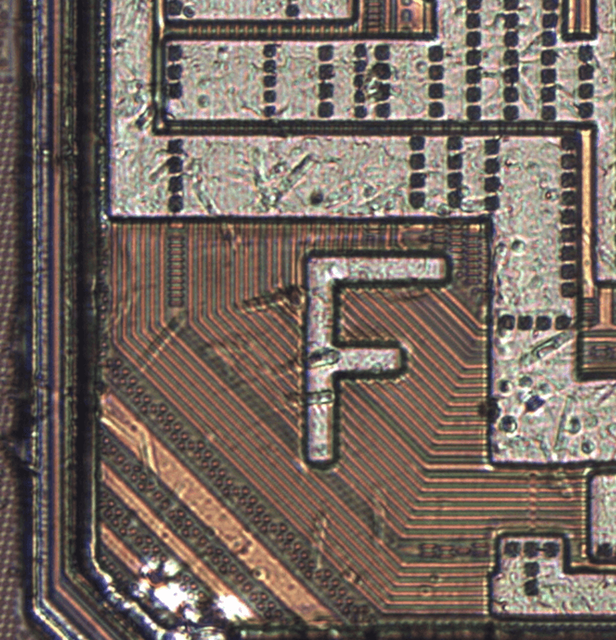

B + 数字，划线区域 / 测试点位

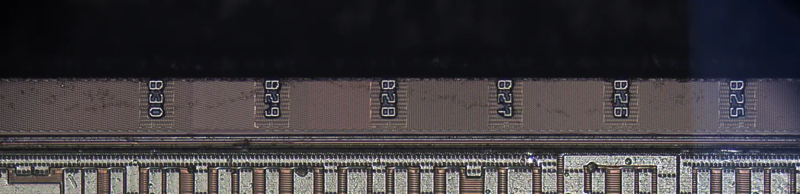

IO PHY

这张图很明显的能看出边上的点位来扇出

还有一个很奇怪的丝印
2017 Mora
A？C?E?A?
A 01 0
不太清楚是什么疑似
20 年 17 周 必须？
2017 年必须？

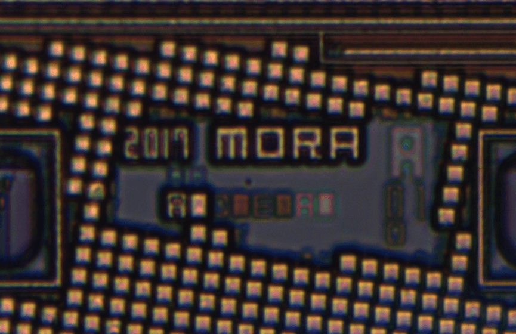

蛮奇怪的

还有个 sa06 左边为十字对准标识

## 去金属层

然后就是去金属层了

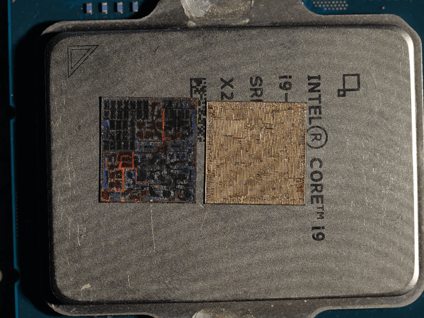

因为走线为 Cu, 遂酸洗
酸洗出来会有报废率，但是这次运气很好，完美

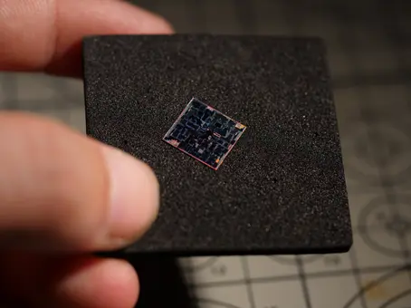

很美丽，那么就进行

## Dieshot Layout[#](https://kurnal.xlog.app/Hi36A0V120fenxi#dieshot-layout)

那么很明显的
首先能判断出，该芯片不是和麒麟 9000 一样的东西，不是同一个产品
那么我这边也是做了麒麟 9000

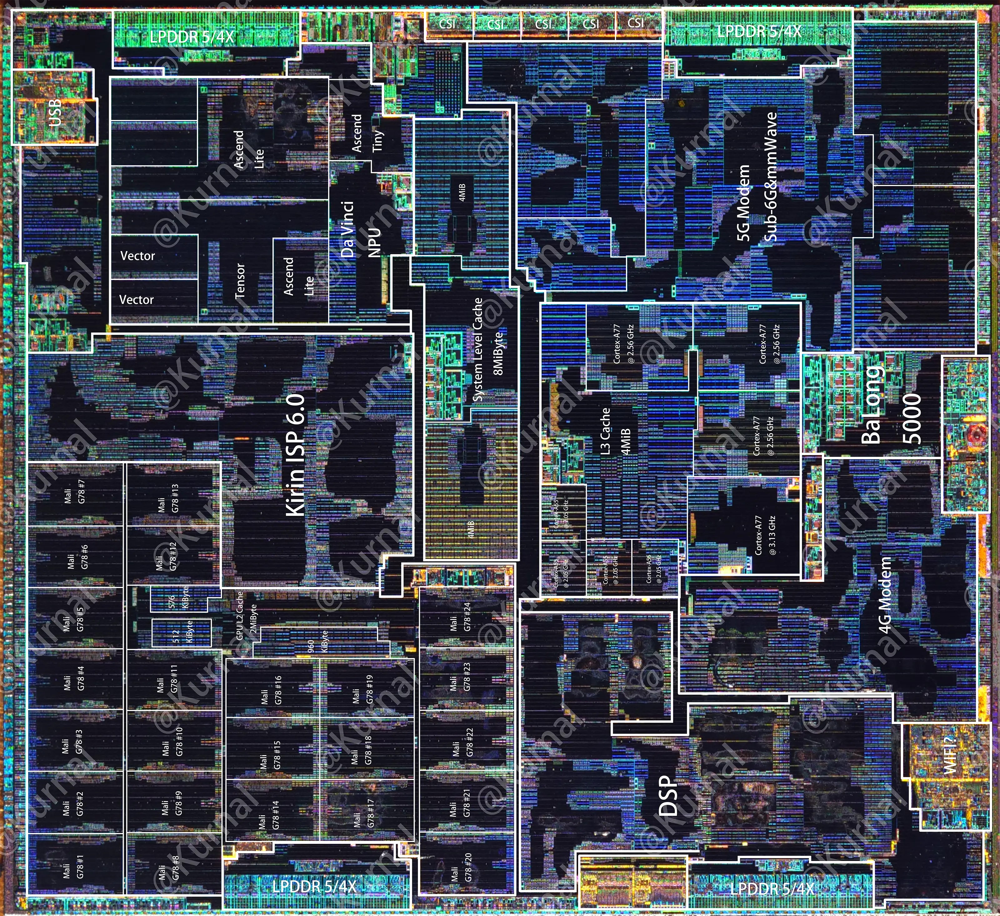

进行一个对比

很明显这两个不是同一个芯片
因为 Die 的形状都不一样，大概的规模都一样
说明 Hi36A0 V100 与 Hi36A0V120 完全不同，不属于换皮 / 库存
这完全可以证明
麒麟 9000s 不属于类似于 9000L/9000e 换皮结构
也不属于类似于 985/990 的部分设计共用结构
而是全新的一代，没有相同部分

那么就是解析了

## CPU

首先是 CPU 的对比

能看到其 CPU Cluster 巨大的面积，相比较上代发生了巨大的变化

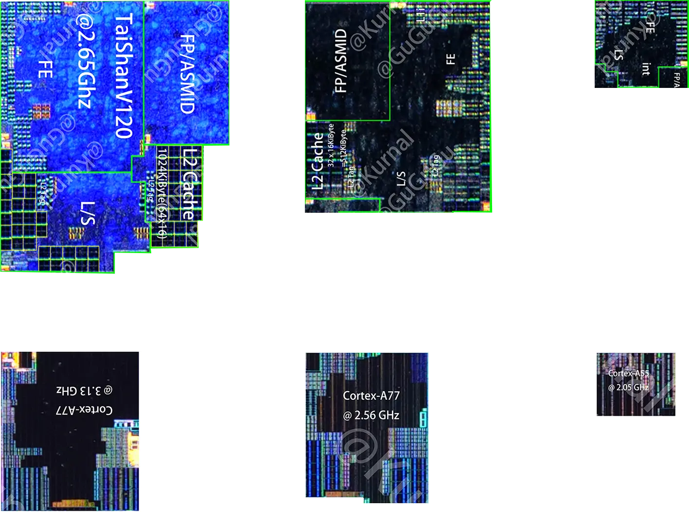

左边是 TSMC N5 A77+A77+A55,134
右边是 SMIC N7 TSV120+TSV120+A510 134

超大核的 Size 对比

面积大了… 很大一圈

## 性能分析不写

无 L0 Cache

架构太宽了，需要吃缓存

关于小核是 A510，两组双核复合体 1.53Ghz，在最佳甜点频率，在 TSMC 工艺下则是 1.4Ghz

以及这代的的总线，不像上代的总线与超大核使用了性能库

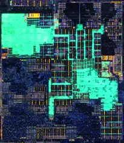

这代只有超大核使用了性能库，

颜色变化是因为
我认为是 Poly 层晶体管密度导致的反射光谱变化

## GPU 解析

上一代 Mali G78 Mc24 是堆料的典型
Mali G78 基于 Valhall 架构，mc24 则说明了其为 24Core
其 GPU 则是 Core 设计
而这代的 Maliang 则是 Cu 设计
其设计规模与上代略微缩小了一部分
单元划分如图

为 4CU
左右两组 ALU Core，每组 128Alus，总计 2x4x128Alus=1024Alus
频率最高 750Mhz，理论性能为 1536Gflops
中间的则是 GPU L2 Cache，大约为 1MiByte

从其 gpu 的规格上来说
不与常见的 IMG/MALI/Adreno/Rdna/Cuda 相同
我认为这是全新自研的 GPU

## NPU

在这代 NPU 来说
上代则是双大核 + 1 小核 NPU，每个大核两条 Vector
这代则是单大核 + 1 小核 NPU ，大核两条略长的 Vector
其 NPU 从宏观的角度上来说，我认为其规模虽然缩减了一颗大核，但是可能因为微架构更新，性能可能会增强，但是核心规模缩减这个是事实，其节省了很大一个面积去放其他单元

## isp

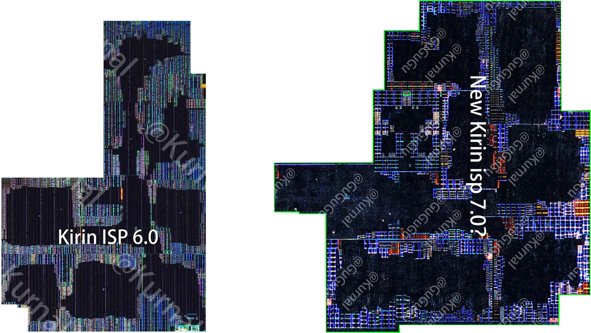

ISP 的规模很明显相比较上代 isp6.0 增大了，但是能找到这两个 isp 的共同核心
中心处还疑似新增了一个双核协处理器
其理论图像处理速度增加，这代 Mate60pro 实测可以在取景框内就可以 HDR Vivid，以及变焦时丝滑切换，这就是 isp 算力增加带来的
这个 isp 跑在中频，2W，极其恐怖。、

## DSP

Dsp 其实没什么好说的

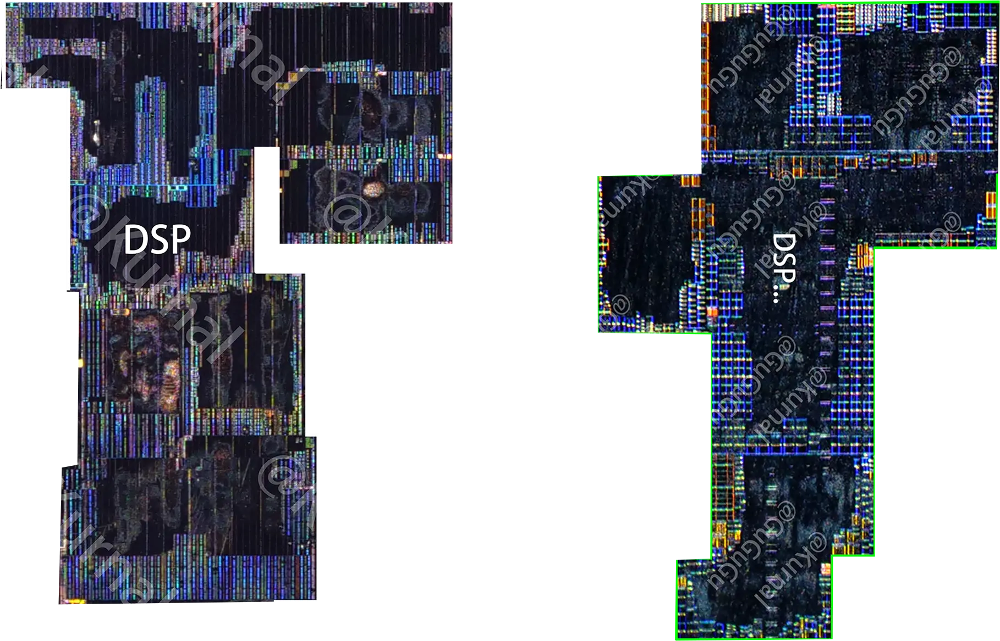
也看不出什么，相比较上代的 Decode 好像还少了个
面积缩小了一点点

## Baseband

在 baseband 中
这代设计与之前的 Balong 5000 完全不同
其面积缩小了很多

在这之前华为的 5G 基带一直都是 4G+5G 设计的，中间用互联桥进行数据传输
部分外挂基带例如 990 4G 则是走 Pcie x8+x16 进行数据传输，然后外挂巴龙 5000
在这代 Modem 设计中，其为纯粹的 Balong Baseband Modem Sysytem，集成了 4G 与 5G，其例如 dsp 可以共享，以及 Modem 共享，不需要单独的进行设计