# 骁龙8gen2详细分析

来源：https://kurnal.xlog.app/SM8550

这可能是你能找到的较为严谨的讨论 sm8550 的文章
转载请说明作者

## 起因[#](https://kurnal.xlog.app/SM8550#起因)

英短毛了一个 SM8550（Honor Magic5Pro）的主板

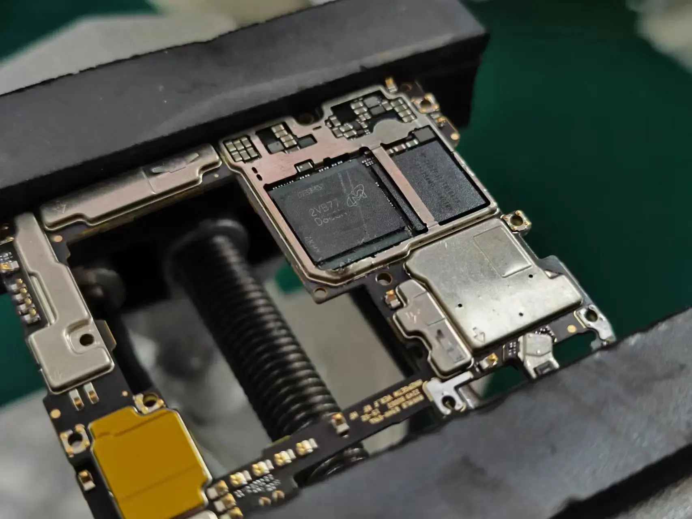
遂开之
该产品为 pop 封装（Package on Package)

## TOP Package[#](https://kurnal.xlog.app/SM8550#top-package)

Top package Mark 则为
2WB77 D8CCP
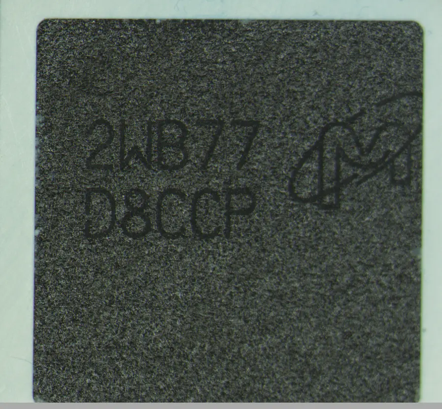

查询可得：
制造商编号为 MT62F1536M64D8CL-023 WT,
说明该颗粒为 LPDDR5 96G 1.5GX64 FBGA 8DP

遂 Decap 之

可得知
该镁光 D8CCP 颗粒其实是三星 SEC 的产品
SEC 也就是 Samsung Electronics Company，三星电子
很奇怪

## Bottom Package[#](https://kurnal.xlog.app/SM8550#bottom-package)

开完 Top 就轮到 Bottom 了
这次我们拿到的是 SM8550 也就是 8Gen2
详细的性能分析不写，自己应该可以查询到

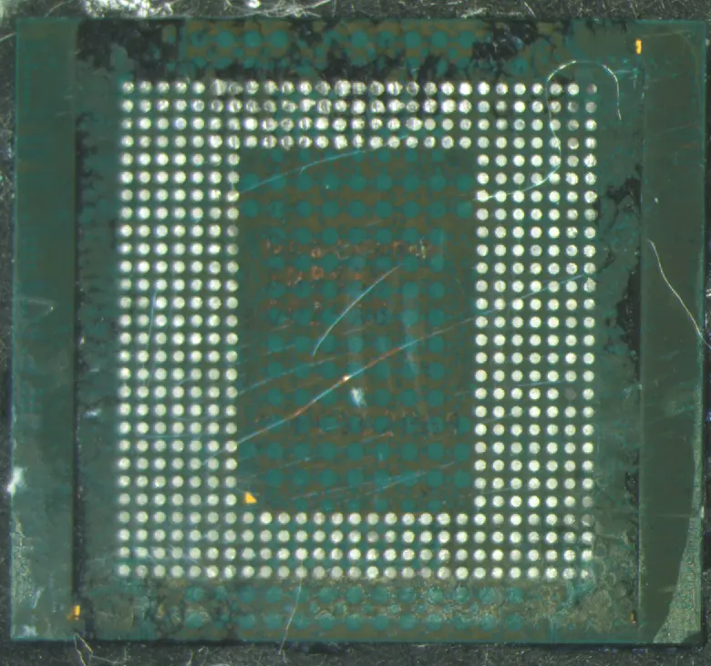
这次拿到的是量产阶段的 SM8550,
也就是 SM8550 002-AB
完整编号为
Qualcomm-SM8550-002AB- FX215S2Y

## Top Mark 分析[#](https://kurnal.xlog.app/SM8550#top-mark-分析)

SM 则为 SnapdragonMobile 的缩写
8550 则为产品型号，也就是 SM 8 系列 5 代 也就是 8gen2
002-AB 则为变种
FX215S2Y 则是 topmark 编号
为 xx/x xx/xxx
第一个 xx 则为生产厂 + 封装厂
第二个 x xx 则为 Year+Week
第三个 xxx 则为可追溯性编号
F 则 TSMC 生产，X 则为 Amkor, Japan 封装
2 为 2022 年，15 为 15Week
S2Y 则为可追溯性编号，具体不明

这些是 topmark 可得知的数据

## Bottom Package Decap[#](https://kurnal.xlog.app/SM8550#bottom-package-decap)

接下来就 Decap 了
很不幸，损坏了
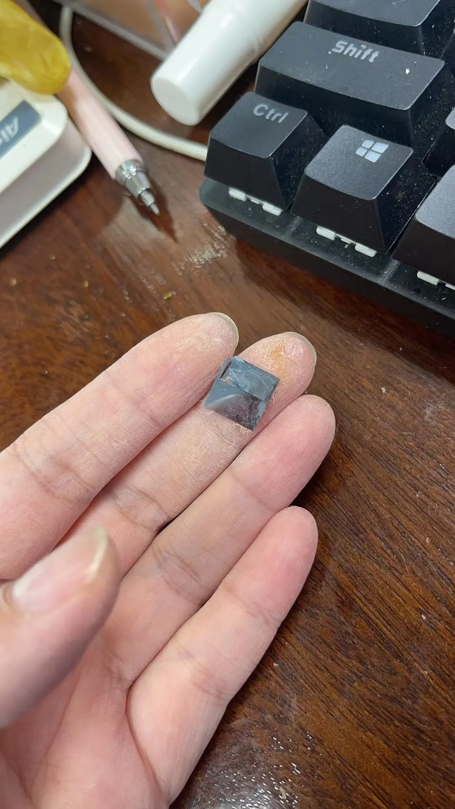

从节省成本的方式考虑看能不能拯救出一些数据来

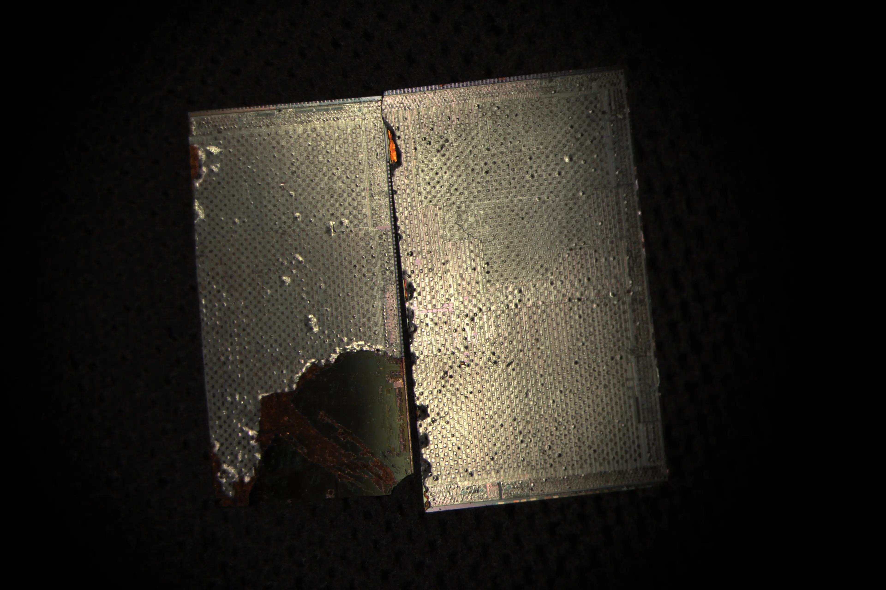
很显然这个倍率不够
遂上高倍

为了方便观看还是切换成好 Die 吧

在画面中心点的就是 Die Mark

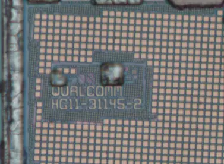
Qualcomm HG11-31145-2
不清楚具体意义

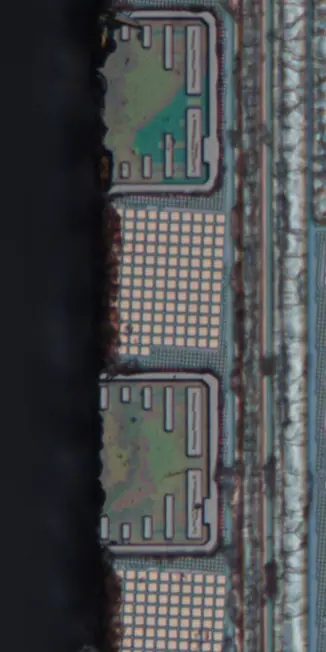
划道区域

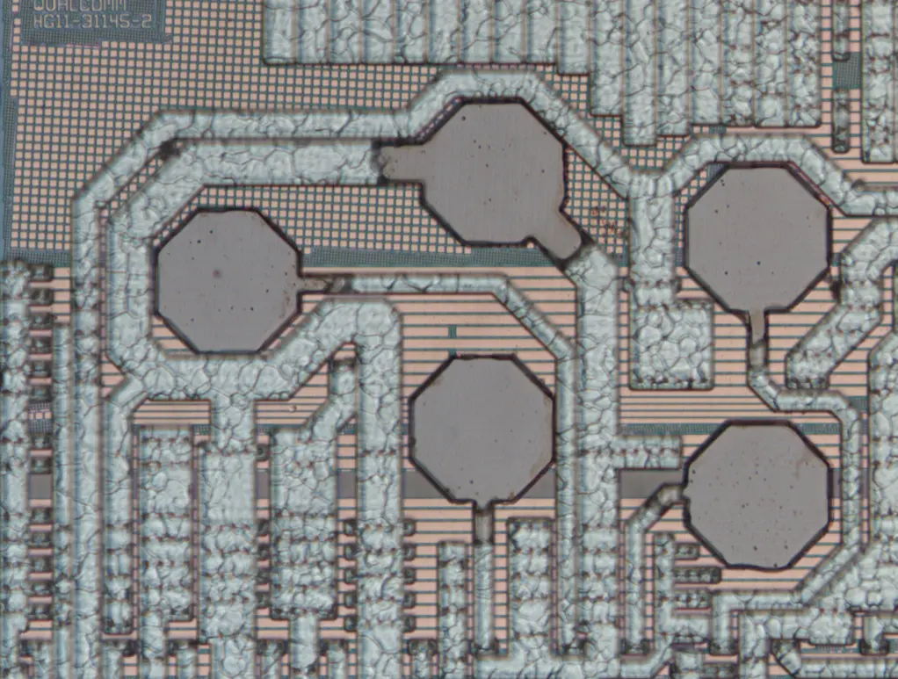
最顶上的 Fanout 金属层

## Good Die[#](https://kurnal.xlog.app/SM8550#good-die)

看不到更深的地方是因为有金属层阻拦导致看不到 poly

测量之

DieSize 为 11.20mm x 10.57mm
也就是 118.384‬mm2
已知是 170 亿晶体管
可以计算出其平均密度为 143.6004MTr
符合其 TSMC N4 密度
可以复算出其实际晶体管数量为
170.117808 亿
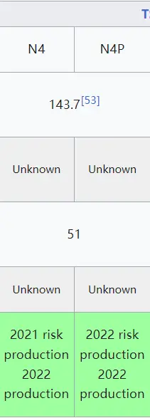

## 工艺判断（SEM)(还没写好）[#](https://kurnal.xlog.app/SM8550#工艺判断sem还没写好)

虽然知道这个是 TSMC N4
但是需要验证，也就用到了 sem（鸽）

## 工艺分析（还没写好）[#](https://kurnal.xlog.app/SM8550#工艺分析还没写好)

在这里的分析很简单
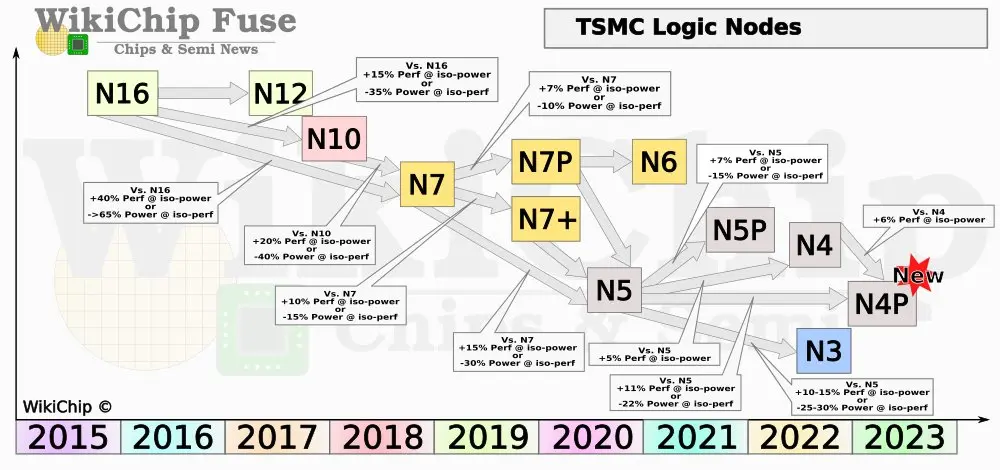
这是 Tsmc 的技术路线
可以看到 N4 其实是属于 N5 的分支
继承了 N5 的 6TUHD/7.5THD 库
6T UHD 其 Fin High 为
具体数据
Fin Pitch：

## 良率分析[#](https://kurnal.xlog.app/SM8550#良率分析)

那么就很简单的带入一下 dpw 计算一下 Yield
还是按照这个公式
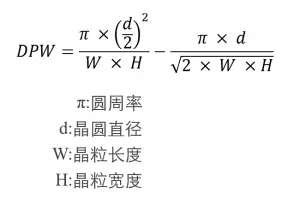

按照 N5 D0 计算可得

D0=0.75 时，良率为 43.99%,238/540 片

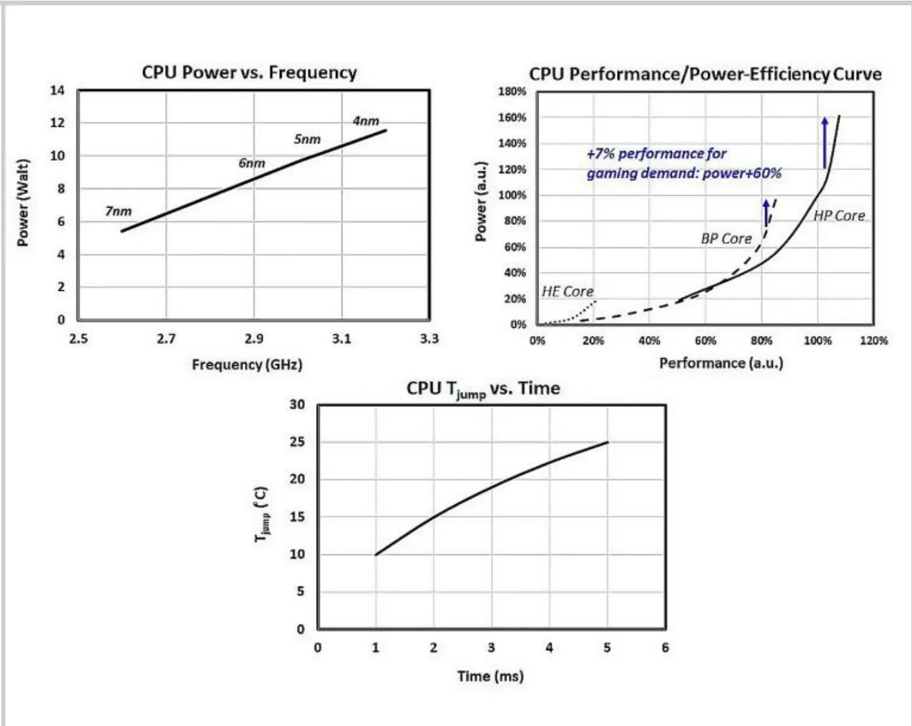

当然还有热设计功耗模拟
当然这只是顺手计算的，不需要类似于 Hi36a0 来计算产能 / 良率分析）

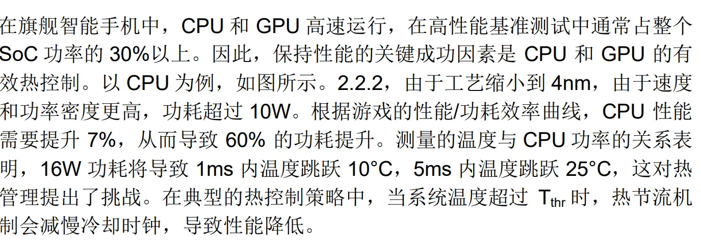
（来自 ISSCC 2023 / SESSION 2 / DIGITAL PROCESSORS / 2.2)

## Dieshot Layout[#](https://kurnal.xlog.app/SM8550#dieshot-layout)

那么就是酸洗，去金属层了，绘画 Layout 了
因为一直拿到的 Dieshot 都是多手压缩，低分辨率的垃圾，所以想要自己拥有一个高分辨率的 Dieshot，遂之

好了，画好了

那么就单独的抠图
这是 CPU Cluster+L3+SLC 的大小

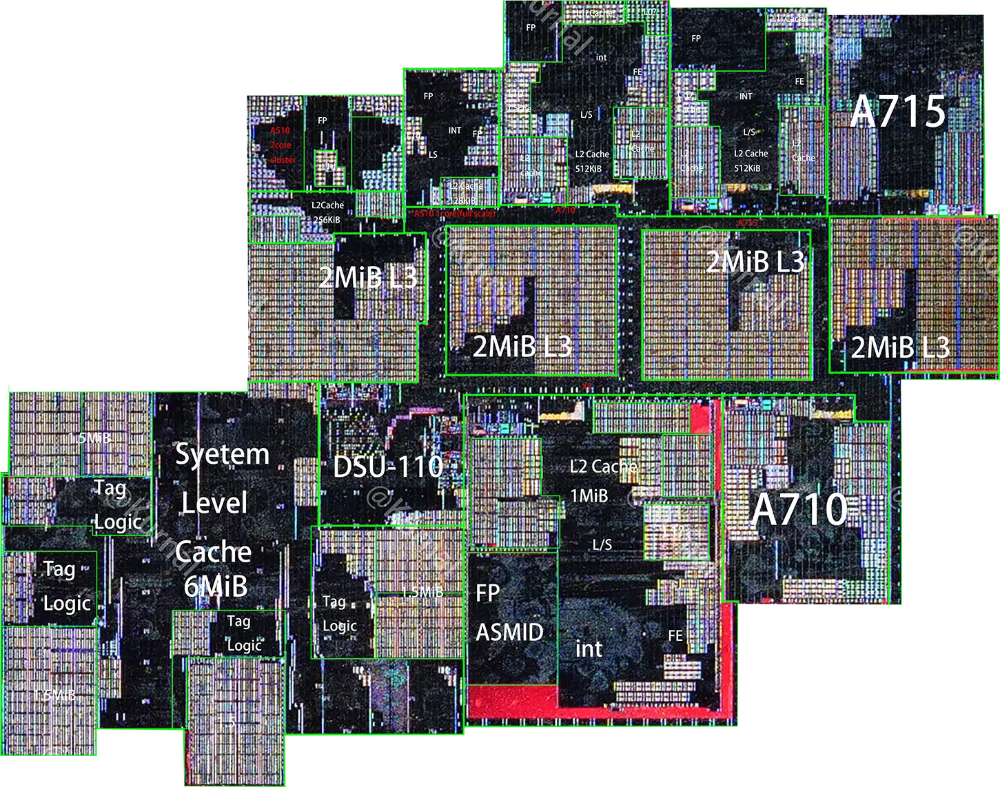
那么就抠图

## CPU[#](https://kurnal.xlog.app/SM8550#cpu)

这是 X3 A710 A715 A510 A510Cluster 的 CoreSize 对比图，可以明显看到其实 Sdm 其实算是 5 从集，也就是算是 1+2+2+1+2 的设计，而不是 143 或者说 1223，当然具体怎么调教的自己找个 8gen2 手机看看，我没机子

## GPU[#](https://kurnal.xlog.app/SM8550#gpu)

这是 8G1 + 系列的 GPU，很明显的能看到其是 2Cluster 结构，每个 Cluster4 个 Core（2CU)

Adreno 的特点是其 Tmus 基本都不在 Alus Core 内，所以标注凑合看
Adreeno740 相比较 Adreno730 优势是新增 1 个 Cluster，Core 数量到达 12Core（6CU 3Cluster）

其 Alu 数量达到了 1536Alus，频率我标注错误了但是我懒得改了，实际为 680Mhz，理论性能为 1536x0.68Ghz x2 =2088.9Gflops
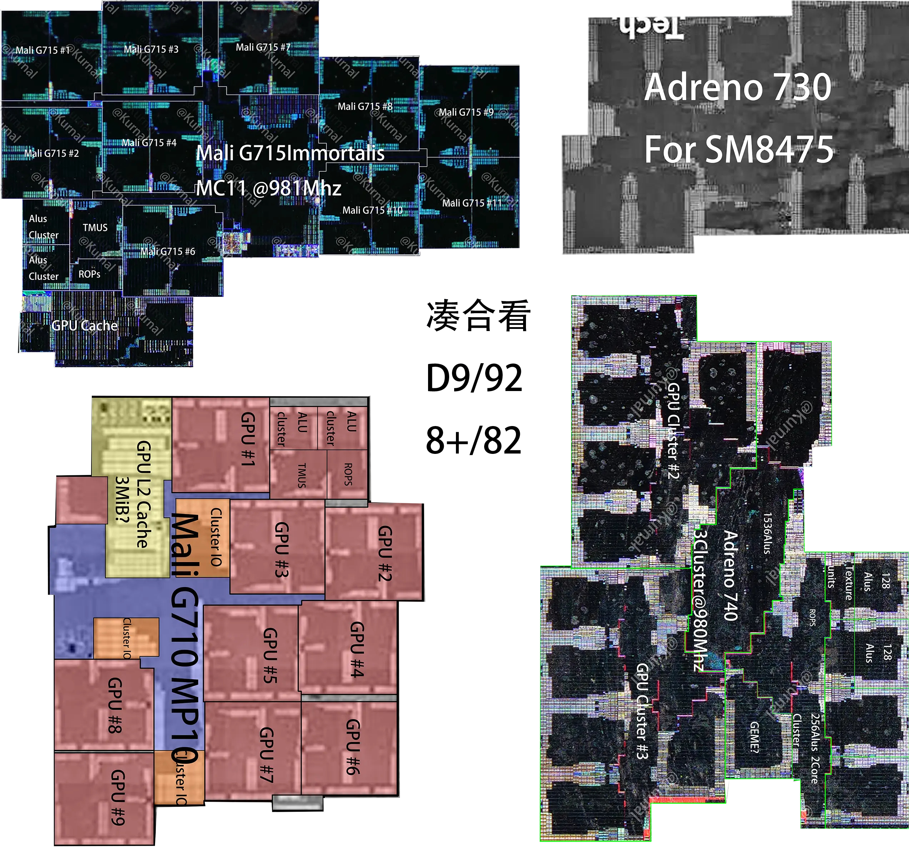
这是本世代 / 上世代的 GPU Size 对比，最小的反而是 SM8475 的 GPU
具体 size 请自己测量，我还没学会

## Modem[#](https://kurnal.xlog.app/SM8550#modem)

Modem 部分 X70 与上代 X65 没有明显变化，
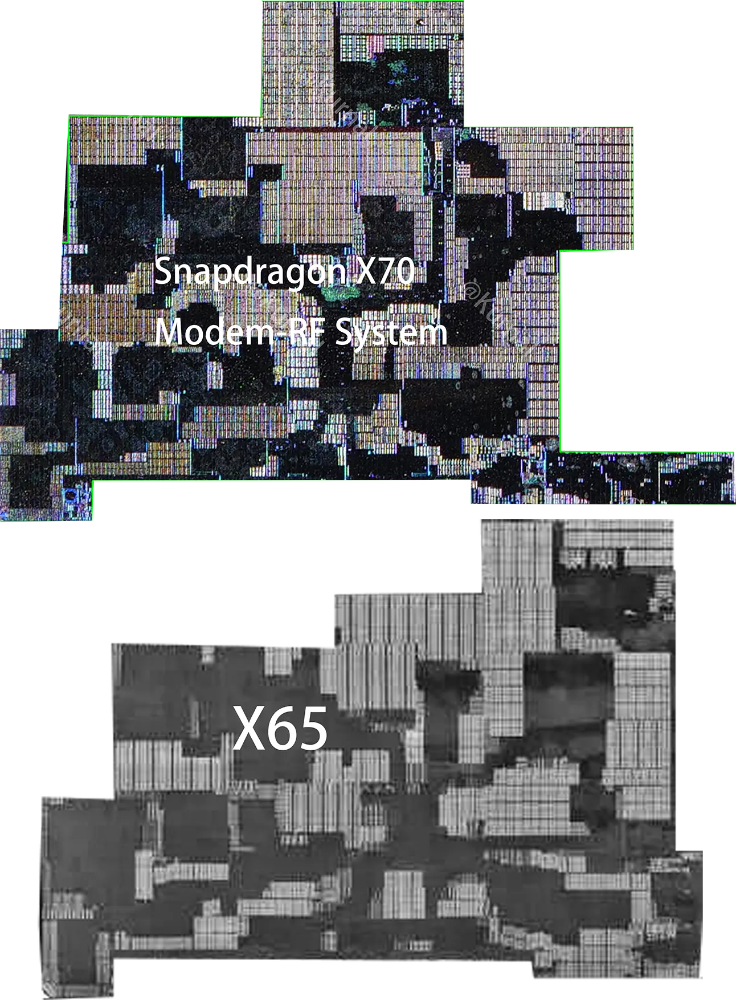
当然细节变化肯定有，但是没人研究基带
Size 对比
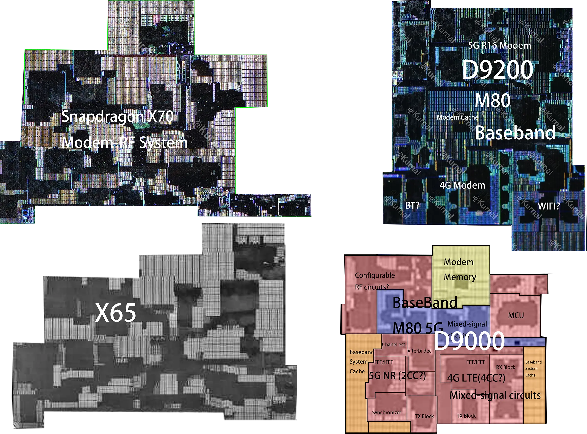
D9200 的 baseband 可能是 M80，我不太确定

## ISP[#](https://kurnal.xlog.app/SM8550#isp)

高通这边每年都是：3 核 isp，但是始终找不到 isp 踪影，所以胡乱一标，今年的 isp 没有动静

## 奇怪的单元[#](https://kurnal.xlog.app/SM8550#奇怪的单元)

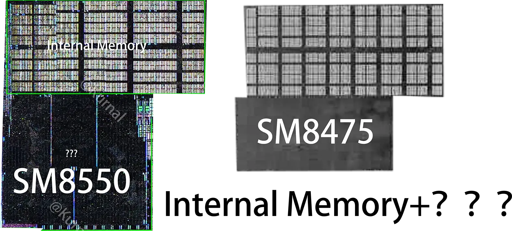
这是一个很奇怪的单元，我们只知道上面的是 Internal Memory，下面的不清楚，这代面积扩大了 1.5-1.7x，很奇怪

## 理论性能[#](https://kurnal.xlog.app/SM8550#理论性能)

关于详细性能测试，你们可以从很多媒体方面看到，没必要从我这边看，所以我就不写了
就这样吧
