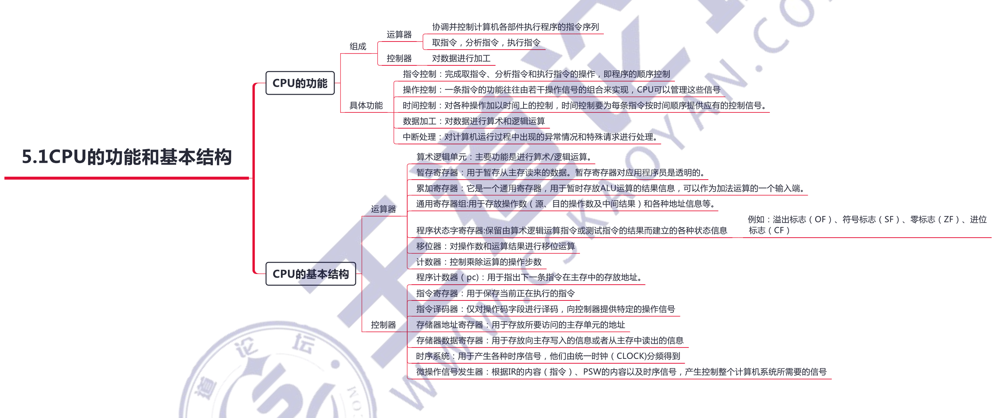
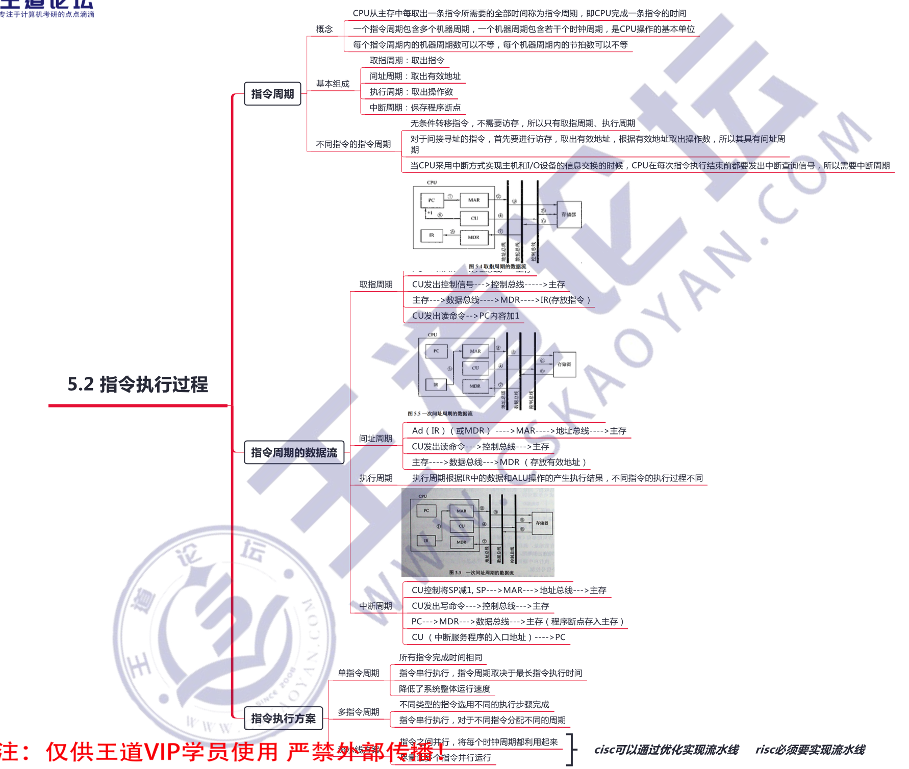
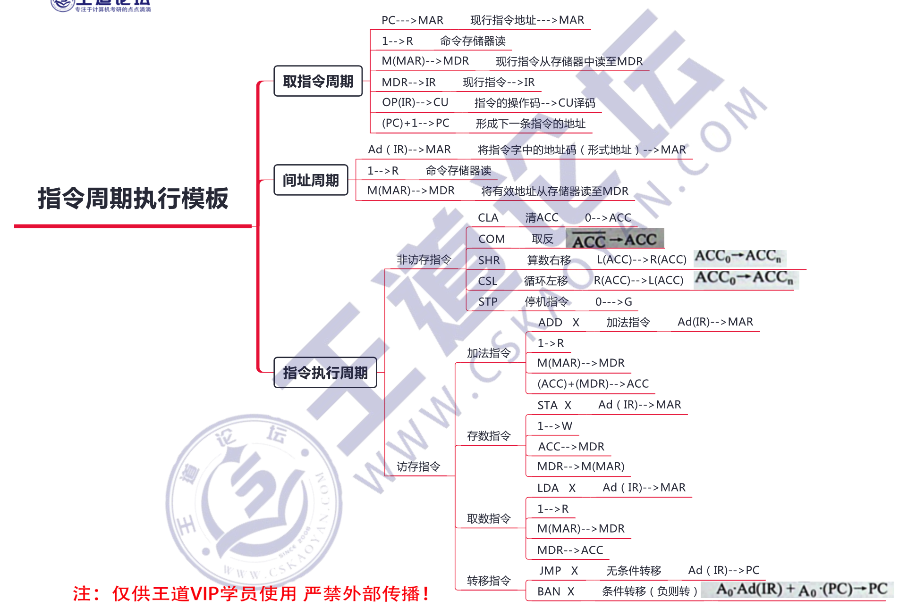
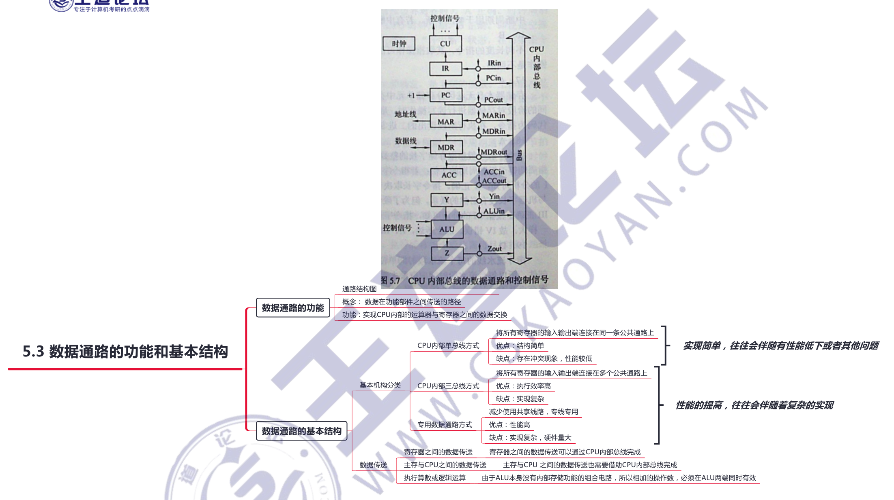
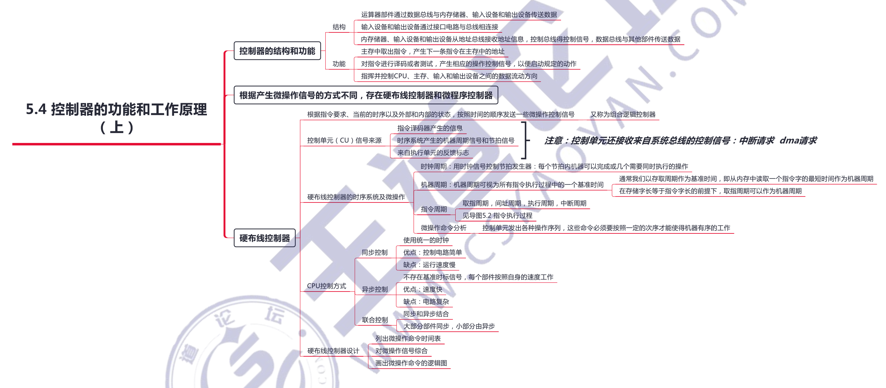
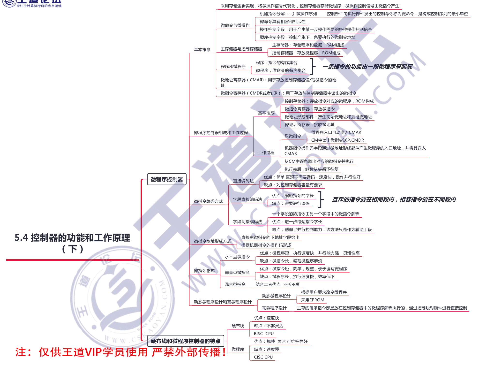
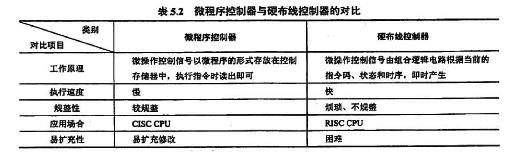
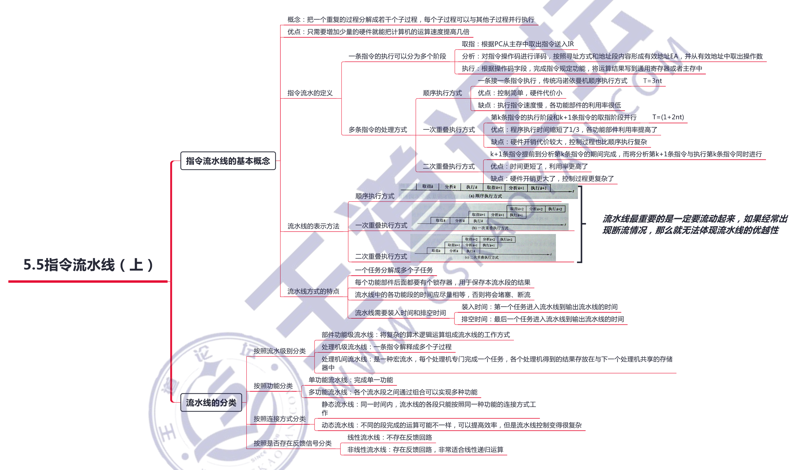
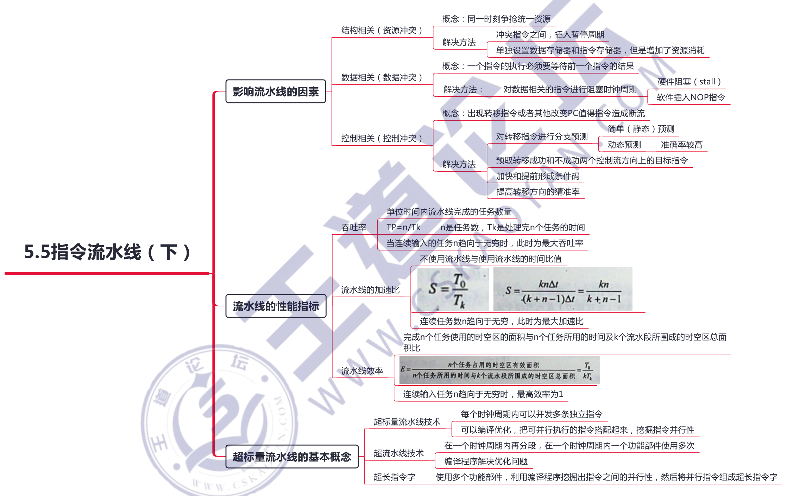

# 中央处理器

## 5.1 CPU的功能和基本结构

**寄存器**

CPU 内部寄存器大致可分为两类：

- 一类是用户可见的寄存器，可对这类寄存器编程，如通用奇存器组．程序状态宇奇存器；
- 另一类是用户不可见的寄存器，对用户是透明的，不可对这类寄存器编程，如存储器地址奇存器、存储器数据安存器、指令奇存器。

## 5.2 指令执行过程

### 指令周期执行模版

## 5.3 数据通路的功能和基本结构

## 5.4 控制器的功能和工作原理

### 硬布线和微程序控制器的特点

## 5.5 指令流水线

### 有关指令相关、数据相关的几个概念

两条连续的指令读取相同的寄存器时，会产生读后读 (Read After Read, RAR）相关，这种相关不会影响流水线。

某条指令要读取上一条指令所写入的寄存器时，会产生写后读 (Read After Write,RAW) 相关，它称数据相关或真相关，影响流水线。按序流动的流水线只可能出现RAW 相关。

某条指令的上条指令要读/写该指令的输出寄存器时，会产生读后写 (Write After Read,WAR〕和写后写 (Wsite After Write, WAW）相关。在非按序流动的流水线中，既可能发生 RAW 相关，又可能发生 WAR 相关和 WAW 相关。

**对流水线影响最严重的指令相关是数据相关**

## 常见问题

### 1）CPU 分为哪几部分？分别实现什么功能？

**CPU 分为运算器和控制器**。

- 其中运算器主要负责数据的加工，即对数据进行算术和逻辑运算。
- 控制器是整个系统的指挥中枢，对整个计算机系统进行有效的控制，包括指令控制、操作控制、时间控制和中断处理。

### 2）指令和数据均存放在内存中，计算机如何从时间和空间上区分它们是指令还是数据？

从时间上讲，取指令事件发生在 “取指周期”，取数据事件发生在“执行周期”。

从空间上讲，从内存读出的指令流流向控制器(指令寄存器)，从内存读出的数据流流向运算器（通用寄存器）。

### 3）什么是指令周期、机器周期和时钟周期？它们之间有何关系？

- 指令周期：CPU 每取出并执行一条指令所器的全部时间称为；
- 机器周期：在同步控制的机器中，执行指令周期中一步相对完整的操作 （指令步）所需的时间，通常安排机器周期长度=主存周期
- 时钟周期：是指计算机主时钟的周期时间，它是计算机运行时最基本的时序单位，**对应完成一个微操作所需的时间**，通常时钟周期 =计算机主频的倒数。

### 4）指令周期是否有一个固定值？为什么？

由于计算机中各种指令执行所需的时间差异很大，因此为了提高 CPU 的运行效率，即使在同步控制的机器中，不同指令的指令周期长度都是不一致的，即**指令周期对不同的指令来说不是一个固定值**。

### 5）什么是微指令？它和上一章谈到的指令有什么关系？

控制部件通过控制线向执行部件发出名种控制命令，通常把这种控制命令称为微命令，而一组实现一定操作功能的微命令的组合，构成一条微指令。许多条微指令组成的序列构成微程序，微程序完成对指令的解释执行。指令，即指机器指令。每条指令可以完成一个独立的算术运算或逻料运算操作。

**在采用微程序控制器的 CPU 中，一条指令对应一个微程序，一个微程序由许多微指令构成，一条微指令会发出很多不同的微命令**

### 6）什么是指令流水线？指令流水线相对于传统计算机体系结构的优势是什么？如何计算指令流水线的加速比？

**指令流水线是把指令分解为若干子过程，通过将每个子过程与其他子过程并行执行，来提高计算机的吞吐率的技术**。采用流水线技术只需增加少量硬件就能把计箄机的运算速度提高几倍，因此成为计算机中普遍使用的一种并行处理技术，通过在同一个时间段使用各功能部件，使得利用率明显提高。

流水线的加速比指的是完成同样一批任务，不使用流水线所用的时间与使用流水线所用的时间之比。

一条 k 段流水线理论上的最大加速比为 Smax = k，因此，在现代计算机中提高流水线段数有利于提高计算机的吞吐量。具体的加速比要使用时空图来计算。

### 7）流水线越多，并行度就越高。是否流水段越多，指令执行越快？

错误，因为如下：

- **流水段缓沖之间的额外开销增大**。每个流水段有一些额外开销用于缓冲间传送数据、进行各种准备和发送等功能，这些开销加长了一条指令的整个执行时间，当指令问逻辑上相互依赖时，开销更大。
- **流水段间控制逻辑变多、变复杂**。用于流水线优化和存储器（或寄存器）冲突处理的控制逻辑将随流水段的增加而大增，这可能导致用于流水段之间控制的逻辑比段本身的控制逻辑更复杂。
