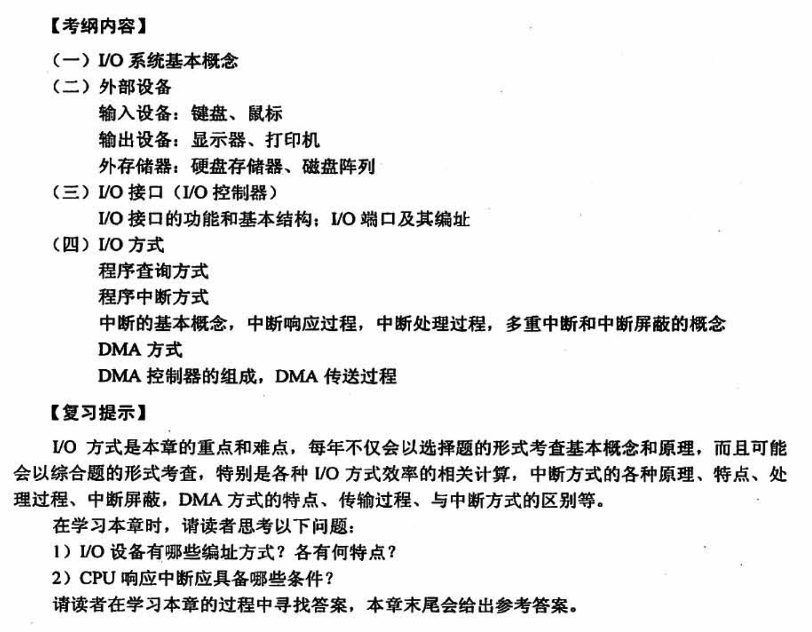
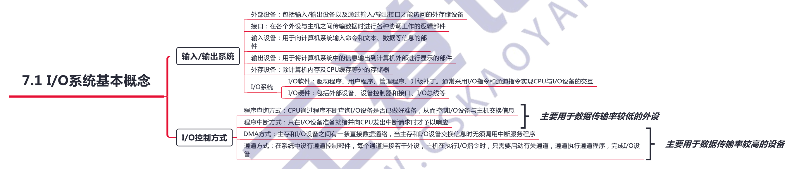
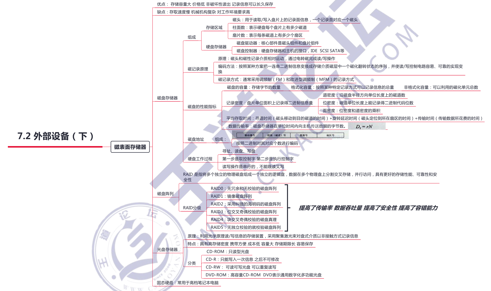
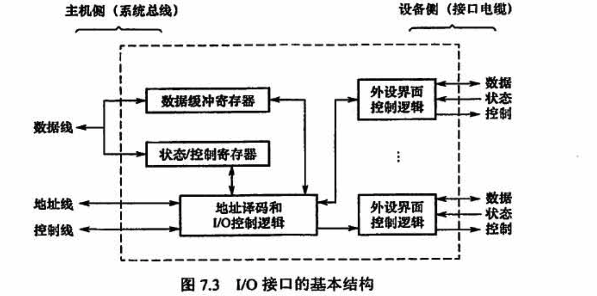
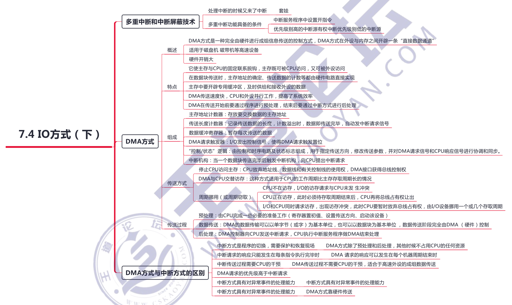

# 输入输出系统

## 7.1 IO系统的基本概念

输入/输出是以主机为中心而言的，将信息从外部设备传送到主机称为输入，反之称为输出。

输入/输出系统解决的主要问题是对各种形式的信息进行输入和输出的控制。

## 7.2 外部设备

## 7.3 IO接口

IO 接口 (IO 控制器）是主机和外设之间的交接界面，通过接口可以实现主机和外设之间的信息交换。

主机和外设具有各自的工作特点，它们在信息形式和工作速度上具有很大的差异，接口正是为了解决这些差异而设置的。

**IO 端口是指接口电路中可被 CPU 直接访问的寄存器**，主要有数据端口、状态端口和控制端口，**若干端口加上相应的控制逻輯电路组成接口**。通常，CPU 能对数据端口执行读写操作，但对状态端口只能执行读操作，对控制端口只能执行写操作，

## 7.4 IO方式

## 常见问题

### 1）IO设备有哪些编址方式？各有何特点？

统一编址和独立编址。

- 统一编址是在主存地址中划出一定的范围作为 IO 地址，以便通过访存指令即可实现对 IO 的访问，但主存的容量相应减少
- 独立编址是指 IO 地址和主存是分开，IO 地址不占主存空间，但访存需专门的 IO 指令

### 2）CPU 响应中断应具备哪些条件？

- 在CPU 内部设置的中断屏蔽触发器必须是开放的
- 外设有中断请求时，中断请求触发器必须处于 “1” 状态，保持中断请求信号
- 外设（接口）中断允许触发器必须为 “1”，这样才能把外设中断请求送至 CPU

具备上达三个条件时，CPU 在现行指令结束的最后一个状态周期响应中断。

### 3）中断响应优先级和中断处理优先级分别指什么？

「中断响应优先级」是由硬件排队线路或中断查询程序的**查询顺序决定的，不可动态改变**；

「中断处理优先级」可以由中断屏蔽字来改变，反映的是正在处理的中断是否比新发生的中断的处理优先级低（屏蔽位为 “0”，对新中断开放），若是，则**中止正在处理的中断，转到新中断去处理**，处理完后再回到刚才被中止的中断继续处理。

### 4）向量中断、中断向量、向量地址三个概念是什么关系？

中断向量：**每个中断源都有对应的处理程序**，这个处理程序称为中断服务程序，**其入口地址称为中断向量**。所有中断的中断服务程序入口地址构成一个表，称为中断向量表：也有的机器把中断服务程序入口的跳转指令构成一张表，称为中断向量跳转表。

向量地址：中断向量表或中断向量跳转表中每个表项所在的**内存地址或表项的索引值**，称为向量地址或中断类型号。

向量中断：指一种**识别中断源的技术或方式**。识别中断源的目的是找到中断源对应的中断服务程序的入口地址的地址，即获得向量地址，

### 5）程序中断和调用子程序有何区别？

两者的根本区别主要表现在「服务时间」和「服务对象」上不一样。

1）**调用子程序过程发生的时间是己知的和固定的**，即在主程序中的调用指令 (CALL)执行时发生主程序调用子程序过程，调用指令所在位置是己知的和固定的。而**中断过程发生的时间一般是随机的**，CPU 在执行某个主程序时收到中断源提出的中断申请，就发生中断过程，而中断申请一般由硬件电路产生，**申请提出时间是随机的**。也可以说，**调用子程序是程序设计者事先安排的**，而执行中断服务程序是由系统工作环境随机决定的。

2）**子程序完全为主程序服务**，两者属于主从关系。主程序需要子程序时就去调用子程序，并把调用结果带回主程序继续执行。而**中断服务程序与主程序二者一般是无关的**，不存在谁为谁服务的问题，两者是平行关系。

3）**主程序调用子程序的过程完全属于软件处理过程**，不需要专门的硬件电路；而**中断处理系统是一个软/硬件结合的系统**，需要专门的硬件电路才能完成中断处理的过程。

4））**子程序联套可实现若干级**，嵌套的最多级数受计算机内存开辟的堆栈大小限制；而中断嵌套级数主要由中断优先级来决定，一般优先**级数不会很大**。

从宏观上看，虽然程序中断方式克服了程序查询方式中的 CPU “踏步” 现象，实现了 CPU与 I0 并行工作，提商了 CPU 的资源利用率，但从微观操作分析，CPU 在处理中断服务程序时，仍需暂停原程序的正常运行，尤其是当高速 I0 设备或辅助存储器频繁地、成批地与主存交换信息时，需要不断打断 CPU 执行现行程序，而执行中断服务程序。

### 6）IO指令和通道指令有何区别？

**IO 指令是 CPU 指令系统的一部分，是 CPU 用来控制输入/输出操作的指令，由 CPU 译码后执行**。在具有通道结构的机器中，IO 指令不实现 IO 数据传送，主要完成启、停IO 设备，查询通道和IO 设备的状态，及控制通道进行其他一些操作等。

**通道指令是通道本身的指令，用来执行 IO 操作**，如读、写、磁带走带及磁盘寻道等操作。

