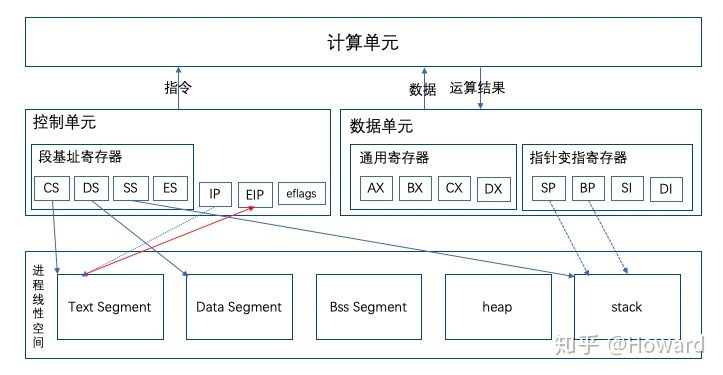
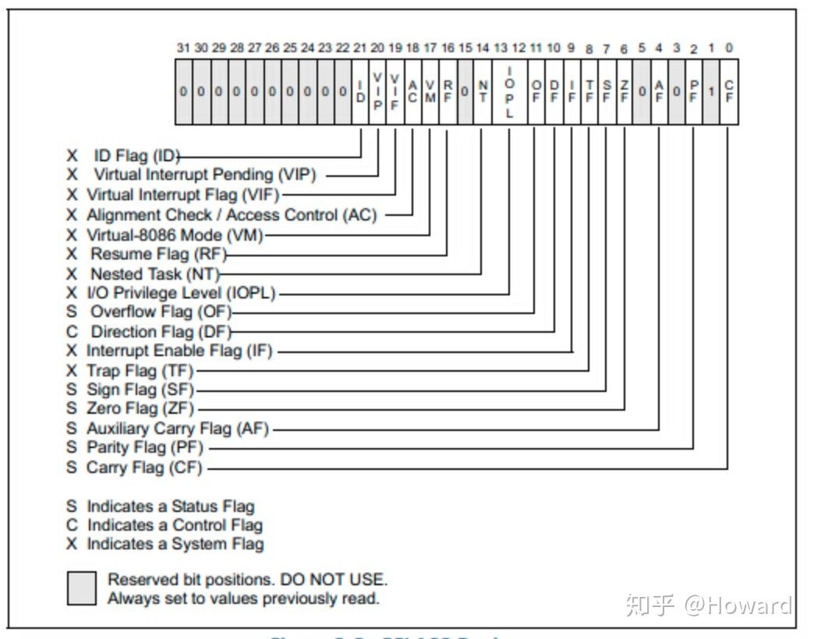

# X86体系结构

来源：[Linux内核浅析-X86体系结构](https://zhuanlan.zhihu.com/p/73937048)

预想了解Linux内核的一些原理，必先了解X86体系结构。x86体系基本等同于cpu的使用说明书，Linux的底层就是cpu，如果不了解底层提供的功能点，很多实现方式都搞不懂。就好像我们做一个需求，不知道底层有哪些接口可用，那需求做起来就太困难了。

x86架构起源于intel8086处理器，是intel公司70年代生产的16位处理器，推出前几年都不温不火，直到找到自己的业务方：ibm pc。ibm pc的研发没有交给最牛的华生实验室，而是交给另外一个团队，且要求一年交货，由于工期紧张，他们直接采用intel8086作为cpu，微软ms-dos作为os。由于ibm pc的大卖，hp、康柏等公司开始做兼容机，也是采用8086处理器，所以intel成为pc行业的标准，也就是x86。

## 1、体系结构总览



cpu的核心逻辑是输入数据 + 指令 = 输出结果，那就要解决这么几个问题：1）get指令。2）get输入数据。3）运算。4）store输出结果。其中第3步运算逻辑基本在cpu的alu中完成，不需要关注。其中1、2、4主要包含get、store两种操作，其实解决了数据的存储、寻址，get和store也就ok了。

1.1 指令和数据的存储

一个进程的能够看到的内存空间是逻辑地址，最后操作时会映射到物理地址，一个进程的内存逻辑地址又分为以下几个segment。

1）Text Segment：存放进程运行的指令，进程创建时，会将代码编译后的指令放到这个位置，也是静态的，运行时不会改变。

2）Data Segment：代码中已初始化值的变量。Bss是未初始化值的静态变量。

3）heap：堆，用于进行内存的动态分配。

4）stack：函数运行的栈。

1.2 指令和数据的寻址

X86的寻址，在cpu的视角看，是**段基址 + 段偏移**地址（至于为什么用这么挫的方式，在下一节段地址中描述）。以下是段基址寄存器：

1）CS：存储代码段的基址。

2）DS：存储数据段的基址。

3）SS：存储运行栈的基址。

段偏移地址寄存器：

1）IP：指令指针寄存器，根据CS + IP获取到的指令存储EIP（指令寄存器）中，供ALU使用。

2）EBP：栈基指针寄存器。

3）ESP：栈顶指针寄存器。

4）数据段的偏移地址一般存储在通用寄存器中，获取的数据一般也存到通用寄存器中，供ALU使用。

有了寻址方式，CPU直接将地址发送到地址总线上，即可以从数据总线收到数据。

## 2、分段内存管理

8086是16位的cpu，最大支持寻址空间为64K，但如何支持20位的地址总线呢？即支持1M的寻址空间（估计是ibm提的需求）。那怎么办呢？16位撑死就64K。那就两个地址，段基址和段偏移，凑成20位地址。

```text
逻辑地址 = 段基址 * 16（左移四位） + 段偏移地址
```

当32位cpu出现时，这种设计就a round peg in a square hole，但考虑到原有架构上已经有很多硬件和软件，不得不做兼容。但现在好不容易升级为32位，再用原有模式也无法支持4G的空间。于是IA32（32位处理器架构简称）和操作系统产生商量后达成一致，IA32推出的标准：

1）寻址方式仍然为**线性地址** -> **逻辑地址(分段模式) -> 物理地址**，保留分段模式。

2）在内存中构建两个存储段基址的table，**GDT(Global Descriptor Table，全局描述表)**，存储内核程序的段基址，由寄存器GDTR保存GDT入口地址，**LDT（Local Descriptor Table，本地描述符表）**，由寄存器LRTR指向LRT的入口，存储各个用户进程的段基址。table中的item存储**段描述符**，其中包括段基址、段界限和权限相关信息。

3）CS、DS等段基址寄存器仍然为16位（兼容以前），但改为存储**段选择子**，即table的index，这样段基址就存储于内存中，为以后扩展也打下基础。于是段基址存储地址时叫“**实模式**”，存储段选择子叫“**保护模式**”，系统启动时都是先处于实模式，当你需要更多内存时，切换到保护模式。通过切换模式做到无缝兼容。

以上是硬件商给的解决方案，但Linux为了兼容spark、arm等体系架构（这些体系都没有分段地址模式），也是为了少一次地址映射，所以将所有段基址都设置为0，所以段偏移地址 = 线性地址（内存寻址的原理后面会细讲），也就是所有进程的任一段基址都为0，所以Linux没必要使用LDT，仅用了GDT。

## 3、函数调用栈

代码都用函数来承载指令，通过函数调用来承载指令的跳转。而 函数的运行是基于栈的，一个函数就是一个栈帧。

```text
int bar(int c, int d)
{
    int e = c + d;
    return e;
}
int foo(int a, int b)
{
    return bar(a, b);
}
int main(void)
{
    foo(2, 3);
    return 0;
}
```


1）stack segment处于线性地址的高地址，且向下扩展，所以esp栈顶地址是向低地址扩展，esp栈基地址反而处于高地址。

2）当A->B函数时，会进行如下操作：

1、push eip：保存当前的EIP（指向A函数的某条指令），然后通过jmp或call指令将EIP设

置为B函数的起始指令。这样当B函数返回时，再将该EIP的值pop 到EIP寄存器中，使得A

函数可以继续运行以下的指令。

2、push ebp：将A当前的ebp压栈，有两个作用：1）方便B函数获取其入参。2）当B返回

时，将ebp指向A的栈基址。

3、mov esp ebp：将当前的esp复制给ebp，相当于ebp从指向A的栈基址指向B的栈基

址，开始运行B函数的指令。

3）当前函数的入参，是在上一个调用函数的栈帧中，通过本栈帧中保存的调用者的ebp和参

数的size进行计算入参的地址。

## 4. 状态寄存器

eflags是状态寄存器，控制单元会根据其值变更执行逻辑。比如IF就是中断标志，当陷入中断时，会通关关闭eflags.if标志来关中断，此处先提一下，后面中断会具体讲到。




在看X86体系架构时，有些感触：

1、业务很重要。对于intel，没有保住ibm pc的大腿，现在可能也没有intel，也没有x86。

2、业务提的需求，很多时候条件都不具备，需要工程师是做trade off。比如16位cpu支持20位的寻址，分段模式不得不说是一个临时方案，但为其赢得了市场。为了技术洁癖去做完美的方案是没有出路的。对于架构师，当你知道了业务的不美好和代码的龌蹉后，还能依然想把这个系统做好。

3、如果要做开放体系，兼容是必须的，哪怕是原来做个的临时方案。对于开放体系，一旦发布方案，就意味着必须兼容到底。好比java的泛型，现在还为了兼容早期非泛型版本遗留着许多不完美。