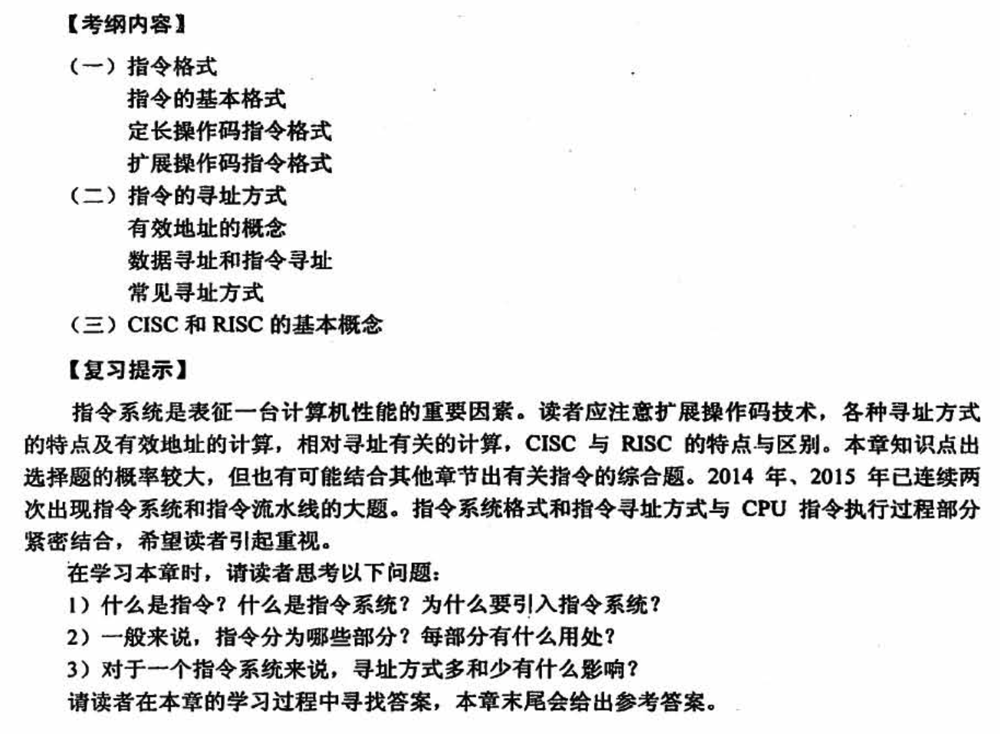
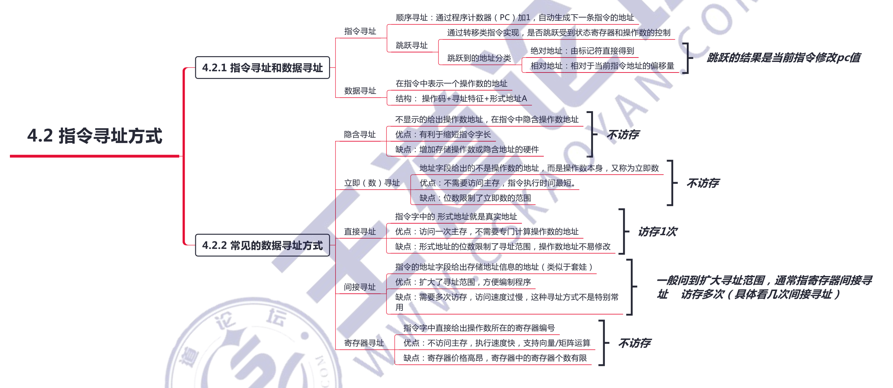

# 指令系统

指令系统是表征一台计算机性能的重要因素

- 指令（机器指令）是指示计算机执行某种操作的命令。

- 一台计算机的所有指令的集合构成该机的指令系统，也称指令集。指令系统是计算机的主要属性，位于硬件和软件的交界面上。

## 4.1 指令格式

### 指令的操作类型

**1）数据传送**

传送指令通常有寄存器之间的传送（MOV）、从内存单元读取数据到 CPU 寄存器(LOAD）、从 CPU 寄存器写数据到内存单元 (STORE）等。

**2）算术和逻辑运算**

这类指令主要有加 （ADD）、减（SUB）、比较（CMP）乘（MUL）、除(DIV)、加1(INC)、减1 (DEC)、与（AND)、或（OR）、取反 （NOT)、异或 (XOR）等

**3）移位揉作**

移位指令主要有算法移位、逻辑移位、循环移位等。

**4）转移操作**

转移指令主要有无条件转移（JMP）、条件转移（ BRANCH）、调用 (CALL)、返回(RET）、陷阱 （TRAP）等。无条件转移指令在任何情况下都执行转移操作，而条件转移指令仅在特定条件满足时才执行转移操作，转移条件一般是某个标志位的值，或两个或两个以上的标志位组合。

调用指令和转移指令的区别：执行调用指令时必须保存下一条指令的地址（返回地址），当子程序执行结束时，根据返回地址返回到主程序继续执行；而转移指令则不返回执行。

**5）输入输出操作**

这类指令用于完成 CPU 与外部设各交换数据或传送控制命令及状态信息

## 4.2 寻址方式

**寻址方式是指寻找指令或操作数有效地址的方式**，即确定本条指令的数据地址及下一条待执行指令的地址的方法。

寻址方式分为指令寻址和数据寻址两大类。

## X86 汇编指令入门

请看书 165页

## 4.3 CISC 和 RISC 概念

指令系统朝两个截然不同的方向的发展：

- 一是增强原有指令的功能，设置更为复杂的新指令实现软件功能的硬化，这类机器称为**复杂指令系统计算机 CISC**，典型的有采用 x86 架构的计算机；
- 二是减少指令种类和简化指令功能，提高指令的执行速度，这类机器称为**精简指令系统计算机 RISC**，典型的有 ARM、MIPS 架构的计算机。

RISC 缺点：大多数 RISC 机不能与老机器兼容

## 常见问题

### 1）什么是指令？什么是指令系统？为什么要引入指令系统？

指令就是要计算机执行某种操作的命令。

一台计算机中所有机器指令的集合，称为这台计算机的指令系统。

引入指令系统后，避免了用户与二进制代码直接接触，使得用户编写程序更为方便。另外，指令系统是表征一台计算机性能的重要因素，它的格式与功能不仅直接影响到机器的硬件结构，而且也直接影响到系统软件，形响到机器的适用范围。

### 2）一般来说，指令分为哪些部分？每部分有什么用处？

**一条指令通常包括操作码字段和地址码字段两部分**。

- 其中，操作码指出指令中该指令应该执行什么性质的操作和具有何种功能，它是识别指令、了解指令功能与区分操作数地址内容的组成和使用方法等的关键信息。
- 地址码用于给出被操作的信息（指令或数据）的地址，包括参加运算的一个或多个操作数所在的地址、运算结果的保存地址、程序的转移地址、被调用子程序的入口地址等。

### 3）对于一个指令系统来说，寻址方式多和少有什么影响？

寻址方式的「多样化」能让**用户编程更为方便**，但多重寻址方式会造成 **CPU 结构的复杂化**（详见下章），也不利于指令流水线的运行。

而寻址方式太少虽然能够**提高 CPU 的效率**，但对于用户而言，少数几种寻址方式会使**编程变得复杂**，很难满足用户的需求。

### 4）简述各常见指令导址方式的特点和适用情况

- 立即寻址：操作数获取便捷，**通常用于给寄存器赋初值**
- 直接寻址：相对于立即寻址，缩短了指令长度
- 间接寻址：扩大了寻址范国，**便于编制程序，易于完成子程序返回**
- 寄存器寻址：指令字较短，指令执行速度较快
- 寄存器间接寻址：扩大了寻址范围
- 基址寻址：扩大了操作数寻址范围，适用于多道程序设计，常用于**为程序或数据分配存储空间**
- 变址寻址：主要用于**处理数组问题，适合编制循环程序**
- 相对寻址：**用于控制程序的执行顺序、转移等**

基址寻址和变址寻址的区别：两种方式有效地址的形成都是寄存器内容 ＋偏移地址，

- 但是在基址寻址中，程序员**操作的是偏移地址**，基址寄存器的内容由操作系统控制，在执行过程中是动态调整的
- 而在变址寻址中，程序员**操作的是变址寄存器**，偏移地址是固定不变的。

### 5）一个操作数在内存可能占多个单元，怎样在指令中给出操作数的地址？

现代计算机都采用字节编址方式，即一个内存单元只能存成一字节的信息。一个操作数(如char、int、float、double）可能是8位、16位、32位或 64 位等，因此可能占用 1个、2个4个或8个内存单元。也就是说，**一个操作数可能有多个内存地址对应**。

有两种不同的地址指定方式：大端方式和小端方式

- 大端方式：指令中给出的地址是操作数最高有效字节（MSB）所在的地址。
- 小端方式：指令中给出的地址是操作数最低有效字节(LSB） 所在的地址。

### 6）装入/存储(Load/ Store）型指令有什么特点？

装入/存储型指令是用在规整型指令系统中的一种通用寄存器型指令风格。这种指令风格在RISC 指令系统中较为常见。为了规整指令格式，使指令具有相同的长度，规定**只有 Load/Store指令才能访问内存**。而**运算指令不能直接访问内存，只能从寄存器取数进行运算，运算的结果也只能送到寄存器**。因为寄存器编号较短，而主存地址位数较长，通过某种方式可使运算指令和访存指令的长度一致。

这种装入/存储型风格的指令系统的**最大特点是，指令格式规整，指令长度一致**，一般为 32位。由于只有 Load/Store 指令才能访问内存，程序中可能会包含许多装入指令利存储指令，与一般通用寄存器型指令风格相比，其**程序长度会更长**

