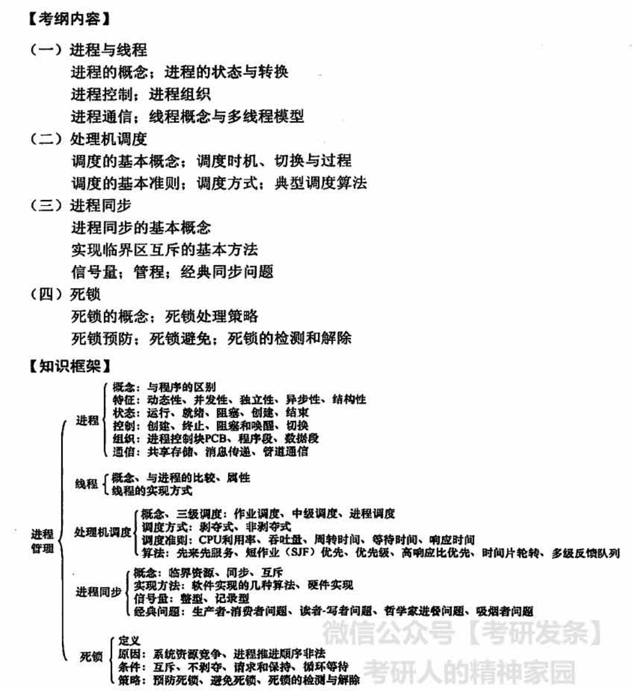
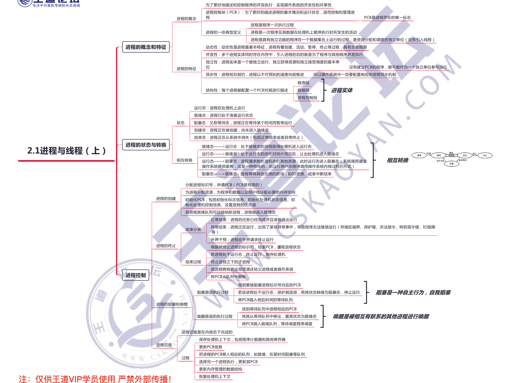
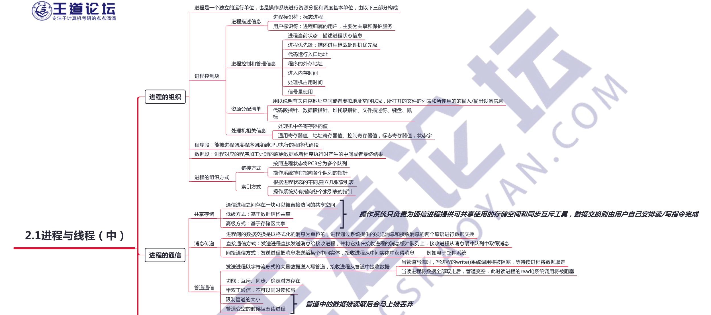
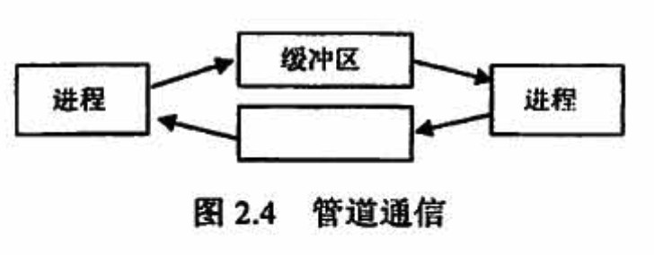
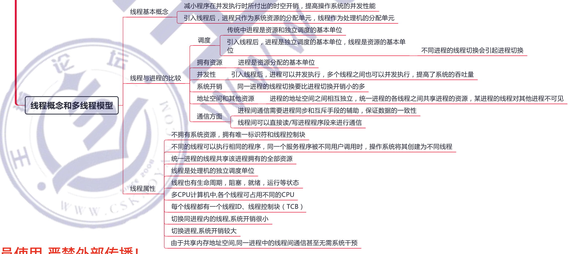
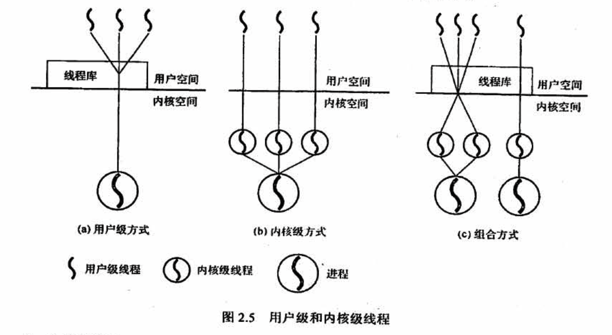
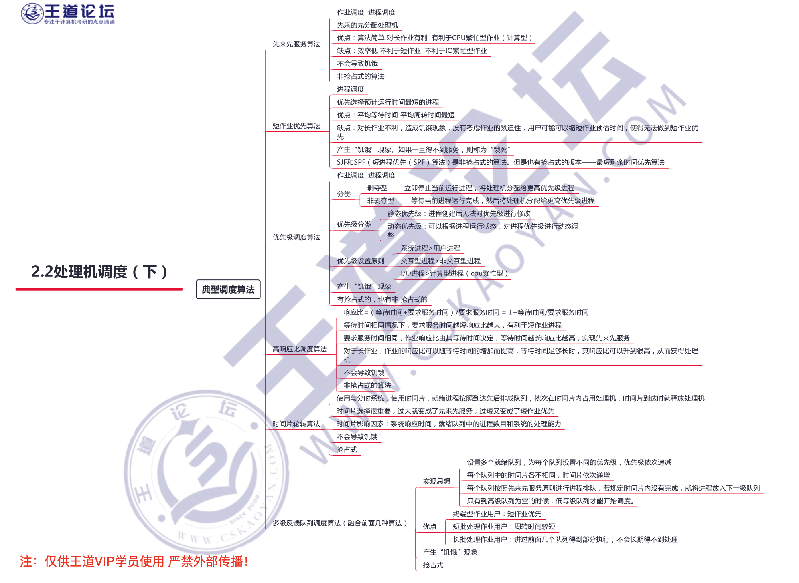
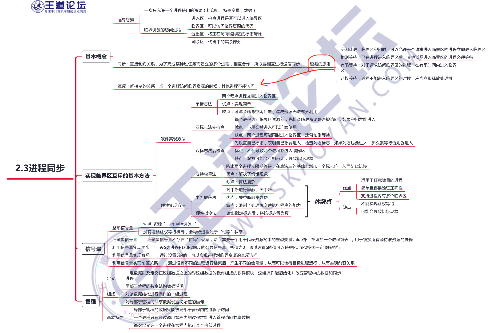
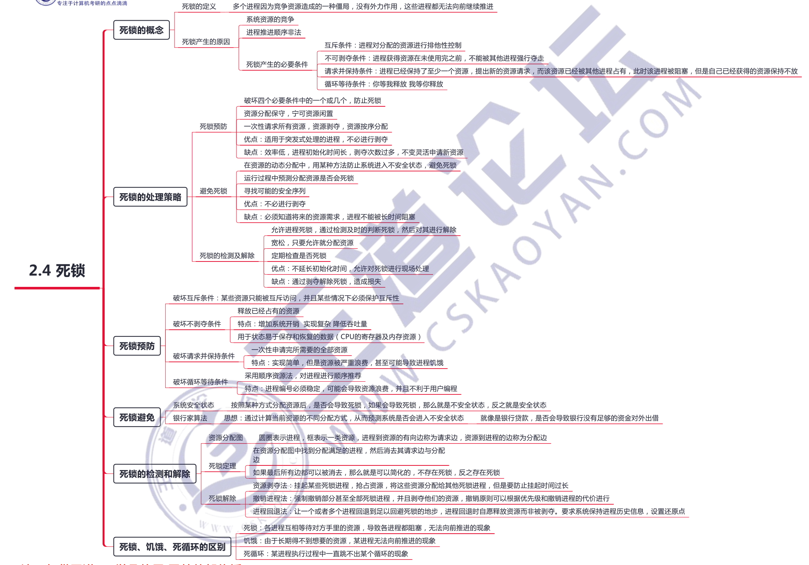

# 进程管理

进程管理是操作系统的核心，也是每年必考的重点。其中，进程的概念、进程调度、信号量机制实现同步和互斥、进程死锁等更是重中之重，必须深入学握。需要注意的是，除选择题外，本章还容易出综合题，其中信号量机制实现同步和互斥、进程调度算法和银行家算法都是可能出现的综合题考点，如利用信号量进行进程同步就在往年的统考中频繁出现。

## 2.1 进程与线程

### 1、进程

目的：并发、共享

程序段、相关数据段、进程控制块（PCB）构成了进程映像（进程实体）

#### 进程的通信

**管道通信**

管道通信是消息传递的一种特殊方式（见图2.4）。**所谓 “管道”，是指用于连接一个读进程和一个写进程以实现它们之间的通信的一个「共享文件」，又名pipe 文件**。向管道（共享文件）提供输入的发送进程（即写进程），以字符流形式将大量的数据送入（写）管道；而接收管道输出的接收进程（即读进程〉则从管道中接收（读）数据。为了协调双方的通信，管道机制必须提供以下三方面的协调能力：**互斥、同步和确定对方的存在**

下面以 Linux 中的管道为例进行说明。在 Linux 中，管道是一种使用非常频繁的通信机制。从本质上说，管道也是一种文件，但它又和一般的文件有所不同，管道可以克服使用文件进行通信的两个问题，具体表现如下：

1）**限制管道的大小**。实际上，**管道是一个固定大小的缓冲区**。在Linux 中，该缓冲区的大小为 4KB，这使得它的大小不像文件那样 不加检验地增长。使用单个固定缓冲区也会带来问题，比如在写管道时可能变满，这种情况发生时，随后对管道的 write()调用將默认地被阻塞，等待某些数据被读取，以便腾出足够的空间供 write() 调用写。**管道满的时候，写阻塞**

2）读进程也可能工作得比写进程快。当所有当前进程数据己被读取时，管道变空。当这种情况发生时，一个随后的read() 调用默认地被阻塞，等待某些数据被写入,这解决了 read() 调用返回文件结束的问题。**管道空的时候，读阻塞**

3）从管道读数据是一次性操作，**数据一旦被读取，它就从管道中被地弃**，释放空问以便写更多的数据．管道只能来用半双工通信，即某一时刻只能**单向传输**．要实现父子进程双方互动通信，需要定义两个管道。

### 2、线程

线程是一个基本的 CPU 执行单元，也是程序执行流的最小单元，**由线程 ID、程序计数器、寄存器集合和堆栈组成**。线程自身不拥有系统资源

### 线程的实现方式

线程的实现可以分为两类：用户级线程(User-Level Thread, ULT)和内核级线程 (Kernel- Level Thread， KLT)。内核级线程又称内核支持的线程。

- 在「用户级线程」中，有关线程管理（线程的创建、撤销和切换等）的所有工作都由「应用程序」完成，内核意识不到线程的存在。**应用程序可以通过使用线程库设计成多线程程序**。通常，应用程序从单线程开始，在该线程中开始运行，在其运行的任何时刻，可以通过调用线程库中的派生例程创建一个在相同进程中运行的新线程。图2.5(a)说明了用户级线程的实现方式。
- 在「内核级线程」中，线程管理的所有工作由「内核」完成，应用程序没有进行线程管理的代码，只有一个到内核级线程的编程接口。**内核为进程及其内部的每个线程维护上下文信息，调度也在内核基于线程架构的基础上完成**。图2.5(b)说明了内核级线程的实现方式
- 有些系统中使用「组合方式」的多线程实现。**线程创建完全在用户空间中完成，线程的调度和同步也在应用程序中进行。一个应用程序中的多个用户级线程被映射到一些（小于等子用户级线程的数目）内核级线程上**。图2.5(c)说明了用户级与内核级的组合实现方式。

## 2.2 处理机调度

在多道程序系统中，进程的数量往往多于处理机的个数，因此**进程争用处理机的情况在所难免**。处理机调度是对处理机进行分配，即**从就绪队列中按照一定的算法（公平、高效）选择一个进程并将处理机分配给它运行，以实现进程井发地执行**。

处理机调度是多道程序操作系统的基础，是操作系统设计的核心问题。

**进程调度和切换程序是操作系统内核程序**。请求调度的事件发生后，才可能运行进程调度程序，调度了新的就绪进程后，才会进行进程间的切换。理论上这三件事情应该顺序执行，但在实际设计中，会有不能切换的情况

## 2.3 进程同步

**在多道程序环境下，进程是并发执行的，不同进程之间存在着不同的相互制约关系。为了协调进程之间的相互制约关系，引入了进程同步的概念**。下面举-一个简单的例子来帮大家理解这个概念。例如，让系统计算 1+2x3，假设系统产生两个进程：一个是加法进程，一个是乘法进程。要让计算结果是正确的，一定要让加法进程发生在乘法进程之后，但实际上操作系统具有异步性，若不加以制约，加法进程发生在乘法进程之前是有可能的，因此要制定一定的机制去约束加法进程，让它在乘法进程完成之后才发生，而这种机制就是同步

### 信号量

**信号量机制是一种功能较强的机制，可用来解决互斥与同步问题，它只能被两个标准的原语wait(S)和 signal(S)访问**，也可记为“P操作” 和“V操作”。

「原语」是指完成某种功能且不被分割、不被中断执行的操作序列，通常可由硬件来实现。例如，前述的 Test-and-Set 和 Swap 指令就是由硬件实现的原子操作。原语功能的不被中断执行特性在单处理机上可由软件通过屏蔽中断方法实现。

原语之所以不能被中断执行，是因为原语对变量的操作过程若被打断，可能会去运行另一个对同一变量的操作过程，从而出现临界段问题。若能够找到一种解决临界段问题的元方法，就可以实现对共享变量操作的原子性。

### 管程

在信号量机制中，每个要访问临界资源的进程都必须自备同步的 PV 操作，大量分散的同步操作给系统管理带来了麻烦，且容易因同步操作不当而导致系统死锁。于是，便产生了一种新的**进程同步工具**--管程。管程的特性保证了进程互斥，无须程序员自己实现互斥，从而降低了死锁发生的可能性。同时管程提供了条件变量，可以让程序员灵活地实现进程同步。

## 2.4 死锁

## 经典同步问题

### 1）生产者-消费者问题

一组生产者进程和一组消费者进程共享一个初始为空、大小为n的缓冲区，**只有缓冲区没满时，生产者才能把消息放入缓冲区，否则必须等待；只有缓冲区不空时，消费者才能从中取出消息，否则必须等待**。由于缓冲区是临界资源，它只允许一个生产者放入消息，或一个消费者从中取出消息。

桌子上有一个盘子，每次只能向其中放入一个水果。爸爸专向盘子中放苹果，妈妈专向盘子中放橘子，儿子专等吃盘子中的橘子，女儿专等吃盘子中的苹果。只有盘子为空时，爸爸或妈妈才可向盘子中放一个水果：仅当盘子中有自己需要的水果时，儿子或女儿可以从盘子中取出。

### 2）读者-写者问題

有读者和写者两组并发进程，共享一个文件，**当两个或以上的读进程同时访问共享数据时不会产生副作用，但若某个写进程和其他进程（读进程或写进程）同时访问共享数据时则可能导致数据不一致的错误**。因此要求：① 允许多个读者可以同时对文件执行读操作：②只允许一个写者往文件中写信息：③ 任一写者在完成写操作之前不允许其他读者或写者工作：④写者执行写操作前，应让已有的读者和写者全部退出

### 3）哲学家进餐向題

一张圆桌边上坐著 5 名哲学家，每两名哲学家之间的桌上摆一根筷子，两根模子中间是一碗米饭，如图 2.10所示。哲学家们倾注毕生精力用于思考和进餐，哲学家在思考时，并不影响他人。只有当哲学家饥饿时，才试图拿起左、右两根筷子（一根一根地拿起）。若筷子己在他人手上，则需要等待。饥饿的哲学家只有同时拿到了两根筷子才可以开始进餐，进餐完牛后，放下筷子继续思考。

本题的关键是如何让一名哲学家拿到左右两根筷子而不造成死锁或饥饿现象。解决方法有两个：一是让他们同时拿两根筷子；二是对每名哲学家的动作制定规则，避免饥饿或死锁现象的发生。

### 4）吸烟者问題

假设一个系统有三个抽烟者进程和一个供应者进程。每个抽烟者不停地卷烟并抽掉它，但要卷起并抽掉一支烟，抽烟者需要有三种材料：烟草、纸和胶水。三个抽烟者中，第一个拥有烟草，第二个拥有纸，第三个拥有胶水。供应者进程无限地提供三种材料，供应者每次将两种材料放到桌子上，拥有剩下那种材料的抽烟者卷一根烟井抽掉它，并给供应者一个信号告诉己完成，此时供应者就会将另外两种材料放到桌上，如此重复（让三个抽烟者轮流地抽烟）。

## 常见问题

### 1）为什么要引入进程？

**在多道程序同时运行的背最下，进程之间需要「共享」系统资源**，因此会导致各程序在执行过程中出现相互制约的关系，程序的执行会表现出间断性的特征。这些特征都是在程序的执行过程中发生的，是动态的过程，而传统的程序本身是一组指令的集合，是一个静态的概念，无法描述程序在内存中的执行情况，即我们无法从程序的字面上看出它何时执行、何时停顿，也无法看出它与其他执行程序的关系，因此，程序这个静态概念已不能如实反映程序并发执行过程的特征。**为了深刻描述程序「动态」执行过程的性质乃至更好地支持和管理多道程序的「并发」执行，人们引入了进程的概念**

### 2）什么是进程？进程由什么组成？

**进程是一个具有独立功能的程序关于某个数据集合的一次运行活动**。它可以申请和拥有系统资源，是一个动态的概念，是一个活动的实体。它不只是程序的代码本身，还包括当前的活动，通过程序计数器的值和处理寄存器的内容来表示。

一个**进程实体由程序段、相关数据段和 PCB 三部分构成**，其中PCB 是标志一个进程存在的唯一标识，程序段是进程运行的程序的代码，数据段则存储程序运行过程中相关的一些数据。

### 3）进程是如何解决问题的？

**进程把能够识别程序运行态的一些变量存放在 PCB 中**，通过这些变量系统能够更好地了解进程的状况，**并在适当时进行进程的切换**，以避免一些资源的浪费，甚至划分为更小的调度单位一线程来提高系统的并发度。

### 4）为什么要进行处理机调度？

**若没有处理机调度，意味着要等到当前运行的进程执行完毕后，下一个进程才能执行**，而实际情况中，进程时常需要等待一些外部设备的输入，而外部设各的速度与处理机相比是非常缓慢的，若让处理机总是等待外部设备，则对处理机的资源是极大的浪费。而引进处理机调度后，**可在运行进程等待外部设备时，把处理机调度给其他进程，从而提高处理机的利用率**。用一句简单的话说，就是为了合理地处理计算机的软/硬件资源。

### 5）调度算法有哪几种？结合第1章学习的分时操作系统和实时操作系統，思考有没有哪种调度算法比较适合这两种操作系统。
本节介绍的调度算法有先来先服务调度算法、短作业优先调度算法、优先级调度算法、高响应比优先调度算法、时间片轮转调度算法、多级反馈队列调度算法6种，

「先来先服务算法」和「短作业优先算法」无法保证及时地接收和处理问题，因此无法保证在规定的时间间隔内响应每个用户的需求，也同样无法达到实时操作系统的及时性需求。「优先级调度算法」按照任务的优先级进行调度，对于更紧急的任务给予更高的优先级，适合「实时操作系统」

「高响应比优先调度算法」、「时间片轮转调度算法」、「多级反馈队列调度算法」都能保证每个任务在一定时间内分配到时间片，并轮流占用CPU，适合「分时操作系统」

### 6）为什么要引入进程同步的概念？

在多道程序共同执行的条件下，进程与进程是并发执行的，不同进程之间存在不同的相互制约关系。为了协调进程之间的相互制约关系，引入了进程同步的概念。

### 7）不同的进程之间会存在什么关系？

**进程之间存在同步与互斥的制约关系**

「同步」是指为完成某种任务而建立的两个或多个进程，这些进程因为需要在某些位置上协调它们的工作次序而等待、传递信息所产生的制约关系。

「互斥」是指当一个进程进入临界区使用临界资源时，另一个进程必须等待，当占用临界资源的进程退出临界区后，另一进程才允许去访向此临界资源.

### 8）为什么会产生死锁？产生死锁有什么条件？

由于系统中存在一些不可剥夺资源，当两个或两个以上的进程占有自身的资源并请求对方的资源时，会导致每个进程都无法向前推进，这就是死锁。死锁产生的必要条件有4个，分别是互斥条件、不剥夺条件、请求并保持条件和循环等待条件。

- 互斥条件是指进程要求分配的资源是排他性的，即最多只能同时供一个进程使用。
- 不剥夺条件是指进程在使用完资源之前，资源不能被强制夺走。
- 请求并保持条件是指进程占有自身本来拥有的资源并要求其他资源。
- 循环等待条件是指存在一种进程资源的循环等待链。

### 9）有什么办法可以解决死锁问题？

死锁的处理策略可以分为预防死锁、 避免死锁及死锁的检测与解除

- 死锁的预防是指通过设立一些限制条件，破坏死锁的一些必要条件，让死锁无法发生
- 死锁的避免是指在动态分配资源的过程中，用一些算法防止系统进入不安全状态，从而避免死锁。
- 死锁的检测和解除是指在死锁产生前不采取任何措施，只检测当前系统有没有发生死锁，若有，则采取一些措施解除死锁。

### 10）进程与程序的区别与联系

**进程是程序及其数据在计算机上的一次运行活动，是一个动态的概念**。进程的运行实体是程序，离开程序的进程没有存在的意义。从静态角度看，进程是由程序、数据和进程控制块（PCB）三部分组成的。**而程序是一组有序的指令集合，是一种静态的概念**。

进程是程序的一次执行过程，它是动态地创建和消亡的，具有一定的生命周期，是暂时存在的，而程序则是一组代码的集合，是永久存在的，可长期保存。

**一个进程可以执行一个或几个程序，一个程序也可构成多个进程。进程可创建进程，而程序不可能形成新的程序**。

### 11）什么是饥饿，死锁

两个进程几乎同时都想进入临界区时，它们分别将自己的标志值 flag 设置为 TRUE,并且同时检测对方的状态（执行 while 语句），发现对方也要进入临界区时，**双方互相谦让，结果谁也进不了临界区**，从而导致「饥饿」现象

当两个或两个以上的进程在执行过程中，因占有一些资源而又需要对方的资源时，**会因为争夺资源而造成一种互相等待的现象**，若无外力作用，它们都将无法推进下去。这种现象称为「死锁」

一组进程处于死锁状态是指组内的每个进程都在等待一个事件，而该事件只可能由组内的另一个进程产生。这里所关心的主要是事件是**资源的获取和释放**。

**产生饥饿的主要原因是**：在一个动态系统中，对于每类系统资源，操作系统需要确定一个分配策略，当多个进程同时申请某类资源时，由分配策略确定资源分配给进程的次序。有时资源分配策略可能是不公平的，即不能保证等待时间上界的存在。在这种情况下，即使系统没有发生死锁，某些进程也可能会长时间等待。当等待时间给进程推进和响应带来明显影响时，称发生了进程“饥饿”，当“饥饿”到一定程度的进程所赋子的任务即使完成也不再具有实际意义时，称该进程被 “饿死”。

例如，当有多个进程需要打印文件时，若系统分配打印机的策略是最短文件优先，则长文件的打印任务将由于短文件的源源不断到来而被无限期推迟，导致最终“饥饿”甚至“饿死”。

“饥饿”并不表示系统一定会死锁，但至少有一个进程的执行被无限期推迟。**饥饿与死锁的主要差别如下**：

1. 进入「饥饿」状态的进程可以只有「一个」，而因循环等待条件而进入「死锁」状态的进程却必须「大于等于两个」
2. 处于「饥饿」状态的进程可以是一个就绪进程，如静态优先权调度算法时的低优先权进程，而处于「死锁」状态的进程则必定是「阻塞进程」

### 12）银行家算法的工作原理

**银行家算法的主要思想是避免系统进入不安全状态**。在每次进行资源分配时，它首先检查系统是否有足够的资源满足要求，若有则先进行分配，并对分配后的新状态进行安全性检查。若新状态安全，则正式分配上述资源，否则拒绝分配上述资源。这样，它保证系统始终处于安全状态，从而避免了死锁现象的发生

### 13）进程同步、互斥的区别和联系

并发进程的执行会产生相互制约的关系：

- 一种是进程之间竞争使用临界资源，只能让它们逐个使用，这种现象称为「互斥」，是一种「竞争关系」
- 另一种是进程之间协同完成任务称为「同步」，在关键点上等待另一个进程发来的消息，以便协同一致，是一种「协作关系」

### 14）作业和进程的关系

进程是系统资源的使用者，系统的资源大部分都是以进程为单位分配的

而用户使用计算机是为了实现一串相关的任务，通**常把用户要求计算机完成的这一串任务称为作业**

