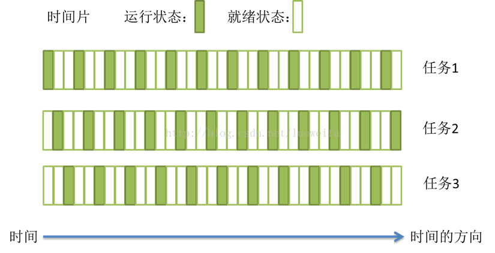
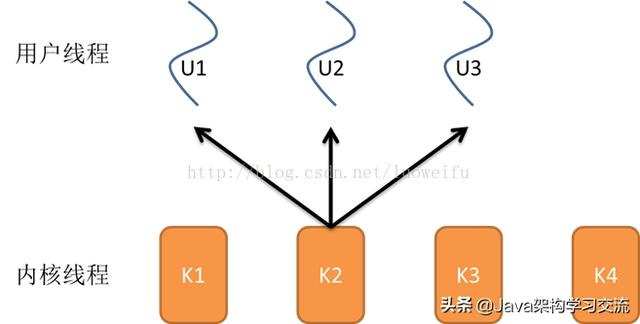
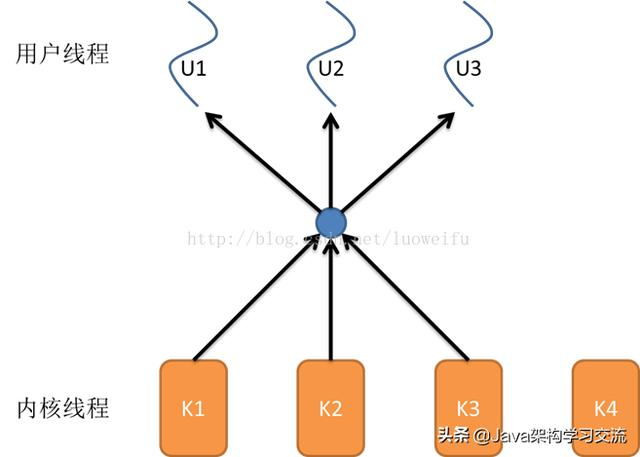

# 进程、线程、协程

来源1：[线程和进程的区别是什么？](https://www.zhihu.com/question/25532384)

来源2：[一文读懂什么是进程、线程、协程](http://www.360doc.com/content/20/0417/14/32196507_906628857.shtml) 

## 一、形象比喻

**进程=火车，线程=车厢**

- 线程在进程下行进（单纯的车厢无法运行）
- 一个进程可以包含多个线程（一辆火车可以有多个车厢）
- 不同进程间数据很难共享（一辆火车上的乘客很难换到另外一辆火车，比如站点换乘）
- 同一进程下不同线程间数据很易共享（A车厢换到B车厢很容易）
- 进程要比线程消耗更多的计算机资源（采用多列火车相比多个车厢更耗资源）
- 进程间不会相互影响，一个线程挂掉将导致整个进程挂掉（一列火车不会影响到另外一列火车，但是如果一列火车上中间的一节车厢着火了，将影响到所有车厢）
- 进程可以拓展到多机，进程最多适合多核（不同火车可以开在多个轨道上，同一火车的车厢不能在行进的不同的轨道上）
- 进程使用的内存地址可以上锁，即一个线程使用某些共享内存时，其他线程必须等它结束，才能使用这一块内存。（比如火车上的洗手间）－"互斥锁"
- 进程使用的内存地址可以限定使用量（比如火车上的餐厅，最多只允许多少人进入，如果满了需要在门口等，等有人出来了才能进去）－“信号量”

## 二、时间（CPU）角度理解

**进程和线程都是一个时间段的描述，是CPU工作时间段的描述。是运行中的程序指令的一种描述，这需要与程序中的代码区别开来**

**背景**：CPU+RAM+各种资源（比如显卡，光驱，键盘，GPS, 等等外设）构成我们的电脑，但是电脑的运行，实际就是CPU和相关寄存器以及RAM之间的事情

**最基础的事实**：CPU太快，太快，太快了，寄存器仅仅能够追的上他的脚步，RAM和别的挂在各总线上的设备则难以望其项背。那当多个任务要执行的时候怎么办呢？轮流着来?或者谁优先级高谁来？不管怎么样的策略，一句话就是**「在CPU看来就是轮流着来」**。而且因为速度差异，CPU实际的执行时间和等待执行的时间是数量级的差异。比如工作1秒钟，休息一个月。所以多个任务，轮流着来，让CPU不那么无聊，给流逝的时间增加再多一点点的意义。这些任务，**在外在表现上就仿佛是同时在执行**

**必须知道的事实：执行一段程序代码，实现一个功能的过程之前 ，当得到CPU的时候，相关的资源必须也已经就位**，就是万事俱备只欠CPU这个东风。所有这些任务都处于就绪队列，然后由操作系统的调度算法，选出某个任务，让CPU来执行。然后就是PC指针指向该任务的代码开始，由CPU开始取指令，然后执行。

除了CPU以外所有的执行环境，主要是寄存器的一些内容，就构成了的进程的上下文环境。进程的上下文是进程执行的环境。当这个程序执行完了，或者分配给他的CPU时间片用完了，那它就要被切换出去，等待下一次CPU的临幸。在被切换出去做的主要工作就是保存程序上下文，因为这个是下次他被CPU临幸的运行环境，必须保存。

**具体的轮流方法：在CPU看来所有的任务都是一个一个的轮流执行的，先加载进程A的上下文，然后开始执行A，保存进程A的上下文，调入下一个要执行的进程B的进程上下文，然后开始执行B，保存进程B的上下文...**

**进程和线程就是这样的背景出来的，两个名词不过是对应的CPU时间段的描述，名词就是这样的功能**

### 进程是什么？

**进程就是上下文切换之间的程序执行的部分**。是运行中的程序的描述，也是对应于该段CPU执行时间的描述。

在软件编码方面，我们说的进程，其实是稍不同的，编程语言中创建的进程是一个无限loop，对应的是tcb块。这个是操作系统进行调度的单位。所以和上面的cpu执行时间段还是不同的。

进程，与之相关的东东有寻址空间，寄存器组，堆栈空间等。**即不同的进程，这些东东都不同**，从而能相互区别。

```
进程process，也就是进程时间段 = 
CPU加载进程上下文的时间 + 
CPU执行程序时间 + 
CPU保存进程上下文的时间
```

### 线程是什么？

进程的颗粒度太大，每次的执行都要进行进程上下文的切换。如果我们把进程比喻为一个运行在电脑上的软件，那么一个软件的执行不可能是一条逻辑执行的，必定有多个分支和多个程序段，就好比要实现程序A，实际分成 a，b，c等多个块组合而成。那么这里具体的执行就可能变成：

程序A得到CPU，然后CPU加载上下文，开始执行程序A的a小段，然后执行A的b小段，然后再执行A的c小段，最后CPU保存A的上下文。

这里a，b，c的执行是共享了A进程的上下文，CPU在执行的时候仅仅切换线程的上下文，而没有进行进程上下文切换的。进程的上下文切换的时间开销是远远大于线程上下文时间的开销。这样就让CPU的有效使用率得到提高。**这里的a，b，c就是线程，也就是说线程是共享了进程的上下文环境，是更为细小的CPU时间段。线程主要共享的是进程的地址空间**

```
线程thread，也就是线程时间段 = 
CPU加载线程上下文的时间 +
CPU执行程序时间 +
CPU保存线程上下文的时间 （是更为细小的时间段，远小于进程时间段）
```

## 三、资源角度理解

所谓的资源就是计算机里的中央处理器，内存，文件，网络等等。

进程，在一定的环境下，把静态的程序代码运行起来，通过使用不同的资源，来完成一定的任务。比如说，进程的环境包括环境变量，进程所掌控的资源，有中央处理器，有内存，打开的文件，映射的网络端口等等。

这里我把进程对内存的管理稍微展开说一下。一个系统中，有很多进程，它们都会使用内存。**为了确保内存不被别人使用，每个进程所能访问的内存都是圈好的**。一人一份，谁也不干扰谁。还有内存的分页，虚拟地址我就不深入探讨了。这里给大家想强调的就是，**进程需要管理好它的资源**

其中，线程作为进程的一部分，扮演的角色就是怎么利用中央处理器去运行代码。这其中牵扯到的最重要资源的是中央处理器和其中的寄存器，和线程的栈（stack）。这里想强调的是，**线程关注的是中央处理器的运行，而不是内存等资源的管理**

当只有一个中央处理器（单核）的时候，进程中只需要一个线程就够了。随着多处理器（多核）的发展，一个进程中可以有多个线程，来并行的完成任务。比如说，一个web服务器，在接受一个新的请求的时候，可以大动干戈的fork一个子进程去处理这个请求，也可以只在进程内部创建一个新的线程来处理。线程更加轻便一点。线程可以有很多，但他们并不会改变进程对内存（heap）等资源的管理，线程之间会共享这些资源。

因此进程和线程不是同一个层面上的概念，**线程是进程的一部分，线程主抓中央处理器执行代码的过程，其余的资源的保护和管理由整个进程去完成**

## 四、八股文角度

我们都知道计算机的核心是CPU，它承担了所有的计算任务；而操作系统是计算机的管理者，它负责任务的调度、资源的分配和管理，统领整个计算机硬件；应用程序则是具有某种功能的程序，程序是运行于操作系统之上的。

### 1、进程

**进程是一个具有一定独立功能的程序在一个数据集上的一次动态执行的过程，是操作系统进行资源分配和调度的一个独立单位，是应用程序运行的载体**。进程是一种抽象的概念，从来没有统一的标准定义。

进程一般由程序、数据集合和进程控制块三部分组成。

- 程序用于描述进程要完成的功能，是控制进程执行的指令集；
- 数据集合是程序在执行时所需要的数据和工作区；
- 程序控制块(Program Control Block，简称PCB)，包含进程的描述信息和控制信息，是进程存在的唯一标志。

进程具有的特征：

- 动态性：进程是程序的一次执行过程，是临时的，有生命期的，是动态产生，动态消亡的；
- 并发性：任何进程都可以同其他进程一起并发执行；
- 独立性：进程是系统进行资源分配和调度的一个独立单位；
- 结构性：进程由程序、数据和进程控制块三部分组成。

### 2、线程

在早期的操作系统中并没有线程的概念，进程是能拥有资源和独立运行的最小单位，也是程序执行的最小单位。任务调度采用的是时间片轮转的抢占式调度方式，而进程是任务调度的最小单位，每个进程有各自独立的一块内存，使得各个进程之间内存地址相互隔离。

后来，随着计算机的发展，对CPU的要求越来越高，进程之间的切换开销较大，已经无法满足越来越复杂的程序的要求了。于是就发明了线程。

**线程是程序执行中一个单一的顺序控制流程，是程序执行流的最小单元，是处理器调度和分派的基本单位**。一个进程可以有一个或多个线程，各个线程之间共享程序的内存空间(也就是所在进程的内存空间)。一个标准的线程由线程ID、当前指令指针(PC)、寄存器和堆栈组成。而进程由内存空间(代码、数据、进程空间、打开的文件)和一个或多个线程组成。

### 3、任务调度

大部分操作系统(如Windows、Linux)的任务调度是采用时间片轮转的抢占式调度方式。

**在一个进程中，当一个线程任务执行几毫秒后，会由操作系统的内核（负责管理各个任务）进行调度，通过硬件的计数器中断处理器，让该线程强制暂停并将该线程的寄存器放入内存中，通过查看线程列表决定接下来执行哪一个线程，并从内存中恢复该线程的寄存器，最后恢复该线程的执行，从而去执行下一个任务**

上述过程中，任务执行的那一小段时间叫做时间片，任务正在执行时的状态叫运行状态，被暂停的线程任务状态叫做就绪状态，意为等待下一个属于它的时间片的到来。

**这种方式保证了每个线程轮流执行，由于CPU的执行效率非常高，时间片非常短，在各个任务之间快速地切换，给人的感觉就是多个任务在 同时进行**，这也就是我们所说的并发(别觉得并发有多高深，它的实现很复杂，但它的概念很简单，就是一句话：多个任务同时执行)。多任务运行过程的示意图如下：



### 4、进程与线程的区别

1. 线程是程序执行的最小单位，而进程是操作系统分配资源的最小单位；
2. 一个进程由一个或多个线程组成，线程是一个进程中代码的不同执行路线；
3. 进程之间相互独立，但同一进程下的各个线程之间共享程序的内存空间(包括代码段、数据集、堆等)及一些进程级的资源(如打开文件和信号)，某进程内的线程在其它进程不可见；
4. 调度和切换：线程上下文切换比进程上下文切换要快得多。

线程与进程关系的示意图：


总之，线程和进程都是一种抽象的概念，线程是一种比进程还小的抽象，线程和进程都可用于实现并发。

在早期的操作系统中并没有线程的概念，进程是能拥有资源和独立运行的最小单位，也是程序执行的最小单位，它相当于一个进程里只有一个线程，进程本身就是线程。所以线程有时被称为轻量级进程

　　后来，随着计算机的发展，对多个任务之间上下文切换的效率要求越来越高，就抽象出一个更小的概念-线程，一般一个进程会有多个线程(也可以是一个)

### 5、多线程与多核

上面提到的时间片轮转的调度方式说一个任务执行一小段时间后强制暂停去执行下一个任务，每个任务轮流执行。很多操作系统的书都说“同一时间点只有一个任务在执行”。那有人可能就要问双核处理器呢？难道两个核不是同时运行吗？

其实“同一时间点只有一个任务在执行”这句话是不准确的，至少它是不全面的。那多核处理器的情况下，线程是怎样执行呢？这就需要了解内核线程。

**多核处理器是指在一个处理器上集成多个运算核心从而提高计算能力，也就是有多个真正并行计算的处理核心，每一个处理核心对应一个内核线程**

**内核线程（Kernel Thread，KLT）就是直接由操作系统内核支持的线程**，这种线程由内核来完成线程切换，内核通过操作调度器对线程进行调度，并负责将线程的任务映射到各个处理器上。一般一个处理核心对应一个内核线程，比如单核处理器对应一个内核线程，双核处理器对应两个内核线程，四核处理器对应四个内核线程。

> 现在的电脑一般是双核四线程、四核八线程，是采用超线程技术将一个物理处理核心模拟成两个逻辑处理核心，对应两个内核线程，所以在操作系统中看到的CPU数量是实际物理CPU数量的两倍，如你的电脑是双核四线程，打开“任务管理器\性能”可以看到4个CPU的监视器，四核八线程可以看到8个CPU的监视器。

**超线程技术就是利用特殊的硬件指令，把一个物理芯片模拟成两个逻辑处理核心，让单个处理器都能使用线程级并行计算**，进而兼容多线程操作系统和软件，减少了CPU的闲置时间，提高的CPU的运行效率。这种超线程技术(如双核四线程)由处理器硬件的决定，同时也需要操作系统的支持才能在计算机中表现出来。

**当线程的数量小于处理器的数量时，线程的并发是真正的并发**，不同的线程运行在不同的处理器上。但当线程的数量大于处理器的数量时，线程的并发会受到一些阻碍，此时并不是真正的并发，因为此时至少有一个处理器会运行多个线程。

**在单个处理器运行多个线程时，并发是一种模拟出来的状态**。操作系统采用时间片轮转的方式轮流执行每一个线程。现在，几乎所有的现代操作系统采用的都是时间片轮转的抢占式调度方式，如我们熟悉的Unix、Linux、Windows及macOS等流行的操作系统。

### 6、用户线程与内核线程

**程序一般不会直接去使用内核线程，而是去使用内核线程的一种高级接口——轻量级进程（Lightweight Process，LWP），轻量级进程就是我们通常意义上所讲的线程，也被叫做用户线程**。由于每个轻量级进程都由一个内核线程支持，因此只有先支持内核线程，才能有轻量级进程。用户线程与内核线程的对应关系有三种模型：一对一模型、多对一模型、多对多模型，在这以4个内核线程、3个用户线程为例对三种模型进行说明。

#### 一对一模型

对于一对一模型来说，一个用户线程就唯一地对应一个内核线程（反过来不一定成立，一个内核线程不一定有对应的用户线程）。这样，如果CPU没有采用超线程技术(如四核四线程的计算机)，**一个用户线程就唯一地映射到一个物理CPU的内核线程，线程之间的并发是真正的并发**

一对一模型使用户线程具有与内核线程一样的优点：

- 一个线程因某种原因阻塞时其他线程的执行不受影响；
- 让多线程程序在多处理器的系统上有更好的表现。

一对一模型缺点：

- 许多操作系统限制了内核线程的数量，因此一对一模型会使用户线程的数量受到限制；
- 许多操作系统内核线程调度时，上下文切换的开销较大，导致用户线程的执行效率下降


#### 多对一模型

**多对一模型将多个用户线程映射到一个内核线程上，线程之间的切换由用户态的代码来进行**，系统内核感受不到线程的实现方式。用户线程的建立、同步、销毁等都在用户态中完成，不需要内核的介入。

相对一对一模型，多对一模型优点：

- 线程上下文切换速度要快许多；
- 对用户线程的数量几乎无限制。

多对一模型缺点：

- 如果其中一个用户线程阻塞，那么其它所有线程都将无法执行，因为此时内核线程也随之阻塞了；
- 在多处理器系统上，处理器数量的增加对多对一模型的线程性能不会有明显的增加，因为所有的用户线程都映射到一个处理器上了



#### 多对多模型

多对多模型结合了一对一模型和多对一模型的优点，**将多个用户线程映射到多个内核线程上**

由线程库负责在可用的可调度实体上调度用户线程，这使得线程的上下文切换非常快，因为它避免了系统调用。但是增加了复杂性和优先级倒置的可能性，以及在用户态调度程序和内核调度程序之间没有广泛（且高昂）协调的次优调度。在现在流行的操作系统中，大都采用多对多的模型

多对多模型的优点有：

- 一个用户线程的阻塞不会导致所有线程的阻塞，因为此时还有别的内核线程被调度来执行；
- 多对多模型对用户线程的数量没有限制；
- 在多处理器的操作系统中，多对多模型的线程也能得到一定的性能提升，但提升的幅度不如一对一模型的高。



### 7、进程和线程的生命周期

在早期只有进程的操作系统中，进程有五种状态，创建、就绪、运行、阻塞(等待)、退出。早期的进程相当于现在的只有单个线程的进程，那么现在的多线程也有五种状态，与早期进程的生命周期类似

#### 早期进程的生命周期

进程在运行过程有三种状态：就绪、运行、阻塞，创建和退出状态描述的是进程的创建过程和退出过程。

- 创建：进程正在创建，还不能运行。操作系统在创建进程时要进行的工作包括分配和建立进程控制块表项、建立资源表格并分配资源、加载程序并建立地址空间；
- 就绪：时间片已用完，此线程被强制暂停，等待下一个属于它的时间片到来；
- 运行：此线程正在执行，正在占用时间片；
- 阻塞：也叫等待状态，等待某一事件(如IO或另一个线程)执行完；
- 退出：进程已结束，所以也称结束状态，释放操作系统分配的资源。


#### 线程的生命周期

- 创建：一个新的线程被创建，等待该线程被调用执行；
- 就绪：时间片已用完，此线程被强制暂停，等待下一个属于它的时间片到来；
- 运行：此线程正在执行，正在占用时间片；
- 阻塞：也叫等待状态，等待某一事件(如IO或另一个线程)执行完；
- 退出：一个线程完成任务或者其他终止条件发生，该线程终止进入退出状态，退出状态释放该线程所分配的资源。


## 五、协程（用户空间线程）

协程，英文Coroutines，是一种基于线程之上，但又比线程更加轻量级的存在，这种由程序员自己写程序来管理的轻量级线程叫做『用户空间线程』，具有对内核来说不可见的特性。

因为是自主开辟的异步任务，所以很多人也更喜欢叫它们纤程（Fiber），或者绿色线程（GreenThread）。正如一个进程可以拥有多个线程一样，一个线程也可以拥有多个协程。


### 1、目的

在传统的J2EE系统中都是基于每个请求占用一个线程去完成完整的业务逻辑（包括事务）。所以系统的吞吐能力取决于每个线程的操作耗时。如果遇到很耗时的I/O行为，则整个系统的吞吐立刻下降，因为这个时候线程一直处于阻塞状态，如果线程很多的时候，会存在很多线程处于空闲状态（等待该线程执行完才能执行），造成了资源应用不彻底。

最常见的例子就是JDBC（它是同步阻塞的），这也是为什么很多人都说数据库是瓶颈的原因。这里的耗时其实是让CPU一直在等待I/O返回，说白了线程根本没有利用CPU去做运算，而是处于空转状态。而另外过多的线程，也会带来更多的ContextSwitch开销。

对于上述问题，现阶段行业里的比较流行的解决方案之一就是单线程加上异步回调。其代表派是node.js以及Java里的新秀Vert.x。

而协程的目的就是当出现长时间的I/O操作时，通过让出目前的协程调度，执行下一个任务的方式，来消除ContextSwitch上的开销。

### 2、原理

当出现IO阻塞的时候，由协程的调度器进行调度，通过将数据流立刻yield掉（主动让出），并且记录当前栈上的数据，阻塞完后立刻再通过线程恢复栈，并把阻塞的结果放到这个线程上去跑，这样看上去好像跟写同步代码没有任何差别，这整个流程可以称为coroutine，而跑在由coroutine负责调度的线程称为Fiber。比如Golang里的 go关键字其实就是负责开启一个Fiber，让func逻辑跑在上面。

由于协程的暂停完全由程序控制，发生在用户态上；而线程的阻塞状态是由操作系统内核来进行切换，发生在内核态上。

因此，协程的开销远远小于线程的开销，也就没有了ContextSwitch上的开销。