# 物理层

## 2.1 通信基础

### 1、基本概念

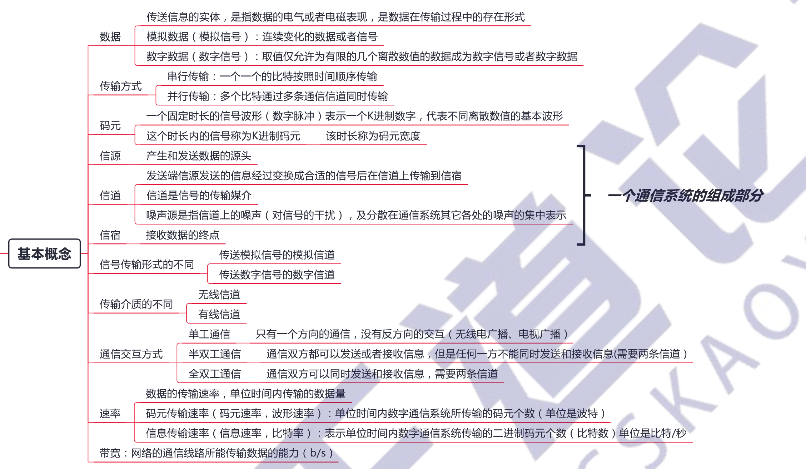

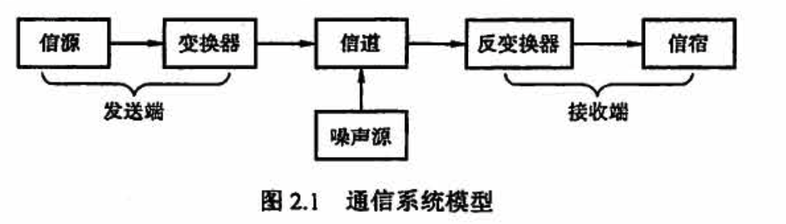

信道上传送的信号有基带信号和宽带信号之分

- 基带信号将数字信号 1和0 直接用两种不同的电压表示，然后送到数字信道上传输（称为基带传输）
- 宽带信号将基带信号进行调制后形成频分复用模拟信号，然后送到模拟信道上传输（称为宽带传输）

### 2、奈奎斯特定理与香农定理

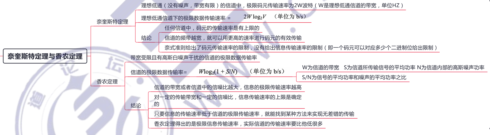

### 3、编码与调制

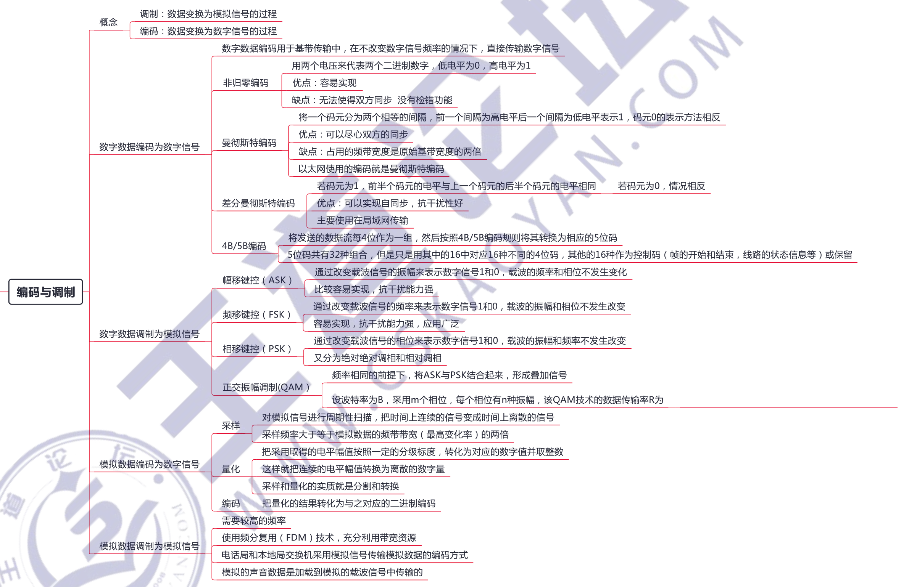

### 4、电路交换、报文交换、分组交换

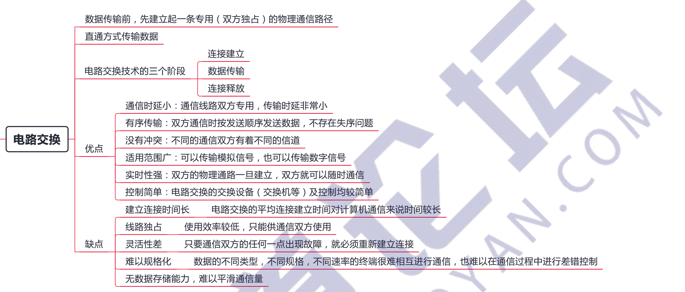

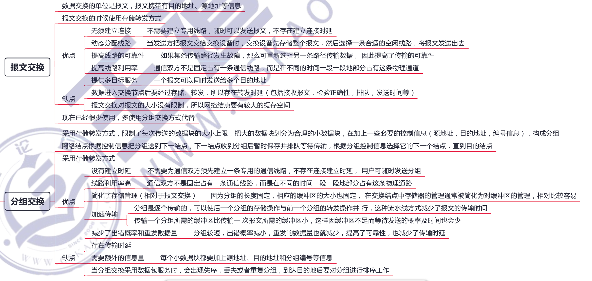

### 5、数据报服务、虚电路服务、通信方式、串行并行传输、同步异步传输

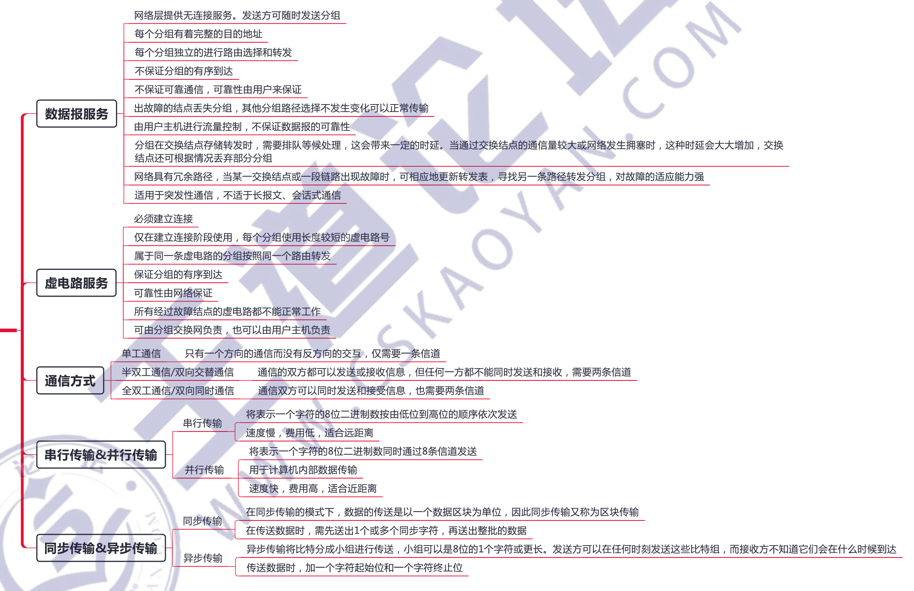

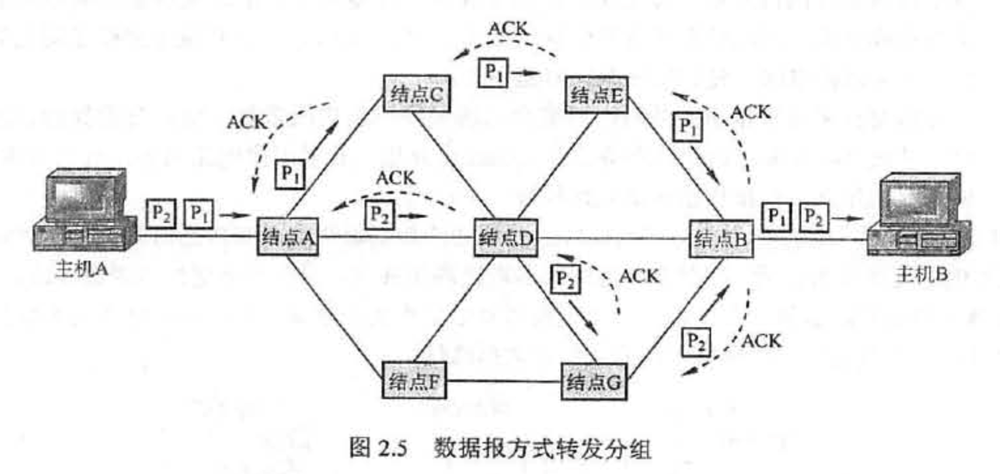

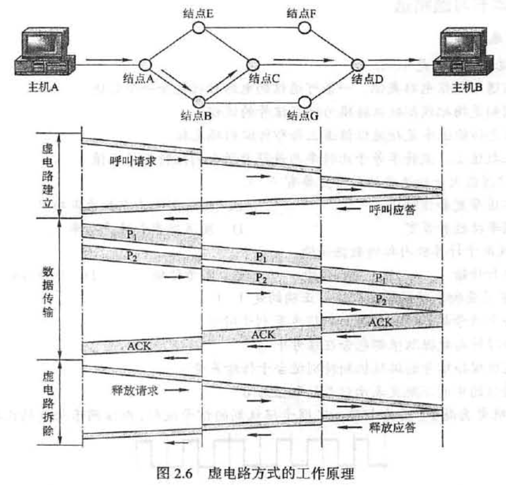

## 2.2 传输介质

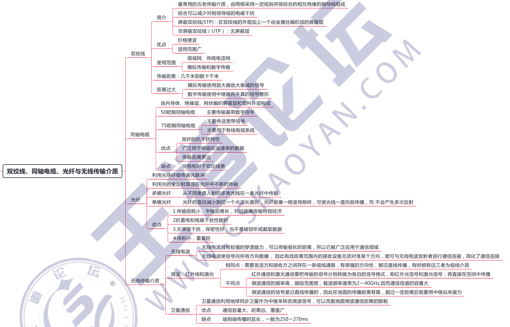

## 2.3 物理设备

## 常见问题

### 1、传输媒体是物理层吗？传输媒体和物理层的主要区别是什么？

传输媒体并不是物理层。由于**传输媒体在物理层的下面**，而物理层是体系结构的第一层，因此有时称传输媒体为0层。**在传输媒体中传输的是信号，但传输媒体并不知道所传输的信号代表什么**。也就是说，传输媒体不知道所传输的信号什么时候是1什么时候是 0。但**物理层由于规定了电气特性，因此能够识别所传送的比特流**。图2.12描述了上述概念。

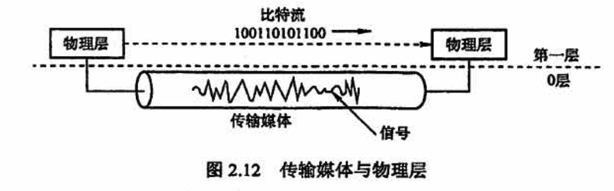

### 2、什么是基带传输、频带传输和宽带传输？三者的区别是什么？

#### 1）基带传输

在**计算机内部或在相邻设备之间近距离传输**时，可以**不经过调制**就在信道上直接进行的传输方式称为「基带传输」。它通常用于局域网。数字基带传输就是在信道中直接传输数字信号，且传输媒体的鳖个带宽都被基带信号占用，双向地传输信息。最简单的方法是用两个高低电平来表示二进制数字，常用的编码方法有不归零编码和曼彻斯特编码。例如，要传输 1010，低电平代表0，高电平代表1，那么在基带传输下，1010 需要向通信线路传输（高、低、高、低电平)。

#### 2）频带传输

**用数字信号对特定频率的载波进行调制**（数字调制），将其变成适合于传送的信号后再进行传输，这种传输方式就是「频带传输」。远距离传输或无线传输时，数字信号必须用频带传输技术进行传输。利用频带传输，不仅解决了电话系统传输数宇信号的问题，而且可以实现多路复用，进而提高传输信道的利用率。同样传输 1010，经过调制，一个码元对应4 个二进制位，假设码元 A代表 1010，那么在模拟信道上传输码元 A 就相当于传输了 1010，这就是频带传输。

#### 3）宽带传输

借助频带传输，可**将链路容量分解成两个或多个信道，每个信道可以携带不同的信号**，这就是「宽带传输」。宽带传输中所有的信道能同时互不干扰地发送信号，链路容量大大增加。比如把信道进行频分复用，划分为2条互不相关的子信道，分别在两条子信道上同时进行频带传输，链路容量就大大增加了，这就是宽带传输。

例如：ASK、PSK

### 3、如何理解同步和异步？什么是同步通信和异步通信？

**计算机网络中**：

在计算机网络中，「同步 Synchronous」的意思很广泛，没有统一的定义。例如，协议的三个要素之一就是“同步”。在网络编程中常提到的同步则主要指某函数的执行方式，即函数调用者需等待函数执行完后才能进入下一步。「异步 Asynchronous」可简单地理解为 “非同步”

**数据通信中**：

「同步通信」的通信双方必须先建立同步，即**双方的时钟要调整到同一个频率**。**收发双方不停地发送和接收连续的同步比特流**。主要有两种同步方式：一种是全网同步，即用一个非常精确的主时钟对全网所有结点上的时钟进行同步；另一种是准同步，即各结点的时钟之间允许有微小的误差，然后采用其他措施实现同步传输。同步通信数据率较高，但实现的代价也较高。

「异步通信」在发送字符时，**所发送的字符之间的时间间隔可以是任意的，但接收端必须时刻做好接收的准备**。发送端可以在**任意时刻开始发送字符**，因此必须在每个字符**开始和结束的地方加上标志**，即开始位和停止位，以便使接收端能够正确地将每个字符接收下来。异步通信也可以帧作为发送的单位。这时，帧的首部和尾部必须设有一些特殊的比特组合，使得接收端能够找出一帧的开始（即帧定界)。异步通信的通信设备简单、便宜，但传输效率较低(因为标志的开销所占比例较大）。图2.13 给出了以字符、帧为单位的异步通信示意图。

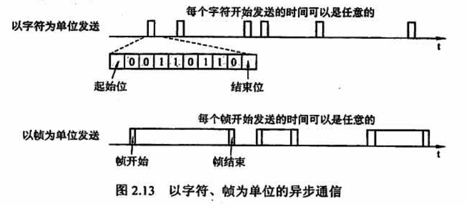

### 4、奈氏准则和香农定理的主要区别是什么？这两个定理对数据通信的意义是什么？

「奈氏准则」指出，**码元传输的速率是受限的**，不能任意提高，否则接收端就不能正确判定码元所携带的比特是 1还是0。（因为存在码元之间的相互干扰）。

奈氏准则是在理想条件下推导出来的。在实际条件下，最高码元传输速率要比理想条件下得出的数值小很多。电信技术人员的任务就是要在实际条件下，**寻找出较好的传输码元波形**，将比特转换为较为合适的传输信号

需要注意的是，奈氏准则并未限制信息传输速率 （b/s）。**要提高信息传输速率，就必须使每个传输的码元能够代表许多比特的信息**，这就需要有很好的编码技术。**但码元所载的比特数确定后，信道的极限数据率也就确定了**。

「香农定理」给出了**信息传输速率的极限**，即对于一定的传输带宽（单位为 Hz）和一定的信噪比，信息传输速率的上限就确定了，这个极限是不能突破的。**要想提高信息传输速率，要么设法提高传输线路的带宽，要么设法提高所传信道的信噪比**，此外没有其他任何办法

香农定理告诉我们，若要得到无限大的信息传输速率，只有两个办法：要么使用无限大的传输带宽（这显然不可能），要么使信号的信噪比无限大，即采用没有噪南的传输信道或使用无限大的发送功率（显然这也不可能）。

注意，奈氏准则和香农定理中「带宽」的单位都是Hz

### 5、信噪比为 S/N，为什么还要取对数 10log_10(S/N)？

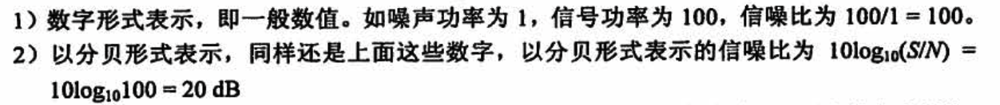

两者的区别在于，前者 （数值）是没有单位的，后者必须加 dB，代表分贝。两者数值上等价。

采用分贝表示的原因是：很多时候，**信号要比噪声强得多**，比如信号比噪声强 10 亿倍，如果用数值表示的话，那么1后面有9个0，很容易丢失一个0。如果用分贝表示，那么仅为 90dB,因此要简单得多，而且不容易出错。**分贝对于表示特别大或特别小的数值极为有利**，这种表示方式在电子通信领域用途很广
